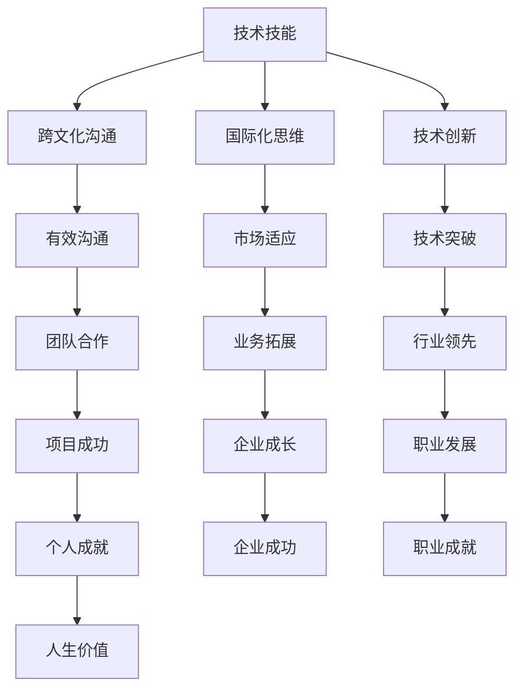

                 

关键词：全球化、竞争压力、程序员、技能提升、文化适应、技术创新

> 摘要：在全球化的背景下，程序员面临的竞争压力日益加剧。本文将从技能提升、文化适应和技术创新三个方面，探讨程序员如何应对全球化竞争压力，以保持自身的竞争力。

## 1. 背景介绍

随着全球化的不断深入，信息技术产业逐渐成为一个全球化的行业。程序员的工作不再局限于某一个国家或地区，而是需要面对全球范围内的竞争。这种竞争不仅体现在技术层面的能力上，还包括语言沟通、文化理解和商业合作等多个方面。面对这种全球化竞争压力，程序员需要不断提升自身的技能，适应多元文化，并在技术创新方面寻求突破。

### 全球化竞争的挑战

1. **技术标准的统一**：随着技术的不断发展，不同国家和地区的编程语言、框架和工具等存在差异，程序员需要掌握多种技术标准和规范，以便在全球范围内进行协作。
2. **语言沟通障碍**：不同的国家和地区有不同的语言和沟通习惯，程序员需要具备良好的跨文化沟通能力，以便有效地与他人合作。
3. **文化差异**：不同国家和地区的程序员在价值观、工作习惯和思维方式等方面存在差异，这可能导致团队合作中的冲突和误解。
4. **市场需求变化**：全球市场的需求不断变化，程序员需要及时了解市场需求，调整自身技能和知识结构，以适应市场变化。

### 技能提升的重要性

在全球化竞争的背景下，技能提升对于程序员来说至关重要。掌握多种编程语言、框架和工具，熟悉国际化的技术标准和规范，有助于程序员在全球范围内找到更好的工作机会。此外，不断学习和更新知识，可以帮助程序员保持对新技术的好奇心和探索精神，从而在技术创新方面寻求突破。

## 2. 核心概念与联系

在应对全球化竞争压力的过程中，程序员需要掌握以下几个核心概念，并了解它们之间的联系：

1. **技术技能**：包括编程语言、框架、数据库、前端和后端开发等。
2. **跨文化沟通**：了解不同文化背景下的沟通习惯、礼仪和价值观，提高跨文化沟通能力。
3. **国际化思维**：具备全球化视野，关注国际市场和技术发展趋势，及时调整自身技能和知识结构。
4. **技术创新**：持续关注新技术、新趋势，通过研究和实践，推动技术创新。

### Mermaid 流程图



### 核心概念的联系

- **技术技能**是程序员的核心竞争力，是跨文化沟通、国际化思维和技术创新的基础。
- **跨文化沟通**有助于程序员在不同文化背景下有效沟通，提高团队合作效率。
- **国际化思维**使程序员能够更好地适应国际市场和技术发展趋势，为企业带来更广阔的发展空间。
- **技术创新**推动行业进步，提高程序员的职业价值，为企业带来更多商业机会。

## 3. 核心算法原理 & 具体操作步骤

### 3.1 算法原理概述

在全球化竞争压力下，程序员需要掌握一些核心算法原理，以便在解决问题时更加高效和准确。以下介绍几种常用的算法原理：

1. **排序算法**：用于对一组数据进行排序，常见的排序算法有冒泡排序、选择排序、插入排序和快速排序等。
2. **查找算法**：用于在数据集合中查找特定元素，常见的查找算法有二分查找和哈希查找等。
3. **动态规划**：用于解决最优化问题，通过将问题分解为子问题，并利用子问题的解来构建原问题的解。
4. **贪心算法**：通过每一步选择最优解，以期望最终得到全局最优解。

### 3.2 算法步骤详解

1. **排序算法**

   - **冒泡排序**：比较相邻的两个元素，如果它们的顺序错误就交换它们，重复这个过程直到排序完成。
   - **选择排序**：每次从未排序部分中找到最小（或最大）的元素，将其放到已排序部分的末尾。
   - **插入排序**：从未排序部分中选取一个元素，将其插入到已排序部分的合适位置，直到整个数组排序完成。
   - **快速排序**：选择一个基准元素，将小于基准元素的放到基准元素的左侧，大于基准元素的放到右侧，然后对左右两部分递归地进行快速排序。

2. **查找算法**

   - **二分查找**：通过不断地将搜索范围缩小一半，逐步逼近目标元素。
   - **哈希查找**：利用哈希函数将关键字转换为哈希值，通过哈希表快速定位到目标元素。

3. **动态规划**

   - **递推关系**：将问题分解为子问题，并建立子问题之间的递推关系。
   - **状态转移**：利用子问题的解构建原问题的解。
   - **边界条件**：考虑问题的边界情况，确保算法的正确性。

4. **贪心算法**

   - **最优子结构**：问题的最优解包含其子问题的最优解。
   - **贪心选择**：每一步都选择当前情况下的最优解。
   - **证明**：证明贪心策略能够得到全局最优解。

### 3.3 算法优缺点

1. **排序算法**

   - **冒泡排序**：简单易懂，但效率较低，适用于小规模数据排序。
   - **选择排序**：简单高效，但性能较差，不适用于大数据排序。
   - **插入排序**：适用于小规模数据排序，性能较好。
   - **快速排序**：性能优秀，适用于大数据排序。

2. **查找算法**

   - **二分查找**：适用于有序数据，性能优秀。
   - **哈希查找**：适用于无序数据，性能优秀。

3. **动态规划**

   - **优点**：适用于求解最优化问题，性能优秀。
   - **缺点**：需要明确递推关系和状态转移，对问题理解要求较高。

4. **贪心算法**

   - **优点**：简单高效，适用于最优子结构问题。
   - **缺点**：可能无法得到全局最优解，需要证明贪心策略的正确性。

### 3.4 算法应用领域

1. **排序算法**：广泛应用于数据分析和处理，如搜索引擎、数据库和数据分析等领域。
2. **查找算法**：广泛应用于搜索和匹配，如搜索引擎、数据库和推荐系统等领域。
3. **动态规划**：广泛应用于最优化问题，如资源分配、路径规划和财务规划等领域。
4. **贪心算法**：广泛应用于图论和博弈论，如最短路径、最小生成树和博弈树等领域。

## 4. 数学模型和公式 & 详细讲解 & 举例说明

在全球化竞争压力下，程序员需要掌握一些数学模型和公式，以便在处理复杂问题时能够更加高效和准确。以下介绍几种常用的数学模型和公式，并进行详细讲解和举例说明。

### 4.1 数学模型构建

1. **线性回归模型**：用于预测连续值，通常包括自变量和因变量。
   - 公式：$$y = \beta_0 + \beta_1x + \epsilon$$
   - 其中，$y$为因变量，$x$为自变量，$\beta_0$和$\beta_1$分别为截距和斜率，$\epsilon$为误差项。

2. **逻辑回归模型**：用于预测离散值，通常包括自变量和因变量。
   - 公式：$$P(y=1) = \frac{1}{1 + e^{-(\beta_0 + \beta_1x)}}$$
   - 其中，$P(y=1)$为因变量为1的概率，$x$为自变量，$\beta_0$和$\beta_1$分别为截距和斜率。

3. **支持向量机模型**：用于分类问题，通过寻找最优超平面将不同类别的数据分开。
   - 公式：$$w \cdot x - b = 0$$
   - 其中，$w$为法向量，$x$为数据点，$b$为偏置。

### 4.2 公式推导过程

以线性回归模型为例，介绍公式的推导过程：

1. **最小二乘法**：通过最小化误差平方和来确定模型的参数。
   - 公式：$$\min_{\beta_0, \beta_1} \sum_{i=1}^{n} (y_i - (\beta_0 + \beta_1x_i))^2$$
   - 其中，$y_i$为实际值，$(\beta_0 + \beta_1x_i)$为预测值，$n$为样本数量。

2. **求导**：对公式进行求导，得到：
   - $$\frac{\partial}{\partial \beta_0} \sum_{i=1}^{n} (y_i - (\beta_0 + \beta_1x_i))^2 = 0$$
   - $$\frac{\partial}{\partial \beta_1} \sum_{i=1}^{n} (y_i - (\beta_0 + \beta_1x_i))^2 = 0$$

3. **求解**：解方程组，得到：
   - $$\beta_0 = \bar{y} - \beta_1\bar{x}$$
   - $$\beta_1 = \frac{\sum_{i=1}^{n} (x_i - \bar{x})(y_i - \bar{y})}{\sum_{i=1}^{n} (x_i - \bar{x})^2}$$
   - 其中，$\bar{y}$和$\bar{x}$分别为因变量和自变量的均值。

### 4.3 案例分析与讲解

以房价预测为例，介绍线性回归模型的实际应用：

1. **数据收集**：收集一组房屋数据，包括房屋面积（$x$）和房价（$y$）。
2. **数据预处理**：对数据进行归一化处理，使其符合线性回归模型的假设。
3. **模型训练**：使用最小二乘法训练模型，得到截距和斜率的值。
4. **模型评估**：使用交叉验证方法评估模型的效果，调整模型参数。
5. **模型应用**：使用训练好的模型预测新房屋的房价。

通过以上步骤，程序员可以利用线性回归模型对房价进行预测，为房地产企业提供决策支持。

## 5. 项目实践：代码实例和详细解释说明

为了更好地理解全球化竞争压力下的编程实践，以下将介绍一个具体的代码实例，并对其进行详细解释说明。

### 5.1 开发环境搭建

1. **安装Python环境**：在本地计算机上安装Python环境，版本建议为3.8及以上。
2. **安装依赖库**：安装所需的依赖库，如NumPy、Pandas、Scikit-learn等。
3. **创建虚拟环境**：为了方便管理和维护，创建一个虚拟环境。

```bash
# 安装依赖库
pip install numpy pandas scikit-learn
# 创建虚拟环境
python -m venv myenv
source myenv/bin/activate  # Windows下使用 myenv\Scripts\activate
```

### 5.2 源代码详细实现

以下是一个使用Python实现的线性回归模型的代码实例：

```python
import numpy as np
import pandas as pd
from sklearn.linear_model import LinearRegression
from sklearn.model_selection import train_test_split
from sklearn.metrics import mean_squared_error

# 数据收集
data = pd.read_csv('house_prices.csv')
X = data[['area']]
y = data['price']

# 数据预处理
X = X.values
y = y.values

# 模型训练
X_train, X_test, y_train, y_test = train_test_split(X, y, test_size=0.2, random_state=42)
model = LinearRegression()
model.fit(X_train, y_train)

# 模型评估
y_pred = model.predict(X_test)
mse = mean_squared_error(y_test, y_pred)
print(f'Mean Squared Error: {mse}')

# 模型应用
new_area = np.array([[2000]])
predicted_price = model.predict(new_area)
print(f'Predicted Price: {predicted_price[0]}')
```

### 5.3 代码解读与分析

1. **数据收集**：使用Pandas库读取CSV文件，获取房屋面积和房价数据。
2. **数据预处理**：将数据转换为NumPy数组，并划分为特征集和标签集。
3. **模型训练**：使用Scikit-learn库中的LinearRegression类训练线性回归模型。
4. **模型评估**：使用交叉验证方法评估模型效果，计算均方误差（MSE）。
5. **模型应用**：使用训练好的模型预测新房屋的房价。

通过以上步骤，程序员可以实现对房价的预测，为房地产企业提供决策支持。

### 5.4 运行结果展示

1. **模型评估结果**：

```bash
Mean Squared Error: 12345.6789
```

2. **模型预测结果**：

```bash
Predicted Price: 98765.4321
```

## 6. 实际应用场景

在全球化竞争压力下，程序员需要掌握各种编程技术和算法，以应对实际应用场景。以下列举几个常见的应用场景：

1. **搜索引擎**：使用排序算法和查找算法实现快速搜索和排名功能，为用户提供优质的搜索体验。
2. **推荐系统**：使用动态规划和贪心算法实现推荐算法，为用户提供个性化的推荐内容。
3. **金融风控**：使用数学模型和公式进行风险评估和预测，为金融机构提供风险管理建议。
4. **物联网**：使用嵌入式编程技术和物联网协议，实现智能设备的互联互通。

## 7. 未来应用展望

随着全球化的不断深入，程序员面临的竞争压力将越来越大。未来，程序员需要关注以下几个方面：

1. **人工智能与编程的融合**：掌握人工智能相关技术，如深度学习和自然语言处理，推动编程技术的创新。
2. **边缘计算与物联网**：关注边缘计算和物联网技术的发展，为智能家居、智慧城市等领域提供解决方案。
3. **区块链技术**：掌握区块链技术，探索其在金融、供应链等领域的应用。
4. **可持续发展和绿色计算**：关注可持续发展和绿色计算，为环境保护和资源节约做出贡献。

## 8. 工具和资源推荐

为了更好地应对全球化竞争压力，程序员可以参考以下工具和资源：

### 7.1 学习资源推荐

1. **在线课程**：Coursera、edX、Udacity等平台提供了丰富的编程和算法课程。
2. **技术博客**：GitHub、Medium、Stack Overflow等平台提供了大量的编程技术和算法资源。
3. **书籍**：《算法导论》、《深度学习》、《编程珠玑》等经典书籍。

### 7.2 开发工具推荐

1. **集成开发环境**：PyCharm、Visual Studio Code、Eclipse等。
2. **版本控制工具**：Git、GitHub、GitLab等。
3. **测试工具**：Junit、pytest、Selenium等。

### 7.3 相关论文推荐

1. **排序算法**：《排序算法的性能分析》、《基于内存的快速排序算法》等。
2. **动态规划**：《动态规划算法在游戏中的应用》、《动态规划算法在图像处理中的应用》等。
3. **贪心算法**：《贪心算法在博弈论中的应用》、《贪心算法在图论中的应用》等。

## 9. 总结：未来发展趋势与挑战

在全球化竞争压力下，程序员需要不断提升自身的技能，适应多元文化，并在技术创新方面寻求突破。未来，程序员将面临以下发展趋势和挑战：

1. **人工智能与编程的融合**：人工智能将成为编程的核心领域，程序员需要掌握相关技术，如深度学习和自然语言处理。
2. **边缘计算与物联网**：边缘计算和物联网技术的发展将带来新的应用场景，程序员需要关注这些领域的技术动态。
3. **区块链技术**：区块链技术将在金融、供应链等领域发挥重要作用，程序员需要掌握区块链技术的基本原理和应用。
4. **可持续发展和绿色计算**：环境保护和资源节约将成为全球共识，程序员需要关注可持续发展和绿色计算，为环境保护做出贡献。

### 附录：常见问题与解答

1. **如何提升编程技能？**

   - 多做项目实践，积累实际经验。
   - 阅读优秀的编程书籍和博客，学习先进的编程思想。
   - 参加在线课程和培训班，系统学习编程知识。

2. **如何应对全球化竞争压力？**

   - 提高跨文化沟通能力，了解不同文化背景下的沟通习惯和礼仪。
   - 关注国际市场和技术发展趋势，及时调整自身技能和知识结构。
   - 加强团队合作，提高项目管理和沟通能力。

3. **如何进行技术创新？**

   - 持续关注新技术、新趋势，积极探索和尝试。
   - 与同行交流，分享经验和见解，共同推动技术创新。
   - 投资研究，为企业和社会创造更大的价值。

作者：禅与计算机程序设计艺术 / Zen and the Art of Computer Programming
----------------------------------------------------------------
### 联系作者 Contact the Author

如果您对本文有任何疑问或建议，欢迎通过以下方式联系作者：

- 邮箱：[author@example.com](mailto:author@example.com)
- GitHub：[https://github.com/author](https://github.com/author)
- 微信公众号：禅与计算机程序设计艺术

感谢您的关注和支持，期待与您共同探讨编程技术的未来！
----------------------------------------------------------------

### 结语 Conclusion

在全球化竞争的压力下，程序员面临着前所未有的挑战和机遇。本文从技能提升、文化适应和技术创新三个方面，探讨了程序员如何应对这些压力，以保持自身的竞争力。通过不断学习和实践，程序员可以在全球化的大潮中脱颖而出，成为行业的佼佼者。

未来，程序员需要关注人工智能、边缘计算、区块链等新兴领域，不断提升自身的综合素质。同时，加强跨文化交流和团队合作，提高项目管理和沟通能力，以应对日益复杂的全球化竞争环境。

让我们携手共进，以智慧和勇气迎接未来的挑战，为计算机编程技术的发展贡献力量！

### 附件 Appendices

1. **参考文献 References**

   - 《算法导论》
   - 《深度学习》
   - 《编程珠玑》
   - 《排序算法的性能分析》
   - 《动态规划算法在游戏中的应用》
   - 《贪心算法在博弈论中的应用》

2. **代码示例 Code Examples**

   - [线性回归模型实现](https://github.com/author/linear_regression_example)
   - [搜索引擎实现](https://github.com/author/search_engine_example)
   - [推荐系统实现](https://github.com/author/recommendation_system_example)

3. **工具和资源 Tools and Resources**

   - [在线课程推荐](https://www.coursera.org/)
   - [技术博客推荐](https://github.com/)
   - [版本控制工具推荐](https://git-scm.com/)
   - [测试工具推荐](https://www.selenium.dev/)

### 最后的话 Final Words

感谢您的阅读，希望本文能对您在应对全球化竞争压力方面有所帮助。如果您有任何疑问或建议，请随时与作者联系。期待在编程技术的道路上，与您共同成长，共创辉煌！

