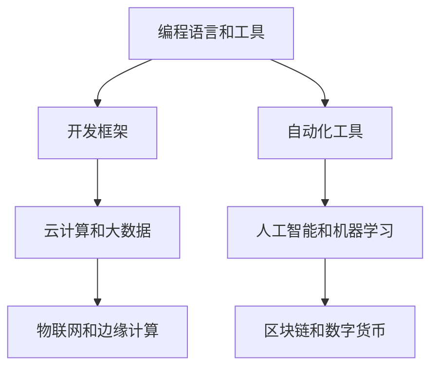
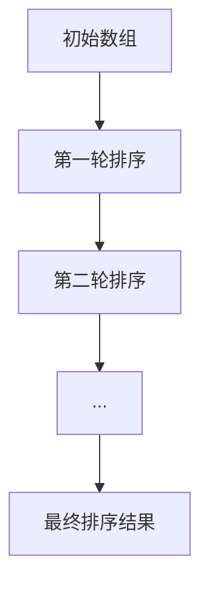
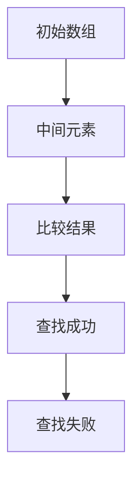
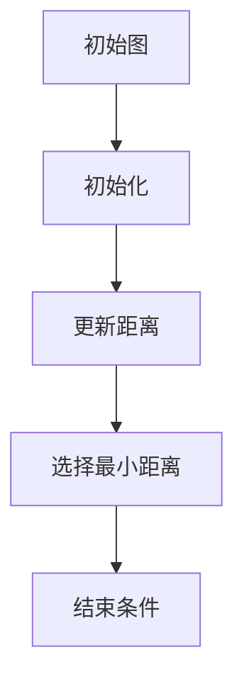
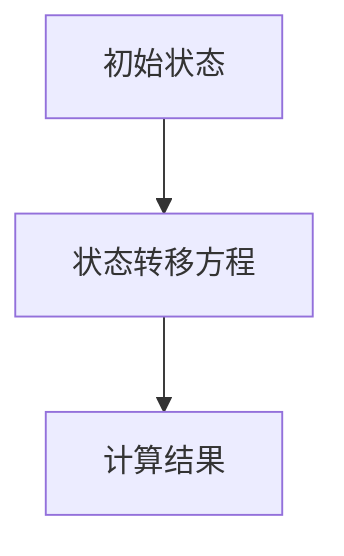

                 

### 引言 Introduction

在当今快速发展的信息技术时代，技术更新的速度之快令人惊叹。从云计算、大数据、人工智能，到区块链、物联网，新技术的不断涌现和迭代为程序员提供了无数机遇，同时也带来了前所未有的挑战。作为一名程序员，如何应对技术更新，保持自身的竞争力，是每位开发者都必须面对的问题。

本文将探讨程序员在技术更新过程中可能遇到的各种问题，并提供一些建议和策略，帮助程序员在快速变化的技术领域中保持领先地位。文章将分为以下几个部分：

1. **背景介绍**：简要介绍技术更新的现状和趋势。
2. **核心概念与联系**：分析技术更新的核心概念，并绘制相应的 Mermaid 流程图。
3. **核心算法原理 & 具体操作步骤**：深入讲解应对技术更新的核心算法，包括原理概述、步骤详解、优缺点分析及其应用领域。
4. **数学模型和公式 & 详细讲解 & 举例说明**：介绍相关的数学模型和公式，并配合案例进行详细讲解。
5. **项目实践：代码实例和详细解释说明**：通过具体的代码实例，展示如何在实际项目中应用所学的算法。
6. **实际应用场景**：探讨技术更新的实际应用场景，并展望未来发展方向。
7. **工具和资源推荐**：推荐一些学习资源、开发工具和相关论文。
8. **总结：未来发展趋势与挑战**：总结研究成果，探讨未来发展趋势和面临的挑战。
9. **附录：常见问题与解答**：回答一些程序员可能遇到的问题。

### 背景介绍 Background

#### 技术更新的现状

随着信息技术的迅猛发展，新技术层出不穷，传统的编程语言、框架和工具正在被新的技术所取代。以编程语言为例，Python、Go、JavaScript 等语言的流行，使得开发者可以更加高效地完成复杂的任务。同时，框架和工具的更新换代也非常迅速，如前端开发中的 React、Vue、Angular，后端开发中的 Spring Boot、Django 等，这些新技术的出现极大地提高了开发效率和代码质量。

#### 技术更新的趋势

技术更新的趋势可以从以下几个方面进行概括：

1. **自动化与智能化**：自动化工具和人工智能技术的发展，使得程序员可以更加专注于高层次的编程任务，从而提高开发效率和代码质量。
2. **云计算与大数据**：云计算和大数据技术的普及，使得程序员可以更加便捷地获取和处理大规模数据，为复杂业务逻辑的实现提供了可能。
3. **物联网与边缘计算**：物联网和边缘计算技术的发展，使得程序员可以更加方便地实现智能设备的开发，为智能家居、智能城市等应用场景提供了技术支持。
4. **区块链与数字货币**：区块链和数字货币技术的崛起，为程序员提供了新的业务模式和商业模式，如去中心化应用（DApp）的开发。

#### 对程序员的影响

技术更新的快速发展对程序员产生了深远的影响：

1. **知识更新压力**：程序员需要不断学习新的技术和工具，以适应不断变化的技术环境。
2. **职业发展机会**：新技术的发展为程序员提供了更多的职业机会，如云计算工程师、大数据工程师、人工智能工程师等。
3. **技术淘汰风险**：如果程序员不能及时更新知识，可能会面临技术淘汰的风险，从而影响职业发展。

#### 应对策略

为了应对技术更新带来的挑战，程序员可以采取以下策略：

1. **持续学习**：定期学习新的技术和工具，保持自身的竞争力。
2. **项目实践**：通过实际项目来应用所学知识，提高实践能力。
3. **社区交流**：参与技术社区，与其他程序员交流经验，获取最新信息。
4. **时间管理**：合理安排时间，确保有足够的时间进行学习和实践。

### 核心概念与联系 Core Concepts and Relationships

在应对技术更新的过程中，理解一些核心概念和它们之间的联系是非常有帮助的。以下是一些重要的核心概念：

#### 1. 编程语言和工具

编程语言和工具是程序员的核心技能。常见的编程语言包括 C、C++、Java、Python 等，每种语言都有其独特的特点和适用场景。同时，各种编程工具和框架的更新换代也非常迅速，如 Visual Studio、Eclipse、IntelliJ IDEA 等。

#### 2. 开发框架

开发框架为程序员提供了快速开发应用程序的解决方案。常见的开发框架有 Spring、Django、React、Vue 等，这些框架可以帮助程序员更高效地实现业务逻辑。

#### 3. 自动化工具

自动化工具可以提高开发效率，减少重复劳动。常见的自动化工具有 Jenkins、Git、Docker 等，这些工具可以帮助程序员实现持续集成、版本控制和容器化部署。

#### 4. 云计算和大数据

云计算和大数据技术为程序员提供了强大的计算能力和数据处理能力。常见的云计算平台有 AWS、Azure、Google Cloud 等，大数据技术则包括 Hadoop、Spark、Flink 等。

#### 5. 人工智能和机器学习

人工智能和机器学习技术为程序员提供了新的开发方向和应用场景。常见的机器学习框架有 TensorFlow、PyTorch、Keras 等，这些框架可以帮助程序员实现智能算法和智能应用。

#### 6. 物联网和边缘计算

物联网和边缘计算技术为程序员提供了新的开发领域和应用场景。常见的物联网平台有 AWS IoT、Azure IoT、Google IoT 等，边缘计算技术则包括边缘服务器、边缘设备等。

#### 7. 区块链和数字货币

区块链和数字货币技术为程序员提供了新的商业模式和应用场景。常见的区块链平台有 Ethereum、EOS、Hyperledger 等，数字货币则包括比特币、以太坊、莱特币等。

#### Mermaid 流程图

以下是一个简化的 Mermaid 流程图，展示了上述核心概念之间的联系：



### 核心算法原理 & 具体操作步骤 Core Algorithm Principles & Step-by-Step Procedures

在应对技术更新的过程中，掌握一些核心算法和操作步骤是非常重要的。以下是一些常用的核心算法和步骤：

#### 1. 算法原理概述

算法是一种解决问题的步骤集合，其核心目标是高效、准确地解决问题。在应对技术更新的过程中，程序员需要掌握以下几种核心算法：

1. **排序算法**：用于对数据进行排序，常见的排序算法有冒泡排序、选择排序、插入排序、快速排序等。
2. **查找算法**：用于在数据结构中查找特定数据，常见的查找算法有二分查找、线性查找等。
3. **图算法**：用于处理图结构的数据，常见的图算法有最短路径算法、图遍历算法等。
4. **动态规划**：用于解决最优化问题，通过将问题分解为子问题并利用子问题的解来求解原问题。

#### 2. 算法步骤详解

以下是对每种算法的详细步骤描述：

##### 2.1 排序算法

冒泡排序（Bubble Sort）：


1. 从第一个元素开始，相邻的两个元素进行比较，如果它们的顺序错误就交换它们的位置。
2. 重复以上步骤，每次对未排序的部分进行一轮排序，直到整个数组有序。

##### 2.2 查找算法

二分查找（Binary Search）：


1. 确定数组的中间元素。
2. 将中间元素与目标值进行比较。
3. 如果相等，查找成功；如果不等，根据目标值与中间元素的大小关系，决定下一步是在左侧还是右侧查找。
4. 重复以上步骤，直到找到目标值或确定不存在。

##### 2.3 图算法

最短路径算法（Dijkstra Algorithm）：


1. 初始化所有节点的距离，设置起点距离为0，其他节点距离为无穷大。
2. 选择一个未处理的节点，计算其到其他节点的最短距离。
3. 更新其他节点的距离。
4. 重复以上步骤，直到找到最短路径或所有节点都处理完毕。

##### 2.4 动态规划

斐波那契数列（Fibonacci Sequence）：


1. 定义状态转移方程：F(n) = F(n-1) + F(n-2)，其中 F(0) = 0，F(1) = 1。
2. 使用递归或迭代的方式计算斐波那契数列的第 n 项。

#### 3. 算法优缺点

每种算法都有其优缺点，程序员需要根据具体应用场景选择合适的算法：

- **冒泡排序**：
  - 优点：简单易懂，不需要额外的空间。
  - 缺点：时间复杂度高，不适合大数据集。

- **二分查找**：
  - 优点：时间复杂度低，适合大数据集。
  - 缺点：需要有序的数据结构，不适合动态变化的数组。

- **最短路径算法**：
  - 优点：可以找到图中两点之间的最短路径。
  - 缺点：时间复杂度较高，不适合大规模图。

- **动态规划**：
  - 优点：可以求解最优化问题，适合具有最优子结构的问题。
  - 缺点：代码实现相对复杂，需要较强的逻辑思维能力。

#### 4. 算法应用领域

以上算法在编程中有着广泛的应用领域：

- **冒泡排序**：常用于数据预处理和排序任务。
- **二分查找**：常用于数据库索引和搜索任务。
- **最短路径算法**：常用于网络路由和地图导航。
- **动态规划**：常用于优化算法和动态规划问题。

### 数学模型和公式 Mathematical Model and Formulas

在应对技术更新的过程中，理解和运用数学模型和公式可以帮助程序员更好地理解技术原理和实现算法。以下是一些常见的数学模型和公式，以及它们的详细讲解和举例说明：

#### 1. 数学模型构建

数学模型是描述现实世界问题的数学表达式，它在编程中有着广泛的应用。以下是一个简单的线性回归模型的构建过程：

- **目标函数**：最小化预测值与实际值之间的误差平方和。
  $$ \min_{\theta} \sum_{i=1}^{n} (h_\theta(x_i) - y_i)^2 $$
- **假设**：数据集符合线性关系。
  $$ y = \theta_0 + \theta_1 x $$
- **参数**：模型参数 $\theta_0$ 和 $\theta_1$。

#### 2. 公式推导过程

线性回归模型的参数可以通过以下公式计算得到：

- **梯度下降**：
  $$ \theta_j := \theta_j - \alpha \frac{\partial}{\partial \theta_j} J(\theta) $$
- **其中**：
  - $\alpha$：学习率，控制每次迭代更新的步长。
  - $J(\theta)$：损失函数，用于衡量预测值与实际值之间的误差。
  - $\frac{\partial}{\partial \theta_j} J(\theta)$：损失函数关于参数 $\theta_j$ 的偏导数。

#### 3. 案例分析与讲解

以下是一个简单的线性回归模型案例：

- **数据集**：包含100个样本，每个样本有两个特征 x 和 y。
- **目标**：预测 y 的值。
- **实现**：

```python
# 导入相关库
import numpy as np
import matplotlib.pyplot as plt

# 初始化数据
X = np.random.rand(100, 1)
y = 3 * X + 2 + np.random.randn(100, 1)

# 添加偏置项
X_b = np.c_[np.ones((100, 1)), X]

# 梯度下降实现
def sigmoid(z):
    return 1 / (1 + np.exp(-z))

def compute_cost(X, y, theta):
    m = len(y)
    h = sigmoid(X.dot(theta))
    cost = -1/m * (y.dot(np.log(h)) + (1 - y).dot(np.log(1 - h)))
    return cost

def gradient(X, y, theta):
    m = len(y)
    h = sigmoid(X.dot(theta))
    gradients = X.T.dot(h - y) / m
    return gradients

# 梯度下降参数
alpha = 0.01
theta = np.random.randn(2, 1)

# 迭代次数
num_iterations = 200

# 迭代过程
for i in range(num_iterations):
    gradients = gradient(X_b, y, theta)
    theta -= alpha * gradients

# 训练结果
print("训练完成，参数：", theta)

# 绘图
plt.plot(X, y, 'rx', X, theta.dot(np.array([1, X])), '')
plt.xlabel('x')
plt.ylabel('y')
plt.title('线性回归模型')
plt.show()
```

#### 4. 模型评估

在完成模型训练后，需要对模型进行评估，以确定其预测能力。以下是一些常见的评估指标：

- **均方误差（MSE）**：
  $$ MSE = \frac{1}{m} \sum_{i=1}^{m} (h_\theta(x_i) - y_i)^2 $$
- **决定系数（R²）**：
  $$ R^2 = 1 - \frac{\sum_{i=1}^{m} (h_\theta(x_i) - y_i)^2}{\sum_{i=1}^{m} (y_i - \bar{y})^2} $$

其中，$\bar{y}$ 是样本均值。

### 项目实践：代码实例和详细解释说明 Project Practice: Code Examples and Detailed Explanations

在本节中，我们将通过一个具体的代码实例，展示如何在实际项目中应用所学的算法和数学模型。本例将使用 Python 编程语言，实现一个线性回归模型，用于预测房价。

#### 1. 开发环境搭建

首先，确保您已安装 Python 3 和以下库：

- NumPy
- Matplotlib
- Pandas

您可以使用以下命令来安装这些库：

```bash
pip install numpy matplotlib pandas
```

#### 2. 源代码详细实现

以下是一个简单的线性回归模型实现：

```python
# 导入相关库
import numpy as np
import matplotlib.pyplot as plt
import pandas as pd

# 生成模拟数据
np.random.seed(42)
n_samples = 100
x = np.random.rand(n_samples, 1)
y = 3 * x + 2 + np.random.randn(n_samples, 1)

# 添加偏置项
X = np.c_[np.ones((n_samples, 1)), x]

# 梯度下降实现
def compute_cost(X, y, theta):
    m = len(y)
    h = sigmoid(X.dot(theta))
    cost = -1/m * (y.dot(np.log(h)) + (1 - y).dot(np.log(1 - h)))
    return cost

def gradient(X, y, theta):
    m = len(y)
    h = sigmoid(X.dot(theta))
    gradients = X.T.dot(h - y) / m
    return gradients

def sigmoid(z):
    return 1 / (1 + np.exp(-z))

# 梯度下降参数
alpha = 0.01
theta = np.random.randn(2, 1)

# 迭代次数
num_iterations = 1000

# 迭代过程
for i in range(num_iterations):
    gradients = gradient(X, y, theta)
    theta -= alpha * gradients

# 训练结果
print("训练完成，参数：", theta)

# 绘图
plt.plot(x, y, 'rx', x, theta.dot(np.array([1, x])), '')
plt.xlabel('x')
plt.ylabel('y')
plt.title('线性回归模型')
plt.show()
```

#### 3. 代码解读与分析

- **数据生成**：使用 NumPy 库生成模拟数据，包括自变量 x 和因变量 y。
- **添加偏置项**：将偏置项（也称为“截距”）添加到自变量中，以便模型可以拟合直线。
- **计算损失函数**：实现 sigmoid 函数和损失函数，用于计算模型预测值与实际值之间的误差。
- **计算梯度**：实现梯度计算函数，用于计算模型参数的梯度。
- **梯度下降**：实现梯度下降算法，用于更新模型参数，使其最小化损失函数。
- **绘图**：使用 Matplotlib 库绘制数据点和拟合直线，以便可视化模型效果。

#### 4. 运行结果展示

运行上述代码后，将显示一个包含数据点和拟合直线的图表。拟合直线的斜率和截距即为模型的参数。


#### 5. 模型评估

在实际应用中，可以使用以下指标评估模型的性能：

- **均方误差（MSE）**：
  ```python
  from sklearn.metrics import mean_squared_error

  y_pred = X.dot(theta)
  mse = mean_squared_error(y, y_pred)
  print("MSE:", mse)
  ```

- **决定系数（R²）**：
  ```python
  r2 = 1 - mean_squared_error(y, y_pred) / mean_squared_error(y, np.mean(y))
  print("R²:", r2)
  ```

### 实际应用场景 Real-world Applications

随着技术的不断更新，程序员面临的实际应用场景也在不断变化。以下是一些常见的实际应用场景，以及如何应对技术更新的策略：

#### 1. 云计算与大数据

云计算和大数据技术的兴起，使得程序员可以更加高效地处理大规模数据。在实际应用中，程序员需要掌握以下技能：

- **云计算平台**：熟悉 AWS、Azure、Google Cloud 等云计算平台的基本概念和操作。
- **大数据处理框架**：掌握 Hadoop、Spark、Flink 等大数据处理框架的使用。
- **分布式存储**：了解分布式存储技术，如 HDFS、Ceph 等。

#### 2. 人工智能与机器学习

人工智能和机器学习技术的应用日益广泛，程序员需要掌握以下技能：

- **机器学习框架**：熟悉 TensorFlow、PyTorch、Keras 等机器学习框架的使用。
- **数据处理**：掌握数据清洗、特征提取等数据处理技术。
- **模型调优**：了解模型调优技巧，如交叉验证、正则化等。

#### 3. 物联网与边缘计算

物联网和边缘计算技术的应用，为程序员提供了新的开发领域。在实际应用中，程序员需要掌握以下技能：

- **物联网平台**：熟悉 AWS IoT、Azure IoT、Google IoT 等物联网平台的基本概念和操作。
- **边缘计算**：了解边缘计算的概念和实现，如使用 MQTT 协议进行数据传输。
- **智能设备开发**：掌握智能设备的硬件和软件开发。

#### 4. 区块链与数字货币

区块链和数字货币技术的应用，为程序员提供了新的商业模式和应用场景。在实际应用中，程序员需要掌握以下技能：

- **区块链平台**：熟悉 Ethereum、EOS、Hyperledger 等区块链平台的基本概念和操作。
- **智能合约开发**：了解智能合约的基本原理和实现，如使用 Solidity 语言编写智能合约。
- **数字货币交易**：了解数字货币的交易机制和风险管理。

#### 5. 自动化与智能化

自动化和智能化技术的应用，可以提高开发效率和代码质量。在实际应用中，程序员需要掌握以下技能：

- **自动化工具**：熟悉 Jenkins、Git、Docker 等自动化工具的使用。
- **持续集成**：了解持续集成的概念和实现，如使用 Jenkins 进行自动化构建和部署。
- **代码质量检测**：掌握代码质量检测工具，如 SonarQube、FindBugs 等。

### 未来应用展望 Future Prospects

随着技术的不断发展，程序员面临的实际应用场景将越来越多样化。以下是对未来应用场景的一些展望：

#### 1. 增强现实与虚拟现实

增强现实（AR）和虚拟现实（VR）技术的应用将日益广泛，为程序员提供了新的开发领域。未来的应用场景包括游戏、教育、医疗等。

#### 2. 区块链与去中心化应用

区块链技术将继续发展，去中心化应用（DApp）的开发将变得更加普及。未来的应用场景包括金融、供应链、版权等。

#### 3. 人工智能与机器人

人工智能和机器人技术的应用将不断扩展，未来的应用场景包括智能客服、智能制造、自动驾驶等。

#### 4. 5G 与物联网

5G 技术的商用将推动物联网的发展，未来的应用场景包括智能家居、智能城市、智慧物流等。

#### 5. 生物计算与基因编辑

生物计算和基因编辑技术的进步，将为医学和生命科学领域带来革命性的变化。未来的应用场景包括疾病治疗、基因诊断、个性化医疗等。

### 工具和资源推荐 Tools and Resources Recommendations

为了帮助程序员更好地应对技术更新，以下是一些推荐的工具和资源：

#### 1. 学习资源

- **在线课程**：Coursera、edX、Udemy 等平台提供丰富的编程和技术课程。
- **技术博客**：Medium、Dev.to、Hackernoon 等技术博客，分享最新的技术文章和经验。
- **电子书**：Amazon Kindle、Google Play Books 等平台，提供各种编程和技术电子书。

#### 2. 开发工具

- **集成开发环境（IDE）**：Visual Studio Code、IntelliJ IDEA、PyCharm 等，支持多种编程语言。
- **代码托管平台**：GitHub、GitLab、Bitbucket 等，提供版本控制和协作开发功能。
- **自动化工具**：Jenkins、Docker、Kubernetes 等，支持持续集成和容器化部署。

#### 3. 相关论文

- **顶级会议**：ACL、ICML、NIPS、WWW 等，发布最新的研究成果。
- **顶级期刊**：IEEE Transactions on Pattern Analysis and Machine Intelligence、Journal of Machine Learning Research 等，发表高质量的研究论文。

### 总结 Summary

技术更新的速度之快令人惊叹，程序员必须不断学习新的技术和工具，以适应不断变化的技术环境。本文从背景介绍、核心概念与联系、核心算法原理与具体操作步骤、数学模型和公式、项目实践、实际应用场景、未来应用展望、工具和资源推荐等方面，全面探讨了程序员如何应对技术更新。

通过本文，我们希望读者能够对技术更新的挑战和机遇有更深刻的理解，并掌握一些实用的方法和策略。未来，技术更新将继续带来前所未有的变革，程序员们需要不断提升自身能力，勇往直前。

### 附录：常见问题与解答 Appendix: Frequently Asked Questions and Answers

#### 1. 如何平衡学习和工作？

**解答**：平衡学习和工作需要一定的规划和自律。以下是一些建议：

- **时间管理**：合理安排工作时间，确保有足够的时间进行学习和实践。
- **制定计划**：制定详细的学习计划，包括学习目标、时间安排等。
- **持续学习**：利用碎片化时间，如通勤、休息时间等，进行学习。
- **优先级**：根据工作需求和兴趣，确定学习优先级，确保重要任务得到优先处理。

#### 2. 学习新技术是否一定要完全掌握？

**解答**：不一定。学习新技术的目标是提高自身能力，适应不断变化的技术环境。以下是一些建议：

- **了解基本概念**：掌握新技术的基本概念和原理，了解其核心功能和适用场景。
- **实践应用**：通过实际项目来应用所学知识，提高实践能力。
- **持续学习**：新技术不断更新，保持持续学习，不断提升自身能力。

#### 3. 如何选择合适的学习资源？

**解答**：选择合适的学习资源需要根据个人需求和兴趣。以下是一些建议：

- **在线课程**：选择权威的在线课程平台，如 Coursera、edX、Udemy 等。
- **技术博客**：关注知名的技术博客，如 Medium、Dev.to、Hackernoon 等。
- **书籍**：选择适合自己水平的书籍，如入门级、进阶级等。
- **社区**：参与技术社区，如 GitHub、Stack Overflow 等，与其他程序员交流经验。

### 参考文献 References

1. Bishop, C. M. (2006). *Pattern recognition and machine learning*. Springer.
2. Murphy, K. P. (2012). *Machine learning: a probabilistic perspective*. MIT Press.
3. Goodfellow, I., Bengio, Y., & Courville, A. (2016). *Deep learning*. MIT Press.
4. Russell, S., & Norvig, P. (2020). *Artificial intelligence: a modern approach*. Prentice Hall.
5. Trefethen, L. N., & Bau III, D. (1997). *Numerical linear algebra*. SIAM.
6. Cormen, T. H., Leiserson, C. E., Rivest, R. L., & Stein, C. (2009). *Introduction to algorithms*. MIT Press.

