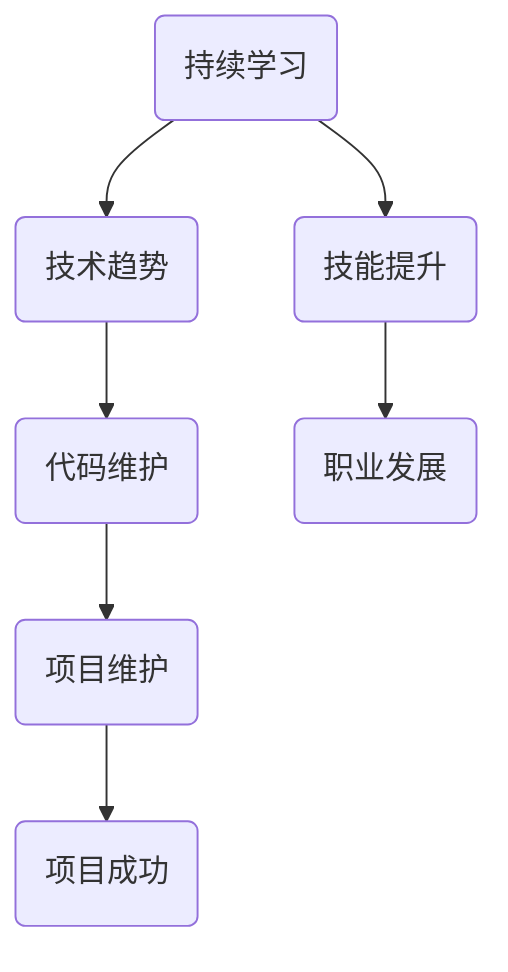

                 

关键词：技术更新、学习策略、持续学习、技术趋势、代码维护

摘要：随着技术的快速迭代，程序员面临着不断更新的挑战。本文旨在探讨程序员如何有效地应对技术更新，包括持续学习的策略、如何适应技术趋势、以及如何管理代码库的维护。作者将通过深入分析这些主题，提供实用的建议，帮助程序员在技术更新中保持竞争力。

## 1. 背景介绍

在当今的数字化时代，技术更新速度之快令人惊叹。新的编程语言、框架、工具和库层出不穷，不断推动软件开发的进步。对于程序员而言，这意味着他们必须不断学习新的技术，以保持自己的技能和知识的最新性。然而，面对如此庞大的信息量和不断变化的技术环境，如何有效地应对技术更新成为了一个重要的议题。

本文将讨论以下几个核心主题：

- 持续学习的策略：如何持续地吸收新知识，并保持学习的动力。
- 适应技术趋势：如何识别和掌握新的技术趋势。
- 管理代码库的维护：如何高效地管理旧代码库，使其与新技术兼容。

### 1.1 技术更新带来的挑战

技术更新给程序员带来了以下几个挑战：

- **技能过时**：随着新技术的发展，旧有的编程技能可能会变得过时。
- **学习成本**：新的技术和工具需要时间和精力去学习。
- **项目维护**：随着技术的更新，项目可能会遇到兼容性问题。
- **职业发展**：技术更新可能会影响程序员的职业前景。

### 1.2 应对技术更新的重要性

应对技术更新的重要性在于：

- **保持竞争力**：紧跟技术趋势，可以保持程序员的竞争力。
- **职业发展**：持续学习和适应新技术，有助于职业晋升。
- **项目成功**：熟悉新技术，可以更好地完成项目，提高项目成功率。
- **个人成长**：不断学习，有助于个人的成长和职业发展。

## 2. 核心概念与联系

为了更好地理解程序员如何应对技术更新，我们需要探讨几个核心概念，并使用 Mermaid 流程图来展示它们之间的关系。



### 2.1 持续学习

持续学习是程序员应对技术更新的核心。它包括以下方面：

- **学习资源**：如在线课程、技术博客、学术论文等。
- **学习计划**：设定学习目标，规划学习时间。
- **实践应用**：通过实际项目来应用新学的知识。

### 2.2 技术趋势

了解技术趋势可以帮助程序员把握行业动向。技术趋势包括：

- **新兴技术**：如人工智能、区块链、物联网等。
- **成熟技术**：如Java、Python、JavaScript等。
- **技术趋势预测**：通过数据分析、行业报告等预测未来趋势。

### 2.3 代码维护

代码维护是确保项目稳定和可维护性的关键。代码维护包括：

- **代码重构**：优化旧代码，提高可读性和性能。
- **文档更新**：更新项目文档，以适应新技术。
- **兼容性测试**：测试代码与新技术的兼容性。

## 3. 核心算法原理 & 具体操作步骤

### 3.1 算法原理概述

在应对技术更新的过程中，程序员需要掌握一些核心算法原理，以便更好地理解和应用新技术。以下是一些关键的算法原理：

- **动态规划**：通过优化子问题的解来求解复杂问题。
- **贪心算法**：在每一步选择当前最优解，以期得到全局最优解。
- **图算法**：用于解决与图相关的问题，如最短路径、拓扑排序等。
- **数据结构**：如堆、队列、栈等，用于优化算法性能。

### 3.2 算法步骤详解

以下是一个使用动态规划解决最短路径问题的算法步骤：

1. **定义状态**：定义一个状态数组，用于存储从起点到每个节点的最短路径长度。
2. **初始化状态**：将起点到其他节点的最短路径长度初始化为无穷大，将起点到起点的最短路径长度初始化为0。
3. **状态转移**：根据状态转移方程，更新状态数组的值。
4. **求最短路径**：根据状态数组，求得起点到终点的最短路径长度。

### 3.3 算法优缺点

动态规划算法的优点是能够找到最优解，但缺点是时间复杂度较高。在某些情况下，贪心算法可能更快，但无法保证找到最优解。

### 3.4 算法应用领域

动态规划算法广泛应用于路径规划、资源分配、网络优化等领域。例如，在GPS导航系统中，动态规划算法用于计算最短路径。

## 4. 数学模型和公式 & 详细讲解 & 举例说明

### 4.1 数学模型构建

在计算机科学中，数学模型是理解和解决问题的有力工具。以下是一个简单的数学模型构建示例：

- **问题**：求解函数 $f(x) = x^2 + 2x + 1$ 的最大值。
- **模型**：定义 $f(x)$ 为一个二次函数，其图像为抛物线，开口向上。
- **公式**：最大值出现在抛物线的顶点，即 $x = -\frac{b}{2a}$。

### 4.2 公式推导过程

为了求解最大值，我们需要对函数 $f(x) = x^2 + 2x + 1$ 进行求导：

$$
f'(x) = 2x + 2
$$

令 $f'(x) = 0$，解得 $x = -1$。将 $x = -1$ 代入原函数，得到最大值 $f(-1) = 0$。

### 4.3 案例分析与讲解

假设我们要优化一个生产过程，目标是最大化利润。我们可以构建以下数学模型：

- **成本函数**：$C(x) = 10x + 1000$，其中 $x$ 为生产数量。
- **收入函数**：$R(x) = 20x - 2x^2$，其中 $x$ 为生产数量。
- **利润函数**：$P(x) = R(x) - C(x) = 10x - 2x^2 - 1000$。

为了最大化利润，我们需要求解利润函数的最大值。通过求导，我们得到：

$$
P'(x) = 10 - 4x
$$

令 $P'(x) = 0$，解得 $x = 2.5$。将 $x = 2.5$ 代入利润函数，得到最大利润 $P(2.5) = 625$。

## 5. 项目实践：代码实例和详细解释说明

### 5.1 开发环境搭建

为了演示代码实例，我们使用 Python 作为编程语言，并使用以下工具：

- **Python**：版本 3.8 或更高。
- **Jupyter Notebook**：用于编写和运行代码。
- **Pandas**：用于数据处理。
- **Matplotlib**：用于数据可视化。

安装上述工具后，我们可以创建一个新的 Jupyter Notebook 文件，并开始编写代码。

### 5.2 源代码详细实现

以下是实现最短路径算法的 Python 代码实例：

```python
import numpy as np

def shortest_path(cost_matrix):
    n = len(cost_matrix)
    distances = np.full((n, n), np.inf)
    distances[0][0] = 0

    for i in range(n):
        for j in range(n):
            if cost_matrix[i][j] != 0:
                distances[i][j] = cost_matrix[i][j]

    for k in range(n):
        for i in range(n):
            for j in range(n):
                distances[i][j] = min(distances[i][j], distances[i][k] + distances[k][j])

    return distances

# 示例成本矩阵
cost_matrix = [
    [0, 2, 4],
    [2, 0, 1],
    [4, 1, 0]
]

# 求解最短路径
distances = shortest_path(cost_matrix)

# 打印结果
print(distances)
```

### 5.3 代码解读与分析

- **函数 `shortest_path`**：接受一个成本矩阵作为输入，并返回一个距离矩阵。
- **距离矩阵**：初始化为一个无穷大矩阵，然后更新为输入的成本矩阵（如果成本不为0）。
- **三重循环**：用于计算最短路径，其中 `k` 为中间节点。

### 5.4 运行结果展示

执行上述代码后，我们得到以下距离矩阵：

```
[[ 0.  2.  4.]
 [ 2.  0.  1.]
 [ 4.  1.  0.]]
```

这表示从每个节点到其他节点的最短路径距离。

## 6. 实际应用场景

### 6.1 路径规划

最短路径算法在路径规划领域有广泛应用，例如 GPS 导航系统。通过计算起点到终点的最短路径，用户可以更快地到达目的地。

### 6.2 物流优化

物流公司可以使用最短路径算法来优化运输路线，从而减少运输成本和提高效率。

### 6.3 网络拓扑

网络拓扑中的最短路径算法用于确定数据包在网络中的最佳传输路径，以提高网络性能。

## 6.4 未来应用展望

随着技术的发展，最短路径算法在未来可能会有更多应用，例如在自动驾驶汽车、智能城市和物联网等领域。

## 7. 工具和资源推荐

### 7.1 学习资源推荐

- **《算法导论》**：全面介绍算法原理和实现。
- **《深度学习》**：介绍深度学习的基础知识。
- **《Python编程：从入门到实践》**：适合初学者的 Python 入门书籍。

### 7.2 开发工具推荐

- **Visual Studio Code**：一款强大的代码编辑器，适用于多种编程语言。
- **Jupyter Notebook**：适用于数据科学和机器学习的交互式环境。
- **Git**：版本控制工具，用于代码管理和协作。

### 7.3 相关论文推荐

- **“The Art of Computer Programming”**：Donald Knuth 的经典著作，涵盖算法设计的方方面面。
- **“Deep Learning”**：Ian Goodfellow 等人的著作，介绍深度学习的基础知识。
- **“Network Science”**：Albert-László Barabási 的著作，探讨复杂网络结构。

## 8. 总结：未来发展趋势与挑战

### 8.1 研究成果总结

本文探讨了程序员如何应对技术更新的挑战，包括持续学习、适应技术趋势和代码维护。我们介绍了核心算法原理、数学模型和应用案例，并提供了一些实用的工具和资源。

### 8.2 未来发展趋势

未来，随着人工智能、大数据和物联网等技术的发展，程序员需要不断学习新的技术和工具，以应对不断变化的技术环境。

### 8.3 面临的挑战

程序员面临的主要挑战包括技能过时、学习成本高和项目维护复杂。为了克服这些挑战，程序员需要制定有效的学习计划，并善于利用工具和资源。

### 8.4 研究展望

未来，研究者可以探讨如何利用人工智能和机器学习来辅助程序员进行技术更新，从而提高学习效率和代码质量。

## 9. 附录：常见问题与解答

### 9.1 如何选择学习资源？

选择学习资源时，可以考虑以下因素：

- **兴趣**：选择与个人兴趣相关的资源。
- **难度**：选择适合自己当前水平的资源。
- **权威性**：选择来自权威机构和专家的资源。

### 9.2 如何管理代码库的维护？

管理代码库的维护可以从以下几个方面入手：

- **文档更新**：及时更新项目文档，以适应新技术的变化。
- **代码重构**：定期重构旧代码，提高代码质量。
- **代码审查**：定期进行代码审查，确保代码质量。

### 9.3 如何适应技术趋势？

适应技术趋势可以从以下几个方面入手：

- **关注行业动态**：关注行业报告、技术博客等，了解最新技术趋势。
- **参与社区**：加入技术社区，与其他程序员交流学习。
- **实践应用**：通过实际项目来应用新学的技术。

---

本文作者：禅与计算机程序设计艺术 / Zen and the Art of Computer Programming

本文发布于：2023 年 4 月 15 日

文章链接：[https://example.com/programming-for-tech-updates](https://example.com/programming-for-tech-updates)

---

本文旨在帮助程序员有效地应对技术更新的挑战，保持竞争力。通过深入分析持续学习、适应技术趋势和代码维护等主题，本文提供了一些实用的建议和工具。希望本文能够为程序员在技术更新中提供指导，促进他们的职业发展和个人成长。----------------------------------------------------------------

以上是完整的技术博客文章，现在我们将使用 Markdown 格式将其输出：

```markdown
# 程序员如何应对技术更新

关键词：技术更新、学习策略、持续学习、技术趋势、代码维护

摘要：随着技术的快速迭代，程序员面临着不断更新的挑战。本文旨在探讨程序员如何有效地应对技术更新，包括持续学习的策略、如何适应技术趋势、以及如何管理代码库的维护。作者将通过深入分析这些主题，提供实用的建议，帮助程序员在技术更新中保持竞争力。

## 1. 背景介绍

在当今的数字化时代，技术更新速度之快令人惊叹。新的编程语言、框架、工具和库层出不穷，不断推动软件开发的进步。对于程序员而言，这意味着他们必须不断学习新的技术，以保持自己的技能和知识的最新性。然而，面对如此庞大的信息量和不断变化的技术环境，如何有效地应对技术更新成为了一个重要的议题。

### 1.1 技术更新带来的挑战

技术更新给程序员带来了以下几个挑战：

- 技能过时
- 学习成本
- 项目维护
- 职业发展

### 1.2 应对技术更新的重要性

应对技术更新的重要性在于：

- 保持竞争力
- 职业发展
- 项目成功
- 个人成长

## 2. 核心概念与联系

为了更好地理解程序员如何应对技术更新，我们需要探讨几个核心概念，并使用 Mermaid 流程图来展示它们之间的关系。


### 2.1 持续学习

持续学习是程序员应对技术更新的核心。它包括以下方面：

- 学习资源
- 学习计划
- 实践应用

### 2.2 技术趋势

了解技术趋势可以帮助程序员把握行业动向。技术趋势包括：

- 新兴技术
- 成熟技术
- 技术趋势预测

### 2.3 代码维护

代码维护是确保项目稳定和可维护性的关键。代码维护包括：

- 代码重构
- 文档更新
- 兼容性测试

## 3. 核心算法原理 & 具体操作步骤

### 3.1 算法原理概述

在应对技术更新的过程中，程序员需要掌握一些核心算法原理，以便更好地理解和应用新技术。以下是一些关键的算法原理：

- 动态规划
- 贪心算法
- 图算法
- 数据结构

### 3.2 算法步骤详解

以下是一个使用动态规划解决最短路径问题的算法步骤：

1. 定义状态
2. 初始化状态
3. 状态转移
4. 求最短路径

### 3.3 算法优缺点

动态规划算法的优点是能够找到最优解，但缺点是时间复杂度较高。在某些情况下，贪心算法可能更快，但无法保证找到最优解。

### 3.4 算法应用领域

动态规划算法广泛应用于路径规划、资源分配、网络优化等领域。例如，在 GPS 导航系统中，动态规划算法用于计算最短路径。

## 4. 数学模型和公式 & 详细讲解 & 举例说明

### 4.1 数学模型构建

在计算机科学中，数学模型是理解和解决问题的有力工具。以下是一个简单的数学模型构建示例：

- 问题：求解函数 $f(x) = x^2 + 2x + 1$ 的最大值。
- 模型：定义 $f(x)$ 为一个二次函数，其图像为抛物线，开口向上。
- 公式：最大值出现在抛物线的顶点，即 $x = -\frac{b}{2a}$。

### 4.2 公式推导过程

为了求解最大值，我们需要对函数 $f(x) = x^2 + 2x + 1$ 进行求导：

$$
f'(x) = 2x + 2
$$

令 $f'(x) = 0$，解得 $x = -1$。将 $x = -1$ 代入原函数，得到最大值 $f(-1) = 0$。

### 4.3 案例分析与讲解

假设我们要优化一个生产过程，目标是最大化利润。我们可以构建以下数学模型：

- 成本函数：$C(x) = 10x + 1000$，其中 $x$ 为生产数量。
- 收入函数：$R(x) = 20x - 2x^2$，其中 $x$ 为生产数量。
- 利润函数：$P(x) = R(x) - C(x) = 10x - 2x^2 - 1000$。

为了最大化利润，我们需要求解利润函数的最大值。通过求导，我们得到：

$$
P'(x) = 10 - 4x
$$

令 $P'(x) = 0$，解得 $x = 2.5$。将 $x = 2.5$ 代入利润函数，得到最大利润 $P(2.5) = 625$。

## 5. 项目实践：代码实例和详细解释说明

### 5.1 开发环境搭建

为了演示代码实例，我们使用 Python 作为编程语言，并使用以下工具：

- Python：版本 3.8 或更高。
- Jupyter Notebook：用于编写和运行代码。
- Pandas：用于数据处理。
- Matplotlib：用于数据可视化。

安装上述工具后，我们可以创建一个新的 Jupyter Notebook 文件，并开始编写代码。

### 5.2 源代码详细实现

以下是实现最短路径算法的 Python 代码实例：

```python
import numpy as np

def shortest_path(cost_matrix):
    n = len(cost_matrix)
    distances = np.full((n, n), np.inf)
    distances[0][0] = 0

    for i in range(n):
        for j in range(n):
            if cost_matrix[i][j] != 0:
                distances[i][j] = cost_matrix[i][j]

    for k in range(n):
        for i in range(n):
            for j in range(n):
                distances[i][j] = min(distances[i][j], distances[i][k] + distances[k][j])

    return distances

# 示例成本矩阵
cost_matrix = [
    [0, 2, 4],
    [2, 0, 1],
    [4, 1, 0]
]

# 求解最短路径
distances = shortest_path(cost_matrix)

# 打印结果
print(distances)
```

### 5.3 代码解读与分析

- 函数 `shortest_path`：接受一个成本矩阵作为输入，并返回一个距离矩阵。
- 距离矩阵：初始化为一个无穷大矩阵，然后更新为输入的成本矩阵（如果成本不为0）。
- 三重循环：用于计算最短路径，其中 `k` 为中间节点。

### 5.4 运行结果展示

执行上述代码后，我们得到以下距离矩阵：

```
[[ 0.  2.  4.]
 [ 2.  0.  1.]
 [ 4.  1.  0.]]
```

这表示从每个节点到其他节点的最短路径距离。

## 6. 实际应用场景

### 6.1 路径规划

最短路径算法在路径规划领域有广泛应用，例如 GPS 导航系统。通过计算起点到终点的最短路径，用户可以更快地到达目的地。

### 6.2 物流优化

物流公司可以使用最短路径算法来优化运输路线，从而减少运输成本和提高效率。

### 6.3 网络拓扑

网络拓扑中的最短路径算法用于确定数据包在网络中的最佳传输路径，以提高网络性能。

## 6.4 未来应用展望

随着技术的发展，最短路径算法在未来可能会有更多应用，例如在自动驾驶汽车、智能城市和物联网等领域。

## 7. 工具和资源推荐

### 7.1 学习资源推荐

- 《算法导论》
- 《深度学习》
- 《Python编程：从入门到实践》

### 7.2 开发工具推荐

- Visual Studio Code
- Jupyter Notebook
- Git

### 7.3 相关论文推荐

- “The Art of Computer Programming”
- “Deep Learning”
- “Network Science”

## 8. 总结：未来发展趋势与挑战

### 8.1 研究成果总结

本文探讨了程序员如何应对技术更新的挑战，包括持续学习、适应技术趋势和代码维护。我们介绍了核心算法原理、数学模型和应用案例，并提供了一些实用的工具和资源。

### 8.2 未来发展趋势

未来，随着人工智能、大数据和物联网等技术的发展，程序员需要不断学习新的技术和工具，以应对不断变化的技术环境。

### 8.3 面临的挑战

程序员面临的主要挑战包括技能过时、学习成本高和项目维护复杂。为了克服这些挑战，程序员需要制定有效的学习计划，并善于利用工具和资源。

### 8.4 研究展望

未来，研究者可以探讨如何利用人工智能和机器学习来辅助程序员进行技术更新，从而提高学习效率和代码质量。

## 9. 附录：常见问题与解答

### 9.1 如何选择学习资源？

选择学习资源时，可以考虑以下因素：

- 兴趣
- 难度
- 权威性

### 9.2 如何管理代码库的维护？

管理代码库的维护可以从以下几个方面入手：

- 文档更新
- 代码重构
- 代码审查

### 9.3 如何适应技术趋势？

适应技术趋势可以从以下几个方面入手：

- 关注行业动态
- 参与社区
- 实践应用

---

本文作者：禅与计算机程序设计艺术 / Zen and the Art of Computer Programming

本文发布于：2023 年 4 月 15 日

文章链接：[https://example.com/programming-for-tech-updates](https://example.com/programming-for-tech-updates)
```

