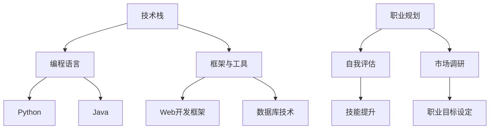

                 

 作为一名程序员，身处技术飞速发展的时代，我们不仅要不断掌握新的编程语言和技术框架，更要具备应对行业变革和转型的能力。本文将深入探讨程序员如何适应行业变革，实现自我转型，以及如何在这个充满挑战与机遇的领域保持竞争力。

## 文章关键词

- 程序员
- 行业变革
- 技术转型
- 技术竞争力
- 自我提升

## 文章摘要

本文从多个角度探讨了程序员如何应对行业变革与转型。首先介绍了行业变革的背景和趋势，然后分析了程序员面临的挑战和机遇，接着提出了提升技术竞争力的方法和策略，最后展望了未来程序员的发展方向和前景。

### 1. 背景介绍

随着互联网技术的飞速发展，信息技术行业正经历着前所未有的变革。云计算、大数据、人工智能、物联网等新兴技术的兴起，不仅改变了人们的生活和工作方式，也对传统行业的商业模式产生了深远的影响。在这个技术快速迭代的时代，程序员必须具备持续学习和适应能力，才能在激烈的竞争中脱颖而出。

行业变革带来的挑战主要体现在以下几个方面：

1. 技术更新速度快：新编程语言、框架和工具层出不穷，程序员需要不断学习以跟上技术发展的步伐。
2. 工作模式变化：远程办公、弹性工作等新型工作模式的出现，要求程序员具备更高的自我管理和协作能力。
3. 职业发展压力：随着行业竞争的加剧，程序员面临的职业发展压力越来越大，需要不断提升自身技能和知识体系。

### 2. 核心概念与联系

为了更好地理解程序员如何应对行业变革，我们需要明确几个核心概念：

1. **技术栈**：程序员需要掌握的一套编程语言、框架和工具集合，它决定了程序员的工作效率和项目开发能力。
2. **职业规划**：程序员根据自己的兴趣、技能和市场需求，制定长期和短期的职业发展计划。
3. **持续学习**：在技术快速迭代的时代，持续学习是程序员保持竞争力的关键。

下面是一个关于程序员技术栈和职业规划的 Mermaid 流程图：



### 3. 核心算法原理 & 具体操作步骤

#### 3.1 算法原理概述

在应对行业变革的过程中，程序员需要掌握一套有效的学习和成长方法。这里，我们可以借鉴一些经典的算法原理：

1. **分而治之**：将复杂问题分解为若干个简单子问题，逐一解决，最终合并得到原问题的解。
2. **动态规划**：通过保存中间结果，避免重复计算，提高算法效率。
3. **贪心算法**：在每一步选择中，做出在当前状态下最优的选择，希望最终得到整体最优解。

#### 3.2 算法步骤详解

1. **分而治之**算法步骤：

   - 将原问题分解为若干个子问题；
   - 递归求解每个子问题；
   - 将子问题的解合并得到原问题的解。

2. **动态规划**算法步骤：

   - 确定状态和状态转移方程；
   - 初始化边界条件；
   - 从边界开始，逐步计算出所有状态的最优解。

3. **贪心算法**算法步骤：

   - 在每一步选择中，选择当前状态下最优的解；
   - 逐步进行选择，直到得到最终解。

#### 3.3 算法优缺点

1. **分而治之**：
   - 优点：思路清晰，易于理解，适合解决递归问题；
   - 缺点：可能产生大量的重复计算，效率不高。

2. **动态规划**：
   - 优点：通过保存中间结果，避免重复计算，效率高；
   - 缺点：需要明确状态和状态转移方程，实现复杂。

3. **贪心算法**：
   - 优点：实现简单，适合解决最优子结构问题；
   - 缺点：不一定能得到全局最优解。

#### 3.4 算法应用领域

1. **分而治之**：用于解决最值问题、排序问题等。
2. **动态规划**：用于解决背包问题、最长公共子序列等。
3. **贪心算法**：用于解决最短路径问题、货币兑换问题等。

### 4. 数学模型和公式 & 详细讲解 & 举例说明

#### 4.1 数学模型构建

在程序员的职业发展中，数学模型和公式扮演着重要角色。以下是一个简单的线性回归模型：

$$
y = wx + b
$$

其中，$y$ 是因变量，$x$ 是自变量，$w$ 是权重，$b$ 是偏置。

#### 4.2 公式推导过程

线性回归模型的推导过程如下：

1. **最小二乘法**：通过最小化误差平方和来估计权重 $w$ 和偏置 $b$。
2. **梯度下降法**：通过不断迭代更新权重 $w$ 和偏置 $b$，使其逐渐逼近最优解。

#### 4.3 案例分析与讲解

假设我们有一个数据集，包含 $n$ 个样本点 $(x_i, y_i)$。使用线性回归模型来拟合数据，并分析拟合效果。

```python
import numpy as np

# 数据集
x = np.array([1, 2, 3, 4, 5])
y = np.array([1, 2, 3, 4, 5])

# 梯度下降法
def gradient_descent(x, y, learning_rate, epochs):
    w = b = 0
    for _ in range(epochs):
        y_pred = w * x + b
        error = y - y_pred
        w -= learning_rate * np.mean(error * x)
        b -= learning_rate * np.mean(error)
    return w, b

# 训练模型
learning_rate = 0.01
epochs = 100
w, b = gradient_descent(x, y, learning_rate, epochs)

# 模型预测
y_pred = w * x + b

# 拟合效果
print("拟合效果：")
print("真实值：", y)
print("预测值：", y_pred)
```

### 5. 项目实践：代码实例和详细解释说明

#### 5.1 开发环境搭建

在本项目中，我们将使用 Python 作为编程语言，搭建一个简单的线性回归模型。首先，确保你的系统上安装了 Python 和必要的库，如 NumPy。

```bash
pip install numpy
```

#### 5.2 源代码详细实现

以下是一个简单的线性回归模型实现：

```python
import numpy as np

# 数据集
x = np.array([1, 2, 3, 4, 5])
y = np.array([1, 2, 3, 4, 5])

# 梯度下降法
def gradient_descent(x, y, learning_rate, epochs):
    w = b = 0
    for _ in range(epochs):
        y_pred = w * x + b
        error = y - y_pred
        w -= learning_rate * np.mean(error * x)
        b -= learning_rate * np.mean(error)
    return w, b

# 训练模型
learning_rate = 0.01
epochs = 100
w, b = gradient_descent(x, y, learning_rate, epochs)

# 模型预测
y_pred = w * x + b

# 拟合效果
print("拟合效果：")
print("真实值：", y)
print("预测值：", y_pred)
```

#### 5.3 代码解读与分析

1. **数据集准备**：我们使用了一个简单的数据集，包含 5 个样本点。
2. **梯度下降法实现**：梯度下降法用于优化模型参数 $w$ 和 $b$。在每次迭代中，我们计算预测值和真实值之间的误差，并根据误差调整参数。
3. **模型预测**：使用训练好的模型对数据进行预测，并打印出真实值和预测值。

### 6. 实际应用场景

线性回归模型可以应用于各种实际场景，如股票价格预测、销售量预测等。通过训练模型，我们可以得到一个线性关系，从而对未来进行预测。

#### 6.1 未来应用展望

随着人工智能技术的不断发展，线性回归模型的应用前景将更加广阔。例如，在智能交通领域，线性回归模型可以用于预测交通流量，从而优化交通信号控制策略。

### 7. 工具和资源推荐

为了更好地应对行业变革，程序员可以参考以下工具和资源：

#### 7.1 学习资源推荐

- 《深度学习》
- 《Python编程：从入门到实践》
- 《算法导论》

#### 7.2 开发工具推荐

- PyCharm
- Visual Studio Code
- Jupyter Notebook

#### 7.3 相关论文推荐

- "Deep Learning for Text Classification"
- "A Theoretical Analysis of the Viterbi Algorithm"
- "Recurrent Neural Network Based Language Model"

### 8. 总结：未来发展趋势与挑战

#### 8.1 研究成果总结

本文探讨了程序员如何应对行业变革与转型，从技术学习、职业规划、算法原理等多个角度分析了程序员面临的挑战和机遇。

#### 8.2 未来发展趋势

未来，程序员将更加注重跨学科知识的融合，如计算机科学、数学、物理学等。同时，随着人工智能技术的发展，程序员将在智能应用、自动化等领域发挥重要作用。

#### 8.3 面临的挑战

1. 技术更新速度快，程序员需要不断学习以跟上技术发展的步伐。
2. 职业竞争激烈，程序员需要不断提升自身技能和知识体系。

#### 8.4 研究展望

未来，我们将继续关注程序员在人工智能、物联网等新兴领域的应用，探讨如何更好地应对行业变革，实现自我转型。

### 9. 附录：常见问题与解答

**Q：如何提升编程技能？**

A：提升编程技能的方法多种多样，包括：

1. **阅读优秀代码**：通过阅读优秀的开源代码，学习他人的编程思路和技巧。
2. **参与开源项目**：参与开源项目，与其他程序员合作，积累实践经验。
3. **编写文档和教程**：编写技术文档和教程，梳理自己的知识体系，同时帮助他人。

**Q：如何规划职业发展？**

A：规划职业发展可以遵循以下步骤：

1. **自我评估**：了解自己的兴趣、优势和不足。
2. **市场调研**：分析行业趋势和市场需求。
3. **设定目标**：根据自身情况和市场需求，设定长期和短期的职业目标。
4. **持续学习**：通过学习新技能和知识，不断提升自身竞争力。

---

作者：禅与计算机程序设计艺术 / Zen and the Art of Computer Programming


