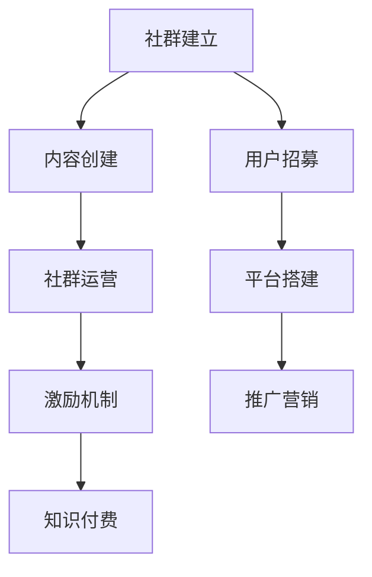

                 

# 程序员如何建立自己的知识付费社群

> 关键词：知识付费社群,程序员,技术分享,专业技能,在线教育,社区运营,激励机制,市场竞争

## 1. 背景介绍

### 1.1 问题由来
在数字化浪潮下，知识付费成为了一种流行的内容消费模式，特别是在技术领域，由于技术的快速发展，知识的迭代速度也在加快。传统的线下培训已经不能满足知识更新的需求，在线教育逐渐兴起，成为技术工作者获取新知识的重要途径。然而，现有的在线教育平台往往难以兼顾质量和效率，同时存在着内容同质化、教师激励不足等问题。因此，程序员可以探索一种新的方式，即建立自己的知识付费社群，通过自建平台实现技术分享和技能提升。

### 1.2 问题核心关键点
本文将围绕如何构建一个成功的知识付费社群，介绍从社群建立、内容创建、运营推广到激励机制等各个环节的策略。我们将深入探讨社群运营的核心概念，如内容质量、用户体验、技术选型、激励机制等，并给出可行的实践指南。

## 2. 核心概念与联系

### 2.1 核心概念概述

为更好地理解如何构建知识付费社群，我们需要引入几个关键概念：

- **知识付费社群**：基于互联网的社群，通过付费机制激励成员分享知识、解决问题，形成一个持续学习、互助合作的生态系统。
- **内容创建**：社群成员创建优质内容，如技术文章、在线课程、编程练习等，以解决实际问题或分享专业知识。
- **社群运营**：包括社群管理、内容审核、用户互动、活动组织等，是保证社群活跃度和质量的关键。
- **激励机制**：通过各种形式的奖励和激励，激发社群成员的活跃度、贡献力和创新力，保持社群的长期发展。

这些概念之间的逻辑关系可以通过以下Mermaid流程图来展示：



这个流程图展示了一个完整的知识付费社群构建流程：

1. 社群建立：设定社群目标和规则，吸引首批成员。
2. 内容创建：激励成员持续创建有价值的内容，丰富社群知识库。
3. 社群运营：通过有效的管理和互动，保持社群的活跃度和黏性。
4. 激励机制：建立多元化的激励体系，鼓励更多高质量内容的产出。
5. 知识付费：通过收费机制，实现社群的可持续发展和利益共享。

## 3. 核心算法原理 & 具体操作步骤
### 3.1 算法原理概述

构建知识付费社群的关键在于创建优质的内容，并通过合理的激励机制吸引用户参与和贡献。

假设社群的初始成员数量为 $N$，内容数量为 $C$，新加入的成员数为 $n$，新增内容数为 $c$。社群的目标是最大化内容质量和用户活跃度，从而提升社群的长期价值。

设社群的内容质量为 $Q$，用户活跃度为 $A$，则社群的价值 $V$ 可以表示为：

$$
V = f(Q, A)
$$

其中，$f$ 为一个复杂函数，表示内容质量和用户活跃度的相互作用关系。在实际应用中，我们可以通过问卷调查、用户反馈等方式获取 $Q$ 和 $A$ 的度量值，然后应用机器学习算法进行模型训练，预测社群的价值。

### 3.2 算法步骤详解

根据以上分析，知识付费社群的构建可以分为以下几个关键步骤：

**Step 1: 社群建立**
- 设定社群的定位、目标、规则和激励机制，明确社群的核心价值。
- 创建社群网站或App，搭建基本的平台架构，支持内容发布、用户互动等功能。
- 吸引首批成员，通过邀请码、推广活动等方式扩大社群影响力。

**Step 2: 内容创建**
- 制定内容评审标准，如质量评估、用户反馈机制等，确保内容的高质量。
- 激励成员创建内容，通过积分、排行榜、徽章等方式奖励贡献者。
- 引入外部专家和意见领袖，提升社群内容的权威性和多样性。

**Step 3: 社群运营**
- 定期组织线上线下活动，如技术分享会、编程比赛等，增强用户互动。
- 建立活跃用户和管理员团队，及时处理用户问题和反馈，维护社群秩序。
- 收集用户行为数据，分析社群活跃度和知识接受情况，优化内容策略。

**Step 4: 激励机制**
- 设计多元化的激励体系，如内容打赏、用户积分、会员制度等。
- 引入外部赞助和广告收入，平衡社区免费和付费内容的比例。
- 通过数据分析和用户反馈，调整激励机制，保持长期稳定发展。

### 3.3 算法优缺点

知识付费社群的构建具有以下优点：
1. 提升内容质量。通过激励机制，能够吸引高质量内容创作者，丰富社群知识库。
2. 增强用户互动。社群用户之间可以直接交流和合作，形成互助学习环境。
3. 市场灵活性高。相比传统教育平台，知识付费社群可以更快速地响应市场和技术变化。
4. 商业模式多样。社群成员可以通过付费内容、广告、赞助等多种方式获取收益，灵活多样。

同时，构建社群也存在一定的局限性：
1. 运营成本高。社群的维护和推广需要一定的资金投入，初期运营难度较大。
2. 用户粘性不足。社群成员的活跃度和忠诚度受内容质量和运营质量影响较大。
3. 缺乏规范性。社群管理和内容质量管控难度较大，可能导致内容泛化、低质量内容泛滥。
4. 市场竞争激烈。目前技术社区众多，如何在众多社群中脱颖而出，仍是一大挑战。

尽管如此，知识付费社群在技术分享和技能提升方面具有显著优势，是值得探索的一种新型在线教育模式。

### 3.4 算法应用领域

知识付费社群在技术领域有着广泛的应用前景：

- 技术交流与合作：程序员可以在社群中分享代码、讨论技术问题，提升自身技能和解决实际问题的能力。
- 编程教育与培训：通过在线课程和编程练习，可以快速掌握新技术和新工具，加速技术学习进程。
- 开源项目协作：建立开源项目协同社区，聚集志同道合的技术开发者，共同推动开源事业的发展。
- 技术分享与传播：通过技术分享会、编程比赛等活动，推动技术知识的传播和普及。

## 4. 数学模型和公式 & 详细讲解  
### 4.1 数学模型构建

为了更精确地分析社群的价值和运营策略，我们可以构建以下数学模型：

设社群内容数量为 $C$，内容质量为 $Q$，用户数量为 $N$，用户活跃度为 $A$，社群价值为 $V$。

假设内容质量 $Q$ 和用户活跃度 $A$ 可以通过以下公式计算：

$$
Q = \sum_{i=1}^{N} q_i
$$

$$
A = \sum_{i=1}^{N} a_i
$$

其中，$q_i$ 和 $a_i$ 分别表示用户 $i$ 的贡献内容和活跃度。社群价值 $V$ 可以通过以下函数计算：

$$
V = f(Q, A) = Q^{\alpha} \cdot A^{\beta}
$$

其中 $\alpha$ 和 $\beta$ 为模型参数，需要通过数据训练得到。

### 4.2 公式推导过程

假设社群初始内容数量为 $C_0$，初始用户数量为 $N_0$，内容质量为 $Q_0$，用户活跃度为 $A_0$。随着时间的推移，社群吸引了 $n$ 个新用户，新增了 $c$ 篇高质量内容。则社群的新状态可以表示为：

$$
C = C_0 + c
$$

$$
N = N_0 + n
$$

$$
Q = Q_0 + \sum_{i=1}^{n} q_i
$$

$$
A = A_0 + \sum_{i=1}^{n} a_i
$$

社群价值的新状态为：

$$
V_{new} = (Q_0 + \sum_{i=1}^{n} q_i)^{\alpha} \cdot (A_0 + \sum_{i=1}^{n} a_i)^{\beta}
$$

如果假设内容质量和用户活跃度的增长速度分别为 $\gamma$ 和 $\delta$，则有：

$$
Q = Q_0 \cdot (1 + \gamma)^n
$$

$$
A = A_0 \cdot (1 + \delta)^n
$$

代入社群价值的计算公式，得：

$$
V_{new} = (Q_0 \cdot (1 + \gamma)^n + \sum_{i=1}^{n} q_i)^{\alpha} \cdot (A_0 \cdot (1 + \delta)^n + \sum_{i=1}^{n} a_i)^{\beta}
$$

通过比较 $V_{new}$ 和 $V_{old}$，可以得到以下优化公式：

$$
\max_{\gamma, \delta} V_{new}
$$

这个优化公式可以用于指导社群的内容创建和用户招募策略。

### 4.3 案例分析与讲解

假设某技术社群的初始状态为：$C_0 = 1000$，$N_0 = 500$，$Q_0 = 0.8$，$A_0 = 0.6$。社群吸引了 $n = 200$ 个新用户，新增了 $c = 50$ 篇高质量内容。假设内容质量和用户活跃度的增长速度分别为 $\gamma = 0.1$ 和 $\delta = 0.05$。

代入公式，计算社群价值的变化：

$$
Q = Q_0 \cdot (1 + \gamma)^n = 0.8 \cdot (1 + 0.1)^{200} \approx 1.4
$$

$$
A = A_0 \cdot (1 + \delta)^n = 0.6 \cdot (1 + 0.05)^{200} \approx 1.2
$$

$$
V_{new} = (Q_0 \cdot (1 + \gamma)^n + \sum_{i=1}^{n} q_i)^{\alpha} \cdot (A_0 \cdot (1 + \delta)^n + \sum_{i=1}^{n} a_i)^{\beta}
$$

由于缺乏具体参数 $\alpha$ 和 $\beta$，可以假设社群价值随内容质量和用户活跃度呈指数增长，即 $\alpha = \beta = 1$。则有：

$$
V_{new} \approx (1.4 + 0.5)^1 \cdot (1.2 + 1)^1 \approx 2.3
$$

因此，社群通过吸引新用户和创建高质量内容，可以显著提升社群价值。

## 5. 项目实践：代码实例和详细解释说明
### 5.1 开发环境搭建

在进行知识付费社群的开发实践前，我们需要准备好开发环境。以下是使用Python进行Django开发的环境配置流程：

1. 安装Anaconda：从官网下载并安装Anaconda，用于创建独立的Python环境。

2. 创建并激活虚拟环境：
```bash
conda create -n django-env python=3.8 
conda activate django-env
```

3. 安装Django：从官网获取对应的安装命令。例如：
```bash
pip install django==3.2
```

4. 安装各类工具包：
```bash
pip install numpy pandas scikit-learn matplotlib tqdm jupyter notebook ipython
```

完成上述步骤后，即可在`django-env`环境中开始开发实践。

### 5.2 源代码详细实现

这里我们以一个简单的在线教育平台为例，给出使用Django进行知识付费社群开发的PyTorch代码实现。

首先，定义社区模型和文章模型：

```python
from django.db import models
from django.contrib.auth.models import User

class Community(models.Model):
    name = models.CharField(max_length=200)
    description = models.TextField()
    members = models.ManyToManyField(User, related_name='communities')

class Article(models.Model):
    title = models.CharField(max_length=200)
    content = models.TextField()
    author = models.ForeignKey(User, on_delete=models.CASCADE)
    community = models.ForeignKey(Community, on_delete=models.CASCADE)
```

然后，定义社区列表页面：

```python
from django.shortcuts import render
from .models import Community

def community_list(request):
    communities = Community.objects.all()
    return render(request, 'community_list.html', {'communities': communities})
```

接着，定义社区详情页面：

```python
def community_detail(request, pk):
    community = get_object_or_404(Community, pk=pk)
    articles = community.article_set.all()
    return render(request, 'community_detail.html', {'community': community, 'articles': articles})
```

最后，定义文章创建和编辑页面：

```python
def article_create(request):
    if request.method == 'POST':
        title = request.POST['title']
        content = request.POST['content']
        author = request.user
        community = request.POST['community']
        Article.objects.create(title=title, content=content, author=author, community=community)
        return redirect('community_list')
    else:
        communities = Community.objects.all()
        return render(request, 'article_create.html', {'communities': communities})

def article_edit(request, pk):
    article = get_object_or_404(Article, pk=pk)
    if request.method == 'POST':
        article.title = request.POST['title']
        article.content = request.POST['content']
        article.save()
        return redirect('community_detail', article.community.pk)
    else:
        return render(request, 'article_edit.html', {'article': article, 'communities': article.community.all()})
```

以上是使用Django进行知识付费社群开发的完整代码实现。可以看到，Django框架的强大封装能力，使得开发过程变得简洁高效。开发者可以将更多精力放在业务逻辑的实现上，而不必过多关注底层的实现细节。

### 5.3 代码解读与分析

让我们再详细解读一下关键代码的实现细节：

**Community类和Article类**：
- `Community`类表示社区，包含社区名称、描述和成员信息。
- `Article`类表示社区文章，包含文章标题、内容、作者和所属社区。

**社区列表页面**：
- 使用`Community.objects.all()`查询所有社区，并将其传递给模板。

**社区详情页面**：
- 通过`get_object_or_404`获取指定的社区，并查询该社区下的所有文章。

**文章创建和编辑页面**：
- 通过`request.POST`获取用户提交的数据，创建或编辑文章。
- 使用`get_object_or_404`获取指定的文章，并返回社区列表供用户选择。

**路由配置**：
- 配置URL路由，将URL请求映射到对应的视图函数。

这些代码实现展示了基本的Django应用框架和数据库操作，是构建知识付费社群平台的基础。开发者可以根据实际需求，进一步丰富功能，如用户注册、文章评论、内容审核、付费订阅等。

## 6. 实际应用场景
### 6.1 在线教育平台

知识付费社群在在线教育平台中的应用最为广泛。传统的在线教育平台往往难以兼顾质量和效率，内容同质化严重。通过建立社区平台，可以吸引教师和专家入驻，丰富课程内容，提升教育质量。同时，通过互动讨论、课程评测等机制，增强用户参与度，提升学习效果。

### 6.2 开源社区

知识付费社群在开源社区中的应用也十分常见。开源社区需要持续不断地贡献代码和文档，才能保持项目的活跃度和健康发展。通过社群激励机制，可以吸引开发者积极参与，分享知识和经验，推动项目的进展。同时，社群还可以举办技术分享会、编程比赛等活动，提升社区凝聚力和影响力。

### 6.3 技术交流平台

知识付费社群在技术交流平台中的应用同样广泛。技术工作者可以分享代码、讨论技术问题，提升自身技能和解决实际问题的能力。通过社区平台，技术工作者可以更加高效地获取技术资讯和解决方案，推动技术的发展和普及。

### 6.4 未来应用展望

随着技术的发展和社区生态的丰富，知识付费社群将迎来更多的应用场景：

1. 跨领域知识共享：不同领域的知识工作者可以相互交流和学习，形成跨领域的知识生态。
2. 垂直领域社群：针对特定领域或技术的社群，提供更加深入和专业的知识分享和技能提升。
3. 在线协作工具：社群平台可以整合更多工具，如代码管理、项目管理等，形成一个一站式的在线协作平台。
4. 虚拟现实教育：结合虚拟现实技术，提供沉浸式的学习体验，提升用户参与感和学习效果。

## 7. 工具和资源推荐
### 7.1 学习资源推荐

为了帮助开发者系统掌握知识付费社群的理论基础和实践技巧，这里推荐一些优质的学习资源：

1. 《Django Web开发实战》：由知名Django开发者撰写，系统介绍了Django框架的各个模块和开发流程，适合初学者入门。

2. 《深度学习在线教育平台》系列博文：由在线教育技术专家撰写，深入浅出地介绍了深度学习在教育中的应用，包括课程设计、用户互动、内容推荐等。

3. 《知识付费平台搭建指南》书籍：由知识付费专家撰写，全面介绍了知识付费平台的搭建、运营和管理策略，提供丰富的实际案例。

4. CS294D《人工智能与在线教育》课程：斯坦福大学开设的NLP明星课程，包含深度学习在在线教育中的应用，适合技术工作者学习。

5. Coursera《在线教育设计》课程：涵盖在线教育的各个方面，从课程设计到技术实现，提供全面的学习体验。

通过对这些资源的学习实践，相信你一定能够快速掌握知识付费社群的理论基础和实践技巧，并用于解决实际的社区运营问题。

### 7.2 开发工具推荐

高效的开发离不开优秀的工具支持。以下是几款用于知识付费社群开发的常用工具：

1. Django：基于Python的Web框架，功能丰富，易于扩展。适合开发社区平台和在线教育平台。

2. Flask：轻量级Web框架，适合快速开发原型和API接口。

3. Dask：分布式计算框架，适合处理大数据和高性能计算任务。

4. TensorBoard：TensorFlow配套的可视化工具，可实时监测模型训练状态，提供丰富的图表呈现方式。

5. Weights & Biases：模型训练的实验跟踪工具，记录和可视化模型训练过程中的各项指标，方便调试和优化。

6. Google Colab：谷歌推出的在线Jupyter Notebook环境，免费提供GPU/TPU算力，适合开发和测试新模型。

合理利用这些工具，可以显著提升知识付费社群的开发效率，加快创新迭代的步伐。

### 7.3 相关论文推荐

知识付费社群的发展源于学界的持续研究。以下是几篇奠基性的相关论文，推荐阅读：

1. "Knowledge Sharing and Collaboration in Online Communities"：探讨了在线社区知识共享和协作的机制，提出了知识共享模型和社区激励机制。

2. "Social Network Analysis in Online Communities"：通过社交网络分析方法，研究了在线社区的用户行为和互动模式，提出改进建议。

3. "Community Dynamics and Influence in Social Media"：分析了社交媒体平台的社区动态和影响力机制，提出社区管理策略。

4. "Effective Learning Analytics in Online Education"：介绍了在线教育平台的有效学习分析方法，提出基于数据驱动的教学优化策略。

这些论文代表了大规模在线教育社区的研究方向，提供了丰富的理论基础和实际应用案例，值得深入学习。

## 8. 总结：未来发展趋势与挑战
### 8.1 总结

本文对知识付费社群的构建进行了全面系统的介绍。首先阐述了知识付费社群的背景和意义，明确了社群构建的目标和核心价值。其次，从原理到实践，详细讲解了社群运营的核心概念，如内容质量、用户体验、技术选型、激励机制等，并给出了可行的实践指南。

通过本文的系统梳理，可以看到，知识付费社群在技术分享和技能提升方面具有显著优势，是值得探索的一种新型在线教育模式。未来，伴随技术的发展和社区生态的丰富，知识付费社群将迎来更多的应用场景，进一步提升技术社区的价值和影响力。

### 8.2 未来发展趋势

展望未来，知识付费社群将呈现以下几个发展趋势：

1. 社区规模持续扩大。随着技术的发展和市场的成熟，知识付费社群的规模将持续扩大，形成更多的垂直领域和跨领域社区。

2. 内容质量持续提升。通过激励机制和社区运营，知识付费社群的内容质量和用户活跃度将持续提升，形成更多高质量的课程和知识分享。

3. 技术融合日益紧密。知识付费社群将与其他技术平台如直播、视频、VR等进一步融合，提升用户体验和知识接受度。

4. 用户激励更加多样。除了经济激励外，社区还将引入更多情感、荣誉等方面的激励，提升用户忠诚度和参与度。

5. 平台功能更加丰富。社区平台将整合更多功能，如在线协作、项目管理、课程推荐等，形成一个一站式的学习生态系统。

以上趋势凸显了知识付费社群的广阔前景，这些方向的探索发展，必将进一步提升技术社区的价值和影响力。

### 8.3 面临的挑战

尽管知识付费社群在技术分享和技能提升方面具有显著优势，但在迈向更加智能化、普适化应用的过程中，它仍面临着诸多挑战：

1. 运营成本较高。社群的维护和推广需要一定的资金投入，初期运营难度较大。

2. 内容同质化严重。社群内容容易陷入同质化，缺乏创新性和多样性。

3. 用户流失率较高。社群用户活跃度和忠诚度受内容质量和运营质量影响较大，难以持续保持。

4. 市场竞争激烈。知识付费社群市场竞争激烈，如何在众多社群中脱颖而出，仍是一大挑战。

尽管如此，知识付费社群在技术分享和技能提升方面具有显著优势，是值得探索的一种新型在线教育模式。相信随着学界和产业界的共同努力，这些挑战终将一一被克服，知识付费社群必将在构建学习生态、推动技术进步方面发挥更大的作用。

### 8.4 研究展望

面向未来，知识付费社群的研究需要在以下几个方面寻求新的突破：

1. 构建更加多元化的激励体系。除了经济激励外，引入情感、荣誉等方面的激励，增强社群成员的归属感和参与度。

2. 引入更多社区互动机制。通过用户推荐、社区活动等方式，增强用户之间的互动，提升社群的活跃度和粘性。

3. 优化社群内容推荐算法。通过机器学习算法，优化内容推荐策略，提升用户发现优质内容的效率和体验。

4. 引入更多社区管理机制。建立内容审核、用户反馈等机制，规范社群内容，提升社群的整体质量。

这些研究方向的探索，必将引领知识付费社群的发展走向更高的台阶，为构建智能化的学习生态系统铺平道路。总之，知识付费社群需要从数据、算法、运营等多个维度协同发力，才能真正实现技术社区的价值和影响力。

## 9. 附录：常见问题与解答

**Q1：如何吸引首批成员？**

A: 吸引首批成员是社群建立的第一步。可以通过以下方式：
1. 利用社交媒体进行推广，通过社交网络分享社群的价值和愿景。
2. 邀请行业内的知名专家和意见领袖入驻，提高社群的权威性和影响力。
3. 通过线上线下活动吸引潜在的社区成员，如技术分享会、编程比赛等。
4. 提供试用期或免费体验，让潜在成员先了解社群的价值和功能。

**Q2：如何确保内容的高质量？**

A: 确保内容高质量是社群运营的关键。可以通过以下方式：
1. 制定严格的内容审核标准，对投稿内容进行人工和自动双重审核。
2. 引入社区成员投票机制，通过社区评价筛选优质内容。
3. 建立内容打赏机制，鼓励高质量内容创作者。
4. 定期组织内容评比活动，提升内容创作热情和质量。

**Q3：如何激发用户的活跃度和贡献力？**

A: 激发用户的活跃度和贡献力是社群运营的核心。可以通过以下方式：
1. 引入积分和徽章制度，奖励优质内容和活跃用户。
2. 设计排行榜和推荐算法，提升用户曝光度和关注度。
3. 定期组织线上线下活动，增强用户互动和参与感。
4. 提供个性化推荐和内容定制服务，提升用户粘性和满意度。

**Q4：如何平衡用户和平台之间的利益？**

A: 平衡用户和平台之间的利益是社群运营的重要课题。可以通过以下方式：
1. 设置合理的付费策略，确保平台和用户都能从中获益。
2. 提供多样化的付费内容，满足不同用户的需求。
3. 引入社区成员投票和反馈机制，确保内容和服务质量。
4. 提供社区积分和礼品兑换等福利，增强用户归属感和忠诚度。

这些方法可以帮助社群在保障内容质量和用户体验的同时，实现长期的可持续发展。

---

作者：禅与计算机程序设计艺术 / Zen and the Art of Computer Programming

