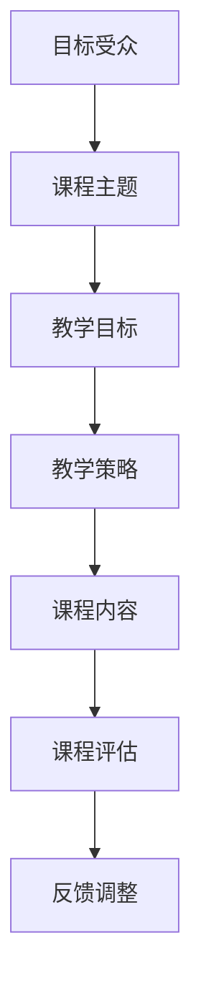

                 

关键词：知识付费，课程设计，专业教学，程序员，在线教育

> 摘要：随着在线教育市场的迅速发展，知识付费课程成为了许多程序员的收入来源。本文将探讨如何利用程序员的技能，打造高质量的知识付费课程，包括课程设计、教学内容、技术工具和营销策略等方面。

## 1. 背景介绍

近年来，知识付费成为了互联网行业的一大风口。人们逐渐认识到，专业知识的获取并非免费，付费课程成为了高效学习的重要途径。程序员作为互联网时代的重要职业，拥有丰富的技术知识和实战经验，他们中的许多人开始尝试通过开设知识付费课程，将自己的专业技能分享给更多人。

然而，如何打造专业的知识付费课程，不仅需要扎实的编程基础，还需要掌握教学技巧和市场策略。本文将围绕这个主题，探讨程序员如何打造专业的知识付费课程。

## 2. 核心概念与联系

在开始课程设计之前，程序员需要明确以下几个核心概念：

- **目标受众**：明确你的课程面向哪些人群，他们的技能水平和学习需求。
- **课程主题**：确定课程的核心内容，如编程语言、框架、工具等。
- **教学目标**：设定具体的学习目标，使学员能够通过课程掌握哪些技能。
- **教学策略**：选择合适的教学方法，如讲解、演示、练习、讨论等。

以下是一个使用Mermaid绘制的流程图，展示了这些核心概念之间的联系。



## 3. 核心算法原理 & 具体操作步骤

### 3.1 算法原理概述

在课程设计中，程序员需要运用算法原理来组织教学内容。以下是一个简化的算法原理概述：

1. **需求分析**：明确课程的目标和受众，分析他们的学习需求。
2. **内容规划**：根据需求分析，规划课程的内容和结构。
3. **教学设计**：选择合适的教学方法，设计教学流程和练习。
4. **课程评估**：通过测试和反馈，评估课程的有效性，并进行调整。

### 3.2 算法步骤详解

#### 步骤1：需求分析

- 调研目标受众的背景和需求
- 制定课程大纲和目录

#### 步骤2：内容规划

- 确定课程的核心知识和技能点
- 设计教学案例和练习

#### 步骤3：教学设计

- 选择教学方法和工具
- 制定教学计划和进度安排

#### 步骤4：课程评估

- 设计课程评估方法和工具
- 收集学员反馈，进行课程调整

### 3.3 算法优缺点

- **优点**：系统化、结构化的教学设计，有助于学员高效学习。
- **缺点**：需要较长的设计和准备时间，对程序员的教学能力有较高要求。

### 3.4 算法应用领域

- 在线教育平台
- 企业内训
- 编程社区和开源项目

## 4. 数学模型和公式 & 详细讲解 & 举例说明

在编程课程中，数学模型和公式是必不可少的组成部分。以下是一个简单的数学模型，用于讲解算法复杂度分析。

### 4.1 数学模型构建

$$
C(n) = \sum_{i=1}^{n} f(i)
$$

其中，\( C(n) \) 表示算法的复杂度，\( f(i) \) 表示第 \( i \) 层循环的复杂度。

### 4.2 公式推导过程

- **基本思想**：通过递归或迭代的方式，将复杂度分解为多个简单的部分，然后求和。

### 4.3 案例分析与讲解

以一个简单的二分查找算法为例，分析其时间复杂度。

```python
def binary_search(arr, target):
    left = 0
    right = len(arr) - 1
    while left <= right:
        mid = (left + right) // 2
        if arr[mid] == target:
            return mid
        elif arr[mid] < target:
            left = mid + 1
        else:
            right = mid - 1
    return -1
```

- **时间复杂度**：\( O(\log n) \)
- **空间复杂度**：\( O(1) \)

## 5. 项目实践：代码实例和详细解释说明

### 5.1 开发环境搭建

- 安装Python环境
- 安装代码编辑器（如Visual Studio Code）

### 5.2 源代码详细实现

以下是一个简单的Web爬虫示例。

```python
import requests
from bs4 import BeautifulSoup

def crawl(url):
    response = requests.get(url)
    if response.status_code == 200:
        soup = BeautifulSoup(response.content, 'html.parser')
        # 分析页面并提取数据
        # ...
    else:
        print("无法访问该页面")

# 示例使用
url = "https://example.com"
crawl(url)
```

### 5.3 代码解读与分析

- **requests模块**：用于发送HTTP请求。
- **BeautifulSoup模块**：用于解析HTML文档。

### 5.4 运行结果展示

运行代码后，会输出爬取到的网页内容。

## 6. 实际应用场景

知识付费课程的应用场景非常广泛，包括但不限于：

- **在线教育平台**：如慕课网、网易云课堂等，提供各种编程语言和技术的课程。
- **企业内训**：为企业员工提供定制化的技术培训。
- **开源项目**：通过知识付费课程，吸引更多开发者参与项目开发。

### 6.4 未来应用展望

随着技术的不断发展，知识付费课程将在以下几个方面得到进一步发展：

- **个性化学习**：通过大数据和人工智能技术，提供更加个性化的课程内容。
- **互动式教学**：利用虚拟现实和增强现实技术，增强学员的学习体验。
- **跨学科融合**：将编程与其他学科知识相结合，培养复合型人才。

## 7. 工具和资源推荐

### 7.1 学习资源推荐

- 《深度学习》
- 《算法导论》
- 《设计模式：可复用面向对象软件的基础》

### 7.2 开发工具推荐

- Python
- Node.js
- React

### 7.3 相关论文推荐

- "Theano: A CPU and GPU Math Compiler for Deep Learning"
- "TensorFlow: Large-Scale Machine Learning on Heterogeneous Systems"

## 8. 总结：未来发展趋势与挑战

### 8.1 研究成果总结

本文从多个角度探讨了程序员如何打造专业的知识付费课程，包括课程设计、教学内容、技术工具和营销策略等方面。

### 8.2 未来发展趋势

- **个性化学习**：通过大数据和人工智能技术，提供更加个性化的课程内容。
- **互动式教学**：利用虚拟现实和增强现实技术，增强学员的学习体验。
- **跨学科融合**：将编程与其他学科知识相结合，培养复合型人才。

### 8.3 面临的挑战

- **教学质量**：如何保证课程的高质量，满足学员的学习需求。
- **市场竞争**：如何在激烈的市场竞争中脱颖而出。

### 8.4 研究展望

未来的研究可以关注以下几个方面：

- **课程内容的创新**：结合最新的技术趋势，更新课程内容。
- **教学方法的优化**：探索更加高效的教学方法，提高学员的学习效果。
- **技术工具的开发**：利用人工智能和大数据技术，提升课程的智能化水平。

## 9. 附录：常见问题与解答

### 问题1：如何确定课程的目标受众？

**解答**：可以通过以下几种方式确定目标受众：

- **调研**：通过问卷调查、访谈等方式收集目标受众的信息。
- **数据分析**：分析已有的用户数据，了解他们的学习习惯和需求。
- **市场研究**：了解市场上的竞争对手，分析他们的课程受众。

### 问题2：如何保证课程的质量？

**解答**：可以从以下几个方面保证课程的质量：

- **内容规划**：确保课程内容覆盖核心知识点，避免重复和遗漏。
- **教学设计**：选择合适的教学方法，提高学员的参与度和学习效果。
- **课程评估**：通过测试和反馈，评估课程的有效性，并进行调整。

### 问题3：如何营销知识付费课程？

**解答**：可以从以下几个方面进行课程营销：

- **社交媒体**：利用微博、微信公众号等社交媒体平台，宣传课程。
- **合作伙伴**：与相关的企业、社群、教育机构等建立合作关系，共同推广课程。
- **内容营销**：通过高质量的内容，吸引潜在学员的关注。

# 作者：禅与计算机程序设计艺术 / Zen and the Art of Computer Programming

本文旨在帮助程序员打造专业的知识付费课程，通过明确课程设计、教学内容、技术工具和营销策略等方面，提高课程的质量和影响力。希望本文能为广大程序员提供有益的参考和启示。

