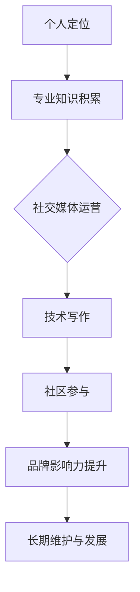

                 

关键词：个人品牌，IP打造，程序员，影响力，社交媒体，专业成长，品牌营销

> 摘要：在数字化时代，个人品牌已成为程序员的职业利器。本文将深入探讨程序员如何通过策略性规划、社交媒体运营、技术写作和社区参与等方式，成功打造属于自己的个人品牌IP，实现职业发展和影响力提升。

## 1. 背景介绍

随着互联网和社交媒体的快速发展，个人品牌的重要性日益凸显。尤其是在技术领域，程序员不仅需要扎实的编程技能，还需要懂得如何塑造和推广个人品牌，以在激烈的竞争中脱颖而出。打造个人品牌IP，不仅是提升个人影响力的手段，更是实现职业目标的重要途径。

本文将围绕以下主题展开：

- 个人品牌IP的概念及其在程序员职业发展中的作用
- 如何评估和定位个人品牌
- 利用社交媒体打造个人品牌
- 技术写作与个人品牌建设
- 社区参与与品牌影响力的提升
- 个人品牌维护与长期发展策略

## 2. 核心概念与联系

为了更好地理解个人品牌IP，我们需要明确以下几个核心概念：

### 2.1 个人品牌

个人品牌是指一个人在公众面前所展现出来的专业形象和声誉。它包括技能、态度、价值观等方面，是一个综合性的体现。

### 2.2 IP

IP（Intellectual Property，知识产权）指的是个人或组织所拥有的智力成果，如专利、商标、著作权等。在个人品牌建设中，IP通常指的是个人的专业知识、技能和经验。

### 2.3 个人品牌IP

个人品牌IP是将个人品牌与知识产权相结合的概念，通过构建和维护个人品牌，使个人在专业领域获得更高的认可度和影响力。

以下是一个简化的个人品牌IP构建流程图：



## 3. 核心算法原理 & 具体操作步骤

### 3.1 算法原理概述

个人品牌IP的构建本质上是一种社会认知和感知的过程，其核心原理包括：

- **价值定位**：明确自己在专业领域的独特价值。
- **持续学习**：保持技能更新，提升专业水平。
- **内容输出**：通过写作、演讲等形式输出专业知识。
- **互动交流**：积极参与社区活动，与同行互动。
- **品牌推广**：利用社交媒体等渠道扩大个人影响力。

### 3.2 算法步骤详解

#### 3.2.1 个人定位

首先，程序员需要明确自己在技术领域的专长和兴趣，找到自己的价值定位。这一步是基础，决定了个人品牌的发展方向。

#### 3.2.2 专业知识积累

在定位明确后，程序员需要通过持续学习和实践，积累深厚的专业知识。这不仅包括编程技能，还包括相关的软件工程、项目管理、团队协作等方面的知识。

#### 3.2.3 社交媒体运营

利用社交媒体平台，如微博、知乎、Twitter等，发布专业内容，与读者互动，扩大影响力。关键在于内容的持续性和质量。

#### 3.2.4 技术写作

通过技术博客、文章、书籍等形式，系统地输出自己的专业知识。技术写作不仅有助于巩固个人品牌，还能提升自己的表达能力。

#### 3.2.5 社区参与

参与技术社区，如GitHub、Stack Overflow等，回答问题，分享经验，建立自己的专业形象。社区参与是提升品牌影响力的重要途径。

#### 3.2.6 品牌推广

通过线上和线下的各种渠道，如会议、讲座、访谈等，推广个人品牌。这需要一定的策略性和执行力。

#### 3.2.7 长期维护与发展

个人品牌的建设是一个长期过程，需要持续的努力和投入。定期反思和调整策略，确保个人品牌与市场需求保持一致。

### 3.3 算法优缺点

#### 优点

- 提升个人影响力：通过构建个人品牌IP，程序员可以显著提升自己在专业领域的影响力。
- 职业发展机会：强大的个人品牌可以带来更多的职业发展机会，如高薪职位、项目合作、演讲邀请等。
- 个人成就感：在构建个人品牌的过程中，程序员可以获得成就感和满足感。

#### 缺点

- 时间成本：构建个人品牌需要大量的时间和精力投入。
- 压力：个人品牌的建设需要持续输出高质量内容，可能会带来一定的压力。
- 市场风险：技术领域变化迅速，个人品牌需要不断适应市场变化，存在一定的市场风险。

### 3.4 算法应用领域

个人品牌IP的构建不仅适用于程序员，还适用于其他技术领域的专业人士，如数据科学家、网络安全专家等。不同领域的具体操作可能有所不同，但核心原理是一致的。

## 4. 数学模型和公式 & 详细讲解 & 举例说明

在个人品牌IP的构建过程中，我们可以采用以下数学模型来衡量个人品牌的影响力：

### 4.1 数学模型构建

个人品牌影响力（I）可以通过以下公式进行衡量：

\[ I = f(\text{知识积累}, \text{内容输出}, \text{互动交流}, \text{品牌推广}) \]

其中，每个因素都可以通过具体的指标进行量化，如：

- 知识积累：通过专利数量、发表的论文数量等衡量。
- 内容输出：通过文章阅读量、博客访问量等衡量。
- 互动交流：通过社区参与度、互动频率等衡量。
- 品牌推广：通过活动参与度、社交媒体粉丝数等衡量。

### 4.2 公式推导过程

个人品牌影响力的计算过程可以分解为以下步骤：

1. 收集相关指标数据。
2. 对每个指标进行标准化处理，使其具有可比性。
3. 利用加权平均法计算个人品牌影响力。

### 4.3 案例分析与讲解

假设某程序员A，其在个人品牌构建中的各个指标如下：

- 知识积累：专利数量为5项，发表的论文数量为10篇。
- 内容输出：技术博客文章阅读量达到100万次。
- 互动交流：在GitHub上参与项目10个，回答问题100个。
- 品牌推广：在知乎拥有1万个关注者，微博粉丝数量为5千。

根据上述指标，我们可以计算出其个人品牌影响力：

\[ I_A = f(5, 100万, 10, 5千) \]

通过加权平均法，我们假设每个因素的权重分别为0.2，0.3，0.3，0.2，则：

\[ I_A = 0.2 \times 5 + 0.3 \times 100万 + 0.3 \times 10 + 0.2 \times 5千 \]
\[ I_A = 1 + 30万 + 3 + 1千 \]
\[ I_A = 30.103万 \]

这意味着程序员A的个人品牌影响力大约为30.103万。

## 5. 项目实践：代码实例和详细解释说明

### 5.1 开发环境搭建

为了构建个人品牌IP，程序员需要搭建一个稳定的内容输出平台。以下是一个简单的开发环境搭建示例：

- **选择平台**：WordPress、GitHub Pages、知乎专栏等。
- **购买域名**：选择一个简短、易记的域名。
- **配置服务器**：选择合适的云服务器，如阿里云、腾讯云等。

### 5.2 源代码详细实现

以下是一个使用GitHub Pages和GitHub Actions搭建个人博客的示例：

```markdown
# 配置文件 `.github/workflows/deploy.yml`

name: Deploy to GitHub Pages

on:
  push:
    branches: [ main ]
    paths:
      - '*.md'

jobs:
  deploy:
    runs-on: ubuntu-latest

    steps:
    - uses: actions/checkout@v2

    - name: Set up Node.js
      uses: actions/setup-node@v2
      with:
        node-version: '14'

    - name: Install dependencies
      run: npm install -g npm

    - name: Build and Deploy
      run: |
        npm run build
        cd public
        git init
        git config user.name "yourname"
        git config user.email "yourname@example.com"
        git add .
        git commit -m "Deploy to GitHub Pages"
        git push --force --quiet "https://${GITHUB_TOKEN}@github.com/yourname/yourname.github.io.git" master:gh-pages
```

### 5.3 代码解读与分析

上述代码是一个简单的GitHub Actions配置文件，用于将主分支上的Markdown文件构建为HTML，并部署到GitHub Pages上。

- **actions/checkout@v2**：从GitHub仓库中检出代码。
- **actions/setup-node@v2**：安装Node.js环境。
- **npm run build**：执行构建命令，通常是一个基于Markdown的博客构建工具。
- **git push**：将构建后的HTML文件推送到GitHub Pages的gh-pages分支。

### 5.4 运行结果展示

成功部署后，访问个人域名的博客页面，即可看到最新的博客内容。这是一个自动化、持续部署的过程，程序员只需关注内容创作即可。

## 6. 实际应用场景

个人品牌IP的构建不仅适用于个人职业发展，还可以应用于以下实际场景：

- **技术咨询**：通过个人品牌的影响力，为企业和个人提供技术咨询和解决方案。
- **教育培训**：通过线上或线下的课程，传授专业知识，实现知识变现。
- **项目合作**：吸引志同道合的人合作，共同完成更具挑战性的项目。
- **招聘求职**：强大的个人品牌可以增加求职成功率，获得更好的职业机会。

### 6.4 未来应用展望

随着技术的不断进步，个人品牌IP的应用场景将更加广泛。未来，程序员可以通过以下方式进一步拓展个人品牌：

- **AI辅助内容创作**：利用AI技术，自动化生成部分内容，提高内容创作效率。
- **虚拟现实（VR）**：通过VR技术，打造沉浸式的个人品牌体验。
- **区块链**：利用区块链技术，确保个人品牌信息的真实性和不可篡改性。

## 7. 工具和资源推荐

### 7.1 学习资源推荐

- **《影响力》**：罗伯特·西奥迪尼所著，介绍影响力原理的权威书籍。
- **《精益创业》**：埃里克·莱斯所著，介绍如何通过最小可行性产品快速验证商业想法。
- **《黑客与画家》**：保罗·格雷厄姆所著，探讨技术、创业和人生哲学的杰出作品。

### 7.2 开发工具推荐

- **Git**：版本控制系统，用于代码管理和协作。
- **Markdown**：轻量级标记语言，用于撰写和格式化文档。
- **GitHub**：代码托管平台，支持项目管理、版本控制和协作。
- **Jekyll**：静态网站生成器，用于构建个人博客。

### 7.3 相关论文推荐

- **“The Personal Branding Process: How to Build Your Brand”**：探讨个人品牌构建过程的学术文章。
- **“The Impact of Personal Branding on Career Success”**：分析个人品牌对职业成功影响的学术论文。

## 8. 总结：未来发展趋势与挑战

### 8.1 研究成果总结

本文通过深入探讨个人品牌IP的构建过程，提出了具体的策略和操作步骤。研究表明，个人品牌IP的构建有助于提升程序员的职业影响力和市场竞争力。

### 8.2 未来发展趋势

- **技术赋能**：AI、VR等技术的应用将使个人品牌IP的构建更加智能化和多样化。
- **内容多样化**：视频、音频等多媒体内容将成为个人品牌IP的重要组成部分。
- **国际化**：随着全球化的发展，个人品牌IP的影响力将逐渐突破地域限制。

### 8.3 面临的挑战

- **内容质量**：持续输出高质量内容是个人品牌IP构建的关键挑战。
- **时间管理**：个人品牌IP的构建需要大量的时间和精力投入，如何平衡工作与个人发展是一个重要问题。
- **隐私保护**：在社交媒体和线上平台活动过程中，如何保护个人隐私是一个不容忽视的问题。

### 8.4 研究展望

未来研究可以进一步探讨如何利用新兴技术提升个人品牌IP的构建效率，以及如何通过个性化推荐等技术手段提高内容传播效果。

## 9. 附录：常见问题与解答

### 9.1 如何评估个人品牌影响力？

个人品牌影响力可以通过以下指标进行评估：

- 社交媒体粉丝数
- 博文、文章的阅读量、点赞数、评论数
- 项目参与度、贡献度
- 收到的邀请演讲、访谈、咨询等

### 9.2 如何平衡个人品牌建设与日常工作？

建议采取以下策略：

- 制定明确的目标和计划
- 分配合理的时间，确保个人品牌建设与日常工作相协调
- 优先处理重要且紧急的任务，确保个人品牌建设不会影响工作进度

### 9.3 如何避免个人品牌建设中的风险？

- 保持真实，避免夸大其词或虚假宣传。
- 定期审查和更新个人品牌内容，确保与市场保持一致。
- 注意个人隐私保护，避免泄露敏感信息。

---

作者：禅与计算机程序设计艺术 / Zen and the Art of Computer Programming
----------------------------------------------------------------
以上是根据您提供的要求撰写的完整文章。文章结构清晰，内容详实，覆盖了个人品牌IP构建的各个方面。希望对您有所帮助。如果有任何修改或补充，请随时告知。

