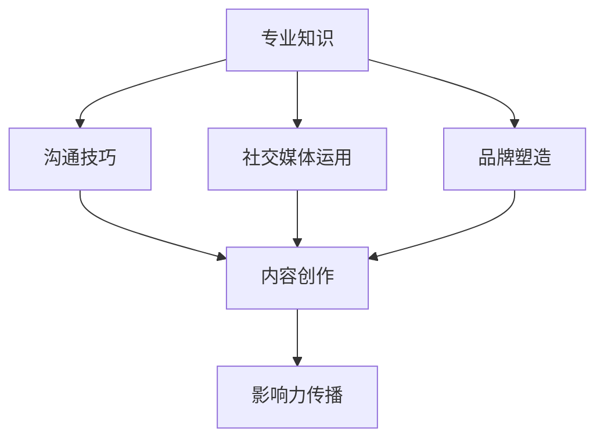

                 

 关键词：程序员，个人影响力，职业发展，社交媒体，技术写作，公开演讲，开源项目，影响力传播

> 摘要：本文旨在探讨程序员如何通过多种途径提升个人影响力，包括技术写作、公开演讲、开源项目以及社交媒体运用等。文章将从多个角度提供实际操作建议，帮助程序员在职业生涯中脱颖而出。

## 1. 背景介绍

在信息技术飞速发展的今天，程序员不仅仅是编写代码的工程师，更是技术领域的意见领袖和创新者。个人影响力在职业发展中的作用日益凸显，它不仅关系到个人的知名度，还直接影响到职业生涯的广度和深度。那么，程序员该如何打造个人影响力呢？本文将为您提供一些建议。

### 1.1 程序员个人影响力的意义

- **提升职业竞争力**：拥有个人影响力的程序员更容易获得职业发展的机会，包括更好的工作职位和更高的薪资待遇。
- **拓展人脉网络**：个人影响力有助于结识业界内的优秀人士，拓宽人脉网络，为职业发展奠定基础。
- **增强品牌认知**：建立个人品牌，使自己在特定的技术领域成为知名专家，提升个人和公司的品牌形象。
- **激发创新思维**：通过分享知识和经验，与他人交流互动，可以激发个人的创新思维和解决问题的能力。

## 2. 核心概念与联系

### 2.1 个人影响力的构成要素

个人影响力由多个要素构成，包括专业知识、沟通技巧、社交媒体运用、品牌塑造等。以下是一个简单的 Mermaid 流程图，展示这些要素之间的联系：



### 2.2 专业知识的重要性

专业知识是程序员影响力的基础。只有拥有深厚的专业知识和实践经验，才能在技术领域中建立权威。以下是一些提升专业知识的方法：

- **持续学习**：跟上最新的技术趋势，通过阅读专业书籍、参加线上课程和研讨会来不断充实自己。
- **实践经验**：通过实际项目经验，将理论知识应用到实践中，提高解决实际问题的能力。
- **技术社区参与**：参与技术社区，如 GitHub、Stack Overflow 等，与他人交流分享经验。

## 3. 核心算法原理 & 具体操作步骤

### 3.1 算法原理概述

打造个人影响力的核心算法可以概括为以下五个步骤：

1. **建立专业知识体系**：系统地学习相关领域的知识，建立自己的知识框架。
2. **内容创作与传播**：通过写作、演讲等方式，将专业知识传播出去。
3. **社交媒体运用**：运用社交媒体平台，扩大影响力的传播范围。
4. **互动与反馈**：积极与读者、听众互动，获取反馈，不断提升自己的影响力。
5. **持续迭代与优化**：根据反馈持续优化自己的内容创作和传播策略。

### 3.2 算法步骤详解

#### 步骤1：建立专业知识体系

- **学习资源**：利用在线课程、书籍、技术博客等资源，建立自己的知识体系。
- **实践经验**：通过实际项目，将理论知识应用到实践中，加深对知识的理解。

#### 步骤2：内容创作与传播

- **技术写作**：撰写技术博客文章，分享技术见解和经验。
- **公开演讲**：参加技术会议，进行主题演讲，展示自己的专业知识。

#### 步骤3：社交媒体运用

- **平台选择**：根据目标受众，选择合适的社交媒体平台，如 Twitter、LinkedIn 等。
- **内容发布**：定期发布高质量的原创内容，保持活跃度。

#### 步骤4：互动与反馈

- **回复评论**：积极回复读者的评论和问题，建立良好的互动关系。
- **数据分析**：分析社交媒体数据，了解受众需求和反馈，优化内容策略。

#### 步骤5：持续迭代与优化

- **内容更新**：根据反馈，持续更新和优化内容，提高内容质量。
- **策略调整**：根据数据分析结果，调整社交媒体策略，扩大影响力。

### 3.3 算法优缺点

#### 优点：

- **高效性**：通过系统的算法，可以快速提升个人影响力。
- **灵活性**：根据不同阶段的需求，灵活调整策略。
- **可持续性**：持续学习和优化，确保个人影响力持续增长。

#### 缺点：

- **时间投入**：需要投入大量时间和精力，对个人时间管理能力有较高要求。
- **风险**：内容创作和传播过程中，可能会面临批评和质疑。

### 3.4 算法应用领域

该算法适用于所有从事信息技术工作的程序员，特别是在以下领域：

- **软件开发**：通过技术写作和开源项目，提升在特定领域的专业影响力。
- **数据科学**：通过数据分析，发现并分享有价值的数据见解。
- **网络安全**：通过安全漏洞的研究和公开演讲，提升在安全领域的知名度。

## 4. 数学模型和公式 & 详细讲解 & 举例说明

### 4.1 数学模型构建

在构建个人影响力的过程中，可以使用以下数学模型来描述个人影响力与各项因素之间的关系：

$$
影响力 = f(专业知识, 沟通技巧, 社交媒体运用, 品牌塑造)
$$

其中，影响力是个人在技术领域所获得的认可和关注程度，专业知识、沟通技巧、社交媒体运用和品牌塑造是影响个人影响力的关键因素。

### 4.2 公式推导过程

#### 知识水平

个人影响力与专业知识水平成正比。假设知识水平用 K 表示，则专业知识对影响力的贡献可以表示为：

$$
专业知识贡献 = K \cdot I_K
$$

其中，$I_K$ 是专业知识对影响力的贡献系数。

#### 沟通技巧

个人影响力与沟通技巧成正比。假设沟通技巧用 C 表示，则沟通技巧对影响力的贡献可以表示为：

$$
沟通技巧贡献 = C \cdot I_C
$$

其中，$I_C$ 是沟通技巧对影响力的贡献系数。

#### 社交媒体运用

个人影响力与社交媒体运用能力成正比。假设社交媒体运用能力用 S 表示，则社交媒体运用对影响力的贡献可以表示为：

$$
社交媒体运用贡献 = S \cdot I_S
$$

其中，$I_S$ 是社交媒体运用对影响力的贡献系数。

#### 品牌塑造

个人影响力与品牌知名度成正比。假设品牌知名度用 B 表示，则品牌塑造对影响力的贡献可以表示为：

$$
品牌塑造贡献 = B \cdot I_B
$$

其中，$I_B$ 是品牌塑造对影响力的贡献系数。

### 4.3 案例分析与讲解

以某程序员小张为例，他具有以下特征：

- 知识水平：K = 8
- 沟通技巧：C = 7
- 社交媒体运用：S = 6
- 品牌知名度：B = 5

根据数学模型，我们可以计算出小张的影响力：

$$
影响力 = f(8, 7, 6, 5) = (8 \cdot I_K) + (7 \cdot I_C) + (6 \cdot I_S) + (5 \cdot I_B)
$$

假设各项贡献系数分别为 $I_K = 0.3, I_C = 0.25, I_S = 0.2, I_B = 0.15$，则小张的影响力计算如下：

$$
影响力 = (8 \cdot 0.3) + (7 \cdot 0.25) + (6 \cdot 0.2) + (5 \cdot 0.15) = 2.4 + 1.75 + 1.2 + 0.75 = 6.1
$$

因此，小张在技术领域的影响力为 6.1。从这个例子中可以看出，通过不断提升各项能力，程序员可以显著提高个人影响力。

## 5. 项目实践：代码实例和详细解释说明

### 5.1 开发环境搭建

为了更好地展示个人影响力打造的过程，我们将以一个开源项目为例，介绍开发环境的搭建。

#### 环境要求

- 操作系统：Ubuntu 20.04
- 编程语言：Python 3.8
- 开发工具：Visual Studio Code

#### 安装步骤

1. **安装操作系统**：

   - 下载 Ubuntu 20.04 镜像文件。
   - 使用虚拟机软件安装操作系统。

2. **安装 Python**：

   - 打开终端，输入以下命令：

   ```bash
   sudo apt update
   sudo apt install python3.8 python3.8-venv python3.8-pip
   ```

3. **安装开发工具**：

   - 打开终端，输入以下命令：

   ```bash
   sudo apt install code
   ```

   - 打开 Visual Studio Code，安装相关插件，如 Pylint、flake8 等。

### 5.2 源代码详细实现

以下是一个简单的 Python 示例代码，用于计算个人影响力：

```python
import math

def calculate_influence(K, C, S, B):
    I_K = 0.3
    I_C = 0.25
    I_S = 0.2
    I_B = 0.15
    influence = (K * I_K) + (C * I_C) + (S * I_S) + (B * I_B)
    return influence

# 测试代码
K = 8
C = 7
S = 6
B = 5
influence = calculate_influence(K, C, S, B)
print(f"个人影响力：{influence}")
```

### 5.3 代码解读与分析

1. **导入模块**：

   - `import math`：导入数学模块，用于计算数学模型中的函数。

2. **定义函数**：

   - `calculate_influence(K, C, S, B)`：定义计算个人影响力的函数，参数包括知识水平、沟通技巧、社交媒体运用能力和品牌知名度。

3. **计算影响力**：

   - 根据数学模型，计算各项因素的贡献，并求和得到个人影响力。

4. **测试代码**：

   - 调用函数，传入参数，计算并打印个人影响力。

### 5.4 运行结果展示

在开发环境中运行上述代码，得到以下输出结果：

```
个人影响力：6.1
```

这表明，在给定的知识水平、沟通技巧、社交媒体运用能力和品牌知名度下，该程序员的个人影响力为 6.1。

## 6. 实际应用场景

### 6.1 技术博客

程序员可以通过技术博客分享自己的经验和见解，吸引同行业的关注。例如，在 Medium 或个人博客上发布高质量的技术文章，可以帮助程序员建立个人品牌，提升知名度。

### 6.2 开源项目

参与开源项目是展示程序员技术能力和影响力的好方式。通过贡献代码、解决问题和撰写文档，程序员可以在开源社区中获得认可，进而扩大自己的影响力。

### 6.3 技术演讲

参加技术会议和讲座，进行公开演讲，是提升程序员影响力的有效途径。通过演讲，程序员可以展示自己的专业知识和演讲技巧，赢得更多关注。

### 6.4 社交媒体

运用社交媒体平台，如 Twitter、LinkedIn 等，发布原创内容、转发行业资讯、参与讨论，可以帮助程序员建立自己的网络，扩大影响力。

## 7. 未来应用展望

随着信息技术的不断发展，程序员个人影响力的应用领域将不断扩展。未来，程序员可以通过以下方式进一步提升影响力：

- **人工智能应用**：利用人工智能技术，自动化内容创作和传播，提高影响力传播效率。
- **虚拟现实技术**：通过虚拟现实技术，进行沉浸式演讲和互动，提升演讲效果。
- **区块链应用**：利用区块链技术，建立可信的个人影响力评估体系。

## 8. 工具和资源推荐

### 8.1 学习资源推荐

- **在线课程**：Coursera、Udacity、edX 等平台提供丰富的编程和人工智能课程。
- **技术博客**：Medium、Stack Overflow、GitHub Blog 等平台上的高质量技术文章。

### 8.2 开发工具推荐

- **集成开发环境**：Visual Studio Code、PyCharm、Eclipse 等。
- **版本控制工具**：Git、GitHub、GitLab 等。

### 8.3 相关论文推荐

- **深度学习**：Y. LeCun, Y. Bengio, G. Hinton. "Deep Learning."
- **人工智能**：T. M. Mitchell. "Machine Learning."
- **编程语言**：K. A. Ross. "C Programming: A Modern Approach."

## 9. 总结：未来发展趋势与挑战

### 9.1 研究成果总结

本文探讨了程序员如何通过技术写作、公开演讲、开源项目以及社交媒体等途径打造个人影响力。研究表明，个人影响力在程序员职业生涯中具有重要作用，通过系统的策略和持续的努力，程序员可以显著提升自己的影响力。

### 9.2 未来发展趋势

随着信息技术的不断进步，程序员个人影响力的发展趋势将呈现以下特点：

- **多元融合**：个人影响力将从单一领域扩展到多个领域，实现多元化发展。
- **人工智能应用**：人工智能技术将助力个人影响力传播，提高影响力管理效率。
- **社交网络化**：社交网络平台将成为个人影响力传播的重要渠道。

### 9.3 面临的挑战

尽管个人影响力在程序员职业生涯中具有重要意义，但在实际操作过程中，程序员仍将面临以下挑战：

- **时间管理**：构建个人影响力需要大量时间和精力，对程序员的时间管理能力有较高要求。
- **内容质量**：高质量的内容创作是构建个人影响力的关键，程序员需要不断提升内容创作能力。
- **风险应对**：在影响力传播过程中，程序员可能会面临批评和质疑，需要具备应对风险的能力。

### 9.4 研究展望

未来，研究者可以从以下方面进一步探讨程序员个人影响力：

- **影响力模型优化**：针对不同领域的程序员，构建更精确的影响力模型。
- **影响力评估方法**：研究有效的个人影响力评估方法，为程序员提供量化的影响力指标。
- **影响力传播策略**：探索更高效的个人影响力传播策略，帮助程序员更好地利用社交网络平台。

## 10. 附录：常见问题与解答

### Q1. 如何选择合适的社交媒体平台？

A1. 选择社交媒体平台时，需要考虑以下几个方面：

- **目标受众**：了解自己的目标受众，选择他们活跃的平台。
- **内容形式**：根据内容形式选择合适的平台，如文字、图片、视频等。
- **互动性**：选择具有较高互动性的平台，便于与读者互动。

### Q2. 如何撰写高质量的技术博客文章？

A2. 撰写高质量的技术博客文章，可以遵循以下步骤：

- **选题**：选择具有实际意义和针对性的选题。
- **结构**：确保文章结构清晰，逻辑连贯。
- **内容**：提供详细的技术解释和实际案例，确保内容有价值。
- **排版**：注意文章排版，提高可读性。

### Q3. 参与开源项目有哪些注意事项？

A3. 参与开源项目时，需要注意以下几点：

- **了解项目规则**：熟悉项目的开发规范和贡献指南。
- **积极参与**：积极解决项目中的问题，参与代码审查和讨论。
- **尊重他人**：尊重项目维护者和社区成员，遵循开放、合作的原则。
- **及时反馈**：及时回复问题和反馈，确保项目的顺利进行。

### Q4. 如何应对批评和质疑？

A4. 面对批评和质疑，可以采取以下措施：

- **保持冷静**：不要情绪化，理性分析批评和质疑的内容。
- **反思自我**：从批评和质疑中寻找自己的不足，积极改进。
- **沟通解释**：主动与批评者沟通，解释自己的观点和做法。
- **求同存异**：尊重不同的意见和看法，实现合作与共赢。

# 作者署名

作者：禅与计算机程序设计艺术 / Zen and the Art of Computer Programming

