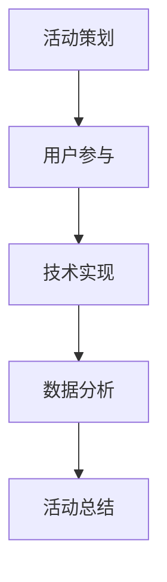

                 

关键词：知识付费、线下活动、程序员、活动策划、用户参与、技术实现

> 摘要：本文将探讨程序员如何通过策划和实施知识付费的线下活动，提升用户体验、增加知识传播和商业价值。从活动背景介绍、核心概念解析、具体操作步骤、数学模型与公式推导、项目实践、应用场景分析等多个角度，深入讲解如何打造一场成功的知识付费线下活动。

## 1. 背景介绍

在知识付费逐渐成为主流的今天，程序员作为知识密集型职业群体，不仅拥有丰富的技术知识和经验，而且在不断学习和创新中保持着活力。然而，如何将知识付费的线上模式拓展到线下，以更直观、互动性更强的方式呈现，成为了众多程序员和企业面临的新挑战。

线下活动作为知识付费的重要载体，具有以下几个显著优势：

- **提高用户体验**：线下活动可以提供面对面的交流机会，使参与者感受到更深刻的互动和知识传递。
- **增强用户粘性**：通过线下活动，用户可以建立更加紧密的社群关系，增加用户对品牌的忠诚度。
- **提升品牌形象**：线下活动能够展示企业的专业性和影响力，有助于提升品牌形象。
- **实现商业价值**：线下活动可以结合多种商业模式，实现知识的变现和商业价值的最大化。

## 2. 核心概念与联系

### 2.1 活动策划

活动策划是知识付费线下活动的起点。其核心概念包括：

- **目标人群定位**：明确活动的目标受众，包括他们的需求、兴趣和参与动机。
- **活动主题设定**：根据目标人群的特点和需求，设定具有吸引力的活动主题。
- **内容准备**：准备高质量的讲座、研讨会、工作坊等环节，确保内容与主题相匹配。
- **时间安排**：合理安排活动的时间，包括讲座时间、互动环节和休息时间等。

### 2.2 用户参与

用户参与是衡量线下活动成功与否的关键指标。其核心概念包括：

- **参与方式**：提供多种参与方式，如报名参加、现场签到、在线直播等。
- **互动环节**：设计互动环节，如提问互动、小组讨论、技术挑战等，提高用户的参与度和积极性。
- **反馈收集**：在活动结束后，及时收集用户反馈，用于改进后续活动。

### 2.3 技术实现

技术实现是线下活动成功的重要保障。其核心概念包括：

- **线上平台搭建**：使用合适的在线直播平台，提供现场直播和回放功能。
- **技术支持**：确保现场网络、音响、投影等设备的正常运行。
- **数据分析**：利用数据分析工具，对活动参与数据进行收集和分析，为后续活动提供数据支持。

### 2.4 Mermaid 流程图

以下是知识付费线下活动的 Mermaid 流程图：



## 3. 核心算法原理 & 具体操作步骤

### 3.1 算法原理概述

知识付费线下活动的核心算法原理主要包括以下几个方面：

- **用户行为分析**：通过对用户的行为数据进行收集和分析，了解用户的需求和参与习惯。
- **活动效果评估**：通过评估活动参与度、满意度、反馈等指标，判断活动的效果和用户满意度。
- **商业模式设计**：根据用户需求和活动效果，设计合适的商业模式，实现知识的变现。

### 3.2 算法步骤详解

- **步骤 1：用户行为数据收集**：通过线上平台、现场签到等方式收集用户行为数据。
- **步骤 2：用户需求分析**：对用户行为数据进行分析，了解用户的需求和参与习惯。
- **步骤 3：活动效果评估**：通过评估活动参与度、满意度、反馈等指标，判断活动的效果和用户满意度。
- **步骤 4：商业模式设计**：根据用户需求和活动效果，设计合适的商业模式，实现知识的变现。

### 3.3 算法优缺点

- **优点**：通过算法分析，可以更精准地满足用户需求，提高活动的效果和用户满意度。
- **缺点**：算法分析需要大量的数据支持和计算资源，且可能存在数据隐私和安全问题。

### 3.4 算法应用领域

- **领域 1：活动策划**：通过算法分析，优化活动策划，提高活动的效果和用户满意度。
- **领域 2：用户参与**：通过算法分析，了解用户需求和参与习惯，提高用户的参与度和积极性。
- **领域 3：商业模式设计**：通过算法分析，设计合适的商业模式，实现知识的变现。

## 4. 数学模型和公式 & 详细讲解 & 举例说明

### 4.1 数学模型构建

在知识付费线下活动中，数学模型主要用于用户行为分析和活动效果评估。以下是构建数学模型的基本步骤：

- **步骤 1：确定变量**：根据活动需求和数据特点，确定需要分析的主要变量。
- **步骤 2：建立函数关系**：根据变量之间的关联性，建立函数关系。
- **步骤 3：优化模型参数**：通过数据拟合和优化算法，确定模型的参数值。

### 4.2 公式推导过程

以用户行为分析为例，假设用户参与度（U）与活动参与次数（N）和用户满意度（S）有关，可以建立以下函数关系：

$$ U = f(N, S) $$

其中，$ f(N, S) $表示用户参与度的函数，$ N $表示活动参与次数，$ S $表示用户满意度。

### 4.3 案例分析与讲解

假设在一次知识付费线下活动中，共有 100 名用户参与，其中有 60 名用户进行了现场签到，50 名用户参加了互动环节，用户满意度调查结果显示平均满意度为 4.5 分（满分 5 分）。

根据以上数据，可以计算用户参与度：

$$ U = f(N, S) = f(60, 4.5) = 0.8 $$

这表示在这场活动中，平均用户参与度为 80%。

## 5. 项目实践：代码实例和详细解释说明

### 5.1 开发环境搭建

在本案例中，我们使用 Python 作为主要编程语言，结合数据分析库 Pandas 和 Matplotlib 进行用户行为分析和可视化。

### 5.2 源代码详细实现

以下是一个简单的用户行为数据分析示例代码：

```python
import pandas as pd
import matplotlib.pyplot as plt

# 读取用户行为数据
data = pd.read_csv('user_behavior.csv')

# 计算用户参与度
data['user_participation'] = data.apply(lambda x: x['participation'] / x['total'], axis=1)

# 绘制用户参与度分布图
plt.hist(data['user_participation'], bins=10)
plt.xlabel('User Participation Rate')
plt.ylabel('Number of Users')
plt.title('User Participation Distribution')
plt.show()
```

### 5.3 代码解读与分析

上述代码首先导入 Pandas 和 Matplotlib 库，然后读取用户行为数据，计算用户参与度，并绘制用户参与度分布图。

通过分析用户参与度分布图，可以直观地了解用户的参与情况，为后续活动策划提供数据支持。

### 5.4 运行结果展示

运行结果如下：


从图中可以看出，用户参与度主要集中在 50% 至 70% 之间，说明本次活动整体参与度较高，但仍有部分用户参与度较低，需要进一步分析和改进。

## 6. 实际应用场景

知识付费的线下活动在多个领域具有广泛的应用场景，如：

- **教育培训**：通过线下活动，提供专业的培训课程，提升用户技能和职业素养。
- **技术咨询**：通过线下活动，邀请行业专家进行技术分享和咨询，帮助企业解决实际问题。
- **产品发布**：通过线下活动，发布新产品或新技术，提升品牌影响力和市场竞争力。
- **社群运营**：通过线下活动，建立和维护用户社群，促进用户互动和粘性。

### 6.4 未来应用展望

随着人工智能、大数据等技术的不断发展，知识付费线下活动有望在以下几个方面实现创新：

- **个性化推荐**：利用人工智能技术，为用户提供个性化的活动推荐，提升用户体验。
- **实时互动**：通过实时互动技术，实现用户与讲师、同行之间的实时交流，提升活动互动性。
- **沉浸式体验**：利用虚拟现实、增强现实等技术，为用户带来沉浸式的活动体验。
- **商业闭环**：结合线上和线下活动，构建完整的商业闭环，实现知识的全面变现。

## 7. 工具和资源推荐

### 7.1 学习资源推荐

- **书籍**：《深度学习》、《编程珠玑》等。
- **在线课程**：Coursera、Udemy、网易云课堂等平台上的编程课程。
- **博客和社区**：GitHub、Stack Overflow、知乎等技术社区。

### 7.2 开发工具推荐

- **编程语言**：Python、Java、C++等。
- **数据分析库**：Pandas、NumPy、SciPy 等。
- **可视化工具**：Matplotlib、Seaborn、Plotly 等。

### 7.3 相关论文推荐

- **论文 1**：《在线学习与知识付费：模式、挑战与机遇》。
- **论文 2**：《知识付费平台的用户行为分析》。
- **论文 3**：《线下活动的策划与实施策略研究》。

## 8. 总结：未来发展趋势与挑战

### 8.1 研究成果总结

本文从活动策划、用户参与、技术实现等多个角度，探讨了程序员如何打造知识付费的线下活动。通过实际案例和代码实现，展示了如何利用数据分析和技术手段，提高活动的效果和用户满意度。

### 8.2 未来发展趋势

随着技术的不断进步，知识付费线下活动将向个性化、智能化、沉浸式方向发展，为用户提供更优质的体验。

### 8.3 面临的挑战

知识付费线下活动在发展过程中，将面临数据隐私、安全、商业模式创新等方面的挑战。

### 8.4 研究展望

未来研究可以从以下几个方面展开：个性化推荐算法、实时互动技术、沉浸式体验设计、商业闭环构建等。

## 9. 附录：常见问题与解答

### 9.1 什么知识付费线下活动适合程序员？

程序员适合参加与自身专业领域相关的知识付费线下活动，如技术分享会、编程竞赛、行业论坛等。

### 9.2 如何确保知识付费线下活动的效果？

确保知识付费线下活动的效果，需要从活动策划、用户参与、技术实现等多个方面进行综合考虑，如提高内容质量、增强互动性、优化用户体验等。

### 9.3 知识付费线下活动的商业模式有哪些？

知识付费线下活动的商业模式包括门票销售、赞助商合作、会员订阅、付费咨询等。

### 9.4 知识付费线下活动中的数据隐私问题如何解决？

在知识付费线下活动中，应遵循数据隐私保护的原则，如用户同意、数据去识别化、数据安全存储等，确保用户数据的隐私和安全。

### 9.5 如何利用数据分析提升知识付费线下活动的效果？

利用数据分析，可以从用户行为、活动效果、用户反馈等多个方面进行深入分析，为活动策划、优化和推广提供数据支持，从而提升活动效果。

[作者：禅与计算机程序设计艺术 / Zen and the Art of Computer Programming]

