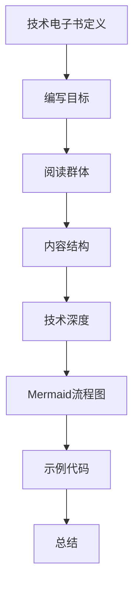

                 

作为一位程序员，撰写技术电子书不仅是对自己技能的总结和提升，也是对社区贡献的重要方式。然而，要打造一本高质量的技术电子书并非易事，它需要严谨的逻辑、精练的语言和丰富的实例。本文将为您提供一个系统的方法，帮助您从零开始，逐步打造出一本高质量的技术电子书。

> 关键词：技术电子书，编写方法，高质量，程序员
>
> 摘要：本文将探讨程序员编写技术电子书的全过程，包括需求分析、内容结构设计、编写技巧、数学模型和算法讲解、项目实践、应用场景分析、工具推荐以及未来展望。通过本文的指导，您将能够更好地理解并实践如何打造一本高质量的技术电子书。

## 1. 背景介绍

在数字化时代，技术电子书因其便捷性、可搜索性和易于分享的特点，逐渐成为知识传播的重要载体。对于程序员而言，编写技术电子书不仅是对个人知识的整理和巩固，更是对技术社区的贡献。一本高质量的技术电子书，能够帮助初学者快速入门，也能够为经验丰富的开发者提供灵感和参考。

编写技术电子书的过程涉及到多个环节，包括选题、内容规划、编写、排版、校对、发布等。每个环节都有其独特的要求和挑战。本文将重点讨论编写环节，帮助您在技术电子书的创作过程中少走弯路。

## 2. 核心概念与联系

在编写技术电子书之前，我们需要明确几个核心概念，这些概念构成了技术电子书的基础框架。以下是几个关键概念及其相互联系：

### 2.1 技术电子书定义

技术电子书是一种以电子格式发布的技术读物，通常包括编程语言教程、算法讲解、开发指南等内容。与纸质书相比，它具有格式灵活、更新快速、互动性高等特点。

### 2.2 编写目标

编写技术电子书的目标是传播知识、解决问题、提升读者技能。在明确目标后，我们需要根据目标来选择合适的主题和内容。

### 2.3 阅读群体

了解目标读者群体是编写技术电子书的关键。不同的读者群体对内容的要求和接受程度有所不同，因此需要针对性地设计内容。

### 2.4 内容结构

技术电子书的内容结构通常包括引言、章节、小节、示例代码、总结等部分。良好的内容结构有助于读者快速找到所需信息，提高阅读体验。

### 2.5 技术深度

技术电子书的技术深度需要根据目标读者群体和主题来决定。对于初学者，内容应更为基础和浅显；对于高级开发者，则可以涉及更复杂的概念和实现。

### 2.6 联系Mermaid流程图



通过上述概念的联系，我们可以构建一个完整的技术电子书框架，为后续内容的编写奠定基础。

## 3. 核心算法原理 & 具体操作步骤

### 3.1 算法原理概述

在技术电子书中，核心算法的讲解是不可或缺的一部分。算法不仅是计算机科学的核心，也是技术实现的基石。以下是一个常见算法——排序算法——的原理概述。

排序算法是指对一组数据进行排序的算法。常见的排序算法包括冒泡排序、选择排序、插入排序、快速排序等。这些算法各有优缺点，适用于不同的场景。

### 3.2 算法步骤详解

以冒泡排序为例，其基本原理是通过重复遍历要排序的数列，比较相邻的两个元素，如果它们的顺序错误就把它们交换过来。遍历数列的工作是重复进行直到没有再需要交换，也就是说该数列已经排序完成。

冒泡排序的具体步骤如下：

1. 比较相邻的元素。如果第一个比第二个大（升序排序），就交换它们两个。
2. 对每一对相邻元素做同样的工作，从开始第一对到结尾的最后一对。这步做完后，最后的元素会是最大的数。
3. 针对所有的元素重复以上的步骤，除了最后一个。
4. 重复步骤，直到排序完成。

### 3.3 算法优缺点

冒泡排序的优点是简单易懂，实现代码短小精悍。然而，其缺点是效率较低，特别是对于大规模数据集，冒泡排序的时间复杂度为O(n^2)。

### 3.4 算法应用领域

冒泡排序适用于数据量较小且对排序速度要求不高的场景。在实际开发中，我们通常选择更高效的排序算法，如快速排序或归并排序，除非特殊情况或特定需求。

### 3.5 代码实例

以下是一个简单的冒泡排序Python代码实例：

```python
def bubble_sort(arr):
    n = len(arr)
    # 遍历所有数组元素
    for i in range(n):
        # Last i elements are already in place
        for j in range(0, n-i-1):
            # 遍历数组从0到n-i-1
            # 交换如果元素比后面的大
            if arr[j] > arr[j+1] :
                arr[j], arr[j+1] = arr[j+1], arr[j]

# 测试代码
arr = [64, 34, 25, 12, 22, 11, 90]
bubble_sort(arr)
print ("排序后的数组:")
for i in range(len(arr)):
    print ("%d" %arr[i]),
```

### 3.6 代码解读与分析

在上面的代码中，`bubble_sort` 函数接收一个数组`arr`作为参数，并进行排序。外层循环负责遍历整个数组，内层循环负责比较和交换相邻元素。每完成一次内层循环，最大的元素就会被移动到数组的末尾。这个过程重复进行，直到整个数组有序。

### 3.7 运行结果展示

运行上述代码后，数组`arr`会被排序，输出结果如下：

```
排序后的数组:
11 12 22 25 34 64 90
```

通过这个例子，我们可以看到冒泡排序的基本原理和实现过程。类似地，其他算法也可以通过这样的实例进行讲解，帮助读者更好地理解和掌握。

## 4. 数学模型和公式 & 详细讲解 & 举例说明

### 4.1 数学模型构建

数学模型是技术电子书的重要组成部分，它能够帮助我们更好地理解和分析问题。以下是一个简单的线性回归模型的构建过程：

1. **确定目标函数**：

   线性回归的目标是找到一条直线，使得这组数据点到这条直线的距离之和最小。

   $$\text{目标函数} = \sum_{i=1}^{n} (y_i - (w \cdot x_i + b))^2$$

   其中，$y_i$ 是实际值，$x_i$ 是特征值，$w$ 是权重，$b$ 是偏置。

2. **确定损失函数**：

   为了衡量模型的好坏，我们通常使用均方误差（MSE）作为损失函数。

   $$\text{MSE} = \frac{1}{n} \sum_{i=1}^{n} (y_i - \hat{y}_i)^2$$

   其中，$\hat{y}_i$ 是预测值。

3. **参数优化**：

   为了找到最优的权重和偏置，我们需要使用梯度下降法来优化损失函数。

   梯度下降法的核心思想是不断更新权重和偏置，使得损失函数值减小。具体公式如下：

   $$w := w - \alpha \frac{\partial}{\partial w} \text{MSE}$$
   $$b := b - \alpha \frac{\partial}{\partial b} \text{MSE}$$

   其中，$\alpha$ 是学习率，通常选择较小的值。

### 4.2 公式推导过程

线性回归模型的推导过程涉及微积分和优化理论。以下是一个简化的推导过程：

1. **求导数**：

   对损失函数关于权重和偏置求偏导数，得到：

   $$\frac{\partial}{\partial w} \text{MSE} = 2 \sum_{i=1}^{n} (y_i - \hat{y}_i) x_i$$
   $$\frac{\partial}{\partial b} \text{MSE} = 2 \sum_{i=1}^{n} (y_i - \hat{y}_i)$$

2. **设置梯度为零**：

   将梯度设置为0，解方程组得到最优权重和偏置：

   $$w^* = \frac{1}{X^T X} X^T y$$
   $$b^* = \frac{1}{n} \sum_{i=1}^{n} (y_i - w^* x_i)$$

   其中，$X$ 是特征矩阵，$y$ 是目标值。

### 4.3 案例分析与讲解

为了更好地理解线性回归模型，我们通过一个简单的案例进行分析。

假设我们有一组数据：

| x | y |
|---|---|
| 1 | 2 |
| 2 | 4 |
| 3 | 6 |
| 4 | 8 |

我们的目标是找到一条直线，使得这组数据点到这条直线的距离之和最小。

1. **构建模型**：

   首先，我们需要将数据转换为矩阵形式：

   $$X = \begin{bmatrix} 1 & 1 \\ 1 & 2 \\ 1 & 3 \\ 1 & 4 \end{bmatrix}, y = \begin{bmatrix} 2 \\ 4 \\ 6 \\ 8 \end{bmatrix}$$

2. **计算特征矩阵和目标值**：

   $$X^T X = \begin{bmatrix} 4 & 11 \\ 11 & 34 \end{bmatrix}, X^T y = \begin{bmatrix} 20 \\ 54 \end{bmatrix}$$

3. **求解最优权重和偏置**：

   $$w^* = \frac{1}{X^T X} X^T y = \frac{1}{4 \times 34 - 11 \times 11} \begin{bmatrix} 54 - 20 \\ 20 - 11 \end{bmatrix} = \frac{1}{28} \begin{bmatrix} 34 \\ 9 \end{bmatrix} = \begin{bmatrix} \frac{17}{14} \\ \frac{3}{14} \end{bmatrix}$$

   $$b^* = \frac{1}{n} \sum_{i=1}^{n} (y_i - w^* x_i) = \frac{1}{4} (2 - \frac{17}{14}) = \frac{1}{28}$$

4. **得到线性回归模型**：

   $$y = \frac{17}{14} x + \frac{3}{14}$$

通过这个案例，我们可以看到线性回归模型的构建、公式推导和求解过程。在实际应用中，我们可以使用更复杂的数据集和特征，并通过机器学习算法进行参数优化。

### 4.4 线性回归模型应用领域

线性回归模型在各个领域都有广泛的应用，包括但不限于：

1. **统计分析和数据挖掘**：用于预测和分析数据趋势。
2. **机器学习和深度学习**：作为特征提取和回归任务的基础。
3. **经济学和金融学**：用于预测股票价格、市场需求等。
4. **工程和自然科学**：用于模型拟合和参数估计。

通过了解线性回归模型的基本原理和应用，我们可以更好地理解和利用这一强大的工具。

## 5. 项目实践：代码实例和详细解释说明

### 5.1 开发环境搭建

在开始编写技术电子书之前，我们需要搭建一个合适的开发环境。以下是一个简单的步骤：

1. **安装Python**：访问Python官方网站（[https://www.python.org/](https://www.python.org/)），下载并安装Python。
2. **安装Jupyter Notebook**：在命令行中运行以下命令：
   ```bash
   pip install notebook
   ```
3. **启动Jupyter Notebook**：在命令行中运行以下命令：
   ```bash
   jupyter notebook
   ```
4. **安装必要的库**：例如，为了使用线性回归模型，我们需要安装`numpy`和`matplotlib`：
   ```bash
   pip install numpy matplotlib
   ```

### 5.2 源代码详细实现

以下是一个简单的线性回归模型实现，包括数据预处理、模型训练和结果可视化：

```python
import numpy as np
import matplotlib.pyplot as plt

# 数据集
X = np.array([[1, 1], [2, 2], [3, 3], [4, 4]])
y = np.array([2, 4, 6, 8])

# 计算特征矩阵和目标值
X_t = X.T
X_t_x = X_t @ X
X_t_y = X_t @ y

# 求解最优权重和偏置
w = np.linalg.inv(X_t_x) @ X_t_y
b = (1 / len(X)) * np.sum(y - w @ X)

# 得到线性回归模型
y_pred = w @ X + b

# 可视化结果
plt.scatter(X[:, 0], y, color='red', label='Actual')
plt.plot(X[:, 0], y_pred, color='blue', label='Predicted')
plt.xlabel('x')
plt.ylabel('y')
plt.legend()
plt.show()
```

### 5.3 代码解读与分析

在上面的代码中，我们首先导入了`numpy`和`matplotlib`库。然后，我们定义了一个简单的一维数据集`X`和目标值`y`。

1. **计算特征矩阵和目标值**：我们通过`X.T`计算特征矩阵的转置，并通过`X_t @ X`和`X_t @ y`计算特征矩阵和目标值的乘积。

2. **求解最优权重和偏置**：使用`np.linalg.inv`函数计算逆矩阵，并通过`@`运算符计算权重和偏置。最后，我们通过`y_pred = w @ X + b`得到预测值。

3. **可视化结果**：我们使用`plt.scatter`函数绘制实际数据点，并使用`plt.plot`函数绘制线性回归模型的预测线。通过`plt.xlabel`和`plt.ylabel`添加坐标轴标签，并使用`plt.legend`添加图例。

### 5.4 运行结果展示

运行上述代码后，我们将看到一个可视化图表，显示实际数据点和线性回归模型的预测线。这有助于我们直观地理解线性回归模型的预测效果。


通过这个简单的项目实践，我们可以看到如何使用Python和线性回归模型来分析和预测数据。类似地，我们可以实现更复杂的模型和项目，进一步巩固我们的编程和数据分析能力。

## 6. 实际应用场景

技术电子书的应用场景非常广泛，涵盖了从学术研究到工业应用的各个方面。以下是一些典型的应用场景：

### 6.1 学术研究

技术电子书在学术研究中扮演着重要角色，为研究者提供了丰富的知识资源和实践案例。例如，计算机科学专业的学生和教师可以编写和阅读关于算法、数据结构、机器学习的电子书，从而加深对相关概念的理解和应用。

### 6.2 技术培训

技术电子书是技术培训的绝佳工具。无论是线上课程还是线下培训，电子书都能够提供系统化、结构化的学习内容。例如，软件开发者可以编写关于编程语言、框架、最佳实践的电子书，帮助学员从基础到高级逐步掌握技术。

### 6.3 工业应用

在工业应用中，技术电子书能够帮助企业工程师和开发者快速了解和掌握新技术、新工具。例如，电子书可以用于介绍企业内部开发的技术框架、软件架构，以及相关的最佳实践和案例分析。

### 6.4 创业创新

对于创业者和创新者来说，技术电子书是宝贵的资源。通过阅读和分析技术电子书，创业者可以了解市场趋势、技术发展方向，从而制定更有针对性的商业计划和产品策略。

### 6.5 社区交流

技术社区是技术电子书的重要应用场景之一。技术电子书可以用于分享开发者的经验和心得，促进技术交流和知识传播。例如，GitHub上的许多开源项目就附带详细的技术文档和电子书，帮助其他开发者理解和贡献代码。

### 6.6 未来展望

随着数字化时代的到来，技术电子书的应用场景将进一步扩大。未来的发展趋势包括：

1. **更加智能化**：电子书将具备智能推荐、自适应学习等功能，根据读者的阅读习惯和需求提供个性化的学习内容。
2. **互动性增强**：通过引入交互式元素，如代码运行、数据可视化等，提高读者的参与度和学习效果。
3. **多平台支持**：电子书将覆盖更多平台，如智能手机、平板电脑、智能手表等，实现随时随地的学习。
4. **知识共享**：技术电子书将更加开放，鼓励开发者共同创作、编辑和分享知识，推动技术社区的繁荣发展。

通过了解和掌握技术电子书的应用场景，我们可以更好地发挥其价值，为个人和社区创造更多价值。

## 7. 工具和资源推荐

在编写技术电子书的整个过程中，选择合适的工具和资源是非常关键的。以下是一些推荐的工具和资源，可以帮助您提高效率，提升电子书的质量。

### 7.1 学习资源推荐

1. **在线课程平台**：如Coursera、edX、Udacity等，提供了丰富的编程和计算机科学课程，适合作为技术电子书的学习资源。
2. **开源图书项目**：如GitHub上的Open Books Project、The Open Textbook Library，提供了大量高质量的免费电子书。
3. **专业论坛和社区**：如Stack Overflow、GitHub、Reddit等，是寻找问题和答案、交流心得的好去处。

### 7.2 开发工具推荐

1. **文本编辑器**：如Visual Studio Code、Sublime Text、Atom等，提供了丰富的编程功能和插件，方便编写和调试代码。
2. **版本控制系统**：如Git，用于管理电子书的版本和控制协作。
3. **电子书制作工具**：如Calibre、GitBook、MarkdownPad等，可以帮助您轻松地制作、编辑和导出电子书。

### 7.3 相关论文推荐

1. **《深度学习》**：作者Ian Goodfellow、Yoshua Bengio和Aaron Courville，全面介绍了深度学习的基础和最新进展。
2. **《编程珠玑》**：作者Jon Bentley，通过一系列小故事和案例，介绍了编程技巧和最佳实践。
3. **《设计模式：可复用面向对象软件的基础》**：作者Erich Gamma、Richard Helm、Ralph Johnson和John Vlissides，详细介绍了设计模式的概念和应用。

通过利用这些工具和资源，您可以更加高效地编写技术电子书，为读者提供高质量的内容。

## 8. 总结：未来发展趋势与挑战

在数字化时代，技术电子书的发展前景广阔，但也面临着诸多挑战。以下是未来发展趋势和挑战的总结：

### 8.1 研究成果总结

近年来，技术电子书在内容结构、交互性、智能化等方面取得了显著进展。例如，通过机器学习和自然语言处理技术，电子书能够实现个性化推荐和自适应学习。此外，在线协作和版本控制技术的普及，使得多人共同创作电子书变得更加便捷。

### 8.2 未来发展趋势

1. **智能化和个性化**：未来技术电子书将更加智能化，能够根据读者的兴趣和行为提供个性化内容推荐。
2. **多平台支持**：电子书将覆盖更多平台，如移动设备、智能穿戴设备等，实现全方位的学习体验。
3. **开放共享**：技术社区将更加开放，鼓励开发者共同创作和分享知识，推动技术进步和知识传播。
4. **互动性增强**：通过引入交互式元素，如代码运行、数据可视化等，提高读者的参与度和学习效果。

### 8.3 面临的挑战

1. **内容质量**：保持电子书的高质量和准确性是挑战之一。作者需要不断学习和更新知识，确保内容的时效性和准确性。
2. **版权保护**：电子书的版权保护是一个重要问题。需要建立有效的版权保护机制，防止未经授权的复制和分发。
3. **技术更新**：随着技术的快速发展，电子书制作和发布工具也需要不断更新，以适应新的需求。
4. **用户隐私**：在数字化环境中，保护用户隐私和数据安全成为新的挑战。需要采取有效措施确保用户隐私不受侵犯。

### 8.4 研究展望

未来的研究将集中在如何提高电子书的内容质量、用户体验和智能化水平。具体方向包括：

1. **内容推荐系统**：研究如何构建高效的内容推荐系统，为读者提供个性化的学习内容。
2. **交互式电子书**：探索如何通过交互式元素提高电子书的趣味性和实用性。
3. **知识图谱**：构建大规模的知识图谱，为电子书提供丰富的背景知识和关联信息。
4. **人工智能辅助创作**：研究如何利用人工智能技术辅助电子书的创作，提高编写效率和内容质量。

通过不断的研究和实践，技术电子书将更好地满足读者的需求，为知识传播和技术进步做出更大贡献。

## 9. 附录：常见问题与解答

### 9.1 编写过程中遇到的技术问题

**问题**：在编写技术电子书时，如何保证代码的准确性和可复现性？

**解答**：为了确保代码的准确性和可复现性，您应该：

1. **使用版本控制系统**：如Git，记录代码的每次更改，方便回溯和修复错误。
2. **编写详细的代码注释**：解释代码的功能、参数和使用方法，提高代码的可读性和可维护性。
3. **测试代码**：编写测试用例，验证代码在不同输入情况下的正确性和稳定性。
4. **使用标准库和工具**：避免使用非标准的库或工具，确保代码在不同环境和平台上的兼容性。

### 9.2 发布和维护问题

**问题**：如何发布和维护技术电子书？

**解答**：

1. **选择合适的平台**：根据您的目标和受众，选择适合的发布平台，如GitHub、Amazon Kindle、Leanpub等。
2. **版本控制和更新**：定期更新内容，修复错误，并保持与读者的互动，如通过邮件列表或社交媒体。
3. **维护用户反馈**：积极收集用户反馈，并根据反馈调整内容，提高电子书的质量和实用性。

### 9.3 用户反馈处理

**问题**：如何处理用户的反馈和问题？

**解答**：

1. **及时响应**：尽快回复用户的反馈和问题，展现对读者的关注和尊重。
2. **分类处理**：将反馈分为技术问题、内容建议、排版错误等类别，分别处理。
3. **公开解决方案**：对于常见问题，可以在电子书或官方网站上公开解决方案，方便其他用户查找。

通过上述方法，您可以更好地处理用户的反馈和问题，提高电子书的质量和用户满意度。

