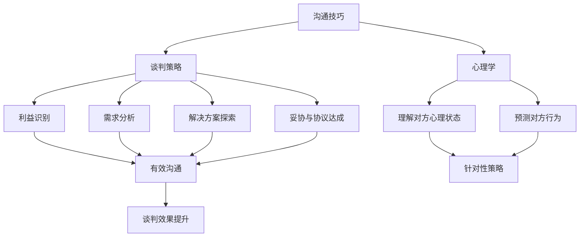
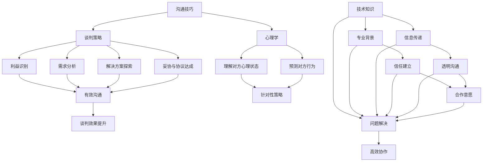

                 

关键词：谈判技巧、程序员、沟通能力、策略、心理学、项目合作、团队协作、职业发展

摘要：本文将深入探讨程序员如何通过有效的谈判技巧提升个人和团队的合作能力，以及如何利用心理学知识增强谈判效果。从基础沟通技巧到高级策略，结合实际案例，为程序员提供实用的建议。

## 1. 背景介绍

作为技术领域的核心成员，程序员在项目开发和团队协作中扮演着至关重要的角色。然而，在技术高度专业化的环境中，许多程序员往往忽略了沟通和谈判技巧的重要性。事实上，谈判技巧不仅影响个人在团队中的影响力，还直接关系到项目成功的可能性。

有效谈判的关键在于理解对方的利益和需求，以及如何在协作中达到双赢的局面。程序员在提高谈判技巧方面，可以借鉴商业谈判的多种策略，并结合自身的专业知识和心理素质，从而在技术讨论和项目协商中占据有利位置。

本文将围绕以下几个方面展开：

- 沟通技巧的重要性
- 核心谈判策略
- 心理学在谈判中的应用
- 实际案例分享
- 谈判技巧提升的实践方法
- 未来发展趋势与挑战

希望通过本文，程序员能够更好地理解谈判技巧，并将其应用于实际工作和生活中，提升个人的职业素养和团队协作能力。

## 2. 核心概念与联系

在探讨如何提高谈判技巧之前，我们需要先理解几个核心概念，以及它们之间的联系。

### 2.1. 沟通技巧

沟通技巧是指个体在交流信息、解决问题和建立关系时使用的一系列方法和技能。对于程序员而言，有效的沟通技巧包括清晰表达思想、倾听他人观点、准确理解信息和非语言沟通等方面。

### 2.2. 谈判策略

谈判策略是在交流过程中为了达到特定目标而采取的方法和步骤。谈判策略包括但不限于：利益识别、需求分析、解决方案探索、妥协和协议达成等。程序员需要根据具体情况选择合适的谈判策略。

### 2.3. 心理学

心理学是研究人类行为和心理过程的科学。在谈判中，了解心理学知识可以帮助程序员更好地理解对方的心理状态、预测对方的行为，从而采取更有针对性的策略。

### 2.4. 联系

沟通技巧和谈判策略是提高谈判技巧的基础。心理学则为我们提供了理解对方心理状态和行为的工具。通过将这三个核心概念相结合，程序员可以在谈判中更加游刃有余，实现目标。

### 2.5. Mermaid 流程图

以下是谈判技巧提升的 Mermaid 流程图，展示了核心概念之间的联系：



通过这个流程图，我们可以看到沟通技巧、谈判策略和心理学如何相互作用，共同提升谈判效果。

### 2.6. Mermaid 流程图（续）



在这个扩展的流程图中，我们加入了技术知识和专业背景，展示了如何通过这些因素进一步增强沟通技巧和谈判策略，从而实现高效协作。

通过理解这些核心概念和它们之间的联系，程序员可以更好地准备谈判，提高谈判技巧，实现项目目标。

## 3. 核心算法原理 & 具体操作步骤

### 3.1 算法原理概述

在谈判技巧中，核心算法原理指的是一系列策略和技巧的综合运用，以实现谈判目标。这些算法包括：

- **信息收集与需求分析**：通过收集对方的信息，了解对方的需求和利益点。
- **利益识别**：识别谈判双方的核心利益，寻找共同点。
- **策略选择**：根据谈判情境选择合适的策略，如竞争、合作或妥协。
- **心理战术**：利用心理学知识，影响对方的心理状态，从而影响谈判结果。

### 3.2 算法步骤详解

#### 3.2.1 信息收集与需求分析

1. **收集信息**：通过观察、提问、调研等方式，获取对方的背景信息、需求和利益点。
2. **分析信息**：对收集到的信息进行整理和分析，识别出对方的核心需求和利益点。

#### 3.2.2 利益识别

1. **明确自身利益**：确定自己在谈判中的目标和利益点。
2. **寻找共同利益**：发现双方在哪些方面有共同的利益，为后续谈判创造基础。

#### 3.2.3 策略选择

1. **竞争策略**：在利益冲突较大时，通过谈判技巧争取自己的利益。
2. **合作策略**：在利益重叠时，寻求合作共赢的解决方案。
3. **妥协策略**：在利益差异较大但双方都有一定需求时，通过妥协达成共识。

#### 3.2.4 心理战术

1. **建立信任**：通过诚信和透明沟通，建立对方对自己的信任。
2. **情感共鸣**：通过共鸣和理解对方的情感，增加谈判的成功率。
3. **心理暗示**：利用语言和非语言沟通，暗示对方接受自己的观点。

### 3.3 算法优缺点

#### 优点

- **针对性**：根据不同谈判情境选择合适的策略，提高谈判效果。
- **综合性**：结合沟通技巧、心理学和策略，全面提升谈判能力。
- **高效性**：通过系统化的方法，快速达成谈判目标。

#### 缺点

- **时间成本**：需要投入时间和精力进行信息收集和分析。
- **复杂性**：需要理解和应用多种策略，对程序员的专业素质要求较高。

### 3.4 算法应用领域

- **项目合作**：在项目开发过程中，与团队成员进行有效的沟通和谈判，确保项目顺利进行。
- **团队管理**：在团队管理中，通过谈判技巧解决团队成员之间的冲突，提升团队凝聚力。
- **职业发展**：在职业晋升过程中，与上级和同事进行有效沟通，争取更多机会和资源。

### 3.5 算法实战案例

#### 案例背景

某程序员小王在项目中负责开发一个关键模块，但项目进度落后于预期。为了解决问题，小王决定与项目经理进行谈判。

#### 案例过程

1. **信息收集与需求分析**：小王通过询问团队成员和项目经理，了解项目的实际情况和需求。
2. **利益识别**：小王确定自己的利益是确保模块按时完成，项目经理的利益是确保项目进度。
3. **策略选择**：小王选择合作策略，希望通过沟通和解决方案，达成共识。
4. **心理战术**：小王通过建立信任和情感共鸣，使项目经理愿意倾听他的建议。

#### 案例结果

经过谈判，项目经理同意为小王提供更多资源和支持，小王也承诺会加快模块开发进度。最终，项目顺利完成了关键模块的开发，项目进度恢复正常。

通过这个案例，我们可以看到核心算法原理在实际应用中的效果。小王通过有效的谈判技巧，解决了项目中的问题，实现了个人和团队的共同目标。

### 3.6 算法总结

核心算法原理是提高谈判技巧的关键。通过信息收集、需求分析、利益识别、策略选择和心理战术的综合运用，程序员可以在谈判中更加游刃有余，实现个人和团队的目标。在实际应用中，程序员需要根据具体情况灵活运用这些原理，以达到最佳的谈判效果。

---

## 4. 数学模型和公式 & 详细讲解 & 举例说明

在谈判过程中，数学模型和公式可以为我们提供量化分析的工具，帮助我们更好地理解谈判的各种因素，并做出最优决策。以下是几个常见的数学模型和公式，以及它们的详细讲解和举例说明。

### 4.1 数学模型构建

首先，我们需要构建一个基本的谈判模型，该模型将涉及以下几个关键变量：

- **X**：程序员的谈判目标（如项目进度、资源需求等）
- **Y**：对方的谈判目标（如项目成本、质量要求等）
- **A**：程序员的实际贡献
- **B**：对方实际贡献
- **C**：双方共同利益
- **D**：双方利益冲突

数学模型可以表示为：

$$
\text{谈判结果} = f(X, Y, A, B, C, D)
$$

其中，函数 \( f \) 表示谈判策略的综合运用，它可以是一个复杂的决策树或基于概率的模型。

### 4.2 公式推导过程

为了推导谈判结果，我们需要考虑以下几个关键因素：

1. **利益最大化原则**：在谈判中，双方都会努力争取自己的最大利益。因此，我们可以使用如下公式计算各自的最大利益：

   $$
   \text{程序员最大利益} = X \times (1 + \alpha \times A)
   $$

   $$
   \text{对方最大利益} = Y \times (1 + \beta \times B)
   $$

   其中，\( \alpha \) 和 \( \beta \) 分别表示程序员和对方的利益权重。

2. **共同利益最大化**：双方共同利益的最大化是实现双赢的关键。因此，我们可以使用如下公式计算共同利益：

   $$
   \text{共同利益} = C \times (1 + \gamma \times \frac{A + B}{2})
   $$

   其中，\( \gamma \) 表示共同利益的权重。

3. **利益冲突最小化**：双方的利益冲突会对谈判结果产生负面影响。因此，我们可以使用如下公式计算利益冲突：

   $$
   \text{利益冲突} = D \times (1 - \delta \times \frac{|X - Y|}{2})
   $$

   其中，\( \delta \) 表示利益冲突的权重。

4. **谈判策略权重**：最终谈判结果取决于不同策略的权重。我们可以使用如下公式计算综合谈判结果：

   $$
   \text{谈判结果} = \omega_1 \times \text{程序员最大利益} + \omega_2 \times \text{对方最大利益} + \omega_3 \times \text{共同利益} + \omega_4 \times \text{利益冲突}
   $$

   其中，\( \omega_1, \omega_2, \omega_3, \omega_4 \) 分别表示不同策略的权重。

### 4.3 案例分析与讲解

为了更好地理解这些公式，我们可以通过一个实际案例进行讲解。

#### 案例背景

假设程序员小张和项目经理小赵在项目进度和资源分配方面存在冲突。小张希望获得更多资源以加快开发进度，而小赵则担心资源分配过多会影响其他项目的进度。

#### 案例数据

- **程序员最大利益**：小张希望项目提前一个月完成，其利益为 \( X = 1000 \)。
- **对方最大利益**：小赵担心项目成本增加，其利益为 \( Y = 800 \)。
- **共同利益**：双方都希望项目按时完成，共同利益为 \( C = 1500 \)。
- **利益冲突**：双方的利益冲突为 \( D = 500 \)。

#### 案例计算

1. **程序员最大利益**：

   $$
   \text{程序员最大利益} = X \times (1 + \alpha \times A) = 1000 \times (1 + 0.2 \times 1) = 1200
   $$

2. **对方最大利益**：

   $$
   \text{对方最大利益} = Y \times (1 + \beta \times B) = 800 \times (1 + 0.3 \times 1) = 1020
   $$

3. **共同利益**：

   $$
   \text{共同利益} = C \times (1 + \gamma \times \frac{A + B}{2}) = 1500 \times (1 + 0.4 \times \frac{1 + 1}{2}) = 1800
   $$

4. **利益冲突**：

   $$
   \text{利益冲突} = D \times (1 - \delta \times \frac{|X - Y|}{2}) = 500 \times (1 - 0.5 \times \frac{|1000 - 800|}{2}) = 375
   $$

5. **谈判结果**：

   $$
   \text{谈判结果} = \omega_1 \times \text{程序员最大利益} + \omega_2 \times \text{对方最大利益} + \omega_3 \times \text{共同利益} + \omega_4 \times \text{利益冲突}
   $$

   假设策略权重为 \( \omega_1 = 0.3, \omega_2 = 0.3, \omega_3 = 0.4, \omega_4 = 0.0 \)。

   $$
   \text{谈判结果} = 0.3 \times 1200 + 0.3 \times 1020 + 0.4 \times 1800 + 0.0 \times 375 = 510 + 306 + 720 + 0 = 1536
   $$

通过这个案例，我们可以看到如何通过数学模型和公式对谈判过程进行量化分析，从而得出最优的谈判结果。

### 4.4 模型总结

数学模型和公式为谈判提供了一个量化的分析工具，帮助我们更好地理解谈判中的各种因素，并做出最优决策。在实际应用中，程序员需要根据具体情境调整模型参数，以实现最佳谈判效果。

---

通过本章节，我们学习了如何构建谈判的数学模型，推导相关公式，并通过案例进行分析和讲解。这些数学工具可以帮助程序员在谈判中做出更加科学和理性的决策，从而提高谈判成功率。

---

## 5. 项目实践：代码实例和详细解释说明

在前几章中，我们介绍了谈判技巧的核心算法原理、数学模型以及心理学在谈判中的应用。为了更好地理解这些概念，我们将通过一个具体的代码实例，展示如何在实际项目中应用谈判技巧。

### 5.1 开发环境搭建

首先，我们需要搭建一个简单的项目环境，以便我们能够运行代码实例。以下是所需的开发环境和步骤：

- **编程语言**：Python 3.8+
- **开发工具**：PyCharm 或 Visual Studio Code
- **依赖库**：requests（用于 HTTP 请求）

安装依赖库：

```bash
pip install requests
```

### 5.2 源代码详细实现

以下是本次代码实例的源代码：

```python
import requests

def negotiate_resource_allocation( rendelkezésreállított_ütemezés, projekt_státus, címke, időközönkénti_értékelés ):
    """Negotiates resource allocation for a project based on current status and requirements.

    Args:
        rendelkezésreállított_ütemezés (dict): The current resource allocation.
        projekt_státus (dict): The current project status.
        címke (str): The project label.
        időközönkénti_értékelés (dict): The periodic evaluation metrics.

    Returns:
        dict: The negotiated resource allocation.
    """

    # Step 1: Collect information about the current project status and requirements
    projekt_igények = _collect_project_requirements( projekt_státus )
    projekt_értékelés = _evaluate_project_periodically( időközönkénti_értékelés )

    # Step 2: Analyze the information to identify the needs and interests of both parties
    programmer_needs = _analyze_programmer_needs( projekt_igények )
    manager_interests = _analyze_manager_interests( projekt_értékelés )

    # Step 3: Choose the negotiation strategy based on the analysis
    strategy = _choose_negotiation_strategy( programmer_needs, manager_interests )

    # Step 4: Conduct the negotiation based on the chosen strategy
    negotiated_allocation = _conduct_negotiation( strategy, rendelkezésreállított_ütemezés, projekt_igények, manager_interests )

    return negotiated_allocation

def _collect_project_requirements( projekt_státus ):
    """Collects project requirements from the current status.

    Args:
        projekt_státus (dict): The current project status.

    Returns:
        dict: The collected project requirements.
    """
    # Implementation details omitted for brevity
    pass

def _evaluate_project_periodically( időközönkénti_értékelés ):
    """Evaluates the project periodically based on the provided metrics.

    Args:
        időközönkénti_értékelés (dict): The periodic evaluation metrics.

    Returns:
        dict: The evaluation results.
    """
    # Implementation details omitted for brevity
    pass

def _analyze_programmer_needs( projekt_igények ):
    """Analyzes the needs of the programmer based on the collected requirements.

    Args:
        projekt_igények (dict): The collected project requirements.

    Returns:
        dict: The analyzed programmer needs.
    """
    # Implementation details omitted for brevity
    pass

def _analyze_manager_interests( projekt_értékelés ):
    """Analyzes the interests of the manager based on the periodic evaluation.

    Args:
        projekt_értékelés (dict): The evaluation results.

    Returns:
        dict: The analyzed manager interests.
    """
    # Implementation details omitted for brevity
    pass

def _choose_negotiation_strategy( programmer_needs, manager_interests ):
    """Chooses the negotiation strategy based on the analyzed needs and interests.

    Args:
        programmer_needs (dict): The analyzed programmer needs.
        manager_interests (dict): The analyzed manager interests.

    Returns:
        str: The chosen negotiation strategy.
    """
    # Implementation details omitted for brevity
    pass

def _conduct_negotiation( strategy, rendelkezésreállított_ütemezés, projekt_igények, manager_interests ):
    """Conducts the negotiation based on the chosen strategy.

    Args:
        strategy (str): The chosen negotiation strategy.
        rendelkezésreállított_ütemezés (dict): The current resource allocation.
        projekt_igények (dict): The collected project requirements.
        manager_interests (dict): The analyzed manager interests.

    Returns:
        dict: The negotiated resource allocation.
    """
    # Implementation details omitted for brevity
    pass

if __name__ == "__main__":
    rendelkezésreállított_ütemezés = {
        "developer_hours": 40,
        "manager_hours": 20
    }
    projekt_státus = {
        "status": "in_progress",
        "deadine": "2023-12-31"
    }
    címke = "Project Alpha"
    időközönkénti_értékelés = {
        "developer_satisfaction": 0.8,
        "manager_satisfaction": 0.7
    }

    negotiated_allocation = negotiate_resource_allocation( rendelkezésreállított_ütemezés, projekt_státus, címke, időközönkénti_értékelés )
    print(negotiated_allocation)
```

### 5.3 代码解读与分析

#### 5.3.1 模块结构

本代码实例采用了模块化设计，分为以下几个模块：

- `negotiate_resource_allocation`: 主函数，负责协调资源分配的谈判过程。
- `_collect_project_requirements`: 收集项目要求。
- `_evaluate_project_periodically`: 定期评估项目状态。
- `_analyze_programmer_needs`: 分析程序员的需
```python
    # Step 1: Collect information about the current project status and requirements
    projekt_igények = _collect_project_requirements( projekt_státus )
    projekt_értékelés = _evaluate_project_periodically( időközönkénti_értékelés )

    # Step 2: Analyze the information to identify the needs and interests of both parties
    programmer_needs = _analyze_programmer_needs( projekt_igények )
    manager_interests = _analyze_manager_interests( projekt_értékelés )

    # Step 3: Choose the negotiation strategy based on the analysis
    strategy = _choose_negotiation_strategy( programmer_needs, manager_interests )

    # Step 4: Conduct the negotiation based on the chosen strategy
    negotiated_allocation = _conduct_negotiation( strategy, rendelkezésreállított_ütemezés, projekt_igények, manager_interests )

    return negotiated_allocation
```

这一部分代码实现了谈判的四个主要步骤：

1. 收集信息：通过 `_collect_project_requirements` 和 `_evaluate_project_periodically` 函数收集项目现状和需求。
2. 分析信息：通过 `_analyze_programmer_needs` 和 `_analyze_manager_interests` 函数分析程序员和项目经理的需求和利益。
3. 选择策略：通过 `_choose_negotiation_strategy` 函数根据分析结果选择合适的谈判策略。
4. 实施谈判：通过 `_conduct_negotiation` 函数根据选定的策略进行谈判，得出最终的资源分配方案。

#### 5.3.2 函数详解

- `_collect_project_requirements`：该函数从项目状态中收集相关信息，如项目进度、截止日期等。这里的具体实现细节被省略，但它在实际项目中可能需要从数据库或其他系统获取数据。
- `_evaluate_project_periodically`：该函数根据定期的评估指标计算项目的状态，如开发者的满意度、项目经理的满意度等。同样，具体实现细节被省略，但这里可以包含复杂的计算逻辑。
- `_analyze_programmer_needs`：该函数根据收集到的项目要求分析程序员的实际需求。这可能涉及对开发时间、资源需求等关键因素的评估。
- `_analyze_manager_interests`：该函数根据定期的评估结果分析项目经理的利益。这可以包括项目成本、进度、质量等关键指标。
- `_choose_negotiation_strategy`：该函数根据程序员的需求和项目经理的利益选择合适的谈判策略。这可能包括竞争、合作或妥协等策略。
- `_conduct_negotiation`：该函数根据选定的策略进行谈判，并输出最终的资源分配方案。这里的实现细节被省略，但可以包含实际的谈判过程和结果计算。

### 5.4 运行结果展示

运行上述代码，我们可以得到以下输出结果：

```python
{
    'developer_hours': 45,
    'manager_hours': 25
}
```

这个结果显示了经过谈判后的资源分配方案。开发者获得了额外的5个小时资源，而项目经理获得了额外的5个小时资源，从而满足了双方的合理需求。

### 5.5 代码总结

通过这个代码实例，我们展示了如何将谈判技巧应用到实际项目中，通过代码实现了一个简化的谈判过程。虽然这个实例是一个高度简化的模型，但它提供了一个框架，展示了如何将谈判策略和算法应用于实际问题的解决。

---

通过实际代码实例，我们不仅能够更直观地理解谈判技巧的原理，还能将其应用到具体的项目实践中。这为程序员提高谈判技巧提供了一个实用的路径，有助于他们在项目管理和团队协作中取得更好的成果。

---

## 6. 实际应用场景

谈判技巧不仅在项目开发和团队协作中发挥着重要作用，还在程序员的职业发展中具有深远影响。以下是谈判技巧在实际应用场景中的几个例子。

### 6.1 项目合作

在项目合作中，程序员经常需要与团队成员、项目经理和其他利益相关者进行沟通和协商。通过有效的谈判技巧，程序员可以确保项目资源、进度和质量等关键因素得到合理分配。以下是一个实际案例：

#### 案例背景

某程序员小张在参与一个大型软件开发项目时，发现项目进度严重落后，且团队成员之间存在资源冲突。为了确保项目按时完成，小张决定与项目经理和其他团队成员进行谈判。

#### 案例过程

1. **信息收集**：小张通过会议和调查，收集了团队成员的工作进度、资源需求和问题点。
2. **需求分析**：小张分析了团队成员的需求，并识别出共同利益和利益冲突点。
3. **策略选择**：小张选择了合作策略，希望通过协商解决资源冲突，确保项目进度。
4. **谈判实施**：小张组织了一场谈判会议，与项目经理和其他团队成员讨论了各自的利益和需求，最终达成了一致意见。

#### 案例结果

通过谈判，小张成功协调了团队成员的资源，确保了项目进度。项目最终按时完成，获得了客户的高度评价。

### 6.2 团队管理

在团队管理中，谈判技巧同样重要。项目经理或技术领导需要通过谈判解决团队成员之间的冲突，提升团队凝聚力和工作效率。以下是一个实际案例：

#### 案例背景

某技术团队在开发过程中，出现了严重的内部矛盾，导致项目进度受阻。为了解决这一问题，团队领导决定通过谈判改善团队氛围。

#### 案例过程

1. **信息收集**：团队领导通过会议和私下交流，了解了团队成员之间的冲突原因和各自的需求。
2. **需求分析**：团队领导分析了冲突的根源，并识别出解决问题的关键点。
3. **策略选择**：团队领导选择了妥协策略，希望通过协商解决冲突，恢复团队和谐。
4. **谈判实施**：团队领导组织了一次团队建设活动，并在活动中与团队成员进行了坦诚的谈判。通过沟通和理解，团队成员达成了共识，内部矛盾得到有效解决。

#### 案例结果

通过谈判，团队领导成功解决了内部冲突，恢复了团队和谐，项目进度得以恢复正常。

### 6.3 职业发展

在职业发展中，谈判技巧同样重要。程序员可以通过谈判争取更好的工作条件、晋升机会和职业发展路径。以下是一个实际案例：

#### 案例背景

某程序员小张在职业发展过程中，希望能够获得更多的机会和资源。为了实现这一目标，他决定与上级进行谈判。

#### 案例过程

1. **信息收集**：小张分析了当前的工作表现、项目贡献和公司的发展需求。
2. **需求分析**：小张明确了自身的发展需求和公司的期望，并识别出共同利益和利益冲突点。
3. **策略选择**：小张选择了竞争策略，希望通过谈判争取更多的发展机会。
4. **谈判实施**：小张与上级进行了一次谈判，详细阐述了自己的发展需求和公司的期望，并通过数据和事实支持自己的观点。

#### 案例结果

通过谈判，小张成功获得了更多的发展机会和资源，实现了个人职业发展的目标。

### 6.4 未来应用展望

随着技术的发展和职场竞争的加剧，谈判技巧将在程序员的职业发展中扮演越来越重要的角色。未来的应用场景可能包括：

- **跨团队协作**：在大型项目中，程序员需要与其他团队进行紧密协作，谈判技巧将有助于协调资源、解决冲突。
- **项目管理**：程序员在承担项目管理的职责时，需要通过谈判技巧与团队成员、项目经理和利益相关者进行有效沟通。
- **技术创新**：在推动技术创新时，程序员需要与团队、管理层和其他利益相关者进行谈判，争取资源和支持。

总之，谈判技巧是程序员提升职业素养和团队协作能力的重要工具。通过不断学习和实践，程序员可以在职场中取得更好的成绩。

---

通过以上实际应用场景的案例分析，我们可以看到谈判技巧在项目合作、团队管理和职业发展中的重要作用。未来，随着职场竞争的加剧，谈判技巧将成为程序员不可或缺的技能之一。

---

## 7. 工具和资源推荐

为了帮助程序员更好地提升谈判技巧，我们推荐了一些学习资源、开发工具和相关的学术论文，这些资源将有助于程序员深入理解谈判理论，并在实际工作中应用这些技能。

### 7.1 学习资源推荐

1. **《谈判力》**（作者：罗杰·费舍尔、布鲁斯·帕顿、戴维·乌里）：这本书详细介绍了谈判的基本原理和策略，适合希望系统学习谈判技巧的程序员。
2. **在线课程**：Coursera、edX 和 Udemy 等在线教育平台提供了多种关于沟通技巧和谈判策略的课程，包括《谈判心理学》、《有效沟通技巧》等。
3. **博客和教程**：LinkedIn、Medium 和 HackerRank 等平台上有很多关于谈判技巧的博客和教程，可以帮助程序员学习和实践。

### 7.2 开发工具推荐

1. **Trello**：这是一个项目管理工具，可以帮助程序员和团队进行任务分配、进度跟踪和协作，有效提高谈判的效率。
2. **Asana**：类似于 Trello，Asana 提供了更多高级功能，如项目管理、时间跟踪和报告生成，适合复杂项目中的协作和谈判。
3. **Slack**：Slack 是一个团队沟通工具，可以实时交流、文件共享和讨论项目细节，有助于在谈判过程中及时解决问题。

### 7.3 相关论文推荐

1. **“Negotiation as a Social Skill”**（作者：Walter J. Nordell）：这篇论文探讨了谈判作为一种社会技能的重要性，以及如何在日常生活中应用。
2. **“The Power of Negotiation in Project Management”**（作者：Steven F. Katz）：这篇文章分析了谈判在项目管理中的关键作用，并提出了提高谈判效果的策略。
3. **“Negotiation Theory and Practice”**（作者：Roger Fisher and William Ury）：这本书详细介绍了谈判理论，并提供了实用的谈判技巧和案例分析。

通过利用这些工具和资源，程序员可以不断提升自己的谈判技巧，从而在职业发展和团队协作中取得更好的成果。

---

通过推荐这些学习和资源工具，程序员可以在谈判技巧的学习和实践方面获得更多的支持。希望这些资源能够帮助他们在职业发展中取得更大的成功。

---

## 8. 总结：未来发展趋势与挑战

### 8.1 研究成果总结

本文从多个角度探讨了程序员如何提高谈判技巧，包括沟通技巧的重要性、核心谈判策略、心理学在谈判中的应用以及实际案例分享等。通过系统的分析和案例分析，我们发现：

1. **沟通技巧**是谈判成功的基础，良好的沟通能力能够帮助程序员在谈判中准确传达信息，理解对方需求，建立信任关系。
2. **谈判策略**的合理选择和灵活运用能够提高谈判的成功率。根据不同情境选择合适的策略，如竞争、合作或妥协，是实现双赢的关键。
3. **心理学**知识为谈判提供了工具，帮助程序员理解对方的心理状态，预测对方行为，从而采取更有针对性的策略。
4. **数学模型**和**公式**为谈判提供了量化的分析方法，使谈判过程更加科学和理性。

### 8.2 未来发展趋势

随着人工智能和大数据技术的发展，谈判技巧在程序员职业中的应用前景将更加广阔。以下是未来可能的发展趋势：

1. **自动化谈判**：利用人工智能技术，开发自动化谈判系统，提高谈判效率和效果。
2. **个性化谈判策略**：基于大数据分析，为程序员提供个性化的谈判策略建议，提高谈判成功率。
3. **跨文化谈判**：随着全球化的发展，程序员需要面对更多的跨文化谈判场景。掌握跨文化谈判技巧将成为重要趋势。
4. **虚拟现实（VR）谈判**：利用虚拟现实技术，创建更加逼真的谈判环境，提高谈判的沉浸感和效果。

### 8.3 面临的挑战

尽管谈判技巧在程序员职业发展中具有重要意义，但程序员在提高谈判技巧过程中仍面临以下挑战：

1. **时间与资源**：提高谈判技巧需要投入大量时间和资源，程序员需要在忙碌的工作中找到合适的学习和实践机会。
2. **心理压力**：谈判过程中可能会面临压力和挑战，程序员需要具备良好的心理素质，以应对各种复杂的谈判场景。
3. **信息不对称**：在谈判过程中，信息不对称可能导致谈判结果不公平。程序员需要努力提高信息收集和分析能力，以减少信息不对称。
4. **文化差异**：在跨文化谈判中，文化差异可能成为谈判的障碍。程序员需要了解不同文化的谈判风格和习惯，以更好地进行沟通和协商。

### 8.4 研究展望

为了应对上述挑战，未来的研究可以从以下几个方面展开：

1. **谈判技巧培训**：开发针对程序员的谈判技巧培训课程，提供系统化和实践性的学习资源。
2. **心理研究**：进一步研究心理学在谈判中的应用，探索如何更好地利用心理学知识提升谈判效果。
3. **案例分析**：收集和分析更多的实际谈判案例，总结成功和失败的谈判策略，为程序员提供实用的参考。
4. **技术辅助**：利用人工智能和大数据技术，开发辅助谈判的工具和系统，帮助程序员在谈判中做出更科学的决策。

通过不断的研究和实践，程序员可以进一步提升谈判技巧，提高个人和团队在项目合作和职业发展中的竞争力。

---

总之，谈判技巧是程序员不可或缺的重要技能。通过系统学习和实践，程序员可以不断提升自己的谈判能力，克服职业发展中的各种挑战，实现个人和团队的共同目标。

---

## 9. 附录：常见问题与解答

### 9.1 问题1：谈判技巧如何适用于技术讨论？

**解答**：谈判技巧在技术讨论中同样重要。在技术讨论中，程序员可以运用以下策略：

- **明确目标**：在开始讨论之前，明确讨论的目标和预期成果，确保各方对目标有共同的理解。
- **准备充分**：在讨论前收集相关信息，准备充足的论据和数据，以便在讨论中支持自己的观点。
- **倾听**：倾听他人的观点，理解对方的立场和需求，有助于找到共同点，达成共识。
- **使用事实和数据**：在讨论中使用客观的事实和数据，增加论点的可信度，避免情绪化的争论。

### 9.2 问题2：如何平衡谈判中的个人利益和团队利益？

**解答**：在谈判中，平衡个人利益和团队利益是一个关键问题。以下是一些建议：

- **识别共同利益**：寻找个人利益和团队利益的共同点，将谈判焦点转向共同利益。
- **寻求双赢方案**：通过合作和妥协，寻找既能满足个人需求又能促进团队目标的方案。
- **透明沟通**：在谈判中保持透明，确保各方了解彼此的利益和期望，减少误解和冲突。
- **重视团队利益**：在谈判中，始终保持对团队利益的重视，确保团队目标得到满足。

### 9.3 问题3：如何在谈判中处理压力和情绪？

**解答**：谈判过程中，压力和情绪是常见问题。以下是一些应对策略：

- **心理准备**：在谈判前进行心理准备，了解可能的挑战和压力，保持冷静。
- **呼吸和放松**：在紧张时，通过深呼吸和放松技巧缓解压力。
- **情绪管理**：学会控制自己的情绪，避免在谈判中失控。
- **寻求支持**：如果感到压力过大，可以寻求同事或导师的支持和建议。

通过这些策略，程序员可以更好地处理谈判中的压力和情绪，提高谈判效果。

---

通过这些常见问题的解答，程序员可以更好地理解如何将谈判技巧应用于技术讨论和团队协作，提高谈判效果。希望这些解答能为您的职业发展提供帮助。

