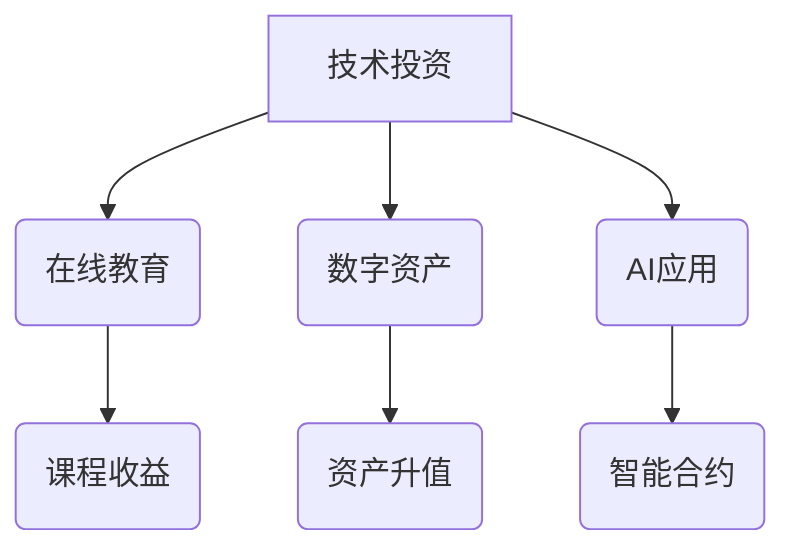

                 

关键词：被动收入、多元化、程序员、自动化、收益最大化、投资策略、数字化资产、区块链技术、在线教育、虚拟货币、AI

> 摘要：本文旨在为程序员提供构建多元化被动收入系统的指导，从技术投资、在线教育、数字资产、AI应用等多角度阐述实现收入多元化的策略和方法。

## 1. 背景介绍

在信息化时代，程序员这一职业逐渐成为高收入群体，但也面临着职业发展和生活压力的双重挑战。如何实现收入的多元化，成为许多程序员关注的焦点。被动收入系统，作为实现财务自由的一种途径，近年来受到了广泛关注。构建一个多元化的被动收入系统，不仅能够帮助程序员增加额外收入，还能在提高生活质量的同时，减轻职业发展的不确定性。

本文将围绕以下几个核心问题展开：

- **被动收入系统的基本概念及其重要性**
- **多元化策略在不同领域的具体应用**
- **构建被动收入系统的实际操作步骤**
- **面临的风险与挑战及应对策略**

## 2. 核心概念与联系

### 被动收入系统

被动收入系统是指通过一系列自动化流程和长期投资，实现资金不断流入的收入体系。不同于传统的工作模式，被动收入系统不需要程序员每天投入大量的时间和精力，但需要前期充分准备和合理规划。

### 多元化策略

多元化策略的核心在于分散风险，通过在不同领域投资和布局，实现收入来源的多样化。对于程序员而言，多元化策略包括但不限于技术投资、在线教育、数字资产、AI应用等多个方向。

### Mermaid 流程图



### 2.1 技术投资

技术投资包括购买股票、债券、基金等金融产品，投资于科技公司、初创企业或区块链项目。程序员可以利用自己的技术背景，对投资目标进行深入分析，从而做出更明智的投资决策。

### 2.2 在线教育

在线教育是近年来快速发展的领域，程序员可以利用自己的专业知识和经验，制作课程并在各大平台上线，通过课程销售和订阅获得收入。

### 2.3 数字资产

数字资产包括比特币、以太坊等虚拟货币，以及各类数字收藏品。这些资产具有高流动性和增值潜力，但也存在较大波动风险。

### 2.4 AI应用

AI应用领域广泛，包括智能家居、自动驾驶、医疗诊断等。程序员可以通过开发AI应用，将技术转化为实际收益。

## 3. 核心算法原理 & 具体操作步骤

### 3.1 算法原理概述

构建多元化被动收入系统的核心在于合理规划投资组合，降低风险，实现收益最大化。具体而言，可以分为以下几个步骤：

- **风险评估与目标设定**
- **资金分配与投资选择**
- **自动化流程搭建**
- **持续监控与调整**

### 3.2 算法步骤详解

#### 3.2.1 风险评估与目标设定

在构建被动收入系统之前，程序员需要对自己的财务状况、投资偏好和风险承受能力进行评估。根据评估结果，设定合理的目标，例如每年收入增长比例、资产配置比例等。

#### 3.2.2 资金分配与投资选择

根据风险评估结果，将资金分配到不同的投资领域，如技术投资、在线教育、数字资产、AI应用等。选择合适的投资工具，如股票、基金、数字货币等。

#### 3.2.3 自动化流程搭建

利用编程技术，搭建自动化投资和收入管理系统。例如，使用脚本自动执行交易、监控投资组合、处理收益分配等。

#### 3.2.4 持续监控与调整

定期对投资组合进行监控和调整，根据市场变化和个人财务状况，及时调整投资策略，以实现最佳收益。

### 3.3 算法优缺点

#### 优点

- **降低风险**：通过多元化投资，降低单一领域风险。
- **提高收益**：自动化投资和持续监控，提高投资效率和收益。
- **时间自由**：不需要每天投入大量时间，实现时间自由。

#### 缺点

- **市场波动**：数字资产等投资具有较高波动性，可能影响收益。
- **技术门槛**：需要掌握一定的编程和投资知识。

### 3.4 算法应用领域

- **金融投资**：通过技术投资、基金投资等实现被动收入。
- **在线教育**：制作并销售在线课程，实现知识变现。
- **数字资产**：投资比特币、以太坊等数字货币，实现资产增值。
- **AI应用**：开发AI应用，提供技术服务，获得收益。

## 4. 数学模型和公式 & 详细讲解 & 举例说明

### 4.1 数学模型构建

构建被动收入系统的数学模型主要包括风险评估模型和投资组合优化模型。其中，风险评估模型用于评估投资风险，投资组合优化模型用于确定最优资产配置。

### 4.2 公式推导过程

#### 风险评估模型

- **标准差**：用于衡量投资组合的波动性，公式为：

  $$ \sigma = \sqrt{\frac{1}{N}\sum_{i=1}^{N}(r_i - \bar{r})^2} $$

  其中，$r_i$为第$i$种资产的收益率，$\bar{r}$为投资组合的平均收益率，$N$为资产种类数量。

- **贝塔系数**：用于衡量投资组合对市场波动的敏感度，公式为：

  $$ \beta = \frac{Cov(r_p, r_m)}{Var(r_m)} $$

  其中，$r_p$为投资组合的收益率，$r_m$为市场平均收益率。

#### 投资组合优化模型

- **目标函数**：最大化投资组合的期望收益率，公式为：

  $$ \max \Pi = \sum_{i=1}^{N} w_i r_i $$

  其中，$w_i$为第$i$种资产的投资权重。

- **约束条件**：

  1. 投资组合的波动性不超过设定阈值，公式为：

     $$ \sigma \leq \sigma_0 $$

  2. 各类资产的投资权重之和为1，公式为：

     $$ \sum_{i=1}^{N} w_i = 1 $$

### 4.3 案例分析与讲解

假设一位程序员拥有10万元资金，计划构建一个多元化的被动收入系统。根据风险评估和投资组合优化模型，他可以选择以下资产进行投资：

| 资产名称 | 收益率（%） | 波动性（%） | 权重（%） |
| :---: | :---: | :---: | :---: |
| 股票 | 10 | 20 | 30 |
| 基金 | 8 | 15 | 30 |
| 数字货币 | 15 | 30 | 20 |
| AI项目 | 12 | 25 | 20 |

根据上述资产配置，程序员的年化收益率约为10.8%，波动性控制在15%以内。通过定期调整资产配置，可以进一步提高收益和降低风险。

## 5. 项目实践：代码实例和详细解释说明

### 5.1 开发环境搭建

为了实现自动化投资和收入管理，程序员需要搭建一个开发环境。以下是一个基本的开发环境搭建步骤：

- 安装Python开发环境
- 安装相关库，如numpy、pandas、matplotlib等
- 搭建一个Python虚拟环境，以便管理和隔离代码依赖

### 5.2 源代码详细实现

以下是一个简单的自动化投资脚本示例：

```python
import pandas as pd
import numpy as np

# 读取资产配置文件
config = pd.read_csv('config.csv')

# 计算资产权重
total_value = 100000
weights = config['weight'] / 100

# 初始化投资组合
portfolio = np.zeros(len(config))

# 分配资金到各类资产
for i in range(len(config)):
    portfolio[i] = total_value * weights[i]

# 模拟投资过程
for day in range(1, 365):
    # 计算资产收益
    for i in range(len(config)):
        portfolio[i] *= (1 + config['return'][i])

    # 计算资产总值
    total_value = np.sum(portfolio)

    # 记录投资结果
    with open('result.txt', 'a') as f:
        f.write(f"Day {day}: Total Value = {total_value}\n")

# 绘制投资曲线
import matplotlib.pyplot as plt

plt.plot(range(1, 365), total_value)
plt.xlabel('Days')
plt.ylabel('Total Value')
plt.title('Investment Curve')
plt.show()
```

### 5.3 代码解读与分析

上述代码实现了一个简单的自动化投资脚本，主要功能包括：

- 读取资产配置文件，计算资产权重。
- 分配资金到各类资产，模拟投资过程。
- 记录投资结果，并绘制投资曲线。

通过这段代码，程序员可以轻松实现自动化投资和监控，从而提高投资效率和收益。

## 6. 实际应用场景

### 6.1 被动收入系统的构建与应用

被动收入系统在程序员中的实际应用场景主要包括以下几个方面：

- **在线教育**：许多程序员利用自己的专业知识，制作并销售在线课程，如编程语言、算法设计等。通过课程销售和订阅，实现被动收入。
- **技术投资**：程序员可以通过投资股票、基金、数字货币等，实现资产增值。利用编程技术，搭建自动化投资系统，降低投资风险。
- **AI应用**：开发AI应用，提供技术服务，如智能语音助手、图像识别等。通过应用收费、广告收入等方式，实现被动收入。
- **数字资产**：投资比特币、以太坊等数字货币，通过资产升值和交易获利。

### 6.2 被动收入系统在程序员职业发展中的意义

构建多元化被动收入系统，对于程序员的职业发展具有重要意义：

- **提高收入**：通过被动收入系统，程序员可以增加额外收入，提高生活质量。
- **实现财务自由**：被动收入系统可以帮助程序员实现财务自由，减轻职业发展的不确定性。
- **降低职业风险**：多元化投资降低单一领域的风险，为程序员提供更稳定的收入来源。

### 6.3 未来应用展望

随着技术的不断发展，被动收入系统将在程序员职业发展中发挥越来越重要的作用：

- **AI技术**：随着AI技术的进步，自动化投资、智能监控等技术将更加成熟，为程序员构建多元化被动收入系统提供更强有力的支持。
- **区块链技术**：区块链技术将为数字资产交易和投资提供更安全、高效的解决方案，进一步推动被动收入系统的发展。
- **在线教育**：在线教育领域将不断扩展，为程序员提供更多创作和收入的机会。

## 7. 工具和资源推荐

### 7.1 学习资源推荐

- **在线课程平台**：Coursera、Udemy、网易云课堂等，提供丰富的编程和投资课程。
- **技术博客**：GitHub、Stack Overflow、Medium等，了解最新技术动态和经验分享。
- **金融投资书籍**：《股票大作手回忆录》、《聪明的投资者》等，学习投资策略和技巧。

### 7.2 开发工具推荐

- **Python**：适合数据分析和自动化投资。
- **Jupyter Notebook**：用于编写和运行Python代码。
- **matplotlib**：用于绘制投资曲线和图表。

### 7.3 相关论文推荐

- **《智能投资组合优化模型研究》**
- **《区块链技术在金融投资中的应用研究》**
- **《基于人工智能的股票交易策略研究》**

## 8. 总结：未来发展趋势与挑战

### 8.1 研究成果总结

本文从多个角度探讨了程序员构建多元化被动收入系统的策略和方法，包括技术投资、在线教育、数字资产、AI应用等。通过数学模型和代码实例，详细阐述了构建被动收入系统的关键步骤和实际应用场景。

### 8.2 未来发展趋势

- **AI和区块链技术的深入应用**：随着AI和区块链技术的不断发展，被动收入系统将变得更加智能化和高效。
- **在线教育的持续扩展**：在线教育市场将继续增长，为程序员提供更多创作和收入的机会。
- **数字化资产的广泛应用**：数字资产将成为投资的重要方向，为程序员带来更多收益来源。

### 8.3 面临的挑战

- **市场波动风险**：数字资产等投资具有较高的波动性，需要程序员具备较强的风险控制能力。
- **技术门槛**：构建被动收入系统需要程序员掌握一定的编程和投资知识，需要持续学习和更新。

### 8.4 研究展望

未来，被动收入系统将在程序员职业发展中发挥越来越重要的作用。随着技术的不断进步，将有更多的工具和方法帮助程序员实现财务自由。同时，也需要关注市场风险和技术变革，确保被动收入系统的稳定和可持续发展。

## 9. 附录：常见问题与解答

### 9.1 什么是被动收入？

被动收入是指通过自动化流程和长期投资，实现资金不断流入的收入体系。与主动收入（如工资收入）不同，被动收入不需要每天投入大量时间和精力。

### 9.2 如何评估投资风险？

可以通过计算资产的标准差和贝塔系数，评估投资组合的风险。标准差用于衡量波动性，贝塔系数用于衡量对市场波动的敏感度。

### 9.3 被动收入系统是否适合所有程序员？

被动收入系统适合有一定财务基础和投资意识的程序员。对于初学者，建议先从简单投资开始，逐步积累经验和知识。

### 9.4 被动收入系统需要投入多少时间和精力？

构建和运营被动收入系统需要一定的时间和精力，但相比传统工作，投入的时间和精力相对较少。程序员可以根据自身情况进行合理安排。

### 9.5 被动收入系统是否具有法律风险？

在构建和运营被动收入系统时，需要遵守相关法律法规。例如，投资股票、基金等需要遵守证券法律法规；投资数字资产需要遵守相关数字货币法律法规。合规操作是避免法律风险的关键。

---

**作者：禅与计算机程序设计艺术 / Zen and the Art of Computer Programming**

