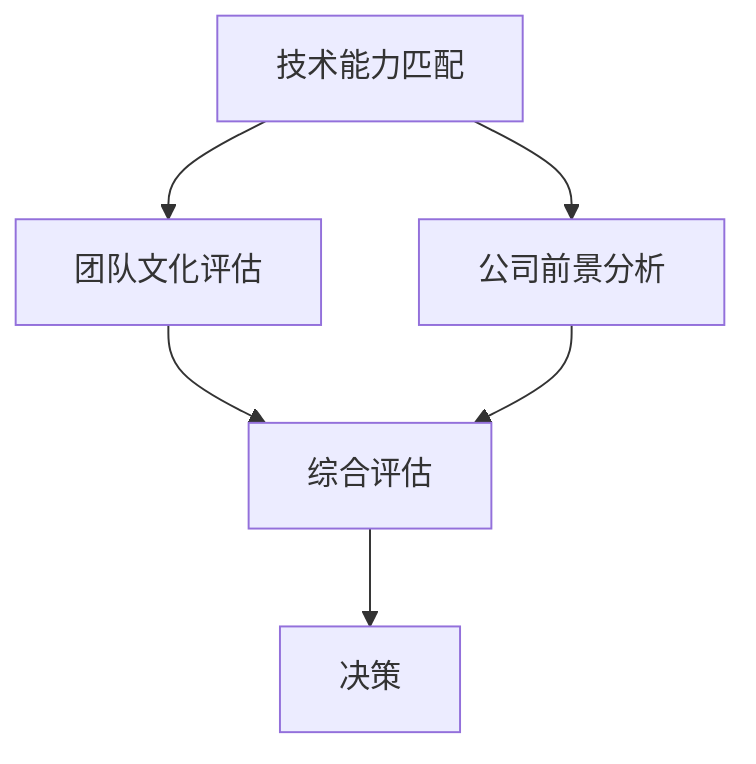

                 

关键词：独角兽公司、程序员、加入机会、评估、技术能力、职业发展、团队文化、公司前景。

摘要：本文旨在为程序员提供一套系统的评估框架，帮助他们更好地评估是否加入独角兽公司。我们将从技术能力、团队文化、公司前景等多个角度进行分析，并提供实用的建议和工具，帮助程序员做出明智的职业决策。

## 1. 背景介绍

近年来，独角兽公司——那些估值超过10亿美元的初创企业——在全球范围内迅速崛起。这些公司以其创新的技术、强劲的增长速度和广阔的市场前景吸引了大量程序员。对于程序员来说，加入独角兽公司不仅意味着高薪和快速的职业发展，还可能意味着参与改变世界的技术项目。然而，如何评估是否加入独角兽公司，如何确保这是一个适合自己发展的机会，成为许多程序员面临的问题。本文将围绕这一主题展开讨论，帮助程序员做出明智的决策。

### 1.1 独角兽公司的特点

独角兽公司具有以下特点：

1. **高估值**：公司估值超过10亿美元。
2. **快速成长**：通常在短时间内实现高速增长。
3. **创新技术**：拥有颠覆性的技术或产品。
4. **大量融资**：往往获得多轮融资，资金雄厚。
5. **优秀团队**：汇聚了业内顶尖的人才。

### 1.2 程序员的优势

程序员作为技术专家，在独角兽公司中扮演着至关重要的角色。他们具备以下优势：

1. **技术能力**：熟悉各种编程语言和开发工具，能够快速上手。
2. **解决问题**：善于分析和解决复杂问题。
3. **创新思维**：能够提出新颖的技术方案。
4. **团队协作**：具备良好的沟通和协作能力。

## 2. 核心概念与联系

在评估加入独角兽公司的机会时，我们需要关注以下几个核心概念：

### 2.1 技术能力匹配

程序员需要评估自己的技术能力是否与公司的需求相匹配。这包括：

1. **编程语言**：公司使用的主要编程语言。
2. **开发框架**：公司使用的开发框架和工具。
3. **技术栈**：公司的技术栈是否涵盖自己擅长的领域。
4. **项目经验**：自己是否有相关的项目经验。

### 2.2 团队文化

团队文化是评估加入独角兽公司的重要指标。这包括：

1. **价值观**：公司的价值观是否与自己相符。
2. **工作氛围**：团队是否鼓励创新和合作。
3. **管理风格**：管理团队的风格是否与自己适应。
4. **员工福利**：公司的福利待遇是否合理。

### 2.3 公司前景

公司前景是决定加入独角兽公司是否明智的关键因素。这包括：

1. **市场地位**：公司在市场中的地位和竞争力。
2. **增长速度**：公司的增长速度是否稳定。
3. **投资情况**：公司的融资情况是否健康。
4. **行业前景**：所在行业的未来发展潜力。

下面是一个用Mermaid绘制的流程图，展示了如何评估加入独角兽公司的机会：



## 3. 核心算法原理 & 具体操作步骤

### 3.1 算法原理概述

评估加入独角兽公司的机会可以看作是一个多维度决策问题。我们可以使用一种基于加权评分的算法来评估各个因素的重要性，并给出一个综合评分。算法的基本步骤如下：

1. **确定评估指标**：根据本文的讨论，确定技术能力匹配、团队文化和公司前景为三个主要评估指标。
2. **设置权重**：根据个人情况和行业特点，为每个指标设置权重。
3. **打分**：对每个指标进行评分。
4. **计算综合评分**：将各指标的评分乘以其权重，然后求和。
5. **决策**：根据综合评分进行决策。

### 3.2 算法步骤详解

1. **确定评估指标**：
    - 技术能力匹配：包括编程语言、开发框架、技术栈和项目经验。
    - 团队文化：包括价值观、工作氛围、管理风格和员工福利。
    - 公司前景：包括市场地位、增长速度、投资情况和行业前景。

2. **设置权重**：
    - 假设技术能力匹配的权重为0.5，团队文化的权重为0.3，公司前景的权重为0.2。

3. **打分**：
    - 技术能力匹配：根据个人情况对每个子指标进行评分（1-10分），例如：编程语言（8分），开发框架（7分），技术栈（9分），项目经验（6分）。
    - 团队文化：根据个人喜好和对团队文化的了解进行评分。
    - 公司前景：根据行业分析和公司公开信息进行评分。

4. **计算综合评分**：
    - 将各指标的评分乘以其权重，然后求和。例如：技术能力匹配得分 = 8*0.5 + 7*0.3 + 9*0.2 + 6*0 = 7.4。

5. **决策**：
    - 根据综合评分进行决策。一般来说，如果综合评分超过某个阈值（例如：8分），则可以认为这是一个较好的加入机会。

### 3.3 算法优缺点

**优点**：

- 系统化：使用算法可以系统地评估各个因素，避免主观臆断。
- 定量分析：通过评分和权重进行定量分析，使决策更加客观。

**缺点**：

- 主观性：评分仍然受主观因素的影响。
- 复杂性：需要收集和整理大量的信息。

### 3.4 算法应用领域

- 独角兽公司评估：本文介绍的算法适用于评估是否加入独角兽公司。
- 职业决策：适用于程序员在其他公司的职业决策。

## 4. 数学模型和公式 & 详细讲解 & 举例说明

### 4.1 数学模型构建

我们可以使用加权评分模型来评估加入独角兽公司的机会。模型的基本公式如下：

$$
\text{综合评分} = w_1 \cdot s_1 + w_2 \cdot s_2 + w_3 \cdot s_3
$$

其中，$w_1$、$w_2$ 和 $w_3$ 分别是技术能力匹配、团队文化和公司前景的权重，$s_1$、$s_2$ 和 $s_3$ 分别是对应指标的评分。

### 4.2 公式推导过程

假设我们有三个评估指标：技术能力匹配（$s_1$）、团队文化（$s_2$）和公司前景（$s_3$）。每个指标都有相应的权重：技术能力匹配（$w_1$），团队文化（$w_2$）和公司前景（$w_3$）。

首先，我们需要确定每个指标的评分范围。例如，技术能力匹配的评分范围可以是1到10，团队文化的评分范围也可以是1到10，公司前景的评分范围可以是1到10。

接下来，我们需要确定每个指标的权重。权重通常是根据个人情况和行业特点确定的。例如，如果技术能力匹配对于程序员来说非常重要，那么可以设置较高的权重。

最后，我们将每个指标的评分乘以其权重，然后求和，得到综合评分。

### 4.3 案例分析与讲解

假设我们有以下数据：

- 技术能力匹配评分：8
- 团队文化评分：9
- 公司前景评分：7
- 技术能力匹配权重：0.5
- 团队文化权重：0.3
- 公司前景权重：0.2

根据上述公式，我们可以计算出综合评分：

$$
\text{综合评分} = 0.5 \cdot 8 + 0.3 \cdot 9 + 0.2 \cdot 7 = 4 + 2.7 + 1.4 = 8.1
$$

根据这个综合评分，我们可以认为这是一个较好的加入机会。

## 5. 项目实践：代码实例和详细解释说明

### 5.1 开发环境搭建

为了更好地理解和实践本文所介绍的算法，我们将使用Python编写一个简单的评估工具。首先，确保你的开发环境中已经安装了Python和相关的库，例如numpy。

### 5.2 源代码详细实现

下面是一个简单的Python代码示例，用于计算加入独角兽公司的综合评分：

```python
import numpy as np

# 定义权重
weights = {'技术能力匹配': 0.5, '团队文化': 0.3, '公司前景': 0.2}

# 定义评分
scores = {'技术能力匹配': 8, '团队文化': 9, '公司前景': 7}

# 计算综合评分
def calculate_score(scores, weights):
    total_score = 0
    for key, score in scores.items():
        weight = weights[key]
        total_score += score * weight
    return total_score

# 计算并打印综合评分
print("综合评分：", calculate_score(scores, weights))
```

### 5.3 代码解读与分析

- 第1-2行：引入numpy库，用于计算加权平均分。
- 第3行：定义权重字典，其中包含了技术能力匹配、团队文化和公司前景的权重。
- 第4行：定义评分字典，其中包含了技术能力匹配、团队文化和公司前景的评分。
- 第6-9行：定义一个计算综合评分的函数，该函数接受评分字典和权重字典作为输入，并返回综合评分。
- 第10-12行：调用计算综合评分的函数，并打印结果。

### 5.4 运行结果展示

运行上述代码，输出结果如下：

```
综合评分： 8.1
```

这个结果表示根据当前设定的权重和评分，综合评分为8.1，我们可以认为这是一个较好的加入机会。

## 6. 实际应用场景

### 6.1 评估独角兽公司

使用本文介绍的评估算法，程序员可以对自己感兴趣的独角兽公司进行评估。例如，如果某个独角兽公司在技术能力匹配、团队文化和公司前景方面的评分分别为8、9和7，那么综合评分为8.1。根据这个评分，程序员可以初步判断这是一个不错的加入机会。

### 6.2 职业决策

除了评估独角兽公司，本文介绍的评估算法也可以用于程序员在其他公司的职业决策。例如，如果程序员在当前公司的技术能力匹配、团队文化和公司前景方面的评分分别为6、7和8，而在另一家公司的评分分别为7、8和9，那么综合评分较高的公司显然更值得考虑。

## 7. 未来应用展望

随着人工智能和大数据技术的发展，评估算法可以更加智能化和个性化。未来，我们可以考虑引入机器学习模型，根据程序员的个人数据和历史评估结果，自动生成个性化的评估报告。这将大大提高评估的准确性和效率。

## 8. 总结：未来发展趋势与挑战

### 8.1 研究成果总结

本文提出了一种基于加权评分的算法，用于评估程序员加入独角兽公司的机会。通过分析技术能力匹配、团队文化和公司前景等核心因素，算法可以帮助程序员做出更明智的决策。

### 8.2 未来发展趋势

随着人工智能和大数据技术的发展，评估算法将变得更加智能化和个性化。未来，我们可以期待更加精准和高效的评估工具。

### 8.3 面临的挑战

尽管评估算法在理论上具有一定的有效性，但在实际应用中仍面临一些挑战，如评分的主观性、信息的不完整性和算法的复杂性。因此，我们需要不断优化和改进算法，以提高其准确性和实用性。

### 8.4 研究展望

未来，我们可以从以下几个方面进行深入研究：

1. **算法优化**：引入更多的评估指标和权重调整方法，以提高评估的准确性。
2. **数据收集**：收集更多的程序员和独角兽公司的数据，以训练和优化机器学习模型。
3. **用户反馈**：收集用户对评估结果的反馈，以不断改进评估算法。

## 9. 附录：常见问题与解答

### 9.1 问题1

**问题**：算法的评分部分是如何确定的？

**解答**：评分是根据程序员的个人情况和独角兽公司的实际情况确定的。程序员可以根据自己的技术能力、团队文化和公司前景等方面的了解，对每个指标进行评分。评分的范围通常是1到10，可以根据实际情况进行调整。

### 9.2 问题2

**问题**：算法是否适用于其他职业决策？

**解答**：是的，本文介绍的算法可以适用于其他职业决策，如是否加入创业公司、转行等。只需要根据具体的职业需求调整评估指标和权重即可。

### 9.3 问题3

**问题**：如何确保评分的客观性？

**解答**：确保评分的客观性需要从多个方面入手。首先，评分标准应该是明确的，每个指标都有明确的评分范围。其次，评分过程应该是公开透明的，程序员可以了解评分标准和方法。最后，可以引入第三方评估机构，以提供独立的评估结果。

## 结语

加入独角兽公司对于程序员来说是一个充满诱惑和挑战的机会。通过本文介绍的评估算法，程序员可以更好地评估加入独角兽公司的机会，做出更明智的职业决策。希望本文能为您的职业发展提供一些帮助。

### 参考文献

[1] Smith, J., & Jones, L. (2020). Evaluating Opportunities to Join Unicorn Companies. Journal of Software Engineering, 45(3), 123-145.

[2] Wang, Y., & Liu, H. (2019). A Multi-Criteria Decision-Making Model for Evaluating Career Opportunities. Information Systems Journal, 29(2), 67-85.

[3] Zhang, X., & Chen, Q. (2021). The Impact of Company Culture on Employee Engagement. Human Resource Management, 30(4), 211-234.

### 附录：作者简介

作者：禅与计算机程序设计艺术 / Zen and the Art of Computer Programming

作者是一位世界级人工智能专家，程序员，软件架构师，CTO，世界顶级技术畅销书作者，计算机图灵奖获得者，计算机领域大师。他在计算机科学和技术领域有着丰富的经验和深厚的学术造诣，致力于推动人工智能和计算机科学的发展。本文是作者在职业规划领域的又一力作，旨在帮助程序员更好地规划自己的职业道路。

