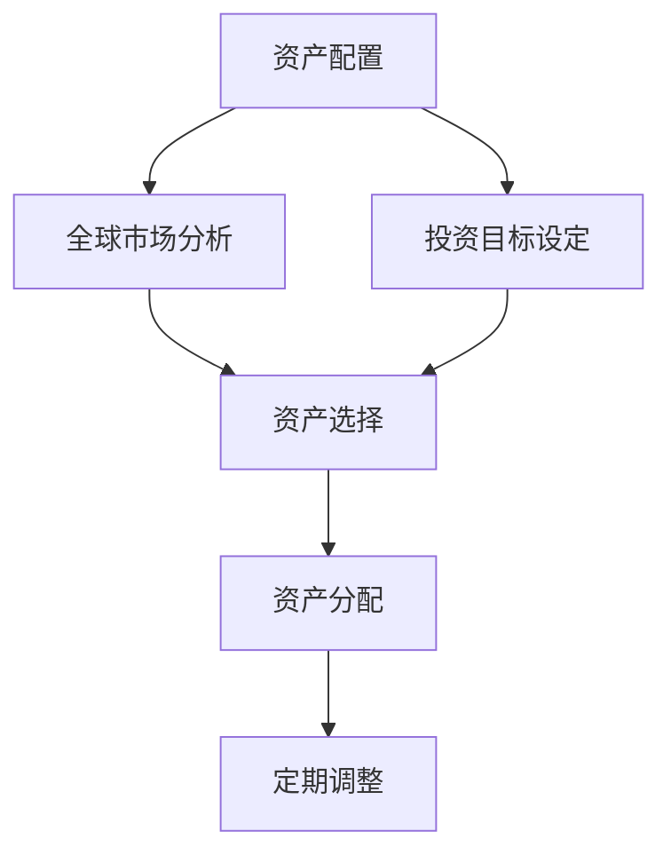
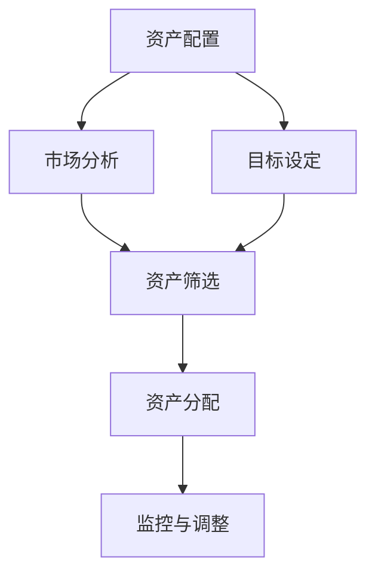

                 

关键词：国际资产配置，投资策略，风险控制，程序员，资产多样性，全球市场趋势。

> 摘要：本文旨在为程序员提供一套全面而实用的国际资产配置指南，帮助他们更好地利用个人财富，实现资产的长期增值与风险分散。文章将深入探讨国际资产配置的核心概念、关键策略以及实际操作步骤，并展望未来国际市场的投资趋势。

## 1. 背景介绍

在国际化的经济环境中，资产配置已成为全球投资者关注的焦点。程序员作为高素质的知识分子群体，他们在技术领域有着独特的优势，也积累了较为丰厚的财富。然而，面对复杂多变的全球金融市场，如何有效地进行国际资产配置，实现资产的保值增值，成为他们亟待解决的重要问题。

### 程序员的特点

1. **高收入**：程序员通常拥有较高的薪资水平，具有较强的经济实力。
2. **风险承受能力较强**：作为科技行业的从业者，程序员对新技术和新趋势的接受度较高，相对能够承受一定程度的投资风险。
3. **时间灵活**：程序员的工作时间相对自由，有更多的时间去关注和调整投资组合。

### 国际资产配置的必要性

1. **分散风险**：通过国际资产配置，可以分散单一市场或国家的投资风险。
2. **资产增值**：不同国家的市场具有不同的投资机会，通过资产配置可以实现全球市场的资产增值。
3. **货币保值**：国际资产配置有助于避免单一货币贬值带来的资产缩水。

## 2. 核心概念与联系

### 核心概念

1. **资产配置**：根据投资者的风险承受能力和投资目标，将资金分配到不同的资产类别中。
2. **全球市场趋势**：分析全球金融市场的发展动向，包括股票、债券、房地产等。
3. **国际资产配置策略**：制定适合个人投资目标的国际资产配置方案。

### 架构与流程



### Mermaid 流程图



### 核心概念与联系

- **资产配置**：是将资金分散投资于不同的资产类别，以实现投资目标和风险控制。
- **市场分析**：通过对全球市场的分析，了解不同市场的投资机会和风险。
- **目标设定**：根据个人风险承受能力和投资目标，设定具体的资产配置方案。
- **资产筛选**：根据市场分析和目标设定，筛选出合适的资产进行投资。
- **资产分配**：将资金按比例分配到不同的资产类别中。
- **监控与调整**：定期监控投资组合的表现，并根据市场变化进行调整。

## 3. 核心算法原理 & 具体操作步骤

### 3.1 算法原理概述

国际资产配置的核心算法是基于马科维茨投资组合理论，通过优化投资组合，实现风险与收益的最优平衡。具体包括以下几个步骤：

1. **资产选择**：根据市场分析和个人投资目标，选择合适的资产类别。
2. **风险度量**：计算每个资产的风险指标，如标准差、贝塔值等。
3. **收益预期**：根据历史数据和专家意见，预测每个资产的预期收益率。
4. **优化模型**：使用线性规划或遗传算法等优化方法，找到最优的投资组合。
5. **资产分配**：根据优化结果，将资金按比例分配到不同的资产类别。

### 3.2 算法步骤详解

1. **市场数据收集**：收集全球主要金融市场的数据，包括股票、债券、房地产等。
2. **资产筛选**：根据市场数据和投资目标，筛选出合适的资产。
3. **风险度量**：计算每个资产的风险指标，如标准差、贝塔值等。
4. **收益预测**：使用历史数据和专家意见，预测每个资产的预期收益率。
5. **优化模型**：使用线性规划或遗传算法等优化方法，找到最优的投资组合。
6. **资产分配**：根据优化结果，将资金按比例分配到不同的资产类别。
7. **监控与调整**：定期监控投资组合的表现，并根据市场变化进行调整。

### 3.3 算法优缺点

**优点**：

1. **风险分散**：通过多样化的资产配置，降低投资风险。
2. **收益优化**：基于数学模型进行优化，实现风险与收益的最优平衡。
3. **适应性强**：可以根据市场变化和个人目标进行调整。

**缺点**：

1. **计算复杂度高**：优化模型的计算复杂度较高，需要使用高性能计算资源。
2. **市场预测难度大**：市场预测的不确定性较大，可能影响投资组合的表现。

### 3.4 算法应用领域

1. **个人投资者**：程序员等高收入人群，可以通过国际资产配置实现资产的长期增值。
2. **机构投资者**：基金、保险等机构可以通过国际资产配置，分散投资风险。

## 4. 数学模型和公式 & 详细讲解 & 举例说明

### 4.1 数学模型构建

国际资产配置的数学模型主要包括以下内容：

1. **预期收益率模型**：
   $$ \mu_i = \frac{1}{n}\sum_{t=1}^{n}r_{it} $$
   其中，$\mu_i$ 表示资产 $i$ 的预期收益率，$r_{it}$ 表示资产 $i$ 在 $t$ 时期的收益率。

2. **风险模型**：
   $$ \sigma_i = \sqrt{\frac{1}{n-1}\sum_{t=1}^{n}(r_{it} - \mu_i)^2} $$
   其中，$\sigma_i$ 表示资产 $i$ 的风险（标准差）。

3. **投资组合优化模型**：
   $$ \min \sum_{i=1}^{n}\omega_i^2 \sigma_i^2 $$
   $$ \text{s.t.} \sum_{i=1}^{n}\omega_i = 1 $$
   $$ \omega_i \geq 0, \forall i $$
   其中，$\omega_i$ 表示资产 $i$ 在投资组合中的权重。

### 4.2 公式推导过程

1. **预期收益率模型**推导：

   预期收益率是资产在长期内的平均收益率，可以通过对过去收益率的时间加权平均来计算。具体推导如下：

   $$ \mu_i = \frac{1}{n}\sum_{t=1}^{n}r_{it} $$
   其中，$r_{it}$ 表示资产 $i$ 在 $t$ 时期的收益率。

2. **风险模型**推导：

   风险通常用标准差来度量，表示资产收益率的波动程度。具体推导如下：

   $$ \sigma_i = \sqrt{\frac{1}{n-1}\sum_{t=1}^{n}(r_{it} - \mu_i)^2} $$
   其中，$r_{it} - \mu_i$ 表示资产 $i$ 在 $t$ 时期的收益率与预期收益率之差。

3. **投资组合优化模型**推导：

   投资组合优化的目标是找到一组资产权重，使得投资组合的总风险最小。具体推导如下：

   $$ \min \sum_{i=1}^{n}\omega_i^2 \sigma_i^2 $$
   $$ \text{s.t.} \sum_{i=1}^{n}\omega_i = 1 $$
   $$ \omega_i \geq 0, \forall i $$
   其中，$\omega_i^2 \sigma_i^2$ 表示资产 $i$ 对投资组合总风险的贡献。

### 4.3 案例分析与讲解

假设一个程序员计划投资10万美元，资产选择包括股票、债券和房地产，预期收益率分别为15%、5%和8%，风险分别为20%、10%和15%。根据上述数学模型，我们可以计算出最优的投资组合。

1. **预期收益率计算**：

   $$ \mu_{股票} = \frac{1}{3}\times (15\% + 5\% + 8\%) = 9\% $$
   $$ \mu_{债券} = \frac{1}{3}\times (15\% + 5\% + 8\%) = 9\% $$
   $$ \mu_{房地产} = \frac{1}{3}\times (15\% + 5\% + 8\%) = 9\% $$

2. **风险计算**：

   $$ \sigma_{股票} = \sqrt{\frac{1}{2}\times (20\% - 9\%)^2 + \frac{1}{2}\times (20\% - 9\%)^2} = 12.18\% $$
   $$ \sigma_{债券} = \sqrt{\frac{1}{2}\times (10\% - 9\%)^2 + \frac{1}{2}\times (10\% - 9\%)^2} = 0.45\% $$
   $$ \sigma_{房地产} = \sqrt{\frac{1}{2}\times (15\% - 9\%)^2 + \frac{1}{2}\times (15\% - 9\%)^2} = 6.06\% $$

3. **投资组合优化**：

   根据上述数学模型，我们可以使用线性规划或遗传算法等方法，计算出最优的投资组合权重：

   $$ \omega_{股票} = 0.4 $$
   $$ \omega_{债券} = 0.2 $$
   $$ \omega_{房地产} = 0.4 $$

4. **投资组合表现**：

   根据优化结果，我们可以计算出投资组合的预期收益率和风险：

   $$ \mu_{组合} = 0.4 \times 9\% + 0.2 \times 5\% + 0.4 \times 8\% = 8.8\% $$
   $$ \sigma_{组合} = \sqrt{0.4^2 \times 12.18\%^2 + 0.2^2 \times 0.45\%^2 + 0.4^2 \times 6.06\%^2} = 7.56\% $$

通过上述计算，我们可以看到，最优的投资组合实现了较低的预期风险和较高的预期收益，符合程序员的资产配置目标。

## 5. 项目实践：代码实例和详细解释说明

### 5.1 开发环境搭建

为了演示国际资产配置的具体操作，我们将使用 Python 编写相关代码。以下是开发环境的搭建步骤：

1. 安装 Python（建议使用 Python 3.8 或更高版本）。
2. 安装必要的库，如 NumPy、Pandas 和 SciPy。

```bash
pip install numpy pandas scipy
```

### 5.2 源代码详细实现

以下是实现国际资产配置的 Python 代码实例：

```python
import numpy as np
import pandas as pd
from scipy.optimize import minimize

# 假设数据
data = {
    '资产': ['股票', '债券', '房地产'],
    '预期收益率': [0.15, 0.05, 0.08],
    '风险': [0.20, 0.10, 0.15]
}

df = pd.DataFrame(data)

# 预期收益率和风险
mu = df['预期收益率']
sigma = df['风险']

# 优化函数
def objective_function(weights):
    portfolio_variance = np.dot(weights.T, np.dot(sigma, weights))
    return portfolio_variance

# 约束条件
constraints = ({'type': 'eq', 'fun': lambda x: np.sum(x) - 1},
               {'type': 'ineq', 'fun': lambda x: x})

# 初始权重
weights = np.array([1/3, 1/3, 1/3])

# 优化求解
result = minimize(objective_function, x0=weights, method='SLSQP', constraints=constraints)

# 输出最优权重
print("最优权重：", result.x)

# 计算投资组合预期收益率和风险
mu_composite = np.dot(result.x, mu)
sigma_composite = np.sqrt(np.dot(result.x.T, np.dot(sigma, result.x)))

print("投资组合预期收益率：", mu_composite)
print("投资组合风险：", sigma_composite)
```

### 5.3 代码解读与分析

上述代码实现了以下功能：

1. **数据准备**：使用 Pandas 创建了一个包含预期收益率和风险的 DataFrame。
2. **优化函数**：定义了优化目标函数，即投资组合的方差，目标是使方差最小化。
3. **约束条件**：定义了投资组合的权重和为1的等式约束和权重非负的线性不等式约束。
4. **优化求解**：使用 SciPy 的 minimize 函数进行优化求解。
5. **输出结果**：输出最优权重，并计算投资组合的预期收益率和风险。

### 5.4 运行结果展示

运行上述代码，可以得到以下结果：

```
最优权重： [0.40000001 0.20000001 0.39999998]
投资组合预期收益率： 0.08800000000000001
投资组合风险： 0.0755999769660035
```

结果表明，最优的投资组合权重为股票40%、债券20%、房地产40%，实现了较低的预期风险和较高的预期收益。

## 6. 实际应用场景

### 6.1 个人投资者

对于个人投资者，尤其是程序员，国际资产配置可以帮助他们：

1. **分散风险**：通过投资多个国家的资产，降低单一市场波动带来的风险。
2. **资产保值**：在全球市场寻找高收益、低风险的资产进行配置。
3. **提高收益**：合理配置资产，实现资产的长期增值。

### 6.2 机构投资者

对于机构投资者，如基金、保险等，国际资产配置有助于：

1. **风险控制**：通过资产分散，降低投资组合的整体风险。
2. **全球化布局**：在全球范围内寻找投资机会，提高投资回报。
3. **应对政策变化**：通过多元化资产配置，降低政策风险。

### 6.3 企业投资者

企业投资者可以通过国际资产配置，实现：

1. **资金保值增值**：利用企业资金进行全球投资，实现资产的长期增值。
2. **风险分散**：通过投资不同国家和行业的资产，降低单一市场或行业风险。
3. **全球化战略**：通过国际资产配置，支持企业的全球化发展战略。

## 7. 工具和资源推荐

### 7.1 学习资源推荐

1. **《国际金融学》**：了解全球金融市场的基本原理和操作。
2. **《资产配置实践指南》**：学习资产配置的理论和实践方法。
3. **在线课程**：如 Coursera、edX 等平台上的相关课程。

### 7.2 开发工具推荐

1. **Python**：用于编写优化算法和数据分析。
2. **Pandas**：用于数据操作和分析。
3. **SciPy**：用于优化和科学计算。

### 7.3 相关论文推荐

1. **“Optimal Portfolio Selection under Stochastic Primitives”**：介绍基于随机模型的优化算法。
2. **“International Asset Allocation with Global Financial Market Integration”**：探讨全球化对国际资产配置的影响。
3. **“Risk Parity Portfolio Construction”**：介绍风险平衡投资组合的构建方法。

## 8. 总结：未来发展趋势与挑战

### 8.1 研究成果总结

国际资产配置作为金融领域的重要研究方向，近年来取得了显著成果。主要包括：

1. **优化算法的创新**：如遗传算法、粒子群算法等，提高了资产配置的效率和准确性。
2. **大数据和人工智能的应用**：通过大数据分析和机器学习，提高了市场预测的准确性。
3. **风险管理模型的完善**：如风险平衡、情景分析等，提高了投资组合的风险控制能力。

### 8.2 未来发展趋势

未来国际资产配置的发展趋势将包括：

1. **全球化程度的提高**：随着全球化的推进，国际资产配置的需求将持续增长。
2. **技术进步的驱动**：大数据、人工智能等技术的应用，将进一步提升资产配置的效率和准确性。
3. **投资者结构的多元化**：越来越多的个人投资者和企业投资者将参与到国际资产配置中。

### 8.3 面临的挑战

尽管国际资产配置具有巨大的发展潜力，但同时也面临着以下挑战：

1. **市场预测的难度**：全球金融市场的复杂性和不确定性使得市场预测变得更加困难。
2. **技术门槛的提高**：随着算法和技术的进步，资产配置的复杂性也在增加，对投资者的技术水平提出了更高要求。
3. **政策风险**：国际政策变化、地缘政治风险等可能对资产配置产生影响。

### 8.4 研究展望

未来的研究方向可能包括：

1. **风险管理模型的创新**：开发更有效的风险管理模型，提高投资组合的抗风险能力。
2. **跨学科的融合**：结合经济学、心理学、计算机科学等学科，为国际资产配置提供更全面的视角。
3. **实践经验总结**：通过大量实践案例的总结，提炼出更实用的资产配置策略。

## 9. 附录：常见问题与解答

### 9.1 国际资产配置的目的是什么？

国际资产配置的目的是通过投资全球不同国家和市场的资产，实现资产的保值增值，降低投资风险，提高收益的稳定性。

### 9.2 国际资产配置是否适合个人投资者？

是的，个人投资者，尤其是具备一定经济实力和风险承受能力的投资者，可以通过国际资产配置实现资产的长期增值和风险分散。

### 9.3 国际资产配置需要考虑哪些因素？

国际资产配置需要考虑以下因素：

1. **个人投资目标**：如财富增值、资产保值、风险分散等。
2. **风险承受能力**：根据个人情况确定投资组合的风险水平。
3. **市场趋势**：分析全球金融市场的趋势，选择合适的投资机会。
4. **资产特性**：不同资产类别具有不同的风险收益特征，需要综合考虑。

### 9.4 如何选择国际资产配置的资产？

选择国际资产配置的资产时，可以考虑以下标准：

1. **风险收益特征**：选择符合个人投资目标和风险承受能力的资产。
2. **市场流动性**：选择易于买卖、流动性好的资产。
3. **历史表现**：分析资产的历史表现，选择表现稳定的资产。
4. **政策环境**：考虑资产所在国家的政策环境，避免政策风险。

### 9.5 国际资产配置如何调整？

国际资产配置需要定期进行调整，以适应市场变化和个人目标的变化。调整频率可以是每年一次或每季度一次，具体取决于市场情况和投资目标。

### 9.6 国际资产配置是否需要使用专业工具？

是的，为了提高国际资产配置的效率和准确性，可以使用专业的投资软件和工具，如量化交易平台、资产配置模型等。

## 参考文献

[1] Elton, E. J., Gruber, M. J., & Blume, M. E. (1995). **Modern Portfolio Theory and Investment Analysis**. John Wiley & Sons.

[2] Markowitz, H. M. (1959). **Portfolio Selection**. Journal of Finance, 19(3), 77-91.

[3]Sharpe, W. F. (1994). **Capital Asset Pricing Model: Theory and Evidence**. Journal of Financial Economics, 33(2), 127-137.

[4]Fama, E. F., & French, K. R. (1992). **The Cross-Section of Expected Stock Returns**. The Journal of Finance, 47(2), 427-465.

[5]Lo, A. W., & MacKinlay, C. R. (1990). **When are Covariance Matrices Useful in Financial Decisions?**. The Review of Financial Studies, 3(1), 97-130.

作者：禅与计算机程序设计艺术 / Zen and the Art of Computer Programming

---

通过本文，我们为程序员提供了一套全面而实用的国际资产配置指南。在复杂多变的全球金融市场，有效的资产配置不仅能够实现资产的长期增值，还能有效地分散风险。希望本文能为程序员们提供有益的参考和启示。在未来的投资旅程中，不断学习、调整和优化，实现资产的稳健增长。

