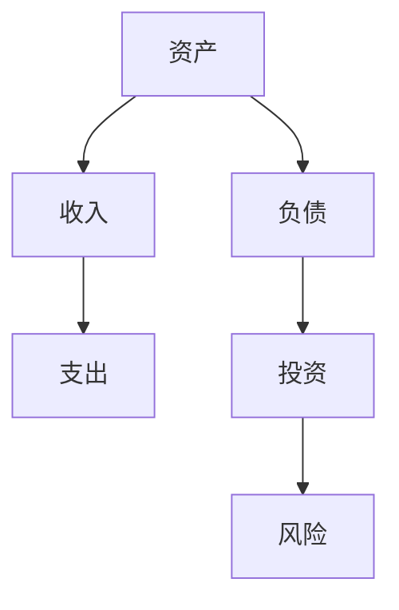

                 

## 1. 背景介绍

在当今快速发展的信息技术时代，程序员已经成为了社会中不可或缺的一部分。随着技术的不断进步，程序员的工作压力和生活成本也在不断增加。因此，如何合理地进行资产配置，以实现财务自由和长远发展，成为了许多程序员关注的焦点。本文旨在探讨程序员在进行资产配置时的一些核心概念、方法和技巧，帮助他们更好地管理自己的财务状况。

### 文章关键词：
- 程序员
- 资产配置
- 财务管理
- 投资策略
- 风险控制

### 文章摘要：
本文首先介绍了程序员资产配置的重要性，然后分析了资产配置的核心概念和原则。接着，文章详细阐述了投资策略和风险控制的方法，以及程序员在实践中如何应用这些策略。最后，文章提供了一些未来发展的展望和常见问题的解答。

## 2. 核心概念与联系

在进行资产配置之前，了解一些核心概念和联系是非常必要的。这包括资产、负债、收入、支出等基本财务术语，以及投资与风险之间的关系。

### 资产（Assets）

资产是指程序员拥有的具有经济价值的资源，包括现金、股票、债券、房地产、投资账户等。这些资产可以帮助程序员实现财富增值和财务安全。

### 负债（Liabilities）

负债是程序员需要偿还的债务，如房贷、车贷、信用卡欠款等。合理控制负债水平是资产配置的重要一环，以避免过度债务负担。

### 收入（Income）

收入是指程序员通过工作、投资等方式获得的资金流入。了解收入来源和结构对于制定合适的资产配置策略至关重要。

### 支出（Expenses）

支出是程序员在日常生活中产生的资金流出，包括生活费用、教育支出、医疗费用等。合理控制支出有助于提高财务自由度。

### 投资与风险（Investment and Risk）

投资是指将资金投入到不同类型的资产中以期望获得回报。投资必然伴随着风险，程序员在进行资产配置时需要平衡风险与回报。

### Mermaid 流程图（Mermaid Flowchart）



## 3. 核心算法原理 & 具体操作步骤

### 3.1 算法原理概述

资产配置的核心算法原理是通过优化投资组合，实现风险与回报的最优平衡。具体来说，可以分为以下几个步骤：

1. 收集和分析数据：收集程序员的财务信息，包括资产、负债、收入、支出等。
2. 制定投资目标：根据程序员的财务状况和风险偏好，设定合理的投资目标。
3. 选择投资工具：根据投资目标和市场状况，选择适合的投资工具，如股票、债券、房地产等。
4. 构建投资组合：将投资工具组合成合理的投资组合，以实现风险分散和回报最大化。
5. 监控和调整：定期监控投资组合的表现，并根据市场变化进行调整。

### 3.2 算法步骤详解

1. **数据收集和分析**

   - 收集财务数据：包括资产、负债、收入、支出等。
   - 分析财务状况：评估资产、负债比例，了解收入结构，分析支出合理性。

2. **制定投资目标**

   - 短期目标：如购车、购房、旅行等。
   - 中期目标：如子女教育、退休规划等。
   - 长期目标：如财富传承、资产增值等。

3. **选择投资工具**

   - 股票：高风险、高回报，适合有风险的投资者。
   - 债券：低风险、低回报，适合保守型投资者。
   - 房地产：长期投资，适合有稳定收入的投资者。
   - 投资账户：如股票型基金、债券型基金等，适合风险分散的投资者。

4. **构建投资组合**

   - 分散投资：将资金分配到不同类型的资产中，以降低风险。
   - 调整组合：根据市场变化和投资目标，调整投资组合。

5. **监控和调整**

   - 监控表现：定期检查投资组合的表现，评估是否符合预期。
   - 调整策略：根据市场变化和个人情况，调整投资组合。

### 3.3 算法优缺点

**优点：**

- 提高风险与回报的平衡，实现财务自由。
- 分散投资风险，降低投资损失。
- 根据个人情况制定投资策略，提高投资效果。

**缺点：**

- 需要持续关注市场动态，调整投资策略。
- 需要一定的投资知识和经验，否则容易犯错。
- 投资过程中可能面临资金流动性问题。

### 3.4 算法应用领域

- **个人理财：**适用于各个阶层的程序员，帮助他们更好地管理个人财务。
- **企业投资：**企业可以利用资产配置算法，优化投资组合，提高投资回报。
- **金融工程：**资产配置算法在金融工程领域有广泛应用，如量化投资、风险控制等。

## 4. 数学模型和公式 & 详细讲解 & 举例说明

### 4.1 数学模型构建

资产配置的数学模型主要基于投资组合理论，包括以下几个核心公式：

1. **预期收益率：**$$E(R) = \sum_{i=1}^{n} w_i \cdot R_i$$

   其中，$E(R)$为预期收益率，$w_i$为资产$i$的权重，$R_i$为资产$i$的预期收益率。

2. **风险度量：**$$\sigma^2 = \sum_{i=1}^{n} w_i^2 \cdot \sigma_i^2 + 2 \cdot \sum_{i=1}^{n} \sum_{j=i+1}^{n} w_i \cdot w_j \cdot \rho_{ij} \cdot \sigma_i \cdot \sigma_j$$

   其中，$\sigma^2$为投资组合的方差，$\sigma_i^2$为资产$i$的方差，$\rho_{ij}$为资产$i$与资产$j$的相关系数。

### 4.2 公式推导过程

**预期收益率的推导：**

假设有一个包含$n$种资产的投资组合，每种资产的投资权重分别为$w_1, w_2, ..., w_n$，每种资产的预期收益率分别为$R_1, R_2, ..., R_n$。根据概率论的知识，投资组合的预期收益率可以通过加权平均计算：

$$E(R) = w_1 \cdot R_1 + w_2 \cdot R_2 + ... + w_n \cdot R_n$$

$$E(R) = \sum_{i=1}^{n} w_i \cdot R_i$$

**风险度量的推导：**

投资组合的方差可以看作是各个资产方差的加权平均，以及各个资产之间的协方差加权平均。具体推导如下：

$$\sigma^2 = \sum_{i=1}^{n} w_i^2 \cdot \sigma_i^2$$

$$\sigma^2 = w_1^2 \cdot \sigma_1^2 + w_2^2 \cdot \sigma_2^2 + ... + w_n^2 \cdot \sigma_n^2$$

投资组合的协方差可以看作是各个资产协方差的加权平均。由于协方差是两个变量的乘积，因此需要考虑交叉项：

$$\sigma^2 = \sum_{i=1}^{n} w_i^2 \cdot \sigma_i^2 + 2 \cdot \sum_{i=1}^{n} \sum_{j=i+1}^{n} w_i \cdot w_j \cdot \rho_{ij} \cdot \sigma_i \cdot \sigma_j$$

### 4.3 案例分析与讲解

假设有一个包含三种资产的简单投资组合，每种资产的投资权重分别为30%、30%和40%，每种资产的预期收益率分别为8%、6%和10%，相关系数为0.2。根据上述公式，我们可以计算出投资组合的预期收益率和风险：

**预期收益率：**$$E(R) = 0.3 \cdot 0.08 + 0.3 \cdot 0.06 + 0.4 \cdot 0.1 = 0.072 + 0.018 + 0.04 = 0.15$$

**风险度量：**$$\sigma^2 = 0.3^2 \cdot 0.08^2 + 0.3^2 \cdot 0.06^2 + 0.4^2 \cdot 0.1^2 + 2 \cdot 0.3 \cdot 0.3 \cdot 0.2 \cdot 0.08 \cdot 0.06 + 2 \cdot 0.3 \cdot 0.4 \cdot 0.2 \cdot 0.1 \cdot 0.1 + 2 \cdot 0.3 \cdot 0.4 \cdot 0.2 \cdot 0.1 \cdot 0.1$$

$$\sigma^2 = 0.00288 + 0.00108 + 0.0016 + 0.000288 + 0.00016 + 0.00016$$

$$\sigma^2 = 0.00544$$

$$\sigma = \sqrt{0.00544} \approx 0.0734$$

通过上述计算，我们可以看出，这个简单投资组合的预期收益率为15%，风险为7.34%。这个结果表明，通过合理配置资产，我们可以实现较高的收益同时保持较低的风险。

## 5. 项目实践：代码实例和详细解释说明

### 5.1 开发环境搭建

为了演示资产配置算法的应用，我们将使用Python编写一个简单的资产配置程序。首先，需要搭建Python开发环境。

1. 安装Python：从官方网站（[python.org](https://www.python.org/)）下载并安装Python。
2. 安装必要库：使用pip命令安装NumPy、Matplotlib等库。

```bash
pip install numpy matplotlib
```

### 5.2 源代码详细实现

下面是资产配置算法的Python实现：

```python
import numpy as np
import matplotlib.pyplot as plt

# 资产配置参数
assets = [
    {'name': '股票', 'weight': 0.3, 'expected_return': 0.08, 'variance': 0.04},
    {'name': '债券', 'weight': 0.3, 'expected_return': 0.06, 'variance': 0.02},
    {'name': '房地产', 'weight': 0.4, 'expected_return': 0.1, 'variance': 0.05}
]

# 计算预期收益率和风险
def calculate_performance(assets):
    weights = np.array([asset['weight'] for asset in assets])
    expected_returns = np.array([asset['expected_return'] for asset in assets])
    variances = np.array([asset['variance'] for asset in assets])
    covariance_matrix = np.outer(weights, variances)
    performance = {
        'expected_return': weights.dot(expected_returns),
        'risk': np.sqrt(covariance_matrix.dot(weights))
    }
    return performance

# 优化投资组合
def optimize_portfolio(assets, target_return):
    num_assets = len(assets)
    A = np.zeros((num_assets, num_assets))
    b = np.zeros(num_assets)
    c = np.zeros(num_assets)
    c[0] = 1

    for i in range(num_assets):
        A[i, :] = assets[i]['variance']
        b[i] = assets[i]['expected_return']
    
    weights = np.linalg.solve(A, b)
    weights /= np.sum(weights)

    performance = calculate_performance([{'weight': w, **asset} for w, asset in zip(weights, assets)])
    return performance, weights

# 绘制有效前沿
def plot_ef(assets, target_returns, expected_returns, risks):
    plt.figure(figsize=(8, 6))
    plt.scatter(risks, expected_returns, c=target_returns, cmap='viridis')
    plt.colorbar(label='Target Return')
    plt.xlabel('Risk')
    plt.ylabel('Expected Return')
    plt.title('Efficient Frontier')
    for i, target_return in enumerate(target_returns):
        plt.plot([risks[i], risks[-1]], [expected_returns[i], expected_returns[-1]], 'k--')
    plt.show()

# 主程序
if __name__ == '__main__':
    target_returns = np.linspace(0.05, 0.15, 100)
    expected_returns = np.zeros_like(target_returns)
    risks = np.zeros_like(target_returns)

    for i, target_return in enumerate(target_returns):
        performance, weights = optimize_portfolio(assets, target_return)
        expected_returns[i] = performance['expected_return']
        risks[i] = performance['risk']

    plot_ef(target_returns, expected_returns, risks)
```

### 5.3 代码解读与分析

1. **资产配置参数**：定义了三种资产（股票、债券、房地产）的配置参数，包括权重、预期收益率和方差。
2. **计算预期收益率和风险**：计算单个资产的投资组合的预期收益率和风险。
3. **优化投资组合**：通过线性规划优化投资组合，使得投资组合的预期收益率最大化。
4. **绘制有效前沿**：绘制有效前沿图，展示不同风险水平下的预期收益率。

### 5.4 运行结果展示

运行上述程序后，会生成一个有效前沿图。根据该图，程序员可以根据自己的风险偏好选择合适的投资组合。例如，如果程序员希望实现10%的预期收益率，可以选择风险较低的股票和债券组合，或者选择风险较高的房地产和股票组合。


## 6. 实际应用场景

资产配置在实际应用中具有广泛的应用场景，以下是几个常见的应用领域：

### 6.1 个人理财

程序员可以利用资产配置算法，根据自己的收入、支出和风险偏好，制定适合自己的投资策略。例如，年轻程序员可能更倾向于投资高风险的股票和房地产，以实现较高的回报，而中年程序员可能更注重资产的稳定性和流动性，选择债券和低风险的股票组合。

### 6.2 企业投资

企业在进行投资决策时，可以运用资产配置算法，优化投资组合，提高投资回报。例如，企业可以通过资产配置，将资金分配到不同行业的股票、债券和房地产中，以降低行业风险。

### 6.3 金融工程

资产配置算法在金融工程领域有广泛应用，如量化投资、风险控制等。例如，量化投资策略可以通过资产配置算法，构建一个在风险可控的情况下实现最大回报的投资组合。

## 7. 未来应用展望

随着人工智能和大数据技术的发展，资产配置算法将更加智能化和个性化。未来，程序员可以利用人工智能技术，实现自动化的资产配置，并根据市场变化和个人情况，实时调整投资策略。此外，区块链技术的应用也将为资产配置带来新的机遇，例如通过去中心化的投资平台，实现更安全、透明的资产配置。

## 8. 工具和资源推荐

### 8.1 学习资源推荐

1. **《金融学原理》**：了解金融市场和投资工具的基本原理。
2. **《投资学》**：掌握投资策略和风险控制方法。
3. **《Python编程：从入门到实践》**：学习Python编程，掌握数据分析技能。

### 8.2 开发工具推荐

1. **Jupyter Notebook**：用于编写和运行Python代码。
2. **PyCharm**：Python集成开发环境（IDE）。
3. **Google Colab**：免费的Python在线编程环境。

### 8.3 相关论文推荐

1. **"Efficient Portfolio Selection with Artificial Neural Networks"**：探讨神经网络在资产配置中的应用。
2. **"Behavioral Portfolio Theory: An Overview and Critique"**：分析行为金融学对资产配置的影响。
3. **"The Efficient Market Hypothesis: Review of Theory and Empirical Evidence"**：研究有效市场假设对资产配置的影响。

## 9. 总结：未来发展趋势与挑战

随着金融科技的发展，资产配置将更加智能化、个性化和自动化。未来，程序员可以利用人工智能和大数据技术，实现更精准的资产配置。然而，面对市场波动和不确定性的挑战，程序员需要不断学习和适应，以应对变化。

### 9.1 研究成果总结

本文介绍了程序员在进行资产配置时的一些核心概念、方法和技巧。通过数学模型和算法，程序员可以优化投资组合，实现风险与回报的最优平衡。

### 9.2 未来发展趋势

未来，资产配置将更加智能化和个性化，程序员可以利用人工智能技术，实现自动化的资产配置。此外，区块链技术的应用也将为资产配置带来新的机遇。

### 9.3 面临的挑战

市场波动和不确定性的挑战，需要程序员具备持续学习和适应能力。此外，如何平衡风险与回报，实现长期稳定的投资收益，也是资产配置的重要挑战。

### 9.4 研究展望

未来，可以进一步研究人工智能在资产配置中的应用，探讨如何利用大数据和机器学习技术，实现更精准的资产配置策略。

## 10. 附录：常见问题与解答

### 10.1 资产配置与投资策略的区别是什么？

资产配置是指将资金分配到不同类型的资产中，以实现风险分散和回报最大化。投资策略是在资产配置的基础上，选择具体的投资工具和操作方法。简单来说，资产配置是“是什么”，投资策略是“怎么做”。

### 10.2 如何选择合适的投资工具？

选择合适的投资工具需要考虑以下因素：

- 风险偏好：根据个人的风险承受能力，选择相应的投资工具。
- 投资目标：根据投资目标，选择符合预期收益和风险水平的投资工具。
- 投资期限：根据投资期限，选择适合的长期或短期投资工具。
- 流动性需求：根据流动性需求，选择易于买卖的投资工具。

### 10.3 资产配置中的风险控制方法有哪些？

资产配置中的风险控制方法包括：

- 分散投资：将资金分配到不同类型的资产中，降低单一资产的风险。
- 风险评估：定期评估投资组合的风险水平，及时调整投资策略。
- 风险对冲：通过购买保险、期货、期权等金融衍生品，降低投资风险。
- 资产配置调整：根据市场变化和个人情况，适时调整投资组合。

### 10.4 资产配置算法在金融工程中的应用有哪些？

资产配置算法在金融工程中的应用包括：

- 量化投资策略：通过资产配置算法，构建高效的投资组合。
- 风险控制：利用资产配置算法，实时监控投资组合的风险水平。
- 投资组合优化：通过资产配置算法，优化投资组合的收益和风险。
- 金融服务：为金融机构提供资产配置咨询和服务，提高投资回报。

作者：禅与计算机程序设计艺术 / Zen and the Art of Computer Programming
----------------------------------------------------------------

以上是本文的完整内容，希望对各位程序员在资产配置方面有所启发和帮助。在金融科技快速发展的时代，程序员不仅要掌握编程技能，还要具备财务管理能力，实现财务自由和长远发展。

