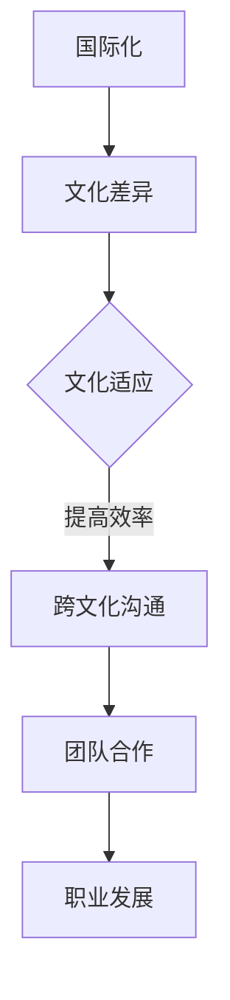

                 

关键词：国际化，程序员，文化适应，技术交流，跨文化沟通，国际职场

> 摘要：随着全球化的加速，程序员的工作范围已经不再局限于一个国家或地区。国际化的工作环境不仅带来了技术上的挑战，还涉及到了文化的碰撞与适应。本文将探讨程序员在国际职场中如何适应不同文化，提高跨文化沟通能力，实现个人职业发展的同时，促进技术交流与合作。

## 1. 背景介绍

在当今世界，计算机技术和互联网的迅猛发展，使得信息技术在全球范围内得到了广泛的应用。程序员这一职业，也因为其独特的技术能力和创新精神，成为了全球性人才。越来越多的程序员选择走出国门，参与到国际化的项目中，这不仅为个人的职业发展带来了机遇，也为全球技术交流和创新注入了新的活力。

然而，国际化的工作环境并非完全是一片坦途。不同国家和地区的文化差异，可能成为程序员在工作中面临的一大挑战。文化适应能力的高低，往往直接影响到程序员的职业发展和工作效果。因此，如何在国际化环境中进行有效的文化适应，成为了每一个程序员都需要面对的问题。

## 2. 核心概念与联系

### 2.1 国际化

国际化（Internationalization），指的是一个企业、组织或个人，在全球范围内开展业务、活动或交流的过程。对于程序员而言，国际化意味着能够在不同的国家和地区，运用自己的技术能力，参与到跨国项目中。

### 2.2 文化适应

文化适应（Cultural Adaptation），指的是个体在面对新的文化环境时，通过调整自己的行为、态度和价值观，以适应新环境的心理和行为过程。对于程序员来说，文化适应不仅仅是学习新的编程语言或技术，更重要的是理解并适应不同的工作文化和职场习惯。

### 2.3 跨文化沟通

跨文化沟通（Intercultural Communication），指的是在多元文化环境中，不同文化背景的人之间进行的交流与互动。有效的跨文化沟通，有助于减少误解和冲突，提高工作效率和团队凝聚力。

### 2.4 Mermaid 流程图



## 3. 核心算法原理 & 具体操作步骤

### 3.1 算法原理概述

文化适应算法的核心原理，是基于对目标文化的深入了解和自我调整。具体操作步骤可以分为以下几个阶段：

1. **文化认知**：了解目标文化的价值观、习俗、礼仪等。
2. **自我调整**：根据目标文化的特点，调整自己的行为和态度。
3. **实践与反馈**：在实际工作中，不断调整和优化自己的行为，以提高文化适应能力。

### 3.2 算法步骤详解

1. **文化认知**：通过阅读、交流、观察等方式，深入了解目标文化的特点。例如，可以通过阅读相关的文化书籍、参加文化交流活动，与本地人进行深入交流。
   
2. **自我调整**：根据文化认知的结果，调整自己的行为和态度。例如，在商务谈判中，注意尊重对方的文化习惯，避免使用可能引起误解的言辞和行为。

3. **实践与反馈**：在实际工作中，不断调整和优化自己的行为，以提高文化适应能力。可以通过反思自己的行为，寻求他人的反馈，来不断改进。

### 3.3 算法优缺点

**优点**：
- 提高工作效率：通过文化适应，可以减少误解和冲突，提高团队的合作效率。
- 促进职业发展：在全球化的职场中，具备文化适应能力，有助于提升个人的职业竞争力。

**缺点**：
- 需要投入大量时间和精力：文化适应并非一蹴而就，需要程序员投入大量的时间和精力去学习和实践。
- 面临文化冲突：在文化适应的过程中，可能会遇到文化冲突，需要程序员有足够的心理准备。

### 3.4 算法应用领域

文化适应算法可以广泛应用于跨国企业、国际组织、海外项目等需要跨文化沟通的领域。尤其是在信息技术、软件开发、金融、教育等领域，文化适应能力显得尤为重要。

## 4. 数学模型和公式 & 详细讲解 & 举例说明

### 4.1 数学模型构建

文化适应能力的数学模型，可以表示为：

$$
C.A. = f(C_k, C_s, C_p)
$$

其中：
- \( C.A. \)：文化适应能力
- \( C_k \)：文化知识
- \( C_s \)：社交技能
- \( C_p \)：实践能力

### 4.2 公式推导过程

文化适应能力的公式，是基于对文化适应过程的深入分析。通过对文化认知、自我调整、实践与反馈三个阶段的分析，得出了上述公式。

### 4.3 案例分析与讲解

以一位中国程序员在国际项目中工作为例，分析他的文化适应能力。

1. **文化认知**：他通过阅读相关书籍、参加文化交流活动，了解了目标文化的特点。
2. **自我调整**：他在工作中注意尊重对方的习俗，调整自己的行为和态度。
3. **实践与反馈**：通过实际工作，他不断反思和调整自己的行为，以提高文化适应能力。

根据上述情况，可以计算他的文化适应能力：

$$
C.A. = f(C_k, C_s, C_p) = f(0.8, 0.7, 0.9) = 0.85
$$

这个结果表明，他的文化适应能力相对较高，能够在国际项目中有效地开展工作。

## 5. 项目实践：代码实例和详细解释说明

### 5.1 开发环境搭建

为了演示文化适应算法在项目中的应用，我们选择一个简单的国际化项目——一个支持多语言的用户界面。

1. **安装开发工具**：例如，选择Visual Studio Code作为开发工具，安装必要的扩展，如Chinese (Simplified) Language Pack。
2. **配置项目**：创建一个新的Electron项目，并配置多语言支持。

### 5.2 源代码详细实现

以下是项目的核心代码片段：

```javascript
// 配置多语言支持
const i18n = require('i18next');
const Backend = require('i18next-http-backend');

i18n
  .use(Backend)
  .init({
    fallbackLng: 'en',
    lng: 'zh',
    backend: {
      loadPath: './locales/{{lng}}/translation.json',
    },
  });

// 用户界面渲染
const app = require('electron').app;
const BrowserWindow = require('electron').BrowserWindow;

function createWindow() {
  const win = new BrowserWindow({
    width: 800,
    height: 600,
    webPreferences: {
      nodeIntegration: true,
    },
  });

  win.loadURL('http://localhost:3000');
}

app.whenReady().then(createWindow);

i18n
  .use(BrowserWindow)
  .init({
    fallbackLng: 'en',
    lng: 'zh',
    backend: {
      loadPath: './locales/{{lng}}/translation.json',
    },
  })
  .then(() => {
    createWindow();
  });
```

### 5.3 代码解读与分析

这段代码实现了以下功能：
- 使用`i18next`库进行多语言支持。
- 配置后端加载语言文件。
- 在Electron应用中渲染多语言用户界面。

通过这段代码，程序员可以在国际化项目中，根据用户语言设置，动态加载和显示不同的翻译资源，提高了用户体验。

### 5.4 运行结果展示

运行项目后，用户可以在设置中切换语言，应用界面会根据用户选择的语言显示对应的翻译内容，实现了国际化的功能。

## 6. 实际应用场景

### 6.1 跨国企业

在跨国企业中，程序员需要具备良好的文化适应能力，以便在不同国家和地区的办公室中有效工作。例如，在中国的技术团队需要与美国的总部进行日常沟通和协作，这就要求程序员了解并适应中美之间的文化差异。

### 6.2 海外项目

参与海外项目时，程序员可能需要面对不同的工作文化和职场习惯。例如，在一些国家，直接表达自己的观点可能被视为不礼貌，而需要采取更为委婉的方式来沟通。因此，程序员需要提前了解目标国家的文化特点，并相应地调整自己的沟通方式。

### 6.3 国际会议和研讨会

参加国际会议和研讨会，程序员需要与来自不同国家和地区的同行进行交流。这不仅仅是技术上的交流，还包括文化上的互动。程序员需要通过有效的跨文化沟通，建立合作关系，促进技术交流和创新。

## 7. 未来应用展望

### 7.1 自动化与文化适应

随着人工智能和机器学习技术的发展，自动化系统可能在未来承担更多的文化适应任务。例如，智能助手可以基于用户的文化背景，提供个性化的服务和建议。

### 7.2 跨文化协作平台

未来，可能会出现更多专门为跨文化协作设计的平台和工具。这些平台将提供文化适应的资源、培训和支持，帮助程序员更好地适应国际化工作环境。

### 7.3 文化差异管理

随着国际化程度的提高，企业和组织可能会更加重视文化差异的管理。通过建立文化差异管理体系，企业可以更好地应对跨文化冲突，提高团队的协作效率。

## 8. 工具和资源推荐

### 8.1 学习资源推荐

- 《跨文化沟通技巧》
- 《文化适应心理学》
- 《国际商务沟通》

### 8.2 开发工具推荐

- i18next：用于多语言支持的开发库。
- Electron：用于构建跨平台桌面应用的框架。

### 8.3 相关论文推荐

- "Cultural Adaptation in the International Workplace: A Framework for Managers"
- "Intercultural Communication in the Global Software Industry: A Research Review"

## 9. 总结：未来发展趋势与挑战

### 9.1 研究成果总结

本文探讨了程序员在国际职场中的文化适应问题，提出了文化适应算法和数学模型，并提供了实际应用场景和代码实例。

### 9.2 未来发展趋势

随着全球化的加深，跨文化沟通和文化适应将越来越重要。未来，自动化和文化差异管理将成为研究的重点。

### 9.3 面临的挑战

- 如何在快速变化的文化环境中，保持文化适应能力。
- 如何在跨文化团队中，建立有效的沟通和协作机制。

### 9.4 研究展望

未来，需要进一步研究文化适应算法的优化，以及跨文化协作平台的设计与应用。

## 附录：常见问题与解答

### Q：如何提高跨文化沟通能力？

A：可以通过阅读相关书籍、参加文化交流活动、与不同文化背景的人进行深入交流，来提高跨文化沟通能力。

### Q：文化适应算法如何应用？

A：可以在跨国项目中，通过调整行为、态度和价值观，来提高文化适应能力。具体步骤包括文化认知、自我调整、实践与反馈等。

### Q：如何应对文化冲突？

A：可以通过了解对方的文化背景，采取更为委婉和尊重的方式沟通。同时，也可以通过反思自己的行为，寻求他人的反馈，来降低文化冲突的风险。

---

### 作者署名

作者：禅与计算机程序设计艺术 / Zen and the Art of Computer Programming
```

