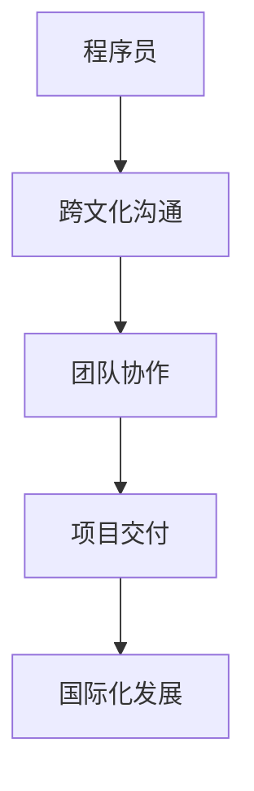
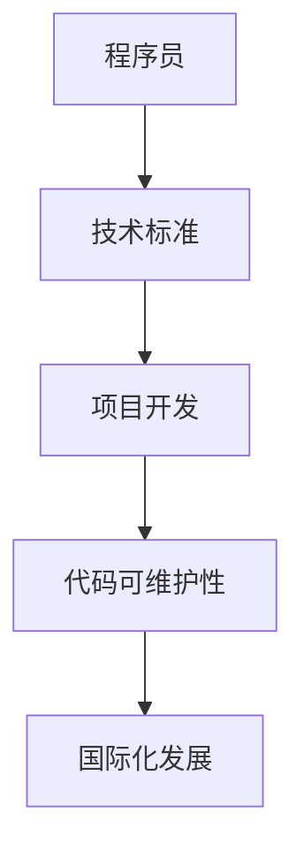
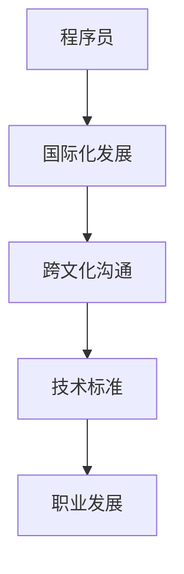

                 

### 关键词 Keywords
- 国际化发展
- 程序员
- 跨文化沟通
- 技术标准
- 职业发展

### 摘要 Abstract
本文旨在探讨程序员的国际化发展所面临的机遇与挑战。随着全球化的加速，程序员不再局限于本地市场，他们有机会参与到跨国项目和国际团队中，但这同时也带来了跨文化沟通、技术标准适应等新挑战。本文将分析国际化发展的优势，以及如何克服语言、文化和职业发展的障碍，为程序员提供职业规划的参考。

## 1. 背景介绍

### 全球化趋势

全球化已经成为不可逆转的趋势，它不仅改变了我们的生活方式，也深刻影响了各行各业。在信息技术领域，全球化尤为显著。互联网的普及使人们可以轻松地跨越地理障碍进行沟通和协作，各种在线平台和社交媒体的兴起也为程序员提供了更多的国际交流机会。

### 程序员角色的变化

程序员的角色在全球化的背景下发生了显著变化。过去，程序员往往在一个相对封闭的环境中工作，主要服务于本地市场。而今天，许多程序员需要具备国际化视野，能够在跨文化团队中高效工作，应对不同国家和地区的市场需求。这不仅要求程序员拥有扎实的技术能力，还需要他们具备跨文化沟通能力和适应不同工作环境的能力。

### 国际化发展的意义

国际化发展对程序员个人和整个行业都具有深远的意义。对个人而言，国际化发展提供了更多的职业机会和更高的薪酬待遇。对于整个行业，国际化促进了技术的交流和创新，推动了整个行业的发展。

## 2. 核心概念与联系

### 跨文化沟通

#### 定义
跨文化沟通是指在跨越不同文化背景的个体或团队之间进行的交流过程。这种沟通不仅涉及语言障碍，还包括价值观、行为习惯、文化规范等方面的差异。

#### 关系图



### 技术标准

#### 定义
技术标准是某个技术领域为了实现一致性、兼容性和互操作性而制定的一系列规范。这些规范包括编程语言、框架、工具和平台等。

#### 关系图



### 职业发展

#### 定义
职业发展是指个人在职业生涯中的成长和进步，包括技能提升、职位晋升和薪酬增加等。

#### 关系图



## 3. 核心算法原理 & 具体操作步骤

### 3.1 算法原理概述

国际化发展的核心算法可以看作是一个跨文化沟通和适应机制的集成。这个算法的原理在于通过以下步骤实现：

1. **文化敏感性分析**：识别和理解不同文化背景下的行为和沟通模式。
2. **语言能力提升**：掌握多种语言，特别是目标市场的语言。
3. **技术标准适应**：学习和应用不同地区的技术标准。
4. **职业规划**：根据国际化发展的目标，制定具体的职业发展计划。

### 3.2 算法步骤详解

1. **文化敏感性分析**
   - 收集和分析目标市场的文化数据。
   - 通过实地调研或在线资料了解文化差异。

2. **语言能力提升**
   - 学习目标市场的官方语言。
   - 通过语言课程、在线学习平台或与当地居民交流提升语言能力。

3. **技术标准适应**
   - 研究并掌握目标市场的技术标准。
   - 参与相关技术社区的讨论和活动。

4. **职业规划**
   - 设定国际化发展的具体目标。
   - 制定职业发展路径，包括短期和长期目标。

### 3.3 算法优缺点

#### 优点

- 提高跨文化沟通效率。
- 增加职业机会和薪酬待遇。
- 促进技术的全球传播和创新。

#### 缺点

- 语言和文化适应需要时间和精力。
- 需要具备较高的自我驱动力和适应能力。

### 3.4 算法应用领域

- 跨国企业
- 国际化软件开发
- 全球性技术社区

## 4. 数学模型和公式 & 详细讲解 & 举例说明

### 4.1 数学模型构建

国际化发展的数学模型可以看作是一个综合评价系统。这个系统通过以下公式计算程序员的国际化发展水平：

$$
I.D. = w_1 \cdot L + w_2 \cdot C + w_3 \cdot T + w_4 \cdot P
$$

其中，$I.D.$ 表示国际化发展水平，$w_1, w_2, w_3, w_4$ 分别表示语言能力、文化适应性、技术标准和职业规划的重要性权重，$L, C, T, P$ 分别表示语言能力得分、文化适应性得分、技术标准得分和职业规划得分。

### 4.2 公式推导过程

国际化发展水平的计算公式可以通过以下步骤推导得出：

1. **确定评价因素**：根据国际化发展的核心要素，确定评价因素。
2. **设定权重**：根据专家意见和实际情况，设定各因素的重要性权重。
3. **计算得分**：根据具体评分标准，计算各因素的得分。
4. **综合评价**：将各因素得分加权求和，得到国际化发展水平。

### 4.3 案例分析与讲解

假设一个程序员在国际化发展的数学模型中各项得分如下：

- 语言能力：90分
- 文化适应性：85分
- 技术标准：80分
- 职业规划：75分

如果设定权重分别为 $w_1 = 0.3, w_2 = 0.25, w_3 = 0.25, w_4 = 0.2$，则该程序员的国际化发展水平为：

$$
I.D. = 0.3 \cdot 90 + 0.25 \cdot 85 + 0.25 \cdot 80 + 0.2 \cdot 75 = 81.25
$$

这个得分表明该程序员在国际化发展方面具备较高的水平。

## 5. 项目实践：代码实例和详细解释说明

### 5.1 开发环境搭建

为了实践国际化发展的算法，我们需要搭建一个支持多种语言的开发环境。以下是一个简单的开发环境搭建步骤：

1. 安装代码编辑器（如Visual Studio Code）。
2. 安装Node.js（用于构建跨平台应用）。
3. 安装Python（用于数据分析）。
4. 安装Git（用于版本控制）。

### 5.2 源代码详细实现

以下是一个简单的国际化项目示例，使用Python编写：

```python
#国际化项目示例

def greet(language):
    if language == "en":
        return "Hello!"
    elif language == "es":
        return "¡Hola!"
    elif language == "fr":
        return "Bonjour!"
    else:
        return "未知语言"

# 测试
print(greet("en"))
print(greet("es"))
print(greet("fr"))
```

### 5.3 代码解读与分析

这个示例程序实现了一个简单的国际化问候功能。通过定义一个`greet`函数，根据输入的语言参数返回相应的问候语。这个功能适用于不同语言的用户，是一个实现国际化的重要步骤。

### 5.4 运行结果展示

运行上述代码，输出结果如下：

```
Hello!
¡Hola!
Bonjour!
```

这表明程序可以正确处理不同语言的输入，实现了基本的国际化功能。

## 6. 实际应用场景

### 6.1 国际化软件开发

国际化软件开发是程序员国际化发展的一个重要领域。随着全球市场的不断扩大，越来越多的软件需要支持多种语言和文化。程序员可以通过参与国际化软件开发项目，提升自己的跨文化沟通能力和技术标准适应能力。

### 6.2 跨国企业

跨国企业通常需要大量的国际程序员来支持其全球业务。程序员在跨国企业中可以通过与不同文化背景的同事合作，提升自己的跨文化沟通能力和团队协作能力。

### 6.3 国际会议和研讨会

参加国际会议和研讨会是程序员拓展国际视野和建立国际人脉的重要途径。在这些活动中，程序员可以了解最新的技术趋势和研究成果，与全球同行交流经验。

## 7. 未来应用展望

### 7.1 自动化翻译工具

随着人工智能技术的发展，自动化翻译工具将越来越普及。程序员可以通过开发和使用这些工具，提高跨文化沟通的效率。

### 7.2 跨文化培训课程

为了更好地适应国际化发展，跨文化培训课程将成为程序员的重要学习资源。这些课程将帮助程序员了解不同文化背景下的行为和沟通模式。

### 7.3 多元化团队管理

随着国际化发展的推进，多元化团队管理将成为企业领导者的重要课题。程序员可以通过参与团队管理工作，提升自己的领导力和管理能力。

## 8. 工具和资源推荐

### 8.1 学习资源推荐

- Coursera：提供各种国际化课程。
- edX：提供免费的在线课程。
- Codecademy：提供编程语言学习资源。

### 8.2 开发工具推荐

- IntelliJ IDEA：支持多种编程语言。
- Visual Studio Code：功能强大的代码编辑器。
- Git：版本控制系统。

### 8.3 相关论文推荐

- "Cultural Adaptation in International Teams" by Richard D. D'Ziria
- "Cross-cultural Communication in Software Development" by Angela P. Brook

## 9. 总结：未来发展趋势与挑战

### 9.1 研究成果总结

本文探讨了程序员的国际化发展所面临的机遇与挑战，分析了跨文化沟通、技术标准适应和职业发展等方面的核心概念和算法原理。

### 9.2 未来发展趋势

未来，国际化发展将继续成为程序员职业发展的重要方向。随着技术的进步和全球化的深入，程序员将在跨国项目和全球团队中发挥更大的作用。

### 9.3 面临的挑战

程序员在国际化发展中将面临语言、文化和职业发展的挑战。为了克服这些挑战，程序员需要不断提升自己的跨文化沟通能力和技术标准适应能力。

### 9.4 研究展望

未来的研究可以进一步探索自动化翻译工具在国际化发展中的应用，以及跨文化团队管理的最佳实践。此外，研究国际化发展的数学模型和算法也将是重要的研究方向。

## 10. 附录：常见问题与解答

### 10.1 如何提高跨文化沟通能力？

**解答**：可以通过参加跨文化培训课程、阅读相关书籍和与不同文化背景的人交流来提高跨文化沟通能力。

### 10.2 如何适应不同地区的技术标准？

**解答**：可以通过学习相关技术标准和参与技术社区的讨论来适应不同地区的技术标准。

### 10.3 国际化发展的核心算法有哪些？

**解答**：国际化发展的核心算法包括文化敏感性分析、语言能力提升、技术标准适应和职业规划等步骤。

---

作者：禅与计算机程序设计艺术 / Zen and the Art of Computer Programming
----------------------------------------------------------------

## 11. 致谢

在此，我要感谢所有为本文提供支持和帮助的人。特别感谢我的家人和朋友，他们的鼓励和理解让我能够专注于写作。同时，感谢所有在我的职业生涯中给予我指导和建议的导师和同行。没有你们，我不可能走到今天。最后，感谢读者的耐心阅读，期待与您在未来的交流中共同进步。

