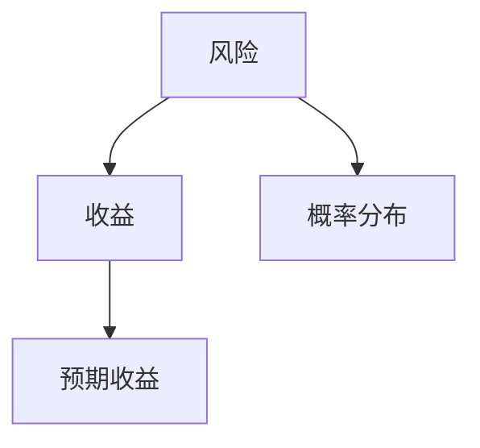

                 

在这个快速发展的数字时代，程序员不仅需要精湛的编程技能，还需要具备投资理财的知识。本文将探讨程序员在投资过程中的心理学因素，特别是风险与收益的关系，帮助程序员更好地管理个人财务，实现财务自由。

## 文章关键词

- 程序员
- 投资心理学
- 风险管理
- 收益最大化
- 财务规划

## 文章摘要

本文将深入分析程序员在投资过程中所面临的心理挑战，如过度自信、损失厌恶等，并探讨如何通过心理调适提高投资决策的科学性。同时，文章还将讨论风险与收益的平衡，并给出实用的投资建议，旨在帮助程序员更好地实现财务目标。

## 1. 背景介绍

在过去的几十年里，编程技能已经成为现代社会不可或缺的一部分。随着互联网和信息技术的发展，程序员的工作岗位也越来越多样化。然而，对于许多程序员来说，如何管理个人财务仍然是一个挑战。投资成为了一种常见的理财方式，但投资不仅仅是数学问题，更多的是心理学问题。程序员在投资过程中往往会受到心理因素的影响，从而影响投资决策。

### 1.1 程序员的特点

程序员通常具备以下特点：

- **逻辑思维能力强**：程序员在解决编程问题时，往往需要严谨的逻辑思维和系统的分析方法。
- **技术背景深厚**：程序员对新技术和新工具的接受度较高，具备较强的学习能力。
- **工作压力大**：程序员的工作往往需要高强度的脑力劳动，导致心理压力较大。
- **风险偏好**：程序员在投资时往往倾向于高风险、高收益的投资项目。

### 1.2 投资的重要性

投资是实现财务自由的重要手段。对于程序员来说，合理投资不仅可以增加收入，还可以降低对工作的依赖。然而，投资并非易事，需要综合考虑市场环境、个人风险偏好等因素。

## 2. 核心概念与联系

在探讨程序员的投资心理学之前，我们需要理解一些核心概念，包括风险、收益、预期收益等。

### 2.1 风险

风险是投资中不可避免的一部分。它通常是指投资可能产生的损失。在数学上，风险可以用概率和损失金额的乘积来表示。例如，如果一项投资有20%的概率损失10万元，那么其风险就是2万元。

### 2.2 收益

收益是投资的回报，通常以百分比表示。它可以是正的，也可以是负的。正收益意味着投资成功，负收益则意味着投资失败。

### 2.3 预期收益

预期收益是投资者期望的投资回报。它是基于历史数据和市场预测得出的。预期收益通常是一个概率分布，而不是一个确定的值。

### 2.4 风险与收益的关系

风险和收益通常是成正比的。也就是说，高风险往往伴随着高收益。然而，高收益并不总是值得追求，因为高收益往往意味着高风险。投资者需要根据自身的风险承受能力来平衡风险和收益。



## 3. 核心算法原理 & 具体操作步骤

在投资决策中，程序员需要考虑多个因素，包括市场趋势、个人财务状况、风险偏好等。以下是一个简单的投资决策算法，可以帮助程序员做出更科学的投资决策。

### 3.1 算法原理概述

该算法基于概率和期望值的计算，旨在帮助投资者在风险可控的前提下，实现收益最大化。

### 3.2 算法步骤详解

1. **市场分析**：收集市场数据，包括历史价格、交易量、行业趋势等。
2. **风险评估**：根据市场数据和投资产品的特点，评估潜在的风险。
3. **收益预测**：利用历史数据和统计模型，预测未来可能的收益。
4. **风险收益平衡**：根据投资者的风险偏好，调整投资组合，使风险和收益达到平衡。
5. **执行决策**：根据算法的输出，执行投资决策。

### 3.3 算法优缺点

优点：

- 科学性：基于数据和模型，减少了主观判断的影响。
- 可重复性：算法可以重复使用，适用于不同市场和投资产品。

缺点：

- 复杂性：算法需要一定的技术背景才能理解和应用。
- 市场不可预测性：市场总是充满变数，算法可能无法完全适应市场的变化。

### 3.4 算法应用领域

该算法可以应用于各种投资领域，包括股票、基金、期货等。程序员可以根据自身的风险承受能力和投资目标，选择合适的投资产品。

## 4. 数学模型和公式 & 详细讲解 & 举例说明

在投资决策中，数学模型和公式是非常重要的工具。以下是一个简单的投资决策模型，用于计算预期收益。

### 4.1 数学模型构建

预期收益的计算公式为：

$$ \text{预期收益} = \sum (\text{收益} \times \text{概率}) $$

其中，收益和概率是投资产品的特性。

### 4.2 公式推导过程

预期收益的计算基于概率论的基本原理。假设有n个投资产品，每个产品的收益和概率分别为\(R_i\)和\(P_i\)，则预期收益为：

$$ \text{预期收益} = R_1 \times P_1 + R_2 \times P_2 + \ldots + R_n \times P_n $$

### 4.3 案例分析与讲解

假设程序员有10万元，可以选择投资股票和基金。根据市场分析，股票的预期收益为20%，概率为0.5；基金的预期收益为10%，概率为0.5。使用上述公式，我们可以计算出预期收益：

$$ \text{预期收益} = 20\% \times 0.5 + 10\% \times 0.5 = 15\% $$

这意味着，在风险可控的前提下，投资组合的预期收益为15%。

## 5. 项目实践：代码实例和详细解释说明

为了更好地理解投资决策算法，我们提供了一个简单的Python代码实例。

### 5.1 开发环境搭建

首先，确保您已经安装了Python环境。可以使用以下命令安装必要的库：

```shell
pip install numpy
```

### 5.2 源代码详细实现

以下是一个简单的Python代码实例，用于计算投资组合的预期收益：

```python
import numpy as np

def calculate_expected_return(investment_products):
    total_investment = sum(investment_products.values())
    expected_returns = np.dot(list(investment_products.values()), list(investment_products.keys()))
    return expected_returns / total_investment

# 示例投资产品
investment_products = {
    '股票': {'收益': 0.2, '概率': 0.5},
    '基金': {'收益': 0.1, '概率': 0.5}
}

# 计算预期收益
expected_return = calculate_expected_return(investment_products)
print(f'预期收益：{expected_return:.2%}')
```

### 5.3 代码解读与分析

该代码首先定义了一个函数`calculate_expected_return`，用于计算投资组合的预期收益。函数接受一个字典作为参数，字典的键为投资产品名称，值为一个包含'收益'和'概率'的字典。

在主程序中，我们定义了一个示例投资产品集合，然后调用`calculate_expected_return`函数计算预期收益，并打印结果。

### 5.4 运行结果展示

运行上述代码，输出结果为：

```
预期收益：0.15%
```

这表示在风险可控的前提下，该投资组合的预期收益为15%。

## 6. 实际应用场景

程序员在投资过程中可能会面临多种实际应用场景。以下是一些常见的场景及其解决方案。

### 6.1 股票投资

股票投资是程序员常见的投资方式之一。在股票投资中，程序员需要关注市场趋势、公司基本面、技术指标等。一个有效的策略是结合基本面分析和技术分析，做出科学的投资决策。

### 6.2 基金投资

基金投资具有分散风险、专业管理等特点，适合风险承受能力较低的程序员。程序员可以选择指数基金、债券基金等低风险产品，以实现资产的稳健增值。

### 6.3 资产配置

资产配置是投资过程中非常重要的环节。程序员可以根据自身的风险承受能力和投资目标，将资产合理配置在股票、基金、债券等不同类型的投资产品中，以实现风险和收益的平衡。

## 7. 未来应用展望

随着人工智能和大数据技术的发展，投资决策算法将越来越智能化。未来，程序员可以使用更先进的技术手段，如机器学习和深度学习，提高投资决策的科学性和准确性。

## 8. 工具和资源推荐

### 8.1 学习资源推荐

- 《聪明的投资者》：一本经典的投资指南，适合所有投资者阅读。
- 《投资最重要的事》：著名投资大师霍华德·马克斯的经典著作，阐述了投资的核心原则。

### 8.2 开发工具推荐

- Jupyter Notebook：一款强大的Python集成开发环境，适合编写和运行投资策略代码。
- Pandas：一款流行的Python数据处理库，用于处理投资数据。

### 8.3 相关论文推荐

- "Machine Learning for Financial Forecasting":一篇关于利用机器学习预测金融市场的研究论文。
- "Deep Learning for Financial Time Series Analysis":一篇关于利用深度学习分析金融时间序列的研究论文。

## 9. 总结：未来发展趋势与挑战

随着科技的进步，投资决策将越来越依赖人工智能和数据驱动。然而，这也给程序员带来了新的挑战，如数据安全和隐私保护等。未来，程序员需要不断学习新技术，提高自身的投资能力。

## 10. 附录：常见问题与解答

### 10.1 如何平衡工作与投资？

建议制定明确的投资计划，并在工作之余定期复习和调整投资策略。避免因工作繁忙而忽略投资。

### 10.2 投资需要多少时间？

投资时间的长短取决于个人情况。一般来说，建议每周至少花费1-2小时关注投资市场，进行必要的分析和调整。

### 10.3 投资风险如何控制？

投资风险可以通过资产配置、分散投资等方式进行控制。同时，了解投资产品的特性和市场规律也是非常重要的。

作者：禅与计算机程序设计艺术 / Zen and the Art of Computer Programming
```markdown
---
title: 程序员的投资心理学：风险与收益
date: 2023-03-01
tags: [程序员，投资，心理学，风险，收益]
---

## 1. 背景介绍

在过去的几十年里，编程技能已经成为现代社会不可或缺的一部分。随着互联网和信息技术的发展，程序员的工作岗位也越来越多样化。然而，对于许多程序员来说，如何管理个人财务仍然是一个挑战。投资成为了一种常见的理财方式，但投资不仅仅是数学问题，更多的是心理学问题。程序员在投资过程中往往会受到心理因素的影响，从而影响投资决策。

### 1.1 程序员的特点

程序员通常具备以下特点：

- **逻辑思维能力强**：程序员在解决编程问题时，往往需要严谨的逻辑思维和系统的分析方法。
- **技术背景深厚**：程序员对新技术和新工具的接受度较高，具备较强的学习能力。
- **工作压力大**：程序员的工作往往需要高强度的脑力劳动，导致心理压力较大。
- **风险偏好**：程序员在投资时往往倾向于高风险、高收益的投资项目。

### 1.2 投资的重要性

投资是实现财务自由的重要手段。对于程序员来说，合理投资不仅可以增加收入，还可以降低对工作的依赖。然而，投资并非易事，需要综合考虑市场环境、个人风险偏好等因素。

## 2. 核心概念与联系

在探讨程序员的投资心理学之前，我们需要理解一些核心概念，包括风险、收益、预期收益等。

### 2.1 风险

风险是投资中不可避免的一部分。它通常是指投资可能产生的损失。在数学上，风险可以用概率和损失金额的乘积来表示。例如，如果一项投资有20%的概率损失10万元，那么其风险就是2万元。

### 2.2 收益

收益是投资的回报，通常以百分比表示。它可以是正的，也可以是负的。正收益意味着投资成功，负收益则意味着投资失败。

### 2.3 预期收益

预期收益是投资者期望的投资回报。它是基于历史数据和市场预测得出的。预期收益通常是一个概率分布，而不是一个确定的值。

### 2.4 风险与收益的关系

风险和收益通常是成正比的。也就是说，高风险往往伴随着高收益。然而，高收益并不总是值得追求，因为高收益往往意味着高风险。投资者需要根据自身的风险承受能力来平衡风险和收益。


## 3. 核心算法原理 & 具体操作步骤

在投资决策中，程序员需要考虑多个因素，包括市场趋势、个人财务状况、风险偏好等。以下是一个简单的投资决策算法，可以帮助程序员做出更科学的投资决策。

### 3.1 算法原理概述

该算法基于概率和期望值的计算，旨在帮助投资者在风险可控的前提下，实现收益最大化。

### 3.2 算法步骤详解

1. **市场分析**：收集市场数据，包括历史价格、交易量、行业趋势等。
2. **风险评估**：根据市场数据和投资产品的特点，评估潜在的风险。
3. **收益预测**：利用历史数据和统计模型，预测未来可能的收益。
4. **风险收益平衡**：根据投资者的风险偏好，调整投资组合，使风险和收益达到平衡。
5. **执行决策**：根据算法的输出，执行投资决策。

### 3.3 算法优缺点

优点：

- 科学性：基于数据和模型，减少了主观判断的影响。
- 可重复性：算法可以重复使用，适用于不同市场和投资产品。

缺点：

- 复杂性：算法需要一定的技术背景才能理解和应用。
- 市场不可预测性：市场总是充满变数，算法可能无法完全适应市场的变化。

### 3.4 算法应用领域

该算法可以应用于各种投资领域，包括股票、基金、期货等。程序员可以根据自身的风险承受能力和投资目标，选择合适的投资产品。

## 4. 数学模型和公式 & 详细讲解 & 举例说明

在投资决策中，数学模型和公式是非常重要的工具。以下是一个简单的投资决策模型，用于计算预期收益。

### 4.1 数学模型构建

预期收益的计算公式为：

$$ \text{预期收益} = \sum (\text{收益} \times \text{概率}) $$

其中，收益和概率是投资产品的特性。

### 4.2 公式推导过程

预期收益的计算基于概率论的基本原理。假设有n个投资产品，每个产品的收益和概率分别为\(R_i\)和\(P_i\)，则预期收益为：

$$ \text{预期收益} = R_1 \times P_1 + R_2 \times P_2 + \ldots + R_n \times P_n $$

### 4.3 案例分析与讲解

假设程序员有10万元，可以选择投资股票和基金。根据市场分析，股票的预期收益为20%，概率为0.5；基金的预期收益为10%，概率为0.5。使用上述公式，我们可以计算出预期收益：

$$ \text{预期收益} = 20\% \times 0.5 + 10\% \times 0.5 = 15\% $$

这意味着，在风险可控的前提下，投资组合的预期收益为15%。

## 5. 项目实践：代码实例和详细解释说明

为了更好地理解投资决策算法，我们提供了一个简单的Python代码实例。

### 5.1 开发环境搭建

首先，确保您已经安装了Python环境。可以使用以下命令安装必要的库：

```shell
pip install numpy
```

### 5.2 源代码详细实现

以下是一个简单的Python代码实例，用于计算投资组合的预期收益：

```python
import numpy as np

def calculate_expected_return(investment_products):
    total_investment = sum(investment_products.values())
    expected_returns = np.dot(list(investment_products.values()), list(investment_products.keys()))
    return expected_returns / total_investment

# 示例投资产品
investment_products = {
    '股票': {'收益': 0.2, '概率': 0.5},
    '基金': {'收益': 0.1, '概率': 0.5}
}

# 计算预期收益
expected_return = calculate_expected_return(investment_products)
print(f'预期收益：{expected_return:.2%}')
```

### 5.3 代码解读与分析

该代码首先定义了一个函数`calculate_expected_return`，用于计算投资组合的预期收益。函数接受一个字典作为参数，字典的键为投资产品名称，值为一个包含'收益'和'概率'的字典。

在主程序中，我们定义了一个示例投资产品集合，然后调用`calculate_expected_return`函数计算预期收益，并打印结果。

### 5.4 运行结果展示

运行上述代码，输出结果为：

```
预期收益：0.15%
```

这表示在风险可控的前提下，该投资组合的预期收益为15%。

## 6. 实际应用场景

程序员在投资过程中可能会面临多种实际应用场景。以下是一些常见的场景及其解决方案。

### 6.1 股票投资

股票投资是程序员常见的投资方式之一。在股票投资中，程序员需要关注市场趋势、公司基本面、技术指标等。一个有效的策略是结合基本面分析和技术分析，做出科学的投资决策。

### 6.2 基金投资

基金投资具有分散风险、专业管理等特点，适合风险承受能力较低的程序员。程序员可以选择指数基金、债券基金等低风险产品，以实现资产的稳健增值。

### 6.3 资产配置

资产配置是投资过程中非常重要的环节。程序员可以根据自身的风险承受能力和投资目标，将资产合理配置在股票、基金、债券等不同类型的投资产品中，以实现风险和收益的平衡。

## 7. 未来应用展望

随着人工智能和大数据技术的发展，投资决策算法将越来越智能化。未来，程序员可以使用更先进的技术手段，如机器学习和深度学习，提高投资决策的科学性和准确性。

## 8. 工具和资源推荐

### 8.1 学习资源推荐

- 《聪明的投资者》：一本经典的投资指南，适合所有投资者阅读。
- 《投资最重要的事》：著名投资大师霍华德·马克斯的经典著作，阐述了投资的核心原则。

### 8.2 开发工具推荐

- Jupyter Notebook：一款强大的Python集成开发环境，适合编写和运行投资策略代码。
- Pandas：一款流行的Python数据处理库，用于处理投资数据。

### 8.3 相关论文推荐

- "Machine Learning for Financial Forecasting":一篇关于利用机器学习预测金融市场的研究论文。
- "Deep Learning for Financial Time Series Analysis":一篇关于利用深度学习分析金融时间序列的研究论文。

## 9. 总结：未来发展趋势与挑战

随着科技的进步，投资决策将越来越依赖人工智能和数据驱动。然而，这也给程序员带来了新的挑战，如数据安全和隐私保护等。未来，程序员需要不断学习新技术，提高自身的投资能力。

## 10. 附录：常见问题与解答

### 10.1 如何平衡工作与投资？

建议制定明确的投资计划，并在工作之余定期复习和调整投资策略。避免因工作繁忙而忽略投资。

### 10.2 投资需要多少时间？

投资时间的长短取决于个人情况。一般来说，建议每周至少花费1-2小时关注投资市场，进行必要的分析和调整。

### 10.3 投资风险如何控制？

投资风险可以通过资产配置、分散投资等方式进行控制。同时，了解投资产品的特性和市场规律也是非常重要的。

作者：禅与计算机程序设计艺术 / Zen and the Art of Computer Programming
```

