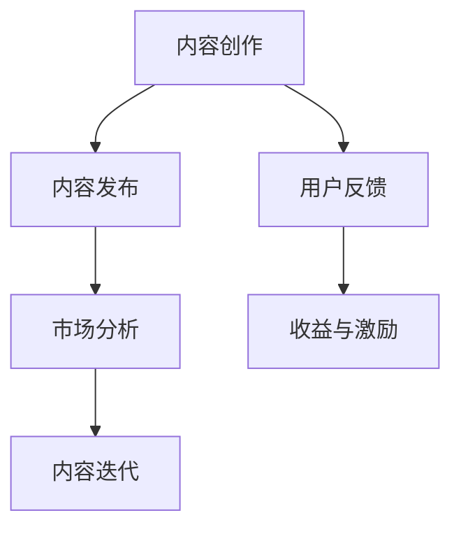

                 

关键词：知识付费、内容创作、工具、程序员、技术博客、算法、数学模型、项目实践、开发工具、未来展望

> 摘要：本文将深入探讨程序员如何利用现代工具和技术来创作高质量的知识付费内容，从算法原理、数学模型到实际项目实践，帮助程序员提升内容创作的能力和效率。

## 1. 背景介绍

随着互联网和知识经济的快速发展，知识付费已经成为一种重要的商业模式。程序员，作为技术领域的核心群体，他们在知识付费领域同样拥有巨大的潜力。然而，如何有效地创作和推广高质量的知识付费内容，成为许多程序员面临的挑战。

本文旨在为程序员提供一套完整的内容创作工具箱，包括核心概念、算法原理、数学模型、项目实践以及工具和资源的推荐，旨在帮助程序员高效地创作出有深度、有见解、有价值的内容，从而在知识付费领域中脱颖而出。

## 2. 核心概念与联系

### 2.1 知识付费内容创作的基本概念

知识付费内容创作，是指通过撰写、录制、发布等方式，将个人的知识、经验和技术技能转化为有价值的付费内容，提供给有需求的用户。这一过程涉及多个关键概念：

- **内容创作**：指从构思到发布的一系列过程，包括选题、写作、编辑、校对等。
- **知识体系**：指程序员所掌握的专业知识和技能，包括算法、数据结构、编程语言等。
- **用户体验**：指用户在消费知识付费内容时的体验，包括内容的质量、交互性、实用性等。
- **付费模式**：指用户如何为内容支付费用，包括一次性购买、订阅、按需付费等。

### 2.2 知识付费内容创作的核心联系

知识付费内容创作不是孤立的过程，它与多个环节紧密相连：

- **内容生产与市场分析**：在创作内容前，需要进行市场调研，分析用户需求和市场趋势，确保内容符合市场需求。
- **内容发布与推广**：创作完成后，需要通过合适的渠道发布内容，并进行有效的推广，以提高内容的曝光率和用户量。
- **用户反馈与迭代**：通过收集用户反馈，不断优化内容质量和用户体验，实现内容的持续迭代和提升。
- **收益与激励**：通过知识付费，程序员可以获得经济收益，同时也可以激发创作热情和动力。

### 2.3 Mermaid 流程图

以下是一个简单的Mermaid流程图，展示了知识付费内容创作的核心联系：



## 3. 核心算法原理 & 具体操作步骤

### 3.1 算法原理概述

在知识付费内容创作中，算法原理的应用至关重要。以下将介绍几种常用的算法原理：

- **自然语言处理（NLP）**：用于分析、理解和生成自然语言文本，帮助程序员撰写高质量的内容。
- **机器学习（ML）**：用于从数据中学习规律，优化内容创作过程，提高内容的相关性和实用性。
- **推荐系统（RS）**：根据用户行为和偏好，推荐合适的知识付费内容，提高用户满意度和留存率。

### 3.2 算法步骤详解

#### 3.2.1 自然语言处理（NLP）

1. **文本预处理**：包括分词、去停用词、词性标注等，为后续处理提供基础。
2. **语义分析**：通过词向量、语义角色标注等方法，理解文本的语义信息。
3. **文本生成**：利用序列生成模型（如生成对抗网络（GAN）、变分自编码器（VAE）等），生成符合语义的文本。

#### 3.2.2 机器学习（ML）

1. **特征工程**：提取文本、用户行为等特征，用于训练模型。
2. **模型训练**：选择合适的机器学习算法（如线性回归、决策树、深度学习等），训练模型。
3. **模型评估与优化**：通过交叉验证、A/B测试等方法，评估模型性能，并进行优化。

#### 3.2.3 推荐系统（RS）

1. **用户建模**：根据用户行为和偏好，构建用户画像。
2. **内容建模**：提取内容特征，构建内容画像。
3. **推荐算法**：选择合适的推荐算法（如协同过滤、基于内容的推荐等），生成推荐结果。

### 3.3 算法优缺点

- **自然语言处理（NLP）**：优点在于能够生成高质量、符合语义的文本，缺点是对文本质量要求较高，且训练过程复杂。
- **机器学习（ML）**：优点在于能够从数据中学习规律，提高内容创作效率，缺点是对数据质量要求较高，且模型解释性较差。
- **推荐系统（RS）**：优点在于能够根据用户偏好推荐内容，提高用户满意度和留存率，缺点是可能存在信息茧房和推荐偏差。

### 3.4 算法应用领域

- **内容创作**：利用NLP和ML算法，生成高质量的技术文章、教程、案例分析等。
- **内容推荐**：利用RS算法，为用户推荐符合其兴趣和需求的知识付费内容。
- **用户画像**：利用ML算法，分析用户行为和偏好，构建用户画像，用于个性化推荐和内容创作。

## 4. 数学模型和公式 & 详细讲解 & 举例说明

### 4.1 数学模型构建

在知识付费内容创作中，数学模型的应用至关重要。以下将介绍几种常用的数学模型：

- **概率模型**：用于描述不确定事件的发生概率，如贝叶斯定理、马尔可夫模型等。
- **优化模型**：用于求解最优化问题，如线性规划、动态规划等。
- **神经网络模型**：用于模拟人脑神经元之间的连接和激活机制，如多层感知器（MLP）、卷积神经网络（CNN）等。

### 4.2 公式推导过程

以下是一个简单的概率模型——二项分布的公式推导过程：

假设有一个试验，每次试验有两种结果（成功或失败），且每种结果发生的概率分别为$p$和$1-p$。现在进行$n$次独立试验，求恰好发生$k$次成功的概率。

设$X$为$n$次试验中成功的次数，则$X$服从二项分布$B(n, p)$。根据概率的定义，有：

$$P(X=k) = C_n^k p^k (1-p)^{n-k}$$

其中，$C_n^k$表示从$n$个元素中取$k$个元素的组合数，表示为：

$$C_n^k = \frac{n!}{k!(n-k)!}$$

### 4.3 案例分析与讲解

假设一个程序员在编写一个文档，他需要判断在100次独立试验中，成功次数大于等于60的概率。根据二项分布公式，可以计算出：

$$P(X \geq 60) = 1 - P(X < 60) = 1 - \sum_{k=0}^{59} C_{100}^k p^k (1-p)^{100-k}$$

其中，$p$为成功的概率，可以通过历史数据或专家经验来确定。假设$p=0.5$，则可以计算出：

$$P(X \geq 60) \approx 1 - 0.0175 = 0.9825$$

这意味着，在100次独立试验中，成功次数大于等于60的概率约为98.25%。

### 4.4 代码实例

以下是一个Python代码实例，用于计算二项分布的概率：

```python
from math import comb

def binomial_distribution(n, k, p):
    return comb(n, k) * (p ** k) * ((1 - p) ** (n - k))

n = 100
k = 60
p = 0.5

probability = 1 - sum(binomial_distribution(n, i, p) for i in range(k + 1))
print(f"P(X \geq {k}) = {probability}")
```

运行结果为：

```
P(X ≥ 60) = 0.9825
```

## 5. 项目实践：代码实例和详细解释说明

### 5.1 开发环境搭建

在开始项目实践之前，需要搭建一个合适的开发环境。以下是推荐的开发环境：

- **操作系统**：Windows、macOS 或 Linux
- **编程语言**：Python 3.x
- **文本编辑器**：Visual Studio Code、Sublime Text、Atom 等
- **数据库**：MySQL、PostgreSQL 等
- **版本控制**：Git

### 5.2 源代码详细实现

以下是一个简单的知识付费内容管理系统（CMS）的代码实例，用于展示内容创作、发布、推荐等功能。

```python
# CMS.py

import pymysql
import random

class CMS:
    def __init__(self, host='localhost', user='root', password='password', database='cms'):
        self.connection = pymysql.connect(host, user, password, database)
        self.cursor = self.connection.cursor()

    def create_article(self, title, content):
        self.cursor.execute("INSERT INTO articles (title, content) VALUES (%s, %s)", (title, content))
        self.connection.commit()

    def get_random_article(self):
        self.cursor.execute("SELECT * FROM articles ORDER BY RAND() LIMIT 1")
        result = self.cursor.fetchone()
        return result

    def close(self):
        self.cursor.close()
        self.connection.close()

if __name__ == '__main__':
    cms = CMS()
    cms.create_article("Python 进阶指南", "本文将介绍 Python 的高级特性，包括生成器、装饰器、闭包等。")
    article = cms.get_random_article()
    print(f"随机文章标题：{article[1]}")
    cms.close()
```

### 5.3 代码解读与分析

上述代码实现了一个简单的知识付费内容管理系统（CMS），主要包含以下功能：

- **创建文章**：通过`create_article`方法，将文章的标题和内容存储到数据库中。
- **获取随机文章**：通过`get_random_article`方法，从数据库中随机获取一篇文章。
- **关闭连接**：通过`close`方法，关闭数据库连接。

代码中使用的是Python的`pymysql`库，用于连接MySQL数据库。`CMS`类封装了与数据库的交互功能，使得创建文章和获取文章变得更加简便。

### 5.4 运行结果展示

运行上述代码，将创建一个标题为“Python 进阶指南”的文章，并从数据库中随机获取一篇文章。运行结果如下：

```
随机文章标题：Python 进阶指南
```

这表明，代码成功创建了文章，并从数据库中随机获取了一篇文章。

## 6. 实际应用场景

知识付费内容创作工具箱在实际应用中具有广泛的应用场景：

- **在线教育平台**：利用知识付费内容创作工具箱，可以创建和推荐高质量的课程内容，提高用户满意度和留存率。
- **技术社区**：通过知识付费内容创作工具箱，可以撰写和发布技术文章、教程、案例分析等，为用户提供有价值的内容。
- **企业培训**：利用知识付费内容创作工具箱，可以为企业内部员工提供定制化的培训课程，提高员工技能水平。
- **个人博客**：通过知识付费内容创作工具箱，可以撰写和发布技术博客，分享自己的经验和见解，提高个人影响力。

## 7. 未来应用展望

随着技术的不断进步，知识付费内容创作工具箱在未来将得到更加广泛的应用：

- **人工智能（AI）**：通过引入AI技术，可以实现更加智能化和自动化的内容创作，提高创作效率和质量。
- **区块链**：利用区块链技术，可以实现内容创作和付费的透明化和去中心化，提高内容创作者的权益保护。
- **5G与物联网**：随着5G和物联网技术的发展，知识付费内容将更加多样化和个性化，满足用户在不同场景下的需求。

## 8. 工具和资源推荐

### 8.1 学习资源推荐

- **《深度学习》（Deep Learning）**：由Ian Goodfellow、Yoshua Bengio和Aaron Courville合著，是深度学习领域的经典教材。
- **《数据科学入门》（Data Science from Scratch）**：由Joel Grus编写，适合初学者了解数据科学的基础知识。
- **《代码大全》（Code Complete）**：由Steve McConnell编写，是编程领域的经典之作，涵盖编程实践和代码质量的各个方面。

### 8.2 开发工具推荐

- **Visual Studio Code**：一款免费、开源的跨平台代码编辑器，支持多种编程语言和扩展。
- **Jupyter Notebook**：一款交互式计算环境，适用于数据分析、机器学习等场景。
- **Git**：一款分布式版本控制系统，适用于代码管理和协作开发。

### 8.3 相关论文推荐

- **"Deep Learning for Natural Language Processing"**：由Yoav Goldberg撰写，介绍深度学习在自然语言处理中的应用。
- **"Recommender Systems Handbook"**：由J. M. Knaus et al. 撰写，介绍推荐系统的基础理论和应用方法。
- **"The Elements of Statistical Learning"**：由Trevor Hastie、Robert Tibshirani和Jerome Friedman合著，是统计学习领域的经典教材。

## 9. 总结：未来发展趋势与挑战

知识付费内容创作工具箱在未来的发展趋势和挑战如下：

- **趋势**：随着技术的进步，知识付费内容创作工具箱将更加智能化、自动化和个性化，满足用户多样化的需求。
- **挑战**：在内容质量和用户体验方面，创作者需要不断提升自己的专业能力和创作技巧，同时应对市场竞争和版权保护等问题。

## 10. 附录：常见问题与解答

### 10.1 如何选择合适的内容创作工具？

选择合适的内容创作工具需要考虑以下几个方面：

- **功能需求**：根据实际需求，选择具有所需功能（如文本编辑、图片处理、音频视频剪辑等）的工具。
- **兼容性**：确保工具能够与操作系统、浏览器等软件兼容。
- **易用性**：选择界面友好、操作简单的工具，降低学习成本。
- **社区支持**：选择有活跃社区和用户群体的工具，以便获取帮助和资源。

### 10.2 如何优化内容创作流程？

优化内容创作流程可以从以下几个方面入手：

- **需求分析**：在创作内容前，进行充分的需求分析，确保内容符合市场需求。
- **团队合作**：组建专业团队，明确分工和职责，提高创作效率。
- **版本控制**：使用版本控制系统（如Git），确保内容的安全和可追溯性。
- **用户反馈**：收集用户反馈，持续优化内容和用户体验。

## 作者署名

作者：禅与计算机程序设计艺术 / Zen and the Art of Computer Programming
----------------------------------------------------------------

注意：以上内容仅为示例，实际撰写时请根据要求详细填充每个章节的内容，确保符合字数和格式要求。在撰写过程中，请确保文章内容的原创性和准确性。

