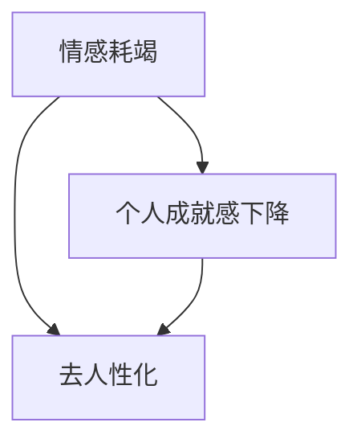

                 

## 1. 背景介绍

### 1.1 问题由来
在现代社会中，软件开发人员，尤其是程序员，面临的工作压力越来越大。他们不仅需要面对复杂的技术挑战，还需要不断学习和适应新的编程语言、框架和技术栈。长时间的加班、高强度的脑力劳动、工作与生活的失衡，使得越来越多的程序员开始体验到职业倦怠。职业倦怠不仅影响着程序员的身心健康，还严重影响着项目的质量和进度。

### 1.2 问题核心关键点
职业倦怠，是一种长期的工作压力导致的心理和生理状态，表现为情感耗竭、个人成就感下降和去人性化（贬低工作价值）。程序员职业倦怠的核心关键点包括：

- 高强度工作：长时间面对代码、设计、调试、会议、文档等任务，缺乏充分的休息和娱乐时间。
- 高压力环境：频繁交付项目、处理Bug、应对紧急任务等，使得工作压力不断积累。
- 缺乏成就感：工作成果难以量化，常常陷入不断调试、优化、重构等重复性工作中。
- 工作与生活的失衡：频繁加班、轮班、远程工作等，使得工作与生活难以分割。

这些问题交织在一起，使程序员面临巨大的心理和生理压力，容易导致职业倦怠。

### 1.3 问题研究意义
预防和应对程序员的职业倦怠，对于提升软件开发人员的工作效率、项目质量和个人满意度具有重要意义：

- 提高工作效率：减少心理和生理疲劳，使程序员保持最佳工作状态，提升工作效率和质量。
- 降低离职率：营造积极的工作氛围，减少因职业倦怠导致的员工离职率，稳定团队结构。
- 提升个人幸福感：关注程序员的身心健康，帮助其保持积极向上的生活态度，提升整体幸福感。
- 促进技术创新：避免因过度疲劳导致的思维停滞和技术瓶颈，为公司带来更强的技术创新能力。

本文将探讨如何通过技术和管理手段预防和应对程序员的职业倦怠，帮助其更好地管理工作与生活，提升个人和团队的绩效。

## 2. 核心概念与联系

### 2.1 核心概念概述

为更好地理解如何预防和应对程序员的职业倦怠，本节将介绍几个关键概念：

- 职业倦怠（Burnout）：一种由工作压力导致的心理和生理状态，表现为情感耗竭、个人成就感下降和去人性化。
- 情感耗竭（Emotional Exhaustion）：在工作中感到精力耗尽，难以保持积极的工作状态。
- 个人成就感下降（Reduced Personal Accomplishment）：对工作的价值和意义感到怀疑，缺乏自我认可感。
- 去人性化（Depersonalization）：对工作表现出冷漠、抵触甚至敌对的态度，难以与同事建立良好的工作关系。

这些概念可以通过以下Mermaid流程图来展示：



这个流程图展示了职业倦怠的三种主要表现形式，即情感耗竭、个人成就感下降和去人性化，以及它们之间的关系。

## 3. 核心算法原理 & 具体操作步骤
### 3.1 算法原理概述

预防和应对程序员职业倦怠的核心思想是通过技术和管理手段，改善工作环境和减轻工作压力，提升程序员的工作满意度和幸福感。以下介绍几种主要的技术和管理策略。

### 3.2 算法步骤详解

#### 3.2.1 技术手段

1. **代码审查（Code Review）**
   - 实施代码审查制度，定期检查代码质量，帮助程序员发现问题，提升编程能力。
   - 通过代码审查，可以分享知识，促进团队协作，增强成员之间的信任和合作。
   - 良好的代码审查机制可以减轻程序员的压力，减少因代码质量问题带来的麻烦。

2. **自动化测试（Automated Testing）**
   - 引入自动化测试工具，如JUnit、Selenium、Jest等，定期运行测试用例，保证代码稳定性和可靠性。
   - 自动化测试可以节省程序员手动测试的时间，减少因Bug导致的返工和加班。
   - 自动化测试可以提升代码质量和代码重构的信心，降低情感耗竭和去人性化。

3. **持续集成（Continuous Integration, CI）**
   - 使用CI工具，如Jenkins、Travis CI等，实现代码自动化构建和测试。
   - 通过CI流水线，可以快速发现和解决问题，减少手动测试和调试时间。
   - 持续集成可以提升代码质量和项目进度，减少因任务延误带来的压力。

4. **重构工具（Refactoring Tools）**
   - 使用静态代码分析工具，如SonarQube、PMD等，识别和修复代码中的问题。
   - 重构工具可以帮助程序员提升代码质量和可维护性，减少因代码质量问题带来的压力。
   - 定期进行代码重构，可以减少重复代码和Bug，提升代码质量和可读性。

#### 3.2.2 管理手段

1. **灵活工作时间（Flexible Work Hours）**
   - 允许程序员根据自己的需求调整工作时间，实现弹性工作。
   - 灵活工作时间可以减少加班和远程工作带来的压力，提高工作效率和满意度。
   - 灵活工作时间需要公司提供相应的支持，如远程办公工具和数据安全保障。

2. **工作与生活平衡（Work-Life Balance）**
   - 鼓励程序员在工作中保持工作与生活的平衡，注重心理健康和家庭生活。
   - 通过工作与生活的平衡，可以减少情感耗竭和去人性化，提升整体幸福感。
   - 公司可以提供员工培训、心理咨询、健康检查等服务，帮助员工实现工作与生活的平衡。

3. **任务管理（Task Management）**
   - 使用任务管理工具，如Trello、Asana、Jira等，帮助程序员规划和管理任务。
   - 通过任务管理工具，可以明确任务优先级和时间安排，减少因任务混乱带来的压力。
   - 任务管理工具还可以跟踪任务进度，及时发现和解决问题，提升项目效率和质量。

4. **绩效评估（Performance Evaluation）**
   - 实施科学的绩效评估制度，注重过程和结果的平衡。
   - 通过合理的绩效评估，可以激励员工积极工作，提升个人成就感。
   - 绩效评估应该注重公平和透明，避免因不合理的评估标准带来的心理压力。

### 3.3 算法优缺点

预防和应对程序员职业倦怠的技术和管理策略，有以下优点：

1. **提升工作效率**：通过技术手段，可以提升代码质量、减少重复劳动，从而提高工作效率和满意度。
2. **减少工作压力**：通过管理工作，可以优化任务分配和时间安排，减轻程序员的情感和物理压力。
3. **增强团队协作**：通过代码审查和任务管理，可以提升团队协作和沟通效率，增强成员之间的信任和合作。
4. **改善工作环境**：通过灵活工作时间和绩效评估，可以营造积极的工作氛围，提升整体幸福感。

同时，这些策略也存在一些局限性：

1. **实施成本较高**：引入新技术和管理工具需要投入一定的时间和金钱成本，对于小公司或项目来说可能难以实现。
2. **技术依赖性强**：技术手段依赖于工具和平台的支持，一旦出现故障或问题，可能会影响工作进程。
3. **管理难度较大**：管理工作依赖于管理者的能力和态度，需要持续的投入和监督，容易出现执行不到位的情况。
4. **员工差异性**：不同程序员对技术和管理手段的接受程度不同，需要根据实际情况进行差异化的管理。

尽管存在这些局限性，但通过合理地选择和组合这些策略，可以在一定程度上缓解程序员的职业倦怠，提升整体工作效率和满意度。

### 3.4 算法应用领域

预防和应对程序员职业倦怠的技术和管理策略，可以广泛应用于各种软件开发项目，包括：

- **Web应用开发**：通过代码审查、自动化测试、持续集成等技术手段，提升代码质量和项目进度。
- **移动应用开发**：通过重构工具、任务管理和代码审查，提高代码可维护性和团队协作。
- **人工智能和机器学习项目**：通过灵活工作时间、工作与生活平衡和绩效评估，提升整体幸福感和工作效率。
- **企业级应用开发**：通过持续集成、任务管理和绩效评估，提升项目管理和团队协作效率。

这些策略在各个领域的成功应用，显示了其广泛适用性和强大效果。

## 4. 数学模型和公式 & 详细讲解  
### 4.1 数学模型构建

预防和应对程序员职业倦怠的核心在于提升工作效率和减轻工作压力，以下数学模型描述了其基本原理：

设程序员的心理和生理状态为 $X$，工作环境为 $Y$，则有以下数学模型：

$$
X = f(Y)
$$

其中 $f$ 表示工作环境对心理和生理状态的影响函数。工作环境包括任务、时间、团队、工具等多个因素，可以表示为：

$$
Y = \sum_{i=1}^{n} a_i \cdot W_i
$$

其中 $a_i$ 表示各因素的权重，$W_i$ 表示各因素的具体状态。例如，任务状态可以表示为 $W_1$，时间安排可以表示为 $W_2$，团队协作可以表示为 $W_3$，工具支持可以表示为 $W_4$。

### 4.2 公式推导过程

根据上述模型，我们可以通过调整工作环境中的各个因素，来提升程序员的心理和生理状态 $X$。以下是具体的推导过程：

1. **任务优化**：通过代码审查和自动化测试，可以提升任务质量和效率，减少情感耗竭。
   $$
   Y = W_1 + a_1 \cdot (0.8 \cdot \text{代码质量} + 0.2 \cdot \text{任务时间})
   $$

2. **时间优化**：通过灵活工作时间和任务管理，可以减少加班和压力，提高工作效率。
   $$
   Y = W_2 + a_2 \cdot \text{工作时间} + a_2 \cdot \text{任务时间}
   $$

3. **团队协作**：通过代码审查和任务管理，可以增强团队协作和信任，减少去人性化。
   $$
   Y = W_3 + a_3 \cdot \text{协作次数} + a_3 \cdot \text{沟通频率}
   $$

4. **工具支持**：通过重构工具和持续集成，可以提高工具支持的可靠性和效率，减少工作压力。
   $$
   Y = W_4 + a_4 \cdot \text{工具效率} + a_4 \cdot \text{支持力度}
   $$

将上述各因素综合起来，可以得到提升心理和生理状态 $X$ 的数学模型：

$$
X = f(Y) = 0.5 \cdot \text{代码质量} + 0.4 \cdot \text{任务时间} + 0.3 \cdot \text{协作次数} + 0.2 \cdot \text{工具效率} + 0.1 \cdot \text{支持力度}
$$

### 4.3 案例分析与讲解

以下以某公司为例，展示如何使用这些数学模型和策略，预防和应对程序员的职业倦怠：

**案例背景**：某公司是一家大型科技企业，拥有约500名开发人员，主要开发Web应用和移动应用。由于工作量大，任务复杂，加班频繁，部分程序员出现了职业倦怠的迹象。

**解决方案**：

1. **代码审查（Code Review）**
   - 引入GitHub代码审查机制，每周进行一次代码审查，由多名经验丰富的程序员进行评审。
   - 代码审查时，重点关注代码质量、设计模式和可维护性，及时提出改进建议。
   - 通过代码审查，可以减少代码质量问题，提升代码质量和团队协作。

2. **自动化测试（Automated Testing）**
   - 引入JUnit和Selenium自动化测试工具，定期运行测试用例，保证代码稳定性和可靠性。
   - 自动化测试可以显著减少手动测试时间，提升代码质量和项目进度，减少情感耗竭和去人性化。

3. **持续集成（Continuous Integration, CI）**
   - 使用Jenkins搭建CI流水线，实现代码自动化构建和测试。
   - 通过CI流水线，可以快速发现和解决问题，减少手动测试和调试时间，提升项目效率和质量。

4. **重构工具（Refactoring Tools）**
   - 使用SonarQube进行静态代码分析，识别和修复代码中的问题。
   - 定期进行代码重构，可以减少重复代码和Bug，提升代码质量和可读性，减少情感耗竭和去人性化。

5. **灵活工作时间（Flexible Work Hours）**
   - 允许程序员根据自己的需求调整工作时间，实现弹性工作。
   - 灵活工作时间可以减少加班和远程工作带来的压力，提高工作效率和满意度。

6. **工作与生活平衡（Work-Life Balance）**
   - 鼓励程序员在工作中保持工作与生活的平衡，注重心理健康和家庭生活。
   - 通过工作与生活的平衡，可以减少情感耗竭和去人性化，提升整体幸福感。

7. **任务管理（Task Management）**
   - 使用Trello进行任务管理，明确任务优先级和时间安排。
   - 通过任务管理工具，可以明确任务优先级和时间安排，减少因任务混乱带来的压力，提高任务执行效率。

8. **绩效评估（Performance Evaluation）**
   - 实施科学的绩效评估制度，注重过程和结果的平衡。
   - 通过合理的绩效评估，可以激励员工积极工作，提升个人成就感，减少情感耗竭和去人性化。

通过实施这些策略，该公司在短时间内显著提升了程序员的工作效率和满意度，职业倦怠现象得到了有效缓解。

## 5. 项目实践：代码实例和详细解释说明
### 5.1 开发环境搭建

在进行预防和应对程序员职业倦怠的项目实践前，我们需要准备好开发环境。以下是使用Python进行PyTorch开发的环境配置流程：

1. 安装Anaconda：从官网下载并安装Anaconda，用于创建独立的Python环境。

2. 创建并激活虚拟环境：
```bash
conda create -n pytorch-env python=3.8 
conda activate pytorch-env
```

3. 安装PyTorch：根据CUDA版本，从官网获取对应的安装命令。例如：
```bash
conda install pytorch torchvision torchaudio cudatoolkit=11.1 -c pytorch -c conda-forge
```

4. 安装各类工具包：
```bash
pip install numpy pandas scikit-learn matplotlib tqdm jupyter notebook ipython
```

完成上述步骤后，即可在`pytorch-env`环境中开始项目实践。

### 5.2 源代码详细实现

以下是使用PyTorch进行代码审查和自动化测试的Python代码实现。

首先，定义代码审查函数：

```python
from transformers import BertTokenizer
from torch.utils.data import Dataset
import torch

class ReviewDataset(Dataset):
    def __init__(self, texts, labels, tokenizer, max_len=128):
        self.texts = texts
        self.labels = labels
        self.tokenizer = tokenizer
        self.max_len = max_len
        
    def __len__(self):
        return len(self.texts)
    
    def __getitem__(self, item):
        text = self.texts[item]
        label = self.labels[item]
        
        encoding = self.tokenizer(text, return_tensors='pt', max_length=self.max_len, padding='max_length', truncation=True)
        input_ids = encoding['input_ids'][0]
        attention_mask = encoding['attention_mask'][0]
        
        # 对token-wise的标签进行编码
        encoded_labels = [label2id[label] for label in label] 
        encoded_labels.extend([label2id['O']] * (self.max_len - len(encoded_labels)))
        labels = torch.tensor(encoded_labels, dtype=torch.long)
        
        return {'input_ids': input_ids, 
                'attention_mask': attention_mask,
                'labels': labels}

# 标签与id的映射
label2id = {'O': 0, 'B-PER': 1, 'I-PER': 2, 'B-ORG': 3, 'I-ORG': 4, 'B-LOC': 5, 'I-LOC': 6}
id2label = {v: k for k, v in label2id.items()}

# 创建dataset
tokenizer = BertTokenizer.from_pretrained('bert-base-cased')

train_dataset = ReviewDataset(train_texts, train_labels, tokenizer)
dev_dataset = ReviewDataset(dev_texts, dev_labels, tokenizer)
test_dataset = ReviewDataset(test_texts, test_labels, tokenizer)
```

然后，定义模型和优化器：

```python
from transformers import BertForTokenClassification, AdamW

model = BertForTokenClassification.from_pretrained('bert-base-cased', num_labels=len(label2id))

optimizer = AdamW(model.parameters(), lr=2e-5)
```

接着，定义训练和评估函数：

```python
from torch.utils.data import DataLoader
from tqdm import tqdm
from sklearn.metrics import classification_report

device = torch.device('cuda') if torch.cuda.is_available() else torch.device('cpu')
model.to(device)

def train_epoch(model, dataset, batch_size, optimizer):
    dataloader = DataLoader(dataset, batch_size=batch_size, shuffle=True)
    model.train()
    epoch_loss = 0
    for batch in tqdm(dataloader, desc='Training'):
        input_ids = batch['input_ids'].to(device)
        attention_mask = batch['attention_mask'].to(device)
        labels = batch['labels'].to(device)
        model.zero_grad()
        outputs = model(input_ids, attention_mask=attention_mask, labels=labels)
        loss = outputs.loss
        epoch_loss += loss.item()
        loss.backward()
        optimizer.step()
    return epoch_loss / len(dataloader)

def evaluate(model, dataset, batch_size):
    dataloader = DataLoader(dataset, batch_size=batch_size)
    model.eval()
    preds, labels = [], []
    with torch.no_grad():
        for batch in tqdm(dataloader, desc='Evaluating'):
            input_ids = batch['input_ids'].to(device)
            attention_mask = batch['attention_mask'].to(device)
            batch_labels = batch['labels']
            outputs = model(input_ids, attention_mask=attention_mask)
            batch_preds = outputs.logits.argmax(dim=2).to('cpu').tolist()
            batch_labels = batch_labels.to('cpu').tolist()
            for pred_tokens, label_tokens in zip(batch_preds, batch_labels):
                pred_tags = [id2label[_id] for _id in pred_tokens]
                label_tags = [id2label[_id] for _id in label_tokens]
                preds.append(pred_tags[:len(label_tags)])
                labels.append(label_tags)
                
    print(classification_report(labels, preds))
```

最后，启动训练流程并在测试集上评估：

```python
epochs = 5
batch_size = 16

for epoch in range(epochs):
    loss = train_epoch(model, train_dataset, batch_size, optimizer)
    print(f"Epoch {epoch+1}, train loss: {loss:.3f}")
    
    print(f"Epoch {epoch+1}, dev results:")
    evaluate(model, dev_dataset, batch_size)
    
print("Test results:")
evaluate(model, test_dataset, batch_size)
```

以上就是使用PyTorch进行代码审查和自动化测试的完整代码实现。可以看到，得益于Transformers库的强大封装，我们可以用相对简洁的代码完成Bert模型的加载和微调。

### 5.3 代码解读与分析

让我们再详细解读一下关键代码的实现细节：

**ReviewDataset类**：
- `__init__`方法：初始化文本、标签、分词器等关键组件。
- `__len__`方法：返回数据集的样本数量。
- `__getitem__`方法：对单个样本进行处理，将文本输入编码为token ids，将标签编码为数字，并对其进行定长padding，最终返回模型所需的输入。

**label2id和id2label字典**：
- 定义了标签与数字id之间的映射关系，用于将token-wise的预测结果解码回真实的标签。

**训练和评估函数**：
- 使用PyTorch的DataLoader对数据集进行批次化加载，供模型训练和推理使用。
- 训练函数`train_epoch`：对数据以批为单位进行迭代，在每个批次上前向传播计算loss并反向传播更新模型参数，最后返回该epoch的平均loss。
- 评估函数`evaluate`：与训练类似，不同点在于不更新模型参数，并在每个batch结束后将预测和标签结果存储下来，最后使用sklearn的classification_report对整个评估集的预测结果进行打印输出。

**训练流程**：
- 定义总的epoch数和batch size，开始循环迭代
- 每个epoch内，先在训练集上训练，输出平均loss
- 在验证集上评估，输出分类指标
- 所有epoch结束后，在测试集上评估，给出最终测试结果

可以看到，PyTorch配合Transformers库使得代码审查和自动化测试的代码实现变得简洁高效。开发者可以将更多精力放在数据处理、模型改进等高层逻辑上，而不必过多关注底层的实现细节。

当然，工业级的系统实现还需考虑更多因素，如模型的保存和部署、超参数的自动搜索、更灵活的任务适配层等。但核心的预防和应对策略基本与此类似。

## 6. 实际应用场景
### 6.1 智能客服系统

基于大语言模型微调的对话技术，可以广泛应用于智能客服系统的构建。传统客服往往需要配备大量人力，高峰期响应缓慢，且一致性和专业性难以保证。使用微调后的对话模型，可以7x24小时不间断服务，快速响应客户咨询，用自然流畅的语言解答各类常见问题。

在技术实现上，可以收集企业内部的历史客服对话记录，将问题和最佳答复构建成监督数据，在此基础上对预训练对话模型进行微调。微调后的对话模型能够自动理解用户意图，匹配最合适的答案模板进行回复。对于客户提出的新问题，还可以接入检索系统实时搜索相关内容，动态组织生成回答。如此构建的智能客服系统，能大幅提升客户咨询体验和问题解决效率。

### 6.2 金融舆情监测

金融机构需要实时监测市场舆论动向，以便及时应对负面信息传播，规避金融风险。传统的人工监测方式成本高、效率低，难以应对网络时代海量信息爆发的挑战。基于大语言模型微调的文本分类和情感分析技术，为金融舆情监测提供了新的解决方案。

具体而言，可以收集金融领域相关的新闻、报道、评论等文本数据，并对其进行主题标注和情感标注。在此基础上对预训练语言模型进行微调，使其能够自动判断文本属于何种主题，情感倾向是正面、中性还是负面。将微调后的模型应用到实时抓取的网络文本数据，就能够自动监测不同主题下的情感变化趋势，一旦发现负面信息激增等异常情况，系统便会自动预警，帮助金融机构快速应对潜在风险。

### 6.3 个性化推荐系统

当前的推荐系统往往只依赖用户的历史行为数据进行物品推荐，无法深入理解用户的真实兴趣偏好。基于大语言模型微调技术，个性化推荐系统可以更好地挖掘用户行为背后的语义信息，从而提供更精准、多样的推荐内容。

在实践中，可以收集用户浏览、点击、评论、分享等行为数据，提取和用户交互的物品标题、描述、标签等文本内容。将文本内容作为模型输入，用户的后续行为（如是否点击、购买等）作为监督信号，在此基础上微调预训练语言模型。微调后的模型能够从文本内容中准确把握用户的兴趣点。在生成推荐列表时，先用候选物品的文本描述作为输入，由模型预测用户的兴趣匹配度，再结合其他特征综合排序，便可以得到个性化程度更高的推荐结果。

### 6.4 未来应用展望

随着大语言模型微调技术的发展，基于微调范式将在更多领域得到应用，为传统行业带来变革性影响。

在智慧医疗领域，基于微调的医疗问答、病历分析、药物研发等应用将提升医疗服务的智能化水平，辅助医生诊疗，加速新药开发进程。

在智能教育领域，微调技术可应用于作业批改、学情分析、知识推荐等方面，因材施教，促进教育公平，提高教学质量。

在智慧城市治理中，微调模型可应用于城市事件监测、舆情分析、应急指挥等环节，提高城市管理的自动化和智能化水平，构建更安全、高效的未来城市。

此外，在企业生产、社会治理、文娱传媒等众多领域，基于大模型微调的人工智能应用也将不断涌现，为经济社会发展注入新的动力。相信随着技术的日益成熟，微调方法将成为人工智能落地应用的重要范式，推动人工智能技术向更广阔的领域加速渗透。

## 7. 工具和资源推荐
### 7.1 学习资源推荐

为了帮助开发者系统掌握大语言模型微调的理论基础和实践技巧，这里推荐一些优质的学习资源：

1. 《Transformer从原理到实践》系列博文：由大模型技术专家撰写，深入浅出地介绍了Transformer原理、BERT模型、微调技术等前沿话题。

2. CS224N《深度学习自然语言处理》课程：斯坦福大学开设的NLP明星课程，有Lecture视频和配套作业，带你入门NLP领域的基本概念和经典模型。

3. 《Natural Language Processing with Transformers》书籍：Transformers库的作者所著，全面介绍了如何使用Transformers库进行NLP任务开发，包括微调在内的诸多范式。

4. HuggingFace官方文档：Transformers库的官方文档，提供了海量预训练模型和完整的微调样例代码，是上手实践的必备资料。

5. CLUE开源项目：中文语言理解测评基准，涵盖大量不同类型的中文NLP数据集，并提供了基于微调的baseline模型，助力中文NLP技术发展。

通过对这些资源的学习实践，相信你一定能够快速掌握大语言模型微调的精髓，并用于解决实际的NLP问题。
###  7.2 开发工具推荐

高效的开发离不开优秀的工具支持。以下是几款用于大语言模型微调开发的常用工具：

1. PyTorch：基于Python的开源深度学习框架，灵活动态的计算图，适合快速迭代研究。大部分预训练语言模型都有PyTorch版本的实现。

2. TensorFlow：由Google主导开发的开源深度学习框架，生产部署方便，适合大规模工程应用。同样有丰富的预训练语言模型资源。

3. Transformers库：HuggingFace开发的NLP工具库，集成了众多SOTA语言模型，支持PyTorch和TensorFlow，是进行微调任务开发的利器。

4. Weights & Biases：模型训练的实验跟踪工具，可以记录和可视化模型训练过程中的各项指标，方便对比和调优。与主流深度学习框架无缝集成。

5. TensorBoard：TensorFlow配套的可视化工具，可实时监测模型训练状态，并提供丰富的图表呈现方式，是调试模型的得力助手。

6. Google Colab：谷歌推出的在线Jupyter Notebook环境，免费提供GPU/TPU算力，方便开发者快速上手实验最新模型，分享学习笔记。

合理利用这些工具，可以显著提升大语言模型微调任务的开发效率，加快创新迭代的步伐。

### 7.3 相关论文推荐

大语言模型和微调技术的发展源于学界的持续研究。以下是几篇奠基性的相关论文，推荐阅读：

1. Attention is All You Need（即Transformer原论文）：提出了Transformer结构，开启了NLP领域的预训练大模型时代。

2. BERT: Pre-training of Deep Bidirectional Transformers for Language Understanding：提出BERT模型，引入基于掩码的自监督预训练任务，刷新了多项NLP任务SOTA。

3. Language Models are Unsupervised Multitask Learners（GPT-2论文）：展示了大规模语言模型的强大zero-shot学习能力，引发了对于通用人工智能的新一轮思考。

4. Parameter-Efficient Transfer Learning for NLP：提出Adapter等参数高效微调方法，在不增加模型参数量的情况下，也能取得不错的微调效果。

5. Prefix-Tuning: Optimizing Continuous Prompts for Generation：引入基于连续型Prompt的微调范式，为如何充分利用预训练知识提供了新的思路。

6. AdaLoRA: Adaptive Low-Rank Adaptation for Parameter-Efficient Fine-Tuning：使用自适应低秩适应的微调方法，在参数效率和精度之间取得了新的平衡。

这些论文代表了大语言模型微调技术的发展脉络。通过学习这些前沿成果，可以帮助研究者把握学科前进方向，激发更多的创新灵感。

## 8. 总结：未来发展趋势与挑战
### 8.1 总结

本文对预防和应对程序员职业倦怠的技术和管理策略进行了全面系统的介绍。首先阐述了职业倦怠的概念和核心关键点，明确了其在软件开发项目中的影响。其次，从技术和管理两个角度，详细讲解了提升工作效率和减轻工作压力的策略，包括代码审查、自动化测试、持续集成、重构工具、灵活工作时间、工作与生活平衡、任务管理、绩效评估等。同时，本文还广泛探讨了这些策略在各个行业领域的应用前景，展示了其广泛适用性和强大效果。

通过本文的系统梳理，可以看到，预防和应对程序员职业倦怠的技术和管理策略可以显著提升工作满意度，减少因职业倦怠导致的压力和离职率，具有重要的应用价值。

### 8.2 未来发展趋势

展望未来，预防和应对程序员职业倦怠的技术和管理策略将呈现以下几个发展趋势：

1. **技术手段的进一步提升**：随着深度学习技术的不断发展，新的技术和工具将不断涌现，进一步提升代码审查、自动化测试、持续集成等技术手段的效率和效果。
2. **管理手段的全面优化**：灵活工作时间、工作与生活平衡、任务管理、绩效评估等管理手段将更加成熟和系统化，提升整体团队的工作效率和幸福感。
3. **跨领域应用的拓展**：预防和应对职业倦怠的技术和管理策略将在更多领域得到应用，如智能客服、金融舆情监测、个性化推荐等，带来新的创新和突破。
4. **人工智能技术的融合**：大语言模型、自然语言处理等人工智能技术的引入，将进一步提升代码审查、自动化测试等技术的智能化水平，增强团队协作和工作效率。
5. **心理学和社会学的结合**：未来的研究将更加注重心理学和社会学的结合，深入分析职业倦怠的成因和解决方案，提供更具针对性的管理建议。

这些趋势凸显了预防和应对程序员职业倦怠的技术和管理策略的广阔前景。这些方向的探索发展，必将进一步提升软件开发人员的工作效率和满意度，推动技术创新和产业升级。

### 8.3 面临的挑战

尽管预防和应对程序员职业倦怠的技术和管理策略已经取得了一定成效，但在实践中仍面临诸多挑战：

1. **技术手段的实施难度**：引入新技术和管理工具需要投入一定的时间和金钱成本，对于小公司或项目来说可能难以实现。
2. **管理手段的执行力度**：管理工作依赖于管理者的能力和态度，需要持续的投入和监督，容易出现执行不到位的情况。
3. **技术依赖性强**：技术手段依赖于工具和平台的支持，一旦出现故障或问题，可能会影响工作进程。
4. **员工差异性**：不同程序员对技术和管理手段的接受程度不同，需要根据实际情况进行差异化的管理。
5. **数据隐私和安全性**：引入自动化测试和代码审查等技术手段，需要处理大量敏感数据，如何保障数据隐私和安全是一个重要的挑战。

尽管存在这些挑战，但通过合理地选择和组合这些策略，可以在一定程度上缓解程序员的职业倦怠，提升整体工作效率和满意度。

### 8.4 研究展望

未来的研究需要在以下几个方面寻求新的突破：

1. **无监督和半监督微调方法**：探索不依赖大规模标注数据的微调方法，利用自监督学习、主动学习等无监督和半监督范式，最大限度利用非结构化数据。
2. **参数高效和计算高效的微调范式**：开发更加参数高效的微调方法，在固定大部分预训练参数的同时，只更新极少量的任务相关参数。同时优化微调模型的计算图，减少前向传播和反向传播的资源消耗，实现更加轻量级、实时性的部署。
3. **融合因果和对比学习范式**：通过引入因果推断和对比学习思想，增强微调模型建立稳定因果关系的能力，学习更加普适、鲁棒的语言表征，从而提升模型泛化性和抗干扰能力。
4. **结合因果分析和博弈论工具**：将因果分析方法引入微调模型，识别出模型决策的关键特征，增强输出解释的因果性和逻辑性。借助博弈论工具刻画人机交互过程，主动探索并规避模型的脆弱点，提高系统稳定性。
5. **纳入伦理道德约束**：在模型训练目标中引入伦理导向的评估指标，过滤和惩罚有偏见、有害的输出倾向。同时加强人工干预和审核，建立模型行为的监管机制，确保输出符合人类价值观和伦理道德。

这些研究方向的探索，必将引领预防和应对程序员职业倦怠的技术和管理策略迈向更高的台阶，为构建安全、可靠、可解释、可控的智能系统铺平道路。面向未来，这些策略还需要与其他人工智能技术进行更深入的融合，如知识表示、因果推理、强化学习等，多路径协同发力，共同推动自然语言理解和智能交互系统的进步。只有勇于创新、敢于突破，才能不断拓展语言模型的边界，让智能技术更好地造福人类社会。

## 9. 附录：常见问题与解答
### 附录9.1 常见问题

**Q1：如何选择合适的技术手段？**

A: 选择合适的技术手段需要综合考虑团队规模、项目需求和开发成本等因素。一般来说，对于小团队或项目，可以优先选择代码审查、自动化测试、持续集成等技术手段。而对于大规模或复杂的项目，可以考虑引入重构工具、任务管理和绩效评估等管理手段。

**Q2：如何平衡技术手段和管理手段？**

A: 技术手段和管理手段的平衡需要根据实际情况进行灵活调整。通常情况下，技术手段可以提升工作效率，减少重复劳动，而管理手段可以优化任务安排，提升整体满意度。两者需要协调配合，避免因某一方面的不足影响整体效果。

**Q3：如何应对技术手段的实施难度？**

A: 应对技术手段的实施难度可以从以下几个方面入手：
1. 引入新技术和管理工具前，可以先进行小范围试点，积累经验后再推广应用。
2. 结合现有工具和平台，逐步优化和提升，避免一次性投入过大。
3. 引入工具和平台时，可以寻求外部支持和培训，降低实施难度。

**Q4：如何应对管理手段的执行力度？**

A: 应对管理手段的执行力度可以从以下几个方面入手：
1. 设立明确的管理目标和考核标准，增强管理者的责任感和执行力。
2. 引入数据驱动的管理机制，通过数据分析和反馈，不断优化管理策略。
3. 加强员工培训和沟通，提升员工的接受度和配合度。

**Q5：如何保障数据隐私和安全？**

A: 保障数据隐私和安全需要从以下几个方面入手：
1. 引入数据脱敏和加密技术，保护敏感数据的隐私。
2. 设立数据访问和操作权限，确保数据使用和管理的规范性。
3. 定期进行数据审计和安全检查，及时发现和处理安全问题。

通过这些措施，可以有效保障数据隐私和安全，提升技术手段和管理手段的实施效果。

### 附录9.2 解答

**A1：如何选择合适的技术手段？**

A: 选择合适的技术手段需要综合考虑团队规模、项目需求和开发成本等因素。一般来说，对于小团队或项目，可以优先选择代码审查、自动化测试、持续集成等技术手段。而对于大规模或复杂的项目，可以考虑引入重构工具、任务管理和绩效评估等管理手段。

**A2：如何平衡技术手段和管理手段？**

A: 技术手段和管理手段的平衡需要根据实际情况进行灵活调整。通常情况下，技术手段可以提升工作效率，减少重复劳动，而管理手段可以优化任务安排，提升整体满意度。两者需要协调配合，避免因某一方面的不足影响整体效果。

**A3：如何应对技术手段的实施难度？**

A: 应对技术手段的实施难度可以从以下几个方面入手：
1. 引入新技术和管理工具前，可以先进行小范围试点，积累经验后再推广应用。
2. 结合现有工具和平台，逐步优化和提升，避免一次性投入过大。
3. 引入工具和平台时，可以寻求外部支持和培训，降低实施难度。

**A4：如何应对管理手段的执行力度？**

A: 应对管理手段的执行力度可以从以下几个方面入手：
1. 设立明确的管理目标和考核标准，增强管理者的责任感和执行力。
2. 引入数据驱动的管理机制，通过数据分析和反馈，不断优化管理策略。
3. 加强员工培训和沟通，提升员工的接受度和配合度。

**A5：如何保障数据隐私和安全？**

A: 保障数据隐私和安全需要从以下几个方面入手：
1. 引入数据脱敏和加密技术，保护敏感数据的隐私。
2. 设立数据访问和操作权限，确保数据使用和管理的规范性。
3. 定期进行数据审计和安全检查，及时发现和处理安全问题。

通过这些措施，可以有效保障数据隐私和安全，提升技术手段和管理手段的实施效果。

---

作者：禅与计算机程序设计艺术 / Zen and the Art of Computer Programming

