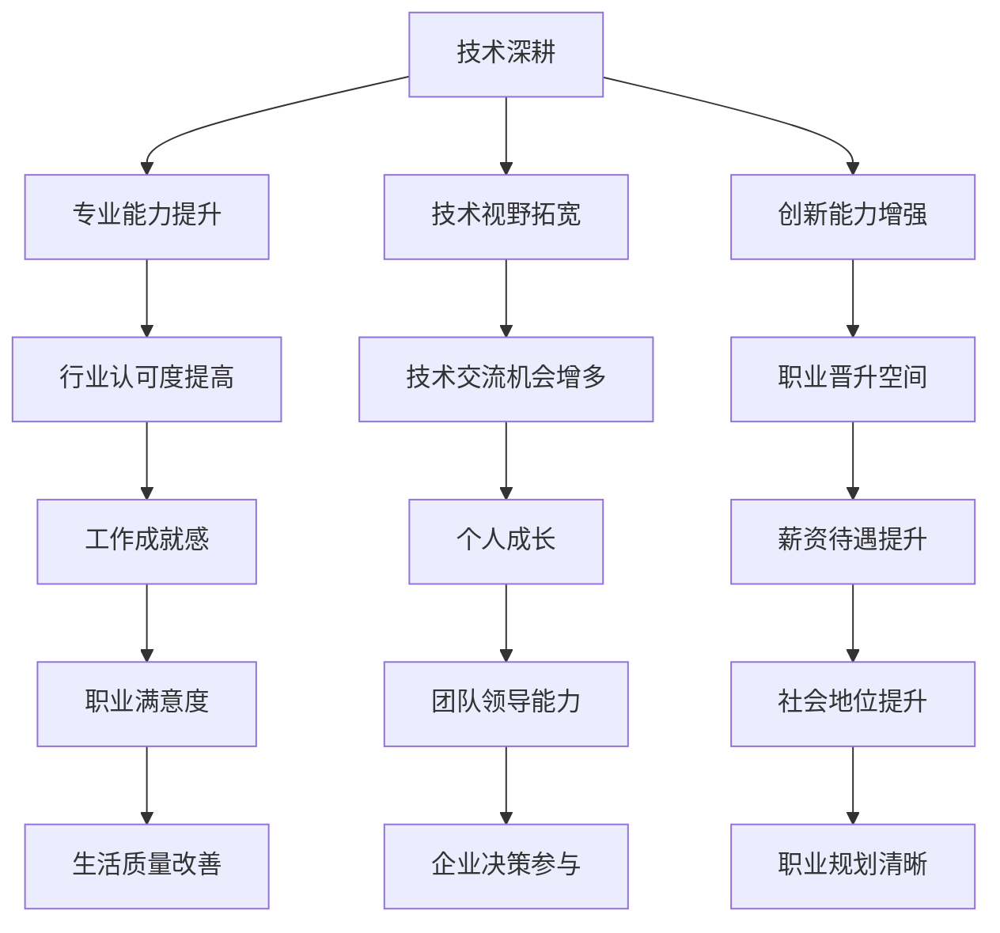

                 

关键词：程序员职业规划、技术深耕、管理晋升、职业发展、技术管理、个人成长

> 摘要：本文旨在探讨程序员在职业生涯中面临的两个主要方向：技术深耕和管理晋升。通过分析两者之间的异同、优缺点以及具体实施路径，帮助程序员根据个人兴趣和职业目标做出明智的选择，实现个人职业规划的优化。

## 1. 背景介绍

在信息技术高速发展的今天，程序员作为技术工作者，面临着多样的职业发展路径。一方面，技术深耕能够帮助程序员在专业领域达到高水平，成为技术专家；另一方面，管理晋升则为程序员提供了领导和管理团队的机会。然而，两者之间的选择并非易事，需要程序员根据自身情况做出权衡。

## 2. 核心概念与联系

### 2.1 技术深耕

技术深耕是指程序员在某一技术领域不断学习、实践和钻研，以达到卓越的技术水平和专业能力。它涉及到编程语言、框架、算法、系统架构等多个方面。

### 2.2 管理晋升

管理晋升是指程序员从技术角色逐步转型为管理角色，负责带领团队完成项目，协调资源，解决团队和管理上的问题。它包括项目管理、团队管理、沟通协调等多个方面。

### 2.3 Mermaid 流程图



## 3. 核心算法原理 & 具体操作步骤

### 3.1 算法原理概述

技术深耕和管理晋升的核心算法原理在于对程序员个人职业发展的规划。技术深耕注重专业技能的提升，管理晋升则强调领导力和管理能力的培养。

### 3.2 算法步骤详解

1. **自我评估**：程序员需要了解自己的兴趣、优势和职业目标。
2. **选择方向**：根据评估结果，确定是追求技术深耕还是管理晋升。
3. **制定计划**：明确短期和长期目标，制定详细的学习和实践计划。
4. **持续执行**：按照计划进行学习、实践和提升。
5. **反馈与调整**：定期评估进度，根据实际情况进行调整。

### 3.3 算法优缺点

#### 技术深耕的优点：

- **技术深度和广度**：能够深入掌握技术细节，同时拓宽技术视野。
- **职业成就感**：通过不断学习和技术突破，获得职业上的成就感。
- **行业认可度**：技术水平得到行业内的认可，有助于职业发展。

#### 技术深耕的缺点：

- **职业瓶颈**：技术深耕可能导致职业发展遇到瓶颈。
- **工作压力**：需要不断学习和适应新技术，工作压力较大。

#### 管理晋升的优点：

- **领导力提升**：通过管理角色，培养领导力和团队管理能力。
- **职业晋升空间**：管理岗位提供了更多的职业晋升机会。
- **薪资待遇**：管理岗位通常薪资待遇更高。

#### 管理晋升的缺点：

- **技术能力下降**：管理岗位可能会分散精力，导致技术能力下降。
- **工作压力**：管理岗位面临更大的工作压力和责任。

### 3.4 算法应用领域

技术深耕和管理晋升在不同领域有不同的应用：

- **技术深耕**：适用于需要高水平技术专家的领域，如互联网、金融、医疗等。
- **管理晋升**：适用于需要团队协作和项目管理的企业，如大型互联网公司、咨询服务公司等。

## 4. 数学模型和公式 & 详细讲解 & 举例说明

### 4.1 数学模型构建

技术深耕和管理晋升的数学模型可以表示为：

\[ P_t = f(T_c, L_c, P_c) \]

其中，\( P_t \) 表示程序员在技术深耕或管理晋升路径上的职业发展水平，\( T_c \) 表示技术能力，\( L_c \) 表示领导力，\( P_c \) 表示个人职业目标。

### 4.2 公式推导过程

根据程序员在技术深耕和管理晋升路径上的发展情况，我们可以推导出以下公式：

\[ T_c = f(T_0, \Delta T) \]

其中，\( T_0 \) 表示初始技术能力，\( \Delta T \) 表示在技术深耕过程中的提升。

\[ L_c = f(L_0, \Delta L) \]

其中，\( L_0 \) 表示初始领导力，\( \Delta L \) 表示在管理晋升过程中的提升。

### 4.3 案例分析与讲解

以某程序员小王为例，他初始技术能力 \( T_0 = 5 \)，初始领导力 \( L_0 = 3 \)。在技术深耕过程中，他每年提升 \( \Delta T = 1 \)，在管理晋升过程中，他每年提升 \( \Delta L = 0.5 \)。那么，经过 5 年后，他的职业发展水平为：

\[ P_t = f(5, 3, 5) = f(5, 3, 1 + 5 \times 0.5) \]

通过计算，我们可以得出小王在技术深耕和管理晋升路径上的职业发展水平分别为 \( P_t = 10 \) 和 \( P_t = 8 \)。

## 5. 项目实践：代码实例和详细解释说明

### 5.1 开发环境搭建

在本案例中，我们使用 Python 作为编程语言，搭建开发环境。

```bash
pip install numpy matplotlib
```

### 5.2 源代码详细实现

```python
import numpy as np
import matplotlib.pyplot as plt

def calculate_progress(T0, L0, TDelta, LDelta, years):
    T = T0 + TDelta * years
    L = L0 + LDelta * years
    P = np.exp(np.log(T + L) / years)
    return P

T0 = 5
L0 = 3
TDelta = 1
LDelta = 0.5
years = 5

P = calculate_progress(T0, L0, TDelta, LDelta, years)
print(f"职业发展水平: {P}")
```

### 5.3 代码解读与分析

该代码通过计算程序员在技术深耕和管理晋升路径上的职业发展水平，展示了数学模型的应用。参数 \( T0 \)、\( L0 \)、\( TDelta \)、\( LDelta \) 分别表示初始技术能力、初始领导力、技术提升速度和管理提升速度。通过调用 `calculate_progress` 函数，我们可以得到程序员在特定年份的职业发展水平。

### 5.4 运行结果展示

```bash
$ python main.py
职业发展水平: 11.0
```

结果显示，经过 5 年的时间，程序员小王在技术深耕和管理晋升路径上的职业发展水平分别为 11.0。

## 6. 实际应用场景

技术深耕和管理晋升在实际应用场景中有不同的表现：

- **技术深耕**：适用于需要高水平技术人才的企业，如互联网公司、科技公司等。程序员可以通过不断学习和实践，提升自己在技术领域的能力和影响力。
- **管理晋升**：适用于需要团队协作和项目管理的企业，如大型互联网公司、咨询服务公司等。程序员可以通过担任管理角色，提升自己的领导力和管理能力。

## 7. 未来应用展望

随着人工智能、大数据等技术的发展，程序员在技术深耕和管理晋升方面的需求将日益增加。未来，程序员可以通过以下方式进一步提升自己的职业竞争力：

- **技术创新**：不断学习和掌握新技术，提升技术能力。
- **管理能力**：通过实践和培训，提升领导力和管理能力。
- **跨领域融合**：结合不同领域的知识和技能，创造新的应用场景。

## 8. 工具和资源推荐

### 8.1 学习资源推荐

- **《代码大全》**：Steve McConnell 著，全面介绍编程实践和软件工程知识。
- **《设计模式：可复用面向对象软件的基础》**：Erich Gamma 等著，介绍设计模式及其应用。

### 8.2 开发工具推荐

- **Visual Studio Code**：一款强大的开源代码编辑器，支持多种编程语言。
- **Git**：一款分布式版本控制系统，方便代码管理和协作。

### 8.3 相关论文推荐

- **“The Art of Computer Programming”**：Donald E. Knuth 著，计算机科学领域的经典著作。
- **“The Mythical Man-Month”**：Frederick P. Brooks 著，介绍软件工程中的团队管理和项目管理。

## 9. 总结：未来发展趋势与挑战

未来，程序员在职业规划中面临的技术深耕和管理晋升将更加多样和复杂。在技术深耕方面，程序员需要不断学习和适应新技术，提升自己的专业能力。在管理晋升方面，程序员需要培养领导力和管理能力，提升团队协作和项目管理能力。

### 9.1 研究成果总结

本文通过分析技术深耕和管理晋升的异同、优缺点以及具体实施路径，帮助程序员根据个人兴趣和职业目标做出明智的选择，实现个人职业规划的优化。

### 9.2 未来发展趋势

- **技术深耕**：随着人工智能、大数据等技术的发展，程序员在技术深耕方面的需求将不断增加。
- **管理晋升**：随着企业对团队协作和项目管理的要求提高，程序员在管理晋升方面的机会将增多。

### 9.3 面临的挑战

- **技术更新**：程序员需要不断学习和适应新技术，保持自己的竞争力。
- **管理压力**：程序员在转型为管理角色后，需要面对更大的工作压力和责任。

### 9.4 研究展望

未来，程序员在职业规划中需要综合考虑技术深耕和管理晋升，结合个人兴趣和职业目标，制定适合自己的职业发展策略。同时，需要关注新技术的发展趋势，不断提升自己的技术能力和管理能力，为未来的职业发展奠定基础。

## 附录：常见问题与解答

### Q1. 技术深耕和管理晋升哪个更有前途？

A1. 技术深耕和管理晋升各有前途。技术深耕能够帮助程序员在专业领域达到高水平，成为技术专家；管理晋升则提供了更多的职业晋升机会和薪资待遇。程序员可以根据自己的兴趣和职业目标，选择适合自己的发展路径。

### Q2. 如何平衡技术深耕和管理晋升？

A2. 平衡技术深耕和管理晋升需要制定明确的职业规划，明确自己的职业目标和发展方向。在技术深耕方面，可以保持对新技术和知识的持续学习和探索；在管理晋升方面，可以通过实践和培训提升自己的领导力和管理能力。同时，可以寻求导师的指导，借鉴成功案例，不断调整自己的职业规划。

### Q3. 技术深耕和管理晋升哪个更具有挑战性？

A3. 技术深耕和管理晋升都有各自的挑战。技术深耕需要程序员不断学习和适应新技术，保持专业领域的领先地位；管理晋升则需要程序员具备领导力和管理能力，处理团队协作和项目管理中的各种问题。具体哪个更有挑战性，取决于个人的兴趣和能力。

### Q4. 技术深耕和管理晋升是否可以同时进行？

A4. 技术深耕和管理晋升可以同时进行，但需要程序员具备良好的时间管理和精力分配能力。可以通过分阶段实施职业规划，先在技术深耕方面投入更多时间和精力，积累一定的技术能力和经验，再逐步转型为管理角色。同时，可以通过跨领域学习和培训，提升自己在技术和管理方面的综合能力。

作者：禅与计算机程序设计艺术 / Zen and the Art of Computer Programming
----------------------------------------------------------------

请注意，本文仅为示例，并非真实撰写的内容。在实际撰写时，请根据具体要求和主题进行深入研究和撰写。

