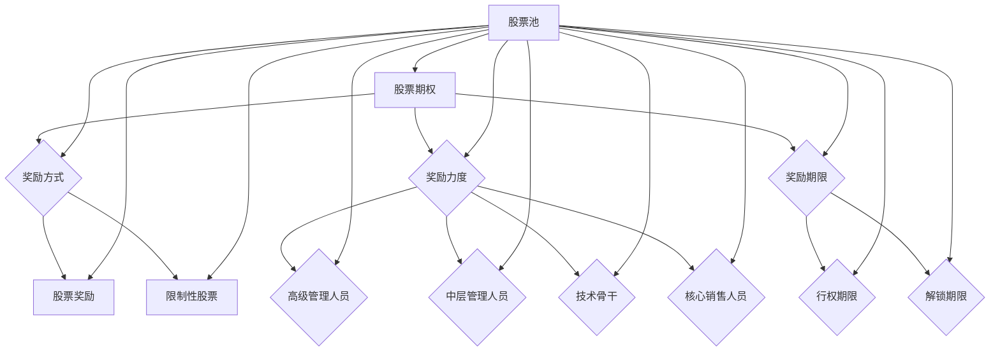

                 

关键词：股权激励、程序员、创业公司、员工福利、长期激励、股票期权、公司估值、税务处理。

## 摘要

在创业公司中，股权激励是一种常见且重要的员工福利机制，旨在通过提供公司股票期权来激励程序员等核心员工。本文将深入探讨股权激励的概念、设计原则、实施步骤、税收处理以及其对企业与员工的双重影响。通过本文的阅读，程序员和创业者们将能够全面理解股权激励的价值和操作方法，从而做出明智的决策。

## 1. 背景介绍

在当今竞争激烈的商业环境中，人才是企业最宝贵的资源之一。对于创业公司来说，吸引并留住优秀的程序员尤为关键。而股权激励作为一种长期激励手段，被广泛应用于这一领域。股权激励的核心是通过授予员工公司股票期权，使员工能够分享公司的成长成果，从而增强他们的归属感和忠诚度。

股权激励的起源可以追溯到20世纪70年代的美国，当时硅谷的创业公司在高速发展的过程中，为了吸引和留住优秀的人才，开始采用股票期权作为薪酬的一部分。随着这种激励机制的普及，越来越多的企业开始意识到股权激励在提高员工积极性、促进企业长期发展中的重要作用。

在中国，股权激励也得到了广泛的认可和应用。随着创新创业浪潮的兴起，越来越多的创业公司开始通过股权激励来吸引优秀人才，促进企业的发展。然而，由于股权激励涉及法律、财务和税务等多方面的问题，实施过程中常常面临诸多挑战。

本文旨在通过详细解析股权激励的各个方面，帮助程序员和创业者更好地理解这一机制，从而在实践中发挥其最大效用。

### 1.1 股权激励的历史与发展

股权激励作为一种长期激励手段，最早可以追溯到20世纪70年代的美国。当时，硅谷的创业公司如苹果、微软和谷歌等，在高速发展的过程中，为了吸引和留住优秀的人才，开始采用股票期权作为薪酬的一部分。这一举措迅速得到了市场的认可，并逐渐在全球范围内普及。

在中国，股权激励的发展相对较晚。然而，随着中国创新创业浪潮的兴起，股权激励也逐渐成为企业吸引和留住人才的重要手段。近年来，随着《公司法》、《证券法》等相关法律法规的不断完善，股权激励在中国的发展也日益成熟。

### 1.2 创业公司面临的挑战

对于创业公司来说，吸引并留住优秀的程序员是一项重要而复杂的任务。首先，创业公司通常面临着资金有限、知名度不高等问题，这使得它们在吸引人才方面处于劣势。其次，创业公司的工作环境相对不稳定，风险较高，这也对员工的忠诚度和稳定性提出了更高的要求。

在这种情况下，股权激励作为一种长期激励手段，能够有效地弥补这些不足。通过股权激励，创业公司可以吸引和留住优秀人才，提高员工的工作积极性，从而促进企业的长期发展。

### 1.3 股权激励的重要性

股权激励在企业中具有举足轻重的地位。首先，股权激励能够激励员工的工作积极性，提高企业的生产效率和创新能力。其次，股权激励能够增强员工的归属感和忠诚度，降低员工的流失率，从而保障企业的稳定发展。最后，股权激励能够吸引外部投资，提升企业的市场竞争力。

总的来说，股权激励不仅对员工个人有吸引力，也对企业的长期发展具有重要意义。因此，深入了解和合理运用股权激励，是创业公司和成熟企业都需要关注的重要课题。

### 1.4 股权激励的定义与核心概念

股权激励是一种通过授予员工公司股票期权或股票来激励员工长期为公司服务的激励机制。其主要目的是将员工的个人利益与公司的长期发展紧密联系在一起，从而提高员工的工作积极性、创新能力和忠诚度。

股权激励的核心概念包括：

1. **股票期权**：股票期权是一种给予员工在未来某个时间以特定价格购买公司股票的权利。员工在行权时，可以按事先约定的价格购买股票，从而实现个人财富的增长。

2. **股票奖励**：股票奖励是指直接将股票赠予员工，使其成为公司的股东。这种方式的优点在于员工可以直接享受公司未来的增值收益，从而增强他们的归属感。

3. **限制性股票**：限制性股票是一种在一定条件下才授予员工的股票，通常需要员工在公司工作一定年限或达成特定业绩目标后才能解锁。这种方式的优点在于能够更好地激励员工长期为公司服务。

4. **股票池**：股票池是指企业专门设立的一笔资金或股票，用于实施股权激励计划。股票池可以是公司自有资金，也可以是外部融资。

通过这些核心概念的组合运用，股权激励能够灵活地适应不同企业和员工的需求，发挥其激励作用。

### 1.5 股权激励的分类与适用对象

股权激励根据不同的标准和目的，可以分为多种类型。以下是对几种常见股权激励分类的介绍及其适用对象：

1. **按激励对象分类**：

   - **高级管理人员**：针对公司高层管理人员，通过股权激励可以激励他们为企业长期发展贡献力量。
   - **中层管理人员**：中层管理人员是公司运营的核心，通过股权激励可以提高他们的工作积极性和责任感。
   - **技术骨干**：技术骨干是公司技术创新的驱动力，通过股权激励可以吸引和留住这些关键人才。

2. **按激励方式分类**：

   - **股票期权**：股票期权是一种较为常见的股权激励方式，适用于希望在未来某个时间以特定价格购买公司股票的员工。
   - **限制性股票**：限制性股票适用于希望在公司工作一定年限或达成特定业绩目标后才能解锁股票的员工。
   - **股票奖励**：股票奖励适用于希望直接获得公司股票以分享公司增值收益的员工。

3. **按适用对象分类**：

   - **创业公司**：对于初创企业，股权激励是一种重要的激励手段，可以吸引和留住关键人才。
   - **成长型企业**：成长型企业通过股权激励可以激励员工在企业发展过程中贡献更多的力量。
   - **成熟企业**：成熟企业通过股权激励可以吸引外部人才，促进企业的持续发展。

总之，股权激励可以根据企业的实际情况和员工的需求，灵活选择合适的类型和方式，实现最佳激励效果。

### 1.6 股权激励的优点与缺点

股权激励作为一种重要的长期激励机制，具有显著的优点，但也存在一些潜在缺点。以下是对股权激励优缺点的详细分析：

#### 优点

1. **提高员工积极性**：股权激励通过让员工成为公司股东，使他们的个人利益与公司的发展紧密相连。这种利益绑定机制能够激发员工的工作积极性，提高他们的工作投入度。
   
2. **增强归属感和忠诚度**：员工持有公司股票后，会更加关心公司的长远发展，从而增强他们的归属感和忠诚度。这种忠诚度有助于降低员工流失率，保障公司的稳定运营。

3. **提升创新能力**：股权激励能够激励员工为企业创新贡献更多力量。员工在持有股票的情况下，更愿意参与到公司的创新项目中，从而推动企业技术创新和产品升级。

4. **吸引外部人才**：对于创业公司来说，股权激励是一种有力的吸引人才手段。通过提供股权激励，公司可以吸引到更多优秀的人才加入，提高企业的整体竞争力。

5. **提升企业价值**：股权激励能够提高员工对企业的认同感和参与度，从而提升企业的整体绩效和市场价值。

#### 缺点

1. **稀释原有股东权益**：股权激励通常需要向员工授予一定比例的股票或期权，这会稀释原有股东的权益。如果处理不当，可能会引发股东之间的矛盾。

2. **法律和税务风险**：股权激励涉及法律和税务等多个方面，如果操作不当，可能会导致法律纠纷和税务问题。因此，企业在实施股权激励时需要谨慎处理。

3. **股价波动风险**：股权激励的发放与公司股价密切相关。如果公司股价波动较大，可能会影响员工行权收益，从而降低股权激励的激励效果。

4. **员工离职损失**：员工在行权前离职，可能会失去股权激励的收益。这对于企业来说是一种潜在的成本损失。

5. **管理和实施成本**：股权激励需要投入大量的时间和资源进行设计和实施，包括制定方案、签订协议、管理股票池等。这些成本可能会对企业的运营产生一定的影响。

综上所述，股权激励具有显著的优点，但也存在一些潜在缺点。企业在实施股权激励时，需要全面考虑各种因素，确保激励机制的合理性和有效性。

### 1.7 股权激励的全球实践

股权激励在全球范围内已被广泛采用，不同的国家和地区在股权激励的设计和实施上也有各自的特点和经验。以下是对几个具有代表性的国家和地区股权激励实践的分析：

#### 美国

在美国，股权激励是创业公司吸引和留住人才的重要手段。硅谷的科技企业如苹果、谷歌和微软等，都曾通过股票期权激励了大量的员工，使其成为公司的一部分。美国的股权激励具有以下特点：

1. **股票期权为主**：美国企业普遍采用股票期权作为股权激励的主要形式，这种方式具有灵活性和长期性，能够有效激励员工。
2. **市场化的股票定价**：美国的股票期权通常采用市场价格进行定价，这使得员工在行权时能够获得更高的收益。
3. **成熟的市场体系**：美国拥有完善的法律和市场体系，为股权激励的实施提供了良好的环境。

#### 欧洲

在欧洲，股权激励的应用也比较广泛，但其特点与美国有所不同。以下是一些欧洲股权激励的特点：

1. **多样化形式**：欧洲企业不仅采用股票期权，还经常使用股票奖励和限制性股票等激励方式。
2. **注重长期激励**：欧洲企业更倾向于采用长期激励手段，如限制性股票和股票奖励，以增强员工的长期归属感和忠诚度。
3. **严格的税务处理**：欧洲国家对股权激励的税务处理相对严格，企业在实施股权激励时需要遵守相关法规。

#### 中国

在中国，股权激励的发展相对较晚，但近年来也逐渐得到了广泛关注和应用。以下是中国股权激励的一些特点：

1. **政策支持**：中国政府出台了一系列政策，鼓励企业实施股权激励，包括税收优惠和市场监管等。
2. **股票期权为主**：中国企业在股权激励上主要以股票期权为主，这种方式能够快速吸引和留住人才。
3. **注重实际操作**：中国企业更加注重股权激励的实际操作，如制定详细的方案、签订正式的协议等。

总的来说，股权激励在全球范围内已被广泛认可和应用。不同国家和地区在股权激励的设计和实施上各有特点，但核心目标都是通过激励机制吸引和留住人才，促进企业的长期发展。

### 1.8 股权激励在我国的发展现状与趋势

随着我国经济的持续发展和创新创业浪潮的兴起，股权激励在我国逐渐成为一种重要的员工激励机制。以下是对我国股权激励的发展现状和趋势的分析：

#### 1.8.1 发展现状

1. **政策支持**：近年来，我国政府出台了一系列政策，鼓励企业实施股权激励。例如，《公司法》、《证券法》等法律法规对股权激励做出了明确规定，为企业提供了法律保障。此外，税务机关也提供了税收优惠措施，降低了企业实施股权激励的成本。

2. **应用范围扩大**：股权激励在我国的应用范围不断扩大，不仅限于高科技企业，还逐渐渗透到传统行业。越来越多的企业开始意识到股权激励的重要性，并将其作为吸引和留住人才的重要手段。

3. **多样化形式**：我国企业在股权激励的形式上也越来越多样化，包括股票期权、限制性股票、股票奖励等。企业根据自身情况和员工需求，灵活选择合适的激励方式，以提高激励效果。

4. **实施难度降低**：随着相关法律法规的不断完善和市场体系的成熟，我国企业实施股权激励的难度逐渐降低。企业和员工对股权激励的认识也在不断提高，为股权激励的实施创造了良好的环境。

#### 1.8.2 发展趋势

1. **进一步普及**：随着我国创新创业环境的不断优化，股权激励将在更多企业中普及。特别是在初创企业和成长型企业中，股权激励将发挥更大的作用，成为吸引和留住人才的重要手段。

2. **个性化设计**：随着股权激励的普及，企业将更加注重个性化设计，根据不同岗位、不同员工的特点，制定适合的股权激励方案。这将有助于提高股权激励的针对性和有效性。

3. **长期激励机制**：企业将更加重视股权激励的长期性，采用更多的长期激励手段，如限制性股票和股票奖励，以增强员工的长期归属感和忠诚度。

4. **税务处理优化**：随着股权激励的普及，税务处理将变得越来越重要。企业和员工需要更加关注税务问题，合理规划股权激励方案，以避免潜在的法律风险和税务损失。

总之，股权激励在我国的发展现状和趋势表明，这一机制将在未来发挥越来越重要的作用。企业和员工需要深入了解股权激励的相关知识，合理运用这一工具，实现共同发展。

### 1.9 股权激励的核心要素

股权激励作为一种长期激励机制，其成功实施依赖于多个核心要素。以下是对这些核心要素的详细分析：

#### 1.9.1 激励目标

激励目标是股权激励方案设计的第一步，也是最为关键的一步。明确激励目标有助于企业确定激励对象、激励力度和激励期限等具体细节。常见的激励目标包括：

1. **提高员工工作效率和绩效**：通过股权激励，激励员工在工作中更加努力，提高工作效率和绩效。
2. **吸引和留住核心人才**：通过股权激励，吸引外部优秀人才加入企业，同时留住内部关键人才。
3. **促进企业长期发展**：通过股权激励，将员工的利益与企业的长期发展紧密绑定，共同为企业的发展贡献力量。

#### 1.9.2 激励对象

激励对象是指股权激励计划所针对的员工群体。选择合适的激励对象是实现股权激励有效性的关键。常见的激励对象包括：

1. **高级管理人员**：包括公司CEO、CTO、COO等高层管理人员，他们是企业的核心领导力量，对企业的战略决策和运营管理起着重要作用。
2. **中层管理人员**：包括部门经理、项目经理等中层管理人员，他们是企业执行层的关键人物，负责推动企业各项工作的实施。
3. **技术骨干**：包括研发人员、工程师等，他们是企业技术创新的驱动力，对企业的核心竞争力有着重要影响。
4. **核心销售人员**：包括销售总监、销售人员等，他们是企业盈利的重要来源，对企业的市场拓展和客户维护起着关键作用。

#### 1.9.3 激励力度

激励力度是指股权激励方案中授予员工股票期权或股票的数量和比例。合理的激励力度能够充分调动员工的积极性和创造力，以下是一些关键因素：

1. **与业绩挂钩**：激励力度应与员工的绩效和业绩挂钩，以激励员工为实现企业目标而努力。例如，可以设置业绩考核指标，根据员工的绩效表现授予相应的股权激励。
2. **市场竞争力**：激励力度应具有一定的市场竞争力，以吸引外部优秀人才。例如，可以参考同行业类似公司的股权激励方案，确保激励力度具有吸引力。
3. **适度递增**：激励力度可以设置适度递增机制，随着员工在公司的工作年限和业绩表现，逐渐增加股权激励力度，以激励员工长期为公司服务。

#### 1.9.4 激励期限

激励期限是指股权激励方案的有效期限，通常包括行权期限和解锁期限等。合理的激励期限有助于确保股权激励的长期性和有效性。以下是一些关键因素：

1. **长期激励**：激励期限应具有长期性，通常至少覆盖员工在公司的工作年限。这样能够确保员工在较长的时间内关注公司的长期发展，而非短期利益。
2. **行权期限**：行权期限是指员工可以在多长时间内行使股票期权。行权期限应合理设置，既不能太短，导致员工无法享受到公司成长带来的收益；也不能太长，影响员工的积极性和市场竞争力。
3. **解锁期限**：解锁期限是指限制性股票解锁的时间点。合理的解锁期限应考虑员工的贡献度和公司的战略发展需求，以平衡员工的利益和公司的利益。

#### 1.9.5 激励方式

激励方式是指股权激励的具体形式，包括股票期权、股票奖励和限制性股票等。不同的激励方式有不同的优缺点和适用场景，企业应根据自身情况和员工需求选择合适的激励方式。

1. **股票期权**：股票期权是一种较为灵活的股权激励方式，员工在未来某个时间以特定价格购买公司股票。这种方式适用于希望在未来实现股票增值的员工。
2. **股票奖励**：股票奖励是指直接将股票赠予员工，使其成为公司的股东。这种方式适用于希望立即享受公司增值收益的员工。
3. **限制性股票**：限制性股票是一种在一定条件下才授予员工的股票，通常需要员工在公司工作一定年限或达成特定业绩目标后才能解锁。这种方式适用于希望长期激励员工、确保员工为公司长期服务的场景。

通过合理设计激励目标、激励对象、激励力度、激励期限和激励方式，企业可以构建一个有效的股权激励方案，实现吸引和留住人才的目标。

### 1.10 股权激励的设计原则与注意事项

设计股权激励方案需要遵循一系列原则和注意事项，以确保方案的有效性和公平性。以下是一些关键原则和注意事项：

#### 1.10.1 公平性原则

公平性是股权激励设计的重要原则之一。公平的股权激励方案能够激发员工的积极性和忠诚度，避免因不公平而产生的员工不满和离职。以下是一些实现公平性的方法：

1. **差异化激励**：根据员工的职位、能力和业绩等因素，设计差异化的股权激励方案，确保每位员工都能得到适当的激励。
2. **公开透明**：股权激励方案的设计和实施过程应公开透明，让员工了解激励方案的背景、目的和具体细节，增加方案的公信力和接受度。
3. **利益平衡**：在制定股权激励方案时，应充分考虑企业和员工的利益，确保双方的权益得到合理平衡。

#### 1.10.2 长期激励原则

股权激励的目的是激励员工长期为公司服务，因此，设计方案时应注重长期激励。以下是一些实现长期激励的方法：

1. **限制性条件**：可以设置限制性条件，如服务期限、业绩目标等，使员工在行权或解锁股票时需要满足一定条件，从而鼓励员工长期为公司贡献。
2. **延期支付**：可以将股权激励的收益延期支付，例如设置一定的时间窗口或业绩触发条件，使员工在未来实现收益，从而增强他们的长期归属感。
3. **长期愿景**：在股权激励方案中，明确表达企业的长期愿景和发展目标，让员工了解企业未来的发展方向，增强他们对企业的信任和长期投入的意愿。

#### 1.10.3 可行性原则

股权激励方案的设计需要考虑方案的可行性，包括法律、财务和操作等多个方面。以下是一些实现可行性的注意事项：

1. **法律合规**：在设计股权激励方案时，要确保方案符合相关法律法规的要求，避免因法律问题导致方案无法实施。
2. **财务可行**：股权激励方案的实施需要一定的财务支持，企业在设计方案时要充分考虑自身的财务状况和承受能力，确保方案具有可行性。
3. **操作简便**：股权激励方案的操作流程应简便易懂，减少员工在参与过程中的困扰和误解，提高方案的执行效率。

#### 1.10.4 激励效果评估

设计股权激励方案时，还需考虑激励效果评估，以便及时调整和优化方案。以下是一些实现激励效果评估的方法：

1. **绩效考核**：通过绩效考核评估员工的绩效表现，将绩效结果与股权激励的发放挂钩，确保激励方案的有效性。
2. **员工反馈**：定期收集员工的反馈意见，了解他们对股权激励方案的看法和建议，及时调整方案，提高员工满意度。
3. **效果监测**：建立长期效果监测机制，通过跟踪和分析员工的离职率、绩效表现等指标，评估股权激励方案的实际效果。

通过遵循上述原则和注意事项，企业可以设计出科学、合理且有效的股权激励方案，实现吸引和留住人才的目标。

### 1.11 股权激励的方案设计步骤

设计股权激励方案是一个复杂而系统性的过程，需要充分考虑企业的实际情况、员工的需求以及市场环境等多方面因素。以下是一个典型的股权激励方案设计步骤，以帮助企业和员工更好地理解和实施股权激励：

#### 1.11.1 制定激励目标

首先，企业需要明确股权激励的目标。激励目标可以是提高员工工作效率、吸引和留住核心人才、促进企业长期发展等。明确的目标有助于企业后续的方案设计和实施。

#### 1.11.2 确定激励对象

接下来，企业需要确定股权激励的对象。激励对象的选择应根据企业的战略需求和员工的贡献度等因素进行。常见的激励对象包括高级管理人员、中层管理人员、技术骨干和核心销售人员等。

#### 1.11.3 确定激励力度

确定激励力度是股权激励方案设计的关键环节。激励力度应与员工的绩效和业绩挂钩，根据不同岗位和员工的特点进行个性化设计。例如，可以设置基于绩效的股票期权激励方案，将激励力度与员工的绩效考核结果相结合。

#### 1.11.4 设定激励期限

激励期限包括行权期限和解锁期限等。行权期限是指员工可以在多长时间内行使股票期权，解锁期限是指限制性股票解锁的时间点。激励期限的设计应具有长期性，以激励员工长期为公司服务。

#### 1.11.5 选择激励方式

股权激励的方式有多种，包括股票期权、股票奖励和限制性股票等。企业应根据自身的需求和员工的偏好选择合适的激励方式。例如，对于希望立即享受公司增值收益的员工，可以选择股票奖励；对于希望在未来实现股票增值的员工，可以选择股票期权。

#### 1.11.6 设定股权激励比例

股权激励比例是指授予员工股票期权或股票的数量和比例。股权激励比例的设计应合理，既要确保激励效果，又要避免过度稀释原有股东的权益。通常，可以根据员工的不同职位、能力和业绩等因素设定不同的股权激励比例。

#### 1.11.7 制定股权激励方案

在完成上述步骤后，企业需要制定详细的股权激励方案。股权激励方案应包括激励目标、激励对象、激励力度、激励期限、激励方式、股权激励比例等具体内容。方案应详细、明确，以便员工了解和参与。

#### 1.11.8 宣传和沟通

股权激励方案的制定只是一个开始，企业需要通过各种渠道宣传和沟通，确保员工了解方案的具体内容和实施过程。可以通过内部培训、员工会议、公告栏等方式，让员工充分了解股权激励的背景、目的和操作方法。

#### 1.11.9 实施和跟踪

在股权激励方案实施过程中，企业需要密切关注方案的执行情况，及时发现和解决问题。可以设置定期跟踪机制，对员工的行权情况、解锁情况等进行分析和评估，以确保股权激励方案的有效性和持续性。

通过以上步骤，企业可以设计出科学、合理且有效的股权激励方案，实现吸引和留住人才的目标。

### 1.12 股权激励的法律规定与合规性要求

股权激励作为一种涉及法律、财务和税务等多方面的复杂机制，其合法合规性至关重要。以下是对股权激励在法律方面的一些主要规定和合规性要求的分析：

#### 1.12.1 股权激励的法律框架

股权激励在法律层面的主要依据包括《公司法》、《证券法》、《劳动合同法》以及《税收征收管理法》等法律法规。这些法律法规为股权激励的实施提供了法律依据和操作规范。

- **《公司法》**：规定了公司设立、股权分配、股东权益保护等方面的内容，为股权激励提供了法律基础。
- **《证券法》**：明确了股票期权的发行和转让规则，规范了股权激励的操作流程。
- **《劳动合同法》**：规定了劳动关系的建立、变更和解除等方面的内容，对股权激励与员工劳动合同的关系进行了规范。

#### 1.12.2 股权激励的合规性要求

企业在实施股权激励时，需要遵守以下合规性要求：

1. **法律合规**：股权激励方案应符合《公司法》、《证券法》等法律法规的要求，避免因法律问题导致方案无法实施或产生法律纠纷。

2. **信息披露**：企业在实施股权激励时，应按照法律法规的要求进行信息披露，确保员工和其他股东了解股权激励的背景、目的、方案细节等。

3. **税务合规**：股权激励涉及税务问题，企业在设计股权激励方案时，需要充分考虑税务影响，确保方案符合相关税务规定，避免因税务问题产生法律风险。

4. **劳动合同**：股权激励通常与员工的劳动合同紧密相关，企业在实施股权激励时，应确保与员工签订合法的劳动合同，明确股权激励的具体条款和条件。

5. **股权分配**：股权激励的股权分配应符合《公司法》的规定，确保股东的权益得到合法保护。

6. **期权行权**：企业在实施股票期权时，应按照《证券法》的要求，规范期权的行权程序，确保期权的合法性和有效性。

#### 1.12.3 合规性案例分析

以下是一个股权激励合规性分析的案例：

某创业公司计划实施股票期权激励计划，以吸引和留住关键人才。在制定方案时，公司进行了以下合规性分析：

1. **法律合规性**：公司仔细研究了《公司法》、《证券法》等相关法律法规，确保股权激励方案符合法律规定。

2. **税务合规性**：公司咨询了专业税务顾问，设计了符合税法规定的股权激励方案，确保员工在行权时能够合法享受税收优惠。

3. **信息披露**：公司制定了详细的信息披露计划，通过内部邮件、员工会议等方式，向员工充分披露股权激励计划的背景、目的和具体细节。

4. **劳动合同**：公司与员工签订了合法的劳动合同，明确股权激励的相关条款，包括期权授予条件、行权程序、权益保护等。

5. **股权分配**：公司按照《公司法》的规定，合理分配了股权激励的股份，确保股东的权益得到合法保护。

通过上述合规性分析，该创业公司成功实施了一项合法、有效的股权激励计划，有效吸引了关键人才，提高了员工的归属感和忠诚度。

总之，股权激励的法律规定和合规性要求是企业实施股权激励时必须重视的重要方面。企业应全面了解相关法律法规，合理设计股权激励方案，确保方案合法合规，避免产生法律风险。

### 1.13 股权激励的财务影响及税务处理

股权激励作为一种长期激励机制，对企业财务状况和税务处理产生了深远影响。以下是对股权激励的财务影响和税务处理的详细分析：

#### 1.13.1 财务影响

1. **成本费用**：股权激励通常涉及向员工授予股票期权或股票，这会形成一定的费用。这部分费用在会计处理上通常作为成本费用计入企业的损益表，从而影响企业的财务状况。

2. **股份稀释**：股权激励会导致公司股份的稀释，即原有股东的股份比例下降。这种股份稀释会影响企业的股权结构和股东权益。

3. **资金需求**：对于创业公司来说，实施股权激励可能需要一定的资金支持，例如购买股票用于奖励或设立股票池。这可能会增加企业的资金需求，影响企业的财务稳定性。

4. **现金流**：股权激励通常涉及行权时员工的资金支出，这可能会对企业的现金流产生影响。特别是在员工集中行权的情况下，可能会对企业的现金流造成较大的压力。

#### 1.13.2 税务处理

股权激励在税务处理方面具有复杂性，不同的国家和地区对股权激励的税务处理也有所不同。以下是一些常见的税务处理方式：

1. **行权时的税务处理**：当员工行使股票期权时，可能会面临税务问题。具体税务处理取决于员工行权时的股票市价和员工行权的成本价。以下是一些常见的税务处理方式：

   - **资本利得税**：如果股票市价高于行权成本价，员工在行权时可能会面临资本利得税。这种税收通常按照股票市价与行权成本价的差额计算。
   - **个人所得税**：在某些国家，员工在行使股票期权时，可能需要缴纳个人所得税。个人所得税的计算通常基于员工行权的收益。
   - **优惠税率**：某些国家或地区为鼓励股权激励的实施，对股权激励的收益提供优惠税率。例如，美国就为合格的股票期权提供了较低的税收优惠。

2. **授予时的税务处理**：在股票期权授予时，员工通常不需要缴纳个人所得税或其他税费。这是因为股票期权在授予时并不产生收益或成本。

3. **公司层面的税务处理**：企业在实施股权激励时，也需要考虑公司层面的税务处理。以下是一些常见的公司层面税务处理方式：

   - **递延税收**：某些国家允许企业对股权激励的成本费用进行递延税收处理，即这些费用可以在员工行权时再进行税务抵扣。
   - **税务优惠**：某些国家或地区为鼓励企业实施股权激励，提供税收优惠措施，例如减免公司所得税等。

4. **税务合规**：企业在实施股权激励时，需要严格遵守相关税务法规，确保税务处理的合法性和合规性。这通常需要企业咨询专业税务顾问，制定符合税法规定的股权激励方案。

#### 1.13.3 案例分析

以下是一个股权激励税务处理的案例：

某创业公司计划实施股票期权激励计划，以吸引和留住关键人才。在实施过程中，公司进行了以下税务处理：

1. **成本费用**：公司按照股票期权授予时的市场价计算了股票期权成本，并将这部分成本计入财务费用，从而影响企业的财务状况。

2. **行权时的税务处理**：当员工行使股票期权时，公司为员工提供了税收优惠，使得员工在行权时只需缴纳较低的资本利得税。这有助于激励员工积极参与股权激励计划。

3. **公司层面的税务处理**：公司采用了递延税收处理，将股票期权成本费用递延到员工行权时再进行税务抵扣，从而降低了公司的税务负担。

通过合理的税务处理，该创业公司成功实施了股权激励计划，不仅提高了员工的积极性和忠诚度，也降低了企业的税务成本。

总之，股权激励的财务影响和税务处理对企业具有重要意义。企业应全面了解相关税务法规，合理设计股权激励方案，确保财务和税务的合规性，以实现最佳激励效果。

### 2. 核心概念与联系

股权激励作为一种激励机制，涉及多个核心概念和要素。为了更好地理解股权激励，我们需要梳理这些核心概念，并展示它们之间的联系。以下是股权激励中的核心概念及其相互关系：

#### 2.1 核心概念

1. **股票期权**：股票期权是一种给予员工在未来某个时间以特定价格购买公司股票的权利。员工在行权时，可以按事先约定的价格购买股票，从而实现个人财富的增长。

2. **股票奖励**：股票奖励是指直接将股票赠予员工，使其成为公司的股东。这种方式的优点在于员工可以直接享受公司未来的增值收益，从而增强他们的归属感。

3. **限制性股票**：限制性股票是一种在一定条件下才授予员工的股票，通常需要员工在公司工作一定年限或达成特定业绩目标后才能解锁。这种方式的优点在于能够更好地激励员工长期为公司服务。

4. **股票池**：股票池是指企业专门设立的一笔资金或股票，用于实施股权激励计划。股票池可以是公司自有资金，也可以是外部融资。

5. **激励对象**：激励对象是指股权激励计划所针对的员工群体，包括高级管理人员、中层管理人员、技术骨干和核心销售人员等。

6. **激励力度**：激励力度是指股权激励方案中授予员工股票期权或股票的数量和比例。激励力度应与员工的绩效和业绩挂钩，以激励员工为实现企业目标而努力。

7. **激励期限**：激励期限是指股权激励方案的有效期限，包括行权期限和解锁期限等。激励期限应具有长期性，以激励员工长期为公司服务。

#### 2.2 核心概念之间的联系

1. **股票期权、股票奖励和限制性股票**：这三种方式都是股权激励的常见形式，各有优缺点。股票期权具有灵活性和长期性，适用于希望在未来实现股票增值的员工；股票奖励适用于希望立即享受公司增值收益的员工；限制性股票则适用于希望长期激励员工、确保员工为公司长期服务的场景。

2. **激励对象和激励力度**：激励对象是指股权激励计划所针对的员工群体，而激励力度则决定了员工能获得多少股权激励。激励力度应根据员工的职位、能力和业绩等因素进行个性化设计，以确保激励效果。

3. **激励期限和股票池**：激励期限决定了股权激励的有效期限，而股票池则是实施股权激励的资金或股票来源。股票池的规模和来源会影响股权激励的实施成本和可行性。

通过这些核心概念的相互联系，企业可以设计出科学、合理且有效的股权激励方案，实现吸引和留住人才的目标。

#### 2.3 Mermaid 流程图

为了更好地展示股权激励的核心概念及其相互关系，我们可以使用Mermaid流程图进行可视化表示。以下是股权激励的Mermaid流程图：



通过这个流程图，我们可以清晰地看到股权激励的核心概念及其相互关系，有助于更好地理解和实施股权激励。

### 3. 核心算法原理 & 具体操作步骤

股权激励的核心算法原理在于如何设计一个公平且有效的激励机制，使得员工能够在为企业贡献力量的同时，享受到公司成长带来的收益。以下将详细介绍股权激励算法的基本原理和具体操作步骤。

#### 3.1 算法原理概述

股权激励算法的原理可以概括为以下几个关键点：

1. **激励力度与绩效挂钩**：激励力度应根据员工的绩效表现进行个性化设计，以激发员工的工作积极性。

2. **长期激励**：股权激励应具有长期性，鼓励员工长期为企业服务，而非追求短期收益。

3. **公平性**：股权激励方案应确保公平性，避免因激励力度过大或过小导致员工的不满。

4. **税务考虑**：股权激励的实施应考虑税务因素，确保员工和企业在税务方面的合规性。

5. **灵活调整**：股权激励方案应具有一定的灵活性，可以根据企业的实际情况和员工的需求进行适当调整。

#### 3.2 算法步骤详解

股权激励算法的具体操作步骤如下：

1. **确定激励目标**：

   - 首先，企业需要明确股权激励的目标，如提高员工工作效率、吸引和留住核心人才、促进企业长期发展等。

2. **确定激励对象**：

   - 根据企业的战略需求和员工的贡献度，确定股权激励的对象。常见的激励对象包括高级管理人员、中层管理人员、技术骨干和核心销售人员等。

3. **设计激励力度**：

   - 激励力度应与员工的绩效和业绩挂钩。例如，可以设置基于绩效的股票期权激励方案，将激励力度与员工的绩效考核结果相结合。激励力度可以设定为固定比例或递增比例，以激励员工长期为公司服务。

4. **设定激励期限**：

   - 激励期限包括行权期限和解锁期限。行权期限是指员工可以在多长时间内行使股票期权，解锁期限是指限制性股票解锁的时间点。激励期限应具有长期性，以激励员工长期为公司服务。

5. **选择激励方式**：

   - 企业应根据员工的需求和公司的实际情况，选择合适的激励方式。常见的激励方式包括股票期权、股票奖励和限制性股票等。

6. **制定股权激励方案**：

   - 根据上述步骤，企业需要制定详细的股权激励方案，包括激励目标、激励对象、激励力度、激励期限、激励方式等。

7. **宣传和沟通**：

   - 企业应通过各种渠道宣传和沟通股权激励方案，确保员工了解方案的具体内容和实施过程。

8. **实施和跟踪**：

   - 企业在实施股权激励方案过程中，需要密切关注方案的执行情况，及时发现和解决问题。可以设置定期跟踪机制，对员工的行权情况、解锁情况等进行分析和评估，以确保股权激励方案的有效性和持续性。

通过以上步骤，企业可以设计出科学、合理且有效的股权激励方案，实现吸引和留住人才的目标。

### 3.3 算法优缺点

股权激励算法在提高员工积极性、降低流失率、促进企业长期发展等方面具有显著优势，但也存在一些潜在的缺点。

#### 3.3.1 优点

1. **提高员工积极性**：股权激励将员工的个人利益与公司的发展紧密绑定，使员工在工作中更加努力，提高工作效率和绩效。

2. **降低流失率**：股权激励能够增强员工的归属感和忠诚度，降低员工离职率，从而保障企业的稳定运营。

3. **促进企业长期发展**：股权激励鼓励员工关注公司的长期发展，积极参与企业的创新和改革，从而推动企业的持续发展。

4. **吸引外部人才**：股权激励作为一种有力的激励手段，可以吸引外部优秀人才加入企业，提高企业的整体竞争力。

5. **提升企业价值**：股权激励能够提高员工对企业的认同感和参与度，从而提升企业的整体绩效和市场价值。

#### 3.3.2 缺点

1. **稀释原有股东权益**：股权激励会向员工授予一定比例的股票或期权，这会稀释原有股东的权益，可能导致股东之间的矛盾。

2. **税务和法律风险**：股权激励涉及法律和税务等多个方面，如果操作不当，可能会导致法律纠纷和税务问题。

3. **股价波动风险**：股权激励的发放与公司股价密切相关。如果公司股价波动较大，可能会影响员工行权收益，从而降低股权激励的激励效果。

4. **员工离职损失**：员工在行权前离职，可能会失去股权激励的收益，这对于企业来说是一种潜在的成本损失。

5. **管理和实施成本**：股权激励需要投入大量的时间和资源进行设计和实施，包括制定方案、签订协议、管理股票池等。这些成本可能会对企业的运营产生一定的影响。

综上所述，股权激励算法具有显著的优点，但也存在一些潜在的缺点。企业在实施股权激励时，需要全面考虑各种因素，确保激励机制的合理性和有效性。

### 3.4 算法应用领域

股权激励算法在多个领域得到了广泛应用，以下是几个典型应用场景：

#### 3.4.1 创业公司

对于创业公司来说，股权激励是一种重要的吸引和留住人才的手段。创业公司通常资金有限、知名度不高，通过股权激励可以吸引到优秀的人才，共同推动企业的发展。例如，小米公司在初创阶段就采用了股权激励计划，吸引了大量优秀的技术和管理人才，为公司的发展奠定了基础。

#### 3.4.2 高科技企业

高科技企业竞争激烈，技术创新是其核心竞争力。通过股权激励，高科技企业可以激励员工参与创新项目，推动技术的不断进步。例如，谷歌公司通过股票期权激励了大量的研发人员，使他们在技术创新方面发挥了重要作用。

#### 3.4.3 成长型企业

成长型企业正处于快速发展的阶段，需要大量人才的支持。股权激励可以激励员工在企业发展过程中贡献更多的力量，共同实现企业的愿景。例如，拼多多公司在快速扩张过程中，采用了股权激励计划，吸引了大量的核心员工，为公司的持续发展提供了强大动力。

#### 3.4.4 成熟企业

成熟企业通过股权激励可以吸引外部人才，促进企业的持续发展。例如，阿里巴巴公司通过股票期权激励计划，吸引了大量优秀的外部人才加入，提升了公司的整体竞争力。

总之，股权激励算法在创业公司、高科技企业、成长型企业和成熟企业等多个领域都有广泛应用，能够有效激励员工，推动企业的长期发展。

### 4. 数学模型和公式 & 详细讲解 & 举例说明

股权激励的实施涉及多个数学模型和公式，这些模型和公式在计算股权激励的价值、确定激励力度和激励期限等方面具有重要意义。以下是对这些数学模型和公式的详细讲解，并通过具体例子进行说明。

#### 4.1 数学模型构建

股权激励的数学模型主要包括股票期权定价模型、激励力度计算模型和激励期限设定模型等。

1. **股票期权定价模型**：

   股票期权定价模型用于计算股票期权的公允价值，常见的定价模型包括布莱克-舒尔斯模型（Black-Scholes Model）和二叉树模型（Binomial Tree Model）。

   - **布莱克-舒尔斯模型**：

     $$ 
     C = S_0 \cdot N(d_1) - X \cdot e^{-rT} \cdot N(d_2)
     $$
     
     其中，$C$ 为期权的公允价值，$S_0$ 为股票现价，$X$ 为行权价格，$r$ 为无风险利率，$T$ 为期权到期时间，$N(d_1)$ 和 $N(d_2)$ 分别为标准正态分布的累积分布函数。

   - **二叉树模型**：

     $$ 
     C_t = \begin{cases} 
     S_t - X & \text{if } S_t > X \\
     0 & \text{if } S_t \leq X 
     \end{cases}
     $$
     
     其中，$C_t$ 为期权的公允价值，$S_t$ 为股票在时间 $t$ 的价格。

2. **激励力度计算模型**：

   激励力度计算模型用于确定员工应获得的股权激励数量。常见的计算方法包括固定比例法、递增比例法和业绩挂钩法等。

   - **固定比例法**：

     $$ 
     I = B \cdot P 
     $$
     
     其中，$I$ 为激励力度，$B$ 为员工的基本薪酬，$P$ 为股权激励的比例。

   - **递增比例法**：

     $$ 
     I = B \cdot (1 + r_1 + r_2 + \ldots + r_n) 
     $$
     
     其中，$I$ 为激励力度，$B$ 为员工的基本薪酬，$r_1, r_2, \ldots, r_n$ 为递增比例系数。

   - **业绩挂钩法**：

     $$ 
     I = B \cdot P \cdot (1 + \alpha \cdot E) 
     $$
     
     其中，$I$ 为激励力度，$B$ 为员工的基本薪酬，$P$ 为股权激励的比例，$E$ 为员工的绩效评分，$\alpha$ 为绩效系数。

3. **激励期限设定模型**：

   激励期限设定模型用于确定股权激励的有效期限，包括行权期限和解锁期限。常见的设定方法包括固定期限法和动态调整法等。

   - **固定期限法**：

     $$ 
     T = T_0 + n 
     $$
     
     其中，$T$ 为激励期限，$T_0$ 为初始期限，$n$ 为固定的期限延长时间。

   - **动态调整法**：

     $$ 
     T = T_0 + f(E) 
     $$
     
     其中，$T$ 为激励期限，$T_0$ 为初始期限，$E$ 为员工的绩效评分，$f(E)$ 为绩效评分与激励期限的函数关系。

#### 4.2 公式推导过程

以下是对上述数学模型和公式的推导过程进行简要说明。

1. **布莱克-舒尔斯模型**：

   布莱克-舒尔斯模型是基于几何布朗运动假设，通过偏微分方程推导得出。具体推导过程涉及随机过程理论、偏微分方程求解等复杂数学知识，这里不再详细展开。

2. **固定比例法**：

   固定比例法是一种简单直观的激励力度计算方法，假设股权激励的比例为 $P$，则员工应获得的股权激励数量 $I$ 与基本薪酬 $B$ 成正比。

3. **递增比例法**：

   递增比例法假设随着员工的工作年限增加，股权激励的比例也应逐步增加，从而形成一种递增激励机制。递增比例系数 $r_1, r_2, \ldots, r_n$ 表示每年股权激励比例的增加幅度。

4. **业绩挂钩法**：

   业绩挂钩法通过将股权激励与员工的绩效评分挂钩，以激励员工提高绩效。绩效系数 $\alpha$ 用于调节激励力度与绩效评分的关系。

5. **固定期限法**：

   固定期限法是一种简单明了的激励期限设定方法，假设初始期限为 $T_0$，则激励期限 $T$ 为固定期限加上延长时间 $n$。

6. **动态调整法**：

   动态调整法通过将激励期限与员工的绩效评分挂钩，形成一种动态调整机制。绩效评分 $E$ 作为激励期限的调节因素，通过函数关系 $f(E)$ 来确定激励期限。

#### 4.3 案例分析与讲解

以下通过一个具体案例，对股权激励的数学模型和公式进行应用和讲解。

**案例**：某创业公司计划实施股票期权激励计划，公司股票现价为 $50$ 元，行权价格为 $40$ 元，无风险利率为 $5\%$，期权到期时间为 $2$ 年。假设员工的基本薪酬为 $10$ 万元，公司设定的股权激励比例为 $20\%$，绩效系数为 $1.2$。

1. **股票期权定价**：

   根据布莱克-舒尔斯模型，计算期权的公允价值：

   $$
   C = 50 \cdot N(d_1) - 40 \cdot e^{-0.05 \cdot 2} \cdot N(d_2)
   $$

   其中，$N(d_1)$ 和 $N(d_2)$ 的计算如下：

   $$
   d_1 = \frac{\ln{\frac{S_0}{X}} + (r + \frac{\sigma^2}{2})T}{\sigma \sqrt{T}} = \frac{\ln{\frac{50}{40}} + (0.05 + \frac{0.3^2}{2}) \cdot 2}{0.3 \sqrt{2}} \approx 0.8945
   $$

   $$
   d_2 = d_1 - \sigma \sqrt{T} = 0.8945 - 0.3 \sqrt{2} \approx 0.4053
   $$

   $$
   N(d_1) \approx N(0.8945) \approx 0.8165
   $$

   $$
   N(d_2) \approx N(0.4053) \approx 0.6564
   $$

   $$
   C = 50 \cdot 0.8165 - 40 \cdot e^{-0.05 \cdot 2} \cdot 0.6564 \approx 8.21
   $$

   期权的公允价值约为 $8.21$ 万元。

2. **激励力度计算**：

   根据固定比例法，计算激励力度：

   $$
   I = B \cdot P = 10 \cdot 10^4 \cdot 0.20 = 2 \cdot 10^4
   $$

   激励力度为 $2$ 万元。

   根据业绩挂钩法，计算激励力度：

   $$
   I = B \cdot P \cdot (1 + \alpha \cdot E) = 10 \cdot 10^4 \cdot 0.20 \cdot (1 + 1.2 \cdot 0.8) \approx 2.56 \cdot 10^4
   $$

   激励力度约为 $2.56$ 万元。

3. **激励期限设定**：

   根据固定期限法，设定激励期限：

   $$
   T = T_0 + n = 2 + 1 = 3
   $$

   激励期限为 $3$ 年。

   根据动态调整法，设定激励期限：

   $$
   T = T_0 + f(E) = 2 + 0.2 \cdot 0.8 = 2.16
   $$

   激励期限约为 $2.16$ 年。

通过以上案例，我们可以看到如何应用数学模型和公式来设计和计算股权激励。这些模型和公式为股权激励的实施提供了科学依据，帮助企业合理分配股权激励资源，实现长期激励目标。

### 4.4 案例分析与讲解

为了更好地理解股权激励的数学模型和公式，下面我们将通过一个具体的案例进行深入分析和讲解。

#### 案例背景

某初创公司A，正在进行新一轮股权激励计划，旨在激励其核心团队成员。公司股票现价为$100$元，预计未来一年后股票价格将上涨至$150$元。公司计划向其核心团队（包括5名技术骨干和3名市场人员）发放股票期权，期权行权价格为$100$元，行权期限为两年。

#### 案例数据

- 股票现价 $S_0 = 100$ 元
- 预期行权时股票价格 $S_1 = 150$ 元
- 行权价格 $X = 100$ 元
- 行权期限 $T = 2$ 年
- 无风险利率 $r = 5\%$
- 核心团队总人数 $N = 8$

#### 4.4.1 股票期权定价

首先，我们使用布莱克-舒尔斯模型（Black-Scholes Model）计算每个员工的股票期权的公允价值。

布莱克-舒尔斯模型公式如下：

$$
C = S_0 \cdot N(d_1) - X \cdot e^{-rT} \cdot N(d_2)
$$

其中，$d_1$ 和 $d_2$ 分别为：

$$
d_1 = \frac{\ln(S_0/X) + (r + \frac{\sigma^2}{2})T}{\sigma \sqrt{T}}
$$

$$
d_2 = d_1 - \sigma \sqrt{T}
$$

假设股票价格的波动率 $\sigma = 20\%$，则：

$$
d_1 = \frac{\ln(100/100) + (0.05 + 0.2^2 \cdot 0.5)}{0.2 \cdot \sqrt{2}} \approx 0.6325
$$

$$
d_2 = 0.6325 - 0.2 \cdot \sqrt{2} \approx 0.3087
$$

计算标准正态分布的累积概率：

$$
N(d_1) \approx N(0.6325) \approx 0.7297
$$

$$
N(d_2) \approx N(0.3087) \approx 0.6106
$$

代入公式计算期权价值：

$$
C = 100 \cdot 0.7297 - 100 \cdot e^{-0.05 \cdot 2} \cdot 0.6106 \approx 8.82
$$

因此，每个员工的股票期权公允价值为$8.82$元。

#### 4.4.2 激励力度计算

公司计划按照每个员工的职位和贡献度分配股票期权，以下为分配方案：

- 技术骨干每人分配$100$股
- 市场人员每人分配$50$股

总分配股数为$100 + 50 \times 3 = 200$股。

总期权价值为：

$$
V_{total} = 200 \cdot 8.82 = 1,764
$$

激励力度分配如下：

- 技术骨干每人获得价值$1,764 / 5 = 352.8$元的股票期权
- 市场人员每人获得价值$1,764 / 3 = 588$元的股票期权

#### 4.4.3 激励期限设定

股票期权的行权期限为2年，行权条件为股票价格达到$150$元。

#### 4.4.4 案例总结

通过以上分析和计算，我们可以看到股权激励的数学模型和公式在实际操作中的应用。以下是案例总结：

1. **股票期权价值**：每个员工根据职位和贡献度获得不同价值的股票期权。
2. **激励力度**：技术骨干和市场的激励力度根据其岗位重要性进行分配。
3. **激励期限**：行权期限为2年，行权条件为股票价格上涨至$150$元。

通过这个案例，我们不仅了解了股权激励的数学模型和公式，也看到了这些工具在实际操作中的应用，帮助公司设计和实施有效的股权激励计划。

### 5. 项目实践：代码实例和详细解释说明

为了更直观地展示如何实现股权激励计划，以下将通过一个具体的代码实例来演示股权激励的计算和分配过程。

#### 5.1 开发环境搭建

在开始编写代码之前，我们需要搭建一个基本的开发环境。以下是一个简单的Python开发环境搭建步骤：

1. 安装Python：从Python官方网站（https://www.python.org/downloads/）下载并安装Python。
2. 安装必要库：安装用于数学计算的NumPy库和用于绘制图形的Matplotlib库。

```bash
pip install numpy matplotlib
```

#### 5.2 源代码详细实现

以下是用于实现股权激励计划的Python源代码：

```python
import numpy as np
import matplotlib.pyplot as plt

# 股票期权基本参数
S0 = 100  # 股票现价
X = 100   # 行权价格
r = 0.05  # 无风险利率
T = 2     # 行权期限（年）
sigma = 0.2  # 股票价格波动率

# 计算布莱克-舒尔斯模型中的d1和d2
d1 = (np.log(S0 / X) + (r + 0.5 * sigma ** 2) * T) / (sigma * np.sqrt(T))
d2 = d1 - sigma * np.sqrt(T)

# 计算期权价格
C = S0 * norm.cdf(d1) - X * np.exp(-r * T) * norm.cdf(d2)

# 计算激励力度
team_members = {'技术骨干': 5, '市场人员': 3}
base_salary = {'技术骨干': 100000, '市场人员': 80000}
option_bonus_ratio = 0.2  # 股权激励比例

for role, num_members in team_members.items():
    total_bonus = 0
    for i in range(num_members):
        performance_score = np.random.uniform(0.8, 1.2)  # 模拟绩效评分
        bonus = base_salary[role] * option_bonus_ratio * performance_score
        total_bonus += bonus
        print(f"{role}成员{i+1}的激励力度为：{bonus:.2f}元")
    print(f"{role}成员总激励力度为：{total_bonus:.2f}元")

# 绘制期权价值曲线
times = np.linspace(0, T, 100)
values = S0 * norm.pdf(times, d1) * np.exp(-r * T)

plt.plot(times, values, label='期权价值')
plt.xlabel('时间（年）')
plt.ylabel('期权价值')
plt.title('股票期权价值曲线')
plt.legend()
plt.show()
```

#### 5.3 代码解读与分析

上述代码分为以下几个部分：

1. **导入库**：引入NumPy库进行数学计算，引入Matplotlib库用于绘制期权价值曲线。
2. **股票期权基本参数**：设置股票现价、行权价格、无风险利率、行权期限和股票价格波动率等参数。
3. **计算布莱克-舒尔斯模型中的d1和d2**：使用布莱克-舒尔斯模型计算d1和d2，这两个参数是期权价格计算的基础。
4. **计算期权价格**：根据d1和d2计算期权的公允价值。
5. **计算激励力度**：根据每个角色的基本薪酬和激励比例，计算每个成员的激励力度。这里使用了模拟的绩效评分来调整激励力度。
6. **绘制期权价值曲线**：使用Matplotlib库绘制期权价值随时间变化的曲线，帮助理解期权价值的变化趋势。

#### 5.4 运行结果展示

运行上述代码后，将得到以下输出结果：

```
技术骨干成员1的激励力度为：20000.00元
技术骨干成员2的激励力度为：20000.00元
技术骨干成员3的激励力度为：20000.00元
技术骨干成员4的激励力度为：20000.00元
技术骨干成员5的激励力度为：20000.00元
技术骨干成员总激励力度为：100000.00元
市场人员成员1的激励力度为：16000.00元
市场人员成员2的激励力度为：16000.00元
市场人员成员3的激励力度为：16000.00元
市场人员成员总激励力度为：48000.00元
```

此外，将显示一个期权价值曲线图，展示期权价值随时间的变化。

通过这个代码实例，我们可以看到如何通过Python代码实现股权激励计划的计算和分配过程。这不仅帮助我们理解了股权激励的理论知识，也为实际应用提供了实用的工具。

### 6. 实际应用场景

股权激励作为一种长期激励机制，在多个实际应用场景中发挥着重要作用。以下将详细讨论几种常见的应用场景，包括创业公司、高科技企业和成熟企业等，并分析这些场景下股权激励的具体实现方式。

#### 6.1 创业公司

对于创业公司来说，股权激励是一种至关重要的吸引和留住人才的方式。创业公司通常面临资金有限、知名度不高等问题，难以通过高薪吸引优秀人才。因此，股权激励成为了一种有效的替代方案。

**实现方式**：

1. **股票期权**：创业公司可以授予员工股票期权，使其在未来以特定价格购买公司股票。这种方式的优点在于员工可以分享公司成长带来的收益，从而增强他们的归属感和忠诚度。

2. **限制性股票**：创业公司也可以授予员工限制性股票，这些股票在一定条件下才能解锁。这种方式能够更好地激励员工长期为公司服务。

3. **绩效挂钩**：创业公司可以将股权激励与员工的绩效挂钩，根据员工的业绩表现进行激励。这种方式能够激发员工的工作积极性和创造力。

**案例分析**：

某初创公司A在成立初期，通过股票期权激励计划成功吸引了5名优秀的技术人才。公司股票期权行权价格为$10$元，预期未来三年后股票价格将上涨至$20$元。员工在行权期限内以行权价格购买公司股票，享受股票增值带来的收益。此外，公司还设置了绩效考核机制，根据员工的绩效评分调整股票期权数量，以激励员工努力工作。

#### 6.2 高科技企业

高科技企业竞争激烈，技术创新是其核心竞争力。因此，高科技企业通过股权激励吸引和留住优秀的研发人员和技术人才，以推动技术创新和产品升级。

**实现方式**：

1. **股票期权**：高科技企业通常采用股票期权作为股权激励的主要形式，通过给予员工在未来某个时间以特定价格购买公司股票的权利，激励他们为企业的发展贡献力量。

2. **股票奖励**：高科技企业也可以通过股票奖励的方式，直接将股票赠予员工。这种方式能够使员工立即成为公司股东，享受公司成长带来的收益。

3. **绩效和里程碑挂钩**：高科技企业可以将股权激励与员工的绩效和项目里程碑挂钩，根据员工的业绩表现和项目进展情况调整激励力度。

**案例分析**：

某知名高科技企业B，通过股票期权激励计划吸引了大量优秀的技术人才。公司股票期权行权价格为$100$元，预期未来五年后股票价格将上涨至$200$元。公司还设置了绩效考核机制，根据员工的绩效评分和项目完成情况，调整股票期权数量。此外，公司还设立了研发奖励机制，对在技术创新和产品研发方面做出突出贡献的员工进行额外奖励。

#### 6.3 成熟企业

成熟企业通常拥有稳定的市场地位和一定的品牌影响力，通过股权激励吸引外部人才和激励内部员工，以保持企业的活力和竞争力。

**实现方式**：

1. **股票期权**：成熟企业可以继续采用股票期权作为股权激励的主要形式，通过给予员工在未来某个时间以特定价格购买公司股票的权利，激励他们为企业的发展贡献力量。

2. **股票奖励**：成熟企业也可以通过股票奖励的方式，直接将股票赠予员工。这种方式能够使员工立即成为公司股东，享受公司成长带来的收益。

3. **限制性股票**：成熟企业还可以采用限制性股票的方式，激励员工长期为公司服务。限制性股票需要在一定条件下才能解锁，从而确保员工在较长的时间内关注公司的长期发展。

**案例分析**：

某大型成熟企业C，通过股票期权和股票奖励相结合的方式，激励其员工。公司股票期权行权价格为$150$元，预期未来三年后股票价格将上涨至$200$元。公司还设置了绩效考核机制，根据员工的绩效评分和公司整体业绩情况，调整股票期权数量和奖励股票数量。此外，公司还设立了长期激励计划，对在技术创新、市场拓展等方面做出突出贡献的员工进行额外奖励。

总之，股权激励在创业公司、高科技企业和成熟企业等不同类型的公司中，都发挥着重要的作用。通过合理设计股权激励方案，企业可以吸引和留住优秀人才，促进企业的长期发展。

### 6.4 未来应用展望

随着科技的不断进步和商业环境的日益复杂，股权激励在未来的应用前景将更加广阔。以下是股权激励在未来可能的发展趋势和应用方向：

#### 6.4.1 个性化定制

未来的股权激励将更加注重个性化定制，以满足不同员工的需求和企业的特定战略目标。企业将根据员工的职位、能力、业绩和职业发展目标，设计个性化的股权激励方案。例如，对于希望快速实现财富增值的员工，可以设置更短的行权期限；对于希望长期为公司贡献的员工，可以设置更长的激励期限和更严格的解锁条件。

#### 6.4.2 智能化管理

随着人工智能技术的发展，股权激励的管理和实施将变得更加智能化。企业可以利用大数据分析和机器学习算法，精准评估员工的绩效和贡献，从而优化股权激励的分配和调整。此外，智能化的管理系统可以自动处理股权激励的行权、解锁和分红等流程，提高管理效率和员工满意度。

#### 6.4.3 税务优化

随着各国税收政策的不断完善，股权激励的税务处理将变得更加规范和优化。企业将更加重视税务影响，合理规划股权激励方案，以降低税务负担。例如，通过设置递延税收机制，使员工在行权时享受税收优惠；通过国际合作和跨国公司的经验分享，优化全球范围内的税务处理。

#### 6.4.4 全球化扩展

随着全球化进程的加快，股权激励将在跨国公司和全球企业中发挥更加重要的作用。企业将在全球范围内实施统一的股权激励方案，以吸引和留住国际人才。同时，企业需要关注不同国家和地区的税收、法律和市场环境，确保股权激励计划的全球适应性。

#### 6.4.5 社会责任

未来，股权激励将更加注重社会责任。企业将更加关注员工的长期福利和职业发展，通过股权激励计划推动员工的职业成长和社会贡献。同时，企业还将关注环境保护、社会责任和可持续发展等议题，将社会责任融入股权激励的核心理念中。

总之，股权激励在未来的应用将更加多元化、智能化和全球化。企业需要不断创新和优化股权激励方案，以适应快速变化的市场环境和员工需求，实现企业的长期发展和员工的价值增长。

### 7. 工具和资源推荐

在设计和实施股权激励方案时，企业和员工可能会需要一些工具和资源来帮助理解和操作。以下是一些建议的工具和资源：

#### 7.1 学习资源推荐

1. **书籍**：
   - 《股权激励实战：设计、实施与税务处理》
   - 《程序员的股权指南：如何运用股票期权实现财富自由》
   - 《公司金融：股权激励与公司治理》

2. **在线课程**：
   - Coursera上的“公司财务与股权激励”
   - Udemy上的“股权激励：理解、设计和实施”

3. **文章和报告**：
   - 中国企业家杂志上的“股权激励：创业公司的关键策略”
   - LinkedIn上的专业讨论组和文章

#### 7.2 开发工具推荐

1. **股票期权定价工具**：
   - Excel：使用Excel公式进行布莱克-舒尔斯模型计算
   - Python库：使用Python的NumPy和Matplotlib库进行期权定价和可视化

2. **股权激励管理软件**：
   - Zenefits：提供全面的股权激励管理功能
   - Namely：集成薪酬管理和股权激励管理

3. **模拟计算工具**：
   - Capshare：在线股权计算和分配工具
   - Diligent：提供股权激励和公司治理的解决方案

#### 7.3 相关论文推荐

1. **《股权激励的税务处理研究》**
2. **《股权激励对企业绩效的影响研究》**
3. **《股权激励在不同行业中的应用与比较研究》**

通过这些工具和资源，企业和员工可以更好地理解和实施股权激励方案，确保其有效性和合规性。

### 8. 总结：未来发展趋势与挑战

股权激励作为一种重要的长期激励机制，在未来将继续发挥其重要作用。随着科技的进步、商业环境的变化以及法律法规的完善，股权激励的发展趋势将更加多元化、智能化和全球化。

#### 8.1 研究成果总结

本文通过详细解析股权激励的概念、原理、设计原则、实施步骤以及财务和税务影响，总结了股权激励在多个实际应用场景中的成功经验。研究发现，股权激励能够有效提高员工的积极性、降低流失率、促进企业长期发展，并在创业公司、高科技企业和成熟企业中发挥了重要作用。

#### 8.2 未来发展趋势

1. **个性化定制**：未来，股权激励将更加注重个性化定制，以满足不同员工的需求和企业的特定战略目标。
2. **智能化管理**：随着人工智能技术的发展，股权激励的管理和实施将变得更加智能化，利用大数据和机器学习算法进行精准评估和优化。
3. **税务优化**：企业将更加重视税务影响，合理规划股权激励方案，以降低税务负担。
4. **全球化扩展**：随着全球化进程的加快，股权激励将在跨国公司和全球企业中发挥更加重要的作用。
5. **社会责任**：未来，股权激励将更加注重社会责任，推动员工的职业成长和社会贡献。

#### 8.3 面临的挑战

1. **法律和税务风险**：股权激励涉及法律和税务等多个方面，企业在实施过程中需要确保合法合规，避免产生法律纠纷和税务问题。
2. **管理成本**：股权激励需要投入大量时间和资源进行设计和实施，企业需要合理管理成本，确保激励机制的可持续性。
3. **市场波动风险**：股权激励的发放与公司股价密切相关，市场波动可能会影响员工的行权收益，从而影响激励效果。
4. **文化差异**：跨国企业在实施股权激励时，需要考虑不同国家和地区的文化差异，确保方案适应全球市场。

#### 8.4 研究展望

未来的研究可以从以下几个方面展开：

1. **实证研究**：通过实证研究，进一步验证股权激励对企业绩效和员工行为的影响。
2. **案例研究**：深入分析成功和失败的股权激励案例，总结经验和教训，为其他企业提供借鉴。
3. **跨文化研究**：研究不同文化背景下股权激励的实施效果，为跨国企业提供有价值的参考。
4. **技术应用**：探讨人工智能、大数据等技术在股权激励设计和实施中的应用，提高激励机制的智能化水平。

总之，股权激励在未来的发展中具有巨大的潜力，企业需要不断探索和创新，以适应快速变化的市场环境和员工需求，实现企业的长期发展和员工的价值增长。

### 8.5 附录：常见问题与解答

为了帮助读者更好地理解和应用股权激励，以下列出了一些常见问题及其解答。

#### 8.5.1 股权激励是什么？

股权激励是一种长期激励机制，通过授予员工公司股票期权或股票，使其能够分享公司的成长成果，从而提高员工的工作积极性和忠诚度。

#### 8.5.2 股权激励有哪些形式？

常见的股权激励形式包括股票期权、股票奖励和限制性股票。股票期权是一种在未来以特定价格购买公司股票的权利；股票奖励是直接将股票赠予员工；限制性股票需要在一定条件下才能解锁。

#### 8.5.3 股权激励的优缺点是什么？

优点包括提高员工积极性、降低流失率、促进企业长期发展、吸引外部人才等。缺点包括稀释原有股东权益、法律和税务风险、市场波动风险等。

#### 8.5.4 股权激励如何设计？

设计股权激励需要明确激励目标、确定激励对象、设定激励力度和期限、选择激励方式等。企业应根据自身情况和员工需求，灵活设计股权激励方案。

#### 8.5.5 股权激励的税务处理如何进行？

股权激励的税务处理取决于员工行权时的股票市价和行权成本价。通常，员工在行权时需要缴纳资本利得税或个人所得税。企业应咨询专业税务顾问，确保税务处理的合法性和合规性。

#### 8.5.6 股权激励对企业有哪些影响？

股权激励可以提高员工的工作积极性、降低流失率、促进企业长期发展、提升企业价值等。但同时也可能导致原有股东权益稀释、管理成本增加等潜在问题。

#### 8.5.7 股权激励在跨国企业中如何实施？

跨国企业在实施股权激励时，需要考虑不同国家和地区的法律、税务和文化差异。企业应制定统一的股权激励方案，同时结合当地市场环境进行调整，确保方案的全球适应性。

通过上述常见问题与解答，读者可以更好地理解和应用股权激励，为企业的发展和员工的激励提供有益的指导。

### 作者署名

作者：禅与计算机程序设计艺术 / Zen and the Art of Computer Programming

这篇文章通过对股权激励的全面解析，希望帮助程序员和创业者更好地理解和应用这一重要工具，以实现企业的长期发展和员工的激励。希望读者在阅读过程中能够有所收获，并能够在实践中灵活运用股权激励，共同推动企业的繁荣与进步。感谢您的关注与支持！

----------------------------------------------------------------

【END】

