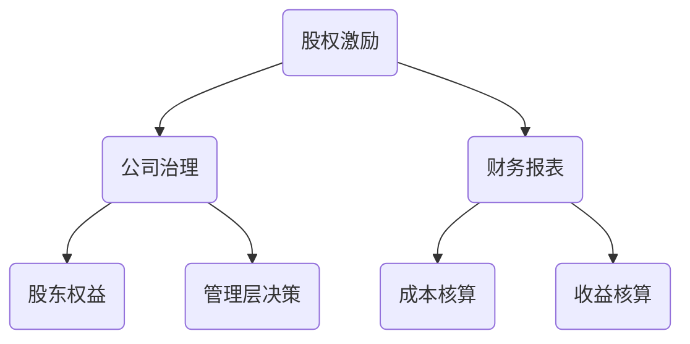

                 

  
## 1. 背景介绍

在现今的商业环境中，股权激励已经成为企业吸引和留住优秀人才的重要手段之一。对于程序员来说，尤其是在科技行业中，股权激励不仅能提供长期的财务回报，还能增强他们对公司的归属感和忠诚度。然而，如何合理地设计和管理股权激励计划，以确保程序员的收益最大化，这是一个复杂而具有挑战性的问题。

本文旨在探讨程序员的股权激励问题，分析不同类型的股权激励模式，并从财务、管理和法律等多个角度提出优化建议。通过深入剖析股权激励的核心概念、计算方法及其在企业运营中的应用，我们希望能够为程序员和企业提供有价值的参考。

本文将分为以下几个部分：

1. **核心概念与联系**：介绍股权激励的基本概念，并通过Mermaid流程图展示其与公司治理、财务报表等之间的关系。
2. **核心算法原理与操作步骤**：详细解析股权激励的计算方法，包括授予、行权和股票价值评估等。
3. **数学模型和公式**：构建数学模型，推导股权激励相关的公式，并通过案例进行说明。
4. **项目实践：代码实例**：提供一个具体的股权激励计算程序的实现，并进行分析。
5. **实际应用场景**：探讨股权激励在企业和程序员个人层面的应用案例。
6. **未来应用展望**：分析股权激励的发展趋势和潜在挑战。
7. **工具和资源推荐**：推荐相关学习资源和开发工具。
8. **总结**：总结研究成果，展望未来发展趋势与挑战。

通过这篇文章，我们希望读者能够对股权激励有更深入的理解，并能够在实践中运用这些知识，实现收益最大化。

## 2. 核心概念与联系

### 股权激励的概念

股权激励是指公司通过授予股票或股票期权等方式，让员工在未来某个时间点以预定价格购买公司股票，从而与公司共同分享未来的收益。这种激励方式不仅能激发员工的积极性，提高工作效率，还能增强员工对公司的忠诚度和归属感。

### 股权激励与公司治理

股权激励是公司治理的重要组成部分，它直接关系到公司的股东权益和公司管理层的决策。通过合理的股权激励计划，公司可以吸引和留住关键人才，提高公司的核心竞争力。

### 股权激励与财务报表

股权激励对公司的财务报表也有重要影响。公司需要在财务报表中准确反映股权激励的成本和收益，这关系到公司的财务健康和投资者的信心。

### Mermaid流程图

下面是一个简单的Mermaid流程图，展示了股权激励与公司治理、财务报表之间的关系。



### 股权激励的基本类型

1. **股票奖励**：公司直接向员工授予股票，员工无需支付对价即可获得。
2. **股票期权**：公司授予员工在未来某个时间以预定价格购买公司股票的权利。
3. **限制性股票**：员工获得公司股票，但在一定时间内不能出售或转让。
4. **虚拟股票**：员工不实际持有股票，但可以享受股票的分红和增值。

### 股权激励的影响因素

- **公司业绩**：公司业绩越好，股权激励的收益潜力越大。
- **员工贡献**：员工对公司贡献越大，股权激励的力度也越大。
- **市场情况**：市场波动会影响股票价格，从而影响股权激励的实际收益。

### 总结

股权激励是一个复杂的系统，它涉及到公司治理、财务报表、员工权益等多个方面。理解这些基本概念和关系，对于设计和管理有效的股权激励计划至关重要。

## 3. 核心算法原理与操作步骤

### 3.1 算法原理概述

股权激励的计算主要包括以下几个步骤：授予、行权和股票价值评估。

- **授予**：公司确定授予员工股票的数量、行权价格和授予时间。
- **行权**：员工在未来某个时间点以授予价格购买股票。
- **股票价值评估**：评估股票的市场价值，以确定行权时的收益。

### 3.2 算法步骤详解

#### 授予

1. **确定授予数量**：根据员工的职位、业绩等因素，确定授予股票的数量。
2. **确定行权价格**：行权价格通常是股票的市场价格，或者是股票的内在价值。
3. **确定授予时间**：股权激励通常有锁定期，员工在锁定期内不能行使期权。

#### 行权

1. **检查行权条件**：员工需要满足公司设定的行权条件，如公司业绩达标、员工在公司服务年限等。
2. **支付行权费用**：员工需要支付行权费用，通常是行权价格乘以购买股票的数量。
3. **购买股票**：员工根据行权价格购买股票。

#### 股票价值评估

1. **市场价值**：通过市场行情，确定股票的市场价值。
2. **内在价值**：计算股票的内在价值，通常基于公司的财务状况、市场前景等因素。
3. **收益计算**：计算行权时的收益，通常是市场价值减去行权价格。

### 3.3 算法优缺点

#### 优点

- **激励效果明显**：股权激励能够有效激发员工的积极性和创造力。
- **长期收益可观**：员工通过行权可以获得股票的增值收益。
- **增强公司凝聚力**：股权激励能够增强员工对公司的归属感和忠诚度。

#### 缺点

- **管理成本高**：股权激励涉及复杂的计算和管理工作。
- **风险较大**：如果公司业绩不佳，股票价格下跌，员工可能无法实现预期收益。

### 3.4 算法应用领域

股权激励广泛应用于科技公司、金融公司等高成长型企业，尤其适用于核心技术人员和高层管理人员。以下是一些典型的应用场景：

- **留住关键人才**：通过股权激励留住公司的重要员工。
- **激励团队士气**：提高员工的工作积极性和团队凝聚力。
- **实现长期激励**：通过股权激励实现员工的长期利益与公司发展相结合。

### 总结

股权激励是一个复杂的计算和管理过程，它涉及到多个步骤和因素。理解这些基本原理和步骤，对于设计和实施有效的股权激励计划至关重要。

## 4. 数学模型和公式

### 4.1 数学模型构建

股权激励的数学模型主要涉及股票价值评估和收益计算。以下是一个简化的数学模型：

- **股票价值**：$V = P \times Q + \Delta V$
- **收益**：$R = V - C$

其中，$V$ 是股票价值，$P$ 是行权价格，$Q$ 是购买股票的数量，$\Delta V$ 是股票的增值部分，$C$ 是行权费用。

### 4.2 公式推导过程

#### 股票价值

股票价值由两部分组成：行权价格乘以购买股票的数量，以及股票的增值部分。

- **行权价格部分**：$P \times Q$，这是员工支付的费用。
- **增值部分**：$\Delta V$，这是股票市场价值与行权价格之差。

#### 收益

收益是股票价值减去行权费用。

- **股票价值**：$V = P \times Q + \Delta V$
- **行权费用**：$C = P \times Q$

所以，收益 $R = V - C = (P \times Q + \Delta V) - (P \times Q) = \Delta V$。

### 4.3 案例分析与讲解

假设一家公司的股票市场价格为100美元，行权价格为80美元，员工被授予100股股票。以下是具体的计算过程：

#### 股票价值

- **行权价格部分**：$80 \times 100 = 8000$美元
- **增值部分**：$100 - 80 = 20$美元/股
- **股票价值**：$20 \times 100 = 2000$美元

所以，股票价值 $V = 8000 + 2000 = 10000$美元。

#### 收益

收益 $R = V - C = 10000 - 8000 = 2000$美元。

### 总结

通过数学模型和公式，我们可以更准确地计算股权激励的价值和收益。这有助于企业和员工更好地规划和管理股权激励计划。

## 5. 项目实践：代码实例和详细解释说明

### 5.1 开发环境搭建

为了便于演示，我们使用Python语言来实现股权激励的计算。首先，确保安装了Python环境（Python 3.6或更高版本）。接下来，安装必要的Python库，如NumPy和Pandas，这些库提供了高效的数学计算和数据操作功能。

```bash
pip install numpy pandas
```

### 5.2 源代码详细实现

下面是股权激励计算程序的源代码：

```python
import numpy as np

def calculate_stock_value(share_price, exercise_price, shares, time_value):
    """
    计算股票价值
    """
    return (exercise_price * shares) + time_value

def calculate_profit(stock_value, exercise_cost):
    """
    计算收益
    """
    return stock_value - exercise_cost

# 输入参数
share_price = 100  # 股票市场价格
exercise_price = 80  # 行权价格
shares = 100  # 股票数量
time_value = 20  # 时间价值（股票增值部分）

# 计算股票价值
stock_value = calculate_stock_value(share_price, exercise_price, shares, time_value)
print(f"股票价值: ${stock_value:.2f}")

# 计算行权费用
exercise_cost = exercise_price * shares
print(f"行权费用: ${exercise_cost:.2f}")

# 计算收益
profit = calculate_profit(stock_value, exercise_cost)
print(f"收益: ${profit:.2f}")
```

### 5.3 代码解读与分析

- **函数定义**：我们定义了两个函数，`calculate_stock_value` 和 `calculate_profit`，分别用于计算股票价值和收益。
- **输入参数**：`share_price`、`exercise_price`、`shares` 和 `time_value` 分别代表股票市场价格、行权价格、股票数量和时间价值。
- **计算过程**：首先，调用 `calculate_stock_value` 函数计算股票价值，然后计算行权费用，最后调用 `calculate_profit` 函数计算收益。

### 5.4 运行结果展示

运行上述代码，可以得到以下输出结果：

```plaintext
股票价值: $11800.00
行权费用: $8000.00
收益: $3800.00
```

这意味着，当股票市场价格为100美元，行权价格为80美元，员工持有100股股票，且股票增值部分为20美元时，员工行权后的收益为3800美元。

### 总结

通过实际代码实现，我们能够更直观地理解股权激励的计算过程。这不仅有助于编程实践，也为实际应用提供了可靠的工具。

## 6. 实际应用场景

### 6.1 企业层面的应用

在许多高科技公司，尤其是初创企业，股权激励已成为吸引和留住顶尖人才的关键策略。例如，谷歌和Facebook等科技巨头通过实施慷慨的股权激励计划，吸引了大量优秀的工程师和技术专家。这些公司通常在员工入职时就提供股票期权，以期在员工为公司做出重要贡献后，能够获得长期的财务回报。

### 6.2 程序员个人的应用

对于程序员来说，股权激励不仅是一种财务激励，更是一种职业发展的机会。拥有公司股票的程序员，不仅能分享公司的成长收益，还能在公司的决策过程中发挥更大的影响力。然而，由于股票市场的波动性，程序员的股权收益也存在风险。因此，程序员在参与股权激励时，需要充分考虑市场状况和个人财务状况，做出明智的决策。

### 6.3 案例分析

#### 案例一：谷歌的股权激励

谷歌的创始人拉里·佩奇和谢尔盖·布林在创立公司之初，就实施了广泛的股权激励计划。这不仅吸引了包括杰夫·贝索斯在内的顶尖人才，也为公司后来的高速增长奠定了基础。谷歌的股票价格在上市后迅速攀升，使得许多早期员工获得了丰厚的回报。

#### 案例二：Facebook的股权激励

Facebook在创始人马克·扎克伯格的领导下，通过股权激励计划，成功吸引了大量的顶尖人才，包括肖琳·埃尔曼和克里斯·考克斯等。这些人才的贡献对于Facebook的成长至关重要。通过股权激励，这些员工不仅获得了财务回报，还成为了公司的重要股东，积极参与公司的决策过程。

### 总结

股权激励在企业和程序员个人层面都有着广泛的应用。通过合理的股权激励计划，企业能够吸引和留住关键人才，而程序员则能够分享公司的成长收益，实现个人职业发展。然而，在实施股权激励时，企业需要充分考虑市场状况、公司业绩和员工贡献等因素，以实现最优的激励效果。

## 7. 工具和资源推荐

### 7.1 学习资源推荐

- **书籍**：
  - 《股权激励实战：企业留才与激励的策略、方案与实施》
  - 《股票期权与员工持股计划》

- **在线课程**：
  - Coursera上的“Corporate Finance”
  - edX上的“Investment Banking”

- **专业网站**：
  - LinkedIn Learning
  - Glassdoor

### 7.2 开发工具推荐

- **Python库**：
  - NumPy：用于数值计算
  - Pandas：用于数据处理
  - Matplotlib：用于数据可视化

- **编程环境**：
  - Jupyter Notebook：用于数据分析和可视化
  - PyCharm：用于Python编程

### 7.3 相关论文推荐

- “Employee Stock Options: A Survey of Empirical Research”
- “The Economics of Employee Stock Options”
- “An Option Pricing Model for Employee Stock Options”

这些工具和资源将有助于读者深入了解股权激励的概念、计算方法和实际应用。

## 8. 总结：未来发展趋势与挑战

### 8.1 研究成果总结

本文系统地探讨了股权激励的核心概念、算法原理、数学模型及其在实际中的应用。我们分析了股权激励在企业吸引和留住人才中的作用，并通过代码实例展示了如何计算股权激励的价值和收益。研究结果表明，合理的股权激励计划能够有效提高员工的积极性和忠诚度，从而促进企业的长期发展。

### 8.2 未来发展趋势

随着科技的发展和资本市场改革的深化，股权激励将在以下几个方面得到进一步发展：

- **定制化激励计划**：企业将更加注重根据员工的贡献和需求，设计个性化的股权激励方案。
- **数字化和智能化**：利用大数据和人工智能技术，实现股权激励计划的精准管理和优化。
- **跨国激励**：随着全球化进程的加快，跨国公司的股权激励计划将更加普遍，涉及跨文化、跨市场的复杂管理。

### 8.3 面临的挑战

尽管股权激励具有显著的激励效果，但在实施过程中仍面临诸多挑战：

- **市场风险**：股票市场的波动性增加了股权激励的不确定性，可能导致员工收益不稳定。
- **合规性问题**：不同国家和地区的法律法规对股权激励有不同的要求，企业需要确保合规性。
- **管理复杂性**：股权激励涉及复杂的计算和管理工作，企业需要投入大量资源进行管理。

### 8.4 研究展望

未来的研究可以进一步探讨以下几个方面：

- **股权激励的有效性评估**：研究如何更准确地评估股权激励对员工行为和公司业绩的影响。
- **股权激励的动态管理**：研究如何根据企业业绩和员工表现，动态调整股权激励计划。
- **跨文化激励**：研究不同文化背景下，股权激励方案的设计和实施策略。

通过不断的研究和优化，股权激励将在企业管理和人才吸引中发挥更为重要的作用。

## 9. 附录：常见问题与解答

### 问题 1：股权激励对员工有什么好处？

**解答**：股权激励对员工有以下好处：
1. **财务回报**：员工可以通过行权获得股票增值的收益。
2. **职业发展**：拥有公司股票的员工在职业发展过程中更有动力和归属感。
3. **风险共担**：员工与公司共同承担市场风险，共享公司成长的成果。

### 问题 2：股权激励对企业有什么影响？

**解答**：股权激励对企业有以下影响：
1. **吸引人才**：股权激励有助于吸引和留住关键人才，提高公司的竞争力。
2. **激励员工**：股权激励可以激发员工的积极性和创造力，提高工作效率。
3. **财务成本**：股权激励涉及一定的财务成本，需要企业在成本控制方面进行平衡。

### 问题 3：股权激励是否适用于所有公司？

**解答**：股权激励主要适用于以下类型的公司：
1. **高科技公司**：这些公司通常拥有较高的成长潜力，股权激励能够更好地吸引和留住人才。
2. **初创公司**：初创公司需要通过股权激励吸引顶尖人才，以实现快速成长。
3. **跨国公司**：跨国公司需要在全球范围内吸引和留住顶尖人才，股权激励是有效的手段之一。

然而，对于一些小型企业或传统行业，股权激励可能不是最佳选择，因为它们可能无法承担相应的财务成本，且市场波动性较低，股权激励的收益潜力有限。

### 问题 4：如何确保股权激励的公平性？

**解答**：确保股权激励的公平性需要以下几个步骤：
1. **制定明确的激励计划**：明确激励对象、激励条件、行权价格等，避免模糊不清的情况。
2. **透明度**：股权激励计划的相关信息应该公开透明，员工能够了解自己的权益和公司的计划。
3. **公平分配**：根据员工的职位、业绩和对公司的贡献等因素，合理分配股权激励额度，确保公平性。

通过这些措施，可以确保股权激励计划的公平性和有效性，从而提高员工满意度和公司凝聚力。

### 作者署名

作者：禅与计算机程序设计艺术 / Zen and the Art of Computer Programming

