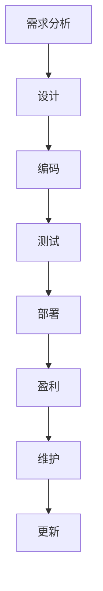

                 

关键词：被动收入，程序员的副业，自动化的软件项目，商业模型，持续盈利

> 摘要：本文将探讨程序员如何通过构建和维持自动化的软件项目来实现被动收入。我们将深入分析这一领域的核心概念，提供详细的操作步骤，并讨论数学模型和实际应用场景。最后，我们将推荐一些相关的学习资源和开发工具，以及展望未来在这一领域的趋势和挑战。

## 1. 背景介绍

在当今的数字化时代，技术人才的需求不断增长，程序员作为信息技术领域的中坚力量，面对着越来越多的职业选择。然而，传统的全职工作模式可能无法满足所有程序员的需求。越来越多的程序员开始探索如何实现被动收入，以增加收入来源，提高财务自由度。

被动收入是指在不直接参与日常运营的情况下，通过某种形式的投资或创作产生的持续收入。这种收入模式对于程序员来说尤其有吸引力，因为他们通常具有编程技能，能够创造和维护软件项目。

本文将探讨如何构建和维持自动化的软件项目，以实现程序员的被动收入。我们将提供详细的操作步骤，包括核心概念、算法原理、数学模型、项目实践和实际应用场景。此外，还将推荐相关的学习资源和开发工具，以帮助程序员更好地进入这个领域。

## 2. 核心概念与联系

### 2.1 自动化软件项目的核心概念

自动化软件项目是被动收入的重要来源。它指的是通过编写和维护软件代码，实现自动化操作的项目。这些项目可以是各种形式，如Web应用程序、手机应用、自动化工具等。以下是构建自动化软件项目的几个关键概念：

- **需求分析**：确定项目的目标用户群体和需求。
- **设计**：设计软件的架构和用户界面。
- **编码**：实现软件的功能和逻辑。
- **测试**：验证软件的正确性和稳定性。
- **部署**：将软件部署到服务器或云平台上。

### 2.2 被动收入与自动化软件项目的联系

被动收入与自动化软件项目的联系在于，自动化软件项目能够产生持续的收入，而这些收入不需要程序员每天进行维护。以下是一些联系点：

- **持续盈利**：自动化软件项目可以24/7运行，不受人为干预，因此可以持续产生收入。
- **低维护成本**：一旦软件项目上线，维护成本相对较低，通常只需要进行定期的更新和安全检查。
- **扩大收入渠道**：通过创建多个自动化软件项目，程序员可以扩大收入来源，降低依赖单一项目的风险。

### 2.3 Mermaid 流程图

以下是一个简化的自动化软件项目的 Mermaid 流程图，展示了核心概念和操作步骤之间的联系：



## 3. 核心算法原理 & 具体操作步骤

### 3.1 算法原理概述

自动化软件项目的核心在于算法原理。算法是指解决问题的步骤和策略。在自动化软件项目中，算法主要用于处理用户输入、执行特定操作和生成输出。以下是一些常见的算法原理：

- **排序算法**：用于对数据进行排序，如快速排序、归并排序等。
- **搜索算法**：用于在数据结构中查找特定元素，如二分查找、深度优先搜索等。
- **算法优化**：通过改进算法的时间和空间复杂度，提高软件项目的性能。

### 3.2 算法步骤详解

以下是构建自动化软件项目的具体步骤：

#### 3.2.1 需求分析

1. 与潜在用户进行访谈，了解他们的需求和期望。
2. 确定软件项目的目标功能和技术要求。
3. 制定项目计划和时间表。

#### 3.2.2 设计

1. 确定软件项目的架构和模块划分。
2. 设计用户界面和交互流程。
3. 制定数据库设计和数据模型。

#### 3.2.3 编码

1. 选择合适的编程语言和开发工具。
2. 编写代码，实现软件的功能和逻辑。
3. 进行单元测试和代码审查。

#### 3.2.4 测试

1. 进行功能测试，确保软件能够按照设计要求运行。
2. 进行性能测试，评估软件的响应时间和负载能力。
3. 进行安全测试，确保软件的安全性。

#### 3.2.5 部署

1. 将软件部署到服务器或云平台。
2. 配置域名和SSL证书，确保软件的可访问性。
3. 进行部署后的测试和监控。

#### 3.2.6 盈利

1. 通过广告、订阅、销售软件许可证等方式获得收入。
2. 监控软件的运行状态和收入情况，进行数据分析和优化。

#### 3.2.7 维护

1. 定期更新软件，修复已知问题和漏洞。
2. 监控软件的性能和稳定性，进行优化和调整。
3. 收集用户反馈，进行功能改进和扩展。

### 3.3 算法优缺点

在构建自动化软件项目时，选择合适的算法至关重要。以下是一些常见算法的优缺点：

- **快速排序**：时间复杂度为 \(O(n\log n)\)，但适用于大量数据。缺点是空间复杂度较高。
- **归并排序**：时间复杂度为 \(O(n\log n)\)，空间复杂度为 \(O(n)\)，适用于大量数据且稳定。
- **二分查找**：时间复杂度为 \(O(\log n)\)，适用于有序数据。缺点是对于大量数据可能不如线性查找高效。

### 3.4 算法应用领域

自动化软件项目的算法原理可以应用于多个领域，如电子商务、金融、物流、医疗等。以下是一些应用实例：

- **电子商务**：使用排序算法优化商品搜索和推荐功能。
- **金融**：使用机器学习算法进行风险评估和预测。
- **物流**：使用路径规划算法优化运输路线。

## 4. 数学模型和公式 & 详细讲解 & 举例说明

### 4.1 数学模型构建

在构建自动化软件项目时，数学模型用于描述软件的运行规则和预测结果。以下是一个简单的数学模型示例，用于预测用户点击率：

$$
点击率 = f(广告展示次数, 用户兴趣度, 广告内容质量)
$$

其中，$f$ 表示函数，$广告展示次数$、$用户兴趣度$ 和 $广告内容质量$ 分别是模型的输入变量。

### 4.2 公式推导过程

为了推导上述公式，我们可以使用以下假设：

- $广告展示次数$ 与 $点击率$ 成正比。
- $用户兴趣度$ 与 $点击率$ 成正比。
- $广告内容质量$ 与 $点击率$ 成正比。

根据这些假设，我们可以得到以下公式：

$$
点击率 = k_1 \cdot 广告展示次数 + k_2 \cdot 用户兴趣度 + k_3 \cdot 广告内容质量
$$

其中，$k_1$、$k_2$ 和 $k_3$ 分别是比例常数。

### 4.3 案例分析与讲解

假设我们有一个广告展示平台，每天展示广告 100 次，用户兴趣度较高，广告内容质量也很高。根据上述公式，我们可以计算点击率：

$$
点击率 = k_1 \cdot 100 + k_2 \cdot 高 + k_3 \cdot 高
$$

假设 $k_1 = 0.1$、$k_2 = 0.5$ 和 $k_3 = 0.3$，则点击率为：

$$
点击率 = 0.1 \cdot 100 + 0.5 \cdot 高 + 0.3 \cdot 高 = 8
$$

这意味着每天可能会有 8 次点击。当然，这只是一个简化的例子，实际情况可能更加复杂。

## 5. 项目实践：代码实例和详细解释说明

### 5.1 开发环境搭建

为了实践自动化软件项目，我们需要搭建一个开发环境。以下是一个简单的示例，使用 Python 和 Flask 框架来构建一个简单的 Web 应用程序。

#### 5.1.1 安装 Python

首先，我们需要安装 Python 3.8 或更高版本。可以使用以下命令进行安装：

```bash
$ sudo apt-get install python3.8
```

#### 5.1.2 安装 Flask

然后，安装 Flask 框架：

```bash
$ pip3 install flask
```

### 5.2 源代码详细实现

以下是一个简单的 Flask 应用程序的源代码示例，用于返回“Hello, World!”：

```python
from flask import Flask

app = Flask(__name__)

@app.route('/')
def hello():
    return 'Hello, World!'

if __name__ == '__main__':
    app.run()
```

### 5.3 代码解读与分析

这段代码首先导入了 Flask 框架，并创建了一个名为 `app` 的 Flask 实例。然后，使用 `@app.route('/')` 装饰器定义了一个名为 `hello` 的函数，该函数返回字符串 “Hello, World!”。

在最后一行，使用了 `if __name__ == '__main__':` 语句来确保当这个 Python 脚本被直接运行时，`app.run()` 方法会被调用，启动 Flask 服务器。

### 5.4 运行结果展示

运行上述代码后，我们可以通过浏览器访问 `http://127.0.0.1:5000/`，看到返回的结果是 “Hello, World!”。

## 6. 实际应用场景

自动化软件项目可以应用于各种实际场景，以下是一些例子：

- **电子商务平台**：自动化软件项目可以用于推荐系统、库存管理、订单处理等。
- **金融科技**：自动化软件项目可以用于风险管理、交易分析、客户服务等。
- **物流和供应链管理**：自动化软件项目可以用于路径规划、库存跟踪、配送优化等。
- **医疗健康**：自动化软件项目可以用于患者管理、健康监测、医疗数据分析等。

## 7. 工具和资源推荐

### 7.1 学习资源推荐

1. **《Python编程：从入门到实践》**：由 Mark L. Guzdial 和 J. D. Mitchell 编著，适合初学者学习 Python 编程。
2. **《Flask Web开发：轻量级应用实践》**：由 Miguel Grinberg 编著，详细介绍了 Flask 框架的使用。

### 7.2 开发工具推荐

1. **PyCharm**：一款强大的 Python 集成开发环境（IDE），提供代码补全、调试和自动化工具。
2. **Visual Studio Code**：一款轻量级但功能强大的代码编辑器，适用于多种编程语言。

### 7.3 相关论文推荐

1. **“An Introduction to Machine Learning”**：由 Mitchell W. Wand 和 Carl G. Joachims 编著，介绍了机器学习的基础知识。
2. **“Big Data: A Revolution That Will Transform How We Live, Work, and Think”**：由 Viktor Mayer-Schönberger 和 Kenneth Cukier 编著，探讨了大数据对社会的影响。

## 8. 总结：未来发展趋势与挑战

### 8.1 研究成果总结

自动化软件项目和被动收入领域近年来取得了显著进展。随着人工智能、机器学习和大数据技术的发展，自动化软件项目变得更加智能和高效。同时，云计算和容器技术的普及为软件项目的部署和维护提供了便利。

### 8.2 未来发展趋势

1. **人工智能驱动的自动化**：随着人工智能技术的发展，自动化软件项目将更加智能，能够自我学习和优化。
2. **云计算和容器化**：云计算和容器技术将为自动化软件项目提供更高效、更可靠的运行环境。
3. **区块链技术**：区块链技术可以为自动化软件项目提供更安全、更透明的支付和交易方式。

### 8.3 面临的挑战

1. **数据隐私和安全**：自动化软件项目需要处理大量用户数据，保护数据隐私和安全是重要挑战。
2. **技术更新和迭代**：技术更新速度快，程序员需要不断学习和适应新技术。
3. **市场竞争**：随着越来越多的人进入这个领域，市场竞争将日益激烈。

### 8.4 研究展望

未来，自动化软件项目和被动收入领域将继续快速发展。程序员可以通过不断学习和实践，提高自己的技能和竞争力，从而在这个领域获得成功。

## 9. 附录：常见问题与解答

### 9.1 问题 1：如何选择合适的编程语言？

**解答**：选择编程语言时，应考虑项目需求、个人技能和社区支持。Python 和 Java 是常用的编程语言，适用于多种类型的自动化软件项目。

### 9.2 问题 2：如何确保自动化软件项目的安全性？

**解答**：确保自动化软件项目的安全性是至关重要的。进行安全测试、使用加密技术、遵守最佳实践和持续更新软件是确保安全的关键步骤。

### 9.3 问题 3：如何处理用户数据？

**解答**：处理用户数据时，应遵守相关法律法规，如 GDPR 和 CCPA。对用户数据进行加密、匿名化和访问控制，以保护用户隐私。

---

作者：禅与计算机程序设计艺术 / Zen and the Art of Computer Programming

---

<|assistant|>文章摘要部分 Summary

本文系统地介绍了程序员如何通过构建和维持自动化的软件项目实现被动收入。首先，我们探讨了被动收入的概念及其在程序员职业中的重要性。接着，深入分析了自动化软件项目的核心概念和操作步骤，包括需求分析、设计、编码、测试、部署以及盈利和维

