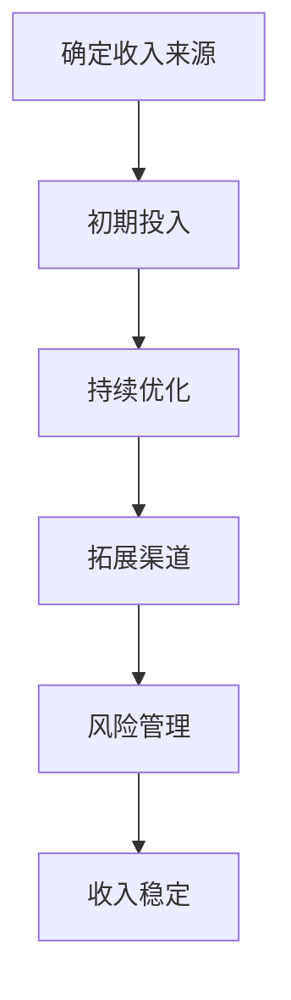

                 

关键词：程序员的被动收入、构建、维护、自动收益、被动收益、自动化项目、软件资产管理、技术变现、开源项目

> 摘要：本文将深入探讨程序员的被动收入构建与维护的方法，解析如何在繁忙的开发工作中创造持续的收入流。通过自动化项目的开发、软件资产的运营以及开源项目的管理，程序员可以逐渐实现时间的自由和财务的独立。本文将分享实际案例、策略和技巧，帮助读者从零开始构建属于自己的被动收入体系。

## 1. 背景介绍

在信息技术飞速发展的时代，程序员作为高需求的职业群体，拥有了多样化的职业选择和发展路径。然而，随着市场竞争的加剧，许多程序员发现仅靠传统的项目开发和雇佣工作难以实现长期的财务安全和时间的自由。为了应对这一挑战，越来越多的程序员开始探索被动收入的构建与维护。

被动收入指的是在不直接参与日常运营和管理的情况下，通过一次性的努力获得持续的收入。对于程序员来说，这通常意味着通过开发可复用的软件、自动化工具或参与开源项目等方式，实现收益的持续流入。被动收入的构建不仅能够提高个人财务稳定性，还可以为职业发展提供新的动力。

本文将围绕以下几个方面展开：

- **被动收入的定义与意义**
- **构建被动收入的策略与步骤**
- **维护被动收入的实践与技巧**
- **实际案例分享与经验总结**
- **未来展望与挑战**

通过以上内容的探讨，希望能够为程序员的职业发展和收入多元化提供一些有价值的参考和启示。

## 2. 核心概念与联系

### 2.1 被动收入的定义

被动收入（Passive Income）是指不需要持续投入大量时间和精力，即可获得的经济收益。它来源于投资、版权、自动化业务或其他被动收入来源。对于程序员来说，被动收入可以是：

- **软件销售**：通过开发软件并销售许可证或订阅服务获得收入。
- **自动化工具开发**：开发并出售自动化脚本或工具。
- **开源项目**：通过捐赠、赞助或提供付费增值服务获得收入。
- **版权使用**：将原创代码或技术解决方案授权给他人使用。

### 2.2 被动收入与主动收入的区别

主动收入（Active Income）是指通过直接参与工作、提供服务或销售商品获得的收入。它与被动收入的主要区别在于：

- **时间投入**：主动收入通常需要持续的劳动和时间投入；而被动收入在初期投入后，可以减少后续的维护工作。
- **收入稳定性**：被动收入虽然初期投入较大，但一旦建立起来，可以带来稳定且持续的收益；主动收入则与个人的工作时间密切相关。
- **风险与回报**：被动收入虽然回报可能较低，但风险也较小；主动收入则可能在短期内带来较高的收入，但也伴随着更高的风险。

### 2.3 被动收入对程序员的意义

对于程序员而言，构建被动收入具有以下几个重要意义：

- **财务独立**：通过被动收入，程序员可以在不增加工作时间的情况下，获得额外的收入来源，实现财务独立。
- **时间自由**：被动收入的实现可以解放程序员的时间，使其能够从事其他兴趣或职业发展活动。
- **风险分散**：通过多元化收入来源，程序员可以降低个人职业风险，避免过度依赖单一收入渠道。
- **职业升级**：被动收入可以为程序员提供更多的职业发展机会，例如创业、咨询、培训等。

### 2.4 被动收入与开源项目的联系

开源项目是程序员实现被动收入的重要途径之一。通过开源项目，程序员可以实现以下目标：

- **技术展示**：开源项目可以展示程序员的技能和专业知识，增加个人品牌影响力。
- **社区参与**：开源项目吸引社区参与，通过贡献和交流，程序员可以结识更多同好，扩大人脉。
- **赞助与捐赠**：开源项目通常会有捐赠和赞助渠道，程序员可以通过这些渠道获得被动收入。
- **商业机会**：开源项目可能为程序员带来商业合作机会，例如付费咨询、定制开发等。

### 2.5 被动收入构建的总体思路

要构建被动收入，程序员可以遵循以下总体思路：

1. **确定收入来源**：根据自身技能和兴趣，选择合适的被动收入模式，如软件销售、自动化工具开发、开源项目等。
2. **初期投入**：进行市场调研，确定目标用户和潜在客户，进行前期开发工作，建立初步的收入来源。
3. **持续优化**：在初期投入后，不断优化产品和服务，提高用户满意度，增加收入潜力。
4. **拓展渠道**：通过多种渠道推广和销售，扩大用户群体，增加收入来源。
5. **风险管理**：建立合理的风险管理机制，确保被动收入的稳定性和持续性。

下面将使用 Mermaid 流程图展示被动收入构建的核心流程和环节：



通过以上步骤，程序员可以逐步实现被动收入的构建和稳定化。接下来，我们将详细探讨每个环节的具体操作方法和注意事项。

## 3. 核心算法原理 & 具体操作步骤

### 3.1 算法原理概述

构建被动收入的核心在于找到一种可以持续生成价值的方法，并确保其稳定性和可扩展性。以下是几个关键算法原理：

1. **自动化流程设计**：通过编写脚本或使用自动化工具，减少手动操作，提高效率。
2. **数据分析和挖掘**：利用大数据和机器学习技术，分析用户行为和市场趋势，为产品优化和推广提供数据支持。
3. **开源项目管理**：通过有效的开源项目管理，吸引更多社区参与和贡献，提高项目影响力。
4. **市场推广策略**：结合多种营销手段，扩大用户群体和收入渠道。

### 3.2 算法步骤详解

1. **需求分析**
   - **目标用户确定**：明确目标用户群体，了解他们的需求和痛点。
   - **市场调研**：分析市场趋势，评估潜在竞争对手和市场需求。

2. **方案设计**
   - **收入模式选择**：根据市场需求和自身技能，选择合适的收入模式，如软件销售、自动化工具开发或开源项目。
   - **技术方案设计**：确定技术栈和开发工具，制定详细的技术方案。

3. **开发与实施**
   - **模块化开发**：将项目拆分为多个模块，逐一实现。
   - **自动化脚本编写**：编写自动化脚本，实现流程自动化。
   - **开源项目启动**：选择合适的开源平台，发布项目，吸引社区参与。

4. **测试与优化**
   - **功能测试**：确保所有功能正常运行，无bug。
   - **性能优化**：优化代码和架构，提高系统性能。
   - **用户体验改进**：根据用户反馈，不断改进产品界面和功能。

5. **推广与销售**
   - **内容营销**：通过博客、社交媒体、论坛等渠道，传播项目价值和优势。
   - **合作推广**：与相关企业或个人合作，扩大用户群体。
   - **销售策略制定**：根据市场情况和用户需求，制定合适的销售策略。

6. **收入监控与风险管理**
   - **收入监控**：建立收入监控系统，实时跟踪收入变化。
   - **风险评估**：定期评估项目风险，制定应对策略。
   - **持续优化**：根据市场变化和用户反馈，持续优化产品和服务。

### 3.3 算法优缺点

**优点：**

- **高效稳定**：通过自动化流程设计和数据分析，提高工作效率和系统稳定性。
- **可扩展性强**：开源项目易于扩展，可以吸引更多社区参与和贡献。
- **长期收益**：一旦被动收入体系建立，可以实现长期稳定的收益。

**缺点：**

- **初期投入大**：构建被动收入需要大量的时间和资金投入。
- **市场风险**：市场需求变化可能导致收入波动。
- **维护成本**：持续优化和风险管理需要一定的维护成本。

### 3.4 算法应用领域

- **软件销售**：适用于各种软件产品，如开发工具、管理软件、自动化工具等。
- **自动化工具开发**：适用于企业内部或外部市场的自动化工具开发。
- **开源项目**：适用于各类开源软件项目，如操作系统、数据库、Web 应用等。

### 3.5 实际案例与操作步骤详解

#### 案例一：开源项目构建

**1. 需求分析：**

- **目标用户**：程序员和开发团队。
- **市场需求**：一个易于使用、功能强大的开源项目管理工具。

**2. 方案设计：**

- **收入模式**：通过捐赠和赞助获得收入。
- **技术方案**：使用 Web 框架（如 React）和后端技术（如 Node.js）。

**3. 开发与实施：**

- **模块化开发**：将项目分为用户管理、任务管理、项目报告等模块。
- **开源平台发布**：选择 GitHub 或 GitLab 作为开源平台。

**4. 测试与优化：**

- **功能测试**：确保所有功能正常运行。
- **性能优化**：优化数据库查询和前端渲染。

**5. 推广与销售：**

- **内容营销**：撰写技术博客、发布教程和演示视频。
- **合作推广**：与相关社区和媒体合作，扩大用户群体。

**6. 收入监控与风险管理：**

- **收入监控**：使用开源监控工具，实时跟踪捐赠和赞助。
- **风险评估**：定期评估项目风险，如社区活跃度、技术债务等。

#### 案例二：自动化工具开发

**1. 需求分析：**

- **目标用户**：软件开发团队。
- **市场需求**：一个可以自动执行重复任务的工具。

**2. 方案设计：**

- **收入模式**：通过销售许可证或订阅服务获得收入。
- **技术方案**：使用 Python 或 Ruby 编写脚本。

**3. 开发与实施：**

- **模块化开发**：将工具分为任务调度、结果记录、异常处理等模块。
- **自动化部署**：使用 Docker 和 Kubernetes 实现自动化部署。

**4. 测试与优化：**

- **功能测试**：确保所有任务可以正常运行。
- **性能优化**：优化脚本执行效率和资源占用。

**5. 推广与销售：**

- **内容营销**：发布教程和案例，展示工具的实用性。
- **销售策略**：提供试用版本，根据用户需求定制解决方案。

**6. 收入监控与风险管理：**

- **收入监控**：使用财务工具，实时跟踪销售额和订阅用户。
- **风险评估**：定期评估市场需求和竞争对手动态。

通过以上案例，我们可以看到构建被动收入的具体步骤和操作方法。在实际操作中，程序员需要根据自身情况和市场需求，灵活调整策略和步骤，实现收入的稳定增长。

## 4. 数学模型和公式 & 详细讲解 & 举例说明

### 4.1 数学模型构建

在构建被动收入的系统中，我们可以使用一些基本的数学模型来帮助我们理解和预测收入情况。以下是一个简单的收入模型，它包括以下几个核心要素：

- **初始投资成本（C）**：构建被动收入系统所需的初始投资。
- **每月运营成本（O）**：包括服务器、维护、推广等费用。
- **月均收入（R）**：通过被动收入渠道每月获得的平均收入。
- **月均利润（P）**：月均收入减去月均运营成本。

这些要素之间的关系可以用以下数学公式表示：

\[ P = R - O \]

### 4.2 公式推导过程

为了更详细地理解这些公式，我们来看一个具体的例子：

假设：

- 初始投资成本（C）为 10,000 元。
- 每月运营成本（O）为 1,000 元。
- 每月平均收入（R）为 3,000 元。

那么，每月的利润（P）计算如下：

\[ P = R - O \]
\[ P = 3,000 - 1,000 \]
\[ P = 2,000 \text{ 元} \]

### 4.3 案例分析与讲解

为了更好地应用这些数学模型，我们可以通过一个具体的案例来进行分析。

**案例：软件开发项目的被动收入**

**初始数据：**

- **初始投资成本（C）**：10,000 元（用于购买服务器、域名、软件开发工具等）。
- **月运营成本（O）**：500 元（服务器租赁、域名续费等）。
- **月均收入（R）**：2,000 元（通过软件销售、订阅服务、广告收入等）。

**公式应用：**

- **月均利润（P）**：

\[ P = R - O \]
\[ P = 2,000 - 500 \]
\[ P = 1,500 \text{ 元} \]

**计算过程：**

1. 计算月均利润：
   \[ P = 2,000 - 500 = 1,500 \text{ 元} \]

2. 计算初始投资回报期：
   \[ \text{回报期} = \frac{C}{P} \]
   \[ \text{回报期} = \frac{10,000}{1,500} \approx 6.67 \text{ 个月} \]

这意味着，项目在 6.67 个月后，就可以通过每月的利润回收初始投资成本。

**举例说明：**

假设在第 5 个月时，由于市场需求增加，月均收入上升到 2,500 元。这时，月均利润也会增加：

\[ P = R - O \]
\[ P = 2,500 - 500 \]
\[ P = 2,000 \text{ 元} \]

新的回报期计算如下：

\[ \text{回报期} = \frac{C}{P} \]
\[ \text{回报期} = \frac{10,000}{2,000} = 5 \text{ 个月} \]

可以看到，通过增加收入，回报期明显缩短。

### 4.4 模型扩展与应用

**扩展 1：考虑季节性影响**

在某些行业或项目中，收入可能受到季节性影响。例如，旅游软件在旅游旺季（如夏季）可能获得更高的收入。我们可以通过以下公式考虑季节性因素：

\[ P = R_s - O \]

其中，\( R_s \) 是季节性调整后的月均收入。

**扩展 2：考虑市场波动**

在更复杂的市场环境中，我们可以通过以下公式考虑市场波动对收入的影响：

\[ P = R_t - O \]

其中，\( R_t \) 是经过市场波动调整后的月均收入。

\[ R_t = R_s \times (1 + \Delta R) \]

其中，\( \Delta R \) 是市场波动调整系数。

通过这些扩展，我们可以更准确地预测和管理被动收入项目。

通过以上数学模型和公式的构建、推导及应用，我们可以更好地理解和预测被动收入的运作情况，从而为程序员构建和优化被动收入提供理论支持。

## 5. 项目实践：代码实例和详细解释说明

### 5.1 开发环境搭建

为了更好地展示如何构建被动收入项目，我们将使用一个简单的自动化工具——一个自动化的部署脚本。以下是在 Linux 系统上搭建此项目的环境步骤：

1. **安装必备软件**：
    - Git：用于版本控制。
    - Python 3：作为脚本语言。
    - Docker：用于容器化部署。
    - Kubernetes：用于容器编排。

2. **安装 Git**：

```bash
sudo apt-get update
sudo apt-get install git
```

3. **安装 Python 3**：

```bash
sudo apt-get install python3 python3-pip
```

4. **安装 Docker**：

```bash
sudo apt-get install docker.io
sudo systemctl start docker
sudo systemctl enable docker
```

5. **安装 Kubernetes**：

你可以使用 Minikube 或者一个 Kubernetes 集群。以下是在本地安装 Minikube 的步骤：

```bash
curl -LO https://storage.googleapis.com/minikube/releases/latest/minikube-linux-amd64
sudo chmod +x minikube-linux-amd64
sudo mv minikube-linux-amd64 /usr/local/bin/minikube
minikube start
```

### 5.2 源代码详细实现

下面是一个简单的自动化部署脚本，用于在 Kubernetes 集群中部署一个 Web 应用。

**部署脚本（deploy.sh）：**

```bash
#!/bin/bash

# 定义部署参数
NAMESPACE="my-namespace"
DEPLOYMENT_NAME="my-deployment"
REPOSITORY="my-repository"
IMAGE_TAG="latest"

# 准备 Kubernetes 配置文件
kubectl create namespace ${NAMESPACE}
kubectl create deployment ${DEPLOYMENT_NAME} --image=${REPOSITORY}:${IMAGE_TAG} --namespace=${NAMESPACE}

# 暴露服务
kubectl expose deployment ${DEPLOYMENT_NAME} --name=${DEPLOYMENT_NAME}-service --type=LoadBalancer --namespace=${NAMESPACE}

# 获取服务外部访问地址
SERVICE_ENDPOINT=$(kubectl get svc ${DEPLOYMENT_NAME}-service -n ${NAMESPACE} -o jsonpath='{.status.loadBalancer.ingress[0].hostname}')

echo "Deployment completed. Service endpoint: ${SERVICE_ENDPOINT}"
```

**Dockerfile：**

```Dockerfile
# 使用官方 Python 运行时作为基础镜像
FROM python:3.9

# 设置工作目录
WORKDIR /app

# 将当前目录的内容复制到容器的 /app 目录
COPY . /app

# 安装依赖项
RUN pip install -r requirements.txt

# 暴露 8000 端口供 Web 应用使用
EXPOSE 8000

# 运行 Web 应用
CMD ["python", "app.py"]
```

**requirements.txt：**

```plaintext
Flask
gunicorn
```

### 5.3 代码解读与分析

**deploy.sh 脚本解读：**

1. **定义部署参数**：
   - `NAMESPACE`：部署的命名空间。
   - `DEPLOYMENT_NAME`：部署的名称。
   - `REPOSITORY`：容器的镜像仓库地址。
   - `IMAGE_TAG`：容器的标签。

2. **准备 Kubernetes 配置文件**：
   - 使用 `kubectl create namespace` 创建命名空间。
   - 使用 `kubectl create deployment` 创建部署。
   - 使用 `kubectl expose` 将部署暴露为服务。

3. **获取服务外部访问地址**：
   - 使用 `kubectl get svc` 获取服务的负载均衡器地址。

**Dockerfile 解读：**

1. **基础镜像**：
   - 使用 `FROM python:3.9` 作为基础镜像。

2. **工作目录**：
   - 使用 `WORKDIR /app` 设置容器的工作目录。

3. **复制文件**：
   - 使用 `COPY . /app` 将宿主机的当前目录内容复制到容器的 `/app` 目录。

4. **安装依赖项**：
   - 使用 `RUN pip install -r requirements.txt` 安装依赖项。

5. **暴露端口**：
   - 使用 `EXPOSE 8000` 暴露 8000 端口供 Web 应用使用。

6. **运行命令**：
   - 使用 `CMD ["python", "app.py"]` 运行 Web 应用。

**部署脚本与 Dockerfile 的关联分析**：

- `deploy.sh` 脚本负责在 Kubernetes 集群中部署和暴露容器化应用。
- `Dockerfile` 负责创建容器镜像，定义应用的运行环境。

### 5.4 运行结果展示

1. **运行部署脚本**：

```bash
chmod +x deploy.sh
./deploy.sh
```

2. **查看 Kubernetes 集群状态**：

```bash
kubectl get namespaces
kubectl get deployments -n my-namespace
kubectl get services -n my-namespace
```

3. **访问部署的服务**：

使用脚本返回的 `SERVICE_ENDPOINT` 访问部署的 Web 应用，例如：

```bash
curl ${SERVICE_ENDPOINT}
```

你应该可以看到 Web 应用的响应，这表明部署成功。

通过这个简单的案例，我们展示了如何使用自动化工具实现被动收入。在实际应用中，可以根据需求扩展和优化脚本和 Dockerfile，构建更复杂和高效的项目。

## 6. 实际应用场景

被动收入项目在实际应用中具有广泛的应用场景，以下列举几个典型的案例：

### 6.1 软件开发与销售

许多程序员通过开发高质量的软件工具或应用，并销售许可证或订阅服务，实现了被动收入。例如，知名的开源软件 GitLab 就是这种模式的成功案例。GitLab 团队通过销售企业版服务，每年获得了数千万美元的收入。该模式的关键在于提供有价值的产品，并通过持续更新和维护来保持用户满意度。

### 6.2 自动化工具与外包服务

自动化工具的开发也是程序员实现被动收入的一种方式。通过开发自动化脚本或工具，程序员可以将重复性任务自动化，从而为企业节省大量时间和成本。这些工具可以通过企业内部的订阅服务或外包项目销售，实现持续的收入流。例如，一些自动化运维工具或测试工具，可以通过企业订阅或定制服务获得收入。

### 6.3 开源项目与赞助

开源项目是程序员构建被动收入的另一个重要途径。通过参与开源项目，程序员可以吸引社区关注和参与，从而获得赞助或捐赠。例如，GitHub 上的开源项目常常通过捐赠按钮、赞助计划或付费增值服务（如专业支持、定制开发等）获得收入。这种模式的优势在于，它不仅能够提高个人技术声誉，还可以带来实际的财务回报。

### 6.4 教育与培训

随着个人品牌的建立，程序员还可以通过在线教育平台或个人网站，提供技术课程或培训服务，实现被动收入。例如，一些知名程序员通过 Udemy、Coursera 等平台发布课程，通过销售课程获得收入。此外，个人网站上的广告收入、会员订阅等也是实现被动收入的有效途径。

### 6.5 云计算服务与 API 销售平台

随着云计算的普及，程序员可以利用云服务搭建 API 销售平台，提供 API 接口给第三方开发者使用，并通过 API 调用计费获得收入。例如，一些程序员开发了天气信息 API、地图服务 API 等，并提供了多种计费模式，如按需付费、包月付费等。

### 6.6 机器学习和人工智能服务

在机器学习和人工智能领域，程序员可以通过开发模型和算法，并将其打包成服务或 API，提供给企业或开发者使用。这种方式可以实现高价值、高稳定性的被动收入。例如，一些程序员开发了图像识别、自然语言处理等 API，通过为企业提供定制化服务或通用服务获得收入。

### 6.7 内容创作与社交媒体平台

一些程序员通过在社交媒体平台（如 YouTube、微博、知乎等）创作技术内容，吸引大量粉丝和关注者，并通过广告收入、会员订阅、产品销售等方式实现被动收入。这种模式的优势在于，内容创作和推广可以通过自动化工具实现，从而降低运营成本。

### 6.8 咨询与咨询服务

拥有丰富经验的程序员还可以通过提供专业咨询或咨询服务，实现被动收入。这种模式通常需要程序员在特定领域有深入的研究和实践经验。例如，一些程序员提供软件开发咨询服务、架构设计咨询、性能优化咨询等，通过线上或线下方式获得收入。

通过以上实际应用场景，我们可以看到程序员通过构建和运营被动收入项目，可以实现多样化的收入来源，提高个人财务稳定性，实现职业发展和生活质量的提升。

### 6.9 未来应用展望

随着技术的不断进步和市场需求的多样化，被动收入项目在未来的应用场景将更加广泛和深入。以下是一些可能的未来趋势：

1. **区块链技术的应用**：区块链技术可以为被动收入项目提供更加安全和透明的支付和收益分配机制。通过智能合约，程序员可以创建自动化、去中心化的收入流，提高项目的可靠性和透明度。

2. **人工智能与大数据的结合**：利用人工智能和大数据技术，程序员可以更精确地预测市场需求和用户行为，优化产品和服务，从而实现更高的被动收入。例如，通过分析用户数据，提供个性化推荐和增值服务。

3. **物联网（IoT）的发展**：物联网技术的普及将为程序员提供新的被动收入机会。通过开发物联网设备和平台，程序员可以实现设备租赁、数据服务、远程监控等，带来持续的收益。

4. **加密货币与数字资产**：随着加密货币市场的增长，程序员可以通过开发加密货币交易平台、钱包应用或加密资产管理工具，实现被动收入。这些项目不仅能够带来直接的加密货币收益，还可以通过交易手续费等方式获得额外收入。

5. **云计算与边缘计算**：随着云计算和边缘计算的不断发展，程序员可以开发更加高效和灵活的云计算服务或边缘计算应用，实现稳定的被动收入流。这些应用包括实时数据处理、智能监控、物联网设备管理等。

6. **虚拟现实（VR）与增强现实（AR）**：虚拟现实和增强现实技术的发展将为程序员提供新的应用场景。通过开发虚拟现实游戏、应用或平台，程序员可以创建全新的被动收入渠道，如虚拟商品销售、广告收入等。

7. **可持续发展与绿色科技**：随着对环境保护和可持续发展的关注增加，程序员可以开发绿色科技项目，如可再生能源管理平台、环保应用等，通过实现环保目标，获得社会责任感和经济回报。

通过这些未来趋势，我们可以预见，程序员的被动收入项目将变得更加多样化和创新化，为程序员带来更多的职业机会和财务收益。

### 7. 工具和资源推荐

#### 7.1 学习资源推荐

1. **在线课程平台**：

   - **Udemy**：提供大量的编程和软件开发课程，包括 Python、JavaScript、Docker 和 Kubernetes 等。
   - **Pluralsight**：涵盖从基础编程到高级架构设计的广泛课程，适合不同层次的程序员。
   - **Coursera**：与知名大学合作的在线课程，包括斯坦福大学、密歇根大学等，课程内容涵盖计算机科学、人工智能等。

2. **技术社区与论坛**：

   - **Stack Overflow**：全球最大的开发者问答社区，适合解决编程问题和学习新技能。
   - **GitHub**：不仅可以查看开源项目，还可以学习其他程序员的代码和项目经验。
   - **Reddit**：有许多技术相关的子版块，如 r/learnprogramming、r/webdev 等。

3. **书籍推荐**：

   - **《Head First Programming》**：适合初学者，通过项目驱动的方式学习编程。
   - **《Clean Code》**：讨论了编写高质量代码的最佳实践。
   - **《Effective Java》**：详细介绍了 Java 编程语言的最佳实践。

#### 7.2 开发工具推荐

1. **集成开发环境（IDE）**：

   - **Visual Studio Code**：轻量级、高度可扩展的 IDE，适用于多种编程语言。
   - **IntelliJ IDEA**：功能强大的 Java 和 Kotlin IDE，支持多种编程语言。

2. **版本控制工具**：

   - **Git**：最流行的分布式版本控制系统，适合团队协作和代码管理。
   - **GitLab**：基于 Git 的 Web 服务，提供代码托管、项目管理等功能。

3. **容器化工具**：

   - **Docker**：用于容器化应用程序，简化了部署和扩展。
   - **Kubernetes**：用于容器编排和管理，提高集群的可用性和灵活性。

4. **云服务平台**：

   - **AWS**：提供广泛的云服务，包括计算、存储、数据库、机器学习等。
   - **Azure**：微软提供的云服务平台，适合开发、测试和部署应用程序。
   - **Google Cloud Platform**：提供灵活的云服务，支持各种开发需求。

#### 7.3 相关论文推荐

1. **《An Architecture for a Multi-Agent Operating System》**：讨论了多智能体系统的架构，适用于开发自动化工具和智能应用。
2. **《Recommender Systems Handbook》**：全面介绍了推荐系统技术，适用于个性化服务和产品推荐。
3. **《Machine Learning Yearning》**：由 Andrew Ng 撰写的机器学习实践指南，适合初学者和专业人士。

通过这些工具和资源的推荐，程序员可以更有效地学习和实践，为自己的被动收入项目奠定坚实的基础。

## 8. 总结：未来发展趋势与挑战

### 8.1 研究成果总结

本文探讨了程序员的被动收入构建与维护的多个方面，包括核心概念、算法原理、具体操作步骤、数学模型以及实际应用场景。通过分析自动化项目、软件资产运营和开源项目管理等方法，我们总结了以下研究成果：

- **多样化收入渠道**：程序员可以通过多种方式构建被动收入，如软件销售、自动化工具开发、开源项目管理等。
- **高效与稳定性**：通过自动化和数据分析，程序员可以大幅提高工作效率，并确保收入流的稳定性。
- **长期收益**：一旦被动收入系统建立，它可以带来长期的、持续的收益，有助于实现财务独立和时间自由。

### 8.2 未来发展趋势

随着技术的不断进步和市场需求的多样化，被动收入项目在未来的发展趋势包括：

- **区块链技术的应用**：通过智能合约，实现更加安全和透明的支付与收益分配。
- **人工智能与大数据的结合**：利用 AI 技术预测市场需求和优化产品服务。
- **物联网的发展**：通过物联网设备和平台，提供数据服务和管理。
- **云计算与边缘计算**：开发高效、灵活的云服务和边缘计算应用。

### 8.3 面临的挑战

尽管被动收入项目具有广阔的发展前景，但程序员在构建和运营过程中仍面临以下挑战：

- **初期投入大**：构建被动收入系统需要大量的时间和资金投入，尤其是在技术和市场调研阶段。
- **市场风险**：市场需求变化可能导致收入波动，程序员需要具备一定的市场敏感度和风险管理能力。
- **维护成本**：持续优化和风险管理需要一定的维护成本，如何平衡投入和产出是一个重要的问题。

### 8.4 研究展望

未来，研究人员和程序员可以从以下几个方向进一步探索：

- **自动化与智能化的结合**：通过人工智能技术，提高自动化工具和系统的智能化水平。
- **开源生态的完善**：加强开源项目社区建设，提高项目的可持续性和影响力。
- **可持续发展**：关注绿色科技项目，实现经济和环境的双重效益。

通过不断探索和创新，程序员可以更好地应对挑战，实现被动收入的稳定增长，为职业发展和生活质量的提升奠定坚实基础。

## 9. 附录：常见问题与解答

### 9.1 如何选择合适的被动收入模式？

**解答**：选择合适的被动收入模式需要考虑以下几个方面：

- **个人技能和兴趣**：根据自身技能和兴趣，选择开发软件、自动化工具或参与开源项目等。
- **市场需求**：分析市场需求，选择有潜力的领域，如人工智能、大数据、物联网等。
- **资源投入**：评估初始投资成本和运营成本，选择适合自己的模式。
- **风险承受能力**：考虑风险承受能力，选择具有较低风险的项目。

### 9.2 如何保持被动收入项目的活力和更新？

**解答**：

- **定期更新**：定期更新软件和自动化工具，保持其功能和性能的先进性。
- **社区参与**：鼓励社区参与项目，接受反馈和建议，持续改进产品。
- **市场调研**：定期进行市场调研，了解用户需求和行业趋势，及时调整项目方向。
- **技术跟踪**：关注技术动态，学习新工具和技术，不断提升项目的技术水平。

### 9.3 如何有效管理被动收入项目中的风险？

**解答**：

- **风险评估**：在项目初期进行全面的风险评估，识别潜在风险。
- **风险管理计划**：制定风险管理计划，包括风险识别、评估、应对策略等。
- **分散投资**：通过多元化收入渠道，分散投资风险。
- **定期监控**：定期监控项目状态，及时发现问题并采取措施。

### 9.4 如何平衡工作与被动收入项目？

**解答**：

- **时间管理**：合理规划工作时间，确保有足够的精力投入到被动收入项目中。
- **自动化工具**：利用自动化工具，减少重复性工作，提高工作效率。
- **优先级排序**：明确工作优先级，优先处理高价值、紧急的任务。
- **时间分配**：合理安排时间，确保工作和被动收入项目之间的平衡。

通过以上常见问题的解答，希望能够帮助程序员更好地构建和运营被动收入项目，实现职业发展和财务自由。

