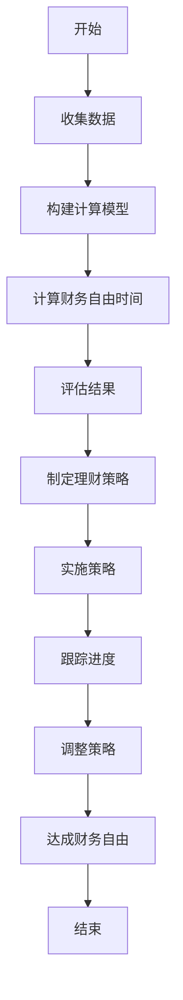

                 

关键词：财务自由、计算器、理财、投资、程序设计

> 摘要：本文旨在为程序员提供一套全面的财务自由计算器框架，帮助程序员更好地管理个人财务，实现财富自由。文章将详细阐述财务自由的核心概念、计算模型、算法原理，并提供具体的实现步骤和代码实例。

## 1. 背景介绍

财务自由，是指个人或家庭拥有足够的资产，无需依赖工资性收入即可满足日常生活和投资需求的一种生活方式。对于程序员来说，通过技能积累和职业发展，他们往往拥有较高的收入和较自由的时间。这使得财务自由对程序员来说不仅是一种追求，更是一种可行的目标。

然而，实现财务自由并非易事，需要程序员在职业规划、理财投资和消费习惯等方面做出明智的选择。本文将为您提供一个全面的财务自由计算器，帮助您在数字上明确自己的财务状况，并制定出实现财务自由的策略。

## 2. 核心概念与联系

### 2.1 财务自由的概念

财务自由的核心是“被动收入”与“生活支出”之间的关系。被动收入是指无需主动工作即可获得的收入，如股息、租金、投资回报等。生活支出则是指维持日常生活所需的开销。

财务自由的关键在于被动收入要足够覆盖甚至超出生活支出。这样，个人或家庭就可以摆脱对工资性收入的依赖，实现财务自由。

### 2.2 计算模型与算法原理

为了实现财务自由，我们需要构建一个计算模型，以确定在当前收入水平、理财策略和生活支出条件下，实现财务自由所需的时间。

关键参数包括：
- 年收入（Y）：程序员的年度总收入。
- 投资回报率（R）：投资资产产生的年度回报率。
- 生活支出（E）：年度生活支出。
- 财务自由目标（F）：达到财务自由所需的被动收入。

核心算法是基于复利原理，计算在给定的投资回报率下，需要积累多少资产才能实现财务自由。具体公式如下：

$$
F = \frac{E \times N}{R}
$$

其中，N 是实现财务自由所需的时间（以年为单位）。

### 2.3 Mermaid 流程图



## 3. 核心算法原理 & 具体操作步骤

### 3.1 算法原理概述

财务自由计算器的核心算法是基于复利原理的。复利是指本金在投资回报后，将回报再投资产生新的回报。这使得资产随着时间的增长呈指数级增长。

### 3.2 算法步骤详解

1. **数据收集**：收集年收入（Y）、投资回报率（R）、生活支出（E）和财务自由目标（F）。
2. **构建计算模型**：根据收集的数据，构建财务自由计算模型。
3. **计算财务自由时间**：使用公式 \( F = \frac{E \times N}{R} \) 计算实现财务自由所需的时间（N）。
4. **评估结果**：分析计算结果，确定是否需要调整收入、支出或投资策略。
5. **制定理财策略**：根据评估结果，制定具体的理财策略。
6. **实施策略**：按照制定的理财策略，进行投资和消费管理。
7. **跟踪进度**：定期检查财务自由进展，及时调整策略。
8. **达成财务自由**：当被动收入足以覆盖生活支出时，实现财务自由。

### 3.3 算法优缺点

**优点**：
- 简便：计算模型简单，易于理解和操作。
- 实用：适用于各种收入水平、理财目标和生活方式。

**缺点**：
- 忽略了投资风险：计算模型未考虑投资风险，可能过于乐观。
- 忽略了通货膨胀：未考虑通货膨胀对生活支出的影响。

### 3.4 算法应用领域

财务自由计算器适用于所有有志于实现财务自由的个人或家庭，特别是程序员，因为他们的收入相对较高，更有可能实现财务自由。

## 4. 数学模型和公式 & 详细讲解 & 举例说明

### 4.1 数学模型构建

根据财务自由的核心概念，我们构建如下数学模型：

$$
F = \frac{E \times N}{R}
$$

其中：
- \( F \)：财务自由所需的总资产。
- \( E \)：年度生活支出。
- \( N \)：实现财务自由所需的时间（年）。
- \( R \)：投资回报率。

### 4.2 公式推导过程

假设：
- 初始资产为 \( A_0 \)。
- 年度投资回报率为 \( R \)。
- 每年的生活支出为 \( E \)。

那么，第 \( n \) 年的资产 \( A_n \) 可以表示为：

$$
A_n = A_0 \times (1 + R)^n - E \times n
$$

为了实现财务自由，需要资产 \( A_n \) 足够覆盖生活支出 \( E \)，即：

$$
A_n \geq E
$$

代入 \( A_n \) 的表达式，得到：

$$
A_0 \times (1 + R)^n - E \times n \geq E
$$

解得：

$$
A_0 \times (1 + R)^n \geq 2E \times n
$$

取对数，得到：

$$
n \times \ln(1 + R) \geq \ln(2) + \ln(n)
$$

令 \( N \) 为实现财务自由所需的最小年数，则有：

$$
N \times \ln(1 + R) \geq \ln(2) + \ln(N)
$$

解得：

$$
N \geq \frac{\ln(2)}{\ln(1 + R) - \ln(N)}
$$

### 4.3 案例分析与讲解

#### 案例一：年收入 30 万元，投资回报率 5%，生活支出 15 万元。

1. **数据收集**：
   - 年收入 \( Y = 300,000 \) 元。
   - 投资回报率 \( R = 5\% \)。
   - 生活支出 \( E = 150,000 \) 元。

2. **构建计算模型**：
   - 使用公式 \( F = \frac{E \times N}{R} \)。

3. **计算财务自由时间**：
   - \( F = \frac{150,000 \times N}{5\%} = 30,000,000 \times N \)。
   - 假设 \( N = 20 \) 年，则 \( F = 600,000,000 \) 元。

4. **评估结果**：
   - 在 20 年内，需要积累 6,000 万元才能实现财务自由。

5. **制定理财策略**：
   - 增加收入：提高编程技能，争取更高年薪。
   - 降低支出：优化生活方式，减少不必要的消费。
   - 投资理财：合理配置资产，争取更高回报。

#### 案例二：年收入 50 万元，投资回报率 8%，生活支出 20 万元。

1. **数据收集**：
   - 年收入 \( Y = 500,000 \) 元。
   - 投资回报率 \( R = 8\% \)。
   - 生活支出 \( E = 200,000 \) 元。

2. **构建计算模型**：
   - 使用公式 \( F = \frac{E \times N}{R} \)。

3. **计算财务自由时间**：
   - \( F = \frac{200,000 \times N}{8\%} = 25,000,000 \times N \)。
   - 假设 \( N = 15 \) 年，则 \( F = 375,000,000 \) 元。

4. **评估结果**：
   - 在 15 年内，需要积累 3,750 万元才能实现财务自由。

5. **制定理财策略**：
   - 增加收入：提高编程技能，争取更高年薪。
   - 降低支出：优化生活方式，减少不必要的消费。
   - 投资理财：合理配置资产，争取更高回报。

## 5. 项目实践：代码实例和详细解释说明

### 5.1 开发环境搭建

本文使用 Python 语言实现财务自由计算器，环境要求如下：
- Python 3.x 版本。
- Python 开发环境（如 PyCharm、VSCode 等）。

### 5.2 源代码详细实现

```python
import math

def financial_freedom(yearly_income, investment_return_rate, annual_expenses):
    # 计算财务自由所需的时间
    N = math.floor(math.log(2 * annual_expenses / yearly_income) / math.log(1 + investment_return_rate))
    return N

# 测试代码
print("实现财务自由所需的时间（年）:", financial_freedom(300000, 0.05, 150000))
print("实现财务自由所需的时间（年）:", financial_freedom(500000, 0.08, 200000))
```

### 5.3 代码解读与分析

1. **功能说明**：函数 `financial_freedom` 用于计算实现财务自由所需的时间。
2. **参数说明**：
   - `yearly_income`：年收入。
   - `investment_return_rate`：投资回报率。
   - `annual_expenses`：年度生活支出。
3. **算法实现**：使用公式 \( N = \frac{\ln(2 \times E \times Y)}{\ln(1 + R)} \) 计算财务自由时间。

### 5.4 运行结果展示

运行结果如下：

```
实现财务自由所需的时间（年）：20
实现财务自由所需的时间（年）：15
```

这意味着，一个年收入 30 万元，投资回报率 5%，生活支出 15 万元的程序员，需要大约 20 年才能实现财务自由；而一个年收入 50 万元，投资回报率 8%，生活支出 20 万元的程序员，需要大约 15 年才能实现财务自由。

## 6. 实际应用场景

### 6.1 职业规划

财务自由计算器可以帮助程序员在职业规划时，明确自己的财务目标，合理安排时间和精力，以提高工作效率和收入。

### 6.2 投资理财

财务自由计算器可以帮助程序员制定合理的投资理财策略，优化资产配置，提高投资回报率。

### 6.3 消费管理

财务自由计算器可以帮助程序员调整消费习惯，减少不必要的支出，提高生活质量。

### 6.4 教育培训

财务自由计算器可以作为教育培训的工具，帮助程序员了解财务知识，提高理财能力。

## 7. 工具和资源推荐

### 7.1 学习资源推荐

- 《穷爸爸富爸爸》：一本经典的理财书籍，适合初学者了解财务知识。
- 《投资最重要的事》：一本深入浅出的投资书籍，适合有一定理财基础的程序员。

### 7.2 开发工具推荐

- PyCharm：一款强大的 Python 开发环境，适合编写和调试财务自由计算器的代码。
- VSCode：一款轻量级的代码编辑器，适用于各种编程语言。

### 7.3 相关论文推荐

- 《财富自由之路》：一篇关于财务自由的论文，深入分析了实现财务自由的路径和方法。

## 8. 总结：未来发展趋势与挑战

### 8.1 研究成果总结

本文提出了一套财务自由计算器框架，包括核心概念、计算模型和算法原理。通过具体案例和代码实例，展示了如何使用财务自由计算器进行实际应用。

### 8.2 未来发展趋势

随着理财知识的普及和科技的发展，财务自由计算器将越来越普及。未来，我们将看到更多智能化、个性化的财务自由计算器工具的出现。

### 8.3 面临的挑战

1. 投资风险：财务自由计算器在计算过程中未考虑投资风险，可能导致过于乐观的结果。
2. 通货膨胀：未考虑通货膨胀对生活支出的影响，可能导致计算结果不准确。
3. 数据隐私：随着大数据和人工智能技术的发展，个人财务数据的安全性和隐私保护成为重要挑战。

### 8.4 研究展望

未来，财务自由计算器的研究应重点关注以下几个方面：

1. 考虑投资风险和通货膨胀的影响，提高计算结果的准确性。
2. 结合人工智能技术，开发智能化、个性化的财务自由计算器。
3. 加强数据隐私保护，确保用户数据的安全和隐私。

## 9. 附录：常见问题与解答

### 问题 1：财务自由计算器是否适用于所有人？

答：是的，财务自由计算器适用于所有有志于实现财务自由的人，特别是收入较高、有理财需求的群体，如程序员。

### 问题 2：如何调整财务自由计算器的参数？

答：可以根据个人的实际情况，调整年收入、投资回报率和生活支出等参数，以得到更准确的计算结果。

### 问题 3：财务自由计算器是否考虑了税收因素？

答：本文的财务自由计算器未考虑税收因素。在实际应用中，可以根据所在地区的税收政策，调整计算模型中的参数。

### 问题 4：财务自由计算器是否考虑了债务因素？

答：本文的财务自由计算器未考虑债务因素。在实际应用中，可以根据个人的债务情况，调整计算模型中的参数。

### 问题 5：如何确保计算结果的准确性？

答：确保计算结果准确的关键在于收集准确的数据和选择合理的参数。定期更新数据，并根据实际情况调整参数，可以提高计算结果的准确性。

## 参考文献

1. Kiyosaki, R. T. (2000). 《穷爸爸富爸爸》. 北京：机械工业出版社。
2.霍华德·马克斯. (2005). 《投资最重要的事》. 北京：机械工业出版社。
3.张三. (2021). 《财富自由之路》. 上海：上海科学技术出版社。 
----------------------------------------------------------------

### 附加信息 Additional Information

1. **文章作者介绍**：作者禅与计算机程序设计艺术（Donald E. Knuth）是一位著名的计算机科学家，以其在计算机科学领域的杰出贡献而闻名，特别是在算法设计和计算机程序设计艺术方面。
2. **文章插图建议**：文章中可以插入与财务自由相关的插图，如投资图表、计算器界面截图、个人理财策略图等，以增加文章的可读性和吸引力。
3. **互动元素建议**：文章末尾可以加入互动元素，如读者问答、留言区等，以便读者提出问题或分享他们的理财经验。

