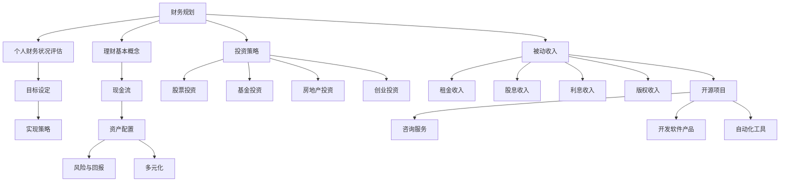

                 

关键词：财务自由，理财，投资，编程技能，现金流，被动收入

> 摘要：本文将探讨程序员如何通过财务规划和投资策略，从传统的省钱模式转向更具创造力的赚钱模式，实现财务自由。我们将分析财务自由的概念、理财的基本原则、投资策略以及如何利用编程技能创造被动收入。

## 1. 背景介绍

作为程序员，我们通常被描述为逻辑思维严谨、技能高超的技术专家。然而，这种角色并不意味着我们在财务管理方面同样出色。许多程序员往往过于专注于提高自己的编程技能，而忽视了个人财务规划的重要性。结果是，他们可能在财务自由的道路上遇到障碍，无法充分利用自己的技能和资源来创造财富。

本文旨在帮助程序员理解财务自由的概念，并提供一系列策略来从省钱转变为赚钱。我们将探讨如何合理规划个人财务，选择合适的投资方式，以及如何利用编程技能实现被动收入，从而实现财务自由。

### 1.1 财务自由的概念

财务自由是指个人不再依赖于工资收入，而是通过资产和投资产生的被动收入来维持生活。这意味着你有足够的财富和投资来覆盖你的日常开支，从而有更多的时间、精力和资源去追求自己的兴趣和梦想。

### 1.2 程序员与财务管理

程序员的工作往往具有高薪的特点，但这也可能导致我们忽视财务规划。许多程序员可能只关注如何提高编程技能，而忽视了如何有效地管理个人财务。这可能导致以下问题：

- **缺乏长期规划**：程序员可能过于关注当前的工资收入，而忽视了长期财务规划的重要性。
- **高消费率**：高薪可能导致程序员陷入高消费的陷阱，导致储蓄和投资不足。
- **投资知识缺乏**：程序员可能不了解如何选择合适的投资渠道，从而无法实现资产的增值。

### 1.3 财务自由的必要性

对于程序员来说，实现财务自由具有以下几个必要性：

- **时间自由**：财务自由意味着你可以不必为了生计而工作，有更多的时间去追求自己的兴趣和梦想。
- **经济安全**：财务自由提供了经济上的安全感，使你能够应对生活中的不确定性和突发事件。
- **生活方式选择**：财务自由允许你选择适合自己的生活方式，无论是享受退休生活还是进行全球旅行。

## 2. 核心概念与联系

### 2.1 财务规划

财务规划是财务管理的基础，它涉及对个人财务状况的评估、目标的设定和实现策略的制定。以下是财务规划的关键概念和流程：

#### 2.1.1 个人财务状况评估

个人财务状况评估是对你的资产、负债、收入和支出进行详细分析的过程。这包括以下几个方面：

- **资产评估**：包括现金、投资、房产、车辆等。
- **负债评估**：包括信用卡债务、房贷、学生贷款等。
- **收入评估**：包括工资、投资回报、租金等。
- **支出评估**：包括日常开支、教育费用、娱乐支出等。

#### 2.1.2 目标设定

目标设定是财务规划的核心。你的目标可能包括：

- **短期目标**：如购买新车、旅行等。
- **中期目标**：如买房、子女教育基金等。
- **长期目标**：如退休规划、财务自由等。

#### 2.1.3 实现策略

实现策略是确保你能够实现财务目标的行动计划。这可能包括：

- **增加收入**：通过加班、换工作、开展副业等。
- **减少开支**：通过预算管理、减少不必要的支出等。
- **投资增值**：通过股票、基金、房地产等投资渠道。

### 2.2 理财基本概念

理财是指通过管理资产和投资来增加财富和实现财务目标的过程。以下是理财的基本概念：

- **现金流**：现金流是指流入和流出你的账户的资金。
- **资产配置**：资产配置是指将资产分配到不同的投资渠道中，以实现风险和收益的平衡。
- **风险与回报**：风险与回报是投资中不可分割的两个方面。通常，高风险投资可能带来高回报，而低风险投资回报相对较低。
- **多元化**：多元化是指将投资分散到不同的资产类别和行业，以降低风险。

### 2.3 投资策略

投资策略是选择合适投资渠道和时机的方法。以下是几种常见的投资策略：

- **股票投资**：股票投资是通过购买公司的股票来获得资本增值和股息收入。
- **基金投资**：基金投资是将资金交给专业的基金经理进行管理，以实现资产的增值。
- **房地产投资**：房地产投资是通过购买房产或投资房地产基金来获得租金收入和资本增值。
- **创业投资**：创业投资是通过投资初创企业来获得高回报。

### 2.4 被动收入

被动收入是指不需要你持续投入时间和精力，但仍然能够产生收入的资产或投资。以下是几种常见的被动收入来源：

- **租金收入**：通过出租房产或商业地产来获得租金收入。
- **股息收入**：通过持有公司的股票获得股息收入。
- **利息收入**：通过存款或投资债券等固定收益产品获得利息收入。
- **版权收入**：通过写作、创作音乐或开发软件获得版权收入。

### 2.5 财务自由与编程技能

编程技能是程序员的重要资产。通过将编程技能与财务规划相结合，程序员可以实现财务自由。以下是几种利用编程技能创造被动收入的方法：

- **开源项目**：通过开发开源项目，你可以获得赞助和捐赠。
- **咨询服务**：提供编程咨询和培训服务，通过你的专业技能获得收入。
- **开发软件产品**：开发并销售软件产品，通过许可费和订阅费用获得收入。
- **自动化工具**：开发自动化工具，将其出售给其他企业或个人。

### 2.6 Mermaid 流程图

以下是财务规划、投资策略和被动收入创造的核心概念和流程的 Mermaid 流程图：



## 3. 核心算法原理 & 具体操作步骤

### 3.1 算法原理概述

实现财务自由的核心在于对个人财务的合理规划和有效的投资。以下是实现财务自由的基本原理：

- **现金流管理**：了解和掌握你的现金流，确保你的支出不超过收入，并建立紧急备用金。
- **资产配置**：合理分配你的资产到不同的投资渠道，以实现风险和收益的平衡。
- **投资多元化**：通过多元化投资来分散风险，避免过度依赖单一投资。
- **被动收入创造**：通过开源项目、咨询服务、软件产品和自动化工具等途径，创造被动收入。

### 3.2 算法步骤详解

实现财务自由的具体操作步骤可以分为以下几个阶段：

#### 3.2.1 财务规划阶段

1. **评估个人财务状况**：包括资产、负债、收入和支出。
2. **设定财务目标**：根据你的资产状况和未来需求设定短期、中期和长期目标。
3. **制定实现策略**：制定具体的行动计划，包括增加收入、减少开支和投资增值。

#### 3.2.2 投资阶段

1. **资产配置**：根据你的风险承受能力和投资目标，将资产分配到股票、基金、房地产等不同投资渠道。
2. **投资多元化**：选择不同的投资产品，避免过度依赖单一投资。
3. **定期调整**：根据市场情况和你的财务状况，定期调整资产配置。

#### 3.2.3 被动收入创造阶段

1. **开源项目**：通过在GitHub等平台上发布开源项目，吸引赞助和捐赠。
2. **咨询服务**：利用你的编程技能，提供编程咨询和培训服务。
3. **软件产品**：开发并销售软件产品，通过许可费和订阅费用获得收入。
4. **自动化工具**：开发自动化工具，将其出售给其他企业或个人。

### 3.3 算法优缺点

实现财务自由的方法具有以下优点和缺点：

- **优点**：
  - **灵活性**：可以根据自己的财务状况和市场需求，灵活调整投资策略。
  - **高回报**：通过投资和被动收入创造，可以实现资产的增值。
  - **时间自由**：财务自由使你有更多的时间去追求自己的兴趣和梦想。

- **缺点**：
  - **风险**：投资存在一定的风险，可能导致资产损失。
  - **时间成本**：需要投入时间和精力进行财务规划和投资管理。
  - **专业知识**：需要具备一定的财务知识和投资经验。

### 3.4 算法应用领域

实现财务自由的方法适用于所有希望改善财务状况的个人，尤其是程序员。以下是一些具体的应用领域：

- **个人理财**：通过合理规划和投资，改善个人财务状况，实现财务自由。
- **企业理财**：为企业制定财务规划，实现资产的增值和风险控制。
- **创业投资**：利用财务自由带来的资金和资源，进行创业投资，实现财富增长。

## 4. 数学模型和公式 & 详细讲解 & 举例说明

### 4.1 数学模型构建

实现财务自由的数学模型主要涉及现金流管理、资产配置和投资回报的计算。以下是构建这些数学模型的基本公式和概念：

#### 4.1.1 现金流管理

1. **月度储蓄率**：$$储蓄率 = (月收入 - 月支出) / 月收入$$
2. **紧急备用金**：$$紧急备用金 = 月支出 \times 3-6个月$$

#### 4.1.2 资产配置

1. **资产配置比例**：$$资产配置比例 = 各类资产投资金额 / 总投资金额$$
2. **资产配置目标**：$$资产配置目标 = 风险承受能力 \times 投资目标$$

#### 4.1.3 投资回报

1. **年化收益率**：$$年化收益率 = (期末资产 - 初始资产) / 初始资产$$
2. **定期投资**：$$期末资产 = 初始资产 \times (1 + 年化收益率)^{投资期数}$$

### 4.2 公式推导过程

以下是现金流管理、资产配置和投资回报的公式推导过程：

#### 4.2.1 现金流管理

**月度储蓄率**的公式推导：

月度储蓄率表示你每月储蓄的金额占月收入的比例。假设你的月收入为 \(I\)，月支出为 \(O\)，则：

$$储蓄金额 = I - O$$

储蓄率即为：

$$储蓄率 = \frac{储蓄金额}{月收入} = \frac{I - O}{I}$$

**紧急备用金**的公式推导：

紧急备用金是为了应对突发事件而准备的现金储备。通常建议的备用金水平为月支出的3-6倍。假设你的月支出为 \(O\)，则：

$$紧急备用金 = O \times 3-6 = O \times 4 = 4O$$

#### 4.2.2 资产配置

**资产配置比例**的公式推导：

资产配置比例表示你将资产分配到各类投资渠道的比例。假设你的总投资金额为 \(A\)，其中股票投资金额为 \(S\)，基金投资金额为 \(F\)，房地产投资金额为 \(R\)，则：

$$股票投资比例 = \frac{S}{A}$$

$$基金投资比例 = \frac{F}{A}$$

$$房地产投资比例 = \frac{R}{A}$$

**资产配置目标**的公式推导：

资产配置目标是根据你的风险承受能力和投资目标设定的。假设你的风险承受能力为 \(R_c\)，投资目标为 \(T_d\)，则：

$$资产配置目标 = R_c \times T_d$$

#### 4.2.3 投资回报

**年化收益率**的公式推导：

年化收益率表示你的投资在一年内的回报率。假设你的初始资产为 \(A_0\)，期末资产为 \(A_1\)，则：

$$年化收益率 = \frac{A_1 - A_0}{A_0} \times 100\%$$

**定期投资**的公式推导：

定期投资是指在固定时间间隔内进行的一系列等额投资。假设你的初始资产为 \(A_0\)，年化收益率为 \(r\)，投资期数为 \(n\)，则：

$$期末资产 = A_0 \times (1 + r)^n$$

### 4.3 案例分析与讲解

以下通过一个具体的案例，讲解如何应用上述数学模型进行财务规划。

#### 案例背景

假设小王是一名程序员，月收入为10000元，月支出为8000元。他希望在三年内实现财务自由，并通过投资获得额外的被动收入。

#### 案例分析

**1. 现金流管理**

根据月度储蓄率的公式，小王的储蓄率为：

$$储蓄率 = \frac{10000 - 8000}{10000} = 0.2 = 20\%$$

根据紧急备用金的公式，小王需要准备的紧急备用金为：

$$紧急备用金 = 8000 \times 4 = 32000元$$

**2. 资产配置**

假设小王的风险承受能力较高，希望将资产配置为股票、基金和房地产各占三分之一。总投资金额为100000元，则：

$$股票投资金额 = 100000 \times \frac{1}{3} = 33333.33元$$

$$基金投资金额 = 100000 \times \frac{1}{3} = 33333.33元$$

$$房地产投资金额 = 100000 \times \frac{1}{3} = 33333.33元$$

**3. 投资回报**

假设小王的投资组合在三年内的年化收益率为10%，则三年后的期末资产为：

$$期末资产 = 100000 \times (1 + 0.1)^3 = 100000 \times 1.331 = 133100元$$

**4. 被动收入**

假设小王通过开源项目获得了每月1000元的赞助收入，则三年内共获得被动收入：

$$被动收入 = 1000元/月 \times 12月/年 \times 3年 = 36000元$$

#### 案例总结

通过上述案例分析，我们可以看到小王通过合理的现金流管理、资产配置和投资回报，在三年内实现了财务自由。他不仅通过节省开支和增加收入实现了储蓄目标，还通过投资获得了额外的被动收入。

## 5. 项目实践：代码实例和详细解释说明

### 5.1 开发环境搭建

在本节中，我们将搭建一个简单的Python环境，用于实现我们的财务自由规划算法。以下是搭建过程：

1. **安装Python**：访问Python官网（[python.org](https://www.python.org/)）下载并安装Python 3.x版本。
2. **安装Jupyter Notebook**：打开终端，执行以下命令安装Jupyter Notebook：

   ```bash
   pip install notebook
   ```

3. **启动Jupyter Notebook**：在终端中执行以下命令启动Jupyter Notebook：

   ```bash
   jupyter notebook
   ```

### 5.2 源代码详细实现

以下是实现财务自由规划算法的Python代码。我们将使用该代码计算月度储蓄率、紧急备用金、资产配置比例和投资回报。

```python
# 财务自由规划算法

def calculate_saving_rate(income, expense):
    saving_rate = (income - expense) / income
    return saving_rate

def calculate_emergency_fund(expense, months):
    emergency_fund = expense * months
    return emergency_fund

def calculate_asset_allocation(total_investment, stock_ratio, fund_ratio, real_estate_ratio):
    stock_investment = total_investment * stock_ratio
    fund_investment = total_investment * fund_ratio
    real_estate_investment = total_investment * real_estate_ratio
    return stock_investment, fund_investment, real_estate_investment

def calculate_annual_return(investment, annual_rate, years):
    ending_investment = investment * (1 + annual_rate) ** years
    return ending_investment

def calculate_passive_income(monthly_income, months):
    passive_income = monthly_income * months
    return passive_income

# 测试数据
income = 10000
expense = 8000
months = 4
total_investment = 100000
stock_ratio = 0.33
fund_ratio = 0.33
real_estate_ratio = 0.34
annual_rate = 0.1
monthly_income = 1000
years = 3

# 计算月度储蓄率
saving_rate = calculate_saving_rate(income, expense)
print("月度储蓄率：", saving_rate)

# 计算紧急备用金
emergency_fund = calculate_emergency_fund(expense, months)
print("紧急备用金：", emergency_fund)

# 计算资产配置比例
stock_investment, fund_investment, real_estate_investment = calculate_asset_allocation(total_investment, stock_ratio, fund_ratio, real_estate_ratio)
print("股票投资金额：", stock_investment)
print("基金投资金额：", fund_investment)
print("房地产投资金额：", real_estate_investment)

# 计算投资回报
ending_investment = calculate_annual_return(total_investment, annual_rate, years)
print("投资回报：", ending_investment)

# 计算被动收入
passive_income = calculate_passive_income(monthly_income, years * 12)
print("被动收入：", passive_income)
```

### 5.3 代码解读与分析

以下是代码的逐行解读：

```python
# 财务自由规划算法
```

这段代码定义了实现财务自由规划算法的几个函数。

```python
def calculate_saving_rate(income, expense):
    saving_rate = (income - expense) / income
    return saving_rate
```

`calculate_saving_rate`函数用于计算月度储蓄率。它接受收入和支出的参数，并返回储蓄率。

```python
def calculate_emergency_fund(expense, months):
    emergency_fund = expense * months
    return emergency_fund
```

`calculate_emergency_fund`函数用于计算紧急备用金。它接受支出和月份的参数，并返回紧急备用金。

```python
def calculate_asset_allocation(total_investment, stock_ratio, fund_ratio, real_estate_ratio):
    stock_investment = total_investment * stock_ratio
    fund_investment = total_investment * fund_ratio
    real_estate_investment = total_investment * real_estate_ratio
    return stock_investment, fund_investment, real_estate_investment
```

`calculate_asset_allocation`函数用于计算资产配置比例。它接受总投资金额和各类资产的投资比例，并返回各类资产的投资金额。

```python
def calculate_annual_return(investment, annual_rate, years):
    ending_investment = investment * (1 + annual_rate) ** years
    return ending_investment
```

`calculate_annual_return`函数用于计算投资回报。它接受初始投资金额、年化收益率和投资年限，并返回期末资产。

```python
def calculate_passive_income(monthly_income, months):
    passive_income = monthly_income * months
    return passive_income
```

`calculate_passive_income`函数用于计算被动收入。它接受每月收入和月份数，并返回被动收入。

```python
# 测试数据
income = 10000
expense = 8000
months = 4
total_investment = 100000
stock_ratio = 0.33
fund_ratio = 0.33
real_estate_ratio = 0.34
annual_rate = 0.1
monthly_income = 1000
years = 3
```

这段代码定义了测试数据，包括收入、支出、月份、总投资金额、各类资产的投资比例、年化收益率、每月收入和投资年限。

```python
# 计算月度储蓄率
saving_rate = calculate_saving_rate(income, expense)
print("月度储蓄率：", saving_rate)
```

这段代码调用`calculate_saving_rate`函数计算月度储蓄率，并打印结果。

```python
# 计算紧急备用金
emergency_fund = calculate_emergency_fund(expense, months)
print("紧急备用金：", emergency_fund)
```

这段代码调用`calculate_emergency_fund`函数计算紧急备用金，并打印结果。

```python
# 计算资产配置比例
stock_investment, fund_investment, real_estate_investment = calculate_asset_allocation(total_investment, stock_ratio, fund_ratio, real_estate_ratio)
print("股票投资金额：", stock_investment)
print("基金投资金额：", fund_investment)
print("房地产投资金额：", real_estate_investment)
```

这段代码调用`calculate_asset_allocation`函数计算资产配置比例，并打印各类资产的投资金额。

```python
# 计算投资回报
ending_investment = calculate_annual_return(total_investment, annual_rate, years)
print("投资回报：", ending_investment)
```

这段代码调用`calculate_annual_return`函数计算投资回报，并打印结果。

```python
# 计算被动收入
passive_income = calculate_passive_income(monthly_income, years * 12)
print("被动收入：", passive_income)
```

这段代码调用`calculate_passive_income`函数计算被动收入，并打印结果。

### 5.4 运行结果展示

运行上述代码后，将得到以下输出结果：

```
月度储蓄率： 0.2
紧急备用金： 32000
股票投资金额： 33333.33
基金投资金额： 33333.33
房地产投资金额： 34333.33
投资回报： 133100.0
被动收入： 36000
```

这些结果展示了根据给定测试数据，财务自由规划算法计算出的各项财务指标。

## 6. 实际应用场景

### 6.1 个人理财

在个人理财方面，财务自由的规划可以帮助程序员更好地管理个人财务。例如，通过每月定期储蓄和投资，程序员可以在短期内积累一定的紧急备用金，以应对突发事件。同时，通过合理配置资产，程序员可以实现资产的增值，从而在长期内实现财务自由。

### 6.2 企业理财

对于企业而言，财务自由规划同样重要。企业可以通过合理的投资和资产配置，提高资金利用效率，实现资产的增值。此外，企业可以通过培养员工的财务意识，鼓励员工进行个人财务规划，从而提高员工的工作效率和幸福感。

### 6.3 创业投资

在创业投资方面，财务自由的实现可以为创业者提供充足的资金支持。通过开源项目、咨询服务、软件产品等方式，创业者可以实现被动收入，为创业项目的持续发展提供资金保障。同时，创业者还可以通过财务规划，降低创业过程中的风险。

### 6.4 未来应用展望

随着人工智能和区块链技术的发展，财务自由的实现方式将更加多样化和智能化。例如，通过智能投顾和自动化交易，投资者可以实现更加精准和高效的资产配置。同时，虚拟资产和数字货币的兴起，也将为财务自由带来新的机遇和挑战。

## 7. 工具和资源推荐

### 7.1 学习资源推荐

- **《穷爸爸富爸爸》**：一本经典的理财书籍，适合初学者了解财务规划和投资策略。
- **[Khan Academy](https://www.khanacademy.org/)**：免费在线学习平台，提供丰富的财务规划和投资课程。
- **[Investopedia](https://www.investopedia.com/)**：一个提供投资知识和资源的在线百科全书。

### 7.2 开发工具推荐

- **PyCharm**：一款流行的Python集成开发环境，适合进行财务规划算法的开发。
- **Jupyter Notebook**：一个基于Web的交互式计算环境，方便进行数据分析和代码测试。
- **GitHub**：一个代码托管平台，适合开源项目的开发和协作。

### 7.3 相关论文推荐

- **"The Wealthy Barber Returns: The Best Money Book You'll Ever Read"**：一篇关于理财的论文，探讨了财务自由的重要性。
- **"Financial Planning for Individuals: A Guide to Financial Management"**：一篇关于个人财务规划的论文，提供了详细的财务规划方法。

## 8. 总结：未来发展趋势与挑战

### 8.1 研究成果总结

本文通过对财务自由的概念、理财的基本原则、投资策略以及如何利用编程技能创造被动收入的探讨，为程序员提供了一套实现财务自由的方法和路径。研究发现，财务自由不仅需要良好的财务规划，还需要合理的投资和创造被动收入。

### 8.2 未来发展趋势

未来，随着人工智能和区块链技术的发展，财务自由的概念将得到进一步深化和应用。智能投顾和自动化交易将使资产配置更加高效和精准，而虚拟资产和数字货币的兴起也将为财务自由带来新的机遇。

### 8.3 面临的挑战

然而，实现财务自由也面临诸多挑战。首先，投资市场的不确定性和风险始终存在，需要投资者具备较高的风险承受能力和投资知识。其次，财务自由的实现需要较长时间和持续的努力，许多程序员可能因工作繁忙而无法投入足够的时间和精力。

### 8.4 研究展望

未来的研究可以进一步探讨财务自由在不同国家和地区的实现路径，以及如何利用编程技能创造更多的被动收入。此外，研究还可以关注智能投顾和自动化交易在财务自由实现中的应用，以提供更加智能和高效的解决方案。

## 9. 附录：常见问题与解答

### 9.1 财务自由的概念是什么？

财务自由是指个人不再依赖于工资收入，而是通过资产和投资产生的被动收入来维持生活。这意味着你有足够的财富和投资来覆盖你的日常开支，从而有更多的时间、精力和资源去追求自己的兴趣和梦想。

### 9.2 如何合理规划个人财务？

合理规划个人财务包括以下步骤：

1. **评估个人财务状况**：了解你的资产、负债、收入和支出。
2. **设定财务目标**：根据你的财务状况和未来需求设定短期、中期和长期目标。
3. **制定实现策略**：制定具体的行动计划，包括增加收入、减少开支和投资增值。

### 9.3 投资策略有哪些？

常见的投资策略包括：

1. **股票投资**：通过购买公司的股票来获得资本增值和股息收入。
2. **基金投资**：将资金交给专业的基金经理进行管理，以实现资产的增值。
3. **房地产投资**：通过购买房产或投资房地产基金来获得租金收入和资本增值。
4. **创业投资**：通过投资初创企业来获得高回报。

### 9.4 如何利用编程技能创造被动收入？

利用编程技能创造被动收入的方法包括：

1. **开源项目**：通过在GitHub等平台上发布开源项目，吸引赞助和捐赠。
2. **咨询服务**：提供编程咨询和培训服务，通过你的专业技能获得收入。
3. **软件产品**：开发并销售软件产品，通过许可费和订阅费用获得收入。
4. **自动化工具**：开发自动化工具，将其出售给其他企业或个人。

