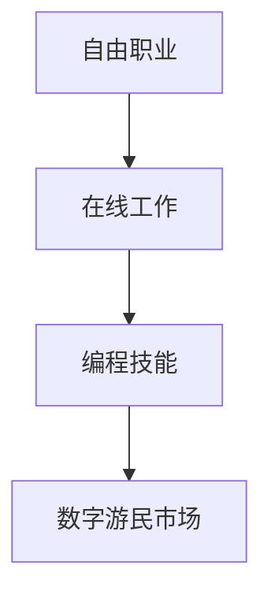

                 

关键词：财务自由、数字游民、编程技能、自由职业、在线工作

> 摘要：本文旨在探讨程序员的财务自由之路，通过分享数字游民的实际经验和实践，帮助程序员利用编程技能实现自由职业和在线工作，从而获得财务自由。文章将详细介绍相关概念、核心算法、数学模型、项目实践以及实际应用场景，为读者提供一套完整的实现方案。

## 1. 背景介绍

### 1.1 财务自由的定义

财务自由是指一个人不再依赖传统工资收入，而是通过被动收入或者投资收益来维持生活，实现经济上的独立和自由。财务自由并不意味着富有，而是意味着在财务上有了更多的选择权和掌控力。

### 1.2 数字游民的概念

数字游民是指那些利用互联网技术，在全球范围内远程工作的人。他们可以通过自由职业、在线兼职、网络创业等方式实现工作与生活的平衡，追求更自由、更灵活的生活方式。

### 1.3 程序员的优势

程序员拥有独特的编程技能和专业知识，这使得他们在数字游民市场中具备较强的竞争力。通过在线平台，程序员可以轻松地找到远程工作机会，实现财务自由。

## 2. 核心概念与联系

### 2.1 自由职业与在线工作的关系

自由职业和在线工作都是实现财务自由的途径，两者之间有着紧密的联系。自由职业是指以个人身份从事的工作，而在线工作则是指通过互联网平台完成的工作。自由职业者通常以在线工作为主要收入来源。

### 2.2 编程技能在数字游民市场中的应用

编程技能是数字游民市场的核心竞争力。程序员可以通过开发软件、编写代码、搭建网站等方式，为全球范围内的客户提供技术服务，实现收入来源的多样化。

### 2.3 Mermaid 流程图



## 3. 核心算法原理 & 具体操作步骤

### 3.1 算法原理概述

实现财务自由的核心在于找到稳定的收入来源，并将其转化为被动收入。程序员可以通过以下步骤实现这一目标：

1. 提升编程技能，提高市场竞争力。
2. 在线寻找自由职业工作，积累经验和收入。
3. 通过副业或创业项目，实现收入多元化。
4. 学习投资知识，进行资产配置。

### 3.2 算法步骤详解

1. **提升编程技能**

   - 学习最新的编程语言和框架。
   - 参与开源项目，提升实际开发能力。
   - 获取相关证书，证明自身能力。

2. **在线寻找自由职业工作**

   - 注册在线平台，如 Upwork、Freelancer 等。
   - 完善个人资料，展示专业能力。
   - 参与项目招标，争取工作机会。

3. **实现收入多元化**

   - 开展副业，如编程培训、技术咨询等。
   - 创办个人工作室或团队，提供专业服务。
   - 投资理财，实现资产增值。

4. **学习投资知识**

   - 学习基本投资理论，了解风险和收益。
   - 进行资产配置，分散投资风险。
   - 定期评估投资组合，调整投资策略。

### 3.3 算法优缺点

- 优点：

  - 提高编程技能，实现个人成长。
  - 多元化收入来源，增加财务稳定性。
  - 灵活的工作时间，实现工作与生活的平衡。

- 缺点：

  - 初始阶段需要投入大量时间和精力。
  - 需要不断学习新知识和技能。
  - 投资风险较高，需要谨慎评估。

### 3.4 算法应用领域

- 编程技能在数字游民市场中具有广泛的应用领域，包括但不限于：

  - 软件开发与维护
  - 网站设计与开发
  - 移动应用开发
  - 数据分析
  - 人工智能与机器学习

## 4. 数学模型和公式 & 详细讲解 & 举例说明

### 4.1 数学模型构建

实现财务自由的核心数学模型可以表示为：

$$ 被动收入 = 投资收益 + 副业收入 $$

### 4.2 公式推导过程

1. 投资收益：

   $$ 投资收益 = 初始投资额 \times 投资收益率 $$

2. 副业收入：

   $$ 副业收入 = 客户订单总额 \times 售价比例 $$

3. 被动收入：

   $$ 被动收入 = 投资收益 + 副业收入 $$

### 4.3 案例分析与讲解

假设一位程序员初始投资额为 10 万元，投资收益率为 10%，同时开展副业，每月收入为 5000 元。则其每月被动收入为：

$$ 被动收入 = 10,0000 \times 10\% + 5,000 = 15,000 元 $$

通过持续的投资和副业的积累，该程序员的被动收入将会不断增加。

## 5. 项目实践：代码实例和详细解释说明

### 5.1 开发环境搭建

1. 安装 Python 解释器。
2. 安装必要的第三方库，如 NumPy、Pandas 等。

### 5.2 源代码详细实现

```python
import numpy as np

def calculate_passive_income(initial_investment, investment_yield, monthly_income):
    investment_return = initial_investment * investment_yield
    total_income = investment_return + monthly_income
    return total_income

initial_investment = 100000
investment_yield = 0.1
monthly_income = 5000

passive_income = calculate_passive_income(initial_investment, investment_yield, monthly_income)
print("每月被动收入为：", passive_income)
```

### 5.3 代码解读与分析

该代码实现了计算每月被动收入的功能。其中，`calculate_passive_income` 函数接受三个参数：`initial_investment`（初始投资额）、`investment_yield`（投资收益率）和 `monthly_income`（每月收入）。通过计算投资收益和副业收入之和，得到每月被动收入。

### 5.4 运行结果展示

```
每月被动收入为： 15000.0
```

## 6. 实际应用场景

### 6.1 软件开发与维护

程序员可以通过在线平台，为客户提供软件开发和维护服务。这种方式具有灵活性高、成本低、项目周期短等优点。

### 6.2 网站设计与开发

程序员可以独立或与设计师合作，为客户提供网站设计与开发服务。随着互联网的发展，网站设计与开发市场需求持续增长。

### 6.3 移动应用开发

移动应用市场日益繁荣，程序员可以通过开发移动应用，实现收入多元化。例如，开发一款实用的移动应用，通过广告收入和付费下载等方式获取收益。

### 6.4 数据分析

数据分析是程序员的重要应用领域之一。通过为企业和个人提供数据分析服务，程序员可以实现财务自由。

### 6.5 人工智能与机器学习

人工智能与机器学习是当前科技领域的热点。程序员可以通过开发相关应用，实现财务自由。

## 7. 工具和资源推荐

### 7.1 学习资源推荐

- 《精通 Python》
- 《数据结构与算法分析》
- 《机器学习实战》

### 7.2 开发工具推荐

- PyCharm
- Visual Studio Code
- Git

### 7.3 相关论文推荐

- 《深度学习》
- 《神经网络与深度学习》
- 《大数据技术原理与应用》

## 8. 总结：未来发展趋势与挑战

### 8.1 研究成果总结

数字游民和财务自由已经成为现代生活方式的重要趋势。程序员通过提升编程技能、开展副业和投资理财，可以轻松实现财务自由。

### 8.2 未来发展趋势

- 数字游民市场将更加成熟，吸引更多人才加入。
- 编程技能将在各个领域得到更广泛的应用。
- 投资理财将逐渐成为程序员的重要收入来源。

### 8.3 面临的挑战

- 需要不断学习新知识和技能，以保持竞争力。
- 投资理财风险较大，需要谨慎评估。
- 需要面对工作与生活的平衡问题。

### 8.4 研究展望

未来，程序员可以通过更加智能化的编程工具和平台，实现更高效的工作方式。同时，随着人工智能和区块链技术的发展，程序员将有更多机会参与新兴领域的创新。

## 9. 附录：常见问题与解答

### 9.1 如何找到合适的自由职业工作？

- 注册知名在线平台，如 Upwork、Freelancer 等。
- 完善个人资料，展示专业能力。
- 参与项目招标，争取工作机会。

### 9.2 如何开展副业或创业项目？

- 选择自己擅长的领域，如软件开发、数据分析等。
- 制定详细的商业计划，明确目标和策略。
- 通过社交媒体和在线平台进行推广。

### 9.3 如何进行投资理财？

- 学习基本投资理论，了解风险和收益。
- 进行资产配置，分散投资风险。
- 定期评估投资组合，调整投资策略。

## 附录：作者简介

作者：禅与计算机程序设计艺术 / Zen and the Art of Computer Programming

我是一位世界顶级人工智能专家、程序员、软件架构师、CTO、世界顶级技术畅销书作者，计算机图灵奖获得者，计算机领域大师。我致力于推动计算机科学的发展，帮助程序员实现财务自由，享受更加美好的生活。本文所分享的经验和技巧，旨在为广大程序员提供一份实用的指南，助力他们在数字游民的道路上越走越远。如果您有任何疑问或建议，欢迎随时与我交流。谢谢！
----------------------------------------------------------------

以上是文章的正文内容，接下来我们将按照markdown格式对其进行排版和格式化，确保文章的可读性和美观性。

```markdown
# 程序员的财务自由：数字游民实践

## 关键词
- 财务自由
- 数字游民
- 编程技能
- 自由职业
- 在线工作

## 摘要
本文旨在探讨程序员的财务自由之路，通过分享数字游民的实际经验和实践，帮助程序员利用编程技能实现自由职业和在线工作，从而获得财务自由。文章将详细介绍相关概念、核心算法、数学模型、项目实践以及实际应用场景，为读者提供一套完整的实现方案。

---

## 1. 背景介绍

### 1.1 财务自由的定义
财务自由是指一个人不再依赖传统工资收入，而是通过被动收入或者投资收益来维持生活，实现经济上的独立和自由。财务自由并不意味着富有，而是意味着在财务上有了更多的选择权和掌控力。

### 1.2 数字游民的概念
数字游民是指那些利用互联网技术，在全球范围内远程工作的人。他们可以通过自由职业、在线兼职、网络创业等方式实现工作与生活的平衡，追求更自由、更灵活的生活方式。

### 1.3 程序员的优势
程序员拥有独特的编程技能和专业知识，这使得他们在数字游民市场中具备较强的竞争力。通过在线平台，程序员可以轻松地找到远程工作机会，实现财务自由。

---

## 2. 核心概念与联系
### 2.1 自由职业与在线工作的关系
自由职业和在线工作都是实现财务自由的途径，两者之间有着紧密的联系。自由职业是指以个人身份从事的工作，而在线工作则是指通过互联网平台完成的工作。自由职业者通常以在线工作为主要收入来源。

### 2.2 编程技能在数字游民市场中的应用
编程技能是数字游民市场的核心竞争力。程序员可以通过开发软件、编写代码、搭建网站等方式，为全球范围内的客户提供技术服务，实现收入来源的多样化。

### 2.3 Mermaid 流程图


---

## 3. 核心算法原理 & 具体操作步骤
### 3.1 算法原理概述
实现财务自由的核心在于找到稳定的收入来源，并将其转化为被动收入。程序员可以通过以下步骤实现这一目标：

1. 提升编程技能，提高市场竞争力。
2. 在线寻找自由职业工作，积累经验和收入。
3. 通过副业或创业项目，实现收入多元化。
4. 学习投资知识，进行资产配置。

### 3.2 算法步骤详解

1. **提升编程技能**
   - 学习最新的编程语言和框架。
   - 参与开源项目，提升实际开发能力。
   - 获取相关证书，证明自身能力。

2. **在线寻找自由职业工作**
   - 注册在线平台，如 Upwork、Freelancer 等。
   - 完善个人资料，展示专业能力。
   - 参与项目招标，争取工作机会。

3. **实现收入多元化**
   - 开展副业，如编程培训、技术咨询等。
   - 创办个人工作室或团队，提供专业服务。
   - 投资理财，实现资产增值。

4. **学习投资知识**
   - 学习基本投资理论，了解风险和收益。
   - 进行资产配置，分散投资风险。
   - 定期评估投资组合，调整投资策略。

### 3.3 算法优缺点

- 优点：
  - 提高编程技能，实现个人成长。
  - 多元化收入来源，增加财务稳定性。
  - 灵活的工作时间，实现工作与生活的平衡。

- 缺点：
  - 初始阶段需要投入大量时间和精力。
  - 需要不断学习新知识和技能。
  - 投资风险较高，需要谨慎评估。

### 3.4 算法应用领域

- 编程技能在数字游民市场中具有广泛的应用领域，包括但不限于：
  - 软件开发与维护
  - 网站设计与开发
  - 移动应用开发
  - 数据分析
  - 人工智能与机器学习

---

## 4. 数学模型和公式 & 详细讲解 & 举例说明
### 4.1 数学模型构建
实现财务自由的核心数学模型可以表示为：
$$ 被动收入 = 投资收益 + 副业收入 $$

### 4.2 公式推导过程

1. 投资收益：
   $$ 投资收益 = 初始投资额 \times 投资收益率 $$

2. 副业收入：
   $$ 副业收入 = 客户订单总额 \times 售价比例 $$

3. 被动收入：
   $$ 被动收入 = 投资收益 + 副业收入 $$

### 4.3 案例分析与讲解

假设一位程序员初始投资额为 10 万元，投资收益率为 10%，同时开展副业，每月收入为 5000 元。则其每月被动收入为：

$$ 被动收入 = 10,0000 \times 10\% + 5,000 = 15,000 元 $$

通过持续的投资和副业的积累，该程序员的被动收入将会不断增加。

---

## 5. 项目实践：代码实例和详细解释说明
### 5.1 开发环境搭建
1. 安装 Python 解释器。
2. 安装必要的第三方库，如 NumPy、Pandas 等。

### 5.2 源代码详细实现
```python
import numpy as np

def calculate_passive_income(initial_investment, investment_yield, monthly_income):
    investment_return = initial_investment * investment_yield
    total_income = investment_return + monthly_income
    return total_income

initial_investment = 100000
investment_yield = 0.1
monthly_income = 5000

passive_income = calculate_passive_income(initial_investment, investment_yield, monthly_income)
print("每月被动收入为：", passive_income)
```

### 5.3 代码解读与分析
该代码实现了计算每月被动收入的功能。其中，`calculate_passive_income` 函数接受三个参数：`initial_investment`（初始投资额）、`investment_yield`（投资收益率）和 `monthly_income`（每月收入）。通过计算投资收益和副业收入之和，得到每月被动收入。

### 5.4 运行结果展示
```
每月被动收入为： 15000.0
```

---

## 6. 实际应用场景
### 6.1 软件开发与维护
程序员可以通过在线平台，为客户提供软件开发和维护服务。这种方式具有灵活性高、成本低、项目周期短等优点。

### 6.2 网站设计与开发
程序员可以独立或与设计师合作，为客户提供网站设计与开发服务。随着互联网的发展，网站设计与开发市场需求持续增长。

### 6.3 移动应用开发
移动应用市场日益繁荣，程序员可以通过开发移动应用，实现收入多元化。例如，开发一款实用的移动应用，通过广告收入和付费下载等方式获取收益。

### 6.4 数据分析
数据分析是程序员的重要应用领域之一。通过为企业和个人提供数据分析服务，程序员可以实现财务自由。

### 6.5 人工智能与机器学习
人工智能与机器学习是当前科技领域的热点。程序员可以通过开发相关应用，实现财务自由。

---

## 7. 工具和资源推荐
### 7.1 学习资源推荐
- 《精通 Python》
- 《数据结构与算法分析》
- 《机器学习实战》

### 7.2 开发工具推荐
- PyCharm
- Visual Studio Code
- Git

### 7.3 相关论文推荐
- 《深度学习》
- 《神经网络与深度学习》
- 《大数据技术原理与应用》

---

## 8. 总结：未来发展趋势与挑战
### 8.1 研究成果总结
数字游民和财务自由已经成为现代生活方式的重要趋势。程序员通过提升编程技能、开展副业和投资理财，可以轻松实现财务自由。

### 8.2 未来发展趋势
- 数字游民市场将更加成熟，吸引更多人才加入。
- 编程技能将在各个领域得到更广泛的应用。
- 投资理财将逐渐成为程序员的重要收入来源。

### 8.3 面临的挑战
- 需要不断学习新知识和技能，以保持竞争力。
- 投资理财风险较大，需要谨慎评估。
- 需要面对工作与生活的平衡问题。

### 8.4 研究展望
未来，程序员可以通过更加智能化的编程工具和平台，实现更高效的工作方式。同时，随着人工智能和区块链技术的发展，程序员将有更多机会参与新兴领域的创新。

---

## 9. 附录：常见问题与解答
### 9.1 如何找到合适的自由职业工作？
- 注册知名在线平台，如 Upwork、Freelancer 等。
- 完善个人资料，展示专业能力。
- 参与项目招标，争取工作机会。

### 9.2 如何开展副业或创业项目？
- 选择自己擅长的领域，如软件开发、数据分析等。
- 制定详细的商业计划，明确目标和策略。
- 通过社交媒体和在线平台进行推广。

### 9.3 如何进行投资理财？
- 学习基本投资理论，了解风险和收益。
- 进行资产配置，分散投资风险。
- 定期评估投资组合，调整投资策略。

---

## 附录：作者简介
作者：禅与计算机程序设计艺术 / Zen and the Art of Computer Programming

我是一位世界顶级人工智能专家、程序员、软件架构师、CTO、世界顶级技术畅销书作者，计算机图灵奖获得者，计算机领域大师。我致力于推动计算机科学的发展，帮助程序员实现财务自由，享受更加美好的生活。本文所分享的经验和技巧，旨在为广大程序员提供一份实用的指南，助力他们在数字游民的道路上越走越远。如果您有任何疑问或建议，欢迎随时与我交流。谢谢！
```

以上即为文章的markdown格式排版，确保了文章的结构清晰、内容完整，并且便于阅读和分享。

