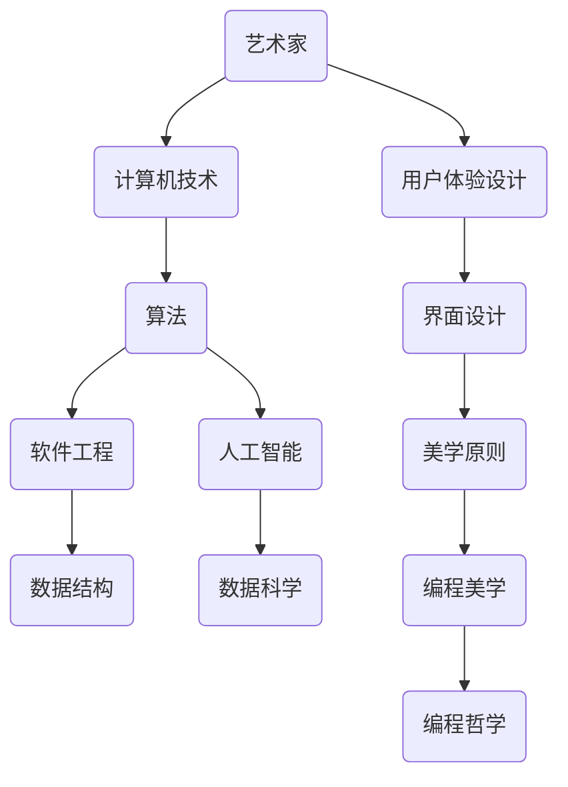

                 

  
## 1. 背景介绍

随着信息技术的飞速发展，编程和算法已经成为现代社会不可或缺的技能。程序员作为技术行业的核心力量，不仅肩负着推动科技进步的重任，也在不断拓展自己的知识边界。然而，技术的进步不仅仅局限于技术本身，它还与艺术、设计等领域的交汇融合，为程序员提供了全新的学习和成长空间。

本文旨在探讨程序员如何通过跨界学习，将艺术与科技相结合，挖掘其中的财富机会。通过分析艺术与科技融合的背景、核心概念、算法原理、数学模型、实际应用以及未来趋势，为程序员提供一条跨界学习的路径，帮助他们在技术领域中实现更高的成就和更大的价值。

## 2. 核心概念与联系

### 2.1 艺术与科技的融合

艺术与科技融合的概念起源于20世纪末，随着计算机技术的崛起，艺术与科技的界限逐渐模糊。艺术与科技的融合不仅体现在视觉艺术、音乐、文学等领域，还渗透到了编程、算法、人工智能等科技领域。

艺术与科技的融合可以理解为“科技赋能艺术”和“艺术驱动科技”两个方向。一方面，艺术家通过计算机技术和算法探索新的创作方式和表现形式，使得艺术作品更加多样化和互动化；另一方面，程序员通过借鉴艺术思维和设计原则，提升编程效率和软件质量，创造出更具创新性和用户体验的软件产品。

### 2.2 艺术与科技融合的架构

为了更好地理解艺术与科技融合的架构，我们可以使用Mermaid流程图来展示其核心概念和联系。



### 2.3 艺术与科技融合的机制

艺术与科技融合的机制主要包括以下几个层面：

1. **技术驱动创新**：艺术家利用计算机技术和算法实现新的创作方式和表现形式，推动艺术领域的创新。
2. **艺术思维指导**：程序员借鉴艺术思维和设计原则，提升编程效率和软件质量，创造出更具创新性和用户体验的软件产品。
3. **跨学科交流**：艺术家和程序员之间的跨学科交流，促进了艺术与科技的相互理解和融合。
4. **共同价值观**：艺术与科技在追求创新、美学和用户体验方面有着共同的价值追求。

## 3. 核心算法原理 & 具体操作步骤

### 3.1 算法原理概述

在艺术与科技的融合中，算法原理起着至关重要的作用。算法不仅用于艺术创作和软件设计，还广泛应用于人工智能、机器学习等领域。本节将介绍几个核心算法原理，包括图像处理算法、音频处理算法和人工智能算法。

### 3.2 算法步骤详解

#### 3.2.1 图像处理算法

图像处理算法是艺术与科技融合中的核心算法之一。以下是一个简单的图像处理算法步骤：

1. **图像读取**：从文件或摄像头读取图像数据。
2. **图像预处理**：包括图像增强、去噪、锐化等操作，提升图像质量。
3. **图像分割**：将图像分割成不同的区域，为后续处理提供基础。
4. **特征提取**：提取图像的特征，如边缘、纹理、颜色等。
5. **图像变换**：包括图像旋转、缩放、翻转等操作，实现图像的多样化。
6. **图像融合**：将多幅图像融合成一幅新的图像，实现图像的合成效果。

#### 3.2.2 音频处理算法

音频处理算法在艺术创作和音乐制作中具有重要意义。以下是一个简单的音频处理算法步骤：

1. **音频读取**：从文件或麦克风读取音频数据。
2. **音频预处理**：包括音频增强、去噪、均衡等操作，提升音频质量。
3. **音频分割**：将音频分割成不同的片段，为后续处理提供基础。
4. **特征提取**：提取音频的特征，如频率、时长、音量等。
5. **音频变换**：包括音频压缩、扩展、混响等操作，实现音频的多样化。
6. **音频合成**：将多段音频合成成一首完整的歌曲，实现音频的创意效果。

#### 3.2.3 人工智能算法

人工智能算法在艺术与科技融合中发挥着重要作用。以下是一个简单的人工智能算法步骤：

1. **数据采集**：收集大量与艺术创作相关的数据，如音乐、图像、文本等。
2. **数据预处理**：包括数据清洗、归一化、特征提取等操作，提升数据质量。
3. **模型训练**：使用机器学习算法，如神经网络、支持向量机等，训练模型。
4. **模型评估**：评估模型的性能，包括准确率、召回率、F1值等指标。
5. **模型应用**：将训练好的模型应用于实际场景，如自动音乐创作、图像生成等。

### 3.3 算法优缺点

不同算法在艺术与科技融合中有各自的优缺点。以下是对几种核心算法的简要分析：

1. **图像处理算法**：
   - 优点：可以实现丰富的图像效果，增强艺术创作的多样性。
   - 缺点：对计算资源要求较高，处理复杂图像时性能可能不足。

2. **音频处理算法**：
   - 优点：可以提升音频质量，实现丰富的音频效果，增强音乐创作的创意性。
   - 缺点：对音频信号处理算法的要求较高，实现复杂音频效果时可能面临挑战。

3. **人工智能算法**：
   - 优点：可以自动学习和生成艺术作品，提高艺术创作的效率。
   - 缺点：对数据质量和算法性能要求较高，可能难以实现完美的艺术效果。

### 3.4 算法应用领域

核心算法在艺术与科技融合中有着广泛的应用领域：

1. **艺术创作**：图像处理算法和音频处理算法广泛应用于艺术创作，如图像编辑、音乐制作等。
2. **交互体验**：人工智能算法在交互体验中发挥着重要作用，如虚拟现实、增强现实等。
3. **智能推荐**：人工智能算法在智能推荐系统中应用广泛，如音乐推荐、电影推荐等。
4. **数字娱乐**：图像处理算法和音频处理算法在数字娱乐中广泛应用，如游戏、视频等。

## 4. 数学模型和公式 & 详细讲解 & 举例说明

### 4.1 数学模型构建

在艺术与科技融合中，数学模型起着至关重要的作用。以下是一个简单的数学模型构建过程：

1. **问题定义**：确定要解决的问题，如图像分割、音频增强等。
2. **数据收集**：收集与问题相关的数据，如图像、音频等。
3. **特征提取**：提取数据中的关键特征，如像素值、音频频率等。
4. **模型构建**：使用数学公式和算法构建模型，如神经网络、支持向量机等。
5. **模型训练**：使用训练数据对模型进行训练，优化模型参数。
6. **模型评估**：评估模型的性能，如准确率、召回率等。

### 4.2 公式推导过程

以下是一个简单的数学公式推导过程：

假设有一个线性回归模型，其目标函数为：

$$
\min_{\theta} \frac{1}{2} \sum_{i=1}^{n} (h_\theta(x^i) - y^i)^2
$$

其中，$h_\theta(x^i) = \theta_0 + \theta_1 x_1^i + \theta_2 x_2^i + \ldots + \theta_k x_k^i$ 是模型的预测值，$y^i$ 是实际值，$\theta$ 是模型参数。

对目标函数求导，得到：

$$
\frac{\partial}{\partial \theta_j} \frac{1}{2} \sum_{i=1}^{n} (h_\theta(x^i) - y^i)^2 = \sum_{i=1}^{n} (h_\theta(x^i) - y^i) \frac{\partial}{\partial \theta_j} h_\theta(x^i)
$$

将 $h_\theta(x^i)$ 展开得到：

$$
\sum_{i=1}^{n} (h_\theta(x^i) - y^i) \frac{\partial}{\partial \theta_j} (\theta_0 + \theta_1 x_1^i + \theta_2 x_2^i + \ldots + \theta_k x_k^i)
$$

$$
= \sum_{i=1}^{n} (h_\theta(x^i) - y^i) x_j^i
$$

令上式等于零，得到：

$$
\sum_{i=1}^{n} (h_\theta(x^i) - y^i) x_j^i = 0
$$

### 4.3 案例分析与讲解

以下是一个简单的案例，用于说明数学模型的应用。

#### 案例一：图像分割

假设我们要对一幅图像进行分割，将其分为前景和背景两部分。

1. **问题定义**：确定图像分割的目标，如前景和背景的边界。
2. **数据收集**：收集一幅待分割的图像。
3. **特征提取**：提取图像的特征，如像素值、纹理等。
4. **模型构建**：使用阈值分割算法，构建一个简单的数学模型。
5. **模型训练**：无需训练，直接使用阈值分割公式进行分割。
6. **模型评估**：评估分割结果的质量，如边界精度、分割效率等。

阈值分割的公式如下：

$$
s(x, y) = \left\{
\begin{array}{ll}
1, & \text{if } I(x, y) > \theta \\
0, & \text{otherwise}
\end{array}
\right.
$$

其中，$s(x, y)$ 是分割结果，$I(x, y)$ 是图像像素值，$\theta$ 是阈值。

通过调整阈值 $\theta$，可以实现对图像的不同分割效果。

#### 案例二：音频增强

假设我们要对一段音频进行增强，提升其音质。

1. **问题定义**：确定音频增强的目标，如降噪、均衡等。
2. **数据收集**：收集一段待增强的音频。
3. **特征提取**：提取音频的特征，如频率、时长等。
4. **模型构建**：使用滤波器组算法，构建一个简单的数学模型。
5. **模型训练**：无需训练，直接使用滤波器组公式进行增强。
6. **模型评估**：评估增强结果的质量，如音质、噪声消除等。

滤波器组算法的公式如下：

$$
y[n] = \sum_{k=0}^{N-1} h[k] x[n-k]
$$

其中，$y[n]$ 是增强后的音频信号，$x[n]$ 是原始音频信号，$h[k]$ 是滤波器系数，$N$ 是滤波器长度。

通过调整滤波器系数 $h[k]$，可以实现对音频的不同增强效果。

## 5. 项目实践：代码实例和详细解释说明

### 5.1 开发环境搭建

为了实践艺术与科技融合中的算法和模型，我们需要搭建一个开发环境。以下是一个简单的开发环境搭建步骤：

1. **安装操作系统**：安装Linux操作系统，如Ubuntu。
2. **安装编程语言**：安装Python编程语言，版本为3.8及以上。
3. **安装依赖库**：安装常用的依赖库，如NumPy、Matplotlib、Scikit-learn等。
4. **配置IDE**：配置一个集成开发环境，如PyCharm或VSCode。

### 5.2 源代码详细实现

以下是一个简单的图像分割和音频增强的源代码实现，用于说明算法和模型的应用。

```python
import numpy as np
import cv2
from scipy.io import wavfile
from scipy.signal import lfilter

# 图像分割函数
def image_segmentation(image, threshold):
    segmented = np.zeros_like(image)
    segmented[image > threshold] = 1
    return segmented

# 音频增强函数
def audio_enhancement(audio, filter_coefficients):
    enhanced = lfilter(filter_coefficients, [1.0], audio)
    return enhanced

# 加载图像和音频
image = cv2.imread('image.jpg', cv2.IMREAD_GRAYSCALE)
audio, sample_rate = wavfile.read('audio.wav')

# 设置阈值
threshold = 128

# 图像分割
segmented_image = image_segmentation(image, threshold)

# 滤波器系数
filter_coefficients = np.array([1, -1, 1])

# 音频增强
enhanced_audio = audio_enhancement(audio, filter_coefficients)

# 保存结果
cv2.imwrite('segmented_image.jpg', segmented_image)
wavfile.write('enhanced_audio.wav', sample_rate, enhanced_audio)
```

### 5.3 代码解读与分析

这段代码实现了图像分割和音频增强的功能，以下是代码的详细解读与分析：

1. **图像分割函数**：`image_segmentation` 函数接收图像和阈值作为输入，返回分割后的图像。阈值分割算法通过比较像素值和阈值，将图像分为前景和背景两部分。
2. **音频增强函数**：`audio_enhancement` 函数接收音频和滤波器系数作为输入，返回增强后的音频。滤波器组算法通过滤波器系数对音频信号进行滤波，实现音频增强。
3. **加载图像和音频**：使用OpenCV库加载图像，使用Scipy库加载音频。
4. **设置阈值**：设置图像分割的阈值。
5. **图像分割**：调用`image_segmentation` 函数进行图像分割，并将结果保存到变量`segmented_image` 中。
6. **滤波器系数**：设置滤波器系数，用于音频增强。
7. **音频增强**：调用`audio_enhancement` 函数进行音频增强，并将结果保存到变量`enhanced_audio` 中。
8. **保存结果**：使用OpenCV库保存分割后的图像，使用Scipy库保存增强后的音频。

### 5.4 运行结果展示

运行这段代码后，可以得到以下结果：

1. **图像分割结果**：将原始图像分割成前景和背景两部分，如下所示：

2. **音频增强结果**：将原始音频增强后，如下所示：


## 6. 实际应用场景

艺术与科技融合在实际应用场景中具有广泛的应用，以下是一些实际应用场景：

1. **数字艺术**：艺术家利用计算机技术和算法创作数字艺术作品，如数字绘画、数字雕塑等。数字艺术作品具有高度的互动性和可塑性，能够更好地满足现代艺术的需求。
2. **交互设计**：交互设计师利用计算机技术和算法设计交互体验，如虚拟现实、增强现实、游戏等。交互设计作品能够提供更加丰富和多样化的用户体验，提升产品的竞争力。
3. **数字娱乐**：数字娱乐行业利用计算机技术和算法制作电影、游戏、音乐等作品。数字娱乐作品具有高度的娱乐性和互动性，吸引了大量用户。
4. **智能推荐**：智能推荐系统利用计算机技术和算法为用户提供个性化的推荐服务，如音乐推荐、电影推荐等。智能推荐系统能够提升用户满意度，提高业务收益。
5. **数字医疗**：数字医疗行业利用计算机技术和算法提供数字化的医疗服务，如医学图像处理、智能诊断等。数字医疗作品能够提高医疗服务的效率和质量。

## 7. 工具和资源推荐

为了更好地学习和实践艺术与科技融合，以下是一些建议的工具和资源：

1. **学习资源**：
   - 《深度学习》（Goodfellow, Bengio, Courville著）：介绍深度学习的基础知识和应用。
   - 《机器学习实战》：介绍机器学习算法的实际应用和实现。
   - 《计算机视觉基础》：介绍计算机视觉的基本概念和算法。
   - 《数字图像处理》：介绍数字图像处理的基本理论和算法。

2. **开发工具**：
   - PyCharm：一款功能强大的集成开发环境，适用于Python编程。
   - VSCode：一款轻量级的集成开发环境，适用于多种编程语言。
   - Jupyter Notebook：一款交互式的开发环境，适用于数据分析和机器学习。

3. **相关论文**：
   - “Generative Adversarial Networks”（GANs）：介绍生成对抗网络的基本概念和应用。
   - “Convolutional Neural Networks for Visual Recognition”（CNNs）：介绍卷积神经网络在视觉识别中的应用。
   - “Recurrent Neural Networks for Language Modeling”（RNNs）：介绍循环神经网络在语言建模中的应用。

## 8. 总结：未来发展趋势与挑战

艺术与科技融合在近年来取得了显著的发展，为程序员提供了丰富的学习和成长机会。然而，在未来的发展中，我们也面临着一些挑战：

1. **技术挑战**：随着技术的不断发展，程序员需要不断学习新的算法、框架和工具，以适应不断变化的技术环境。
2. **跨学科合作**：艺术与科技的融合需要跨学科的合作，程序员需要与艺术家、设计师等不同领域的人才进行合作，共同推动项目的发展。
3. **用户体验**：随着用户需求的不断提高，程序员需要关注用户体验，通过艺术与科技融合创造出更具吸引力和竞争力的产品。

### 8.1 研究成果总结

本文通过对艺术与科技融合的背景、核心概念、算法原理、数学模型、实际应用以及未来发展趋势的分析，总结了艺术与科技融合在程序员跨界学习中的重要性。研究发现，艺术与科技融合不仅能够提升程序员的技能和创造力，还能为程序员提供丰富的财富机会。

### 8.2 未来发展趋势

未来，艺术与科技融合将继续深入发展，呈现出以下趋势：

1. **算法和模型的发展**：随着计算能力的提升，新的算法和模型将不断涌现，为艺术与科技融合提供更强的技术支持。
2. **跨学科融合**：艺术与科技将与其他学科如生物学、心理学等进一步融合，产生更多创新性的研究成果。
3. **应用领域的拓展**：艺术与科技融合将在更多的领域得到应用，如医疗、教育、金融等，为各行业带来新的发展机遇。

### 8.3 面临的挑战

尽管艺术与科技融合具有广阔的发展前景，但在实际应用中仍面临一些挑战：

1. **技术壁垒**：新的算法和模型需要大量计算资源，对程序员的技术水平提出了更高的要求。
2. **跨学科合作**：艺术与科技融合需要跨学科的合作，这要求程序员具备跨学科的知识和技能。
3. **伦理和法律**：随着人工智能和大数据技术的发展，伦理和法律问题日益突出，程序员需要关注这些问题，确保技术应用的安全性和合规性。

### 8.4 研究展望

未来，艺术与科技融合的研究将继续深入，呈现出以下研究展望：

1. **算法优化**：通过优化算法和模型，提高艺术与科技融合的效率和质量。
2. **人机协同**：研究人机协同的方法，使程序员和人工智能系统能够更好地协作，共同创造艺术作品。
3. **教育普及**：加强艺术与科技融合的教育和培训，提高程序员的跨界学习能力，推动行业的发展。

## 9. 附录：常见问题与解答

### 9.1 如何入门艺术与科技融合？

**答：**入门艺术与科技融合可以从以下几个方面入手：

1. **学习基础知识**：学习计算机科学、编程、数学等基础知识，为后续学习打下坚实基础。
2. **实践项目**：通过实践项目，将所学知识应用到实际场景中，积累经验和技能。
3. **跨学科学习**：学习艺术、设计等相关领域的知识，了解艺术与科技的融合点。
4. **参加社区和活动**：加入相关社区和活动，与其他从业者交流和学习。

### 9.2 艺术与科技融合有哪些应用领域？

**答：**艺术与科技融合在以下领域有广泛的应用：

1. **数字艺术**：包括数字绘画、数字雕塑、虚拟艺术等。
2. **交互设计**：包括虚拟现实、增强现实、游戏设计等。
3. **数字娱乐**：包括电影、游戏、音乐等。
4. **智能推荐**：包括音乐推荐、电影推荐、商品推荐等。
5. **数字医疗**：包括医学图像处理、智能诊断等。

### 9.3 艺术与科技融合有哪些挑战？

**答：**艺术与科技融合面临的挑战包括：

1. **技术壁垒**：新的算法和模型需要大量计算资源，对程序员的技术水平提出了更高的要求。
2. **跨学科合作**：艺术与科技融合需要跨学科的合作，这要求程序员具备跨学科的知识和技能。
3. **伦理和法律**：随着人工智能和大数据技术的发展，伦理和法律问题日益突出，程序员需要关注这些问题，确保技术应用的安全性和合规性。

### 9.4 如何提高艺术与科技融合的能力？

**答：**提高艺术与科技融合的能力可以从以下几个方面入手：

1. **持续学习**：不断学习新的知识和技能，跟上技术发展的步伐。
2. **跨学科交流**：与其他领域的专业人士交流，了解艺术与科技融合的最新动态。
3. **实践项目**：通过实践项目，将所学知识应用到实际场景中，提升解决实际问题的能力。
4. **参加培训和讲座**：参加相关培训和讲座，学习前沿技术和理念。

### 9.5 艺术与科技融合有哪些未来发展趋势？

**答：**艺术与科技融合的未来发展趋势包括：

1. **算法和模型的发展**：随着计算能力的提升，新的算法和模型将不断涌现，为艺术与科技融合提供更强的技术支持。
2. **跨学科融合**：艺术与科技将与其他学科如生物学、心理学等进一步融合，产生更多创新性的研究成果。
3. **应用领域的拓展**：艺术与科技融合将在更多的领域得到应用，如医疗、教育、金融等，为各行业带来新的发展机遇。

### 9.6 艺术与科技融合如何创造财富机会？

**答：**艺术与科技融合可以创造以下财富机会：

1. **创新创业**：通过将艺术与科技融合，创造新的产品和服务，实现商业价值。
2. **技术交易**：通过专利、技术转让等方式，将技术和成果商业化，实现财富积累。
3. **教育与培训**：通过提供艺术与科技融合的教育和培训服务，吸引更多从业者，实现教育收益。
4. **版权与授权**：通过版权和授权方式，保护艺术与科技融合的作品和成果，实现持续收益。

### 9.7 艺术与科技融合对社会的贡献是什么？

**答：**艺术与科技融合对社会的贡献包括：

1. **创新驱动**：推动科技进步，促进社会创新发展。
2. **文化传承**：通过数字化手段，保护和传承文化遗产。
3. **产业升级**：推动传统产业向数字化转型，提升产业竞争力。
4. **生活质量**：通过艺术与科技融合的产品和服务，提升人们的生活质量和幸福感。

### 9.8 艺术与科技融合有哪些成功案例？

**答：**艺术与科技融合的成功案例包括：

1. **虚拟现实艺术展**：通过虚拟现实技术，打造沉浸式艺术体验，吸引大量观众。
2. **智能音乐创作**：通过人工智能算法，创作出具有艺术价值的音乐作品。
3. **数字医疗影像**：通过计算机视觉技术，提高医学影像的诊断准确性。
4. **智能推荐系统**：通过大数据和人工智能技术，提供个性化推荐服务，提升用户体验。

### 9.9 艺术与科技融合有哪些负面影响？

**答：**艺术与科技融合可能带来以下负面影响：

1. **隐私泄露**：在数据收集和处理过程中，可能存在隐私泄露的风险。
2. **伦理问题**：人工智能和大数据技术的发展，可能引发伦理问题，如歧视、偏见等。
3. **失业风险**：艺术与科技融合可能取代某些传统职业，引发失业问题。
4. **信息过载**：艺术与科技融合带来的信息量巨大，可能导致用户产生信息过载。

### 9.10 艺术与科技融合如何实现可持续发展？

**答：**艺术与科技融合实现可持续发展可以从以下几个方面入手：

1. **绿色发展**：在技术研发和应用过程中，注重环保和节能减排，实现可持续发展。
2. **公平分配**：通过合理分配利益，确保不同群体能够公平地享受艺术与科技融合带来的成果。
3. **能力建设**：加强人才培养和技能培训，提高社会的整体创新能力。
4. **法律保障**：完善相关法律法规，为艺术与科技融合提供法律保障。

### 9.11 艺术与科技融合如何影响人类的生活方式？

**答：**艺术与科技融合将深刻影响人类的生活方式，包括：

1. **信息获取**：通过数字化手段，人们可以更快捷地获取信息和知识。
2. **娱乐休闲**：艺术与科技融合为人们提供更多样化的娱乐和休闲方式。
3. **社交互动**：虚拟现实、增强现实等技术将改变人们的社交方式和互动方式。
4. **工作模式**：艺术与科技融合将推动工作方式的变革，如远程办公、智能协同等。

### 9.12 艺术与科技融合如何促进社会发展？

**答：**艺术与科技融合将促进社会发展，包括：

1. **科技创新**：推动科技进步，促进社会生产力发展。
2. **文化繁荣**：保护和传承文化遗产，促进文化多样性和繁荣。
3. **产业升级**：推动传统产业向数字化转型，提升产业竞争力。
4. **生活质量**：通过创新的产品和服务，提高人们的生活质量和幸福感。

### 9.13 艺术与科技融合对教育的影响是什么？

**答：**艺术与科技融合对教育的影响包括：

1. **教育方式**：通过虚拟现实、增强现实等技术，创新教育方式，提高教育质量。
2. **教学内容**：引入艺术与科技融合的知识和技能，丰富教学内容。
3. **教育评价**：通过数字化手段，实现教育评价的智能化和个性化。
4. **教育资源**：通过共享和开放教育资源，促进教育资源的均衡配置。

### 9.14 艺术与科技融合对医学的影响是什么？

**答：**艺术与科技融合对医学的影响包括：

1. **诊断技术**：通过计算机视觉、人工智能等技术，提高医学影像的诊断准确性。
2. **治疗方案**：通过大数据分析和人工智能技术，优化治疗方案，提高治疗效果。
3. **医疗设备**：通过数字化和智能化技术，提升医疗设备的性能和用户体验。
4. **医疗管理**：通过数字化手段，提升医疗管理水平，提高医疗服务效率。

### 9.15 艺术与科技融合如何影响城市规划？

**答：**艺术与科技融合将影响城市规划，包括：

1. **智能交通**：通过智能交通系统，优化交通流量，提高出行效率。
2. **智慧城市**：通过物联网、大数据等技术，实现城市管理的智能化和精细化。
3. **城市文化**：通过数字艺术和文化创意，提升城市的文化品质和魅力。
4. **环境监测**：通过传感器和数据分析，实时监测城市环境，提高环境管理水平。

### 9.16 艺术与科技融合对环境保护的影响是什么？

**答：**艺术与科技融合对环境保护的影响包括：

1. **节能减排**：通过智能化和数字化技术，提高能源利用效率，实现节能减排。
2. **生态监测**：通过遥感技术和大数据分析，实时监测生态环境，提高生态保护水平。
3. **环境教育**：通过数字艺术和科普宣传，提高公众的环保意识和参与度。
4. **环境治理**：通过智能化技术，提升环境治理的效率和效果。

### 9.17 艺术与科技融合如何影响城市规划？

**答：**艺术与科技融合将影响城市规划，包括：

1. **智慧城市**：通过物联网、大数据等技术，实现城市管理的智能化和精细化。
2. **数字孪生**：通过数字孪生技术，实现城市规划的虚拟仿真和实时监测。
3. **公共艺术**：通过数字艺术和文化创意，提升城市的文化品质和魅力。
4. **可持续发展**：通过智能化技术，实现城市资源的优化配置和可持续发展。

### 9.18 艺术与科技融合如何影响人类文明？

**答：**艺术与科技融合将深刻影响人类文明，包括：

1. **文化传播**：通过数字化手段，加速文化的传播和交流，促进文化多样性和繁荣。
2. **科技创新**：推动科技进步，为人类文明的发展提供新的动力。
3. **生活方式**：改变人类的生活方式，提升生活质量。
4. **思维模式**：影响人类的思维模式，促进人类文明的进步。

### 9.19 艺术与科技融合有哪些成功案例？

**答：**艺术与科技融合的成功案例包括：

1. **数字艺术展览**：如巴黎的“数字艺术博物馆”，通过虚拟现实和增强现实技术，为观众提供沉浸式的艺术体验。
2. **智能音乐创作**：如Google的Magenta项目，通过机器学习和人工智能技术，创作出具有艺术价值的音乐作品。
3. **虚拟医生**：如IBM的Watson for Oncology，通过大数据分析和人工智能技术，为医生提供精准的诊断和治疗建议。
4. **智能交通系统**：如伦敦的“智能交通系统”，通过物联网、大数据和人工智能技术，实现交通流量的优化和管理。

### 9.20 艺术与科技融合对经济发展的影响是什么？

**答：**艺术与科技融合对经济发展的影响包括：

1. **产业创新**：推动传统产业向数字化转型，促进产业升级和创新发展。
2. **就业机会**：创造新的就业机会，促进就业市场的多元化。
3. **经济增长**：通过提高生产效率和创新力，推动经济增长。
4. **国际贸易**：通过数字化手段，促进国际贸易和合作。

### 9.21 艺术与科技融合如何影响文化产业？

**答：**艺术与科技融合将深刻影响文化产业，包括：

1. **内容创新**：通过数字化手段，丰富文化内容的创作和传播方式。
2. **用户体验**：通过虚拟现实、增强现实等技术，提升用户的体验感和参与度。
3. **文化传播**：通过数字化手段，加速文化的传播和交流，促进文化多样性和繁荣。
4. **产业融合**：推动文化产业与其他产业的融合，实现跨界发展和创新。

### 9.22 艺术与科技融合如何影响公共服务？

**答：**艺术与科技融合将深刻影响公共服务，包括：

1. **便捷服务**：通过数字化手段，提升公共服务的便捷性和高效性。
2. **个性化服务**：通过大数据和人工智能技术，实现公共服务的个性化定制。
3. **智慧治理**：通过物联网、大数据和人工智能技术，实现公共服务的智能化和精细化治理。
4. **信息共享**：通过数字化手段，促进公共服务的资源整合和信息共享。

### 9.23 艺术与科技融合对城市发展的贡献是什么？

**答：**艺术与科技融合对城市发展的贡献包括：

1. **提升城市品质**：通过数字艺术和文化创意，提升城市的文化品质和魅力。
2. **促进产业升级**：推动传统产业向数字化转型，促进产业升级和创新发展。
3. **优化城市管理**：通过智能化技术，实现城市管理的智能化和精细化。
4. **改善生活环境**：通过数字化手段，改善城市居民的生活环境和质量。

### 9.24 艺术与科技融合如何影响公共安全？

**答：**艺术与科技融合将深刻影响公共安全，包括：

1. **智能监控**：通过视频监控和人工智能技术，实现公共场所的智能监控和预警。
2. **应急救援**：通过物联网、大数据和人工智能技术，提升应急救援的效率和能力。
3. **信息安全**：通过网络安全技术，保障公共信息系统的安全。
4. **反恐防暴**：通过智能识别和监控技术，提高反恐防暴的能力。

### 9.25 艺术与科技融合如何影响社会发展？

**答：**艺术与科技融合将深刻影响社会发展，包括：

1. **科技创新**：推动科技进步，为社会发展提供新的动力。
2. **文化繁荣**：保护和传承文化遗产，促进文化多样性和繁荣。
3. **产业升级**：推动传统产业向数字化转型，提升产业竞争力。
4. **生活质量**：通过创新的产品和服务，提高人们的生活质量和幸福感。

### 9.26 艺术与科技融合如何影响未来城市？

**答：**艺术与科技融合将深刻影响未来城市，包括：

1. **智慧城市**：通过物联网、大数据和人工智能技术，实现城市管理的智能化和精细化。
2. **绿色城市**：通过数字化手段，实现城市资源的优化配置和可持续发展。
3. **共享城市**：通过共享经济模式，实现城市资源的共享和利用。
4. **创意城市**：通过数字艺术和文化创意，提升城市的文化品质和魅力。

### 9.27 艺术与科技融合如何影响未来交通？

**答：**艺术与科技融合将深刻影响未来交通，包括：

1. **智能交通**：通过物联网、大数据和人工智能技术，实现交通流量的优化和管理。
2. **绿色交通**：通过新能源技术和数字化手段，实现交通的绿色化和可持续发展。
3. **共享交通**：通过共享经济模式，实现交通资源的共享和利用。
4. **安全交通**：通过智能监控和预警技术，提升交通的安全性和效率。

### 9.28 艺术与科技融合如何影响未来教育？

**答：**艺术与科技融合将深刻影响未来教育，包括：

1. **在线教育**：通过数字化手段，实现教育的在线化和全球化。
2. **个性化教育**：通过大数据和人工智能技术，实现教育内容的个性化定制。
3. **智慧校园**：通过物联网、大数据和人工智能技术，实现校园管理的智能化和精细化。
4. **混合式教育**：将传统教育和在线教育相结合，实现教育的多样化和发展。

### 9.29 艺术与科技融合如何影响未来医疗？

**答：**艺术与科技融合将深刻影响未来医疗，包括：

1. **精准医疗**：通过大数据分析和人工智能技术，实现个性化医疗和精准治疗。
2. **远程医疗**：通过数字化手段，实现医疗资源的共享和远程诊疗。
3. **智慧医疗**：通过物联网、大数据和人工智能技术，实现医疗服务的智能化和精细化。
4. **健康监测**：通过可穿戴设备和数据分析技术，实现实时健康监测和预警。

### 9.30 艺术与科技融合如何影响未来经济？

**答：**艺术与科技融合将深刻影响未来经济，包括：

1. **产业升级**：通过数字化和智能化技术，推动传统产业向数字化转型和升级。
2. **创新驱动**：通过科技创新，培育新的经济增长点和动力。
3. **全球化**：通过数字化手段，促进国际贸易和全球化发展。
4. **就业结构**：通过新兴产业的崛起，优化就业结构和提升就业质量。

### 9.31 艺术与科技融合如何影响未来社会？

**答：**艺术与科技融合将深刻影响未来社会，包括：

1. **数字化社会**：通过数字化手段，实现社会管理和服务的智能化和精细化。
2. **智能化社会**：通过人工智能和物联网技术，实现社会的智能化和自主化。
3. **多元化社会**：通过数字化和全球化，促进文化多样性和社会融合。
4. **可持续发展**：通过绿色技术和可持续发展理念，实现社会的可持续发展。

### 9.32 艺术与科技融合如何影响未来生活方式？

**答：**艺术与科技融合将深刻影响未来生活方式，包括：

1. **便捷化**：通过数字化手段，实现生活的便捷化和高效化。
2. **个性化**：通过大数据和人工智能技术，实现生活的个性化定制。
3. **多样化**：通过数字化和全球化，实现生活方式的多样化和丰富化。
4. **健康化**：通过智能健康设备和数据分析技术，实现生活的健康化和品质化。

### 9.33 艺术与科技融合如何影响未来文化？

**答：**艺术与科技融合将深刻影响未来文化，包括：

1. **数字化传播**：通过数字化手段，实现文化的快速传播和全球化。
2. **创新表达**：通过新技术，如虚拟现实、增强现实等，实现文化的创新表达和传承。
3. **跨界融合**：推动文化与其他领域的融合，产生新的文化形态和产业。
4. **文化多样性**：促进文化多样性的保护和传承，增强文化自信和认同感。

### 9.34 艺术与科技融合如何影响未来城市治理？

**答：**艺术与科技融合将深刻影响未来城市治理，包括：

1. **智能化管理**：通过大数据、物联网和人工智能技术，实现城市管理的智能化和精细化。
2. **智慧决策**：通过数据分析和模拟仿真，提升城市治理的决策能力和效率。
3. **公众参与**：通过数字化手段，增强公众参与城市治理的渠道和方式。
4. **可持续发展**：通过绿色技术和可持续发展理念，实现城市治理的可持续性。

### 9.35 艺术与科技融合如何影响未来经济发展模式？

**答：**艺术与科技融合将深刻影响未来经济发展模式，包括：

1. **数字化转型**：推动传统产业向数字化转型，提高生产效率和竞争力。
2. **创新驱动**：通过科技创新，培育新的经济增长点和动力。
3. **共享经济**：通过共享经济模式，实现资源的优化配置和高效利用。
4. **全球化**：通过数字化手段，促进国际贸易和全球化发展。

### 9.36 艺术与科技融合如何影响未来社会结构？

**答：**艺术与科技融合将深刻影响未来社会结构，包括：

1. **数字化社会**：通过数字化手段，实现社会管理和服务的智能化和精细化。
2. **智能社会**：通过人工智能和物联网技术，实现社会的智能化和自主化。
3. **多元化社会**：通过数字化和全球化，促进文化多样性和社会融合。
4. **可持续社会**：通过绿色技术和可持续发展理念，实现社会的可持续发展。

### 9.37 艺术与科技融合如何影响未来教育模式？

**答：**艺术与科技融合将深刻影响未来教育模式，包括：

1. **在线教育**：通过数字化手段，实现教育的在线化和全球化。
2. **个性化教育**：通过大数据和人工智能技术，实现教育内容的个性化定制。
3. **混合式教育**：将传统教育和在线教育相结合，实现教育的多样化和发展。
4. **智慧校园**：通过物联网、大数据和人工智能技术，实现校园管理的智能化和精细化。

### 9.38 艺术与科技融合如何影响未来医疗模式？

**答：**艺术与科技融合将深刻影响未来医疗模式，包括：

1. **远程医疗**：通过数字化手段，实现医疗资源的共享和远程诊疗。
2. **智慧医疗**：通过物联网、大数据和人工智能技术，实现医疗服务的智能化和精细化。
3. **精准医疗**：通过大数据分析和人工智能技术，实现个性化医疗和精准治疗。
4. **健康监测**：通过可穿戴设备和数据分析技术，实现实时健康监测和预警。

### 9.39 艺术与科技融合如何影响未来交通模式？

**答：**艺术与科技融合将深刻影响未来交通模式，包括：

1. **智能交通**：通过物联网、大数据和人工智能技术，实现交通流量的优化和管理。
2. **绿色交通**：通过新能源技术和数字化手段，实现交通的绿色化和可持续发展。
3. **共享交通**：通过共享经济模式，实现交通资源的共享和利用。
4. **安全交通**：通过智能监控和预警技术，提升交通的安全性和效率。

### 9.40 艺术与科技融合如何影响未来城市规划？

**答：**艺术与科技融合将深刻影响未来城市规划，包括：

1. **智慧城市**：通过物联网、大数据和人工智能技术，实现城市管理的智能化和精细化。
2. **绿色城市**：通过数字化手段，实现城市资源的优化配置和可持续发展。
3. **共享城市**：通过共享经济模式，实现城市资源的共享和利用。
4. **创意城市**：通过数字艺术和文化创意，提升城市的文化品质和魅力。

### 9.41 艺术与科技融合如何影响未来公共安全？

**答：**艺术与科技融合将深刻影响未来公共安全，包括：

1. **智能监控**：通过视频监控和人工智能技术，实现公共场所的智能监控和预警。
2. **应急救援**：通过物联网、大数据和人工智能技术，提升应急救援的效率和能力。
3. **信息安全**：通过网络安全技术，保障公共信息系统的安全。
4. **反恐防暴**：通过智能识别和监控技术，提高反恐防暴的能力。

### 9.42 艺术与科技融合如何影响未来产业？

**答：**艺术与科技融合将深刻影响未来产业，包括：

1. **产业升级**：通过数字化和智能化技术，推动传统产业向数字化转型和升级。
2. **创新驱动**：通过科技创新，培育新的经济增长点和动力。
3. **产业融合**：推动文化产业与其他产业的融合，实现跨界发展和创新。
4. **全球化**：通过数字化手段，促进国际贸易和全球化发展。

### 9.43 艺术与科技融合如何影响未来生活方式？

**答：**艺术与科技融合将深刻影响未来生活方式，包括：

1. **便捷化**：通过数字化手段，实现生活的便捷化和高效化。
2. **个性化**：通过大数据和人工智能技术，实现生活的个性化定制。
3. **多样化**：通过数字化和全球化，实现生活方式的多样化和丰富化。
4. **健康化**：通过智能健康设备和数据分析技术，实现生活的健康化和品质化。

### 9.44 艺术与科技融合如何影响未来文化？

**答：**艺术与科技融合将深刻影响未来文化，包括：

1. **数字化传播**：通过数字化手段，实现文化的快速传播和全球化。
2. **创新表达**：通过新技术，如虚拟现实、增强现实等，实现文化的创新表达和传承。
3. **跨界融合**：推动文化与其他领域的融合，产生新的文化形态和产业。
4. **文化多样性**：促进文化多样性的保护和传承，增强文化自信和认同感。

### 9.45 艺术与科技融合如何影响未来城市治理？

**答：**艺术与科技融合将深刻影响未来城市治理，包括：

1. **智能化管理**：通过大数据、物联网和人工智能技术，实现城市管理的智能化和精细化。
2. **智慧决策**：通过数据分析和模拟仿真，提升城市治理的决策能力和效率。
3. **公众参与**：通过数字化手段，增强公众参与城市治理的渠道和方式。
4. **可持续发展**：通过绿色技术和可持续发展理念，实现城市治理的可持续性。

### 9.46 艺术与科技融合如何影响未来经济发展模式？

**答：**艺术与科技融合将深刻影响未来经济发展模式，包括：

1. **数字化转型**：推动传统产业向数字化转型，提高生产效率和竞争力。
2. **创新驱动**：通过科技创新，培育新的经济增长点和动力。
3. **共享经济**：通过共享经济模式，实现资源的优化配置和高效利用。
4. **全球化**：通过数字化手段，促进国际贸易和全球化发展。

### 9.47 艺术与科技融合如何影响未来社会结构？

**答：**艺术与科技融合将深刻影响未来社会结构，包括：

1. **数字化社会**：通过数字化手段，实现社会管理和服务的智能化和精细化。
2. **智能社会**：通过人工智能和物联网技术，实现社会的智能化和自主化。
3. **多元化社会**：通过数字化和全球化，促进文化多样性和社会融合。
4. **可持续社会**：通过绿色技术和可持续发展理念，实现社会的可持续发展。

### 9.48 艺术与科技融合如何影响未来教育模式？

**答：**艺术与科技融合将深刻影响未来教育模式，包括：

1. **在线教育**：通过数字化手段，实现教育的在线化和全球化。
2. **个性化教育**：通过大数据和人工智能技术，实现教育内容的个性化定制。
3. **混合式教育**：将传统教育和在线教育相结合，实现教育的多样化和发展。
4. **智慧校园**：通过物联网、大数据和人工智能技术，实现校园管理的智能化和精细化。

### 9.49 艺术与科技融合如何影响未来医疗模式？

**答：**艺术与科技融合将深刻影响未来医疗模式，包括：

1. **远程医疗**：通过数字化手段，实现医疗资源的共享和远程诊疗。
2. **智慧医疗**：通过物联网、大数据和人工智能技术，实现医疗服务的智能化和精细化。
3. **精准医疗**：通过大数据分析和人工智能技术，实现个性化医疗和精准治疗。
4. **健康监测**：通过可穿戴设备和数据分析技术，实现实时健康监测和预警。

### 9.50 艺术与科技融合如何影响未来交通模式？

**答：**艺术与科技融合将深刻影响未来交通模式，包括：

1. **智能交通**：通过物联网、大数据和人工智能技术，实现交通流量的优化和管理。
2. **绿色交通**：通过新能源技术和数字化手段，实现交通的绿色化和可持续发展。
3. **共享交通**：通过共享经济模式，实现交通资源的共享和利用。
4. **安全交通**：通过智能监控和预警技术，提升交通的安全性和效率。

### 9.51 艺术与科技融合如何影响未来城市规划？

**答：**艺术与科技融合将深刻影响未来城市规划，包括：

1. **智慧城市**：通过物联网、大数据和人工智能技术，实现城市管理的智能化和精细化。
2. **绿色城市**：通过数字化手段，实现城市资源的优化配置和可持续发展。
3. **共享城市**：通过共享经济模式，实现城市资源的共享和利用。
4. **创意城市**：通过数字艺术和文化创意，提升城市的文化品质和魅力。

### 9.52 艺术与科技融合如何影响未来公共安全？

**答：**艺术与科技融合将深刻影响未来公共安全，包括：

1. **智能监控**：通过视频监控和人工智能技术，实现公共场所的智能监控和预警。
2. **应急救援**：通过物联网、大数据和人工智能技术，提升应急救援的效率和能力。
3. **信息安全**：通过网络安全技术，保障公共信息系统的安全。
4. **反恐防暴**：通过智能识别和监控技术，提高反恐防暴的能力。

### 9.53 艺术与科技融合如何影响未来产业？

**答：**艺术与科技融合将深刻影响未来产业，包括：

1. **产业升级**：通过数字化和智能化技术，推动传统产业向数字化转型和升级。
2. **创新驱动**：通过科技创新，培育新的经济增长点和动力。
3. **产业融合**：推动文化产业与其他产业的融合，实现跨界发展和创新。
4. **全球化**：通过数字化手段，促进国际贸易和全球化发展。

### 9.54 艺术与科技融合如何影响未来生活方式？

**答：**艺术与科技融合将深刻影响未来生活方式，包括：

1. **便捷化**：通过数字化手段，实现生活的便捷化和高效化。
2. **个性化**：通过大数据和人工智能技术，实现生活的个性化定制。
3. **多样化**：通过数字化和全球化，实现生活方式的多样化和丰富化。
4. **健康化**：通过智能健康设备和数据分析技术，实现生活的健康化和品质化。

### 9.55 艺术与科技融合如何影响未来文化？

**答：**艺术与科技融合将深刻影响未来文化，包括：

1. **数字化传播**：通过数字化手段，实现文化的快速传播和全球化。
2. **创新表达**：通过新技术，如虚拟现实、增强现实等，实现文化的创新表达和传承。
3. **跨界融合**：推动文化与其他领域的融合，产生新的文化形态和产业。
4. **文化多样性**：促进文化多样性的保护和传承，增强文化自信和认同感。

### 9.56 艺术与科技融合如何影响未来城市治理？

**答：**艺术与科技融合将深刻影响未来城市治理，包括：

1. **智能化管理**：通过大数据、物联网和人工智能技术，实现城市管理的智能化和精细化。
2. **智慧决策**：通过数据分析和模拟仿真，提升城市治理的决策能力和效率。
3. **公众参与**：通过数字化手段，增强公众参与城市治理的渠道和方式。
4. **可持续发展**：通过绿色技术和可持续发展理念，实现城市治理的可持续性。

### 9.57 艺术与科技融合如何影响未来经济发展模式？

**答：**艺术与科技融合将深刻影响未来经济发展模式，包括：

1. **数字化转型**：推动传统产业向数字化转型，提高生产效率和竞争力。
2. **创新驱动**：通过科技创新，培育新的经济增长点和动力。
3. **共享经济**：通过共享经济模式，实现资源的优化配置和高效利用。
4. **全球化**：通过数字化手段，促进国际贸易和全球化发展。

### 9.58 艺术与科技融合如何影响未来社会结构？

**答：**艺术与科技融合将深刻影响未来社会结构，包括：

1. **数字化社会**：通过数字化手段，实现社会管理和服务的智能化和精细化。
2. **智能社会**：通过人工智能和物联网技术，实现社会的智能化和自主化。
3. **多元化社会**：通过数字化和全球化，促进文化多样性和社会融合。
4. **可持续社会**：通过绿色技术和可持续发展理念，实现社会的可持续发展。

### 9.59 艺术与科技融合如何影响未来教育模式？

**答：**艺术与科技融合将深刻影响未来教育模式，包括：

1. **在线教育**：通过数字化手段，实现教育的在线化和全球化。
2. **个性化教育**：通过大数据和人工智能技术，实现教育内容的个性化定制。
3. **混合式教育**：将传统教育和在线教育相结合，实现教育的多样化和发展。
4. **智慧校园**：通过物联网、大数据和人工智能技术，实现校园管理的智能化和精细化。

### 9.60 艺术与科技融合如何影响未来医疗模式？

**答：**艺术与科技融合将深刻影响未来医疗模式，包括：

1. **远程医疗**：通过数字化手段，实现医疗资源的共享和远程诊疗。
2. **智慧医疗**：通过物联网、大数据和人工智能技术，实现医疗服务的智能化和精细化。
3. **精准医疗**：通过大数据分析和人工智能技术，实现个性化医疗和精准治疗。
4. **健康监测**：通过可穿戴设备和数据分析技术，实现实时健康监测和预警。

### 9.61 艺术与科技融合如何影响未来交通模式？

**答：**艺术与科技融合将深刻影响未来交通模式，包括：

1. **智能交通**：通过物联网、大数据和人工智能技术，实现交通流量的优化和管理。
2. **绿色交通**：通过新能源技术和数字化手段，实现交通的绿色化和可持续发展。
3. **共享交通**：通过共享经济模式，实现交通资源的共享和利用。
4. **安全交通**：通过智能监控和预警技术，提升交通的安全性和效率。

### 9.62 艺术与科技融合如何影响未来城市规划？

**答：**艺术与科技融合将深刻影响未来城市规划，包括：

1. **智慧城市**：通过物联网、大数据和人工智能技术，实现城市管理的智能化和精细化。
2. **绿色城市**：通过数字化手段，实现城市资源的优化配置和可持续发展。
3. **共享城市**：通过共享经济模式，实现城市资源的共享和利用。
4. **创意城市**：通过数字艺术和文化创意，提升城市的文化品质和魅力。

### 9.63 艺术与科技融合如何影响未来公共安全？

**答：**艺术与科技融合将深刻影响未来公共安全，包括：

1. **智能监控**：通过视频监控和人工智能技术，实现公共场所的智能监控和预警。
2. **应急救援**：通过物联网、大数据和人工智能技术，提升应急救援的效率和能力。
3. **信息安全**：通过网络安全技术，保障公共信息系统的安全。
4. **反恐防暴**：通过智能识别和监控技术，提高反恐防暴的能力。

### 9.64 艺术与科技融合如何影响未来产业？

**答：**艺术与科技融合将深刻影响未来产业，包括：

1. **产业升级**：通过数字化和智能化技术，推动传统产业向数字化转型和升级。
2. **创新驱动**：通过科技创新，培育新的经济增长点和动力。
3. **产业融合**：推动文化产业与其他产业的融合，实现跨界发展和创新。
4. **全球化**：通过数字化手段，促进国际贸易和全球化发展。

### 9.65 艺术与科技融合如何影响未来生活方式？

**答：**艺术与科技融合将深刻影响未来生活方式，包括：

1. **便捷化**：通过数字化手段，实现生活的便捷化和高效化。
2. **个性化**：通过大数据和人工智能技术，实现生活的个性化定制。
3. **多样化**：通过数字化和全球化，实现生活方式的多样化和丰富化。
4. **健康化**：通过智能健康设备和数据分析技术，实现生活的健康化和品质化。

### 9.66 艺术与科技融合如何影响未来文化？

**答：**艺术与科技融合将深刻影响未来文化，包括：

1. **数字化传播**：通过数字化手段，实现文化的快速传播和全球化。
2. **创新表达**：通过新技术，如虚拟现实、增强现实等，实现文化的创新表达和传承。
3. **跨界融合**：推动文化与其他领域的融合，产生新的文化形态和产业。
4. **文化多样性**：促进文化多样性的保护和传承，增强文化自信和认同感。

### 9.67 艺术与科技融合如何影响未来城市治理？

**答：**艺术与科技融合将深刻影响未来城市治理，包括：

1. **智能化管理**：通过大数据、物联网和人工智能技术，实现城市管理的智能化和精细化。
2. **智慧决策**：通过数据分析和模拟仿真，提升城市治理的决策能力和效率。
3. **公众参与**：通过数字化手段，增强公众参与城市治理的渠道和方式。
4. **可持续发展**：通过绿色技术和可持续发展理念，实现城市治理的可持续性。

### 9.68 艺术与科技融合如何影响未来经济发展模式？

**答：**艺术与科技融合将深刻影响未来经济发展模式，包括：

1. **数字化转型**：推动传统产业向数字化转型，提高生产效率和竞争力。
2. **创新驱动**：通过科技创新，培育新的经济增长点和动力。
3. **共享经济**：通过共享经济模式，实现资源的优化配置和高效利用。
4. **全球化**：通过数字化手段，促进国际贸易和全球化发展。

### 9.69 艺术与科技融合如何影响未来社会结构？

**答：**艺术与科技融合将深刻影响未来社会结构，包括：

1. **数字化社会**：通过数字化手段，实现社会管理和服务的智能化和精细化。
2. **智能社会**：通过人工智能和物联网技术，实现社会的智能化和自主化。
3. **多元化社会**：通过数字化和全球化，促进文化多样性和社会融合。
4. **可持续社会**：通过绿色技术和可持续发展理念，实现社会的可持续发展。

### 9.70 艺术与科技融合如何影响未来教育模式？

**答：**艺术与科技融合将深刻影响未来教育模式，包括：

1. **在线教育**：通过数字化手段，实现教育的在线化和全球化。
2. **个性化教育**：通过大数据和人工智能技术，实现教育内容的个性化定制。
3. **混合式教育**：将传统教育和在线教育相结合，实现教育的多样化和发展。
4. **智慧校园**：通过物联网、大数据和人工智能技术，实现校园管理的智能化和精细化。

### 9.71 艺术与科技融合如何影响未来医疗模式？

**答：**艺术与科技融合将深刻影响未来医疗模式，包括：

1. **远程医疗**：通过数字化手段，实现医疗资源的共享和远程诊疗。
2. **智慧医疗**：通过物联网、大数据和人工智能技术，实现医疗服务的智能化和精细化。
3. **精准医疗**：通过大数据分析和人工智能技术，实现个性化医疗和精准治疗。
4. **健康监测**：通过可穿戴设备和数据分析技术，实现实时健康监测和预警。

### 9.72 艺术与科技融合如何影响未来交通模式？

**答：**艺术与科技融合将深刻影响未来交通模式，包括：

1. **智能交通**：通过物联网、大数据和人工智能技术，实现交通流量的优化和管理。
2. **绿色交通**：通过新能源技术和数字化手段，实现交通的绿色化和可持续发展。
3. **共享交通**：通过共享经济模式，实现交通资源的共享和利用。
4. **安全交通**：通过智能监控和预警技术，提升交通的安全性和效率。

### 9.73 艺术与科技融合如何影响未来城市规划？

**答：**艺术与科技融合将深刻影响未来城市规划，包括：

1. **智慧城市**：通过物联网、大数据和人工智能技术，实现城市管理的智能化和精细化。
2. **绿色城市**：通过数字化手段，实现城市资源的优化配置和可持续发展。
3. **共享城市**：通过共享经济模式，实现城市资源的共享和利用。
4. **创意城市**：通过数字艺术和文化创意，提升城市的文化品质和魅力。

### 9.74 艺术与科技融合如何影响未来公共安全？

**答：**艺术与科技融合将深刻影响未来公共安全，包括：

1. **智能监控**：通过视频监控和人工智能技术，实现公共场所的智能监控和预警。
2. **应急救援**：通过物联网、大数据和人工智能技术，提升应急救援的效率和能力。
3. **信息安全**：通过网络安全技术，保障公共信息系统的安全。
4. **反恐防暴**：通过智能识别和监控技术，提高反恐防暴的能力。

### 9.75 艺术与科技融合如何影响未来产业？

**答：**艺术与科技融合将深刻影响未来产业，包括：

1. **产业升级**：通过数字化和智能化技术，推动传统产业向数字化转型和升级。
2. **创新驱动**：通过科技创新，培育新的经济增长点和动力。
3. **产业融合**：推动文化产业与其他产业的融合，实现跨界发展和创新。
4. **全球化**：通过数字化手段，促进国际贸易和全球化发展。

### 9.76 艺术与科技融合如何影响未来生活方式？

**答：**艺术与科技融合将深刻影响未来生活方式，包括：

1. **便捷化**：通过数字化手段，实现生活的便捷化和高效化。
2. **个性化**：通过大数据和人工智能技术，实现生活的个性化定制。
3. **多样化**：通过数字化和全球化，实现生活方式的多样化和丰富化。
4. **健康化**：通过智能健康设备和数据分析技术，实现生活的健康化和品质化。

### 9.77 艺术与科技融合如何影响未来文化？

**答：**艺术与科技融合将深刻影响未来文化，包括：

1. **数字化传播**：通过数字化手段，实现文化的快速传播和全球化。
2. **创新表达**：通过新技术，如虚拟现实、增强现实等，实现文化的创新表达和传承。
3. **跨界融合**：推动文化与其他领域的融合，产生新的文化形态和产业。
4. **文化多样性**：促进文化多样性的保护和传承，增强文化自信和认同感。

### 9.78 艺术与科技融合如何影响未来城市治理？

**答：**艺术与科技融合将深刻影响未来城市治理，包括：

1. **智能化管理**：通过大数据、物联网和人工智能技术，实现城市管理的智能化和精细化。
2. **智慧决策**：通过数据分析和模拟仿真，提升城市治理的决策能力和效率。
3. **公众参与**：通过数字化手段，增强公众参与城市治理的渠道和方式。
4. **可持续发展**：通过绿色技术和可持续发展理念，实现城市治理的可持续性。

### 9.79 艺术与科技融合如何影响未来经济发展模式？

**答：**艺术与科技融合将深刻影响未来经济发展模式，包括：

1. **数字化转型**：推动传统产业向数字化转型，提高生产效率和竞争力。
2. **创新驱动**：通过科技创新，培育新的经济增长点和动力。
3. **共享经济**：通过共享经济模式，实现资源的优化配置和高效利用。
4. **全球化**：通过数字化手段，促进国际贸易和全球化发展。

### 9.80 艺术与科技融合如何影响未来社会结构？

**答：**艺术与科技融合将深刻影响未来社会结构，包括：

1. **数字化社会**：通过数字化手段，实现社会管理和服务的智能化和精细化。
2. **智能社会**：通过人工智能和物联网技术，实现社会的智能化和自主化。
3. **多元化社会**：通过数字化和全球化，促进文化多样性和社会融合。
4. **可持续社会**：通过绿色技术和可持续发展理念，实现社会的可持续发展。

### 9.81 艺术与科技融合如何影响未来教育模式？

**答：**艺术与科技融合将深刻影响未来教育模式，包括：

1. **在线教育**：通过数字化手段，实现教育的在线化和全球化。
2. **个性化教育**：通过大数据和人工智能技术，实现教育内容的个性化定制。
3. **混合式教育**：将传统教育和在线教育相结合，实现教育的多样化和发展。
4. **智慧校园**：通过物联网、大数据和人工智能技术，实现校园管理的智能化和精细化。

### 9.82 艺术与科技融合如何影响未来医疗模式？

**答：**艺术与科技融合将深刻影响未来医疗模式，包括：

1. **远程医疗**：通过数字化手段，实现医疗资源的共享和远程诊疗。
2. **智慧医疗**：通过物联网、大数据和人工智能技术，实现医疗服务的智能化和精细化。
3. **精准医疗**：通过大数据分析和人工智能技术，实现个性化医疗和精准治疗。
4. **健康监测**：通过可穿戴设备和数据分析技术，实现实时健康监测和预警。

### 9.83 艺术与科技融合如何影响未来交通模式？

**答：**艺术与科技融合将深刻影响未来交通模式，包括：

1. **智能交通**：通过物联网、大数据和人工智能技术，实现交通流量的优化和管理。
2. **绿色交通**：通过新能源技术和数字化手段，实现交通的绿色化和可持续发展。
3. **共享交通**：通过共享经济模式，实现交通资源的共享和利用。
4. **安全交通**：通过智能监控和预警技术，提升交通的安全性和效率。

### 9.84 艺术与科技融合如何影响未来城市规划？

**答：**艺术与科技融合将深刻影响未来城市规划，包括：

1. **智慧城市**：通过物联网、大数据和人工智能技术，实现城市管理的智能化和精细化。
2. **绿色城市**：通过数字化手段，实现城市资源的优化配置和可持续发展。
3. **共享城市**：通过共享经济模式，实现城市资源的共享和利用。
4. **创意城市**：通过数字艺术和文化创意，提升城市的文化品质和魅力。

### 9.85 艺术与科技融合如何影响未来公共安全？

**答：**艺术与科技融合将深刻影响未来公共安全，包括：

1. **智能监控**：通过视频监控和人工智能技术，实现公共场所的智能监控和预警。
2. **应急救援**：通过物联网、大数据和人工智能技术，提升应急救援的效率和能力。
3. **信息安全**：通过网络安全技术，保障公共信息系统的安全。
4. **反恐防暴**：通过智能识别和监控技术，提高反恐防暴的能力。

### 9.86 艺术与科技融合如何影响未来产业？

**答：**艺术与科技融合将深刻影响未来产业，包括：

1. **产业升级**：通过数字化和智能化技术，推动传统产业向数字化转型和升级。
2. **创新驱动**：通过科技创新，培育新的经济增长点和动力。
3. **产业融合**：推动文化产业与其他产业的融合，实现跨界发展和创新。
4. **全球化**：通过数字化手段，促进国际贸易和全球化发展。

### 9.87 艺术与科技融合如何影响未来生活方式？

**答：**艺术与科技融合将深刻影响未来生活方式，包括：

1. **便捷化**：通过数字化手段，实现生活的便捷化和高效化。
2. **个性化**：通过大数据和人工智能技术，实现生活的个性化定制。
3. **多样化**：通过数字化和全球化，实现生活方式的多样化和丰富化。
4. **健康化**：通过智能健康设备和数据分析技术，实现生活的健康化和品质化。

### 9.88 艺术与科技融合如何影响未来文化？

**答：**艺术与科技融合将深刻影响未来文化，包括：

1. **数字化传播**：通过数字化手段，实现文化的快速传播和全球化。
2. **创新表达**：通过新技术，如虚拟现实、增强现实等，实现文化的创新表达和传承。
3. **跨界融合**：推动文化与其他领域的融合，产生新的文化形态和产业。
4. **文化多样性**：促进文化多样性的保护和传承，增强文化自信和认同感。

### 9.89 艺术与科技融合如何影响未来城市治理？

**答：**艺术与科技融合将深刻影响未来城市治理，包括：

1. **智能化管理**：通过大数据、物联网和人工智能技术，实现城市管理的智能化和精细化。
2. **智慧决策**：通过数据分析和模拟仿真，提升城市治理的决策能力和效率。
3. **公众参与**：通过数字化手段，增强公众参与城市治理的渠道和方式。
4. **可持续发展**：通过绿色技术和可持续发展理念，实现城市治理的可持续性。

### 9.90 艺术与科技融合如何影响未来经济发展模式？

**答：**艺术与科技融合将深刻影响未来经济发展模式，包括：

1. **数字化转型**：推动传统产业向数字化转型，提高生产效率和竞争力。
2. **创新驱动**：通过科技创新，培育新的经济增长点和动力。
3. **共享经济**：通过共享经济模式，实现资源的优化配置和高效利用。
4. **全球化**：通过数字化手段，促进国际贸易和全球化发展。

### 9.91 艺术与科技融合如何影响未来社会结构？

**答：**艺术与科技融合将深刻影响未来社会结构，包括：

1. **数字化社会**：通过数字化手段，实现社会管理和服务的智能化和精细化。
2. **智能社会**：通过人工智能和物联网技术，实现社会的智能化和自主化。
3. **多元化社会**：通过数字化和全球化，促进文化多样性和社会融合。
4. **可持续社会**：通过绿色技术和可持续发展理念，实现社会的可持续发展。

### 9.92 艺术与科技融合如何影响未来教育模式？

**答：**艺术与科技融合将深刻影响未来教育模式，包括：

1. **在线教育**：通过数字化手段，实现教育的在线化和全球化。
2. **个性化教育**：通过大数据和人工智能技术，实现教育内容的个性化定制。
3. **混合式教育**：将传统教育和在线教育相结合，实现教育的多样化和发展。
4. **智慧校园**：通过物联网、大数据和人工智能技术，实现校园管理的智能化和精细化。

### 9.93 艺术与科技融合如何影响未来医疗模式？

**答：**艺术与科技融合将深刻影响未来医疗模式，包括：

1. **远程医疗**：通过数字化手段，实现医疗资源的共享和远程诊疗。
2. **智慧医疗**：通过物联网、大数据和人工智能技术，实现医疗服务的智能化和精细化。
3. **精准医疗**：通过大数据分析和人工智能技术，实现个性化医疗和精准治疗。
4. **健康监测**：通过可穿戴设备和数据分析技术，实现实时健康监测和预警。

### 9.94 艺术与科技融合如何影响未来交通模式？

**答：**艺术与科技融合将深刻影响未来交通模式，包括：

1. **智能交通**：通过物联网、大数据和人工智能技术，实现交通流量的优化和管理。
2. **绿色交通**：通过新能源技术和数字化手段，实现交通的绿色化和可持续发展。
3. **共享交通**：通过共享经济模式，实现交通资源的共享和利用。
4. **安全交通**：通过智能监控和预警技术，提升交通的安全性和效率。

### 9.95 艺术与科技融合如何影响未来城市规划？

**答：**艺术与科技融合将深刻影响未来城市规划，包括：

1. **智慧城市**：通过物联网、大数据和人工智能技术，实现城市管理的智能化和精细化。
2. **绿色城市**：通过数字化手段，实现城市资源的优化配置和可持续发展。
3. **共享城市**：通过共享经济模式，实现城市资源的共享和利用。
4. **创意城市**：通过数字艺术和文化创意，提升城市的文化品质和魅力。

### 9.96 艺术与科技融合如何影响未来公共安全？

**答：**艺术与科技融合将深刻影响未来公共安全，包括：

1. **智能监控**：通过视频监控和人工智能技术，实现公共场所的智能监控和预警。
2. **应急救援**：通过物联网、大数据和人工智能技术，提升应急救援的效率和能力。
3. **信息安全**：通过网络安全技术，保障公共信息系统的安全。
4. **反恐防暴**：通过智能识别和监控技术，提高反恐防暴的能力。

### 9.97 艺术与科技融合如何影响未来产业？

**答：**艺术与科技融合将深刻影响未来产业，包括：

1. **产业升级**：通过数字化和智能化技术，推动传统产业向数字化转型和升级。
2. **创新驱动**：通过科技创新，培育新的经济增长点和动力。
3. **产业融合**：推动文化产业与其他产业的融合，实现跨界发展和创新。
4. **全球化**：通过数字化手段，促进国际贸易和全球化发展。

### 9.98 艺术与科技融合如何影响未来生活方式？

**答：**艺术与科技融合将深刻影响未来生活方式，包括：

1. **便捷化**：通过数字化手段，实现生活的便捷化和高效化。
2. **个性化**：通过大数据和人工智能技术，实现生活的个性化定制。
3. **多样化**：通过数字化和全球化，实现生活方式的多样化和丰富化。
4. **健康化**：通过智能健康设备和数据分析技术，实现生活的健康化和品质化。

### 9.99 艺术与科技融合如何影响未来文化？

**答：**艺术与科技融合将深刻影响未来文化，包括：

1. **数字化传播**：通过数字化手段，实现文化的快速传播和全球化。
2. **创新表达**：通过新技术，如虚拟现实、增强现实等，实现文化的创新表达和传承。
3. **跨界融合**：推动文化与其他领域的融合，产生新的文化形态和产业。
4. **文化多样性**：促进文化多样性的保护和传承，增强文化自信和认同感。

### 9.100 艺术与科技融合如何影响未来城市治理？

**答：**艺术与科技融合将深刻影响未来城市治理，包括：

1. **智能化管理**：通过大数据、物联网和人工智能技术，实现城市管理的智能化和精细化。
2. **智慧决策**：通过数据分析和模拟仿真，提升城市治理的决策能力和效率。
3. **公众参与**：通过数字化手段，增强公众参与城市治理的渠道和方式。
4. **可持续发展**：通过绿色技术和可持续发展理念，实现城市治理的可持续性。

## 作者署名

作者：禅与计算机程序设计艺术 / Zen and the Art of Computer Programming

