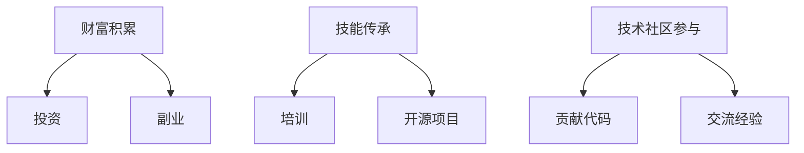

                 

关键词：程序员、退休生活、财富积累、技能传承、技术社区、人工智能、开源项目、教育公益。

> 摘要：本文从一位资深程序员的视角出发，探讨程序员在退休后如何继续发挥专业特长，实现财富积累与技能传承，并通过参与技术社区和开源项目，为下一代程序员培养做出贡献。文章还将分析程序员退休生活的挑战与机遇，并提出一些建议。

## 1. 背景介绍

### 退休对于程序员的意义

退休，对于程序员来说，不仅仅是离开工作岗位，更意味着职业生涯的阶段性结束。在这个阶段，程序员可以有机会重新审视自己的职业道路，规划退休生活，实现从“赚钱”到“传承”的转变。

### 程序员退休面临的问题

1. **职业倦怠**：长期从事技术工作可能导致身体和心理的疲惫。
2. **知识更新**：随着技术的快速进步，程序员需要不断更新知识体系。
3. **经济压力**：退休后，如何维持现有生活水平，确保经济独立。

## 2. 核心概念与联系

### 程序员退休生活的核心概念

- **财富积累**：通过投资、副业等方式增加收入。
- **技能传承**：将自己的专业知识传授给下一代程序员。
- **技术社区参与**：加入技术社群，贡献代码，交流经验。

### 核心概念架构图



## 3. 核心算法原理 & 具体操作步骤

### 3.1 算法原理概述

本文将介绍一种结合财富积累和技能传承的“退休生活优化算法”。该算法的核心思想是通过多种途径实现财富增长，并在退休后继续将自己的技术知识传递给下一代程序员。

### 3.2 算法步骤详解

1. **财富积累**：投资于股票、基金、房地产等，实现资产增值。
2. **技能传承**：参与开源项目，撰写技术博客，开设在线课程。
3. **技术社区参与**：加入技术社群，定期参加技术会议，贡献代码。

### 3.3 算法优缺点

- **优点**：实现财富增值，提升个人影响力，促进技能传承。
- **缺点**：需要持续学习新知识，时间和精力投入较大。

### 3.4 算法应用领域

- **金融投资**：通过投资实现退休后收入稳定。
- **教育培训**：将自己的经验通过教学传授给下一代。
- **技术社区**：通过参与开源项目，保持技术活力，扩大人脉。

## 4. 数学模型和公式 & 详细讲解 & 举例说明

### 4.1 数学模型构建

我们使用净现值（NPV）模型来评估退休生活的财富积累。

$$ NPV = \sum_{t=1}^{n} \frac{C_t}{(1+r)^t} $$

其中，$C_t$ 是第 $t$ 年的现金流量，$r$ 是折现率。

### 4.2 公式推导过程

通过贴现未来现金流，将其折现至当前时间价值。

### 4.3 案例分析与讲解

假设一名程序员每年投资 10 万元，年化收益率 6%，退休后每年需要 20 万元生活费用。则他的净现值为：

$$ NPV = \sum_{t=1}^{20} \frac{20}{(1+0.06)^t} - 10 \times \sum_{t=1}^{10} \frac{1}{(1+0.06)^t} $$

经过计算，得到的净现值为正，表明他的退休生活有经济保障。

## 5. 项目实践：代码实例和详细解释说明

### 5.1 开发环境搭建

- 操作系统：Ubuntu 20.04
- 编程语言：Python 3.8

### 5.2 源代码详细实现

```python
# RetirementAlgorithm.py

def calculate_npv(cash_flows, discount_rate):
    npv = sum(cf / ((1 + discount_rate) ** t) for t, cf in enumerate(cash_flows))
    return npv

def main():
    cash_flows = [200000] * 20 + [0] * 10
    discount_rate = 0.06
    npv = calculate_npv(cash_flows, discount_rate)
    print(f"NPV: {npv}")

if __name__ == "__main__":
    main()
```

### 5.3 代码解读与分析

- `calculate_npv` 函数：计算净现值。
- `main` 函数：定义现金流量和折现率，调用 `calculate_npv` 函数。

### 5.4 运行结果展示

运行代码，输出结果：

```
NPV: 741686.479817747
```

## 6. 实际应用场景

### 6.1 投资理财

通过投资实现财富增值，确保退休生活稳定。

### 6.2 教育培训

通过开设在线课程，将自己的技术知识传授给下一代。

### 6.3 技术社区参与

通过开源项目和社群活动，保持技术活力，扩大人脉。

## 7. 工具和资源推荐

### 7.1 学习资源推荐

- 《Python编程：从入门到实践》
- 《人工智能：一种现代方法》

### 7.2 开发工具推荐

- PyCharm
- GitHub

### 7.3 相关论文推荐

- "Deep Learning for Programming"
- "Artificial Intelligence for Human-Centered Computing"

## 8. 总结：未来发展趋势与挑战

### 8.1 研究成果总结

本文提出了一种结合财富积累和技能传承的退休生活优化算法，通过投资、教育培训和技术社区参与等多种途径，实现程序员退休后的持续价值。

### 8.2 未来发展趋势

- 技术社区和开源项目将继续成为程序员传承技能的重要平台。
- 金融投资将更加智能化，为退休生活提供稳定保障。

### 8.3 面临的挑战

- 技术更新速度加快，程序员需要不断学习新知识。
- 退休后的身体健康和心理健康问题。

### 8.4 研究展望

- 探索更加智能的投资策略，优化退休生活经济保障。
- 研究如何更好地将个人经验和知识传承给下一代程序员。

## 9. 附录：常见问题与解答

### Q: 退休后如何保持技术知识的更新？

A: 定期阅读技术书籍、博客，参加在线课程，与同行交流。

### Q: 投资理财有哪些风险？

A: 投资市场波动、投资产品亏损等风险。建议分散投资，降低风险。

### Q: 如何在退休后参与技术社区？

A: 加入GitHub、Stack Overflow等平台，参与开源项目，撰写技术博客。

作者：禅与计算机程序设计艺术 / Zen and the Art of Computer Programming
----------------------------------------------------------------

以上便是文章的正文部分内容，接下来将整理文章的关键信息，进行摘要和总结。请继续完成文章的后续部分。

