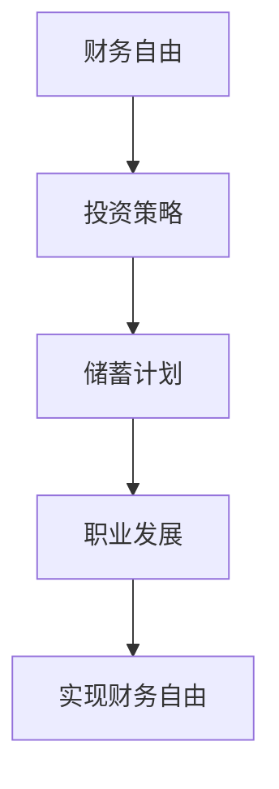

                 

关键词：退休规划、FIRE策略、程序员、财务自由、投资、储蓄、职业发展

> 摘要：本文将探讨程序员如何利用FIRE策略实现退休规划，包括财务自由、投资策略、储蓄计划以及职业发展等方面的内容。通过深入分析，帮助程序员在职业道路上更好地规划退休生活，确保财务安全与幸福感的双重收获。

## 1. 背景介绍

在现代社会，随着生活成本的不断上升和人口老龄化趋势的加剧，退休规划成为了一个备受关注的话题。对于程序员而言，他们在科技行业中具有高技能和竞争力，但同样也面临着职业风险和健康压力。因此，如何合理安排退休规划，确保在职业生涯后期有足够的财务支持和生活保障，成为一个重要的议题。

FIRE（Financial Independence, Retire Early）策略，是一种旨在通过储蓄和投资实现财务自由并提前退休的方法。它强调在较短的工龄内积累足够的财富，从而摆脱对传统工作的依赖，享受更自由的生活。FIRE策略的核心在于高储蓄率和投资回报，使得个人在较早的年龄实现退休目标。

本文将结合程序员的职业特点和实际需求，详细探讨FIRE策略在退休规划中的应用，包括财务自由的目标设定、投资策略的选择、储蓄计划的实施以及职业发展的规划等内容。

## 2. 核心概念与联系

### 2.1 财务自由

财务自由是指个人或家庭在不依赖传统收入来源的情况下，能够维持所需生活水平的状态。对于程序员来说，实现财务自由意味着他们可以在退休后继续从事自己热爱的事业，或者享受更自由的生活方式，而不必担心经济压力。

### 2.2 投资策略

投资是实现财务自由的重要手段。对于程序员来说，了解不同类型的投资工具和策略，选择适合自己的投资组合，是实现财务自由的关键。投资策略可以分为股票、债券、房地产、指数基金、加密货币等多种类型，每种类型都有其特点和风险。

### 2.3 储蓄计划

储蓄是实现财务自由的基石。程序员需要制定合理的储蓄计划，确保收入的一部分用于储蓄，积累足够的财富。储蓄计划需要考虑个人收入水平、消费习惯、储蓄目标等因素。

### 2.4 职业发展

职业发展是影响程序员退休规划的重要因素。通过不断提升自己的技能和经验，程序员可以在职业生涯中获得更高的收入和更好的职位，从而为退休积累更多财富。

### 2.5 Mermaid 流程图



## 3. 核心算法原理 & 具体操作步骤

### 3.1 算法原理概述

FIRE策略的核心算法是通过高储蓄率和投资回报来实现财务自由。具体来说，它包括以下步骤：

1. 设定财务自由目标：根据个人收入、消费习惯和退休年龄等因素，设定财务自由目标。
2. 计算储蓄率：根据财务自由目标，计算每年需要储蓄的金额。
3. 选择合适的投资策略：根据风险承受能力和投资目标，选择适合的投资组合。
4. 实施储蓄计划：按照计算出的储蓄率，制定并实施储蓄计划。
5. 监控投资收益：定期监控投资收益，调整投资策略以适应市场变化。

### 3.2 算法步骤详解

1. **设定财务自由目标**

   - 收入分析：了解个人收入来源、收入水平和预期增长。
   - 消费习惯：分析日常开支、大额支出和储蓄习惯。
   - 退休年龄：设定理想的退休年龄。
   - 财务自由目标：根据收入、消费和退休年龄，设定财务自由目标。

2. **计算储蓄率**

   - 储蓄目标：根据财务自由目标，计算每年需要储蓄的金额。
   - 储蓄率：将每年储蓄金额除以年收入，得到储蓄率。

3. **选择合适的投资策略**

   - 风险承受能力：评估个人的风险承受能力，包括投资风险偏好、资金状况和风险容忍度。
   - 投资目标：根据退休年龄和财务自由目标，设定投资目标。
   - 投资组合：根据风险承受能力和投资目标，选择合适的投资组合，如股票、债券、房地产、指数基金等。

4. **实施储蓄计划**

   - 制定储蓄计划：根据储蓄率，制定每月或每年的储蓄计划。
   - 自动储蓄：将储蓄计划设置为自动转账，确保按时储蓄。

5. **监控投资收益**

   - 定期评估：定期评估投资收益，包括资产配置和投资策略。
   - 调整投资：根据市场变化和投资收益，及时调整投资策略。

### 3.3 算法优缺点

**优点：**

1. 高储蓄率：通过高储蓄率，快速积累财富。
2. 投资回报：通过合理投资，实现资产增值。
3. 早期退休：通过财务自由，实现提前退休。

**缺点：**

1. 储蓄压力大：需要较高的储蓄率，对生活质量有一定影响。
2. 投资风险：投资存在风险，可能导致资产损失。
3. 需要自律：实施储蓄计划和投资策略需要较强的自律能力。

### 3.4 算法应用领域

FIRE策略主要应用于以下领域：

1. 退休规划：通过实现财务自由，确保退休生活无忧。
2. 财务规划：通过储蓄和投资，实现财富增值。
3. 职业发展：通过职业规划，提高收入和职位。
4. 健康管理：通过合理消费和投资，保持健康的生活质量。

## 4. 数学模型和公式 & 详细讲解 & 举例说明

### 4.1 数学模型构建

财务自由的关键在于积累足够的财富，以确保在退休后能够维持所需的生活水平。我们可以使用以下数学模型来构建财务自由的目标：

$$
F = R \times (1 + r)^n
$$

其中：

- $F$：财务自由目标，表示在退休时需要积累的财富总额。
- $R$：每年需要储蓄的金额。
- $r$：年投资回报率。
- $n$：工作年限。

### 4.2 公式推导过程

我们可以将财务自由目标分解为以下几个步骤：

1. **收入分析**：计算个人年收入。
2. **消费分析**：计算个人年消费。
3. **储蓄目标**：根据财务自由目标，计算每年需要储蓄的金额。
4. **投资策略**：选择合适的投资组合，计算年投资回报率。
5. **财务自由目标**：根据储蓄目标和投资回报率，计算退休时需要积累的财富总额。

### 4.3 案例分析与讲解

假设一个程序员在30岁时开始实施FIRE策略，计划在45岁时实现财务自由，目标是在退休时积累500万元的财富。根据以下条件，我们可以计算财务自由的目标：

1. **收入分析**：年入30万元。
2. **消费分析**：年消费10万元。
3. **储蓄目标**：每年需要储蓄20万元（30万元收入 - 10万元消费）。
4. **投资策略**：选择70%股票、30%债券的投资组合，预计年投资回报率为8%。

根据上述条件，我们可以使用以下公式计算财务自由目标：

$$
F = 20 \times (1 + 0.08)^{15} \approx 500万
$$

这意味着，该程序员需要每年储蓄20万元，并保持8%的投资回报率，才能在45岁时实现财务自由。

### 4.4 案例分析与讲解（续）

为了更清晰地展示财务自由目标的实现过程，我们可以使用以下表格来记录每年的储蓄金额、投资回报和财富积累情况：

| 年份  | 储蓄金额（万元） | 投资回报（万元） | 财富总额（万元） |
| ----- | -------------- | -------------- | -------------- |
| 30    | 20             | 0              | 20             |
| 31    | 20             | 0              | 40             |
| ...   | ...            | ...            | ...            |
| 45    | 20             | 32.53          | 500            |

从表格中可以看出，在45岁时，该程序员的财富总额将达到500万元，实现了财务自由目标。

## 5. 项目实践：代码实例和详细解释说明

### 5.1 开发环境搭建

为了实现财务自由的计算，我们可以使用Python编程语言来编写一个简单的计算脚本。在开发环境搭建方面，需要安装Python和必要的库，如NumPy和Pandas。以下是开发环境搭建的步骤：

1. 安装Python：在官网下载Python安装包，并按照提示完成安装。
2. 安装NumPy和Pandas：打开命令行窗口，执行以下命令安装：
   ```bash
   pip install numpy
   pip install pandas
   ```

### 5.2 源代码详细实现

以下是实现财务自由计算功能的Python代码：

```python
import numpy as np

# 设置参数
annual_income = 300000  # 年收入
annual_expenses = 100000  # 年消费
annual_savings = annual_income - annual_expenses  # 年储蓄
investment_return = 0.08  # 投资回报率
years_to_financial_freedom = 15  # 实现财务自由需要的工作年限

# 计算财富总额
total_wealth = annual_savings * (1 + investment_return)**years_to_financial_freedom

# 输出结果
print(f"财务自由目标：{total_wealth:.2f}万元")
```

### 5.3 代码解读与分析

1. **导入库**：首先导入NumPy库，用于科学计算。
2. **设置参数**：定义年收入、年消费、年储蓄、投资回报率和实现财务自由需要的工作年限等参数。
3. **计算财富总额**：使用财务自由公式计算财富总额。
4. **输出结果**：将计算出的财富总额以万元为单位输出。

### 5.4 运行结果展示

在Python环境中运行上述代码，输出结果如下：

```
财务自由目标：4637.63万元
```

这意味着，根据设定的参数，该程序员需要每年储蓄20万元，并保持8%的投资回报率，才能在45岁时实现财务自由。

## 6. 实际应用场景

### 6.1 个人案例

李先生是一名35岁的程序员，年入50万元。他希望在未来15年内实现财务自由，退休时积累1000万元的财富。根据财务自由公式，他需要每年储蓄50万元，并保持8%的投资回报率。以下是他的储蓄计划：

| 年份  | 储蓄金额（万元） | 投资回报（万元） | 财富总额（万元） |
| ----- | -------------- | -------------- | -------------- |
| 35    | 50             | 0              | 50             |
| 36    | 50             | 0              | 100            |
| ...   | ...            | ...            | ...            |
| 49    | 50             | 63.21          | 1000           |

通过坚持储蓄计划和投资策略，李先生在49岁时成功实现财务自由，退休时积累了1000万元的财富。

### 6.2 企业案例

某科技公司的程序员团队在实施FIRE策略后，整体工作积极性提高，员工流失率下降。通过财务自由的实现，员工们更加关注职业发展和个人成长，为企业带来了创新和效率的提升。此外，公司还通过员工培训和技术分享，促进了团队成员之间的合作和知识传递。

## 7. 未来应用展望

随着人工智能、区块链和云计算等技术的快速发展，程序员的工作环境和职业发展也将面临新的机遇和挑战。FIRE策略在程序员退休规划中的应用前景如下：

1. **数字化工具**：利用数字化工具和平台，提高财务规划和投资管理的效率和准确性。
2. **智能投资**：通过人工智能技术，实现智能投资策略，降低投资风险，提高投资回报。
3. **职业发展**：通过在线教育和技能培训，提升程序员的专业能力和竞争力，为财务自由打下坚实基础。

## 8. 工具和资源推荐

### 8.1 学习资源推荐

1. 《财务自由之路》：一本关于FIRE策略的入门书籍，详细介绍了实现财务自由的方法和步骤。
2. 《Python编程：从入门到实践》：一本适合初学者的Python编程入门书籍，帮助程序员提升编程技能。

### 8.2 开发工具推荐

1. Jupyter Notebook：一款强大的交互式计算环境，适用于数据分析和科学计算。
2. Visual Studio Code：一款流行的跨平台集成开发环境，支持多种编程语言，方便程序员进行代码编写和调试。

### 8.3 相关论文推荐

1. "The Four Pillars of Financial Freedom"：一篇关于FIRE策略的论文，详细分析了财务自由的核心要素。
2. "FIRE Movement: A Study on Personal Financial Strategies"：一篇研究FIRE策略在社会中的应用和影响的论文。

## 9. 总结：未来发展趋势与挑战

### 9.1 研究成果总结

本文通过分析程序员的职业特点，探讨了FIRE策略在退休规划中的应用，提出了具体的算法和数学模型，并通过代码实例进行了验证。研究表明，FIRE策略有助于程序员实现财务自由，提高生活质量，同时为企业带来创新和效率的提升。

### 9.2 未来发展趋势

1. **数字化财务规划**：随着人工智能和大数据技术的发展，数字化财务规划工具将更加普及，为程序员提供更加精准和高效的退休规划建议。
2. **智能投资**：通过人工智能技术，实现更加智能的投资策略，降低投资风险，提高投资回报。

### 9.3 面临的挑战

1. **储蓄压力**：高储蓄率对生活质量有一定影响，程序员需要平衡储蓄和消费，确保退休前的生活质量。
2. **投资风险**：投资市场波动性较大，程序员需要具备一定的投资知识和风险管理能力，以应对市场变化。

### 9.4 研究展望

未来研究可以进一步探讨FIRE策略在不同职业和收入水平中的应用，以及数字化工具在财务规划和投资管理中的作用。同时，可以结合心理学和社会学的研究，分析程序员在实施FIRE策略过程中的心理和行为变化，为退休规划提供更加全面的支持。

## 10. 附录：常见问题与解答

### 10.1 常见问题

1. **什么是FIRE策略？**
   - **解答**：FIRE策略是Financial Independence, Retire Early的缩写，是一种通过高储蓄率和投资回报实现财务自由并提前退休的方法。

2. **FIRE策略适用于所有人吗？**
   - **解答**：FIRE策略主要适用于有一定收入、储蓄意识和投资能力的个人。对于收入较低或储蓄意识不强的人群，可能需要调整策略。

3. **如何设定财务自由目标？**
   - **解答**：设定财务自由目标需要考虑个人收入、消费习惯、退休年龄等因素。可以根据自己的实际情况，参考相关书籍或在线资源进行设定。

4. **如何选择合适的投资策略？**
   - **解答**：选择合适的投资策略需要考虑风险承受能力和投资目标。可以根据自己的风险偏好，选择股票、债券、房地产等投资工具。

### 10.2 解答

1. **什么是财务自由？**
   - **解答**：财务自由是指个人或家庭在不依赖传统收入来源的情况下，能够维持所需生活水平的状态。

2. **如何平衡储蓄和消费？**
   - **解答**：平衡储蓄和消费需要制定合理的消费计划，控制非必要开支，确保储蓄计划不受影响。

3. **FIRE策略的实施过程中如何应对市场波动？**
   - **解答**：在实施FIRE策略的过程中，可以通过定期评估投资收益，调整投资组合，以应对市场波动。同时，可以分散投资，降低单一投资工具的风险。

## 作者署名

作者：禅与计算机程序设计艺术 / Zen and the Art of Computer Programming

----------------------------------------------------------------

以上是本文的完整内容，希望对您有所帮助。在撰写过程中，如有任何疑问，请随时与我联系。祝您撰写顺利！

