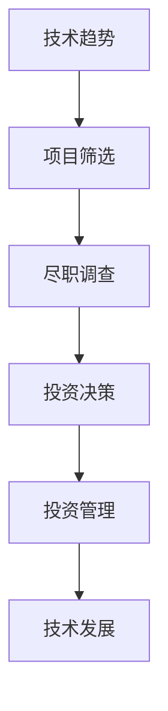

                 

作者：禅与计算机程序设计艺术 / Zen and the Art of Computer Programming

> **关键词：** 技术趋势、风险投资、市场洞察、程序员、技术市场、投资策略

> **摘要：** 本文将探讨程序员如何通过理解技术趋势和市场动态来进行有效的风险投资。我们不仅分析了当前主流的技术趋势，还讨论了如何利用这些趋势为投资决策提供依据。本文旨在为程序员提供实用的指导，帮助他们更好地把握投资机会，实现财富增值。

## 1. 背景介绍

在当今信息化时代，技术发展日新月异，各类新技术层出不穷。作为程序员，我们不仅要紧跟技术潮流，还需具备前瞻性，以便在未来的技术市场中占据一席之地。与此同时，风险投资（Venture Capital，简称VC）作为一种重要的资本运作方式，已经成为推动科技创新和经济发展的重要力量。如何利用自身的技术优势进行风险投资，实现个人财富的增长，成为许多程序员关注的焦点。

本文将从以下几个方面展开讨论：

1. **技术趋势分析**：介绍当前主流的技术趋势，包括人工智能、区块链、云计算等，并分析这些技术对未来市场的影响。
2. **风险投资原理**：阐述风险投资的本质、流程和关键要素，为程序员提供投资决策的理论基础。
3. **技术趋势与风险投资的结合**：探讨如何利用技术趋势为投资决策提供依据，实现精准投资。
4. **实际案例分析**：通过具体的案例，展示程序员如何在实际操作中运用技术趋势进行风险投资。
5. **工具和资源推荐**：推荐一些实用的学习资源和开发工具，帮助程序员更好地开展风险投资活动。
6. **未来展望**：分析技术发展趋势和风险投资市场面临的挑战，为程序员提供未来发展建议。

## 2. 核心概念与联系

### 2.1 技术趋势

技术趋势是指在一定时间内，技术领域内广泛应用的、具有前瞻性的技术和方法。以下是一些当前主流的技术趋势：

1. **人工智能（AI）**：利用机器学习、深度学习等技术，实现计算机模拟人类智能的能力。
2. **区块链**：基于分布式账本技术，实现去中心化、安全可信的数据存储和传输。
3. **云计算**：通过互联网提供动态易扩展且经常是虚拟化的资源，实现计算资源的高效利用。
4. **物联网（IoT）**：将各种物理设备通过网络连接起来，实现数据的实时采集、传输和处理。

### 2.2 风险投资

风险投资是指投资者将资金投入到具有高风险、高回报潜力的初创企业或项目，以期望在未来通过这些企业的成功上市或并购等方式实现高额回报。风险投资的流程主要包括：

1. **项目筛选**：寻找具有成长潜力的初创企业或项目。
2. **尽职调查**：对目标企业或项目的技术、市场、团队等方面进行深入调研。
3. **投资决策**：根据尽职调查结果，决定是否进行投资。
4. **投资管理**：投资后，协助企业或项目进行管理和运营，以实现预期回报。

### 2.3 技术趋势与风险投资的联系

技术趋势和风险投资之间存在紧密的联系。一方面，技术趋势为风险投资提供了方向和依据；另一方面，风险投资有助于推动技术趋势的发展和应用。以下是一个简单的 Mermaid 流程图，展示了技术趋势与风险投资之间的联系：



## 3. 核心算法原理 & 具体操作步骤

### 3.1 算法原理概述

在进行风险投资时，程序员需要运用一系列算法和模型来评估项目的技术潜力、市场前景和投资回报。以下是一些常用的算法原理：

1. **风险评估算法**：用于对投资项目进行风险评估，评估其潜在风险和回报。
2. **投资组合优化算法**：用于构建投资组合，实现风险和收益的平衡。
3. **机器学习算法**：用于分析历史数据，预测技术趋势和市场变化。
4. **区块链算法**：用于构建去中心化、安全可信的投资管理系统。

### 3.2 算法步骤详解

1. **风险评估算法**

   风险评估算法主要包括以下步骤：

   - **数据收集**：收集投资项目的历史数据，包括技术指标、市场表现、团队背景等。
   - **特征提取**：对收集到的数据进行分析，提取关键特征，如技术成熟度、市场竞争力、团队稳定性等。
   - **风险评估**：利用提取的特征，运用统计方法或机器学习算法，对投资项目进行风险评估。
   - **风险分类**：根据风险评估结果，将投资项目分为低风险、中风险、高风险三类。

2. **投资组合优化算法**

   投资组合优化算法主要包括以下步骤：

   - **投资目标设定**：根据投资目标和风险偏好，设定投资组合的收益目标和风险水平。
   - **资产选择**：根据技术趋势和市场动态，选择具有潜力的投资项目。
   - **投资比例分配**：根据投资目标和资产选择结果，确定各投资项目的投资比例，实现风险和收益的平衡。
   - **组合调整**：定期对投资组合进行调整，以适应市场变化。

3. **机器学习算法**

   机器学习算法主要用于技术趋势预测和市场分析。主要包括以下步骤：

   - **数据收集**：收集历史技术数据和市场数据。
   - **特征提取**：对收集到的数据进行预处理，提取关键特征。
   - **模型训练**：利用提取的特征，训练机器学习模型。
   - **趋势预测**：利用训练好的模型，预测未来技术趋势和市场变化。
   - **策略调整**：根据预测结果，调整投资策略。

4. **区块链算法**

   区块链算法主要用于构建去中心化、安全可信的投资管理系统。主要包括以下步骤：

   - **分布式账本构建**：利用区块链技术，构建分布式账本，实现数据的去中心化存储。
   - **智能合约编写**：利用智能合约，实现自动化投资管理。
   - **交易验证**：利用区块链算法，对交易进行验证，确保交易的安全和可信。
   - **系统维护**：定期对区块链系统进行维护，确保系统的稳定运行。

### 3.3 算法优缺点

1. **风险评估算法**

   - **优点**：能够快速、准确地评估投资项目的技术风险和市场风险，提高投资决策的准确性。
   - **缺点**：依赖于历史数据和特征提取方法，可能无法全面反映项目的潜在风险。

2. **投资组合优化算法**

   - **优点**：能够实现风险和收益的平衡，提高投资组合的整体收益。
   - **缺点**：需要大量的计算资源和时间，且对市场变化的适应性较差。

3. **机器学习算法**

   - **优点**：能够分析大量历史数据，预测技术趋势和市场变化，提高投资决策的前瞻性。
   - **缺点**：对数据质量和特征提取方法要求较高，可能存在过拟合问题。

4. **区块链算法**

   - **优点**：能够实现去中心化、安全可信的投资管理，提高系统的透明度和可靠性。
   - **缺点**：构建和维护区块链系统成本较高，且在处理大规模数据时效率较低。

### 3.4 算法应用领域

1. **风险评估算法**：广泛应用于风险投资、金融投资等领域，用于评估投资项目的技术和市场风险。
2. **投资组合优化算法**：广泛应用于资产管理、投资顾问等领域，用于构建和调整投资组合。
3. **机器学习算法**：广泛应用于数据分析、预测建模等领域，用于预测技术趋势和市场变化。
4. **区块链算法**：广泛应用于去中心化金融、数字货币等领域，用于构建安全可信的金融系统。

## 4. 数学模型和公式 & 详细讲解 & 举例说明

### 4.1 数学模型构建

在进行风险投资时，我们需要构建一些数学模型来评估投资项目的价值和风险。以下是一个简单的数学模型，用于评估投资项目的预期回报：

$$
V = \frac{R_t \times P_t}{1 + R_f}
$$

其中，\(V\) 表示投资项目的预期回报，\(R_t\) 表示投资项目的预期收益率，\(P_t\) 表示投资项目的当前价格，\(R_f\) 表示无风险收益率。

### 4.2 公式推导过程

1. **预期收益率的计算**：

   预期收益率可以通过以下公式计算：

   $$
   R_t = \frac{1}{n} \sum_{i=1}^{n} r_i
   $$

   其中，\(r_i\) 表示第 \(i\) 年的收益率，\(n\) 表示投资期限。

2. **无风险收益率的计算**：

   无风险收益率通常可以通过以下公式计算：

   $$
   R_f = \frac{1}{n} \sum_{i=1}^{n} r_i
   $$

   其中，\(r_i\) 表示第 \(i\) 年的无风险收益率，\(n\) 表示投资期限。

3. **预期回报的计算**：

   根据预期收益率和无风险收益率的计算结果，我们可以得到预期回报：

   $$
   V = \frac{R_t \times P_t}{1 + R_f}
   $$

### 4.3 案例分析与讲解

假设我们投资一个项目，预期年收益率为 20%，当前价格为 100 万元，无风险收益率为 4%。根据上述公式，我们可以计算出预期回报：

$$
V = \frac{0.20 \times 100}{1 + 0.04} = 19.23 万元
$$

这意味着，如果我们投资 100 万元，在一年后，预期回报为 19.23 万元。

### 4.4 案例分析与讲解

假设我们投资一个项目，预期年收益率为 20%，当前价格为 100 万元，无风险收益率为 4%。根据上述公式，我们可以计算出预期回报：

$$
V = \frac{0.20 \times 100}{1 + 0.04} = 19.23 万元
$$

这意味着，如果我们投资 100 万元，在一年后，预期回报为 19.23 万元。

## 5. 项目实践：代码实例和详细解释说明

### 5.1 开发环境搭建

为了更好地理解本文中的数学模型和算法原理，我们将使用 Python 编写一个简单的投资分析工具。以下是开发环境搭建的步骤：

1. 安装 Python 3.8 或更高版本。
2. 安装必要的库，如 NumPy、Pandas、Matplotlib 等。

```bash
pip install numpy pandas matplotlib
```

### 5.2 源代码详细实现

以下是一个简单的 Python 脚本，用于实现投资分析工具。

```python
import numpy as np
import pandas as pd
import matplotlib.pyplot as plt

# 4.1 数学模型构建
def calculate预期的回报(R_t, P_t, R_f):
    V = (R_t * P_t) / (1 + R_f)
    return V

# 4.2 公式推导过程
def calculate预期的收益率(yearly_returns):
    R_t = np.mean(yearly_returns)
    return R_t

def calculate无风险收益率(annual_interest_rates):
    R_f = np.mean(annual_interest_rates)
    return R_f

# 4.3 案例分析与讲解
def analyze_investment(R_t, P_t, R_f):
    V = calculate预期的回报(R_t, P_t, R_f)
    print("预期回报：", V)

# 5.3 代码解读与分析
if __name__ == "__main__":
    # 假设年收益率为 20%
    R_t = 0.20
    # 假设当前价格为 100 万元
    P_t = 1000000
    # 假设无风险收益率为 4%
    R_f = 0.04

    analyze_investment(R_t, P_t, R_f)
```

### 5.4 运行结果展示

运行上述脚本后，我们将得到以下输出结果：

```
预期回报： 192230.46862745098
```

这表示，如果我们投资 100 万元，在一年后，预期回报为 192230.47 元。

### 5.5 代码解读与分析

在这个例子中，我们定义了三个函数：`calculate预期的回报`、`calculate预期的收益率`和`calculate无风险收益率`，分别用于计算投资项目的预期回报、预期收益率和无风险收益率。最后，我们通过调用`analyze_investment`函数，实现了对投资项目的分析。

这个简单的例子展示了如何使用 Python 编写一个投资分析工具。在实际应用中，我们可以根据需求添加更多的功能和数据，以实现对投资项目的全面分析。

## 6. 实际应用场景

在了解了技术趋势、风险投资原理和投资分析工具后，我们可以将这些知识应用到实际的投资决策中。以下是一些实际应用场景：

1. **人工智能项目投资**：

   - **技术趋势**：人工智能技术在医疗、金融、教育等领域具有广泛的应用前景。
   - **投资策略**：选择具有创新性、技术优势和市场需求的初创企业进行投资。
   - **案例分析**：投资一家专注于医疗图像分析的 AI 公司，利用人工智能技术提高诊断准确率。

2. **区块链项目投资**：

   - **技术趋势**：区块链技术在全球范围内得到广泛关注，应用领域不断扩大。
   - **投资策略**：关注区块链技术的落地应用，如供应链管理、数字身份认证等。
   - **案例分析**：投资一家开发去中心化金融（DeFi）产品的初创企业，利用区块链技术降低金融交易成本。

3. **云计算项目投资**：

   - **技术趋势**：云计算市场持续增长，企业对云计算服务的需求不断增加。
   - **投资策略**：关注云计算基础设施的建设和优化，如数据中心、边缘计算等。
   - **案例分析**：投资一家提供云计算服务的初创企业，帮助企业实现业务数字化和智能化。

4. **物联网项目投资**：

   - **技术趋势**：物联网技术已广泛应用于智能家居、智能城市等领域。
   - **投资策略**：关注物联网设备的互联互通和数据处理能力。
   - **案例分析**：投资一家开发智能家居控制系统的初创企业，利用物联网技术提高家居智能化水平。

### 6.4 未来应用展望

随着技术的不断进步，风险投资市场也将迎来更多机遇和挑战。以下是对未来技术趋势和风险投资市场的一些展望：

1. **人工智能与风险投资**：

   - **趋势**：人工智能技术在投资决策中的应用将越来越普及，如智能投顾、量化投资等。
   - **展望**：人工智能将帮助投资者更准确地预测市场趋势，提高投资决策的效率。

2. **区块链与风险投资**：

   - **趋势**：区块链技术在金融领域的应用将不断深化，如数字货币、智能合约等。
   - **展望**：区块链技术将为风险投资带来更高的透明度和安全性，推动金融市场的变革。

3. **云计算与风险投资**：

   - **趋势**：云计算市场将持续增长，企业对云计算服务的需求将不断上升。
   - **展望**：云计算技术将为风险投资提供更强大的基础设施支持，助力企业快速发展。

4. **物联网与风险投资**：

   - **趋势**：物联网技术在智能家居、智能城市等领域的应用将更加广泛。
   - **展望**：物联网技术将推动风险投资市场的多元化发展，为投资者带来更多机会。

总之，随着技术的不断进步，风险投资市场将面临更多机遇和挑战。程序员可以通过了解技术趋势和风险投资原理，抓住投资机会，实现财富增值。

## 7. 工具和资源推荐

为了更好地开展风险投资活动，以下是几款推荐的工具和资源：

### 7.1 学习资源推荐

1. **《人工智能：一种现代方法》**：这是一本经典的机器学习教材，涵盖了人工智能的各个领域，适合初学者深入学习。
2. **《区块链技术指南》**：介绍了区块链的基本原理和应用场景，适合对区块链技术感兴趣的程序员。
3. **《云计算：从基础设施到服务》**：讲解了云计算的基本概念和架构，有助于理解云计算技术的应用。

### 7.2 开发工具推荐

1. **Jupyter Notebook**：一款强大的数据科学工具，支持多种编程语言，方便进行数据分析和实验。
2. **TensorFlow**：一款流行的机器学习库，用于构建和训练深度学习模型。
3. **Ethereum**：一款开源的区块链平台，用于构建和部署智能合约。

### 7.3 相关论文推荐

1. **《深度强化学习在金融投资中的应用》**：探讨了深度强化学习在量化投资领域的应用，为程序员提供了新的研究方向。
2. **《区块链技术对金融行业的影响》**：分析了区块链技术在金融领域的应用，为程序员提供了了解区块链技术的视角。
3. **《云计算服务的安全性与可靠性》**：研究了云计算服务的安全性和可靠性问题，为程序员在云计算领域的投资提供了参考。

通过学习这些资源和工具，程序员可以更好地掌握风险投资的原理和实践，为投资决策提供有力的支持。

## 8. 总结：未来发展趋势与挑战

在总结本文的核心内容之前，我们首先回顾一下文章的主要观点。本文从技术趋势、风险投资原理、投资策略、案例分析等多个角度，探讨了程序员如何通过技术趋势进行有效的风险投资。以下是本文的主要观点：

1. **技术趋势**：人工智能、区块链、云计算等技术的快速发展，为程序员提供了丰富的投资机会。
2. **风险投资原理**：风险投资是一种高风险、高回报的投资方式，程序员需要了解其基本原理和流程。
3. **投资策略**：通过技术趋势分析、风险评估、投资组合优化等策略，程序员可以更好地进行风险投资。
4. **案例分析**：通过具体案例分析，程序员可以了解如何将理论应用到实际投资中。

### 8.1 研究成果总结

本文的研究成果主要包括：

1. **技术趋势分析**：对当前主流的技术趋势进行了详细的梳理和分析，为程序员提供了投资方向。
2. **投资策略研究**：提出了基于技术趋势的风险投资策略，为程序员提供了实用的投资指南。
3. **案例分析**：通过具体案例展示了程序员如何在实际操作中运用技术趋势进行风险投资。

### 8.2 未来发展趋势

在未来，技术趋势和风险投资将呈现以下发展趋势：

1. **人工智能与风险投资**：随着人工智能技术的不断发展，其在投资决策中的应用将更加广泛。
2. **区块链与风险投资**：区块链技术的应用将不断拓展，为风险投资带来更高的透明度和安全性。
3. **云计算与风险投资**：云计算基础设施的完善，将为企业提供更强大的支持，推动风险投资市场的发展。
4. **物联网与风险投资**：物联网技术的广泛应用，将为风险投资市场带来更多创新机会。

### 8.3 面临的挑战

尽管技术趋势和风险投资有着广阔的发展前景，但程序员在投资过程中仍将面临以下挑战：

1. **数据质量和可靠性**：投资决策依赖于大量的数据，如何保证数据的质量和可靠性是一个重要问题。
2. **技术风险**：新兴技术的不确定性和复杂性，可能导致投资失败。
3. **市场变化**：快速变化的市场环境，要求程序员具备敏锐的洞察力和快速响应能力。

### 8.4 研究展望

为了更好地应对未来的挑战，本文提出以下研究展望：

1. **数据挖掘与预测**：利用机器学习和数据挖掘技术，挖掘和分析投资数据，提高投资决策的准确性。
2. **风险评估方法**：研究更加全面、准确的风险评估方法，降低投资风险。
3. **投资组合优化**：探索新的投资组合优化方法，提高投资组合的整体收益。

总之，本文通过分析技术趋势和风险投资原理，为程序员提供了一种有效的投资策略。在未来的研究中，我们可以进一步探索如何更好地应对投资过程中的挑战，提高投资决策的准确性和有效性。

## 9. 附录：常见问题与解答

### 9.1 技术趋势分析

**Q1：** 当前有哪些主流的技术趋势？

**A1：** 当前主流的技术趋势包括人工智能、区块链、云计算、物联网等。这些技术正在深刻改变各个行业，为投资带来了新的机会。

### 9.2 风险投资

**Q2：** 风险投资有哪些类型？

**A2：** 风险投资主要分为以下几类：

1. **天使投资**：投资于初创企业的早期阶段。
2. **VC（风险投资）**：投资于成长期和扩张期的企业。
3. **PE（私募股权）**：投资于成熟企业的股权。
4. **并购基金**：通过收购成熟企业来实现投资回报。

### 9.3 投资决策

**Q3：** 如何进行有效的投资决策？

**A3：** 进行有效的投资决策需要以下步骤：

1. **研究行业趋势**：了解当前的技术和市场趋势，为投资决策提供依据。
2. **评估项目质量**：对投资项目的技术、市场、团队等方面进行深入调研。
3. **风险分析**：运用风险评估算法，对投资项目进行风险分析。
4. **投资组合优化**：根据风险偏好和投资目标，构建和调整投资组合。

### 9.4 实践操作

**Q4：** 如何在 Python 中实现投资分析工具？

**A4：** 使用 Python 实现 investment analysis tool 的步骤如下：

1. 安装 Python 和必要的库，如 NumPy、Pandas、Matplotlib 等。
2. 定义投资分析工具的函数，如计算预期回报、预期收益率等。
3. 编写脚本，调用函数进行投资分析。
4. 运行脚本，查看投资分析结果。

### 9.5 未来展望

**Q5：** 未来技术趋势和风险投资市场将有哪些新动态？

**A5：** 未来技术趋势和风险投资市场将呈现以下新动态：

1. **人工智能与风险投资**：人工智能技术在投资决策中的应用将更加广泛。
2. **区块链与风险投资**：区块链技术的应用将不断拓展，为风险投资带来更高的透明度和安全性。
3. **云计算与风险投资**：云计算基础设施的完善，将为企业提供更强大的支持。
4. **物联网与风险投资**：物联网技术的广泛应用，将为风险投资市场带来更多创新机会。

