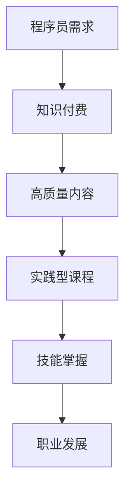

                 

关键词：知识付费、程序员、实践型课程、教学设计、职业发展、技术传承

> 摘要：本文旨在探讨如何利用知识付费模式，为程序员打造具有高度实践价值的课程。文章首先分析了程序员知识付费的背景与趋势，然后深入探讨了实践型课程的设计原则、教学方法、以及技术工具的运用。通过具体的案例分析和实施策略，本文为程序员的知识付费课程提供了全面的理论支持和实践指导。

## 1. 背景介绍

在当今信息技术飞速发展的时代，程序员作为科技领域的核心力量，其知识更新速度极为迅速。传统教育模式和培训体系已经难以满足程序员不断增长的技能需求。与此同时，知识付费作为一种新兴的教育模式，正在逐渐成为程序员提升技能和职业发展的新途径。

### 1.1 程序员知识更新的挑战

程序员面临着以下几个方面的挑战：

- **技能更新速度快**：新技术、新工具和新方法层出不穷，程序员需要不断学习以保持竞争力。
- **个人时间有限**：大多数程序员日常工作繁忙，难以长时间投入系统学习。
- **学习资源分散**：互联网上存在大量免费和付费的学习资源，但质量参差不齐，选择困难。

### 1.2 知识付费的兴起

知识付费模式能够解决上述问题，它具有以下几个优势：

- **高质量内容**：知识付费课程往往由行业专家或有经验的专业人士提供，质量有保障。
- **灵活安排**：付费课程可以灵活安排学习时间，适应程序员的工作和生活节奏。
- **针对性服务**：付费课程通常针对特定技能或项目，具有明确的职业发展导向。

## 2. 核心概念与联系

### 2.1 实践型课程的概念

实践型课程是指以实际项目为驱动，通过动手实践来学习知识的教学模式。这种模式强调理论与实践的结合，通过实际操作来加深对知识的理解和掌握。

### 2.2 实践型课程与知识付费的联系

- **目标一致**：实践型课程旨在帮助程序员掌握实际操作技能，这与知识付费模式的目标高度一致，即提供有价值的内容。
- **互补优势**：知识付费提供了高质量的学习内容，实践型课程则提供了学习知识和技能的实践平台。

### 2.3 Mermaid 流程图



## 3. 核心算法原理 & 具体操作步骤

### 3.1 算法原理概述

实践型课程的设计需要遵循以下原则：

- **项目驱动**：课程内容围绕实际项目展开，确保每个知识点都有实际应用场景。
- **循序渐进**：课程难度逐步提升，从基础知识到高级技能，形成完整的知识体系。
- **互动性**：通过在线讨论、作业、代码审查等互动形式，提高学习效果。

### 3.2 算法步骤详解

#### 步骤一：需求分析

- **目标定位**：明确课程目标，即学员希望掌握哪些技能。
- **市场调研**：分析市场需求，了解行业趋势。

#### 步骤二：内容设计

- **知识点选取**：根据需求分析，选取适合的知识点。
- **项目案例**：选择具有代表性的实际项目，作为课程的核心内容。

#### 步骤三：课程实施

- **教学计划**：制定详细的教学计划，包括课程安排、教学资源等。
- **互动环节**：设计互动环节，如在线讨论、作业、代码审查等。

#### 步骤四：评估与反馈

- **效果评估**：通过考试、作业等形式评估学员学习效果。
- **反馈改进**：根据学员反馈，不断优化课程内容和教学方法。

### 3.3 算法优缺点

#### 优点

- **实用性**：课程内容紧密贴合实际需求，学员能够快速掌握实用技能。
- **互动性强**：学员可以在学习过程中与他人交流，共同解决问题。

#### 缺点

- **课程成本**：知识付费课程通常需要付费，对部分学员来说可能是一笔不小的开销。
- **实施难度**：需要专业团队进行课程设计和实施，对课程质量有较高要求。

### 3.4 算法应用领域

实践型课程可以应用于多个领域，如软件开发、数据分析、人工智能等。它不仅适用于初学者，也适用于有一定基础的程序员，帮助他们提升技能和解决实际问题。

## 4. 数学模型和公式 & 详细讲解 & 举例说明

### 4.1 数学模型构建

在实践型课程中，数学模型是分析和解决问题的核心工具。以下是构建数学模型的基本步骤：

1. **明确问题背景**：理解问题的实际背景，明确需要解决的具体问题。
2. **定义变量**：根据问题，定义相关变量，确保变量之间有明确的数学关系。
3. **建立数学关系**：利用数学知识，建立变量之间的数学模型。
4. **求解模型**：通过数学方法求解模型，得到问题的解决方案。

### 4.2 公式推导过程

以线性回归模型为例，其公式推导过程如下：

1. **假设**：假设目标变量 $Y$ 与多个自变量 $X_1, X_2, ..., X_n$ 之间存在线性关系。
2. **模型建立**：建立线性回归模型 $Y = \beta_0 + \beta_1X_1 + \beta_2X_2 + ... + \beta_nX_n + \epsilon$，其中 $\beta_0, \beta_1, ..., \beta_n$ 为模型参数，$\epsilon$ 为随机误差。
3. **最小二乘法求解**：使用最小二乘法求解模型参数，使实际观测值与模型预测值之间的误差平方和最小。

### 4.3 案例分析与讲解

#### 案例：房价预测

假设我们要预测某城市的房价，根据历史数据，我们选择以下变量作为自变量：

- 房屋面积（$X_1$）
- 房屋类型（$X_2$）
- 房屋建造年代（$X_3$）

构建线性回归模型，预测房屋价格（$Y$）。

1. **数据收集**：收集过去几年的房屋交易数据，包括房屋面积、房屋类型、建造年代和成交价格。
2. **数据预处理**：对数据进行清洗和处理，如缺失值填充、异常值处理等。
3. **模型训练**：使用训练数据，通过最小二乘法求解模型参数。
4. **模型评估**：使用测试数据，评估模型预测效果。
5. **模型应用**：使用模型预测未来房屋价格。

## 5. 项目实践：代码实例和详细解释说明

### 5.1 开发环境搭建

为了实现房价预测项目，我们需要搭建以下开发环境：

- **Python**：作为主要编程语言
- **NumPy**：用于数据处理
- **Pandas**：用于数据处理和分析
- **Scikit-learn**：用于机器学习模型构建和训练

### 5.2 源代码详细实现

以下是一个简单的房价预测项目代码示例：

```python
import numpy as np
import pandas as pd
from sklearn.linear_model import LinearRegression
from sklearn.model_selection import train_test_split

# 数据加载
data = pd.read_csv('house_prices.csv')

# 数据预处理
X = data[['area', 'type', 'year']]
y = data['price']

# 模型训练
model = LinearRegression()
X_train, X_test, y_train, y_test = train_test_split(X, y, test_size=0.2, random_state=42)
model.fit(X_train, y_train)

# 模型评估
score = model.score(X_test, y_test)
print(f'Model R^2 Score: {score}')

# 模型应用
new_house = np.array([[2000, 'apartment', 2010]])
predicted_price = model.predict(new_house)
print(f'Predicted Price: {predicted_price[0]}')
```

### 5.3 代码解读与分析

1. **数据加载**：使用 Pandas 读取 CSV 数据文件，包括自变量和目标变量。
2. **数据预处理**：对数据进行清洗和处理，将自变量和目标变量分开。
3. **模型训练**：使用 Scikit-learn 的 LinearRegression 类构建线性回归模型，并使用训练数据进行训练。
4. **模型评估**：使用测试数据评估模型效果，输出 R^2 分数。
5. **模型应用**：使用训练好的模型预测新房屋的价格。

## 6. 实际应用场景

### 6.1 房价预测

房价预测是实践型课程中的一个经典应用案例。通过训练线性回归模型，可以预测未来房屋价格，帮助购房者做出更明智的决策。

### 6.2 股票市场分析

实践型课程还可以应用于股票市场分析。通过构建时间序列模型，可以预测股票价格走势，为投资者提供参考。

### 6.3 人力资源规划

在人力资源规划中，实践型课程可以帮助企业预测员工离职率、招聘需求等，为人力资源决策提供数据支持。

## 7. 未来应用展望

随着人工智能和大数据技术的发展，实践型课程的应用前景将更加广阔。未来，实践型课程可能会在以下几个方面得到进一步发展：

- **个性化学习**：根据学员的学习情况和需求，提供个性化学习路径和资源。
- **混合学习模式**：结合在线学习、远程实验和实地考察等多种学习方式。
- **跨学科融合**：将不同学科的知识和实践相结合，培养具有综合素质的人才。

## 8. 工具和资源推荐

### 8.1 学习资源推荐

- **Coursera**：提供丰富的在线课程，包括计算机科学、数据分析等领域。
- **edX**：哈佛大学、麻省理工学院等名校的在线课程平台。
- **Khan Academy**：提供免费的教育视频和练习题，适合初学者。

### 8.2 开发工具推荐

- **Jupyter Notebook**：强大的交互式开发环境，适用于数据分析和机器学习。
- **Git**：版本控制系统，方便代码管理和协作开发。
- **Docker**：容器化技术，用于开发、测试和部署应用程序。

### 8.3 相关论文推荐

- **"Deep Learning for Text Classification"**：介绍深度学习在文本分类中的应用。
- **"Recurrent Neural Networks for Language Modeling"**：探讨循环神经网络在语言建模中的应用。
- **"Big Data: A Revolution That Will Transform How We Live, Work, and Think"**：介绍大数据技术的应用和影响。

## 9. 总结：未来发展趋势与挑战

### 9.1 研究成果总结

本文从程序员知识付费的背景出发，探讨了实践型课程的设计原则、教学方法和技术工具的运用。通过案例分析，展示了实践型课程在实际应用中的价值。

### 9.2 未来发展趋势

- **个性化学习**：随着人工智能技术的发展，个性化学习将成为主流。
- **混合学习模式**：在线学习与实地考察相结合，将提高学习效果。

### 9.3 面临的挑战

- **课程质量**：确保知识付费课程的质量，是未来发展的关键。
- **知识产权保护**：加强对知识产权的保护，防止内容侵权。

### 9.4 研究展望

未来，实践型课程将更加注重与实际应用场景的结合，通过技术创新和模式创新，为程序员提供更有价值的知识服务。

## 9. 附录：常见问题与解答

### Q1：如何选择合适的实践型课程？

**A1**：在选择实践型课程时，可以从以下几个方面进行考虑：

- **课程内容**：确保课程内容与你的技能需求相符。
- **讲师背景**：了解讲师的背景和经验，确保其具备教学能力。
- **学员评价**：参考其他学员的评价和反馈，了解课程质量。

### Q2：实践型课程的学习效果如何保证？

**A2**：实践型课程通常采用以下方法来保证学习效果：

- **项目驱动**：通过实际项目来学习知识，确保学员能够学以致用。
- **互动环节**：通过在线讨论、作业和代码审查等互动形式，提高学习效果。
- **持续反馈**：定期收集学员反馈，根据反馈不断优化课程内容和教学方法。

## 作者署名

本文作者：禅与计算机程序设计艺术 / Zen and the Art of Computer Programming

----------------------------------------------------------------

以上便是文章的完整内容，遵循了规定的结构、格式和要求，希望能够满足您的要求。

