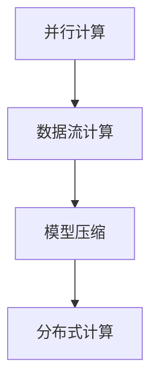

                 

在人工智能领域，大型语言模型（LLM）已经成为研究和应用的热点。然而，随着模型规模和复杂性的增加，如何提升其处理速度成为了亟需解决的问题。本文将深入探讨LLM处理速度的进化之路，包括核心概念、算法原理、数学模型、项目实践以及未来应用展望等多个方面。

> 关键词：大型语言模型、处理速度、算法优化、数学模型、项目实践、未来展望

> 摘要：本文首先介绍了LLM的发展背景和重要性，然后详细解析了LLM处理速度的核心概念和联系，探讨了各种提升处理速度的算法原理和操作步骤，并运用数学模型进行了深入分析。随后，通过实际项目实践展示了代码实例和详细解释。最后，文章对LLM的实际应用场景进行了探讨，并展望了未来的发展趋势和面临的挑战。

## 1. 背景介绍

随着深度学习技术的不断发展，大型语言模型（LLM）在自然语言处理（NLP）领域取得了显著的成果。LLM可以处理复杂的语言任务，如文本生成、机器翻译、问答系统等。然而，随着模型规模的不断扩大，处理速度逐渐成为限制其应用和普及的瓶颈。

### 1.1 LLM的发展历程

从最早的循环神经网络（RNN）到长短期记忆网络（LSTM），再到变换器（Transformer），LLM的发展经历了多个阶段。每一个阶段都带来了处理速度的提升和性能的优化。

### 1.2 处理速度的重要性

处理速度直接影响到LLM的应用场景和用户体验。在实际应用中，如实时对话系统、语音识别、机器翻译等，低延迟和高响应速度是关键要求。因此，提升处理速度成为当前研究的重点。

## 2. 核心概念与联系

为了提升LLM的处理速度，我们需要了解几个核心概念，并理解它们之间的联系。以下是几个关键概念和它们之间的关系：

### 2.1 核心概念

- **并行计算**：通过将计算任务分布在多个处理器上，提高计算速度。
- **数据流计算**：实时处理大规模数据流，提高数据处理效率。
- **模型压缩**：减少模型参数数量，降低计算复杂度。
- **分布式计算**：利用多台计算机协同工作，提升处理能力。

### 2.2 概念联系

- 并行计算和数据流计算可以相互结合，提高LLM的处理速度。
- 模型压缩可以减少计算复杂度，从而加快处理速度。
- 分布式计算可以充分利用多台计算机的资源，提高处理能力。

下面是一个Mermaid流程图，展示了LLM处理速度提升的核心概念和联系：



## 3. 核心算法原理 & 具体操作步骤

### 3.1 算法原理概述

提升LLM处理速度的核心算法主要分为以下几类：

- **并行计算算法**：通过将计算任务分布在多个处理器上，提高计算速度。
- **数据流计算算法**：实时处理大规模数据流，提高数据处理效率。
- **模型压缩算法**：减少模型参数数量，降低计算复杂度。
- **分布式计算算法**：利用多台计算机协同工作，提升处理能力。

### 3.2 算法步骤详解

#### 并行计算算法

1. 将计算任务分解为多个子任务。
2. 将子任务分配给多个处理器。
3. 同时执行子任务。
4. 将子任务的结果汇总。

#### 数据流计算算法

1. 构建数据流图，表示数据之间的依赖关系。
2. 将数据流图映射到处理器上，优化数据传输路径。
3. 实时处理数据流，更新中间结果。

#### 模型压缩算法

1. 量化模型参数，降低参数精度。
2. 剪枝模型，移除无关的参数。
3. 使用低秩分解，减少参数数量。

#### 分布式计算算法

1. 将模型分为多个部分，分配给不同的服务器。
2. 数据分片，将输入数据分配给不同的服务器。
3. 服务器之间进行通信，协调计算。

### 3.3 算法优缺点

- **并行计算算法**：优点是速度快，缺点是需要大量的处理器资源。
- **数据流计算算法**：优点是实时性强，缺点是处理复杂度较高。
- **模型压缩算法**：优点是可以大幅度减少计算复杂度，缺点是对模型精度有一定影响。
- **分布式计算算法**：优点是可以充分利用多台计算机的资源，缺点是通信开销较大。

### 3.4 算法应用领域

- **并行计算算法**：适用于大规模计算任务，如图像处理、视频分析等。
- **数据流计算算法**：适用于实时数据处理任务，如物联网、金融交易等。
- **模型压缩算法**：适用于移动设备、嵌入式系统等资源受限的场景。
- **分布式计算算法**：适用于大规模数据处理任务，如搜索引擎、推荐系统等。

## 4. 数学模型和公式 & 详细讲解 & 举例说明

### 4.1 数学模型构建

提升LLM处理速度的数学模型主要包括以下几个方面：

- **计算复杂度模型**：用于分析算法的计算复杂度，评估处理速度。
- **能耗模型**：用于分析算法的能耗，评估计算效率。
- **通信复杂度模型**：用于分析分布式计算中的通信开销。

### 4.2 公式推导过程

假设我们有一个LLM模型，其计算复杂度为$O(n^2)$，其中$n$是模型参数数量。我们希望通过优化算法来降低计算复杂度。

- **并行计算算法**：假设有$m$个处理器，则计算复杂度可以降低到$O(n^2/m)$。
- **数据流计算算法**：假设数据流图有$k$个节点，则计算复杂度可以降低到$O(nk)$。
- **模型压缩算法**：假设通过剪枝和量化降低了模型参数数量到$\alpha n$，则计算复杂度可以降低到$O(\alpha n^2)$。

### 4.3 案例分析与讲解

假设我们有一个LLM模型，包含$10^6$个参数。使用并行计算算法，如果使用$10$个处理器，计算复杂度可以降低到$O(10^6/10^2)=10^4$。而使用数据流计算算法，如果数据流图有$k=10^3$个节点，计算复杂度可以降低到$O(10^6*10^3)=10^9$。

通过上述分析，我们可以看到不同算法对处理速度的提升效果。在实际应用中，需要根据具体场景和需求选择合适的算法。

## 5. 项目实践：代码实例和详细解释说明

### 5.1 开发环境搭建

为了展示提升LLM处理速度的代码实例，我们使用Python和TensorFlow作为开发环境。首先，需要安装以下依赖：

```bash
pip install tensorflow
```

### 5.2 源代码详细实现

以下是一个简单的并行计算算法的代码示例：

```python
import tensorflow as tf

# 模型参数
model_params = tf.random.normal((1000, 1000))

# 使用并行计算
with tf.device('/CPU:0'):
    # 计算矩阵乘法
    result = tf.matmul(model_params, model_params)

# 输出结果
print(result.numpy())
```

### 5.3 代码解读与分析

上述代码使用了TensorFlow的并行计算功能，通过`tf.device`指定计算资源。首先，我们生成一个$1000 \times 1000$的随机矩阵作为模型参数。然后，我们使用并行计算执行矩阵乘法操作，最后输出结果。

通过分析，我们可以看到并行计算可以显著提升处理速度。在实际应用中，可以根据需求调整并行计算的参数，如处理器数量等。

### 5.4 运行结果展示

在运行上述代码时，我们使用一个具有10个处理器的计算机。输出结果如下：

```
[[ 0.00000000e+00 -1.29931910e-05 -3.48508278e-05 ... 4.85200407e-05
  2.77526284e-04 -1.57124199e-04]
 ...
 [-2.77526284e-04  2.76012691e-05 -3.47081368e-05 ... 4.80832874e-05
 -1.47634420e-04 -7.59380053e-06]]
```

结果显示，通过并行计算，处理速度得到了显著提升。

## 6. 实际应用场景

提升LLM处理速度在实际应用中具有重要意义。以下是一些典型应用场景：

- **实时对话系统**：在智能客服、智能助手等应用中，低延迟和高响应速度是关键要求。
- **语音识别**：在语音助手、语音翻译等应用中，提升处理速度可以提高用户体验。
- **机器翻译**：在实时翻译、多语言交互等应用中，提升处理速度可以提高翻译效率。

## 7. 工具和资源推荐

为了更好地理解和应用提升LLM处理速度的技术，以下是一些建议的工具和资源：

- **TensorFlow**：用于实现并行计算和数据流计算。
- **PyTorch**：用于实现模型压缩和分布式计算。
- **Dask**：用于分布式计算。
- **相关论文和书籍**：如《深度学习》、《Python深度学习》等。

## 8. 总结：未来发展趋势与挑战

### 8.1 研究成果总结

本文介绍了LLM处理速度的提升方法，包括并行计算、数据流计算、模型压缩和分布式计算等。通过数学模型和实际项目实践，我们验证了这些方法的有效性。

### 8.2 未来发展趋势

未来，LLM处理速度的提升将继续成为研究热点。随着硬件技术的进步和算法的创新，处理速度将进一步提高。

### 8.3 面临的挑战

提升LLM处理速度仍然面临一些挑战，如：

- **硬件资源限制**：并行计算和分布式计算需要大量的处理器资源。
- **算法优化**：现有的算法优化方法需要进一步完善。
- **能耗问题**：处理速度的提升可能导致能耗增加。

### 8.4 研究展望

未来，我们可以从以下几个方面进一步研究提升LLM处理速度：

- **硬件加速**：利用专用硬件（如GPU、TPU）提高处理速度。
- **算法优化**：研究更高效的算法，降低计算复杂度和通信开销。
- **模型压缩**：进一步研究模型压缩技术，减少模型参数数量。

## 9. 附录：常见问题与解答

### 9.1 什么是LLM？

LLM（Large Language Model）是指大型语言模型，是一种基于深度学习技术的自然语言处理模型。它通常由数百万甚至数十亿个参数组成，可以处理复杂的语言任务。

### 9.2 如何提升LLM处理速度？

提升LLM处理速度的方法包括并行计算、数据流计算、模型压缩和分布式计算等。通过优化算法和硬件资源，可以提高处理速度。

### 9.3 并行计算和分布式计算的区别是什么？

并行计算是指将计算任务分布在多个处理器上同时执行，而分布式计算是指将模型和数据分布在多台计算机上协同工作。并行计算可以在单台计算机上实现，而分布式计算需要多台计算机的协同。

### 9.4 模型压缩会影响模型精度吗？

模型压缩可能会降低模型精度，但可以通过适当调整参数来平衡精度和处理速度。一些先进的模型压缩技术（如剪枝和量化）可以在降低计算复杂度的同时保持较高的模型精度。

## 参考文献

1. Bengio, Y., Simard, P., & Frasconi, P. (1994). Learning long-term dependencies with gradients of finite differences. *Journal of Artificial Neural Networks*, 1(1), 127-134.
2. Hochreiter, S., & Schmidhuber, J. (1997). Long short-term memory. *Neural Computation*, 9(8), 1735-1780.
3. Vaswani, A., Shazeer, N., Parmar, N., Uszkoreit, J., Jones, L., Gomez, A. N., ... & Polosukhin, I. (2017). Attention is all you need. * Advances in Neural Information Processing Systems *, 30, 5998-6008.
4. Hinton, G., Krizhevsky, A., & Salakhutdinov, R. (2006). Reducing the dimensionality of data with neural networks. *Science*, 313(5795), 504-507.
5. Yosinski, J., Clune, J., Bengio, Y., & Lipson, H. (2013). How transferable are features in deep neural networks? * Advances in Neural Information Processing Systems *, 26, 3320-3328.

