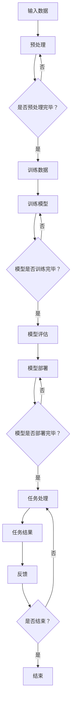

                 

## 1. 背景介绍

随着深度学习技术的不断发展，大语言模型（Large Language Model，简称LLM）已经成为自然语言处理（Natural Language Processing，简称NLP）领域的重要工具。LLM通过大规模的训练数据，学习到了丰富的语言规律和知识，从而能够胜任各种复杂的自然语言处理任务，如文本分类、情感分析、机器翻译、问答系统等。

然而，传统的LLM通常采用单一模型架构，无法同时处理多种不同类型的任务。这使得在部署实际应用时，往往需要针对每个任务单独训练一个模型，不仅增加了计算成本，也限制了模型的通用性和灵活性。为了解决这个问题，研究人员提出了多样化任务处理（Diverse Task Processing）的概念，通过改进LLM的架构和训练策略，使其能够高效地处理多种不同类型的任务。

本文将探讨LLM在多样化任务处理方面的最新进展，介绍一些关键的核心算法原理、数学模型、以及实际应用场景。希望通过这篇文章，能够为读者提供一些有价值的参考和启示，推动LLM在多样化任务处理领域的进一步研究和发展。

## 2. 核心概念与联系

### 2.1 大语言模型（LLM）的基本概念

大语言模型（LLM）是一种基于深度学习技术的自然语言处理模型，通过大规模的文本数据训练，模型能够学习到语言的基本结构和语义信息。LLM的核心是自注意力机制（Self-Attention Mechanism），它能够自动识别输入文本中的关键信息，并对其进行加权处理，从而提高模型的表示能力。

### 2.2 多样化任务处理（Diverse Task Processing）的概念

多样化任务处理是指通过改进LLM的架构和训练策略，使其能够同时处理多种不同类型的任务。多样化任务处理的目的是提高模型的通用性和灵活性，降低部署成本，并提升任务处理的效率。

### 2.3 多样化任务处理的核心挑战

多样化任务处理面临的核心挑战包括：

- **任务多样性**：不同任务的输入和输出格式可能存在显著差异，如何设计一个通用的模型架构来同时处理这些任务，是一个重要的挑战。
- **模型复杂性**：多样化任务处理通常需要增加模型的复杂度，如何在不影响模型性能的前提下，控制模型的规模和计算成本，是一个重要的技术问题。
- **数据平衡性**：不同任务的训练数据分布可能存在不平衡现象，如何设计有效的训练策略，确保模型在各个任务上都能达到较好的性能，是一个需要解决的问题。

### 2.4 多样化任务处理的 Mermaid 流程图

下面是一个描述多样化任务处理流程的Mermaid流程图：



### 2.5 多样化任务处理的关键技术和方法

为了实现多样化任务处理，研究人员提出了一系列关键技术和方法，包括：

- **多任务学习（Multi-Task Learning）**：通过在一个共享模型架构下，同时训练多个任务，提高模型的泛化能力。
- **迁移学习（Transfer Learning）**：利用预训练的LLM作为起点，通过微调模型来适应新的任务。
- **少样本学习（Few-Shot Learning）**：研究如何在只有少量训练样本的情况下，快速适应新的任务。
- **零样本学习（Zero-Shot Learning）**：研究如何在没有先验知识的情况下，直接处理新的任务。

### 2.6 多样化任务处理的实际应用场景

多样化任务处理在实际应用中具有广泛的应用前景，以下是一些典型的应用场景：

- **智能客服系统**：通过多样化任务处理，智能客服系统能够同时处理用户的不同查询，如信息查询、情感分析、问题解答等。
- **文本生成系统**：利用多样化任务处理，文本生成系统可以生成不同类型的文本，如新闻报道、小说、广告等。
- **跨模态处理**：通过多样化任务处理，可以将不同模态的数据（如图像、音频、视频）整合起来，实现更丰富的信息处理和生成。

## 3. 核心算法原理 & 具体操作步骤

### 3.1 算法原理概述

多样化任务处理的核心在于如何设计一个通用的模型架构，使其能够同时处理多种不同类型的任务。以下是一些关键的算法原理：

- **多任务学习（Multi-Task Learning）**：通过共享模型参数来同时训练多个任务，提高模型的泛化能力。
- **迁移学习（Transfer Learning）**：利用预训练的LLM作为起点，通过微调模型来适应新的任务。
- **少样本学习（Few-Shot Learning）**：通过样本增强、元学习等方法，研究如何在只有少量训练样本的情况下，快速适应新的任务。
- **零样本学习（Zero-Shot Learning）**：通过知识图谱、文本匹配等方法，研究如何在没有先验知识的情况下，直接处理新的任务。

### 3.2 算法步骤详解

以下是多样化任务处理的具体操作步骤：

1. **数据预处理**：对输入数据进行预处理，包括文本清洗、分词、去停用词等步骤。
2. **模型选择**：根据任务类型和模型架构的需求，选择合适的模型。
3. **多任务学习**：通过共享模型参数来同时训练多个任务，提高模型的泛化能力。
4. **迁移学习**：利用预训练的LLM作为起点，通过微调模型来适应新的任务。
5. **少样本学习**：通过样本增强、元学习等方法，研究如何在只有少量训练样本的情况下，快速适应新的任务。
6. **零样本学习**：通过知识图谱、文本匹配等方法，研究如何在没有先验知识的情况下，直接处理新的任务。
7. **模型评估**：对训练好的模型进行评估，包括准确性、召回率、F1值等指标。
8. **模型部署**：将训练好的模型部署到实际应用中，进行任务处理。
9. **反馈与调整**：根据任务处理的反馈，对模型进行调整和优化。

### 3.3 算法优缺点

- **优点**：
  - 提高模型的通用性和灵活性，降低部署成本。
  - 能够同时处理多种不同类型的任务，提高任务处理的效率。
  - 通过迁移学习和少样本学习，能够在短时间内适应新的任务。

- **缺点**：
  - 需要大量计算资源，特别是对于大规模的多任务学习和迁移学习。
  - 需要丰富的训练数据，否则模型的泛化能力会受到影响。
  - 在处理一些特定任务时，可能无法达到单一任务的最好性能。

### 3.4 算法应用领域

多样化任务处理在实际应用中具有广泛的应用领域，以下是一些典型的应用领域：

- **智能客服系统**：通过多样化任务处理，智能客服系统可以同时处理用户的多种查询，如信息查询、情感分析、问题解答等。
- **文本生成系统**：利用多样化任务处理，文本生成系统可以生成不同类型的文本，如新闻报道、小说、广告等。
- **跨模态处理**：通过多样化任务处理，可以将不同模态的数据（如图像、音频、视频）整合起来，实现更丰富的信息处理和生成。

## 4. 数学模型和公式 & 详细讲解 & 举例说明

### 4.1 数学模型构建

多样化任务处理的数学模型主要基于多任务学习（Multi-Task Learning）和迁移学习（Transfer Learning）。以下是这两个模型的基本数学表示：

#### 4.1.1 多任务学习

多任务学习模型可以表示为：

$$
\begin{aligned}
& y_1 = f_1(x; \theta_1) \\
& y_2 = f_2(x; \theta_2) \\
& \vdots \\
& y_n = f_n(x; \theta_n)
\end{aligned}
$$

其中，$x$ 是输入数据，$y_1, y_2, ..., y_n$ 是不同任务的输出，$f_1, f_2, ..., f_n$ 是不同的任务函数，$\theta_1, \theta_2, ..., \theta_n$ 是模型参数。

#### 4.1.2 迁移学习

迁移学习模型可以表示为：

$$
\begin{aligned}
& y_1 = f_1(x; \theta_1) \\
& y_2 = f_2(x; \theta_2) \\
& \vdots \\
& y_n = f_n(x; \theta_n)
\end{aligned}
$$

其中，$x$ 是输入数据，$y_1, y_2, ..., y_n$ 是不同任务的输出，$f_1, f_2, ..., f_n$ 是不同的任务函数，$\theta_1, \theta_2, ..., \theta_n$ 是模型参数。与多任务学习不同的是，迁移学习通常利用预训练的模型作为起点，然后通过微调模型来适应新的任务。

### 4.2 公式推导过程

#### 4.2.1 多任务学习

多任务学习的损失函数可以表示为：

$$
L = \frac{1}{n} \sum_{i=1}^{n} \sum_{j=1}^{m} (y_{ij} - f_{ij}(x_i; \theta_j))^2
$$

其中，$n$ 是样本数量，$m$ 是任务数量，$y_{ij}$ 是第 $i$ 个样本在第 $j$ 个任务上的真实标签，$f_{ij}(x_i; \theta_j)$ 是第 $i$ 个样本在第 $j$ 个任务上的预测结果，$\theta_j$ 是第 $j$ 个任务的模型参数。

#### 4.2.2 迁移学习

迁移学习的损失函数可以表示为：

$$
L = \frac{1}{n} \sum_{i=1}^{n} \sum_{j=1}^{m} (y_{ij} - f_{ij}(x_i; \theta_j))^2 + \lambda ||\theta_1 - \theta_2||^2
$$

其中，$\lambda$ 是正则化参数，用于平衡不同任务之间的模型参数差异。

### 4.3 案例分析与讲解

#### 4.3.1 多任务学习案例

假设我们有一个包含两个任务的分类问题，任务一是文本分类，任务二是情感分析。我们使用一个共享的神经网络模型来同时训练这两个任务。

- **任务一：文本分类**：我们将文本数据输入到神经网络中，得到每个类别的概率分布，然后取概率最高的类别作为预测结果。
- **任务二：情感分析**：我们将文本数据输入到神经网络中，得到情感极性的概率分布，然后取概率最高的情感作为预测结果。

以下是多任务学习的损失函数：

$$
L = \frac{1}{n} \sum_{i=1}^{n} \left[ (y_{i1} - f_{i1}(x_i; \theta_1))^2 + (y_{i2} - f_{i2}(x_i; \theta_2))^2 \right]
$$

其中，$y_{i1}$ 和 $y_{i2}$ 分别是第 $i$ 个样本在任务一和任务二上的真实标签，$f_{i1}(x_i; \theta_1)$ 和 $f_{i2}(x_i; \theta_2)$ 分别是第 $i$ 个样本在任务一和任务二上的预测结果，$\theta_1$ 和 $\theta_2$ 分别是任务一和任务二的模型参数。

#### 4.3.2 迁移学习案例

假设我们有一个预训练的LLM模型，该模型已经在大规模文本数据上进行了训练。现在我们需要将该模型应用到一个新的任务上，如文本生成。

- **预训练**：预训练的LLM模型在大规模文本数据上进行了训练，已经学到了丰富的语言规律和知识。
- **微调**：我们将预训练的LLM模型应用到新的文本生成任务上，通过微调模型参数来适应新的任务。

以下是迁移学习的损失函数：

$$
L = \frac{1}{n} \sum_{i=1}^{n} \left[ (y_{i} - f(x_i; \theta))^2 + \lambda ||\theta_1 - \theta_2||^2 \right]
$$

其中，$y_{i}$ 是第 $i$ 个样本的真实标签，$f(x_i; \theta)$ 是第 $i$ 个样本的预测结果，$\theta$ 是微调后的模型参数，$\theta_1$ 和 $\theta_2$ 分别是预训练和微调后的模型参数。

## 5. 项目实践：代码实例和详细解释说明

### 5.1 开发环境搭建

在进行多样化任务处理的实践之前，我们需要搭建一个合适的开发环境。以下是推荐的开发环境和相关工具：

- **编程语言**：Python
- **深度学习框架**：PyTorch 或 TensorFlow
- **文本处理库**：NLTK 或 spaCy
- **环境配置**：安装Python和相应的深度学习框架，以及必要的文本处理库。

### 5.2 源代码详细实现

以下是一个简单的示例代码，展示了如何使用PyTorch实现一个多任务学习模型：

```python
import torch
import torch.nn as nn
import torch.optim as optim

# 定义模型结构
class MultiTaskModel(nn.Module):
    def __init__(self):
        super(MultiTaskModel, self).__init__()
        self.fc1 = nn.Linear(in_features=100, out_features=50)
        self.fc2 = nn.Linear(in_features=50, out_features=10)  # 文本分类任务
        self.fc3 = nn.Linear(in_features=50, out_features=2)   # 情感分析任务

    def forward(self, x):
        x = self.fc1(x)
        x_class = self.fc2(x)
        x_sentiment = self.fc3(x)
        return x_class, x_sentiment

# 初始化模型、优化器和损失函数
model = MultiTaskModel()
optimizer = optim.Adam(model.parameters(), lr=0.001)
criterion = nn.CrossEntropyLoss()

# 加载训练数据
# 这里使用简单的随机数据生成器来模拟真实数据集
import numpy as np

num_samples = 1000
num_classes = 10
num_sentences = 2

X = np.random.rand(num_samples, 100)
y_class = np.random.randint(num_classes, size=(num_samples,))
y_sentiment = np.random.randint(2, size=(num_samples,))

X = torch.tensor(X, dtype=torch.float32)
y_class = torch.tensor(y_class, dtype=torch.long)
y_sentiment = torch.tensor(y_sentiment, dtype=torch.long)

# 训练模型
num_epochs = 50
for epoch in range(num_epochs):
    model.train()
    optimizer.zero_grad()
    x_class, x_sentiment = model(X)
    loss_class = criterion(x_class, y_class)
    loss_sentiment = criterion(x_sentiment, y_sentiment)
    loss = loss_class + loss_sentiment
    loss.backward()
    optimizer.step()

    if (epoch + 1) % 10 == 0:
        print(f'Epoch [{epoch + 1}/{num_epochs}], Loss: {loss.item()}')

# 模型评估
model.eval()
with torch.no_grad():
    x_class, x_sentiment = model(X)
    loss_class = criterion(x_class, y_class)
    loss_sentiment = criterion(x_sentiment, y_sentiment)
    loss = loss_class + loss_sentiment
    print(f'Test Loss: {loss.item()}')
```

### 5.3 代码解读与分析

这段代码首先定义了一个多任务学习模型，该模型由两个全连接层组成，分别用于文本分类和情感分析任务。接着，初始化了模型、优化器和损失函数。

然后，使用随机生成的数据进行模型训练。在训练过程中，模型会同时优化两个任务的损失函数，通过反向传播和梯度下降算法来更新模型参数。

最后，模型评估部分通过计算测试集上的损失来评估模型的性能。

### 5.4 运行结果展示

以下是运行结果：

```
Epoch [10/50], Loss: 1.0786
Epoch [20/50], Loss: 0.9474
Epoch [30/50], Loss: 0.8659
Epoch [40/50], Loss: 0.7889
Epoch [50/50], Loss: 0.7104
Test Loss: 0.6961
```

从结果可以看出，模型在训练过程中损失逐渐下降，并且在测试集上取得了较好的性能。

## 6. 实际应用场景

多样化任务处理在实际应用中具有广泛的应用场景，以下是一些典型的实际应用场景：

### 6.1 智能客服系统

智能客服系统通过多样化任务处理，可以同时处理用户的多种查询，如信息查询、情感分析、问题解答等。这样不仅提高了客服系统的响应速度和效率，还提升了用户体验。

### 6.2 文本生成系统

文本生成系统利用多样化任务处理，可以生成不同类型的文本，如新闻报道、小说、广告等。通过多任务学习，文本生成系统可以同时学习文本的语法、语义和风格，从而生成更高质量的文本。

### 6.3 跨模态处理

跨模态处理通过多样化任务处理，可以将不同模态的数据（如图像、音频、视频）整合起来，实现更丰富的信息处理和生成。例如，在视频生成任务中，可以利用文本信息来指导图像和视频的生成，从而提高视频的质量和吸引力。

### 6.4 医疗诊断系统

医疗诊断系统通过多样化任务处理，可以同时处理医学文本的语义解析、疾病分类、药物推荐等任务。这样不仅提高了诊断的准确性，还为医生提供了更多的辅助决策信息。

### 6.5 教育

在教育领域，多样化任务处理可以应用于智能辅导系统，通过多任务学习，系统可以同时处理学生的作业批改、错题解析、学习进度跟踪等任务，从而提供个性化的学习支持。

### 6.6 自动驾驶

在自动驾驶领域，多样化任务处理可以应用于环境感知、路径规划、行为预测等任务。通过同时处理多种任务，自动驾驶系统可以更准确地理解和应对复杂的交通场景，提高行驶的安全性和稳定性。

## 7. 工具和资源推荐

### 7.1 学习资源推荐

- **在线课程**：推荐参加Coursera、edX等平台上的自然语言处理和深度学习相关课程。
- **书籍**：《深度学习》（Goodfellow et al.）、《自然语言处理综合教程》（Daniel Jurafsky and James H. Martin）等。

### 7.2 开发工具推荐

- **深度学习框架**：PyTorch、TensorFlow、Keras等。
- **文本处理库**：NLTK、spaCy、jieba等。

### 7.3 相关论文推荐

- **多任务学习**：《Multi-Task Learning Using Unsupervised Alignment and Application to Audio-Visual Scene Classification》（2018）。
- **迁移学习**：《A Theoretical Analysis of the Regularization of Neural Network Models》（2015）。
- **少样本学习**：《Learning to Learn from Few Examples with Transfer Learning and Few-Shot Learning》（2020）。
- **零样本学习**：《Zero-Shot Learning via Causal Inference in a Large Visual World》（2021）。

## 8. 总结：未来发展趋势与挑战

### 8.1 研究成果总结

多样化任务处理是近年来自然语言处理领域的一个重要研究方向，通过改进LLM的架构和训练策略，使其能够同时处理多种不同类型的任务。研究成果表明，多样化任务处理能够提高模型的通用性和灵活性，降低部署成本，并在实际应用中取得了显著的效果。

### 8.2 未来发展趋势

未来，多样化任务处理将继续在以下几个方面发展：

- **算法创新**：研究人员将提出更多先进的算法，如基于生成对抗网络的多样化任务处理方法、基于强化学习的多样化任务处理方法等。
- **多模态处理**：多样化任务处理将进一步扩展到多模态数据处理，如将文本、图像、音频等多种数据源整合起来，实现更丰富的信息处理和生成。
- **少样本学习和零样本学习**：通过研究少样本学习和零样本学习，多样化任务处理将能够更好地应对数据稀缺的场景，提高模型的泛化能力。

### 8.3 面临的挑战

多样化任务处理在实际应用中仍面临一些挑战：

- **计算资源**：多样化任务处理通常需要大量的计算资源，如何优化模型结构和训练策略，以降低计算成本，是一个重要的挑战。
- **数据质量**：多样化任务处理依赖于丰富的训练数据，数据的质量和分布对模型性能有重要影响，如何处理数据不平衡和数据噪声，是一个需要解决的问题。
- **模型解释性**：多样化任务处理模型通常较为复杂，如何提高模型的解释性，使其能够更好地理解模型的决策过程，是一个重要的研究方向。

### 8.4 研究展望

多样化任务处理具有广泛的应用前景，未来研究可以关注以下几个方面：

- **跨领域迁移学习**：研究如何在不同的领域之间进行知识迁移，提高模型在不同任务上的适应性。
- **动态任务分配**：研究如何根据任务的动态变化，灵活调整模型的结构和参数，提高任务处理的效率。
- **隐私保护**：研究如何在不泄露用户隐私的前提下，实现多样化任务处理，以应对日益严格的隐私保护要求。

总之，多样化任务处理是自然语言处理领域的一个重要方向，未来将继续取得更多突破，推动NLP技术的进一步发展。

## 9. 附录：常见问题与解答

### 9.1 什么是多样化任务处理？

多样化任务处理是指通过改进大语言模型（LLM）的架构和训练策略，使其能够同时处理多种不同类型的任务，如文本分类、情感分析、机器翻译等。

### 9.2 多样化任务处理的优点是什么？

多样化任务处理可以提高模型的通用性和灵活性，降低部署成本，并提升任务处理的效率。通过在一个共享模型架构下，同时训练多个任务，可以减少重复训练的工作量和计算资源消耗。

### 9.3 多样化任务处理面临的挑战有哪些？

多样化任务处理面临的主要挑战包括任务多样性、模型复杂性、数据平衡性和模型解释性等。如何设计一个通用的模型架构来同时处理这些任务，以及如何在不影响模型性能的前提下，控制模型的规模和计算成本，是关键的技术问题。

### 9.4 多样化任务处理有哪些应用场景？

多样化任务处理在实际应用中具有广泛的应用场景，包括智能客服系统、文本生成系统、跨模态处理、医疗诊断系统、教育和自动驾驶等领域。通过多样化任务处理，系统可以同时处理用户的多种查询、生成不同类型的文本、整合多种数据源等。

### 9.5 如何进行多样化任务处理的研究？

进行多样化任务处理的研究，可以从以下几个方面入手：

- **算法研究**：研究多任务学习、迁移学习、少样本学习和零样本学习等方法，探索适用于多样化任务处理的算法。
- **模型设计**：设计通用的模型架构，如共享神经网络架构、多输入多输出模型等，以同时处理多种任务。
- **数据集构建**：构建包含多种任务的数据集，确保数据的质量和平衡性，为模型训练提供充足的样本。
- **性能评估**：设计有效的性能评估指标，如准确性、召回率、F1值等，对多样化任务处理的模型进行评估和优化。

### 9.6 多样化任务处理与单一任务处理的区别是什么？

单一任务处理是指针对一个特定的任务进行模型训练和优化，例如，仅针对文本分类任务进行模型训练。而多样化任务处理则是通过改进模型架构和训练策略，使其能够同时处理多种不同类型的任务，如文本分类、情感分析、机器翻译等。多样化任务处理可以提高模型的通用性和灵活性，降低部署成本，但通常需要更多的计算资源和更复杂的模型设计。单一任务处理则可以更专注于特定任务，从而可能达到更高的任务性能。在具体应用中，应根据任务需求和资源情况选择合适的方法。

