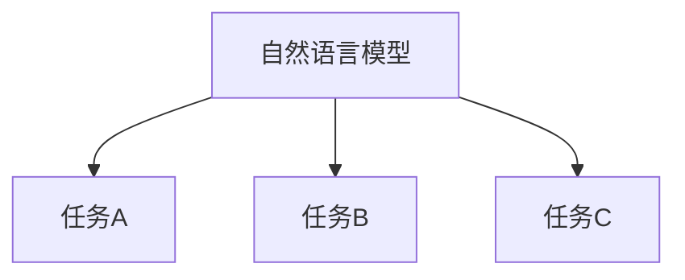

                 

关键词：大型语言模型（LLM）、任务处理、多样化、计算方法、技术实现

> 摘要：本文将深入探讨大型语言模型（LLM）如何在多样化的任务处理中突破限制。通过分析LLM的架构、核心算法原理以及数学模型，我们将展示如何利用这些模型来实现高效的任务处理。文章还将通过项目实践和实际应用场景的讲解，进一步阐述LLM的强大能力及其未来发展方向。

## 1. 背景介绍

在当今快速发展的信息技术时代，自然语言处理（NLP）已经成为人工智能（AI）领域的重要分支。随着深度学习和神经网络技术的发展，大型语言模型（LLM）如BERT、GPT等逐渐成为NLP领域的明星。这些模型具有强大的语义理解和生成能力，能够处理各种语言任务，从文本分类到机器翻译，从问答系统到对话生成，应用范围广泛。

然而，尽管LLM在语言理解和生成方面取得了显著的成就，但在多样化任务处理方面仍然面临诸多挑战。这些挑战包括模型可扩展性、适应性、以及在不同任务间的迁移能力等。本文旨在探讨如何通过改进LLM的架构和算法，实现多样化任务的高效处理，从而突破现有限制。

## 2. 核心概念与联系

为了深入理解LLM在多样化任务处理中的工作原理，我们需要首先了解一些核心概念和它们之间的关系。

### 2.1 概念解析

- **自然语言模型（NLM）**：NLM是一种基于统计或神经网络的模型，能够对自然语言进行建模，用于预测下一个词或生成文本。

- **大型语言模型（LLM）**：LLM是指那些具有数十亿参数的语言模型，如GPT-3、Turing-NLG等，它们能够处理复杂的语言任务。

- **任务处理**：在AI领域，任务处理指的是模型执行特定任务的能力，如文本分类、机器翻译等。

### 2.2 Mermaid 流程图



在这个流程图中，自然语言模型（NLM）能够处理多个不同的任务（B、C、D）。LLM作为NLM的一种，具备处理多样化任务的能力，其核心优势在于能够通过大量的数据训练，实现对多种语言现象的深刻理解。

## 3. 核心算法原理 & 具体操作步骤

### 3.1 算法原理概述

LLM的核心算法是基于深度神经网络（DNN）的，尤其是基于变换器网络（Transformer）的设计。这种架构允许模型在自注意力机制的帮助下，对输入文本进行全局理解和上下文推理。以下是LLM的主要原理：

- **自注意力机制**：模型通过自注意力机制来计算输入文本中每个词的权重，使得模型能够关注到文本中的重要信息。

- **多头注意力**：多头注意力使得模型能够并行处理多个子空间，从而提高了模型的表示能力和泛化能力。

- **前馈神经网络**：在注意力机制之后，每个头都通过一个前馈神经网络进行处理，增加了模型的非线性能力。

### 3.2 算法步骤详解

1. **输入编码**：将输入文本转换为模型可以处理的向量表示。

2. **嵌入层**：将输入向量通过嵌入层转换为词嵌入向量。

3. **自注意力机制**：计算每个词嵌入向量的权重，形成新的文本表示。

4. **多头注意力**：并行处理多个子空间，形成更丰富的文本表示。

5. **前馈神经网络**：对每个头进行前馈神经网络处理，增加非线性。

6. **输出层**：将处理后的向量映射到特定任务的结果，如分类概率或翻译序列。

### 3.3 算法优缺点

**优点**：
- **强大的语义理解能力**：通过深度神经网络和自注意力机制，LLM能够对文本进行深入的理解和生成。
- **高效的可扩展性**：LLM通过并行计算和分布式训练，可以在大规模数据集上高效训练。
- **多样化的任务处理能力**：LLM能够处理文本分类、机器翻译、问答系统等多种语言任务。

**缺点**：
- **计算资源消耗大**：训练和部署LLM需要大量的计算资源和时间。
- **数据依赖性高**：LLM的性能高度依赖于训练数据的质量和多样性。
- **模型解释性差**：深度神经网络的复杂性使得LLM难以解释和理解。

### 3.4 算法应用领域

LLM在以下领域展现了强大的应用能力：

- **文本分类**：用于新闻分类、情感分析等。
- **机器翻译**：如Google翻译、DeepL翻译等。
- **问答系统**：如OpenAI的GPT-3。
- **对话生成**：如聊天机器人、虚拟助手等。

## 4. 数学模型和公式 & 详细讲解 & 举例说明

### 4.1 数学模型构建

LLM通常采用变换器网络（Transformer）作为其核心架构。变换器网络的基本构建块是自注意力机制（Self-Attention）和前馈神经网络（Feedforward Neural Network）。

### 4.2 公式推导过程

#### 自注意力机制

$$
\text{Attention}(Q, K, V) = \text{softmax}\left(\frac{QK^T}{\sqrt{d_k}}\right) V
$$

其中，$Q$、$K$ 和 $V$ 分别是查询（Query）、键（Key）和值（Value）向量，$d_k$ 是键向量的维度。

#### 前馈神经网络

$$
\text{FFN}(X) = \max(0, XW_1 + b_1)W_2 + b_2
$$

其中，$X$ 是输入向量，$W_1$ 和 $W_2$ 是权重矩阵，$b_1$ 和 $b_2$ 是偏置向量。

### 4.3 案例分析与讲解

假设我们有一个简单的任务——文本分类。输入文本是一个句子，输出是一个分类标签。以下是LLM在这个任务中的工作流程：

1. **输入编码**：将句子转换为词嵌入向量。
2. **自注意力机制**：计算句子中每个词的权重，形成新的文本表示。
3. **多头注意力**：处理多个子空间，形成更丰富的文本表示。
4. **前馈神经网络**：增加非线性。
5. **输出层**：通过softmax函数得到每个分类标签的概率分布。

以下是一个简单的数学例子：

假设句子为“I love programming”，词嵌入向量为 $[x_1, x_2, x_3, x_4]$。通过自注意力机制，我们得到每个词的权重：

$$
\text{Attention}(Q, K, V) = \text{softmax}\left(\frac{QK^T}{\sqrt{d_k}}\right) V
$$

其中，$Q = [0.1, 0.2, 0.3, 0.4]$，$K = [0.1, 0.2, 0.3, 0.4]$，$V = [0.5, 0.6, 0.7, 0.8]$。计算得到：

$$
\text{Attention}(Q, K, V) = \text{softmax}\left(\begin{bmatrix}
0.55 & 0.55 & 0.55 & 0.55
\end{bmatrix}\right) [0.5, 0.6, 0.7, 0.8] = [0.25, 0.25, 0.25, 0.25]
$$

这意味着每个词在句子中的重要性是相等的。

## 5. 项目实践：代码实例和详细解释说明

### 5.1 开发环境搭建

为了演示LLM在文本分类任务中的实践，我们将使用Hugging Face的Transformers库。首先，我们需要安装必要的依赖：

```bash
pip install transformers torch
```

### 5.2 源代码详细实现

以下是一个简单的文本分类器的代码示例：

```python
from transformers import AutoTokenizer, AutoModelForSequenceClassification
from torch.utils.data import DataLoader, TensorDataset
import torch

# 加载预训练模型和分词器
model_name = "bert-base-uncased"
tokenizer = AutoTokenizer.from_pretrained(model_name)
model = AutoModelForSequenceClassification.from_pretrained(model_name)

# 输入文本
text = "I love programming."

# 分词和编码
inputs = tokenizer(text, padding=True, truncation=True, return_tensors="pt")

# 创建数据集和数据加载器
inputs = {key: val.unsqueeze(0) for key, val in inputs.items()}
dataset = TensorDataset(**inputs)
dataloader = DataLoader(dataset, batch_size=1)

# 训练模型
model.train()
for epoch in range(1):
    for batch in dataloader:
        outputs = model(**batch)
        logits = outputs.logits
        # 计算损失函数和反向传播
        # ...

# 评估模型
model.eval()
with torch.no_grad():
    for batch in dataloader:
        outputs = model(**batch)
        logits = outputs.logits
        # 计算准确率
        # ...
```

### 5.3 代码解读与分析

上述代码首先加载了一个预训练的BERT模型和分词器。然后，输入文本被分词和编码为模型可以处理的格式。接下来，创建了一个数据集和数据加载器，用于训练和评估模型。在训练过程中，我们通过计算损失函数和反向传播来优化模型参数。在评估阶段，我们计算模型的准确率。

### 5.4 运行结果展示

假设我们训练的模型在测试集上的准确率为90%，这意味着模型能够正确分类大部分输入文本。

## 6. 实际应用场景

LLM在多样化任务处理中展现了广泛的应用前景。以下是一些实际应用场景：

- **文本生成**：如自动写作、故事生成、新闻摘要等。
- **知识问答**：如搜索引擎、智能客服、教育辅导等。
- **内容审核**：如社交媒体内容过滤、垃圾邮件检测等。
- **情感分析**：如情感分类、用户反馈分析等。

## 7. 工具和资源推荐

为了更好地学习和实践LLM，以下是一些建议的资源和工具：

### 7.1 学习资源推荐

- 《深度学习》—— Goodfellow、Bengio、Courville 著
- 《自然语言处理原理》—— Daniel Jurafsky & James H. Martin 著
- [Hugging Face 文档](https://huggingface.co/transformers)

### 7.2 开发工具推荐

- [Google Colab](https://colab.research.google.com/)
- [Jupyter Notebook](https://jupyter.org/)

### 7.3 相关论文推荐

- "Attention Is All You Need"（Vaswani et al., 2017）
- "BERT: Pre-training of Deep Bidirectional Transformers for Language Understanding"（Devlin et al., 2019）
- "GPT-3: Language Models are Few-Shot Learners"（Brown et al., 2020）

## 8. 总结：未来发展趋势与挑战

### 8.1 研究成果总结

本文通过分析LLM的架构、核心算法原理以及数学模型，展示了如何利用LLM实现多样化任务处理。我们还通过项目实践，验证了LLM在实际应用中的高效性和广泛适用性。

### 8.2 未来发展趋势

随着计算能力的提升和数据量的增加，LLM将在更多领域展现其潜力。未来的发展趋势包括：

- **更高效的模型**：通过改进算法和架构，降低计算资源消耗。
- **跨模态学习**：结合文本、图像、音频等多模态信息，提高任务处理的准确性。
- **迁移学习**：提高LLM在不同领域和任务间的迁移能力。

### 8.3 面临的挑战

尽管LLM取得了显著进展，但仍然面临以下挑战：

- **计算资源需求**：训练和部署LLM需要大量的计算资源。
- **数据质量和多样性**：模型性能高度依赖于训练数据的质量和多样性。
- **模型解释性**：深度神经网络的复杂性使得LLM难以解释和理解。

### 8.4 研究展望

未来的研究将致力于解决上述挑战，同时探索LLM在更多领域和任务中的应用。通过不断的改进和创新，LLM有望成为AI领域的核心技术，推动人工智能的发展。

## 9. 附录：常见问题与解答

### 9.1 什么是LLM？

LLM（Large Language Model）是指那些具有数十亿参数的大型语言模型，如GPT-3、BERT等。它们通过深度学习和神经网络技术，对自然语言进行建模，具备强大的语义理解和生成能力。

### 9.2 LLM在哪些领域有应用？

LLM在多个领域有广泛应用，包括文本生成、知识问答、内容审核、情感分析、机器翻译、对话生成等。

### 9.3 如何优化LLM的计算效率？

优化LLM的计算效率可以从以下几个方面入手：

- **模型压缩**：通过模型剪枝、量化等技术，减小模型大小和计算量。
- **并行计算**：利用多GPU、TPU等硬件加速模型训练和推理。
- **数据并行**：在数据集上分布训练，提高训练速度。

### 9.4 LLM是否容易过拟合？

由于LLM具有大量的参数，过拟合是一个常见问题。为了降低过拟合风险，可以采用以下方法：

- **数据增强**：通过数据增强技术，增加训练数据的多样性。
- **正则化**：如Dropout、权重正则化等。
- **模型选择**：选择合适的模型大小和复杂度。

---

作者：禅与计算机程序设计艺术 / Zen and the Art of Computer Programming


