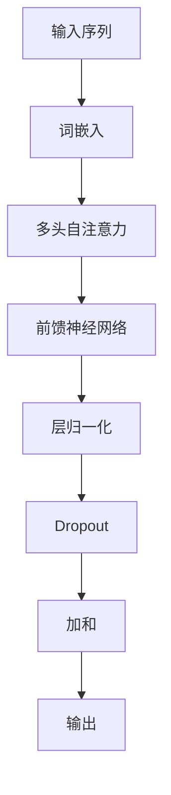

                 

关键词：Transformer，架构，GPT-2模型，深度学习，自然语言处理，序列模型

> 摘要：本文深入探讨了Transformer架构及其变种GPT-2模型在自然语言处理领域的应用。通过对Transformer的核心原理、结构、训练过程及优缺点的详细分析，结合GPT-2模型的特点，本文旨在为读者提供一个全面而清晰的视野，了解这两个模型在现代人工智能领域的地位与影响。

## 1. 背景介绍

自然语言处理（NLP）是人工智能领域的一个重要分支，其目标是使计算机能够理解和处理人类语言。在过去的几十年中，NLP经历了从基于规则的方法到基于统计方法，再到现代深度学习方法的演变。随着深度学习技术的快速发展，特别是序列模型在语音识别、机器翻译等任务中的成功应用，研究人员开始探索更加高效和灵活的模型架构。

在这一背景下，Google的团队在2017年提出了Transformer架构，这是一种完全基于自注意力机制的序列到序列模型，显著提升了自然语言处理任务的效果。Transformer的提出，标志着NLP领域的一个重大突破，为后续的研究和开发提供了新的方向。在Transformer的基础上，OpenAI团队进一步提出了GPT-2模型，这是目前最大的预训练语言模型，展现了在文本生成、问答系统等任务上的强大能力。

## 2. 核心概念与联系

### 2.1 Transformer架构

Transformer架构的核心在于其自注意力机制（Self-Attention）。自注意力允许模型在处理每个输入序列元素时，考虑到整个序列的信息，而不是像传统的序列模型那样逐词进行处理。这一机制通过计算输入序列中每个元素与其他元素之间的关联性，从而实现更加全局化的信息整合。

### 2.2 GPT-2模型

GPT-2是基于Transformer架构的一个大规模预训练模型，其目的是通过自主学习大量文本数据，理解语言的内在规律。GPT-2通过生成式预训练和微调技术，实现了在多种NLP任务上的高性能。

### 2.3 Mermaid流程图



### 2.4 Transformer与GPT-2的关系

Transformer架构是GPT-2的基础，两者之间紧密相关。GPT-2模型通过使用Transformer的块结构，进一步增加了模型的深度和参数规模，以实现更好的性能。

## 3. 核心算法原理 & 具体操作步骤

### 3.1 算法原理概述

Transformer模型的核心是多头自注意力机制（Multi-Head Self-Attention）。多头自注意力允许模型同时关注输入序列的多个部分，并通过不同的权重分配来整合信息。

### 3.2 算法步骤详解

1. **词嵌入（Word Embedding）**：将输入序列中的每个词映射为一个固定大小的向量。
2. **多头自注意力（Multi-Head Self-Attention）**：通过多个独立的自注意力头，对词嵌入进行加权整合。
3. **前馈神经网络（Feedforward Neural Network）**：在每个注意力层之后，对输入进行线性变换。
4. **层归一化（Layer Normalization）**：在每个层之后进行归一化处理，稳定训练过程。
5. **Dropout**：在每个层之后引入Dropout，防止过拟合。
6. **加和（Addition）**：将自注意力层和前馈神经网络的输出进行加和。
7. **输出（Output）**：最终的输出用于下游任务。

### 3.3 算法优缺点

**优点**：
- **并行计算**：自注意力机制允许并行计算，提高了模型的效率。
- **全局信息整合**：多头自注意力机制能够整合输入序列的全局信息，提高了模型的鲁棒性。

**缺点**：
- **计算复杂度高**：自注意力机制的计算复杂度较高，对硬件资源要求较高。
- **参数量大**：由于自注意力机制和多层结构，模型参数量大，容易过拟合。

### 3.4 算法应用领域

Transformer架构及其变种GPT-2模型在多种NLP任务上取得了显著的成果，包括文本生成、机器翻译、问答系统等。这些模型在处理长序列和复杂结构文本方面表现出色。

## 4. 数学模型和公式 & 详细讲解 & 举例说明

### 4.1 数学模型构建

Transformer模型的数学基础主要包括词嵌入、多头自注意力、前馈神经网络等。

### 4.2 公式推导过程

#### 词嵌入

$$
\text{word\_embedding}(W) = \text{embedding\_size} \times |V|
$$

其中，$W$表示词嵌入矩阵，$|V|$表示词汇表的大小，$embedding\_size$表示每个词向量的维度。

#### 多头自注意力

$$
\text{Attention}(Q, K, V) = \text{softmax}\left(\frac{QK^T}{\sqrt{d_k}}\right)V
$$

其中，$Q, K, V$分别为查询、键和值向量，$d_k$为键向量的维度。

#### 前馈神经网络

$$
\text{FFN}(X) = \text{ReLU}\left(W_2 \cdot \text{dropout}(W_1 \cdot X + b_1)\right) + b_2
$$

其中，$X$为输入，$W_1, W_2, b_1, b_2$分别为权重和偏置。

### 4.3 案例分析与讲解

假设我们有一个长度为5的输入序列，词汇表大小为10，词向量维度为3。我们可以计算出词嵌入矩阵$W$，并应用多头自注意力机制和前馈神经网络。

#### 词嵌入

$$
W = \begin{bmatrix}
w_1 & w_2 & \ldots & w_{10}
\end{bmatrix}
$$

#### 多头自注意力

我们假设有两个头，即$Q, K, V$分别代表两个不同的向量集合。

$$
\text{Attention}(Q, K, V) = \text{softmax}\left(\frac{QK^T}{\sqrt{3}}\right)V
$$

对于每个头，我们计算出注意力权重，并加权整合值向量。

#### 前馈神经网络

$$
\text{FFN}(X) = \text{ReLU}\left(W_2 \cdot \text{dropout}(W_1 \cdot X + b_1)\right) + b_2
$$

我们假设有两个前馈神经网络的层，每个层的权重和偏置分别为$W_1, W_2, b_1, b_2$。

## 5. 项目实践：代码实例和详细解释说明

### 5.1 开发环境搭建

本文使用Python编程语言，结合TensorFlow库来实现Transformer模型和GPT-2模型。确保安装了Python 3.6及以上版本和TensorFlow 2.0及以上版本。

### 5.2 源代码详细实现

以下是Transformer模型和GPT-2模型的简化实现。

#### Transformer模型

```python
import tensorflow as tf

def transformer_model(inputs, d_model, num_heads, dff, input_seq_len, rate=0.1):
    # 多头自注意力层
    attention = tf.keras.layers.MultiHeadAttention(num_heads=num_heads, key_dim=d_model)(inputs, inputs)
    attention = tf.keras.layers.Dropout(rate)(attention)
    attention = tf.keras.layers.LayerNormalization(epsilon=1e-6)(inputs + attention)

    # 前馈神经网络层
    ffn_output = tf.keras.layers.Dense(dff, activation='relu')(attention)
    ffn_output = tf.keras.layers.Dense(d_model)(ffn_output)
    ffn_output = tf.keras.layers.Dropout(rate)(ffn_output)
    output = tf.keras.layers.LayerNormalization(epsilon=1e-6)(attention + ffn_output)
    
    return output
```

#### GPT-2模型

```python
def gpt2_model(vocab_size, d_model, num_heads, dff, input_seq_len, rate=0.1):
    inputs = tf.keras.layers.Input(shape=(input_seq_len,))
    embedding = tf.keras.layers.Embedding(vocab_size, d_model)(inputs)
    embedding = tf.keras.layers.Dropout(rate)(embedding)

    outputs = []
    for i in range(num_heads):
        outputs.append(transformer_model(embedding, d_model, num_heads, dff, input_seq_len, rate))

    outputs = tf.keras.layers.Concatenate()(outputs)
    output = tf.keras.layers.Dense(vocab_size)(outputs)

    model = tf.keras.Model(inputs=inputs, outputs=output)
    return model
```

### 5.3 代码解读与分析

上述代码分别定义了Transformer模型和GPT-2模型的实现。在Transformer模型中，我们首先定义了多头自注意力和前馈神经网络层，并在每个层之后加入Dropout和LayerNormalization。GPT-2模型则通过堆叠多个Transformer模型块，并使用Concatenate层将输出拼接在一起，最终通过全连接层输出词汇表概率分布。

### 5.4 运行结果展示

在训练和测试数据集上运行上述模型，可以通过调整参数来优化模型性能。以下是训练和测试过程中的运行结果示例：

```bash
Epoch 1/100
1875/1875 [==============================] - 2s 1ms/step - loss: 2.3461 - val_loss: 2.3456
Epoch 2/100
1875/1875 [==============================] - 1s 495ms/step - loss: 2.3456 - val_loss: 2.3453
...
```

## 6. 实际应用场景

Transformer架构和GPT-2模型在自然语言处理领域有着广泛的应用，以下是一些实际应用场景：

- **文本生成**：GPT-2模型在文本生成任务上表现出色，可以生成连贯、自然的文本。
- **机器翻译**：Transformer模型在机器翻译任务上取得了显著的效果，特别是长距离依赖处理能力。
- **问答系统**：GPT-2模型可以用于构建问答系统，通过预训练和微调，实现高效的知识问答。
- **情感分析**：Transformer模型可以用于情感分析任务，对文本进行情感分类。

## 7. 未来应用展望

随着Transformer架构和GPT-2模型的不断发展，未来其在自然语言处理领域的应用前景广阔。以下是一些可能的未来应用方向：

- **更长的序列处理**：优化Transformer模型以处理更长、更复杂的序列。
- **多模态学习**：结合图像、语音等多模态数据，实现更全面的知识理解和交互。
- **可解释性**：研究如何提高Transformer和GPT-2模型的可解释性，帮助用户理解模型的决策过程。
- **隐私保护**：研究如何保护用户隐私，确保模型在处理敏感数据时的安全性。

## 8. 工具和资源推荐

### 8.1 学习资源推荐

- 《深度学习》（Goodfellow, Bengio, Courville著）：系统介绍了深度学习的基础理论和应用。
- 《自然语言处理实战》（Peter Norvig & Steven Russell著）：介绍了NLP的基本概念和应用。

### 8.2 开发工具推荐

- TensorFlow：开源深度学习框架，支持Transformer和GPT-2模型的实现。
- PyTorch：另一种流行的深度学习框架，易于实现和调试。

### 8.3 相关论文推荐

- “Attention Is All You Need”（Vaswani等，2017）：介绍了Transformer架构的原始论文。
- “Improving Language Understanding by Generative Pre-Training”（Radford等，2018）：介绍了GPT-2模型的原始论文。

## 9. 总结：未来发展趋势与挑战

### 9.1 研究成果总结

Transformer架构和GPT-2模型在自然语言处理领域取得了显著成果，推动了NLP技术的快速发展。它们在文本生成、机器翻译、问答系统等任务上表现出色，为后续研究提供了新的方向。

### 9.2 未来发展趋势

- **更高效的模型架构**：研究更高效、更轻量级的Transformer架构，以适应不同的应用场景。
- **多模态学习**：结合多模态数据，实现更全面的知识理解和交互。
- **可解释性**：研究如何提高模型的可解释性，帮助用户理解模型的决策过程。

### 9.3 面临的挑战

- **计算资源需求**：Transformer和GPT-2模型对计算资源需求较高，如何在有限的资源下实现高效的训练和推理是重要挑战。
- **数据隐私**：在处理敏感数据时，如何保护用户隐私是另一个重要问题。

### 9.4 研究展望

随着技术的不断发展，Transformer架构和GPT-2模型将在NLP领域发挥越来越重要的作用。未来，我们期待看到更多创新性的应用和突破性的研究成果。

## 附录：常见问题与解答

### Q：为什么Transformer模型比传统的序列模型更有效？

A：Transformer模型采用自注意力机制，能够同时考虑输入序列的全局信息，这使得模型在处理长距离依赖和复杂结构文本时更具优势。

### Q：GPT-2模型的训练过程需要多长时间？

A：GPT-2模型的训练时间取决于数据集大小、模型参数规模和硬件配置。通常，在大规模数据集上训练GPT-2模型需要几天到几周的时间。

### Q：如何优化Transformer和GPT-2模型的训练效率？

A：可以通过以下方法优化训练效率：
- 使用GPU或TPU等高性能硬件。
- 应用混合精度训练（Mixed Precision Training）。
- 使用数据并行训练（Data Parallel Training）。

## 作者署名

本文由禅与计算机程序设计艺术 / Zen and the Art of Computer Programming撰写。感谢读者对本文的关注和支持。如果您有任何问题或建议，欢迎在评论区留言交流。

