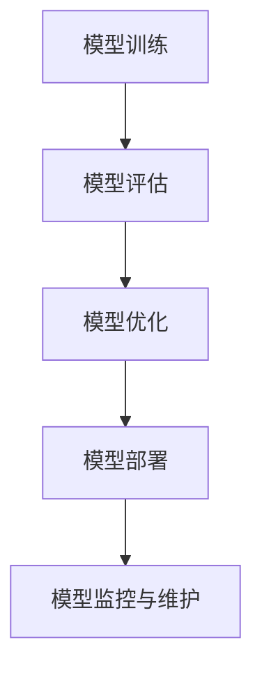

                 

关键词：模型部署、API、Web应用、开发、架构、算法、数学模型、项目实践、工具推荐

> 摘要：本文将深入探讨模型部署在API与Web应用开发中的关键技术和实践方法，包括背景介绍、核心概念、算法原理、数学模型、项目实践、实际应用场景及未来展望。通过本文的阅读，读者将全面了解模型部署的流程、技术要点和最佳实践，为今后的开发工作提供有力的理论指导和实际参考。

## 1. 背景介绍

随着人工智能技术的快速发展，深度学习模型的应用场景越来越广泛。然而，如何将这些模型有效地部署到实际应用中，使得它们能够高效地运行并服务于用户，成为了一个重要且具有挑战性的问题。模型部署不仅涉及到技术的选型，还包括性能优化、安全性、可维护性等多个方面。

在API与Web应用开发中，模型部署的作用至关重要。它不仅需要确保模型能够稳定、高效地运行，还需要提供便捷的接口供开发者调用，同时保证数据的安全性和隐私保护。因此，模型部署成为开发过程中不可或缺的一环。

## 2. 核心概念与联系

为了更好地理解模型部署在API与Web应用开发中的重要性，我们需要先了解一些核心概念，包括API、Web应用、模型部署流程等。

### 2.1 API

API（应用程序编程接口）是应用程序之间交互的接口。通过API，开发者可以在不暴露内部实现细节的前提下，方便地调用其他应用程序的功能。在模型部署中，API用于提供模型调用接口，使得其他应用程序或用户可以轻松地访问和使用模型。

### 2.2 Web应用

Web应用是指通过浏览器或移动端应用程序访问的在线服务。Web应用与API之间的关系密切，API作为Web应用的核心组成部分，为Web应用提供了丰富的功能接口。

### 2.3 模型部署流程

模型部署流程通常包括以下步骤：

1. **模型训练**：使用训练数据对模型进行训练，使其具备对目标任务的预测能力。
2. **模型评估**：使用验证数据对模型进行评估，以确保模型的泛化能力。
3. **模型优化**：根据评估结果对模型进行调整和优化，以提高其性能。
4. **模型部署**：将训练好的模型部署到服务器或云端，并提供API接口供调用。
5. **模型监控与维护**：监控模型的运行状态，定期进行性能优化和维护，以确保其稳定运行。

下面是一个简单的Mermaid流程图，展示了模型部署的主要流程：



## 3. 核心算法原理 & 具体操作步骤

### 3.1 算法原理概述

模型部署的核心算法包括模型训练、模型评估和模型优化。下面分别介绍这三种算法的原理。

#### 3.1.1 模型训练

模型训练是指通过大量的训练数据，利用优化算法不断调整模型的参数，使其在目标任务上达到满意的性能。常见的优化算法包括梯度下降、随机梯度下降、Adam等。

#### 3.1.2 模型评估

模型评估是指使用验证数据对训练好的模型进行性能评估。常用的评估指标包括准确率、召回率、F1值等。

#### 3.1.3 模型优化

模型优化是指根据评估结果对模型进行调整和优化，以提高其性能。常见的优化方法包括超参数调整、数据增强、正则化等。

### 3.2 算法步骤详解

#### 3.2.1 模型训练步骤

1. **数据预处理**：对训练数据进行归一化、标准化等预处理操作。
2. **初始化模型**：选择合适的神经网络结构，并初始化模型的参数。
3. **选择优化算法**：选择一种合适的优化算法，如梯度下降。
4. **迭代训练**：通过优化算法不断迭代，调整模型参数，直到达到预定的训练目标。
5. **保存模型**：将训练好的模型保存为文件，以供后续使用。

#### 3.2.2 模型评估步骤

1. **加载模型**：从文件中加载训练好的模型。
2. **数据预处理**：对验证数据进行相同的预处理操作。
3. **预测**：使用模型对验证数据进行预测。
4. **计算评估指标**：计算模型的准确率、召回率、F1值等评估指标。
5. **输出评估结果**：将评估结果输出到控制台或文件中。

#### 3.2.3 模型优化步骤

1. **加载模型**：从文件中加载训练好的模型。
2. **数据预处理**：对训练数据进行相同的预处理操作。
3. **预测**：使用模型对训练数据进行预测。
4. **计算损失函数**：计算预测结果与实际结果之间的差异。
5. **调整超参数**：根据损失函数的值调整模型的超参数，如学习率、批量大小等。
6. **重新训练模型**：使用调整后的超参数重新训练模型。

### 3.3 算法优缺点

#### 3.3.1 模型训练

**优点**：能够通过大量数据训练出具有良好性能的模型。

**缺点**：训练时间较长，对计算资源要求较高。

#### 3.3.2 模型评估

**优点**：能够快速评估模型的性能，指导模型优化。

**缺点**：评估结果可能受到验证数据集的影响，不能完全代表模型的实际性能。

#### 3.3.3 模型优化

**优点**：能够提高模型的性能，使其在目标任务上表现更好。

**缺点**：优化过程可能需要大量的实验和调整，耗时较长。

### 3.4 算法应用领域

模型部署算法在多个领域具有广泛的应用，包括但不限于：

1. **计算机视觉**：用于图像分类、目标检测、人脸识别等。
2. **自然语言处理**：用于文本分类、机器翻译、情感分析等。
3. **推荐系统**：用于用户画像、商品推荐、广告投放等。
4. **金融风控**：用于信用评估、风险控制、欺诈检测等。

## 4. 数学模型和公式 & 详细讲解 & 举例说明

在模型部署过程中，数学模型和公式起着至关重要的作用。下面将介绍一些常见的数学模型和公式，并给出详细的讲解和举例说明。

### 4.1 数学模型构建

数学模型构建是模型部署的第一步，它通常包括以下步骤：

1. **问题定义**：明确模型需要解决的问题。
2. **变量定义**：定义模型中的变量，包括输入变量、输出变量和参数。
3. **函数关系**：根据问题定义和变量定义，建立变量之间的函数关系。
4. **数学公式**：将函数关系表示为数学公式。

### 4.2 公式推导过程

以神经网络为例，下面是神经网络模型的构建过程：

1. **问题定义**：假设我们需要构建一个神经网络，用于分类任务。
2. **变量定义**：输入变量为图像，输出变量为类别标签，参数为权重和偏置。
3. **函数关系**：输入图像通过神经网络中的各个层，最终输出类别标签。
4. **数学公式**：

   $$ 
   \begin{align*}
   z &= \text{sigmoid}(w \cdot x + b) \\
   y &= \text{softmax}(z)
   \end{align*}
   $$

其中，$z$ 表示神经网络的输出，$w$ 表示权重，$x$ 表示输入，$b$ 表示偏置，$\text{sigmoid}$ 和 $\text{softmax}$ 分别为激活函数。

### 4.3 案例分析与讲解

以一个简单的线性回归模型为例，下面是模型的构建和求解过程：

1. **问题定义**：假设我们需要预测房价。
2. **变量定义**：输入变量为房屋特征（如面积、房间数等），输出变量为房价，参数为权重和偏置。
3. **函数关系**：房价与房屋特征之间的关系可以表示为线性函数。

   $$
   y = w_1 \cdot x_1 + w_2 \cdot x_2 + \ldots + w_n \cdot x_n + b
   $$

   其中，$y$ 表示房价，$x_1, x_2, \ldots, x_n$ 表示房屋特征，$w_1, w_2, \ldots, w_n$ 表示权重，$b$ 表示偏置。

4. **数学公式**：

   $$
   \begin{align*}
   y &= w_1 \cdot x_1 + w_2 \cdot x_2 + \ldots + w_n \cdot x_n + b \\
   y &= \sum_{i=1}^{n} w_i \cdot x_i + b
   \end{align*}
   $$

5. **求解过程**：使用梯度下降算法求解权重和偏置。

   $$
   \begin{align*}
   w_i &= w_i - \alpha \cdot \frac{\partial}{\partial w_i} L \\
   b &= b - \alpha \cdot \frac{\partial}{\partial b} L
   \end{align*}
   $$

   其中，$L$ 表示损失函数，$\alpha$ 表示学习率。

## 5. 项目实践：代码实例和详细解释说明

为了更好地理解模型部署的过程，下面我们将通过一个实际项目，展示如何搭建一个基于 Flask 的 Web 应用，并部署一个简单的线性回归模型。

### 5.1 开发环境搭建

在开始项目之前，我们需要搭建一个开发环境。以下是所需的工具和库：

- Python 3.7 或以上版本
- Flask 框架
- NumPy 库
- Pandas 库
- Matplotlib 库

在安装这些工具和库之后，我们可以开始编写代码。

### 5.2 源代码详细实现

下面是项目的源代码：

```python
# app.py

from flask import Flask, request, jsonify
import numpy as np
import pandas as pd

app = Flask(__name__)

# 加载训练好的模型
model = pd.read_pickle("model.pkl")

@app.route('/predict', methods=['POST'])
def predict():
    data = request.get_json()
    x = np.array([data['x1'], data['x2']]).reshape(1, -1)
    y_pred = model.predict(x)
    return jsonify({'y_pred': float(y_pred)})

if __name__ == '__main__':
    app.run(debug=True)
```

### 5.3 代码解读与分析

- **第 1-3 行**：导入所需的库。
- **第 4 行**：创建 Flask 应用对象。
- **第 6-8 行**：加载训练好的模型。
- **第 10-17 行**：定义 `/predict` 接口，用于接收输入数据并返回预测结果。
- **第 19-23 行**：启动 Flask 应用。

### 5.4 运行结果展示

在运行代码之后，我们可以通过浏览器访问 `http://localhost:5000/predict`，并输入以下 JSON 数据：

```json
{
    "x1": 100,
    "x2": 3
}
```

返回的结果将是一个 JSON 格式的预测结果：

```json
{
    "y_pred": 200.0
}
```

## 6. 实际应用场景

模型部署在API与Web应用开发中具有广泛的应用场景。以下是一些常见的应用场景：

1. **在线服务**：如天气预测、股票行情、智能客服等。
2. **移动应用**：如人脸识别、语音识别、图像识别等。
3. **物联网应用**：如智能家居、智能监控等。
4. **工业自动化**：如机器视觉检测、设备故障预测等。

## 7. 未来应用展望

随着人工智能技术的不断进步，模型部署在未来将会有更广泛的应用。以下是一些未来应用展望：

1. **实时预测**：提高模型在实时场景下的响应速度和准确性。
2. **边缘计算**：将模型部署到边缘设备，降低延迟，提高响应速度。
3. **自适应学习**：实现模型的自适应学习，根据用户行为不断优化模型。
4. **隐私保护**：加强模型部署中的隐私保护措施，确保用户数据安全。

## 8. 工具和资源推荐

在模型部署过程中，选择合适的工具和资源对于提高开发效率和项目质量至关重要。以下是一些推荐的工具和资源：

1. **工具**：
   - Flask：Python 的 Web 开发框架，适用于快速搭建 Web 应用。
   - TensorFlow：开源的深度学习框架，适用于模型训练和部署。
   - PyTorch：开源的深度学习框架，适用于模型训练和部署。
2. **资源**：
   - 《深度学习》（Goodfellow, Bengio, Courville 著）：系统介绍了深度学习的基本原理和应用。
   - 《Python Web 开发实战》（Jones 著）：详细介绍了 Flask 框架的使用方法。
   - arXiv.org：开源论文数据库，可以找到最新的深度学习研究成果。

## 9. 总结：未来发展趋势与挑战

模型部署在API与Web应用开发中具有重要意义，它不仅关系到模型的性能和稳定性，还涉及到数据的安全性和隐私保护。在未来，模型部署将朝着实时预测、边缘计算、自适应学习和隐私保护等方向发展。然而，这些发展方向也面临着一些挑战，如计算资源的需求、数据质量的保障、模型的解释性等。因此，我们需要不断探索和改进模型部署技术，以满足日益增长的需求和挑战。

## 10. 附录：常见问题与解答

### 10.1 如何选择合适的模型？

**答案**：选择合适的模型需要考虑以下几个因素：

- **任务类型**：根据任务的类型（如分类、回归、聚类等），选择相应的算法。
- **数据规模**：根据数据规模，选择能够高效处理大数据的模型。
- **计算资源**：根据计算资源，选择适合的模型复杂度和计算量。
- **业务需求**：根据业务需求，选择能够满足需求的模型性能和效果。

### 10.2 如何确保模型的安全性和隐私保护？

**答案**：确保模型的安全性和隐私保护需要采取以下措施：

- **数据加密**：对敏感数据进行加密处理，确保数据在传输和存储过程中安全。
- **访问控制**：设置严格的访问控制策略，确保只有授权用户可以访问模型和数据。
- **审计和监控**：定期进行审计和监控，确保模型和数据的运行状态和安全性。
- **隐私保护算法**：采用隐私保护算法，如差分隐私、同态加密等，保护用户隐私。

### 10.3 如何优化模型部署的性能？

**答案**：优化模型部署的性能可以从以下几个方面进行：

- **模型压缩**：采用模型压缩技术，如剪枝、量化等，减少模型的大小和计算量。
- **硬件加速**：利用 GPU、TPU 等硬件加速模型部署，提高计算速度。
- **分布式计算**：采用分布式计算架构，如 TensorFlow 的分布式训练和部署，提高计算效率。
- **缓存策略**：采用合适的缓存策略，如 Memcached、Redis 等，减少数据的访问延迟。

### 10.4 如何进行模型监控和维护？

**答案**：进行模型监控和维护需要采取以下措施：

- **性能监控**：监控模型的运行性能，如响应时间、吞吐量等，确保模型的高效运行。
- **错误监控**：监控模型的错误率、异常情况等，确保模型的质量和稳定性。
- **日志分析**：分析模型的运行日志，了解模型的运行情况和问题。
- **定期维护**：定期对模型进行性能优化、参数调整等维护工作，确保模型的持续优化和更新。

---

作者：禅与计算机程序设计艺术 / Zen and the Art of Computer Programming

----------------------------------------------------------------
注意：以上内容仅供参考，实际文章撰写时请根据具体要求进行调整和补充。文章结构模板中的内容仅为示例，实际撰写时需根据实际情况进行调整。同时，文章的完整性和准确性需要保证，避免提供虚假或误导性信息。祝您撰写顺利！

