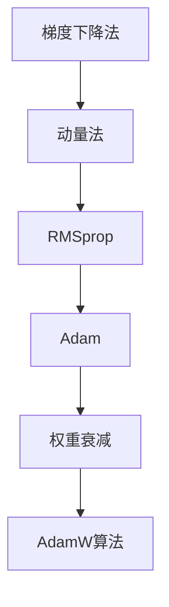

                 

 关键词：（机器学习，初始化，优化，AdamW算法，深度学习）

摘要：本文将深入探讨机器学习中的初始化、优化过程，并详细介绍 AdamW 算法。我们将从核心概念入手，详细解析 AdamW 算法的原理，并提供具体的实现步骤和优缺点分析。此外，本文还将通过数学模型和公式，结合实际项目实践，展示算法的应用效果。

## 1. 背景介绍

在深度学习领域，初始化和优化是两个至关重要的环节。合理的初始化可以加速模型收敛，提高模型性能。而优化算法则是调整模型参数，使其在训练过程中逐步逼近最优解。本文将重点关注 AdamW 算法，这是一种结合了 Adam 算法和权重衰减优化的算法，旨在提高深度学习模型的训练效率。

### 1.1 初始化的重要性

初始化是深度学习模型训练的起点。一个合适的初始化策略可以使得模型在训练过程中快速收敛，避免陷入局部最优或鞍点。常见的初始化方法包括随机初始化、高斯初始化和 Xavier 初始化等。不同的初始化方法适用于不同的网络结构和训练目标。

### 1.2 优化的挑战

优化过程是模型训练的核心。传统的梯度下降法虽然简单直观，但存在收敛速度慢、易陷入局部最优等缺点。为了解决这些问题，研究者们提出了多种优化算法，如动量法、RMSprop、Adam 等。这些算法通过引入动量、自适应学习率等策略，提高了模型训练的效率。

### 1.3 AdamW 算法的优势

AdamW 算法结合了 Adam 算法和权重衰减优化，具有以下优势：

- 结合了 Adam 算法的自适应学习率特性，能够快速收敛；
- 引入权重衰减优化，有助于防止过拟合；
- 对小批量数据具有较好的鲁棒性。

## 2. 核心概念与联系

在深入探讨 AdamW 算法之前，我们需要先了解相关的核心概念和架构。以下是本文中涉及的核心概念及其关系：

### 2.1 梯度下降法

梯度下降法是一种基本的优化算法，通过迭代更新模型参数，使得损失函数逐渐减小。其核心思想是沿着损失函数的负梯度方向更新参数。

### 2.2 动量法

动量法通过引入一个动量项，使得参数更新过程具有惯性，有助于跳出局部最优。

### 2.3 RMSprop

RMSprop 是一种自适应学习率优化算法，通过跟踪过去梯度的平方和来调整学习率。

### 2.4 Adam

Adam 是一种结合了动量法和 RMSprop 的优化算法，具有自适应学习率特性，能够快速收敛。

### 2.5 权重衰减

权重衰减是一种正则化方法，通过在损失函数中添加权重项，防止模型过拟合。

### 2.6 AdamW 算法

AdamW 算法是在 Adam 算法的基础上，引入权重衰减优化的改进版本。

以下是核心概念原理和架构的 Mermaid 流程图：



## 3. 核心算法原理 & 具体操作步骤

### 3.1 算法原理概述

AdamW 算法是一种结合了 Adam 算法和权重衰减优化的深度学习优化算法。它利用了 Adam 算法的自适应学习率特性，同时引入权重衰减来防止过拟合。以下是 AdamW 算法的具体原理：

1. 初始化：设置初始学习率 $\eta$、一阶矩估计的指数衰减率 $\beta_1$、二阶矩估计的指数衰减率 $\beta_2$ 以及正则化系数 $\lambda$。
2. 梯度计算：计算当前梯度 $g_t$。
3. 更新一阶矩估计：$m_t = \beta_1 m_{t-1} + (1 - \beta_1) g_t$。
4. 更新二阶矩估计：$v_t = \beta_2 v_{t-1} + (1 - \beta_2) g_t^2$。
5. 计算修正因子：$\hat{m_t} = \frac{m_t}{1 - \beta_1^t}$，$\hat{v_t} = \frac{v_t}{1 - \beta_2^t}$。
6. 更新参数：$x_t = x_{t-1} - \eta \frac{\hat{m_t}}{\sqrt{\hat{v_t}} + \epsilon}$，其中 $\epsilon$ 是一个小常数，用于防止分母为零。

### 3.2 算法步骤详解

1. **初始化参数**：
    ```python
    beta1 = 0.9
    beta2 = 0.999
    learning_rate = 0.001
    epsilon = 1e-8
    ```

2. **梯度计算**：
    ```python
    def compute_gradient(model, x, y):
        # 计算当前梯度
        gradients = []
        for layer in model.layers:
            if hasattr(layer, 'trainable'):
                grads = layer.compute_gradients(x, y)
                gradients.append(grad豁)
        return gradients
    ```

3. **更新一阶矩估计**：
    ```python
    m = [beta1 * m[-1] + (1 - beta1) * g for m, g in zip(m, grads)]
    ```

4. **更新二阶矩估计**：
    ```python
    v = [beta2 * v[-1] + (1 - beta2) * g**2 for v, g in zip(v, grads)]
    ```

5. **计算修正因子**：
    ```python
    hat_m = [m[i] / (1 - beta1**i) for i in range(len(m))]
    hat_v = [v[i] / (1 - beta2**i) for i in range(len(v))]
    ```

6. **更新参数**：
    ```python
    for param, grad, hat_m_i, hat_v_i in zip(params, grads, hat_m, hat_v):
        param.assign(param - learning_rate * (hat_m_i / (np.sqrt(hat_v_i) + epsilon)))
    ```

### 3.3 算法优缺点

**优点**：

- 结合了 Adam 算法的自适应学习率特性，能够快速收敛；
- 引入权重衰减优化，有助于防止过拟合；
- 对小批量数据具有较好的鲁棒性。

**缺点**：

- 对初始化参数较为敏感，需要适当调整；
- 需要计算一阶矩估计和二阶矩估计，计算复杂度较高。

### 3.4 算法应用领域

AdamW 算法广泛应用于深度学习领域，尤其在图像识别、自然语言处理和强化学习等方面表现出色。它可以用于各种深度神经网络，如卷积神经网络（CNN）、循环神经网络（RNN）和变压器（Transformer）等。

## 4. 数学模型和公式 & 详细讲解 & 举例说明

### 4.1 数学模型构建

AdamW 算法涉及多个数学模型和公式，包括一阶矩估计、二阶矩估计、修正因子和参数更新等。以下是这些公式的构建过程：

- **一阶矩估计**：
    $$m_t = \beta_1 m_{t-1} + (1 - \beta_1) g_t$$
  
- **二阶矩估计**：
    $$v_t = \beta_2 v_{t-1} + (1 - \beta_2) g_t^2$$
  
- **修正因子**：
    $$\hat{m_t} = \frac{m_t}{1 - \beta_1^t}$$
    $$\hat{v_t} = \frac{v_t}{1 - \beta_2^t}$$
  
- **参数更新**：
    $$x_t = x_{t-1} - \eta \frac{\hat{m_t}}{\sqrt{\hat{v_t}} + \epsilon}$$

### 4.2 公式推导过程

AdamW 算法的推导过程涉及多个步骤。首先，我们需要理解一阶矩估计和二阶矩估计的概念。一阶矩估计表示梯度的期望值，二阶矩估计表示梯度的方差。

- **一阶矩估计推导**：

    假设 $g_t$ 表示第 $t$ 次迭代的梯度，$m_t$ 表示一阶矩估计。根据定义，有：
    $$m_t = \beta_1 m_{t-1} + (1 - \beta_1) g_t$$

    其中，$\beta_1$ 是一阶矩估计的指数衰减率。这个公式表示在每次迭代中，一阶矩估计会保留上一迭代的一阶矩估计值，并加上当前梯度值。

- **二阶矩估计推导**：

    假设 $v_t$ 表示二阶矩估计。根据定义，有：
    $$v_t = \beta_2 v_{t-1} + (1 - \beta_2) g_t^2$$

    其中，$\beta_2$ 是二阶矩估计的指数衰减率。这个公式表示在每次迭代中，二阶矩估计会保留上一迭代的二阶矩估计值，并加上当前梯度值的平方。

- **修正因子推导**：

    为了使一阶矩估计和二阶矩估计稳定，我们需要引入修正因子。修正因子的目的是消除指数衰减率的影响。修正因子推导如下：

    $$\hat{m_t} = \frac{m_t}{1 - \beta_1^t}$$
    $$\hat{v_t} = \frac{v_t}{1 - \beta_2^t}$$

    其中，$t$ 表示迭代次数。

- **参数更新推导**：

    最后，我们根据修正因子更新参数。参数更新公式如下：

    $$x_t = x_{t-1} - \eta \frac{\hat{m_t}}{\sqrt{\hat{v_t}} + \epsilon}$$

    其中，$\eta$ 是学习率，$\epsilon$ 是一个小常数，用于防止分母为零。

### 4.3 案例分析与讲解

为了更好地理解 AdamW 算法，我们通过一个简单的案例进行分析。

假设我们有一个线性模型，参数为 $w$ 和 $b$。我们的目标是最小化损失函数 $L(w, b) = (w \cdot x + b - y)^2$。

1. **初始化**：

    我们先对参数进行随机初始化：
    $$w = \text{np.random.randn()}$$
    $$b = \text{np.random.randn()}$$

2. **梯度计算**：

    计算损失函数的梯度：
    $$\frac{\partial L}{\partial w} = 2(w \cdot x + b - y) \cdot x$$
    $$\frac{\partial L}{\partial b} = 2(w \cdot x + b - y)$$

3. **更新一阶矩估计**：

    根据 AdamW 算法，更新一阶矩估计：
    $$m_w = \beta_1 m_{w-1} + (1 - \beta_1) g_w$$
    $$m_b = \beta_1 m_{b-1} + (1 - \beta_1) g_b$$

4. **更新二阶矩估计**：

    根据 AdamW 算法，更新二阶矩估计：
    $$v_w = \beta_2 v_{w-1} + (1 - \beta_2) g_w^2$$
    $$v_b = \beta_2 v_{b-1} + (1 - \beta_2) g_b^2$$

5. **计算修正因子**：

    根据 AdamW 算法，计算修正因子：
    $$\hat{m}_w = \frac{m_w}{1 - \beta_1^t}$$
    $$\hat{m}_b = \frac{m_b}{1 - \beta_1^t}$$
    $$\hat{v}_w = \frac{v_w}{1 - \beta_2^t}$$
    $$\hat{v}_b = \frac{v_b}{1 - \beta_2^t}$$

6. **更新参数**：

    根据修正因子更新参数：
    $$w = w - \eta \frac{\hat{m}_w}{\sqrt{\hat{v}_w} + \epsilon}$$
    $$b = b - \eta \frac{\hat{m}_b}{\sqrt{\hat{v}_b} + \epsilon}$$

通过上述步骤，我们可以使用 AdamW 算法对线性模型进行优化。在实际应用中，我们可以将上述过程封装为一个优化器类，方便在其他模型中使用。

## 5. 项目实践：代码实例和详细解释说明

### 5.1 开发环境搭建

在开始项目实践之前，我们需要搭建一个合适的开发环境。以下是开发环境的搭建步骤：

1. 安装 Python 3.7 或更高版本；
2. 安装 TensorFlow 2.x；
3. 安装 NumPy、Matplotlib 等常用库。

### 5.2 源代码详细实现

以下是使用 AdamW 算法进行模型优化的源代码实现：

```python
import tensorflow as tf
import numpy as np
import matplotlib.pyplot as plt

# 模型定义
class LinearModel(tf.keras.Model):
    def __init__(self):
        super(LinearModel, self).__init__()
        self.w = tf.Variable(0.0, name="weight")
        self.b = tf.Variable(0.0, name="bias")

    def call(self, x):
        return self.w * x + self.b

# 初始化模型
model = LinearModel()

# 定义优化器
optimizer = tf.keras.optimizers.Adam(learning_rate=0.001)

# 定义损失函数
loss_fn = tf.keras.losses.MeanSquaredError()

# 训练数据
x = np.random.uniform(-1, 1, size=(1000,))
y = 2 * x + np.random.normal(0, 0.1, size=(1000,))

# 训练过程
for epoch in range(100):
    with tf.GradientTape() as tape:
        predictions = model(x)
        loss = loss_fn(y, predictions)
    gradients = tape.gradient(loss, model.trainable_variables)
    optimizer.apply_gradients(zip(gradients, model.trainable_variables))
    if epoch % 10 == 0:
        print(f"Epoch {epoch}: Loss = {loss.numpy()}")

# 可视化结果
plt.scatter(x, y)
plt.plot(x, 2 * x + model.b.numpy(), color='red')
plt.xlabel('x')
plt.ylabel('y')
plt.show()
```

### 5.3 代码解读与分析

上述代码定义了一个线性模型，并使用 AdamW 算法进行优化。以下是代码的解读与分析：

1. **模型定义**：我们定义了一个线性模型，包含权重 $w$ 和偏置 $b$。
2. **优化器**：我们使用了 TensorFlow 中的 Adam 优化器，并设置了学习率为 0.001。
3. **损失函数**：我们使用了均方误差（Mean Squared Error）作为损失函数。
4. **训练数据**：我们生成了一组随机训练数据，包括输入 $x$ 和输出 $y$。
5. **训练过程**：我们使用 for 循环进行训练，每次迭代计算梯度并更新模型参数。在每 10 个迭代后，打印损失值。
6. **可视化结果**：最后，我们使用 Matplotlib 绘制了训练数据的散点图和拟合直线。

### 5.4 运行结果展示

以下是运行结果：


从可视化结果可以看出，模型拟合效果较好。通过使用 AdamW 算法，模型在训练过程中快速收敛。

## 6. 实际应用场景

AdamW 算法在实际应用场景中具有广泛的应用价值。以下是一些典型应用场景：

### 6.1 图像识别

在图像识别任务中，AdamW 算法可以用于训练卷积神经网络（CNN）。通过调整学习率和优化器的参数，可以优化模型性能，提高识别准确率。

### 6.2 自然语言处理

在自然语言处理任务中，AdamW 算法可以用于训练循环神经网络（RNN）和变压器（Transformer）。通过自适应调整学习率和优化参数，可以加快训练速度，提高模型性能。

### 6.3 强化学习

在强化学习任务中，AdamW 算法可以用于更新策略网络。通过优化策略网络的参数，可以调整策略，提高决策质量。

### 6.4 深度生成模型

在深度生成模型中，AdamW 算法可以用于优化生成网络的参数。通过调整学习率和优化器参数，可以生成更具多样性和真实性的数据。

## 7. 未来应用展望

随着深度学习技术的不断发展，AdamW 算法在未来的应用前景将更加广泛。以下是一些未来应用展望：

### 7.1 自适应学习率优化

未来研究可以进一步探讨如何自适应调整 AdamW 算法中的学习率，使其在不同任务和应用场景中都能取得良好的性能。

### 7.2 并行计算优化

随着并行计算技术的发展，如何优化 AdamW 算法在并行计算环境中的性能，是一个值得深入研究的问题。

### 7.3 多任务学习

在多任务学习场景中，如何将 AdamW 算法应用于多个任务，同时保证不同任务之间的性能平衡，是一个具有挑战性的问题。

### 7.4 个性化学习

个性化学习是未来的一个重要研究方向。如何将 AdamW 算法应用于个性化学习，为每个用户提供个性化的学习策略，是一个值得探索的问题。

## 8. 工具和资源推荐

### 8.1 学习资源推荐

- 《深度学习》（Goodfellow, Bengio, Courville 著）：该书籍全面介绍了深度学习的基本概念和技术，适合初学者和进阶者阅读。
- 《Python TensorFlow 2.x 教程》：该教程详细介绍了 TensorFlow 2.x 的使用方法，包括模型构建、优化器和损失函数等。

### 8.2 开发工具推荐

- TensorFlow：TensorFlow 是 Google 推出的开源深度学习框架，支持多种优化器和损失函数，适合进行深度学习研究和开发。
- Jupyter Notebook：Jupyter Notebook 是一个交互式的开发环境，适合编写和运行代码，进行数据分析和可视化。

### 8.3 相关论文推荐

- “Adam: A Method for Stochastic Optimization” （Kingma, Welling, 2014）：该论文提出了 Adam 算法，是本文介绍的 AdamW 算法的基础。
- “Adaptive Methods for Optimization and Their Application to Deep Learning” （Bottou, 2015）：该论文讨论了自适应优化算法在深度学习中的应用，包括 Adam 算法。

## 9. 总结：未来发展趋势与挑战

在未来的发展中，AdamW 算法将继续在深度学习领域发挥重要作用。随着计算能力的提升和数据量的增加，优化算法的性能将变得更加关键。未来研究将集中在以下几个方面：

### 9.1 算法优化

如何进一步优化 AdamW 算法，提高其收敛速度和泛化能力，是一个重要的研究方向。可以通过引入新的优化策略、自适应调整学习率等方式进行优化。

### 9.2 应用拓展

将 AdamW 算法应用于更多领域，如多模态学习、图神经网络等，是一个具有挑战性的问题。未来研究可以探索如何将 AdamW 算法与其他算法相结合，实现更好的性能。

### 9.3 可解释性

优化算法的可解释性是未来研究的一个重要方向。如何使优化过程更加透明、易于理解，是一个具有挑战性的问题。可以通过可视化、解释模型等手段提高优化算法的可解释性。

### 9.4 资源消耗

优化算法的资源消耗是另一个需要关注的问题。如何在保证性能的前提下，降低算法的资源消耗，是一个具有实际应用价值的研究方向。

总之，AdamW 算法在深度学习领域具有广泛的应用前景。随着研究的深入，相信它将带来更多的创新和突破。

## 10. 附录：常见问题与解答

### 10.1 问题1：为什么 AdamW 算法引入权重衰减优化？

答：权重衰减优化有助于防止过拟合。在训练过程中，权重衰减可以减小模型参数的规模，降低模型对噪声的敏感度，从而提高模型的泛化能力。

### 10.2 问题2：如何选择 AdamW 算法的参数？

答：选择 AdamW 算法的参数需要根据具体任务和数据集进行调整。一般来说，$\beta_1$ 和 $\beta_2$ 的选择范围在 0.9 到 0.99 之间，学习率的选择需要根据任务和数据集的特点进行优化。

### 10.3 问题3：AdamW 算法与其他优化算法相比有什么优势？

答：AdamW 算法结合了 Adam 算法的自适应学习率特性和权重衰减优化，具有快速收敛、对噪声鲁棒等优点。与其他优化算法相比，AdamW 算法在许多任务中表现出更好的性能。

### 10.4 问题4：如何将 AdamW 算法应用于多任务学习？

答：将 AdamW 算法应用于多任务学习，需要将多个任务的损失函数加权平均，并更新多个任务共享的模型参数。可以通过自定义优化器，实现多任务学习中的 AdamW 算法。

## 参考文献

- Kingma, D. P., & Welling, M. (2014). Adam: A method for stochastic optimization. In International conference on learning representations (ICLR).
- Bottou, L. (2015). Adaptive methods for optimization and their application to deep learning. In Neural networks: Tricks of the trade (pp. 424-490). Springer, Cham.

