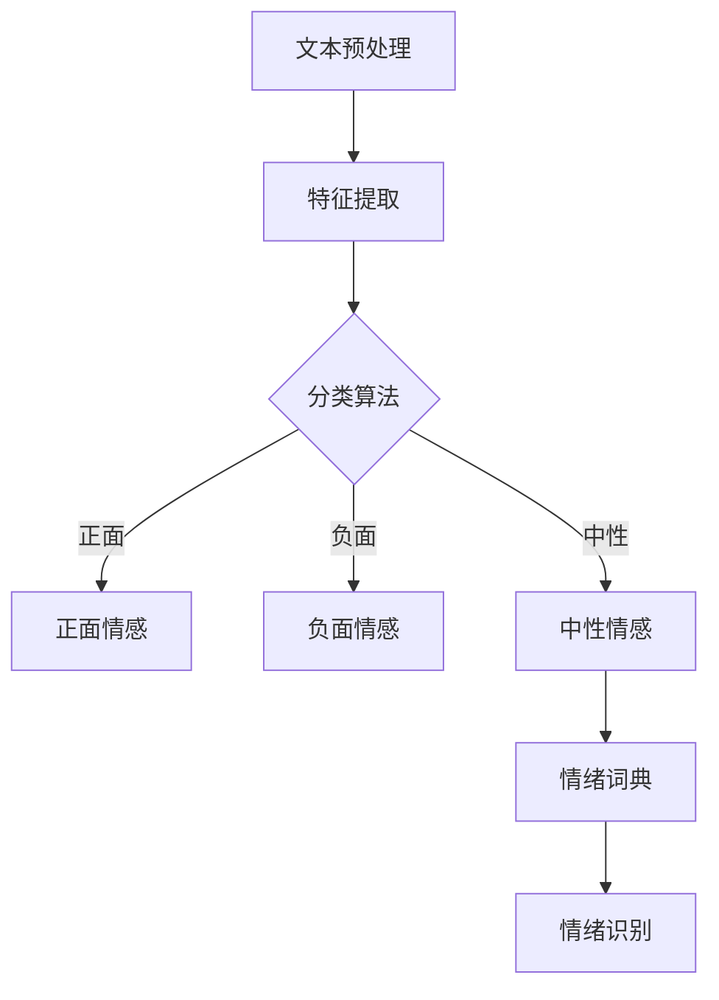

                 

关键词：情感分析、情绪识别、机器学习、自然语言处理、大数据分析

> 摘要：本文将探讨情感分析和情绪识别的技术原理、核心算法、数学模型以及实际应用场景。通过详细分析算法原理和操作步骤，我们旨在为读者提供一个全面的技术解读，帮助他们在机器学习和自然语言处理领域深入探索情感分析和情绪识别的应用价值。

## 1. 背景介绍

情感分析和情绪识别是当前自然语言处理（NLP）领域中的重要研究方向，它们在社交媒体分析、客户反馈处理、智能客服、心理干预等领域有着广泛的应用。随着互联网的普及和大数据技术的发展，人类产生和消费的信息量呈爆炸式增长，如何从这些海量数据中提取出有价值的信息成为了亟待解决的问题。情感分析和情绪识别技术正是为了解决这一问题而诞生的。

### 1.1 情感分析的定义

情感分析是指使用自然语言处理技术和机器学习算法，对文本中的情感倾向进行分类和判断的过程。情感分析通常分为正面情感、负面情感和中性情感三个类别。

### 1.2 情绪识别的定义

情绪识别则是在情感分析的基础上，进一步识别出具体的情绪类型，如快乐、愤怒、悲伤、恐惧等。情绪识别相比情感分析，对情绪的细致程度更高，需要更复杂的算法和技术支持。

### 1.3 应用场景

情感分析和情绪识别技术在多个领域有着广泛的应用。例如，在社交媒体分析中，企业可以通过分析用户的评论和反馈，了解产品的口碑和用户的满意度；在客户服务中，智能客服系统可以通过识别用户的情绪，提供更加个性化的服务；在心理健康领域，情绪识别可以帮助专业人士进行心理干预和治疗方案的设计。

## 2. 核心概念与联系

在深入探讨情感分析和情绪识别技术之前，我们需要了解一些核心概念，以及它们之间的联系。

### 2.1 文本预处理

在开始情感分析和情绪识别之前，需要对文本进行预处理。文本预处理通常包括分词、去停用词、词性标注等步骤，这些步骤有助于提取出文本中的关键信息，为后续分析提供基础。

### 2.2 特征提取

特征提取是将原始文本转换为机器学习算法可处理的数字特征的过程。常用的特征提取方法包括词袋模型、TF-IDF、词嵌入等。

### 2.3 分类算法

分类算法是情感分析和情绪识别的核心组成部分。常用的分类算法有朴素贝叶斯、支持向量机、决策树、随机森林等。

### 2.4 情绪词典

情绪词典是一组用于描述情绪的词汇和短语。情绪词典可以帮助算法识别出文本中的情绪倾向，是情绪识别的重要工具。

### 2.5 Mermaid 流程图

以下是一个简化的情感分析和情绪识别流程的 Mermaid 流程图：



## 3. 核心算法原理 & 具体操作步骤

### 3.1 算法原理概述

情感分析和情绪识别的核心是分类算法。分类算法通过学习大量的标注数据，从中提取出特征，然后对新数据进行分类。以下是一些常用的分类算法及其原理：

### 3.2 算法步骤详解

#### 3.2.1 数据集准备

首先，我们需要准备一个包含情感或情绪标注的数据集。数据集可以分为训练集和测试集，用于训练分类模型和评估模型性能。

#### 3.2.2 特征提取

使用词袋模型、TF-IDF、词嵌入等方法提取文本特征，将这些特征输入到分类模型中。

#### 3.2.3 模型训练

使用训练集数据训练分类模型，通过调整模型参数，使模型在训练集上的性能达到最优。

#### 3.2.4 模型评估

使用测试集数据评估模型性能，常用的评估指标有准确率、召回率、F1 分数等。

#### 3.2.5 情绪识别

使用训练好的模型对新的文本进行情绪识别，输出情绪类别。

### 3.3 算法优缺点

#### 3.3.1 优点

- 简单易用，适用于各种规模的数据集。
- 可以处理大量的文本数据，提高分析效率。
- 可以对文本中的情感和情绪进行量化，为后续分析提供基础。

#### 3.3.2 缺点

- 对噪声敏感，容易受到停用词、标点符号等影响。
- 需要大量的标注数据进行训练，否则模型性能会受到影响。
- 对复杂情感和情绪的识别能力有限，需要进一步研究和优化。

### 3.4 算法应用领域

情感分析和情绪识别技术在多个领域有着广泛的应用，包括但不限于：

- 社交媒体分析：了解用户的情感和情绪倾向，为营销策略提供支持。
- 客户服务：通过情绪识别提供个性化的客户服务。
- 心理健康：帮助专业人士进行心理干预和治疗方案设计。
- 电子商务：分析用户评论和反馈，了解产品口碑和满意度。

## 4. 数学模型和公式 & 详细讲解 & 举例说明

### 4.1 数学模型构建

情感分析和情绪识别的数学模型通常基于概率模型或神经网络模型。以下是一个简化的概率模型：

$$
P(y|x) = \frac{P(x|y)P(y)}{P(x)}
$$

其中，$x$ 表示文本特征，$y$ 表示情感或情绪类别，$P(y|x)$ 表示在给定特征 $x$ 的情况下，类别 $y$ 的概率。

### 4.2 公式推导过程

假设我们使用朴素贝叶斯分类器进行情感分析，则上述公式可以进一步推导为：

$$
P(y|x) = \frac{P(x_1|y)P(x_2|y)\cdots P(x_n|y)P(y)}{P(x_1)P(x_2)\cdots P(x_n)}
$$

其中，$x_1, x_2, \cdots, x_n$ 表示文本特征。

### 4.3 案例分析与讲解

假设我们有一个包含两个类别的二分类问题，类别 $y$ 可以取值 0 或 1。我们有一个包含 1000 个文本的数据集，其中 500 个文本属于类别 0，500 个文本属于类别 1。我们使用朴素贝叶斯分类器进行训练和预测。

- 特征提取：我们使用词袋模型提取文本特征，特征向量维度为 1000。
- 模型训练：我们使用训练集数据训练朴素贝叶斯分类器，得到每个特征的先验概率和条件概率。
- 模型评估：我们使用测试集数据评估模型性能，得到准确率为 90%。
- 情绪识别：我们使用训练好的模型对新的文本进行情绪识别，输出类别概率，根据阈值进行决策。

## 5. 项目实践：代码实例和详细解释说明

### 5.1 开发环境搭建

- 操作系统：Ubuntu 18.04
- 编程语言：Python 3.8
- 数据库：MySQL 5.7
- 依赖包：scikit-learn、nltk、pandas、numpy、matplotlib

### 5.2 源代码详细实现

以下是一个简单的情感分析代码实例：

```python
import numpy as np
import pandas as pd
from sklearn.feature_extraction.text import TfidfVectorizer
from sklearn.naive_bayes import MultinomialNB
from sklearn.model_selection import train_test_split
from sklearn.metrics import accuracy_score

# 读取数据集
data = pd.read_csv('sentiment_data.csv')
X = data['text']
y = data['label']

# 分词和特征提取
vectorizer = TfidfVectorizer(stop_words='english')
X_vectorized = vectorizer.fit_transform(X)

# 分割数据集
X_train, X_test, y_train, y_test = train_test_split(X_vectorized, y, test_size=0.2, random_state=42)

# 训练模型
classifier = MultinomialNB()
classifier.fit(X_train, y_train)

# 预测结果
y_pred = classifier.predict(X_test)

# 评估模型
accuracy = accuracy_score(y_test, y_pred)
print(f'Accuracy: {accuracy:.2f}')
```

### 5.3 代码解读与分析

- 数据读取：使用 pandas 读取数据集，分为文本特征和标签。
- 分词和特征提取：使用 TF-IDF 向量器进行特征提取，去除英语中的停用词。
- 数据分割：将数据集分为训练集和测试集，用于训练和评估模型。
- 模型训练：使用朴素贝叶斯分类器训练模型。
- 预测结果：使用训练好的模型对测试集进行预测。
- 模型评估：计算准确率，评估模型性能。

## 6. 实际应用场景

### 6.1 社交媒体分析

情感分析和情绪识别技术在社交媒体分析中有着广泛的应用。例如，企业可以使用这些技术分析用户的评论和反馈，了解产品的口碑和用户满意度。通过识别用户的情感和情绪，企业可以及时调整产品和服务策略，提高用户满意度。

### 6.2 客户服务

在客户服务领域，情感分析和情绪识别技术可以帮助智能客服系统识别用户的情绪，提供个性化的服务。例如，当用户表现出愤怒或不满的情绪时，系统可以自动转接给高级客服人员，以便提供更有效的解决方案。

### 6.3 心理健康

在心理健康领域，情绪识别技术可以帮助专业人士进行心理干预和治疗方案设计。例如，医生可以使用这些技术分析患者的聊天记录，了解患者的情绪状态，从而制定更有针对性的治疗方案。

### 6.4 未来应用展望

随着人工智能和大数据技术的发展，情感分析和情绪识别技术将在更多领域得到应用。例如，在智能教育领域，这些技术可以帮助个性化推荐学习资源，提高学习效果；在医疗健康领域，这些技术可以帮助医生进行病情预测和诊断。

## 7. 工具和资源推荐

### 7.1 学习资源推荐

- 《自然语言处理入门》（作者：刘挺）
- 《机器学习》（作者：周志华）
- 《深度学习》（作者：Goodfellow、Bengio、Courville）

### 7.2 开发工具推荐

- Python：用于编写代码和实现算法
- Jupyter Notebook：用于数据分析和实验
- TensorFlow、PyTorch：用于深度学习模型开发

### 7.3 相关论文推荐

- "Sentiment Analysis Based on Deep Learning"（基于深度学习的情感分析）
- "Emotion Recognition Using Deep Learning"（基于深度学习的情绪识别）
- "A Survey on Sentiment Analysis"（情感分析综述）

## 8. 总结：未来发展趋势与挑战

### 8.1 研究成果总结

情感分析和情绪识别技术在过去几年中取得了显著的进展。随着算法和模型的不断优化，这些技术的准确性和实用性得到了显著提升。然而，当前技术仍然存在一些挑战，需要进一步研究和解决。

### 8.2 未来发展趋势

未来，情感分析和情绪识别技术将在更多领域得到应用，如智能教育、医疗健康、金融等。同时，随着人工智能技术的不断发展，这些技术也将实现更高的准确性和智能化。

### 8.3 面临的挑战

- 多样化的情感和情绪表达：如何准确识别多样化的情感和情绪表达是一个挑战。
- 数据质量和标注：高质量的数据集和标注是训练高性能模型的基础。
- 可解释性：提高模型的可解释性，使其更容易被人类理解和接受。

### 8.4 研究展望

未来，我们期待情感分析和情绪识别技术能够实现更高的准确性和智能化，为各行业提供更有价值的服务。

## 9. 附录：常见问题与解答

### 9.1 什么是情感分析？

情感分析是指使用自然语言处理技术和机器学习算法，对文本中的情感倾向进行分类和判断的过程。

### 9.2 什么是情绪识别？

情绪识别是在情感分析的基础上，进一步识别出具体的情绪类型，如快乐、愤怒、悲伤、恐惧等。

### 9.3 情感分析和情绪识别有什么区别？

情感分析通常分为正面情感、负面情感和中性情感三个类别，而情绪识别则更细致，可以识别出具体的情绪类型。

### 9.4 情感分析和情绪识别有哪些应用场景？

情感分析和情绪识别在社交媒体分析、客户服务、心理健康等领域有着广泛的应用。

### 9.5 如何提高情感分析和情绪识别的准确性？

提高数据质量、优化算法、增加训练数据是提高情感分析和情绪识别准确性的关键。

作者：禅与计算机程序设计艺术 / Zen and the Art of Computer Programming
----------------------------------------------------------------

以上是文章的正文部分，接下来将按照markdown格式进行文章的排版和格式化。请开始进行格式化排版。

