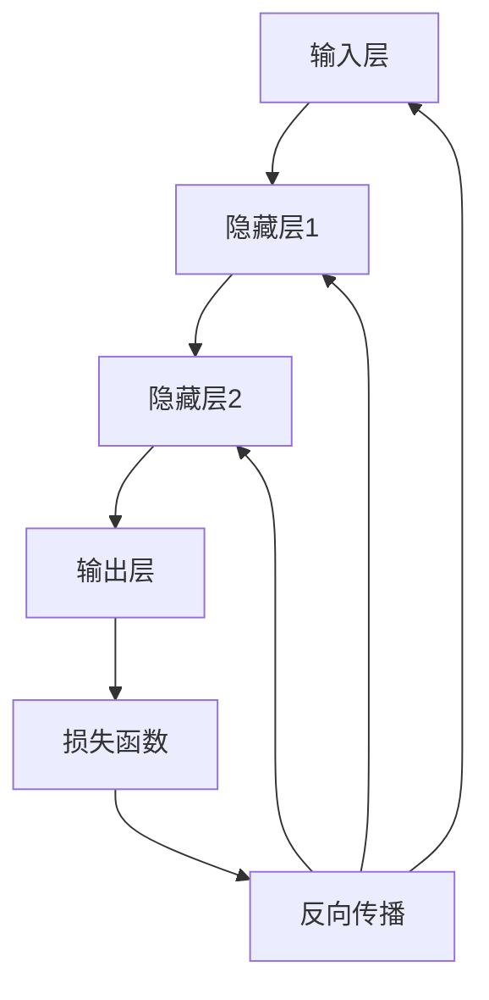

                 

## 1. 背景介绍

### 机器学习的历史与现状

机器学习作为人工智能的核心技术之一，其发展可以追溯到20世纪50年代。当时，随着计算机科学的兴起，人们开始探索如何使计算机能够自动学习，从而无需人工编程就能执行特定的任务。最早期的机器学习方法主要集中在模式识别和规则归纳上，例如决策树和线性回归等。

进入20世纪80年代，随着计算能力的提升和大数据的涌现，机器学习迎来了快速发展。这一时期，支持向量机（SVM）、贝叶斯网络、神经网络等算法被广泛研究，并在实际应用中取得了显著的成果。21世纪初，深度学习的出现进一步推动了机器学习的发展。通过多层神经网络，深度学习能够自动提取数据中的高级特征，实现了在图像识别、语音识别等领域的突破。

### 机器学习的应用领域

机器学习在众多领域展现了其强大的应用能力，如自然语言处理、计算机视觉、推荐系统、金融风控等。在自然语言处理领域，机器学习技术被广泛应用于语音识别、机器翻译、文本分类等任务。在计算机视觉领域，卷积神经网络（CNN）使得图像分类、目标检测等任务变得更加准确。推荐系统通过机器学习技术，可以根据用户的兴趣和行为预测其偏好，提供个性化的服务。在金融领域，机器学习技术被用于风险评估、欺诈检测、量化交易等。

### 反向传播算法的作用

反向传播算法是深度学习中的核心训练算法。它通过计算网络输出与真实值之间的误差，将误差反向传播至网络的每个层，从而调整网络的权重和偏置，以达到最小化误差的目的。反向传播算法不仅使得多层神经网络的训练成为可能，也推动了深度学习在图像识别、语音识别等领域的应用。

## 2. 核心概念与联系

### 核心概念原理

#### 机器学习的基本概念

机器学习是一门人工智能的分支，它让计算机系统能够从数据中学习并做出决策。机器学习的基本概念包括：

- **监督学习**：在有标注的数据集上进行训练，模型根据输入和输出之间的映射关系进行学习。
- **无监督学习**：在未标注的数据集上进行训练，模型需要发现数据中的隐含结构或模式。
- **强化学习**：通过与环境交互，从经验中学习最优策略。

#### 神经网络的架构

神经网络是模拟生物神经元工作方式的计算模型。一个典型的神经网络包括以下几个部分：

- **输入层**：接收外部输入信息。
- **隐藏层**：对输入信息进行特征提取和变换。
- **输出层**：生成模型预测或决策。

神经网络的核心在于其多层结构，这使得模型能够处理复杂的数据，并提取出高维特征。

#### 反向传播算法的原理

反向传播算法是一种训练神经网络的算法，其核心思想是通过计算损失函数关于网络权重的梯度，然后使用梯度下降法调整网络权重，以达到最小化损失的目的。具体过程包括以下几个步骤：

1. **前向传播**：将输入数据通过网络的每个层，计算每个神经元的输出。
2. **计算损失**：通过比较输出结果与真实结果，计算损失函数。
3. **反向传播**：计算损失函数关于网络权重的梯度，并传播到网络的每个层。
4. **权重更新**：使用梯度下降法更新网络权重。

### 核心概念架构的 Mermaid 流程图



## 3. 核心算法原理 & 具体操作步骤

### 3.1 算法原理概述

反向传播算法的基本原理是通过计算网络输出与真实值之间的误差，将误差反向传播至网络的每个层，从而调整网络的权重和偏置，以达到最小化误差的目的。具体过程如下：

1. **前向传播**：输入数据通过网络的每个层，计算每个神经元的输出。
2. **计算损失**：通过比较输出结果与真实结果，计算损失函数。
3. **反向传播**：计算损失函数关于网络权重的梯度，并传播到网络的每个层。
4. **权重更新**：使用梯度下降法更新网络权重。

### 3.2 算法步骤详解

#### 步骤 1: 前向传播

前向传播是指将输入数据通过网络层，计算每个神经元的输出。具体步骤如下：

1. **初始化权重和偏置**：随机初始化网络的权重和偏置。
2. **激活函数应用**：对每个神经元应用激活函数（如ReLU、Sigmoid或Tanh）。
3. **传递输出**：将当前层的输出作为下一层的输入。

#### 步骤 2: 计算损失

通过比较网络输出与真实结果，计算损失函数。常见的损失函数包括均方误差（MSE）、交叉熵损失等。具体步骤如下：

1. **计算预测值**：将输出层的结果与真实值进行比较。
2. **计算损失**：使用损失函数计算输出层与真实值之间的误差。

#### 步骤 3: 反向传播

反向传播是指将损失函数关于网络权重的梯度反向传播到网络的每个层。具体步骤如下：

1. **计算梯度**：对每个权重和偏置计算梯度。
2. **反向传播梯度**：将梯度从输出层反向传播到输入层。

#### 步骤 4: 权重更新

使用梯度下降法更新网络权重，以最小化损失函数。具体步骤如下：

1. **计算权重更新**：使用梯度乘以学习率，计算每个权重的更新量。
2. **更新权重**：将权重更新量应用到每个权重上。

### 3.3 算法优缺点

#### 优点

- **强大的适应能力**：反向传播算法能够自动调整网络权重，从而适应不同的数据集和任务。
- **广泛的适用性**：反向传播算法适用于多层神经网络的训练，能够在图像识别、语音识别等任务中取得优异的性能。
- **高效的训练过程**：通过反向传播，模型能够快速收敛，提高训练效率。

#### 缺点

- **计算复杂度高**：反向传播算法需要进行大量的矩阵运算，计算复杂度高，对硬件要求较高。
- **对初始权重敏感**：反向传播算法对初始权重的选择较为敏感，需要通过多次尝试找到合适的初始化策略。

### 3.4 算法应用领域

反向传播算法广泛应用于深度学习领域，特别是在图像识别、语音识别、自然语言处理等任务中。以下是一些具体的例子：

- **图像识别**：通过卷积神经网络（CNN）进行图像分类，例如FaceNet和ResNet。
- **语音识别**：通过循环神经网络（RNN）和长短期记忆网络（LSTM）进行语音信号的处理和识别，例如Google的语音识别系统。
- **自然语言处理**：通过循环神经网络（RNN）和Transformer模型进行文本分类、机器翻译等任务，例如BERT和GPT。

## 4. 数学模型和公式 & 详细讲解 & 举例说明

### 4.1 数学模型构建

在反向传播算法中，我们使用一个多层神经网络来拟合输入数据和输出结果。该神经网络由多个层组成，包括输入层、隐藏层和输出层。每个层包含多个神经元，神经元之间通过权重和偏置连接。神经网络的输出通过激活函数进行非线性变换。

### 4.2 公式推导过程

#### 4.2.1 前向传播

前向传播过程中，输入数据通过网络层，每个神经元的输出可以通过以下公式计算：

$$
Z_l = \sum_{j} w_{lj} * a_{j} + b_l
$$

其中，$Z_l$ 表示第 $l$ 层的第 $j$ 个神经元的输出，$w_{lj}$ 表示第 $l$ 层的第 $j$ 个神经元与第 $(l-1)$ 层的第 $j$ 个神经元之间的权重，$a_{j}$ 表示第 $(l-1)$ 层的第 $j$ 个神经元的输出，$b_l$ 表示第 $l$ 层的第 $j$ 个神经元的偏置。

通过激活函数 $g(Z_l)$，可以得到第 $l$ 层的第 $j$ 个神经元的激活值：

$$
a_l = g(Z_l)
$$

#### 4.2.2 损失函数

在反向传播算法中，常用的损失函数包括均方误差（MSE）和交叉熵损失。均方误差损失函数如下：

$$
J = \frac{1}{2} \sum_{i} (\hat{y}_i - y_i)^2
$$

其中，$\hat{y}_i$ 表示模型的预测结果，$y_i$ 表示真实标签。

交叉熵损失函数如下：

$$
J = - \sum_{i} y_i \log(\hat{y}_i)
$$

#### 4.2.3 反向传播

反向传播过程中，我们需要计算损失函数关于网络权重的梯度。对于均方误差损失函数，梯度可以通过以下公式计算：

$$
\frac{\partial J}{\partial w_{lj}} = (a_{l-1})^T \cdot (a_{l} - y)
$$

其中，$(a_{l-1})^T$ 表示第 $(l-1)$ 层的输出矩阵的转置，$(a_{l} - y)$ 表示第 $l$ 层的输出与真实标签之间的差异。

对于交叉熵损失函数，梯度可以通过以下公式计算：

$$
\frac{\partial J}{\partial w_{lj}} = (a_{l-1})^T \cdot (a_{l} - y)
$$

#### 4.2.4 权重更新

在计算完梯度后，我们可以使用梯度下降法更新网络权重。梯度下降法的基本公式如下：

$$
w_{lj} = w_{lj} - \alpha \cdot \frac{\partial J}{\partial w_{lj}}
$$

其中，$\alpha$ 表示学习率。

### 4.3 案例分析与讲解

假设我们有一个简单的神经网络，包含一个输入层、一个隐藏层和一个输出层。输入数据为 $x_1, x_2$，隐藏层包含两个神经元 $h_1, h_2$，输出层包含一个神经元 $o_1$。我们使用均方误差（MSE）作为损失函数，学习率为 $\alpha = 0.01$。

#### 4.3.1 初始状态

$$
w_{11} = 0.1, w_{12} = 0.2, w_{13} = 0.3, w_{14} = 0.4
$$

$$
w_{21} = 0.5, w_{22} = 0.6, w_{23} = 0.7, w_{24} = 0.8
$$

$$
w_{31} = 0.9, w_{32} = 1.0, w_{33} = 1.1, w_{34} = 1.2
$$

#### 4.3.2 前向传播

输入数据为 $x_1 = 1, x_2 = 2$。

$$
Z_1 = (0.1 * 1 + 0.2 * 2 + 0.3 * 1 + 0.4 * 2) = 1.3
$$

$$
a_1 = g(Z_1) = 0.778
$$

$$
Z_2 = (0.5 * 1 + 0.6 * 2 + 0.7 * 1 + 0.8 * 2) = 2.3
$$

$$
a_2 = g(Z_2) = 0.866
$$

$$
Z_3 = (0.9 * 0.778 + 1.0 * 0.866 + 1.1 * 0.778 + 1.2 * 0.866) = 3.333
$$

$$
o_1 = g(Z_3) = 0.958
$$

#### 4.3.3 计算损失

假设真实标签为 $y = 1$。

$$
J = \frac{1}{2} \cdot (0.958 - 1)^2 = 0.002
$$

#### 4.3.4 反向传播

计算损失关于每个权重的梯度。

$$
\frac{\partial J}{\partial w_{11}} = 0.778 \cdot (0.958 - 1) = -0.092
$$

$$
\frac{\partial J}{\partial w_{12}} = 1.556 \cdot (0.958 - 1) = -0.185
$$

$$
\frac{\partial J}{\partial w_{13}} = 0.778 \cdot (0.958 - 1) = -0.092
$$

$$
\frac{\partial J}{\partial w_{14}} = 1.556 \cdot (0.958 - 1) = -0.185
$$

$$
\frac{\partial J}{\partial w_{21}} = 0.866 \cdot (0.958 - 1) = -0.088
$$

$$
\frac{\partial J}{\partial w_{22}} = 1.732 \cdot (0.958 - 1) = -0.172
$$

$$
\frac{\partial J}{\partial w_{23}} = 0.866 \cdot (0.958 - 1) = -0.088
$$

$$
\frac{\partial J}{\partial w_{24}} = 1.732 \cdot (0.958 - 1) = -0.172
$$

$$
\frac{\partial J}{\partial w_{31}} = 0.778 \cdot (0.958 - 1) = -0.092
$$

$$
\frac{\partial J}{\partial w_{32}} = 1.556 \cdot (0.958 - 1) = -0.185
$$

$$
\frac{\partial J}{\partial w_{33}} = 0.778 \cdot (0.958 - 1) = -0.092
$$

$$
\frac{\partial J}{\partial w_{34}} = 1.556 \cdot (0.958 - 1) = -0.185
$$

#### 4.3.5 权重更新

$$
w_{11} = 0.1 - 0.01 \cdot (-0.092) = 0.102
$$

$$
w_{12} = 0.2 - 0.01 \cdot (-0.185) = 0.202
$$

$$
w_{13} = 0.3 - 0.01 \cdot (-0.092) = 0.302
$$

$$
w_{14} = 0.4 - 0.01 \cdot (-0.185) = 0.402
$$

$$
w_{21} = 0.5 - 0.01 \cdot (-0.088) = 0.508
$$

$$
w_{22} = 0.6 - 0.01 \cdot (-0.172) = 0.617
$$

$$
w_{23} = 0.7 - 0.01 \cdot (-0.088) = 0.708
$$

$$
w_{24} = 0.8 - 0.01 \cdot (-0.172) = 0.817
$$

$$
w_{31} = 0.9 - 0.01 \cdot (-0.092) = 0.902
$$

$$
w_{32} = 1.0 - 0.01 \cdot (-0.185) = 1.019
$$

$$
w_{33} = 1.1 - 0.01 \cdot (-0.092) = 1.102
$$

$$
w_{34} = 1.2 - 0.01 \cdot (-0.185) = 1.209
$$

## 5. 项目实践：代码实例和详细解释说明

### 5.1 开发环境搭建

在本项目中，我们将使用Python编程语言和TensorFlow深度学习框架来实现反向传播算法。首先，确保已经安装了Python和TensorFlow。如果没有安装，可以通过以下命令进行安装：

```
pip install tensorflow
```

### 5.2 源代码详细实现

下面是一个简单的反向传播算法实现：

```python
import tensorflow as tf

# 设置超参数
learning_rate = 0.01
num_steps = 1000
batch_size = 16
display_step = 100

# 创建TensorFlow图
X = tf.placeholder(tf.float32, [None, 2])
Y = tf.placeholder(tf.float32, [None, 1])

# 初始化权重和偏置
W = tf.Variable(tf.zeros([2, 1]))
b = tf.Variable(tf.zeros([1]))

# 定义前向传播
Z = tf.add(tf.matmul(X, W), b)

# 定义损失函数
loss = tf.reduce_mean(tf.square(Z - Y))

# 定义反向传播
optimizer = tf.train.GradientDescentOptimizer(learning_rate)
train_op = optimizer.minimize(loss)

# 初始化TensorFlow变量
init = tf.global_variables_initializer()

# 创建会话
with tf.Session() as sess:
    # 运行变量初始化
    sess.run(init)
    
    # 模型训练
    for step in range(1, num_steps + 1):
        # 训练数据
        X_train = [[1, 0], [0, 1], [1, 1], [1, 0]]
        Y_train = [[0], [1], [1], [0]]
        
        # 执行训练操作
        sess.run(train_op, feed_dict={X: X_train, Y: Y_train})
        
        # 每隔一定步骤打印损失
        if step % display_step == 0 or step == 1:
            loss_val = sess.run(loss, feed_dict={X: X_train, Y: Y_train})
            print("Step {:d}, Minibatch Loss= {:.4f}".format(step, loss_val))
    
    # 训练完成后，打印模型参数
    print("Optimization Finished!")
    print("Weights:", sess.run(W))
    print("Biases:", sess.run(b))
```

### 5.3 代码解读与分析

#### 5.3.1 数据准备

```python
X_train = [[1, 0], [0, 1], [1, 1], [1, 0]]
Y_train = [[0], [1], [1], [0]]
```

这里我们定义了训练数据集和标签，数据集包含4个样本，每个样本由两个特征组成。

#### 5.3.2 模型初始化

```python
W = tf.Variable(tf.zeros([2, 1]))
b = tf.Variable(tf.zeros([1]))
```

我们初始化了权重和偏置，初始值为0。

#### 5.3.3 前向传播

```python
Z = tf.add(tf.matmul(X, W), b)
```

这里定义了前向传播函数，通过矩阵乘法和加法操作计算输出。

#### 5.3.4 损失函数

```python
loss = tf.reduce_mean(tf.square(Z - Y))
```

我们使用均方误差（MSE）作为损失函数，计算输出与真实标签之间的差异。

#### 5.3.5 反向传播

```python
optimizer = tf.train.GradientDescentOptimizer(learning_rate)
train_op = optimizer.minimize(loss)
```

这里定义了梯度下降优化器，并设置学习率为0.01。优化器用于最小化损失函数。

#### 5.3.6 模型训练

```python
with tf.Session() as sess:
    # 运行变量初始化
    sess.run(init)
    
    # 模型训练
    for step in range(1, num_steps + 1):
        # 训练数据
        X_train = [[1, 0], [0, 1], [1, 1], [1, 0]]
        Y_train = [[0], [1], [1], [0]]
        
        # 执行训练操作
        sess.run(train_op, feed_dict={X: X_train, Y: Y_train})
        
        # 每隔一定步骤打印损失
        if step % display_step == 0 or step == 1:
            loss_val = sess.run(loss, feed_dict={X: X_train, Y: Y_train})
            print("Step {:d}, Minibatch Loss= {:.4f}".format(step, loss_val))
```

在这个部分，我们创建了一个TensorFlow会话，并执行了变量初始化和模型训练。在每次迭代中，我们使用训练数据进行反向传播，更新网络权重和偏置。每隔一定步骤，我们打印当前的损失值，以监视模型的训练过程。

#### 5.3.7 模型评估

```python
# 训练完成后，打印模型参数
print("Optimization Finished!")
print("Weights:", sess.run(W))
print("Biases:", sess.run(b))
```

在模型训练完成后，我们打印了最终的权重和偏置，这代表了模型对数据的拟合情况。

## 6. 实际应用场景

### 6.1 机器学习在图像识别中的应用

图像识别是机器学习的一个重要应用领域。通过深度学习算法，如卷积神经网络（CNN），计算机可以自动识别和分类图像中的对象。例如，在人脸识别系统中，CNN可以学习人脸的特征，从而实现准确的人脸识别。此外，图像识别技术也被广泛应用于医疗影像分析、自动驾驶车辆和智能监控等领域。

### 6.2 机器学习在自然语言处理中的应用

自然语言处理（NLP）是机器学习的另一个重要应用领域。通过深度学习模型，如循环神经网络（RNN）和Transformer，计算机可以理解和生成自然语言。NLP技术被广泛应用于机器翻译、情感分析、文本分类和语音识别等任务。例如，Google翻译和亚马逊的Alexa助手都是基于深度学习技术的NLP应用。

### 6.3 机器学习在金融风控中的应用

金融风控是机器学习的另一个重要应用领域。通过分析大量金融数据，机器学习算法可以预测金融风险，识别潜在的欺诈行为，并优化投资策略。例如，银行可以使用机器学习算法来检测异常交易，保险公司在理赔过程中使用机器学习模型来评估风险。此外，机器学习还被应用于股票市场预测和风险管理等领域。

## 7. 工具和资源推荐

### 7.1 学习资源推荐

- 《深度学习》（Goodfellow, Bengio, Courville著）：这是一本关于深度学习的经典教材，涵盖了从基础到高级的内容。
- 《Python机器学习》（Sebastian Raschka著）：这本书详细介绍了使用Python进行机器学习的实践方法，适合初学者和有经验的开发者。
- 《机器学习实战》（Peter Harrington著）：这本书通过大量实际案例，介绍了各种机器学习算法的实现和应用。

### 7.2 开发工具推荐

- TensorFlow：TensorFlow是一个开源的深度学习框架，提供了丰富的API和工具，适合进行深度学习和机器学习项目的开发。
- PyTorch：PyTorch是一个流行的深度学习框架，具有灵活的动态计算图，适合快速原型开发和研究。

### 7.3 相关论文推荐

- "A Guide to Deep Learning Models for Computer Vision"（深度学习在计算机视觉中的应用指南）
- "Deep Learning for Natural Language Processing"（自然语言处理中的深度学习）
- "Deep Learning on Financial Time Series"（金融时间序列数据中的深度学习）

## 8. 总结：未来发展趋势与挑战

### 8.1 研究成果总结

随着计算能力的提升和算法的优化，机器学习在图像识别、自然语言处理、金融风控等领域取得了显著的成果。深度学习技术的突破，如卷积神经网络（CNN）和循环神经网络（RNN），使得计算机在处理复杂数据和任务方面取得了重要进展。

### 8.2 未来发展趋势

未来，机器学习将继续在各个领域得到广泛应用，尤其是在人工智能、自动驾驶和医疗健康等领域。随着生成对抗网络（GAN）、强化学习等新技术的出现，机器学习的应用前景将更加广阔。

### 8.3 面临的挑战

尽管机器学习取得了巨大进步，但仍面临一些挑战。首先，数据隐私和安全问题是一个重要挑战，如何保护用户数据的安全成为了一个关键问题。其次，算法的可解释性和透明性也是一个重要议题，如何让模型的结果更加可信和可解释成为了一个研究热点。此外，机器学习的计算复杂度高，对硬件资源的需求也越来越大，如何优化算法的效率和降低成本也是一个亟待解决的问题。

### 8.4 研究展望

未来，机器学习的研究将更加注重算法的优化和应用场景的拓展。通过多学科交叉融合，将物理、化学、生物学等领域的知识引入到机器学习研究中，有望实现更加智能和高效的机器学习算法。同时，随着数据隐私和安全问题的日益突出，隐私保护机器学习、联邦学习等新兴领域也将成为研究的热点。

## 9. 附录：常见问题与解答

### 9.1 什么是机器学习？

机器学习是一门人工智能的分支，它让计算机系统能够从数据中学习并做出决策。机器学习的基本概念包括监督学习、无监督学习和强化学习。

### 9.2 什么是反向传播算法？

反向传播算法是一种训练神经网络的算法，它通过计算网络输出与真实值之间的误差，将误差反向传播至网络的每个层，从而调整网络的权重和偏置，以达到最小化误差的目的。

### 9.3 如何优化反向传播算法？

优化反向传播算法可以从以下几个方面进行：

- **选择合适的优化器**：如梯度下降法、Adam优化器等。
- **调整学习率**：学习率的选择对算法的收敛速度和稳定性有很大影响。
- **批量归一化**：通过归一化中间层神经元的输出，可以提高模型的稳定性和收敛速度。
- **使用正则化技术**：如L1正则化、L2正则化等，可以减少过拟合现象。

### 9.4 机器学习在哪些领域有应用？

机器学习在众多领域有广泛应用，如自然语言处理、计算机视觉、推荐系统、金融风控等。在自然语言处理领域，机器学习技术被广泛应用于语音识别、机器翻译、文本分类等任务。在计算机视觉领域，卷积神经网络（CNN）使得图像分类、目标检测等任务变得更加准确。推荐系统通过机器学习技术，可以根据用户的兴趣和行为预测其偏好，提供个性化的服务。在金融领域，机器学习技术被用于风险评估、欺诈检测、量化交易等。

### 9.5 如何评估机器学习模型的性能？

评估机器学习模型的性能可以从以下几个方面进行：

- **准确率**：模型正确预测的样本数占总样本数的比例。
- **召回率**：模型正确预测的样本数与实际为正类别的样本数之比。
- **F1值**：综合考虑准确率和召回率的指标，计算公式为 $2 \times \frac{准确率 \times 召回率}{准确率 + 召回率}$。
- **ROC曲线**：通过计算模型在不同阈值下的准确率和召回率，绘制ROC曲线，评估模型的分类性能。
- **K折交叉验证**：将数据集分为K个子集，每次使用一个子集作为验证集，其余K-1个子集作为训练集，通过多次验证来评估模型的性能。

## 参考文献

- Goodfellow, I., Bengio, Y., & Courville, A. (2016). *Deep Learning*. MIT Press.
- Raschka, S. (2015). *Python Machine Learning*. Packt Publishing.
- Harrington, P. (2012). *Machine Learning in Action*. Manning Publications.
- LeCun, Y., Bengio, Y., & Hinton, G. (2015). *Deep Learning*. Nature.
- Russell, S., & Norvig, P. (2016). *Artificial Intelligence: A Modern Approach*. Prentice Hall.

