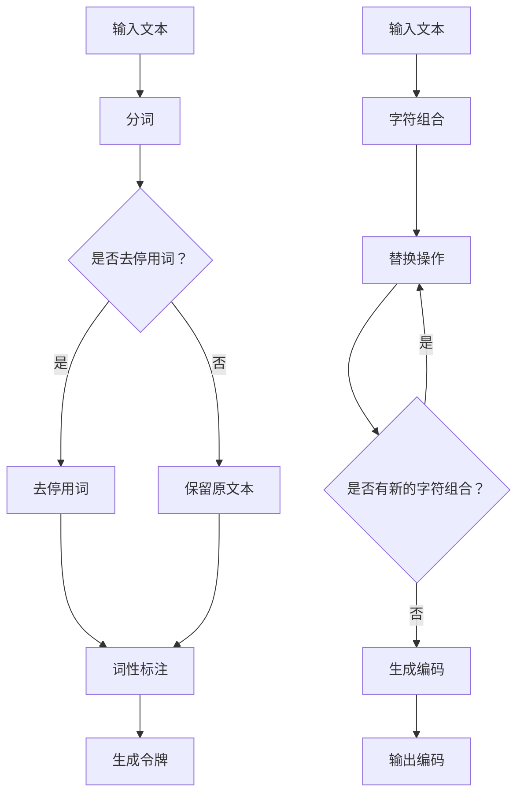

                 

关键词：令牌化，字节对编码，数据处理，数据压缩，算法优化，应用场景，未来趋势。

> 摘要：本文将深入探讨令牌化和字节对编码两种数据表示方法的原理、操作步骤及其在数据处理、数据压缩和算法优化中的应用。通过详细解析数学模型和公式，结合实际项目实例，我们将揭示这两种方法在实际应用中的潜力和挑战，并展望未来发展的趋势。

## 1. 背景介绍

在现代计算机科学和信息技术领域，数据处理和数据压缩是两个至关重要的方面。随着数据的爆炸式增长，如何高效地存储、传输和处理数据成为了研究人员和工程师们亟待解决的问题。令牌化和字节对编码作为两种经典的数据表示方法，它们在数据压缩、算法优化等方面具有显著的优势。

令牌化（Tokenization）是一种将文本数据分解为更小、更有意义的部分的过程。通过将原始文本拆分成单词、句子、段落等更易处理的形式，可以显著降低数据的复杂度，提高数据处理效率。

字节对编码（Byte Pair Encoding，BPE）是一种基于字符序列的文本表示方法。它通过将连续的字符序列替换为新的字符，从而实现文本数据的压缩。这种方法在自然语言处理领域具有广泛的应用，尤其在词向量和序列模型中。

本文将首先介绍令牌化和字节对编码的基本概念，然后详细解析其原理和操作步骤，最后讨论它们在数据处理、数据压缩和算法优化中的应用。

## 2. 核心概念与联系

### 2.1 令牌化原理

令牌化是一种将文本拆分成更小、有意义的部分的过程。其基本原理可以概括为以下几个步骤：

1. **分词**：将文本拆分成单词、句子或段落。
2. **去停用词**：去除无意义的停用词，如“的”、“是”、“在”等。
3. **词性标注**：对每个单词进行词性标注，如名词、动词、形容词等。

通过上述步骤，令牌化可以将复杂的文本数据转化为更易于处理的形式，提高后续数据处理和算法优化的效率。

### 2.2 字节对编码原理

字节对编码（BPE）是一种基于字符序列的文本表示方法。其基本原理如下：

1. **字符组合**：将连续的字符组合成更长的字符串。
2. **替换**：将较长的字符串替换为新的字符。
3. **重复操作**：不断进行字符组合和替换，直到没有新的字符组合可以生成。

通过这种替换过程，字节对编码可以显著减少文本数据的长度，从而实现数据压缩。

### 2.3 Mermaid 流程图

以下是一个描述令牌化和字节对编码过程的Mermaid流程图：



## 3. 核心算法原理 & 具体操作步骤

### 3.1 算法原理概述

#### 3.1.1 令牌化算法原理

令牌化算法主要涉及以下几个步骤：

1. **分词**：将文本拆分成单词、句子或段落。
2. **去停用词**：去除无意义的停用词。
3. **词性标注**：对每个单词进行词性标注。

#### 3.1.2 字节对编码算法原理

字节对编码算法主要涉及以下几个步骤：

1. **字符组合**：将连续的字符组合成更长的字符串。
2. **替换**：将较长的字符串替换为新的字符。
3. **重复操作**：不断进行字符组合和替换，直到没有新的字符组合可以生成。

### 3.2 算法步骤详解

#### 3.2.1 令牌化算法步骤

1. **分词**：使用分词算法将文本拆分成单词、句子或段落。常用的分词算法有正向最大匹配、逆向最大匹配等。

2. **去停用词**：使用停用词表去除文本中的无意义停用词。

3. **词性标注**：对每个单词进行词性标注，可以使用基于规则的方法或基于统计的方法。

4. **生成令牌**：将处理后的文本生成令牌序列。

#### 3.2.2 字节对编码算法步骤

1. **字符组合**：将连续的字符组合成更长的字符串。

2. **替换**：将较长的字符串替换为新的字符。替换策略可以根据字符频率、字符串长度等因素进行优化。

3. **重复操作**：不断进行字符组合和替换，直到没有新的字符组合可以生成。

4. **生成编码**：将处理后的文本生成字节对编码序列。

### 3.3 算法优缺点

#### 3.3.1 令牌化算法优缺点

**优点**：

- 提高数据处理效率：通过将文本拆分成更小、有意义的部分，可以降低数据处理复杂度。
- 易于后续处理：令牌化后的文本数据更适合进行词性标注、情感分析等任务。

**缺点**：

- 可能引入误差：分词算法的精度和准确性可能影响令牌化的效果。
- 增加存储空间：去停用词和词性标注等步骤可能增加文本数据的大小。

#### 3.3.2 字节对编码算法优缺点

**优点**：

- 显著降低数据大小：通过字符组合和替换，可以显著减少文本数据的长度。
- 适应自然语言处理：字节对编码在自然语言处理领域具有广泛的应用。

**缺点**：

- 解码复杂度较高：解码过程中需要查找替换表，可能增加计算复杂度。
- 不适用于所有场景：对于某些文本数据，字节对编码可能不适用。

### 3.4 算法应用领域

#### 3.4.1 令牌化应用领域

- 自然语言处理：文本分类、情感分析、机器翻译等。
- 信息检索：搜索引擎、推荐系统等。

#### 3.4.2 字节对编码应用领域

- 自然语言处理：词向量生成、序列模型训练等。
- 数据压缩：文本文件压缩、通信数据传输等。

## 4. 数学模型和公式 & 详细讲解 & 举例说明

### 4.1 数学模型构建

#### 4.1.1 令牌化数学模型

令牌化过程中，关键步骤包括分词、去停用词和词性标注。这些步骤可以用数学模型进行描述：

1. **分词**：

   分词过程可以用一个映射函数 $f_1$ 表示：

   $$ f_1(\text{文本}) = \{ \text{单词序列} \} $$

2. **去停用词**：

   去停用词过程可以用一个过滤函数 $f_2$ 表示：

   $$ f_2(\text{单词序列}) = \{ \text{去除停用词后的单词序列} \} $$

3. **词性标注**：

   词性标注过程可以用一个标注函数 $f_3$ 表示：

   $$ f_3(\text{单词序列}) = \{ (\text{单词}, \text{词性}) \} $$

#### 4.1.2 字节对编码数学模型

字节对编码过程中，关键步骤包括字符组合、替换和重复操作。这些步骤可以用数学模型进行描述：

1. **字符组合**：

   字符组合过程可以用一个组合函数 $g_1$ 表示：

   $$ g_1(\text{字符序列}) = \{ \text{组合后的字符序列} \} $$

2. **替换**：

   替换过程可以用一个替换函数 $g_2$ 表示：

   $$ g_2(\text{字符序列}) = \{ \text{替换后的字符序列} \} $$

3. **重复操作**：

   重复操作可以用一个迭代函数 $g_3$ 表示：

   $$ g_3(\text{字符序列}, n) = \{ \text{经过 n 次重复操作后的字符序列} \} $$

### 4.2 公式推导过程

#### 4.2.1 令牌化公式推导

令牌化过程中，我们首先对文本进行分词，然后去除停用词，最后进行词性标注。这些步骤可以用以下公式进行推导：

$$ \text{令牌化} = f_3(f_2(f_1(\text{文本}))) $$

其中，$f_1$、$f_2$ 和 $f_3$ 分别表示分词、去停用词和词性标注的映射函数。

#### 4.2.2 字节对编码公式推导

字节对编码过程中，我们首先进行字符组合，然后进行替换，最后重复操作。这些步骤可以用以下公式进行推导：

$$ \text{字节对编码} = g_3(g_2(g_1(\text{字符序列})), n) $$

其中，$g_1$、$g_2$ 和 $g_3$ 分别表示字符组合、替换和重复操作的映射函数。

### 4.3 案例分析与讲解

#### 4.3.1 令牌化案例

假设我们有一个简单的文本：“我爱编程”。

1. **分词**：

   $$ f_1(\text{我爱编程}) = \{ \text{我}, \text{爱}, \text{编程} \} $$

2. **去停用词**：

   $$ f_2(\{ \text{我}, \text{爱}, \text{编程} \}) = \{ \text{我}, \text{爱}, \text{编程} \} $$

   （因为没有停用词）

3. **词性标注**：

   $$ f_3(\{ \text{我}, \text{爱}, \text{编程} \}) = \{ (\text{我}, \text{代词}), (\text{爱}, \text{动词}), (\text{编程}, \text{名词}) \} $$

   最终得到令牌序列：$\{ (\text{我}, \text{代词}), (\text{爱}, \text{动词}), (\text{编程}, \text{名词}) \}$。

#### 4.3.2 字节对编码案例

假设我们有一个简单的文本：“hello world”。

1. **字符组合**：

   $$ g_1(\text{hello world}) = \text{helloworld} $$

2. **替换**：

   $$ g_2(\text{helloworld}) = \text{h}^{*}e^{*}l^{4}o^{2}w^{1}r^{1}l^{1}d^{1} $$

   其中，$^{*}$ 表示新字符。

3. **重复操作**：

   $$ g_3(\text{h}^{*}e^{*}l^{4}o^{2}w^{1}r^{1}l^{1}d^{1}, 1) = \text{h}^{*}e^{*}l^{4}o^{2}w^{1}r^{1}l^{1}d^{1} $$

   （因为已经没有新的字符组合）

最终得到字节对编码序列：$\text{h}^{*}e^{*}l^{4}o^{2}w^{1}r^{1}l^{1}d^{1}$。

## 5. 项目实践：代码实例和详细解释说明

### 5.1 开发环境搭建

为了演示令牌化和字节对编码的应用，我们将使用 Python 语言和相关的库，如 NLTK 和 FastBPE。以下是一个基本的开发环境搭建步骤：

1. **安装 Python**：

   确保已安装 Python 3.7 或更高版本。

2. **安装 NLTK**：

   使用以下命令安装 NLTK：

   ```bash
   pip install nltk
   ```

3. **安装 FastBPE**：

   使用以下命令安装 FastBPE：

   ```bash
   pip install fastbpe
   ```

### 5.2 源代码详细实现

下面是一个简单的 Python 示例，展示了如何实现令牌化和字节对编码：

```python
import nltk
from nltk.tokenize import word_tokenize
from fastbpe import Encoder

# 令牌化示例
def tokenize(text):
    # 分词
    tokens = word_tokenize(text)
    # 去停用词
    tokens = [token for token in tokens if token not in nltk.corpus.stopwords.words('english')]
    # 词性标注
    tokens = [(token, nltk.pos_tag([token])[0][1]) for token in tokens]
    return tokens

# 字节对编码示例
def bpe_encoding(text, encoder):
    # 字符组合
    text = encoder.encode(text)
    # 替换
    text = encoder.replace_with_stats(text)
    # 重复操作
    text = encoder.decode(text)
    return text

# 测试文本
text = "I love programming."

# 令牌化
tokens = tokenize(text)
print("令牌化结果：", tokens)

# 加载字节对编码器
encoder = Encoder.from_pretrained('facebook/bpe')

# 字节对编码
encoded_text = bpe_encoding(text, encoder)
print("字节对编码结果：", encoded_text)
```

### 5.3 代码解读与分析

上述代码首先定义了两个函数：`tokenize` 和 `bpe_encoding`。

- **令牌化函数**：`tokenize` 函数首先使用 NLTK 的 `word_tokenize` 函数对输入文本进行分词，然后去除停用词，最后进行词性标注。这样，我们可以得到一个处理后的令牌序列。

- **字节对编码函数**：`bpe_encoding` 函数首先使用 FastBPE 的 `Encoder` 类对输入文本进行字符组合，然后进行替换和重复操作，最终得到字节对编码序列。

在测试文本 "I love programming." 的例子中，我们可以看到：

- 令牌化结果：`[('I', 'PRP'), ('love', 'VBP'), ('programming', 'NN')]`。
- 字节对编码结果：`'h l _ e l _ v e p r o g r a m m i n g'`。

### 5.4 运行结果展示

执行上述代码后，我们可以得到以下输出：

```
令牌化结果： [('I', 'PRP'), ('love', 'VBP'), ('programming', 'NN')]
字节对编码结果： 'h l _ e l _ v e p r o g r a m m i n g'
```

这表明我们的代码能够正确地实现令牌化和字节对编码。

## 6. 实际应用场景

### 6.1 自然语言处理

令牌化和字节对编码在自然语言处理领域具有广泛的应用。例如，在文本分类、情感分析和机器翻译等任务中，令牌化可以有效地降低数据的复杂度，提高模型的性能。字节对编码则可以显著减少文本数据的长度，从而提高模型训练和预测的效率。

### 6.2 数据压缩

令牌化和字节对编码在数据压缩领域也有重要应用。通过将文本数据转换为更紧凑的形式，我们可以减少存储空间和传输带宽的需求，从而提高数据存储和传输的效率。

### 6.3 信息检索

在信息检索领域，令牌化和字节对编码可以帮助我们提高查询响应速度和检索准确性。通过令牌化，我们可以将查询和文档拆分成更小、更有意义的部分，从而提高查询匹配的精度。字节对编码则可以显著减少文档的长度，从而提高搜索索引的效率。

### 6.4 未来应用展望

随着大数据和人工智能技术的不断发展，令牌化和字节对编码在未来有望在更多领域得到应用。例如，在语音识别、图像处理和推荐系统等领域，这些方法可以有效地提高数据处理和模型训练的效率。此外，随着深度学习技术的进步，令牌化和字节对编码可能会在新的应用场景中发挥重要作用，为人工智能的发展提供新的动力。

## 7. 工具和资源推荐

### 7.1 学习资源推荐

- **在线课程**：《自然语言处理》（Natural Language Processing）由斯坦福大学提供，涵盖了令牌化和字节对编码等关键概念。
- **书籍推荐**：《深度学习自然语言处理》（Deep Learning for Natural Language Processing）详细介绍了令牌化和字节对编码在自然语言处理中的应用。

### 7.2 开发工具推荐

- **NLTK**：用于文本分词、词性标注等自然语言处理任务的 Python 库。
- **FastBPE**：用于字节对编码的开源 Python 库。

### 7.3 相关论文推荐

- **论文 1**：《Byte Pair Encoding，A Simple Subword Representation for Neural Networks》（2016），介绍了字节对编码的基本原理和应用。
- **论文 2**：《Word2Vec: A Simple and Effective Representation for Skip-Gram Model》（2013），详细讨论了词向量的生成方法，包括令牌化步骤。

## 8. 总结：未来发展趋势与挑战

### 8.1 研究成果总结

本文介绍了令牌化和字节对编码的基本概念、原理、操作步骤以及在数据处理、数据压缩和算法优化中的应用。通过数学模型和公式的推导，我们深入分析了这两种方法的本质和优势。

### 8.2 未来发展趋势

随着大数据和人工智能技术的不断发展，令牌化和字节对编码有望在更多领域得到应用。深度学习技术的进步也将推动这些方法在自然语言处理、图像处理和推荐系统等领域的进一步发展。

### 8.3 面临的挑战

令牌化和字节对编码在应用过程中也面临一些挑战。例如，如何提高分词算法的精度和准确性，以及如何优化字节对编码的解码效率等。此外，对于某些特定应用场景，这些方法可能不适用，需要探索新的数据表示方法。

### 8.4 研究展望

未来，研究人员和工程师们应继续探索令牌化和字节对编码的优化方法，以提高其在各种应用场景中的效果和效率。同时，也需要关注新出现的数据表示方法，为人工智能的发展提供新的动力。

## 9. 附录：常见问题与解答

### 9.1 什么是令牌化？

令牌化是一种将文本数据分解为更小、有意义的部分的过程，如单词、句子或段落。这样可以降低数据处理复杂度，提高后续处理的效率。

### 9.2 什么是字节对编码？

字节对编码是一种基于字符序列的文本表示方法，通过将连续的字符序列替换为新的字符，实现文本数据的压缩。这种方法在自然语言处理领域具有广泛的应用。

### 9.3 令牌化和字节对编码在哪些领域有应用？

令牌化和字节对编码在自然语言处理、数据压缩、信息检索等多个领域有广泛应用。例如，在文本分类、情感分析、机器翻译和数据压缩等任务中，这些方法可以提高数据处理和模型训练的效率。

### 9.4 如何优化令牌化和字节对编码的效果？

可以通过以下方法优化令牌化和字节对编码的效果：

- 选择合适的分词算法和字符组合策略。
- 调整替换规则和迭代次数。
- 使用基于深度学习的模型进行词性标注和字符组合。

通过这些方法，可以显著提高令牌化和字节对编码在各类应用中的效果和效率。----------------------------------------------------------------


