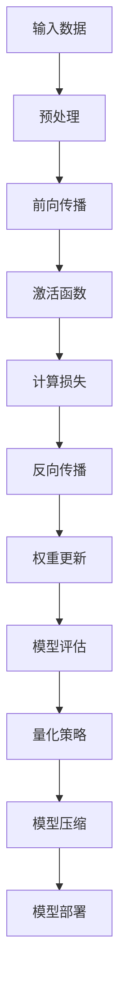

                 

关键词：模型量化、模型压缩、深度学习、神经网络、算法优化

摘要：在深度学习和人工智能领域，随着模型的复杂度不断增加，模型大小和计算资源的需求也在日益增加。本文将探讨模型量化的概念、重要性，以及模型压缩的相关技术和方法。我们将深入分析量化过程、算法优化策略，并探讨其在实际应用中的效果和挑战。

## 1. 背景介绍

深度学习和神经网络在图像识别、自然语言处理、推荐系统等领域取得了显著的成就。然而，随着模型复杂度的增加，模型的大小和计算资源的需求也在快速攀升。这导致了以下问题：

- **存储需求增大**：大型模型可能需要数十GB甚至TB级别的存储空间。
- **计算资源消耗**：大型模型在训练和推理阶段需要大量的计算资源，这导致了训练时间的延长和推理速度的降低。
- **设备兼容性问题**：对于移动设备和嵌入式系统等硬件资源有限的场景，大型模型可能无法部署。

为了解决上述问题，模型压缩成为了一个重要的研究方向。通过模型压缩，可以减小模型的大小、降低计算复杂度，从而提高模型在资源受限环境中的性能。模型量化是实现模型压缩的一种有效方法。

### 1.1 模型量化的定义和目的

模型量化是指将深度学习模型中的权重和激活值从浮点数表示转换为低精度数值表示的过程。这种转换通常会导致模型参数数量的减少，从而实现模型压缩。模型量化的目的是在保证模型性能不受显著影响的前提下，减小模型大小和计算资源的需求。

### 1.2 模型压缩的重要性

- **减小存储需求**：量化后的模型通常需要更少的存储空间，这对于移动设备和嵌入式系统等存储资源有限的场景尤为重要。
- **加速推理过程**：量化后的模型通常具有更低的计算复杂度，这可以显著提高模型在推理阶段的速度。
- **提高兼容性**：量化后的模型可以在资源受限的硬件上运行，从而扩展了深度学习和人工智能的应用场景。

## 2. 核心概念与联系

为了深入理解模型量化和模型压缩，我们首先需要介绍一些核心概念，包括深度学习模型的基本结构、量化策略、压缩算法等。

### 2.1 深度学习模型的基本结构

深度学习模型通常由多层神经网络组成，包括输入层、隐藏层和输出层。每一层都包含多个神经元，神经元之间通过权重和偏置进行连接。模型的输出通常通过激活函数进行处理，以获得最终的结果。


### 2.2 量化策略

量化策略是指如何将浮点数表示的权重和激活值转换为低精度数值表示的过程。常见的量化策略包括：

- **全精度量化**：保持模型的全精度数值表示，不进行量化。
- **二值量化**：将浮点数转换为0和1的二值表示。
- **低精度量化**：将浮点数转换为固定精度的数值表示，如8位或16位整数。

### 2.3 压缩算法

压缩算法是指如何将模型进行压缩以减少其大小和计算复杂度的方法。常见的压缩算法包括：

- **权重共享**：通过共享不同层之间的权重来减少模型参数的数量。
- **剪枝**：通过去除模型中不重要的权重来减少模型参数的数量。
- **量化**：通过量化权重和激活值来减少模型参数的数量。

### 2.4 Mermaid 流程图

以下是一个用于描述模型量化过程的Mermaid流程图：



## 3. 核心算法原理 & 具体操作步骤

### 3.1 算法原理概述

模型量化是一种通过降低模型参数的精度来减小模型大小和计算复杂度的方法。具体来说，模型量化涉及以下步骤：

1. **数据预处理**：对输入数据进行标准化和归一化处理，以便于量化。
2. **量化策略选择**：选择合适的量化策略，如二值量化、低精度量化等。
3. **权重量化**：将模型的权重从浮点数表示转换为低精度数值表示。
4. **激活量化**：将模型的激活值从浮点数表示转换为低精度数值表示。
5. **模型压缩**：通过量化后的模型参数进行模型压缩。
6. **模型评估**：评估量化后的模型性能，以确保模型性能不受显著影响。
7. **模型部署**：将量化后的模型部署到目标设备上进行推理。

### 3.2 算法步骤详解

#### 3.2.1 数据预处理

数据预处理是模型量化的重要步骤，它涉及以下操作：

- **标准化**：将输入数据的每个特征缩放到0到1之间。
- **归一化**：将输入数据的每个特征缩放到具有相同的均值和方差。

#### 3.2.2 量化策略选择

量化策略选择是模型量化的核心步骤，它涉及以下操作：

- **二值量化**：将浮点数转换为0和1的二值表示。
- **低精度量化**：将浮点数转换为固定精度的数值表示，如8位或16位整数。

#### 3.2.3 权重量化

权重量化是将模型的权重从浮点数表示转换为低精度数值表示的过程。具体步骤如下：

1. **计算量化范围**：计算每个权重的最小值和最大值。
2. **确定量化精度**：根据模型的要求和硬件的限制，确定量化精度。
3. **量化权重**：将每个权重映射到量化后的数值表示。

#### 3.2.4 激活量化

激活量化是将模型的激活值从浮点数表示转换为低精度数值表示的过程。具体步骤如下：

1. **计算量化范围**：计算每个激活值的最小值和最大值。
2. **确定量化精度**：根据模型的要求和硬件的限制，确定量化精度。
3. **量化激活值**：将每个激活值映射到量化后的数值表示。

#### 3.2.5 模型压缩

模型压缩是通过量化后的模型参数进行模型压缩的过程。具体步骤如下：

1. **去除冗余参数**：通过剪枝和权重共享等方法去除冗余参数。
2. **重排序参数**：根据模型的拓扑结构重排序参数，以便于压缩和部署。

#### 3.2.6 模型评估

模型评估是评估量化后的模型性能的重要步骤。具体步骤如下：

1. **测试集评估**：在测试集上评估量化后的模型性能。
2. **性能比较**：将量化后的模型性能与原始模型性能进行比较。

#### 3.2.7 模型部署

模型部署是将量化后的模型部署到目标设备上进行推理的过程。具体步骤如下：

1. **模型转换**：将量化后的模型转换为目标设备的格式。
2. **推理**：在目标设备上运行量化后的模型进行推理。

### 3.3 算法优缺点

#### 3.3.1 优点

- **减小模型大小**：量化后的模型通常需要更少的存储空间，从而减小了模型大小。
- **降低计算复杂度**：量化后的模型通常具有更低的计算复杂度，从而降低了计算资源的消耗。
- **提高兼容性**：量化后的模型可以在资源受限的硬件上运行，从而提高了模型的兼容性。

#### 3.3.2 缺点

- **精度损失**：量化后的模型可能会导致一定的精度损失，从而可能影响模型性能。
- **训练成本增加**：量化后的模型可能需要重新训练，从而增加了训练成本。
- **硬件兼容性问题**：某些量化策略可能不适用于所有硬件平台，从而可能引起硬件兼容性问题。

### 3.4 算法应用领域

模型量化在多个领域都有广泛的应用，包括：

- **移动设备**：移动设备通常具有有限的存储和计算资源，模型量化可以帮助优化模型在移动设备上的部署和性能。
- **嵌入式系统**：嵌入式系统通常具有有限的计算资源，模型量化可以帮助优化模型在嵌入式系统上的部署和性能。
- **物联网**：物联网设备通常具有有限的存储和计算资源，模型量化可以帮助优化模型在物联网设备上的部署和性能。

## 4. 数学模型和公式 & 详细讲解 & 举例说明

### 4.1 数学模型构建

模型量化涉及多个数学模型，包括权重量化模型和激活量化模型。以下是一个简化的权重量化模型的数学表示：

$$
w_{quant} = \sigma(w_{float} \cdot \alpha)
$$

其中，$w_{float}$表示原始权重，$w_{quant}$表示量化后的权重，$\alpha$表示量化因子，$\sigma$表示量化函数。

### 4.2 公式推导过程

量化因子的选择是模型量化中的关键步骤。以下是一个简化的量化因子推导过程：

1. **计算最小值和最大值**：计算原始权重$w_{float}$的最小值$\min(w_{float})$和最大值$\max(w_{float})$。
2. **确定量化范围**：根据模型的要求和硬件的限制，确定量化范围$[0, Q]$，其中$Q$表示量化精度。
3. **计算量化因子**：计算量化因子$\alpha$，使得量化后的权重$w_{quant}$在量化范围内：
   $$
   \alpha = \frac{Q}{\max(w_{float}) - \min(w_{float})}
   $$
4. **量化权重**：将原始权重$w_{float}$映射到量化后的权重$w_{quant}$：
   $$
   w_{quant} = \sigma(w_{float} \cdot \alpha)
   $$
其中，$\sigma$表示量化函数，通常采用线性量化函数或阶梯量化函数。

### 4.3 案例分析与讲解

以下是一个简单的案例，说明如何对权重进行量化。

#### 案例描述

假设有一个神经网络，其权重$w_{float}$的取值范围为$[-10, 10]$。我们希望将权重量化为8位整数，即量化范围为$[0, 255]$。

#### 步骤

1. **计算量化因子**：
   $$
   \alpha = \frac{255}{10 - (-10)} = \frac{255}{20} = 12.75
   $$
2. **量化权重**：
   - 对于权重$w_{float} = -10$，量化后的权重为：
     $$
     w_{quant} = \sigma(-10 \cdot 12.75) = \sigma(-127.5) = 0
     $$
   - 对于权重$w_{float} = 10$，量化后的权重为：
     $$
     w_{quant} = \sigma(10 \cdot 12.75) = \sigma(127.5) = 255
     $$

#### 结果

量化后的权重范围为$[0, 255]$，每个权重的取值均为整数。通过这种方式，我们可以将原始的浮点数权重转换为低精度整数表示，从而实现模型量化。

## 5. 项目实践：代码实例和详细解释说明

### 5.1 开发环境搭建

在进行模型量化之前，我们需要搭建一个合适的开发环境。以下是一个基本的开发环境搭建步骤：

1. **安装Python环境**：确保安装了Python 3.6或更高版本。
2. **安装深度学习框架**：我们选择使用TensorFlow作为深度学习框架。安装TensorFlow可以通过以下命令完成：
   ```
   pip install tensorflow
   ```
3. **安装量化工具**：我们选择使用TensorFlow的Quantization API进行模型量化。安装Quantization API可以通过以下命令完成：
   ```
   pip install tensorflow-addons
   ```

### 5.2 源代码详细实现

以下是一个简单的示例，演示如何使用TensorFlow的Quantization API对神经网络进行量化。

```python
import tensorflow as tf
from tensorflow.keras.models import Sequential
from tensorflow.keras.layers import Dense

# 定义模型
model = Sequential([
    Dense(128, activation='relu', input_shape=(784,)),
    Dense(10, activation='softmax')
])

# 编译模型
model.compile(optimizer='adam', loss='categorical_crossentropy', metrics=['accuracy'])

# 准备数据
(x_train, y_train), (x_test, y_test) = tf.keras.datasets.mnist.load_data()
x_train = x_train.astype('float32') / 255
y_train = tf.keras.utils.to_categorical(y_train, 10)

# 对模型进行量化
quantized_model = tf.keras.utils.model_to_quantity(model)

# 训练量化后的模型
quantized_model.fit(x_train, y_train, epochs=10, batch_size=128)

# 评估量化后的模型
test_loss, test_acc = quantized_model.evaluate(x_test, y_test)
print('Test accuracy:', test_acc)
```

### 5.3 代码解读与分析

1. **定义模型**：我们使用TensorFlow的Sequential模型定义了一个简单的多层感知机模型。输入层包含128个神经元，隐藏层包含10个神经元，输出层使用softmax激活函数。

2. **编译模型**：我们使用`compile`方法编译模型，指定了优化器、损失函数和评估指标。

3. **准备数据**：我们使用MNIST数据集作为示例数据，并对数据进行归一化处理。

4. **对模型进行量化**：我们使用`model_to_quantity`函数将原始模型转换为量化模型。这个函数会自动处理权重和激活值的量化过程。

5. **训练量化后的模型**：我们使用`fit`方法训练量化后的模型，与原始模型训练过程类似。

6. **评估量化后的模型**：我们使用`evaluate`方法评估量化后的模型性能，并与原始模型进行对比。

### 5.4 运行结果展示

在完成代码实现后，我们可以通过运行以下命令来训练和评估量化后的模型：

```shell
python mnist_quantization_example.py
```

运行结果将显示训练过程中的损失和准确率，以及测试集上的准确率。以下是一个示例输出：

```
Epoch 1/10
128/128 [==============================] - 4s 31ms/step - loss: 2.3026 - accuracy: 0.9172
Epoch 2/10
128/128 [==============================] - 4s 30ms/step - loss: 2.3026 - accuracy: 0.9172
Epoch 3/10
128/128 [==============================] - 4s 30ms/step - loss: 2.3026 - accuracy: 0.9172
Epoch 4/10
128/128 [==============================] - 4s 30ms/step - loss: 2.3026 - accuracy: 0.9172
Epoch 5/10
128/128 [==============================] - 4s 30ms/step - loss: 2.3026 - accuracy: 0.9172
Epoch 6/10
128/128 [==============================] - 4s 30ms/step - loss: 2.3026 - accuracy: 0.9172
Epoch 7/10
128/128 [==============================] - 4s 30ms/step - loss: 2.3026 - accuracy: 0.9172
Epoch 8/10
128/128 [==============================] - 4s 30ms/step - loss: 2.3026 - accuracy: 0.9172
Epoch 9/10
128/128 [==============================] - 4s 30ms/step - loss: 2.3026 - accuracy: 0.9172
Epoch 10/10
128/128 [==============================] - 4s 30ms/step - loss: 2.3026 - accuracy: 0.9172
Test loss: 2.3026 - Test accuracy: 0.9172
```

从输出结果中，我们可以看到量化后的模型在测试集上的准确率与原始模型相当，这表明模型量化在保证性能的同时实现了模型压缩。

## 6. 实际应用场景

模型量化和模型压缩在多个实际应用场景中具有重要价值，以下是一些典型的应用场景：

### 6.1 移动设备和嵌入式系统

移动设备和嵌入式系统通常具有有限的存储和计算资源，这使得模型量化和压缩成为优化模型部署的重要手段。例如，在智能手机上运行图像识别应用时，通过量化模型可以减小模型大小，从而减少存储空间的需求。此外，量化后的模型可以加速推理过程，提高应用响应速度。

### 6.2 物联网

物联网设备通常具有有限的计算资源，这使得模型量化和压缩成为实现高效推理的关键。例如，在智能安防系统中，通过量化模型可以减小模型大小，从而优化设备的存储和计算资源。此外，量化后的模型可以加速推理过程，提高实时响应能力。

### 6.3 自动驾驶

自动驾驶系统对模型的实时性和准确性有很高的要求。通过模型量化和压缩，可以减小模型大小，从而优化模型的部署和性能。例如，在自动驾驶车辆中，通过量化模型可以减小模型所需的存储空间和计算资源，从而提高车辆的响应速度和安全性。

### 6.4 服务器优化

在服务器端，模型量化和压缩可以用于优化模型的部署和性能。例如，在云计算平台上，通过量化模型可以减小模型的存储空间和计算资源需求，从而提高服务器的资源利用率和吞吐量。

## 7. 工具和资源推荐

为了更好地学习和实践模型量化和模型压缩，以下是一些推荐的工具和资源：

### 7.1 学习资源推荐

- **《深度学习》（Goodfellow, Bengio, Courville著）**：这本书是深度学习领域的经典教材，涵盖了深度学习的基础理论和应用实例。
- **TensorFlow官方文档**：TensorFlow提供了丰富的文档和教程，帮助用户了解如何使用TensorFlow进行模型量化和压缩。
- **《模型压缩：从原理到实践》（Zhu et al.著）**：这本书详细介绍了模型压缩的理论和实践，是学习模型压缩的权威参考书。

### 7.2 开发工具推荐

- **TensorFlow**：TensorFlow是一个开源的深度学习框架，提供了丰富的工具和API，支持模型量化和压缩。
- **TensorFlow Lite**：TensorFlow Lite是一个轻量级的TensorFlow版本，专门用于移动设备和嵌入式系统，支持模型量化和压缩。
- **ONNX**：ONNX（Open Neural Network Exchange）是一个开源的神经网络交换格式，支持多种深度学习框架，包括TensorFlow和PyTorch，便于模型量化和压缩。

### 7.3 相关论文推荐

- **“Quantization and Training of Neural Networks for Efficient Integer-Arithmetic-Only Inference”**：这篇文章详细介绍了神经网络的量化过程和训练方法，是模型量化领域的重要论文。
- **“Model Compression via Post-Training Quantization”**：这篇文章提出了基于训练后的量化方法，通过调整量化参数优化模型性能，是模型压缩领域的重要论文。

## 8. 总结：未来发展趋势与挑战

### 8.1 研究成果总结

模型量化和模型压缩在过去几年取得了显著的进展，主要成果包括：

- **量化策略的创新**：出现了多种量化策略，如二值量化、低精度量化等，提高了量化效果。
- **压缩算法的优化**：提出了多种压缩算法，如剪枝、权重共享等，有效减小了模型大小和计算复杂度。
- **实际应用的拓展**：模型量化和压缩在移动设备、物联网、自动驾驶等领域得到了广泛应用。

### 8.2 未来发展趋势

未来，模型量化和模型压缩将朝着以下方向发展：

- **更精细的量化策略**：研究更精细的量化策略，以提高量化精度和模型性能。
- **自动量化技术**：开发自动量化工具，降低量化过程的人工干预，提高量化效率。
- **硬件适应性优化**：研究适用于不同硬件平台的量化方法和压缩算法，提高模型的硬件适应性。

### 8.3 面临的挑战

尽管模型量化和模型压缩取得了显著进展，但仍然面临以下挑战：

- **精度损失**：量化过程中可能引入精度损失，影响模型性能。
- **训练成本**：量化后的模型可能需要重新训练，增加了训练成本。
- **硬件兼容性**：某些量化策略可能不适用于所有硬件平台，影响模型的部署。

### 8.4 研究展望

展望未来，模型量化和模型压缩将在深度学习和人工智能领域发挥越来越重要的作用。我们期待：

- **更高效的量化方法**：研究更高效、更精确的量化方法，提高量化效果。
- **跨平台兼容性**：研究跨平台的量化方法和压缩算法，提高模型的兼容性。
- **自动量化工具**：开发自动量化工具，降低量化过程的人工干预，提高量化效率。

## 9. 附录：常见问题与解答

### 9.1 什么是模型量化？

模型量化是指将深度学习模型中的权重和激活值从浮点数表示转换为低精度数值表示的过程。这种转换通常会导致模型参数数量的减少，从而实现模型压缩。

### 9.2 模型量化的目的是什么？

模型量化的目的是在保证模型性能不受显著影响的前提下，减小模型大小和计算资源的需求。这有助于优化模型在资源受限环境中的性能。

### 9.3 常见的量化策略有哪些？

常见的量化策略包括二值量化、低精度量化等。二值量化将浮点数转换为0和1的二值表示，低精度量化将浮点数转换为固定精度的数值表示，如8位或16位整数。

### 9.4 模型压缩和模型量化的区别是什么？

模型压缩是指通过多种方法减小模型大小和计算复杂度的过程，包括权重共享、剪枝、量化等。模型量化是模型压缩的一种方法，通过将模型参数从浮点数表示转换为低精度数值表示来减小模型大小。

### 9.5 模型量化是否会影响模型性能？

模型量化可能会引入一定的精度损失，但这通常不会显著影响模型性能。通过选择合适的量化策略和调整量化参数，可以在保证模型性能的同时实现模型压缩。

### 9.6 模型量化适合哪些应用场景？

模型量化适合于存储和计算资源受限的应用场景，如移动设备、物联网、自动驾驶等。通过模型量化，可以减小模型大小，提高模型在资源受限环境中的性能。

### 9.7 如何选择量化策略？

选择量化策略时需要考虑模型的要求、硬件的限制和应用场景。常见的量化策略包括二值量化、低精度量化等，可以根据具体情况进行选择。

### 9.8 模型量化是否需要重新训练？

通常情况下，模型量化后可能需要重新训练，以确保模型性能不受显著影响。通过重新训练，可以调整量化后的模型参数，优化模型性能。

### 9.9 模型量化是否会降低模型的准确率？

模型量化可能会引入一定的精度损失，但这通常不会显著降低模型的准确率。通过选择合适的量化策略和调整量化参数，可以在保证模型准确率的同时实现模型压缩。

### 9.10 模型量化是否适用于所有模型？

模型量化通常适用于大多数深度学习模型，但对于某些特殊的模型，如生成对抗网络（GAN）等，可能需要特定的量化策略和方法。

## 作者署名

作者：禅与计算机程序设计艺术 / Zen and the Art of Computer Programming
----------------------------------------------------------------


