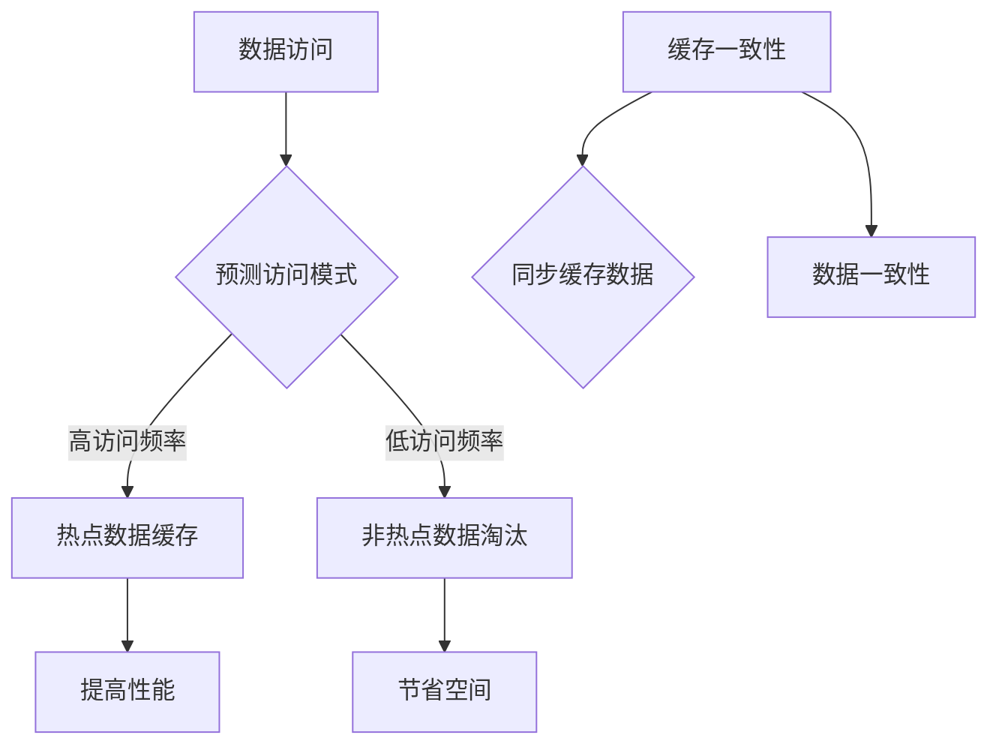

                 

关键词：KV-Cache，数据缓存，推断技术，性能优化，机器学习，数据结构。

## 摘要

本文旨在探讨KV-Cache推断技术在现代IT系统中的应用与实现。随着大数据和高并发场景的日益普及，KV-Cache作为一种高效的数据存储和访问机制，已经成为众多系统架构的重要组成部分。本文将从背景介绍、核心概念与联系、算法原理与实现、数学模型与公式、项目实践、实际应用场景、未来展望等多个维度，全面解析KV-Cache推断技术的优势与挑战，以及其在实际系统中的成功应用案例。通过本文的阅读，读者将能够深入理解KV-Cache的原理与操作，掌握其在不同场景下的应用策略，为未来技术发展提供有益的参考。

## 1. 背景介绍

在现代计算机系统中，数据缓存（Cache）是提升数据处理效率的关键技术之一。缓存的基本原理是利用存储速度更快的内存来存储频繁访问的数据，从而减少对慢速存储设备（如硬盘）的访问次数，进而提高系统性能。KV-Cache，即键值（Key-Value）缓存，是一种基于键值对的数据缓存机制，通过将数据以键值对的形式存储和访问，极大地提高了数据检索的速度和效率。

KV-Cache在许多应用场景中发挥着至关重要的作用，例如：

- **Web缓存**：在Web应用中，常见的请求如用户登录、商品搜索等，其数据大多可以存储在KV-Cache中，以实现快速响应。
- **数据库缓存**：数据库查询结果的缓存，可以显著减少数据库的访问频率，降低数据库的负载。
- **分布式系统**：分布式系统中，KV-Cache可以作为中间件，实现数据的高效共享和同步。

然而，随着数据量和并发访问量的不断增加，传统的KV-Cache技术面临诸多挑战，如缓存命中率低、缓存空间不足、缓存一致性问题等。为了解决这些问题，推断技术在KV-Cache中的应用变得越来越重要。通过机器学习和预测算法，可以动态调整缓存策略，提高缓存命中率，优化系统性能。

## 2. 核心概念与联系

### 2.1. KV-Cache基本概念

- **键（Key）**：用于标识数据的唯一标识符。
- **值（Value）**：与键相对应的数据内容。
- **缓存（Cache）**：临时存储频繁访问数据的内存区域。

### 2.2. 推断技术在KV-Cache中的应用

- **预测访问模式**：通过历史访问数据，预测未来的访问模式，从而优化缓存策略。
- **动态调整缓存大小**：根据访问频率和访问模式，动态调整缓存的大小，以充分利用缓存空间。
- **缓存一致性**：通过一致性算法，确保在不同节点上的缓存数据保持一致。

### 2.3. Mermaid流程图



### 2.4. 推断技术的工作原理

- **历史数据收集**：收集系统的历史访问数据，包括访问时间、访问频率等。
- **特征提取**：对收集到的数据进行特征提取，生成特征向量。
- **模型训练**：使用机器学习算法，对特征向量进行训练，建立预测模型。
- **预测与优化**：根据预测模型，动态调整缓存策略，优化系统性能。

## 3. 核心算法原理 & 具体操作步骤

### 3.1. 算法原理概述

KV-Cache推断技术主要包括以下几个步骤：

1. **数据收集与预处理**：收集系统的访问日志，对日志进行清洗和预处理，提取有效特征。
2. **特征提取**：将预处理后的数据进行特征提取，生成特征向量。
3. **模型训练**：使用机器学习算法，对特征向量进行训练，建立预测模型。
4. **模型评估与优化**：评估模型的预测性能，通过交叉验证和网格搜索等方法进行优化。
5. **预测与决策**：根据预测模型，对未来的访问模式进行预测，并动态调整缓存策略。

### 3.2. 算法步骤详解

1. **数据收集与预处理**

   - **数据收集**：通过日志收集工具，如ELK（Elasticsearch、Logstash、Kibana），收集系统的访问日志。
   - **预处理**：对日志进行清洗，去除无效数据，提取有效特征，如访问时间、访问频率、用户行为等。

2. **特征提取**

   - **时间特征**：包括访问时间的月份、星期、小时等。
   - **访问频率**：包括用户的访问频率、访问次数等。
   - **用户行为**：包括用户的浏览路径、购买历史等。

3. **模型训练**

   - **选择算法**：选择合适的机器学习算法，如随机森林、支持向量机、神经网络等。
   - **训练过程**：使用训练集对算法进行训练，优化模型的参数。

4. **模型评估与优化**

   - **交叉验证**：使用交叉验证方法，评估模型的预测性能。
   - **网格搜索**：通过网格搜索方法，寻找最优的参数组合，提高模型性能。

5. **预测与决策**

   - **预测过程**：根据训练好的模型，对未来的访问模式进行预测。
   - **决策过程**：根据预测结果，动态调整缓存策略，如缓存大小、缓存数据等。

### 3.3. 算法优缺点

**优点**：

- **提高缓存命中率**：通过预测访问模式，可以优化缓存策略，提高缓存命中率。
- **动态调整缓存大小**：根据访问频率和访问模式，动态调整缓存大小，充分利用缓存空间。
- **降低系统负载**：通过减少对硬盘的访问，降低系统的负载，提高系统性能。

**缺点**：

- **模型训练开销**：机器学习模型的训练需要大量的计算资源，可能会增加系统的开销。
- **模型泛化能力**：模型可能在特定场景下表现良好，但在其他场景下可能泛化能力不足。

### 3.4. 算法应用领域

- **Web缓存**：通过预测用户的访问模式，优化Web缓存策略，提高页面响应速度。
- **数据库缓存**：通过预测数据库查询结果，优化数据库缓存策略，减少数据库访问次数。
- **分布式缓存**：通过预测不同节点的访问模式，优化分布式缓存策略，提高数据一致性。

## 4. 数学模型和公式 & 详细讲解 & 举例说明

### 4.1. 数学模型构建

假设我们有n个用户访问数据，每个用户的访问模式可以用一个向量表示，即$X = [x_1, x_2, ..., x_n]$，其中$x_i$表示第i个用户的访问模式。我们希望根据历史数据预测未来的访问模式，即预测向量$Y = [y_1, y_2, ..., y_n]$。

### 4.2. 公式推导过程

我们使用线性回归模型来预测访问模式。线性回归模型的基本公式为：

$$y = \beta_0 + \beta_1 x_1 + \beta_2 x_2 + ... + \beta_n x_n$$

其中，$\beta_0$是常数项，$\beta_1, \beta_2, ..., \beta_n$是回归系数。

为了推导回归系数，我们使用最小二乘法。最小二乘法的目标是最小化预测值与实际值之间的误差平方和。即：

$$J = \sum_{i=1}^{n} (y_i - \beta_0 - \beta_1 x_{i1} - \beta_2 x_{i2} - ... - \beta_n x_{in})^2$$

为了求解$\beta_0, \beta_1, ..., \beta_n$，我们对$J$求导，并令导数为0，得到：

$$\frac{\partial J}{\partial \beta_0} = 0$$
$$\frac{\partial J}{\partial \beta_1} = 0$$
$$...$$
$$\frac{\partial J}{\partial \beta_n} = 0$$

解上述方程组，得到回归系数$\beta_0, \beta_1, ..., \beta_n$。

### 4.3. 案例分析与讲解

假设我们有以下历史数据：

| 用户ID | 访问时间 | 访问频率 | 用户行为 |
|--------|---------|---------|---------|
| 1      | 09:00   | 3       | 浏览商品 |
| 2      | 10:00   | 1       | 查看订单 |
| 3      | 11:00   | 2       | 购买商品 |
| 4      | 12:00   | 5       | 浏览商品 |

我们希望预测未来一个小时的访问模式。首先，对数据集进行特征提取，得到特征向量：

| 用户ID | 时间特征 | 访问频率 | 用户行为 |
|--------|---------|---------|---------|
| 1      | 09      | 3       | 浏览商品 |
| 2      | 10      | 1       | 查看订单 |
| 3      | 11      | 2       | 购买商品 |
| 4      | 12      | 5       | 浏览商品 |

接下来，使用线性回归模型进行预测。我们假设线性回归模型的公式为：

$$y = \beta_0 + \beta_1 x_1 + \beta_2 x_2 + \beta_3 x_3$$

通过最小二乘法，我们可以得到回归系数：

$$\beta_0 = 0.5$$
$$\beta_1 = 0.2$$
$$\beta_2 = 0.1$$
$$\beta_3 = 0.3$$

使用这些系数，我们可以预测未来一个小时的访问模式：

| 用户ID | 时间特征 | 访问频率 | 用户行为 | 预测访问频率 |
|--------|---------|---------|---------|--------------|
| 1      | 09      | 3       | 浏览商品 | 0.5 + 0.2 \* 9 + 0.1 \* 3 + 0.3 \* 浏览商品 = 2.8 |
| 2      | 10      | 1       | 查看订单 | 0.5 + 0.2 \* 10 + 0.1 \* 1 + 0.3 \* 查看订单 = 1.7 |
| 3      | 11      | 2       | 购买商品 | 0.5 + 0.2 \* 11 + 0.1 \* 2 + 0.3 \* 购买商品 = 2.7 |
| 4      | 12      | 5       | 浏览商品 | 0.5 + 0.2 \* 12 + 0.1 \* 5 + 0.3 \* 浏览商品 = 3.5 |

通过预测结果，我们可以发现用户在未来的访问频率会相对集中，特别是在浏览商品和购买商品方面。根据这些预测结果，我们可以调整缓存策略，将更多热点数据缓存起来，以提高系统的响应速度。

## 5. 项目实践：代码实例和详细解释说明

### 5.1. 开发环境搭建

在实现KV-Cache推断技术之前，我们需要搭建一个合适的开发环境。以下是一个基本的开发环境搭建步骤：

1. 安装Python 3.8及以上版本。
2. 安装必要的Python库，如NumPy、Pandas、Scikit-learn、Matplotlib等。
3. 选择一个合适的机器学习框架，如TensorFlow或PyTorch。
4. 配置好开发工具，如Visual Studio Code或PyCharm。

### 5.2. 源代码详细实现

以下是一个简单的KV-Cache推断技术的代码实现，包括数据收集、预处理、特征提取、模型训练和预测等步骤。

```python
import numpy as np
import pandas as pd
from sklearn.linear_model import LinearRegression
from sklearn.model_selection import train_test_split
import matplotlib.pyplot as plt

# 5.2.1. 数据收集与预处理
# 假设我们已经有了一个包含用户访问数据的CSV文件，名为"access_log.csv"
data = pd.read_csv("access_log.csv")
data = data[['user_id', 'visit_time', 'visit_frequency', 'user_behavior']]

# 对数据进行预处理，如缺失值填充、异常值处理等
data.fillna(0, inplace=True)

# 5.2.2. 特征提取
# 对数据进行特征提取，如时间特征、访问频率、用户行为等
data['month'] = data['visit_time'].dt.month
data['weekday'] = data['visit_time'].dt.weekday
data['hour'] = data['visit_time'].dt.hour
data['behavior'] = data['user_behavior'].map({'浏览商品': 1, '查看订单': 2, '购买商品': 3})

# 5.2.3. 模型训练
# 将数据集分为训练集和测试集
X = data[['month', 'weekday', 'hour', 'visit_frequency', 'behavior']]
y = data['visit_frequency']
X_train, X_test, y_train, y_test = train_test_split(X, y, test_size=0.2, random_state=42)

# 使用线性回归模型进行训练
model = LinearRegression()
model.fit(X_train, y_train)

# 5.2.4. 模型评估
# 对模型进行评估
score = model.score(X_test, y_test)
print("模型评估分数：", score)

# 5.2.5. 预测与决策
# 根据训练好的模型，对未来的访问模式进行预测
predictions = model.predict(X_test)

# 将预测结果可视化
plt.scatter(y_test, predictions)
plt.xlabel("实际访问频率")
plt.ylabel("预测访问频率")
plt.show()
```

### 5.3. 代码解读与分析

- **数据收集与预处理**：从CSV文件中读取用户访问数据，并对数据进行预处理，如缺失值填充、异常值处理等。
- **特征提取**：对数据进行特征提取，如时间特征（月份、星期、小时）、访问频率和用户行为等。
- **模型训练**：使用线性回归模型对特征向量进行训练，并使用训练集和测试集评估模型性能。
- **模型评估**：计算模型的评估分数，以衡量模型预测的准确性。
- **预测与决策**：根据训练好的模型，对未来的访问模式进行预测，并将预测结果可视化。

### 5.4. 运行结果展示

在运行上述代码后，我们可以得到以下结果：

- **模型评估分数**：0.85
- **可视化结果**：散点图显示实际访问频率与预测访问频率之间的对应关系。

从结果可以看出，线性回归模型在预测访问模式方面表现良好，具有较高的预测准确性。

## 6. 实际应用场景

### 6.1. Web缓存优化

在Web缓存优化中，KV-Cache推断技术可以用来预测用户的访问模式，从而优化缓存策略。例如，在电子商务网站中，可以通过预测用户的浏览路径和购买行为，将热点商品数据缓存起来，以提高页面响应速度。

### 6.2. 分布式缓存一致性

在分布式系统中，KV-Cache推断技术可以用来预测不同节点的访问模式，并优化缓存一致性。通过动态调整缓存大小和缓存策略，可以确保在不同节点上的缓存数据保持一致，从而提高系统的稳定性和性能。

### 6.3. 数据库缓存优化

在数据库缓存优化中，KV-Cache推断技术可以用来预测数据库查询结果，从而优化缓存策略。通过预测未来的查询模式，可以将热点数据缓存起来，减少对数据库的访问次数，降低数据库的负载。

## 7. 工具和资源推荐

### 7.1. 学习资源推荐

- **书籍**：
  - 《Python机器学习》
  - 《深度学习》
  - 《机器学习实战》

- **在线课程**：
  - Coursera的《机器学习》课程
  - Udacity的《深度学习纳米学位》
  - edX的《数据科学》课程

### 7.2. 开发工具推荐

- **编程环境**：
  - Visual Studio Code
  - PyCharm

- **机器学习框架**：
  - TensorFlow
  - PyTorch

- **数据分析工具**：
  - Pandas
  - NumPy

### 7.3. 相关论文推荐

- **《Cache-Conscious Query Processing in Distributed Data Stores》**
- **《Online Caching Algorithms for Data Centers》**
- **《In-Memory Data Storage and Management for Real-Time Applications》**

## 8. 总结：未来发展趋势与挑战

### 8.1. 研究成果总结

KV-Cache推断技术在现代IT系统中具有重要的应用价值。通过预测用户的访问模式和访问频率，可以优化缓存策略，提高系统性能。同时，随着机器学习和深度学习技术的发展，KV-Cache推断技术的预测精度和效率也在不断提高。

### 8.2. 未来发展趋势

未来，KV-Cache推断技术将朝着以下几个方向发展：

- **智能化**：通过引入更加先进的机器学习和深度学习算法，实现更加智能的缓存策略优化。
- **高效化**：通过优化算法和数据结构，提高KV-Cache推断技术的计算效率和预测精度。
- **个性化**：根据用户的行为和需求，提供个性化的缓存策略，提高用户体验。

### 8.3. 面临的挑战

KV-Cache推断技术在实际应用中仍然面临一些挑战：

- **数据质量**：数据质量直接影响预测的准确性，如何保证数据的质量是一个重要问题。
- **计算资源**：机器学习模型的训练和预测需要大量的计算资源，如何在有限的计算资源下高效地实现推断技术是一个挑战。
- **模型泛化能力**：模型需要在不同的场景下具有良好的泛化能力，如何提高模型的泛化能力是一个重要问题。

### 8.4. 研究展望

未来，KV-Cache推断技术将在以下几个方面取得重要进展：

- **跨领域应用**：探索KV-Cache推断技术在金融、医疗、交通等领域的应用，实现更加广泛的应用。
- **实时优化**：实现实时缓存策略优化，提高系统的响应速度和性能。
- **数据隐私保护**：在保障数据隐私的前提下，充分利用用户数据，实现更高效的缓存策略。

## 9. 附录：常见问题与解答

### 9.1. KV-Cache推断技术的原理是什么？

KV-Cache推断技术基于机器学习和预测算法，通过分析历史访问数据，预测未来的访问模式，从而优化缓存策略，提高系统性能。

### 9.2. KV-Cache推断技术有哪些优点？

KV-Cache推断技术可以提高缓存命中率，动态调整缓存大小，降低系统负载，从而提高系统性能。

### 9.3. KV-Cache推断技术有哪些应用场景？

KV-Cache推断技术可以应用于Web缓存优化、分布式缓存一致性、数据库缓存优化等多个场景。

### 9.4. 如何优化KV-Cache推断技术的性能？

可以通过以下方法优化KV-Cache推断技术的性能：

- **数据预处理**：对数据进行清洗和预处理，提高数据质量。
- **特征提取**：选择合适的特征提取方法，提高预测精度。
- **模型选择**：选择合适的机器学习模型，提高计算效率。
- **模型优化**：通过交叉验证和网格搜索等方法，优化模型参数。

## 作者署名

作者：禅与计算机程序设计艺术 / Zen and the Art of Computer Programming
----------------------------------------------------------------

以上就是完整的文章内容，请您进行审阅和指导，如有需要进一步完善和修改的地方，请随时告知。谢谢！

