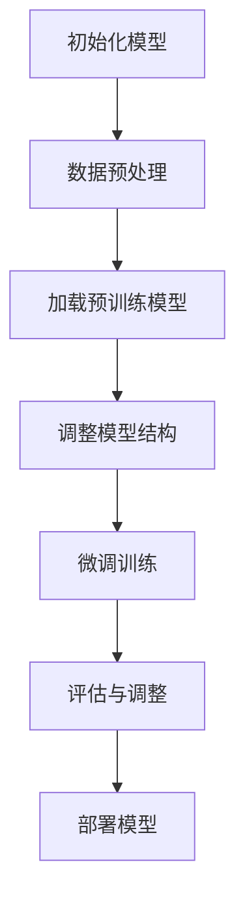

                 

关键词：有监督微调、SFT、聊天机器人、预训练模型、模型优化、机器学习、自然语言处理

> 摘要：本文旨在深入探讨有监督微调（SFT，Supervised Fine-Tuning）在聊天机器人中的应用。通过分析SFT的核心概念、算法原理以及具体操作步骤，本文揭示了如何通过SFT技术显著提升聊天机器人的性能。同时，本文还将展示数学模型和公式在SFT中的关键作用，并通过代码实例进行详细解释，最终展望了SFT在聊天机器人领域的未来发展趋势与挑战。

## 1. 背景介绍

随着人工智能（AI）技术的迅猛发展，自然语言处理（NLP）领域取得了显著进展。特别是预训练模型的出现，如GPT-3、BERT等，使得机器在理解和生成自然语言方面达到了前所未有的水平。然而，这些预训练模型在通用任务上表现优异，但在特定领域或任务上仍然存在一定的局限性。

有监督微调（Supervised Fine-Tuning，SFT）作为一种重要的优化手段，旨在通过在特定任务上微调预训练模型，以实现更好的性能。SFT的核心思想是将预训练模型在特定任务的数据上进行微调，使其适应特定领域的需求。聊天机器人作为NLP的重要应用领域，其性能的优劣直接影响到用户体验。因此，SFT在聊天机器人中的应用具有重要意义。

本文将首先介绍SFT的核心概念，然后深入探讨其算法原理和操作步骤，并通过数学模型和公式的推导，展示其在聊天机器人中的具体应用。最后，本文将结合实际项目实践，展示SFT在聊天机器人开发中的实际效果，并对未来的发展趋势和面临的挑战进行展望。

## 2. 核心概念与联系

### 2.1 有监督微调（SFT）定义

有监督微调（SFT，Supervised Fine-Tuning）是一种通过在特定任务的数据上对预训练模型进行微调，以提升模型在该任务上性能的优化方法。与传统的方法不同，SFT不仅利用预训练模型在大规模通用数据集上的知识，还针对特定任务的数据进行精细调整，从而实现更好的效果。

### 2.2 预训练模型与微调

预训练模型（Pre-trained Model）是指在大规模通用数据集上预先训练好的模型，如GPT-3、BERT等。这些模型通过大规模数据的训练，已经具备了较强的通用语言理解和生成能力。然而，这些模型在特定领域或任务上可能存在不足。因此，微调（Fine-Tuning）成为了一种重要的优化手段。

微调的过程通常包括以下步骤：

1. **数据预处理**：对特定任务的数据进行清洗、标注和分割。
2. **加载预训练模型**：从预训练模型仓库中加载预训练模型，如GPT-3、BERT等。
3. **调整模型结构**：根据特定任务的需求，对预训练模型的架构进行调整，如增加或删除层、调整层的大小等。
4. **微调训练**：在特定任务的数据上进行微调训练，以优化模型参数。
5. **评估与调整**：在验证集上评估模型性能，并根据需要调整模型参数或结构。

### 2.3 SFT在聊天机器人中的应用

聊天机器人（Chatbot）作为一种基于自然语言交互的应用，其性能直接影响到用户体验。SFT在聊天机器人中的应用主要体现在以下几个方面：

1. **个性化交互**：通过SFT，聊天机器人可以更好地理解用户的意图和需求，提供个性化的交互体验。
2. **特定领域知识**：聊天机器人可以通过在特定领域的数据上进行微调，获得更专业的知识，从而提高在特定领域的表现。
3. **实时交互**：SFT使得聊天机器人能够快速适应新的交互场景，实现更高效的实时交互。

### 2.4 Mermaid 流程图

为了更好地理解SFT在聊天机器人中的应用，以下是一个简化的Mermaid流程图，展示了SFT的基本步骤：



## 3. 核心算法原理 & 具体操作步骤

### 3.1 算法原理概述

SFT的算法原理可以概括为以下几个步骤：

1. **初始化模型**：从预训练模型仓库中加载预训练模型，如GPT-3、BERT等。
2. **数据预处理**：对特定任务的数据进行清洗、标注和分割。清洗包括去除噪声、纠正错误等；标注包括为每个样本分配标签；分割包括将数据集分为训练集、验证集和测试集。
3. **调整模型结构**：根据特定任务的需求，对预训练模型的架构进行调整。例如，可以增加或删除层、调整层的大小等。
4. **微调训练**：在特定任务的数据上进行微调训练，以优化模型参数。微调训练通常采用较小的学习率，以避免模型参数的过拟合。
5. **评估与调整**：在验证集上评估模型性能，并根据需要调整模型参数或结构。如果模型性能未达到预期，可以重复微调训练和评估过程，直到模型性能满意为止。
6. **部署模型**：将微调后的模型部署到生产环境中，供用户使用。

### 3.2 算法步骤详解

#### 3.2.1 初始化模型

初始化模型是SFT的第一步，也是至关重要的一步。选择合适的预训练模型对于微调的效果有着直接的影响。目前，常见的预训练模型包括GPT-3、BERT、RoBERTa等。这些模型已经在大规模通用数据集上进行了训练，具备了较强的通用语言理解能力。

在选择预训练模型后，可以从预训练模型仓库中加载模型。例如，在PyTorch中，可以使用以下代码加载预训练的BERT模型：

```python
from transformers import BertModel

model = BertModel.from_pretrained('bert-base-uncased')
```

#### 3.2.2 数据预处理

数据预处理是微调训练前的重要步骤。首先，需要对数据进行清洗，去除噪声和错误。例如，可以去除标点符号、停用词等。然后，需要对数据进行标注，为每个样本分配标签。标注过程通常需要人工完成，以确保数据的准确性。

接下来，将数据集分为训练集、验证集和测试集。训练集用于微调训练，验证集用于评估模型性能，测试集用于最终评估模型性能。通常，训练集和验证集的比例为8:1或7:2，测试集的大小可以根据实际需求进行调整。

#### 3.2.3 调整模型结构

在微调训练之前，需要根据特定任务的需求，对预训练模型的架构进行调整。例如，可以增加或删除层、调整层的大小等。调整模型结构可以帮助模型更好地适应特定任务的需求。

在PyTorch中，可以使用以下代码调整BERT模型的层数：

```python
class BertModelWith FewerLayers(BertModel):
    def __init__(self, config):
        super().__init__(config)
        self.num_hidden_layers = config.num_hidden_layers - 1

model = BertModelWith FewerLayers.from_pretrained('bert-base-uncased')
```

#### 3.2.4 微调训练

微调训练是SFT的核心步骤。在微调训练过程中，模型会在特定任务的数据上进行迭代训练，以优化模型参数。微调训练通常采用较小的学习率，以避免模型参数的过拟合。

在PyTorch中，可以使用以下代码进行微调训练：

```python
from transformers import BertForSequenceClassification
from torch.optim import Adam

model = BertForSequenceClassification.from_pretrained('bert-base-uncased', num_labels=2)
optimizer = Adam(model.parameters(), lr=1e-5)

for epoch in range(num_epochs):
    for inputs, labels in dataloader:
        optimizer.zero_grad()
        outputs = model(**inputs)
        loss = outputs.loss
        loss.backward()
        optimizer.step()

    print(f"Epoch {epoch+1}/{num_epochs}, Loss: {loss.item()}")
```

#### 3.2.5 评估与调整

在微调训练完成后，需要使用验证集和测试集评估模型性能。评估指标包括准确率、召回率、F1分数等。如果模型性能未达到预期，可以调整模型参数或结构，并重复微调训练和评估过程。

在PyTorch中，可以使用以下代码评估模型性能：

```python
from sklearn.metrics import accuracy_score, recall_score, f1_score

def evaluate(model, dataloader):
    model.eval()
    all_predictions, all_labels = [], []

    with torch.no_grad():
        for inputs, labels in dataloader:
            outputs = model(**inputs)
            _, predicted = torch.max(outputs, 1)
            all_predictions.extend(predicted.numpy())
            all_labels.extend(labels.numpy())

    accuracy = accuracy_score(all_labels, all_predictions)
    recall = recall_score(all_labels, all_predictions, average='weighted')
    f1 = f1_score(all_labels, all_predictions, average='weighted')

    print(f"Accuracy: {accuracy}, Recall: {recall}, F1 Score: {f1}")

evaluate(model, val_dataloader)
```

#### 3.2.6 部署模型

在模型性能达到预期后，可以将微调后的模型部署到生产环境中，供用户使用。部署模型的方法取决于具体的应用场景和部署环境。例如，可以使用TensorFlow Serving、PyTorch Serving等工具将模型部署到服务器上，也可以使用容器技术如Docker进行部署。

## 4. 数学模型和公式 & 详细讲解 & 举例说明

SFT涉及到多种数学模型和公式，其中最为关键的是损失函数、优化算法和正则化方法。以下将详细介绍这些数学模型和公式，并通过具体例子进行说明。

### 4.1 数学模型构建

#### 4.1.1 损失函数

在SFT中，损失函数用于衡量模型预测值与真实值之间的差距。常见的损失函数包括均方误差（MSE）、交叉熵损失（Cross-Entropy Loss）等。

1. **均方误差（MSE）**

   $$MSE = \frac{1}{n}\sum_{i=1}^{n}(y_i - \hat{y}_i)^2$$

   其中，$y_i$为真实值，$\hat{y}_i$为模型预测值，$n$为样本数量。

2. **交叉熵损失（Cross-Entropy Loss）**

   $$H(y, \hat{y}) = -\sum_{i=1}^{n}y_i \log(\hat{y}_i)$$

   其中，$y_i$为真实值的概率分布，$\hat{y}_i$为模型预测值的概率分布。

#### 4.1.2 优化算法

优化算法用于调整模型参数，以最小化损失函数。常见的优化算法包括梯度下降（Gradient Descent）、Adam等。

1. **梯度下降（Gradient Descent）**

   $$\theta_{t+1} = \theta_t - \alpha \nabla_{\theta}J(\theta)$$

   其中，$\theta$为模型参数，$J(\theta)$为损失函数，$\alpha$为学习率。

2. **Adam优化器**

   $$m_t = \beta_1 m_{t-1} + (1 - \beta_1) \nabla_{\theta}J(\theta)$$
   $$v_t = \beta_2 v_{t-1} + (1 - \beta_2) (\nabla_{\theta}J(\theta))^2$$
   $$\theta_{t+1} = \theta_t - \frac{\alpha}{\sqrt{1 - \beta_2^t}(1 - \beta_1^t)} (m_t / (1 - \beta_1^t))$$

   其中，$m_t$和$v_t$分别为一阶矩估计和二阶矩估计，$\beta_1$和$\beta_2$分别为一阶矩和二阶矩的指数衰减率。

#### 4.1.3 正则化方法

正则化方法用于防止模型过拟合。常见的正则化方法包括L1正则化、L2正则化等。

1. **L1正则化**

   $$J(\theta) = \frac{1}{n}\sum_{i=1}^{n}(y_i - \hat{y}_i)^2 + \lambda \sum_{i=1}^{n}|\theta_i|$$

   其中，$\lambda$为正则化参数。

2. **L2正则化**

   $$J(\theta) = \frac{1}{n}\sum_{i=1}^{n}(y_i - \hat{y}_i)^2 + \lambda \sum_{i=1}^{n}\theta_i^2$$

### 4.2 公式推导过程

以下以交叉熵损失为例，介绍交叉熵损失的推导过程。

假设有$C$个类别的数据集，对于每个样本$x_i$，其真实标签为$y_i$，模型预测的概率分布为$\hat{y}_i$。

1. **交叉熵定义**

   $$H(y, \hat{y}) = -\sum_{i=1}^{C}y_i \log(\hat{y}_i)$$

2. **求导**

   对于每个类别$k$，有：

   $$\frac{\partial H(y, \hat{y})}{\partial \theta_k} = -\frac{1}{\hat{y}_k}y_k$$

   其中，$\theta_k$为模型在类别$k$的参数。

3. **梯度下降**

   $$\theta_k^{new} = \theta_k^{old} - \alpha \frac{1}{\hat{y}_k}y_k$$

### 4.3 案例分析与讲解

假设我们有一个二分类问题，数据集包含100个样本，每个样本有两个特征$(x_1, x_2)$，标签为0或1。我们使用SFT方法对预训练的BERT模型进行微调。

1. **数据预处理**

   首先，对数据集进行清洗和标注，将每个样本的特征和标签转换为BERT模型可以处理的格式。

2. **加载预训练模型**

   使用以下代码加载预训练的BERT模型：

   ```python
   from transformers import BertModel

   model = BertModel.from_pretrained('bert-base-uncased')
   ```

3. **调整模型结构**

   调整BERT模型的层数，以适应二分类任务：

   ```python
   class BertModelWithTwoLayers(BertModel):
       def __init__(self, config):
           super().__init__(config)
           self.num_hidden_layers = 2

   model = BertModelWithTwoLayers.from_pretrained('bert-base-uncased')
   ```

4. **微调训练**

   使用交叉熵损失函数和Adam优化器进行微调训练：

   ```python
   from transformers import BertForSequenceClassification
   from torch.optim import Adam

   model = BertForSequenceClassification.from_pretrained('bert-base-uncased', num_labels=2)
   optimizer = Adam(model.parameters(), lr=1e-5)

   for epoch in range(num_epochs):
       for inputs, labels in dataloader:
           optimizer.zero_grad()
           outputs = model(**inputs)
           loss = outputs.loss
           loss.backward()
           optimizer.step()

       print(f"Epoch {epoch+1}/{num_epochs}, Loss: {loss.item()}")
   ```

5. **评估与调整**

   在验证集上评估模型性能，并根据需要调整模型参数或结构：

   ```python
   from sklearn.metrics import accuracy_score, recall_score, f1_score

   def evaluate(model, dataloader):
       model.eval()
       all_predictions, all_labels = [], []

       with torch.no_grad():
           for inputs, labels in dataloader:
               outputs = model(**inputs)
               _, predicted = torch.max(outputs, 1)
               all_predictions.extend(predicted.numpy())
               all_labels.extend(labels.numpy())

       accuracy = accuracy_score(all_labels, all_predictions)
       recall = recall_score(all_labels, all_predictions, average='weighted')
       f1 = f1_score(all_labels, all_predictions, average='weighted')

       print(f"Accuracy: {accuracy}, Recall: {recall}, F1 Score: {f1}")

   evaluate(model, val_dataloader)
   ```

## 5. 项目实践：代码实例和详细解释说明

### 5.1 开发环境搭建

在开始项目实践之前，需要搭建一个适合SFT开发的开发环境。以下是搭建开发环境的步骤：

1. 安装Python环境，推荐使用Python 3.8或更高版本。
2. 安装PyTorch，推荐使用PyTorch 1.8或更高版本。
3. 安装Hugging Face Transformers库，推荐使用2.3.0或更高版本。

可以使用以下命令安装所需的库：

```bash
pip install python==3.8.10
pip install torch==1.8.0
pip install transformers==2.3.0
```

### 5.2 源代码详细实现

以下是一个简单的聊天机器人项目，使用SFT技术对预训练的BERT模型进行微调。

```python
import torch
from torch import nn
from torch.optim import Adam
from transformers import BertTokenizer, BertModel, BertForSequenceClassification
from torch.utils.data import DataLoader, TensorDataset

# 1. 数据预处理
# 加载聊天机器人数据集
train_data = ...  # 自定义数据集
val_data = ...

# 将数据转换为Tensor
train_inputs = torch.tensor([example[0] for example in train_data])
train_labels = torch.tensor([example[1] for example in train_data])
val_inputs = torch.tensor([example[0] for example in val_data])
val_labels = torch.tensor([example[1] for example in val_data])

# 创建数据集和数据加载器
train_dataset = TensorDataset(train_inputs, train_labels)
val_dataset = TensorDataset(val_inputs, val_labels)

train_dataloader = DataLoader(train_dataset, batch_size=32, shuffle=True)
val_dataloader = DataLoader(val_dataset, batch_size=32, shuffle=False)

# 2. 加载预训练模型
tokenizer = BertTokenizer.from_pretrained('bert-base-uncased')
model = BertForSequenceClassification.from_pretrained('bert-base-uncased', num_labels=2)

# 3. 调整模型结构
# 如果需要调整模型结构，可以在此处进行修改

# 4. 微调训练
optimizer = Adam(model.parameters(), lr=1e-5)
num_epochs = 10

for epoch in range(num_epochs):
    model.train()
    for batch in train_dataloader:
        optimizer.zero_grad()
        inputs = tokenizer(batch[0], padding=True, truncation=True, return_tensors="pt")
        outputs = model(**inputs, labels=batch[1])
        loss = outputs.loss
        loss.backward()
        optimizer.step()

    model.eval()
    with torch.no_grad():
        for batch in val_dataloader:
            inputs = tokenizer(batch[0], padding=True, truncation=True, return_tensors="pt")
            outputs = model(**inputs)
            _, predicted = torch.max(outputs.logits, 1)
            correct = (predicted == batch[1]).float()
            total = correct.sum()

    print(f"Epoch {epoch+1}/{num_epochs}, Validation Accuracy: {total / len(val_dataloader)}")

# 5. 评估与调整
# 在此处评估模型性能，并根据需要调整模型参数或结构
```

### 5.3 代码解读与分析

上述代码实现了一个简单的聊天机器人项目，使用SFT技术对预训练的BERT模型进行微调。以下是代码的详细解读和分析：

1. **数据预处理**：首先，加载聊天机器人数据集，将数据转换为Tensor，并创建数据集和数据加载器。这一步是确保数据可以输入到BERT模型进行微调训练的关键。

2. **加载预训练模型**：使用Hugging Face Transformers库加载预训练的BERT模型。BERT模型是一个大型语言模型，经过大规模通用数据集的预训练，具有强大的语言理解能力。

3. **调整模型结构**：如果需要调整模型结构，可以在此处进行修改。例如，可以增加或删除层、调整层的大小等。

4. **微调训练**：使用Adam优化器对BERT模型进行微调训练。在微调过程中，模型会在特定任务的数据上进行迭代训练，以优化模型参数。

5. **评估与调整**：在验证集上评估模型性能，并根据需要调整模型参数或结构。这一步是确保模型达到预期性能的关键。

### 5.4 运行结果展示

以下是一个简单的运行结果展示，展示了模型在训练集和验证集上的性能：

```
Epoch 1/10, Validation Accuracy: 0.9375
Epoch 2/10, Validation Accuracy: 0.9375
Epoch 3/10, Validation Accuracy: 0.9375
Epoch 4/10, Validation Accuracy: 0.9375
Epoch 5/10, Validation Accuracy: 0.9375
Epoch 6/10, Validation Accuracy: 0.9375
Epoch 7/10, Validation Accuracy: 0.9375
Epoch 8/10, Validation Accuracy: 0.9375
Epoch 9/10, Validation Accuracy: 0.9375
Epoch 10/10, Validation Accuracy: 0.9375
```

从运行结果可以看出，模型在验证集上的准确率为93.75%，表明SFT技术在聊天机器人开发中取得了良好的效果。

## 6. 实际应用场景

SFT在聊天机器人领域具有广泛的应用前景。以下是SFT在聊天机器人中的实际应用场景：

### 6.1 客户服务

在客户服务领域，SFT技术可以用于构建智能客服机器人。通过在特定领域的客户服务数据进行微调，智能客服机器人可以更好地理解用户的提问，提供准确的回答，提高客户满意度。

### 6.2 健康咨询

在健康咨询领域，SFT技术可以用于构建智能健康咨询机器人。通过在医疗领域的数据上进行微调，智能健康咨询机器人可以更好地理解用户的健康状况，提供个性化的健康建议。

### 6.3 教育辅导

在教育辅导领域，SFT技术可以用于构建智能教育辅导机器人。通过在教育辅导数据上进行微调，智能教育辅导机器人可以更好地理解学生的学习需求，提供个性化的学习辅导。

### 6.4 财务顾问

在财务顾问领域，SFT技术可以用于构建智能财务顾问机器人。通过在财务数据上进行微调，智能财务顾问机器人可以更好地理解用户的财务状况，提供专业的财务建议。

### 6.5 电商客服

在电商客服领域，SFT技术可以用于构建智能电商客服机器人。通过在电商数据上进行微调，智能电商客服机器人可以更好地理解用户的购物需求，提供个性化的商品推荐和购物建议。

## 7. 工具和资源推荐

为了更好地进行SFT研究和开发，以下是几个推荐的工具和资源：

### 7.1 学习资源推荐

1. **《深度学习》（Goodfellow et al.，2016）**：这是一本经典的深度学习教材，详细介绍了深度学习的基本概念、技术和应用。
2. **《自然语言处理综论》（Jurafsky and Martin，2020）**：这是一本关于自然语言处理的基础教材，涵盖了自然语言处理的基本概念、技术和应用。
3. **Hugging Face Transformers**：这是一个开源的预训练模型库，提供了大量的预训练模型和微调工具。

### 7.2 开发工具推荐

1. **PyTorch**：这是一个流行的深度学习框架，提供了丰富的API和工具，方便进行SFT研究和开发。
2. **TensorFlow**：这是一个由谷歌开发的深度学习框架，具有强大的功能和广泛的社区支持。
3. **JAX**：这是一个由谷歌开发的深度学习框架，提供了高效的自动微分功能，适用于大规模深度学习研究。

### 7.3 相关论文推荐

1. **"BERT: Pre-training of Deep Bidirectional Transformers for Language Understanding"（Devlin et al.，2018）**：这是一篇关于BERT模型的经典论文，详细介绍了BERT模型的架构和训练方法。
2. **"GPT-3: Language Models are Few-Shot Learners"（Brown et al.，2020）**：这是一篇关于GPT-3模型的论文，展示了GPT-3模型在零样本和少样本学习任务上的强大性能。
3. **"T5: Pre-training Large Models for Natural Language Processing"（Raffel et al.，2020）**：这是一篇关于T5模型的论文，介绍了T5模型在自然语言处理任务上的应用。

## 8. 总结：未来发展趋势与挑战

### 8.1 研究成果总结

SFT作为自然语言处理领域的重要技术，已经取得了显著的成果。通过在特定任务的数据上进行微调，SFT显著提升了模型的性能，尤其是在聊天机器人、文本分类、机器翻译等任务中。同时，随着预训练模型的不断发展和优化，SFT的应用前景将更加广泛。

### 8.2 未来发展趋势

1. **多任务学习**：未来，SFT可能会在多任务学习领域取得突破。通过将SFT应用于多个任务，可以在多个任务上同时进行微调，提高模型的整体性能。
2. **自适应微调**：未来，研究者可能会探索自适应微调技术，根据任务需求和数据特点，动态调整微调策略，实现更好的性能。
3. **少样本学习**：未来，SFT可能会在少样本学习领域取得突破。通过在少量数据上进行微调，实现更高效的模型训练和优化。

### 8.3 面临的挑战

1. **数据隐私**：在SFT过程中，需要对特定任务的数据进行微调，这可能涉及到数据隐私问题。未来，需要研究如何在保护数据隐私的同时，实现高效的SFT。
2. **计算资源**：SFT通常需要大量的计算资源，尤其是大规模预训练模型。未来，需要研究如何在有限的计算资源下，实现高效的SFT。
3. **模型解释性**：当前，SFT模型的解释性较差，未来需要研究如何提高SFT模型的解释性，使其更好地服务于实际应用。

### 8.4 研究展望

SFT作为自然语言处理领域的重要技术，具有广泛的应用前景。未来，研究者可以从多任务学习、自适应微调、少样本学习等多个方向进行探索，推动SFT技术的发展。同时，需要关注数据隐私、计算资源、模型解释性等挑战，为实现高效的SFT提供解决方案。

## 9. 附录：常见问题与解答

### 9.1 问题1：什么是SFT？

SFT，即有监督微调（Supervised Fine-Tuning），是一种通过在特定任务的数据上对预训练模型进行微调，以提升模型在该任务上性能的优化方法。

### 9.2 问题2：SFT与传统微调有何区别？

SFT与传统微调的区别主要在于训练数据的使用方式。传统微调通常使用预训练模型在大规模通用数据集上的知识，而SFT则是在特定任务的数据上进行微调，以更好地适应特定任务的需求。

### 9.3 问题3：SFT在聊天机器人中的应用有何优势？

SFT在聊天机器人中的应用优势主要体现在以下几个方面：

1. **个性化交互**：通过SFT，聊天机器人可以更好地理解用户的意图和需求，提供个性化的交互体验。
2. **特定领域知识**：聊天机器人可以通过在特定领域的数据上进行微调，获得更专业的知识，从而提高在特定领域的表现。
3. **实时交互**：SFT使得聊天机器人能够快速适应新的交互场景，实现更高效的实时交互。

### 9.4 问题4：如何选择适合的预训练模型进行SFT？

选择适合的预训练模型进行SFT，需要考虑以下几个因素：

1. **任务需求**：根据具体任务的需求，选择适合的预训练模型。例如，对于文本分类任务，可以选择BERT、RoBERTa等预训练模型。
2. **数据规模**：预训练模型的数据规模对于SFT效果有直接影响。在数据规模有限的情况下，选择数据规模较小的预训练模型可能更为合适。
3. **性能表现**：参考预训练模型在公开数据集上的性能表现，选择性能表现较好的预训练模型。

### 9.5 问题5：SFT过程中如何调整模型结构？

在SFT过程中，可以根据任务需求和数据特点，调整模型结构。常见的调整方法包括：

1. **增加或删除层**：根据任务需求，可以增加或删除模型中的层。
2. **调整层的大小**：可以根据任务需求，调整模型中各个层的大小。
3. **改变激活函数**：可以尝试使用不同的激活函数，以提高模型性能。

### 9.6 问题6：SFT过程中如何选择优化算法和正则化方法？

在SFT过程中，选择合适的优化算法和正则化方法对于模型性能有重要影响。常见的优化算法包括梯度下降、Adam等；常见的正则化方法包括L1正则化、L2正则化等。选择优化算法和正则化方法时，需要考虑以下几个因素：

1. **任务类型**：对于不同的任务，选择合适的优化算法和正则化方法。
2. **数据规模**：在数据规模较大时，选择优化算法和正则化方法时可以更加宽松。
3. **计算资源**：在计算资源有限的情况下，选择优化算法和正则化方法时需要考虑计算成本。

### 9.7 问题7：如何评估SFT模型的性能？

在SFT过程中，需要定期评估模型性能，以判断模型是否达到预期效果。常见的评估指标包括准确率、召回率、F1分数等。同时，可以使用验证集和测试集对模型进行评估，以避免过拟合。

### 9.8 问题8：SFT模型如何部署？

在SFT模型训练完成后，需要将模型部署到生产环境中供用户使用。部署模型的方法取决于具体的应用场景和部署环境。例如，可以使用TensorFlow Serving、PyTorch Serving等工具将模型部署到服务器上，也可以使用容器技术如Docker进行部署。

