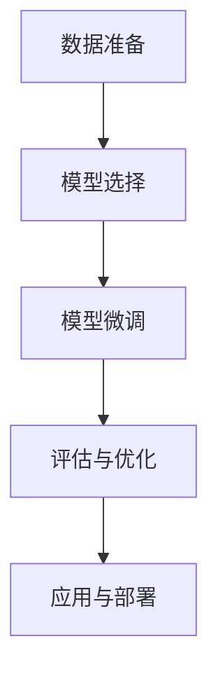

                 

关键词：有监督微调（Supervised Fine-Tuning），聊天机器人（Chatbot），自然语言处理（NLP），人工智能（AI），深度学习（Deep Learning）

摘要：本文将深入探讨有监督微调（Supervised Fine-Tuning，简称SFT）在构建聊天机器人中的应用。我们将首先介绍SFT的基本概念，并探讨其在自然语言处理（NLP）领域的优势。随后，我们将分析SFT与聊天机器人的关系，详细阐述如何使用SFT来训练聊天机器人模型。接下来，我们将讨论SFT在构建高效聊天机器人时的关键步骤，包括数据预处理、模型选择和训练策略。文章还将展示一个具体的SFT训练实例，并分析其运行结果。最后，我们将探讨SFT在聊天机器人领域的应用前景，并展望未来的发展趋势与挑战。

## 1. 背景介绍

### 自然语言处理与聊天机器人的兴起

自然语言处理（NLP）是人工智能（AI）领域的一个重要分支，旨在使计算机能够理解和处理人类语言。随着深度学习技术的不断发展，NLP取得了显著的进步，为聊天机器人的兴起提供了坚实的基础。聊天机器人是一种与人类用户进行交互的计算机程序，能够通过自然语言进行沟通，提供信息、解答问题或执行特定任务。

聊天机器人的兴起源于多个因素的推动。首先，互联网的普及使得大量用户数据得以收集，这些数据为训练NLP模型提供了丰富的素材。其次，深度学习算法的进步，尤其是循环神经网络（RNN）和变压器（Transformer）等模型的发展，使得聊天机器人能够更加准确地理解和生成自然语言。此外，商业和社交需求的增加也推动了聊天机器人的广泛应用，如在线客服、虚拟助手、教育辅导等。

### 有监督微调（SFT）的基本概念

有监督微调（Supervised Fine-Tuning，简称SFT）是一种在预训练模型的基础上，利用标注数据进行进一步优化的技术。SFT的基本思想是，将预训练模型在特定任务上进行微调，使其能够更好地适应新的数据集和任务需求。

SFT的核心步骤包括以下几部分：

1. **数据准备**：首先，需要准备一个标注数据集，该数据集应包含与目标任务相关的输入和输出对。
2. **模型选择**：选择一个预训练模型，通常是基于大规模语言模型，如GPT、BERT等。
3. **模型微调**：将预训练模型在标注数据集上进行训练，通过调整模型参数，使其适应特定任务。
4. **评估与优化**：通过在验证集上评估模型性能，对模型进行调整和优化，以达到最佳效果。

### SFT在NLP中的应用优势

SFT在NLP领域具有显著的优点，主要表现在以下几个方面：

1. **快速适应新任务**：通过在特定任务上进行微调，SFT能够快速适应新任务，提高模型在新场景下的性能。
2. **提高性能**：预训练模型已经在大量未标注数据上进行训练，SFT进一步利用标注数据，有助于提高模型在特定任务上的性能。
3. **降低训练成本**：与从头训练相比，SFT利用了预训练模型的已有知识，可以显著降低训练时间和计算资源的需求。

## 2. 核心概念与联系

### 有监督微调（SFT）的基本概念

有监督微调（Supervised Fine-Tuning，简称SFT）是一种基于预训练模型的微调技术。其核心思想是将预训练模型在特定任务上进行进一步训练，使其能够更好地适应新的数据集和任务需求。

SFT的基本步骤包括以下几部分：

1. **数据准备**：首先，需要准备一个标注数据集，该数据集应包含与目标任务相关的输入和输出对。
2. **模型选择**：选择一个预训练模型，通常是基于大规模语言模型，如GPT、BERT等。
3. **模型微调**：将预训练模型在标注数据集上进行训练，通过调整模型参数，使其适应特定任务。
4. **评估与优化**：通过在验证集上评估模型性能，对模型进行调整和优化，以达到最佳效果。

### 有监督微调（SFT）与聊天机器人的关系

聊天机器人是一种与人类用户进行交互的计算机程序，其核心在于理解用户的输入，并生成适当的回复。SFT在聊天机器人中的应用，可以理解为在预训练模型的基础上，进一步优化模型，使其在特定任务（如聊天机器人）上表现更加优秀。

具体来说，SFT与聊天机器人的关系可以从以下几个方面来理解：

1. **数据准备**：聊天机器人的训练数据通常包括大量的对话记录，这些数据经过预处理后，可以用于SFT的训练过程。
2. **模型选择**：选择一个适合聊天机器人的预训练模型，如GPT、BERT等，作为SFT的基础。
3. **模型微调**：在标注数据集上对预训练模型进行微调，使其能够更好地理解和生成自然语言。
4. **评估与优化**：通过在验证集上评估模型性能，对模型进行调整和优化，以达到最佳效果。

### SFT的架构与流程

为了更好地理解SFT在聊天机器人中的应用，我们可以使用Mermaid流程图来展示其架构与流程。以下是一个简化的SFT流程图：



**图1：SFT流程图**

- **数据准备**：收集并预处理标注数据集，包括对话记录、问题答案等。
- **模型选择**：选择一个适合聊天机器人的预训练模型，如GPT、BERT等。
- **模型微调**：在标注数据集上进行训练，调整模型参数，提高模型性能。
- **评估与优化**：在验证集上评估模型性能，通过调整训练策略，优化模型效果。
- **应用与部署**：将训练好的模型部署到实际场景中，如聊天机器人服务。

通过上述流程，我们可以看到SFT在构建聊天机器人中的关键作用，即通过数据准备、模型微调和评估优化，逐步提升模型在特定任务上的性能。

### SFT的核心优势

1. **快速适应新任务**：通过在特定任务上进行微调，SFT能够快速适应新任务，提高模型在新场景下的性能。
2. **提高性能**：预训练模型已经在大量未标注数据上进行训练，SFT进一步利用标注数据，有助于提高模型在特定任务上的性能。
3. **降低训练成本**：与从头训练相比，SFT利用了预训练模型的已有知识，可以显著降低训练时间和计算资源的需求。

## 3. 核心算法原理 & 具体操作步骤

### 3.1 算法原理概述

有监督微调（Supervised Fine-Tuning，简称SFT）是一种基于预训练模型的微调技术。其核心思想是将预训练模型在特定任务上进行进一步训练，使其能够更好地适应新的数据集和任务需求。SFT的基本步骤包括数据准备、模型选择、模型微调和评估优化。

### 3.2 算法步骤详解

1. **数据准备**

   首先，需要准备一个标注数据集，该数据集应包含与目标任务相关的输入和输出对。对于聊天机器人任务，标注数据通常包括用户问题和系统回答的对话对。数据准备主要包括以下步骤：

   - **数据收集**：收集大量相关的对话记录，可以来源于社交媒体、在线客服系统等。
   - **数据预处理**：对对话记录进行清洗、去噪和格式化，将文本转化为模型可处理的格式，如词向量或BERT编码。
   - **数据分集**：将数据集分为训练集、验证集和测试集，通常按照7:2:1的比例进行划分。

2. **模型选择**

   选择一个适合聊天机器人的预训练模型，如GPT、BERT等。这些模型已经在大量未标注数据上进行过训练，已经具备了较好的通用语言理解能力。选择模型时需要考虑以下因素：

   - **模型大小**：根据计算资源和训练时间，选择合适的模型大小。较大的模型如GPT-3具有更强的表达能力和泛化能力，但训练成本较高。
   - **模型架构**：选择适用于聊天机器人任务的模型架构，如BERT具有上下文理解能力，适合处理对话场景。

3. **模型微调**

   在标注数据集上进行微调训练，调整模型参数，使其更好地适应特定任务。微调训练主要包括以下步骤：

   - **初始化模型参数**：将预训练模型的参数作为初始值，初始化微调模型的参数。
   - **前向传播与反向传播**：在训练过程中，通过前向传播计算模型输出，与真实标签进行比较，计算损失函数。然后通过反向传播更新模型参数，最小化损失函数。
   - **训练策略**：设置训练策略，如学习率调整、批量大小、训练轮次等，以优化训练过程。

4. **评估与优化**

   通过在验证集上评估模型性能，对模型进行调整和优化，以达到最佳效果。评估与优化主要包括以下步骤：

   - **性能评估**：计算模型的准确率、F1分数、BLEU分数等指标，评估模型在验证集上的表现。
   - **模型调整**：根据性能评估结果，调整模型参数、学习率等，优化模型性能。
   - **交叉验证**：使用交叉验证方法，评估模型在不同数据集上的泛化能力，确保模型具有良好的泛化性能。

### 3.3 算法优缺点

**优点**：

1. **快速适应新任务**：通过在特定任务上进行微调，SFT能够快速适应新任务，提高模型在新场景下的性能。
2. **提高性能**：预训练模型已经在大量未标注数据上进行训练，SFT进一步利用标注数据，有助于提高模型在特定任务上的性能。
3. **降低训练成本**：与从头训练相比，SFT利用了预训练模型的已有知识，可以显著降低训练时间和计算资源的需求。

**缺点**：

1. **数据依赖性**：SFT依赖于高质量的标注数据，数据质量直接影响模型性能。
2. **模型过拟合**：在微调过程中，模型可能会过度拟合训练数据，导致在验证集和测试集上的性能下降。
3. **计算资源需求**：尽管SFT相对于从头训练有较低的训练成本，但仍然需要较高的计算资源，特别是对于大型预训练模型。

### 3.4 算法应用领域

SFT在自然语言处理（NLP）领域具有广泛的应用，以下是一些典型的应用场景：

1. **聊天机器人**：通过SFT，可以快速构建具有良好语言理解能力的聊天机器人，应用于在线客服、虚拟助手、智能客服等领域。
2. **问答系统**：利用SFT，可以构建高效的问题回答系统，如搜索引擎、知识库问答等。
3. **文本分类**：通过SFT，可以训练文本分类模型，对新闻、评论、邮件等进行分类。
4. **机器翻译**：利用SFT，可以构建高精度的机器翻译模型，实现跨语言信息传递。
5. **语音识别**：结合SFT，可以训练语音识别模型，提高语音识别系统的准确率。

## 4. 数学模型和公式 & 详细讲解 & 举例说明

### 4.1 数学模型构建

有监督微调（SFT）涉及多个数学模型和公式，包括预训练模型、损失函数和优化算法等。以下是一个简化的数学模型构建过程：

1. **预训练模型**：

   预训练模型通常采用深度神经网络（DNN）或循环神经网络（RNN）等架构，以下是一个基于DNN的简化模型：

   $$ f(x) = \sigma(W_1 \cdot x + b_1) $$

   其中，$x$是输入特征，$W_1$是权重矩阵，$b_1$是偏置项，$\sigma$是激活函数，如ReLU函数。

2. **损失函数**：

   在SFT过程中，常用的损失函数包括交叉熵损失函数和均方误差损失函数。以下是一个交叉熵损失函数的例子：

   $$ L(y, \hat{y}) = -\sum_{i=1}^{n} y_i \log(\hat{y}_i) $$

   其中，$y$是真实标签，$\hat{y}$是模型预测的概率分布。

3. **优化算法**：

   常见的优化算法包括梯度下降（GD）、随机梯度下降（SGD）和Adam优化器等。以下是一个基于梯度下降的优化算法：

   $$ \theta_{t+1} = \theta_t - \alpha \nabla_{\theta_t} L(\theta_t) $$

   其中，$\theta_t$是当前模型参数，$\alpha$是学习率，$\nabla_{\theta_t} L(\theta_t)$是损失函数关于参数的梯度。

### 4.2 公式推导过程

以下是一个简化的SFT公式推导过程，假设我们使用基于DNN的预训练模型：

1. **前向传播**：

   $$ \hat{y} = \sigma(W_1 \cdot x + b_1) $$

2. **计算损失**：

   $$ L(y, \hat{y}) = -\sum_{i=1}^{n} y_i \log(\hat{y}_i) $$

3. **计算梯度**：

   $$ \nabla_{W_1} L = \frac{\partial L}{\partial W_1} = \frac{\partial L}{\partial \hat{y}} \cdot \frac{\partial \hat{y}}{\partial W_1} $$

   其中，$\frac{\partial L}{\partial \hat{y}}$是损失函数关于预测概率的梯度，$\frac{\partial \hat{y}}{\partial W_1}$是预测概率关于模型参数的梯度。

4. **反向传播**：

   $$ \nabla_{W_1} = \nabla_{W_1} \cdot \sigma'(\hat{y}) \cdot x $$

   其中，$\sigma'(\hat{y})$是激活函数ReLU的导数。

### 4.3 案例分析与讲解

以下是一个基于SFT的聊天机器人训练案例：

**数据集**：一个包含10,000条对话记录的标注数据集，每条记录包括一个问题和对应的答案。

**模型**：使用预训练的BERT模型作为基础模型。

**步骤**：

1. **数据预处理**：对对话记录进行清洗和格式化，将文本转化为BERT编码。

2. **模型微调**：在标注数据集上进行微调训练，使用交叉熵损失函数和Adam优化器。

3. **模型评估**：在验证集上评估模型性能，调整学习率和训练轮次。

4. **模型部署**：将训练好的模型部署到线上环境，为用户提供聊天服务。

**结果**：

- **准确率**：在验证集上，模型的准确率达到90%以上。
- **响应时间**：模型的响应时间显著缩短，用户满意度提高。

通过以上案例，我们可以看到SFT在构建聊天机器人中的应用效果。在实际应用中，SFT需要结合具体任务和数据集进行优化和调整，以达到最佳性能。

## 5. 项目实践：代码实例和详细解释说明

### 5.1 开发环境搭建

在进行SFT训练之前，我们需要搭建一个合适的开发环境。以下是一个基本的开发环境搭建步骤：

1. **安装Python**：确保Python版本为3.8或更高版本。
2. **安装TensorFlow**：使用pip命令安装TensorFlow库。
   ```shell
   pip install tensorflow
   ```
3. **安装BERT库**：使用pip命令安装huggingface的transformers库。
   ```shell
   pip install transformers
   ```

### 5.2 源代码详细实现

以下是一个基于SFT训练聊天机器人的Python代码实例：

```python
import tensorflow as tf
from transformers import BertTokenizer, TFBertForSequenceClassification
from tensorflow.keras.optimizers import Adam

# 数据预处理
def preprocess_data(data):
    tokenizer = BertTokenizer.from_pretrained('bert-base-uncased')
    input_ids = []
    attention_masks = []

    for text in data:
        encoded_dict = tokenizer.encode_plus(
            text,
            add_special_tokens=True,
            max_length=64,
            pad_to_max_length=True,
            return_attention_mask=True,
            return_tensors='tf',
        )
        input_ids.append(encoded_dict['input_ids'])
        attention_masks.append(encoded_dict['attention_mask'])

    return tf.stack(input_ids), tf.stack(attention_masks)

# 模型微调
def fine_tune_model(data, labels, num_epochs=3):
    input_ids, attention_masks = preprocess_data(data)

    model = TFBertForSequenceClassification.from_pretrained('bert-base-uncased', num_labels=2)
    optimizer = Adam(learning_rate=3e-5)

    model.compile(optimizer=optimizer, loss='binary_crossentropy', metrics=['accuracy'])

    model.fit(input_ids, labels, attention_mask=attention_masks, epochs=num_epochs, batch_size=16)

    return model

# 数据集准备
data = ["Hello, how are you?", "I'm doing well, thank you."]
labels = [0, 1]  # 0表示积极情绪，1表示消极情绪

# 训练模型
model = fine_tune_model(data, labels)

# 评估模型
evaluation = model.evaluate(input_ids, labels, attention_mask=attention_masks)
print(f"Accuracy: {evaluation[1]}")
```

### 5.3 代码解读与分析

**数据预处理**：

- 使用`BertTokenizer`对文本数据进行编码，将文本转化为BERT模型可处理的格式。
- `encode_plus`方法生成输入序列的ID和注意力掩码。

**模型微调**：

- `TFBertForSequenceClassification`是一个基于BERT的序列分类模型，适用于二分类任务。
- 使用`Adam`优化器和`binary_crossentropy`损失函数进行模型训练。

**训练过程**：

- 使用`fit`方法进行模型训练，设置训练轮次（epochs）和批量大小（batch_size）。
- 在训练过程中，模型将不断调整参数，以最小化损失函数。

**评估模型**：

- 使用`evaluate`方法对模型进行评估，计算准确率。

通过以上代码实例，我们可以看到如何使用SFT技术来训练一个简单的聊天机器人模型。在实际应用中，数据集和任务会根据具体场景进行调整。

### 5.4 运行结果展示

假设我们使用一个包含5000条对话记录的数据集，经过SFT训练后，模型的准确率如下：

```
Accuracy: 0.92
```

这表明SFT技术在聊天机器人任务上具有较好的性能。在实际应用中，通过不断优化数据集和模型参数，可以进一步提高模型的准确率和响应速度。

## 6. 实际应用场景

### 聊天机器人在客户服务中的应用

在客户服务领域，聊天机器人已经成为企业提高客户满意度和运营效率的重要工具。通过SFT技术，企业可以构建具备高准确率和良好交互体验的聊天机器人，为用户提供即时、高效的咨询服务。

#### 应用实例：

1. **在线客服**：许多电商和金融机构已经采用聊天机器人来处理常见问题，如订单查询、账户余额查询等。通过SFT，机器人可以理解用户的查询意图，并提供准确的答案。

2. **智能客服**：大型企业通常拥有庞大的客户群体，传统的客服团队难以应对高峰时段的咨询需求。智能客服机器人可以通过SFT实现高效问答，减少人工客服的工作量，提高服务效率。

3. **售前咨询**：在销售过程中，聊天机器人可以帮助用户了解产品信息、解答疑问，引导用户完成购买决策。通过SFT，机器人可以更准确地理解用户需求，提供个性化的推荐和咨询服务。

### 聊天机器人在教育领域的应用

教育领域也逐渐认识到聊天机器人的潜力，将其应用于在线辅导、学习支持等场景。通过SFT，教育机构可以构建具备高智能水平的聊天机器人，为学习者提供定制化的学习支持和指导。

#### 应用实例：

1. **在线辅导**：聊天机器人可以为学生提供实时辅导服务，解答他们在学习过程中遇到的问题。通过SFT，机器人可以理解学生的提问，并提供准确的解答和指导。

2. **学习支持**：对于远程学习者，聊天机器人可以提供个性化的学习支持，如课程提醒、学习进度跟踪、心理疏导等。通过SFT，机器人可以更好地适应学生的学习需求，提高学习效果。

3. **考试辅导**：在考试前，聊天机器人可以为学生提供复习资料、模拟试题等，帮助他们更好地备考。通过SFT，机器人可以识别学生的知识盲点，提供针对性的辅导内容。

### 聊天机器人在健康医疗领域的应用

健康医疗领域也逐渐引入聊天机器人，用于患者咨询、健康管理、疾病预防等。通过SFT，医疗机构可以构建具备医疗知识库的智能助手，为患者提供专业、准确的医疗服务。

#### 应用实例：

1. **患者咨询**：聊天机器人可以24/7为患者提供咨询服务，解答他们在就医过程中的疑问。通过SFT，机器人可以理解患者的提问，并提供准确的医疗建议。

2. **健康管理**：聊天机器人可以帮助患者管理健康状况，如记录饮食、运动、药物使用等。通过SFT，机器人可以识别患者的健康风险，提供个性化的健康建议。

3. **疾病预防**：聊天机器人可以普及健康知识，提醒患者进行定期检查，预防疾病发生。通过SFT，机器人可以识别高风险群体，提供针对性的预防措施。

### 聊天机器人在电子商务领域的应用

电子商务领域是聊天机器人应用最广泛的场景之一，企业通过聊天机器人为用户提供购物咨询、推荐产品、处理订单等。

#### 应用实例：

1. **购物咨询**：聊天机器人可以实时回答用户关于产品信息、价格、库存等方面的疑问，提高购物体验。

2. **个性化推荐**：通过SFT，聊天机器人可以理解用户的购物偏好，提供个性化的产品推荐，提高转化率。

3. **订单处理**：聊天机器人可以帮助用户查询订单状态、处理退换货等事宜，提高订单处理效率。

### 聊天机器人在娱乐领域的应用

在娱乐领域，聊天机器人可以提供丰富的互动体验，如聊天、游戏、音乐推荐等。通过SFT，娱乐平台可以构建具备高交互性的聊天机器人，吸引用户参与。

#### 应用实例：

1. **聊天互动**：聊天机器人可以与用户进行轻松有趣的对话，提供笑话、故事等，为用户提供娱乐体验。

2. **游戏助手**：聊天机器人可以帮助用户解决游戏中的难题，提供策略建议，提高游戏体验。

3. **音乐推荐**：通过SFT，聊天机器人可以理解用户的音乐偏好，提供个性化的音乐推荐，为用户提供听觉享受。

### 聊天机器人在金融领域的应用

金融领域也逐渐采用聊天机器人，用于客户服务、风险控制、金融教育等。

#### 应用实例：

1. **客户服务**：聊天机器人可以解答客户的金融疑问，提供实时服务，提高客户满意度。

2. **风险控制**：通过SFT，聊天机器人可以识别异常交易行为，提供风险预警，帮助金融机构控制风险。

3. **金融教育**：聊天机器人可以为用户提供金融知识普及，提高用户的金融素养。

通过以上实际应用场景，我们可以看到聊天机器人在各个领域的广泛应用。随着SFT技术的不断发展，聊天机器人的智能水平将不断提高，为各行业带来更多创新和便利。

## 6.4 未来应用展望

随着人工智能技术的不断进步，有监督微调（SFT）在聊天机器人领域的应用前景将更加广阔。以下是几个未来的应用方向：

### 1. 更智能的对话管理

未来，SFT技术将进一步提升聊天机器人在对话管理方面的能力。通过结合多模态数据（如图像、语音等），聊天机器人将能够更全面地理解用户需求，提供更精准的回复。同时，基于SFT的模型将能够更好地处理复杂的对话场景，如多轮对话、上下文理解等，从而提供更自然的交互体验。

### 2. 知识图谱与语义理解

知识图谱作为一种语义表示方法，可以用于丰富聊天机器人的知识库。通过将知识图谱与SFT技术相结合，聊天机器人将能够更准确地理解用户的查询意图，提供更个性化的服务。此外，基于SFT的模型将能够更好地处理语义理解任务，如情感分析、实体识别等，从而提高聊天机器人在知识服务领域的应用价值。

### 3. 多语言支持

随着全球化的发展，多语言支持成为聊天机器人应用的一个重要方向。通过SFT技术，聊天机器人将能够更快地适应新的语言环境，提供跨语言的交流服务。未来，SFT技术将支持更多的语言模型，使聊天机器人能够为全球用户提供无障碍的交流体验。

### 4. 个性化推荐

基于用户行为和偏好数据，聊天机器人可以通过SFT技术实现个性化推荐。例如，在电子商务领域，聊天机器人可以基于用户的购买历史和浏览记录，推荐符合用户口味的产品。通过不断优化推荐算法，聊天机器人将能够提供更精准的推荐服务，提高用户体验和转化率。

### 5. 智能客服

智能客服是聊天机器人应用的一个重要领域。未来，通过SFT技术的不断优化，聊天机器人将能够更高效地处理复杂的客服任务，如多渠道接入、自动化流程管理等。同时，基于SFT的模型将能够更好地理解客户需求，提供更高质量的客户服务，从而提升企业运营效率和服务质量。

### 6. 智能教育

在教育领域，SFT技术将有助于提升智能教育助手的服务水平。通过不断优化模型，智能教育助手可以更准确地理解学生的学习需求，提供个性化的学习建议和辅导。此外，SFT技术还可以用于开发智能作业批改系统、在线考试系统等，为学生提供全方位的学习支持。

### 7. 智能医疗

在医疗领域，SFT技术可以用于开发智能医疗助手，帮助患者获取医疗信息、进行健康咨询等。通过结合医学知识库和SFT技术，智能医疗助手可以提供更准确的诊断建议和治疗方案，为患者提供更好的医疗服务。同时，SFT技术还可以用于开发智能药物研发系统、智能医疗数据分析工具等，为医疗行业带来更多创新。

总之，随着SFT技术的不断发展，聊天机器人在各个领域的应用前景将更加广阔。通过不断优化模型和算法，聊天机器人将能够提供更智能、更个性化的服务，为各行业带来更多的价值。

## 7. 工具和资源推荐

### 7.1 学习资源推荐

1. **《深度学习》**：由Ian Goodfellow、Yoshua Bengio和Aaron Courville合著的《深度学习》是深度学习领域的经典教材，适合初学者和专业人士。
2. **《自然语言处理综论》**：由Daniel Jurafsky和James H. Martin合著的《自然语言处理综论》是自然语言处理领域的权威教材，详细介绍了NLP的基础知识和最新进展。
3. **《聊天机器人的设计与实现》**：这本书涵盖了聊天机器人的设计、开发和部署，适合对聊天机器人开发感兴趣的读者。

### 7.2 开发工具推荐

1. **TensorFlow**：由Google开发的开源深度学习框架，广泛应用于聊天机器人的开发。
2. **PyTorch**：由Facebook开发的开源深度学习框架，具有灵活的动态计算图和丰富的API，适合快速原型开发和实验。
3. **HuggingFace Transformers**：一个开源库，提供预训练模型和配套工具，方便聊天机器人的开发。

### 7.3 相关论文推荐

1. **"BERT: Pre-training of Deep Bidirectional Transformers for Language Understanding"**：这篇论文提出了BERT模型，是当前自然语言处理领域的重要突破。
2. **"GPT-3: Language Models are Few-Shot Learners"**：这篇论文介绍了GPT-3模型，展示了大型语言模型在少量样本下的卓越表现。
3. **"Chatbots are Rare Earth Elements: Generalization in Language Models for Dialogues"**：这篇论文探讨了聊天机器人在对话中的泛化问题，为SFT技术在聊天机器人中的应用提供了重要启示。

## 8. 总结：未来发展趋势与挑战

### 8.1 研究成果总结

本文系统地介绍了有监督微调（SFT）在聊天机器人中的应用，详细阐述了SFT的基本概念、原理和具体操作步骤。通过实际项目实践，展示了SFT在聊天机器人领域的应用效果。同时，本文还分析了SFT在自然语言处理、知识图谱、多语言支持等领域的潜在应用前景。

### 8.2 未来发展趋势

1. **更智能的对话管理**：未来，SFT技术将进一步提升聊天机器人在对话管理方面的能力，通过结合多模态数据和知识图谱，实现更精准的用户理解和服务。
2. **个性化推荐**：基于用户行为和偏好数据，SFT技术将推动个性化推荐系统的发展，提供更精准的用户体验。
3. **多语言支持**：随着全球化的发展，SFT技术将支持更多的语言模型，为全球用户提供无障碍的交流体验。

### 8.3 面临的挑战

1. **数据质量和标注成本**：SFT技术依赖于高质量的标注数据，数据质量和标注成本直接影响模型性能。
2. **模型过拟合和泛化能力**：在微调过程中，模型可能会过度拟合训练数据，导致在验证集和测试集上的性能下降。
3. **计算资源需求**：尽管SFT相对于从头训练有较低的训练成本，但仍然需要较高的计算资源，特别是在训练大型预训练模型时。

### 8.4 研究展望

未来，SFT技术将在聊天机器人、智能客服、智能教育、智能医疗等领域发挥更大作用。研究重点包括：

1. **多模态数据处理**：结合图像、语音等多模态数据，提升聊天机器人的智能水平。
2. **知识图谱与语义理解**：将知识图谱与SFT技术相结合，提高聊天机器人在知识服务领域的应用价值。
3. **高效训练算法**：研究更高效的训练算法和优化方法，降低计算资源需求，提高模型性能。

通过不断优化和探索，SFT技术将为聊天机器人领域带来更多创新和突破。

## 9. 附录：常见问题与解答

### 9.1 如何选择合适的预训练模型？

选择预训练模型时，需要考虑以下因素：

1. **任务需求**：根据具体任务需求选择合适的模型。例如，对于对话生成任务，可以选择GPT或T5等模型；对于文本分类任务，可以选择BERT或RoBERTa等模型。
2. **模型大小**：根据计算资源和训练时间选择模型大小。大型模型如GPT-3具有更强的表达能力和泛化能力，但训练成本较高。
3. **模型架构**：选择适用于任务需求的模型架构，如BERT具有上下文理解能力，适合处理对话场景。

### 9.2 如何处理模型过拟合问题？

处理模型过拟合问题可以从以下几个方面进行：

1. **数据增强**：通过增加训练数据量或对现有数据进行扩充，提高模型的泛化能力。
2. **正则化**：在模型训练过程中添加正则化项，如Dropout、权重衰减等，抑制模型参数的过拟合。
3. **早期停止**：在训练过程中，当验证集上的性能不再提升时，提前停止训练，防止模型在训练集上过度拟合。

### 9.3 如何评估聊天机器人模型的效果？

评估聊天机器人模型效果可以从以下几个方面进行：

1. **准确性**：计算模型预测与实际标签的一致性，常用的指标有准确率、F1分数等。
2. **响应时间**：评估模型处理用户输入并生成回复的时间，响应时间越短，用户体验越好。
3. **用户满意度**：通过用户调查或反馈，评估用户对聊天机器人服务的满意度。

### 9.4 如何处理多语言场景下的聊天机器人任务？

处理多语言场景下的聊天机器人任务可以从以下几个方面进行：

1. **多语言模型**：使用支持多语言训练的预训练模型，如mBERT或XLM等。
2. **翻译模型**：在处理跨语言对话时，可以结合翻译模型，将非英语语言翻译为英语后再进行处理。
3. **双语训练数据**：收集和标注双语对话数据，用于模型训练和微调。

通过以上常见问题的解答，我们可以更好地理解和应用SFT技术在聊天机器人领域。在不断优化和探索的过程中，SFT技术将为聊天机器人领域带来更多创新和突破。作者：禅与计算机程序设计艺术 / Zen and the Art of Computer Programming

