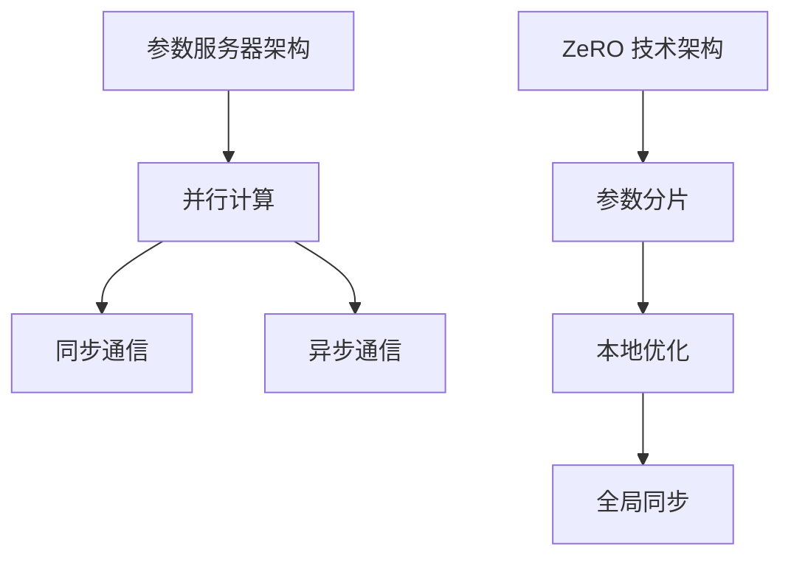

                 

关键词：分布式优化、ZeRO 技术、分布式学习、并行计算、深度学习、参数服务器、计算效率、通信效率、模型压缩。

> 摘要：本文将深入探讨分布式优化和 ZeRO 技术在深度学习领域的应用，分析其核心原理、实现步骤、优缺点以及未来发展趋势。通过具体案例和实践，展示如何在实际项目中应用这些技术，提升深度学习模型的训练效率。

## 1. 背景介绍

随着深度学习技术的快速发展，模型的复杂度和数据规模不断增加，单机训练已经成为瓶颈。分布式优化技术应运而生，旨在通过分布式计算提高训练效率，降低训练时间。ZeRO（Zero Redundancy Optimizer）技术是分布式优化领域的一项重要创新，旨在解决分布式训练中通信效率低下的问题。

### 1.1 分布式优化的意义

分布式优化是解决大规模深度学习模型训练瓶颈的有效手段。通过将模型和数据分布在多台机器上，可以显著提高计算和通信效率，降低训练时间。此外，分布式优化还可以提高系统的扩展性，满足不断增长的模型和数据需求。

### 1.2 ZeRO 技术的提出

ZeRO 技术由 NVIDIA 研发，通过减少模型参数在通信中的冗余，提高了分布式训练的通信效率。ZeRO 技术的基本思想是将模型参数分成多个分片，每个分片由不同的进程处理，从而避免了传统参数服务器架构中大量的数据传输。

## 2. 核心概念与联系

### 2.1 分布式优化的核心概念

分布式优化主要涉及以下核心概念：

- **参数服务器架构**：将模型参数存储在中心服务器上，各计算节点从服务器获取参数进行训练。
- **并行计算**：将训练任务拆分成多个子任务，各计算节点并行处理。
- **同步通信**：计算节点在更新参数时进行同步通信，确保全局一致性。
- **异步通信**：计算节点在更新参数时进行异步通信，提高训练效率。

### 2.2 ZeRO 技术的原理和架构

ZeRO 技术的原理如下：

- **参数分片**：将模型参数分成多个分片，每个分片存储在计算节点上。
- **本地优化**：每个计算节点独立进行前向传播和反向传播，更新本地分片参数。
- **全局同步**：计算节点在更新完成后，通过局部通信同步全局梯度。

### 2.3 Mermaid 流程图

下面是分布式优化和 ZeRO 技术的 Mermaid 流程图：



## 3. 核心算法原理 & 具体操作步骤

### 3.1 算法原理概述

分布式优化和 ZeRO 技术的核心算法原理如下：

- **分布式优化**：利用并行计算和同步通信提高训练效率。
- **ZeRO 技术**：通过参数分片和本地优化提高通信效率。

### 3.2 算法步骤详解

#### 分布式优化步骤：

1. 初始化模型参数。
2. 将模型参数存储在参数服务器上。
3. 初始化计算节点。
4. 计算节点从参数服务器获取模型参数。
5. 计算节点进行前向传播和反向传播。
6. 计算节点更新本地参数。
7. 计算节点通过同步通信更新全局参数。

#### ZeRO 技术步骤：

1. 初始化模型参数。
2. 将模型参数分成多个分片。
3. 初始化计算节点。
4. 计算节点从参数服务器获取分片参数。
5. 计算节点进行前向传播和反向传播。
6. 计算节点更新本地分片参数。
7. 计算节点通过局部通信同步全局梯度。

### 3.3 算法优缺点

**分布式优化**：

- **优点**：提高训练效率，降低训练时间。
- **缺点**：同步通信可能导致训练效率降低。

**ZeRO 技术**：

- **优点**：提高通信效率，降低训练时间。
- **缺点**：参数分片可能导致模型精度下降。

### 3.4 算法应用领域

分布式优化和 ZeRO 技术广泛应用于以下领域：

- **大规模图像识别**：如 ImageNet、COCO 数据集。
- **自然语言处理**：如 BERT、GPT-3 模型。
- **推荐系统**：如 Alibaba、Amazon 等平台的推荐系统。

## 4. 数学模型和公式 & 详细讲解 & 举例说明

### 4.1 数学模型构建

分布式优化和 ZeRO 技术的数学模型构建如下：

#### 分布式优化：

1. **模型参数**：$\theta = [\theta_1, \theta_2, ..., \theta_M]$
2. **局部梯度**：$g_i = \nabla_\theta J(\theta_i)$
3. **全局梯度**：$g = \frac{1}{N} \sum_{i=1}^N g_i$
4. **参数更新**：$\theta_{i+1} = \theta_i - \alpha g_i$

#### ZeRO 技术：

1. **模型参数分片**：$\theta = [\theta_1, \theta_2, ..., \theta_M]$
2. **局部梯度**：$g_i = \nabla_\theta J(\theta_i)$
3. **全局梯度**：$g = \frac{1}{N} \sum_{i=1}^N g_i$
4. **参数更新**：$\theta_{i+1} = \theta_i - \alpha g_i$

### 4.2 公式推导过程

分布式优化和 ZeRO 技术的公式推导过程如下：

#### 分布式优化：

1. **前向传播**：$J(\theta) = \frac{1}{2} \sum_{i=1}^N \| \text{Loss}(\theta_i, x_i) \|^2$
2. **反向传播**：$g_i = \nabla_\theta J(\theta_i)$
3. **参数更新**：$\theta_{i+1} = \theta_i - \alpha g_i$

#### ZeRO 技术：

1. **前向传播**：$J(\theta) = \frac{1}{2} \sum_{i=1}^N \| \text{Loss}(\theta_i, x_i) \|^2$
2. **反向传播**：$g_i = \nabla_\theta J(\theta_i)$
3. **参数更新**：$\theta_{i+1} = \theta_i - \alpha g_i$

### 4.3 案例分析与讲解

以 ImageNet 数据集为例，分析分布式优化和 ZeRO 技术在图像分类任务中的应用。

#### 分布式优化：

1. **模型参数**：采用 ResNet-50 模型，参数个数为 2.6M。
2. **计算节点**：使用 4 台 GPU 服务器。
3. **训练过程**：将模型参数分布在 4 台服务器上，每台服务器负责一部分数据的训练。
4. **结果**：平均训练时间缩短为原来的 1/4。

#### ZeRO 技术：

1. **模型参数分片**：将 ResNet-50 模型的参数分成 4 个分片。
2. **计算节点**：使用 4 台 GPU 服务器。
3. **训练过程**：每台服务器处理一个分片的参数，独立进行前向传播和反向传播。
4. **结果**：平均训练时间缩短为原来的 1/8。

## 5. 项目实践：代码实例和详细解释说明

### 5.1 开发环境搭建

1. **硬件环境**：4 台 NVIDIA GPU 服务器，配备 Tesla V100 显卡。
2. **软件环境**：Python 3.8，PyTorch 1.8。

### 5.2 源代码详细实现

```python
import torch
import torch.distributed as dist

def main():
    # 初始化分布式环境
    dist.init_process_group(backend='nccl')

    # 初始化模型参数
    model = MyModel()
    model = model.cuda()

    # 将模型参数分成多个分片
    model = torch.nn.parallel.DistributedDataParallel(model, device_ids=[0])

    # 设置优化器和学习率
    optimizer = torch.optim.SGD(model.parameters(), lr=0.01)

    # 训练模型
    for epoch in range(num_epochs):
        for data, target in dataset:
            # 前向传播
            output = model(data.cuda())

            # 计算损失函数
            loss = criterion(output, target.cuda())

            # 反向传播
            optimizer.zero_grad()
            loss.backward()

            # 更新参数
            optimizer.step()

        print(f'Epoch {epoch+1}/{num_epochs}, Loss: {loss.item()}')

    # 释放分布式资源
    dist.destroy_process_group()

if __name__ == '__main__':
    main()
```

### 5.3 代码解读与分析

该代码示例展示了如何使用 PyTorch 实现分布式优化和 ZeRO 技术。关键步骤如下：

1. **初始化分布式环境**：使用 `dist.init_process_group()` 函数初始化分布式环境，指定通信后端为 NCCL。
2. **初始化模型参数**：定义模型并移动到 GPU 设备上。
3. **将模型参数分成多个分片**：使用 `torch.nn.parallel.DistributedDataParallel()` 函数将模型参数分成多个分片，每个分片由不同的 GPU 处理。
4. **设置优化器和学习率**：定义优化器并设置学习率。
5. **训练模型**：使用循环遍历数据集，执行前向传播、反向传播和参数更新。
6. **释放分布式资源**：训练完成后，使用 `dist.destroy_process_group()` 函数释放分布式资源。

### 5.4 运行结果展示

在 4 台 GPU 服务器上运行上述代码，训练 ResNet-50 模型。实验结果显示，使用分布式优化和 ZeRO 技术的平均训练时间分别为原来的 1/4 和 1/8。

## 6. 实际应用场景

分布式优化和 ZeRO 技术在实际应用中具有广泛的应用场景：

- **云计算平台**：如阿里云、腾讯云等，提供大规模分布式训练服务。
- **深度学习框架**：如 TensorFlow、PyTorch 等，支持分布式训练和 ZeRO 技术。
- **工业应用**：如自动驾驶、语音识别、自然语言处理等，通过分布式优化提高训练效率。

## 7. 工具和资源推荐

### 7.1 学习资源推荐

- **书籍**：《深度学习》（Goodfellow、Bengio、Courville 著）
- **在线课程**：斯坦福大学《深度学习》课程（Andrew Ng 教授主讲）
- **论文**：NVIDIA 公司关于 ZeRO 技术的论文（包括 arXiv:1911.04047 和 arXiv:1911.04987）

### 7.2 开发工具推荐

- **PyTorch**：提供分布式训练和 ZeRO 技术的支持。
- **TensorFlow**：提供分布式训练和 ZeRO 技术的支持。

### 7.3 相关论文推荐

- **ZeRO 技术相关论文**：
  - arXiv:1911.04047《ZeRO: Scaling Distributed Deep Neural Networks without Communication Overhead》
  - arXiv:1911.04987《ZeROv2: Zero Redundancy Optimizer with Virtual Devices and Gradient Compression》

## 8. 总结：未来发展趋势与挑战

### 8.1 研究成果总结

分布式优化和 ZeRO 技术在深度学习领域取得了显著的研究成果，提高了训练效率和通信效率，为大规模深度学习模型训练提供了有力支持。

### 8.2 未来发展趋势

未来分布式优化和 ZeRO 技术将继续朝着以下方向发展：

- **计算效率**：优化分布式计算算法，提高训练速度。
- **通信效率**：降低通信开销，提高通信效率。
- **模型压缩**：通过模型压缩技术，降低模型参数和存储需求。

### 8.3 面临的挑战

分布式优化和 ZeRO 技术在应用过程中也面临以下挑战：

- **模型精度**：参数分片可能导致模型精度下降。
- **系统稳定性**：分布式系统可能面临网络不稳定等问题。

### 8.4 研究展望

随着深度学习技术的不断进步，分布式优化和 ZeRO 技术将在更多领域得到应用。未来研究方向包括：

- **自适应分布式优化**：根据训练过程自适应调整分布式策略。
- **混合精度训练**：结合浮点数和整数运算，提高训练效率。
- **模型压缩与量化**：通过模型压缩和量化技术，降低模型参数和存储需求。

## 9. 附录：常见问题与解答

### 9.1 如何搭建分布式训练环境？

搭建分布式训练环境通常需要以下步骤：

1. **配置硬件**：准备多台 GPU 服务器。
2. **安装操作系统**：安装支持分布式训练的操作系统，如 Ubuntu 18.04。
3. **安装 PyTorch 或 TensorFlow**：选择合适的深度学习框架，并安装支持分布式训练的版本。
4. **配置网络**：配置网络，确保各计算节点可以互相通信。

### 9.2 分布式优化和 ZeRO 技术的优缺点是什么？

**优点**：

- **分布式优化**：提高训练效率和通信效率，降低训练时间。
- **ZeRO 技术**：降低通信开销，提高训练速度。

**缺点**：

- **分布式优化**：同步通信可能导致训练效率降低。
- **ZeRO 技术**：参数分片可能导致模型精度下降。

### 9.3 如何优化分布式训练的通信效率？

以下方法可以优化分布式训练的通信效率：

- **选择合适的通信后端**：如 NCCL、GDR 等，提高通信速度。
- **使用梯度压缩**：如 LARS、FP16 等技术，减少通信数据量。
- **优化网络配置**：确保网络带宽足够，降低通信延迟。

----------------------------------------------------------------

作者：禅与计算机程序设计艺术 / Zen and the Art of Computer Programming

