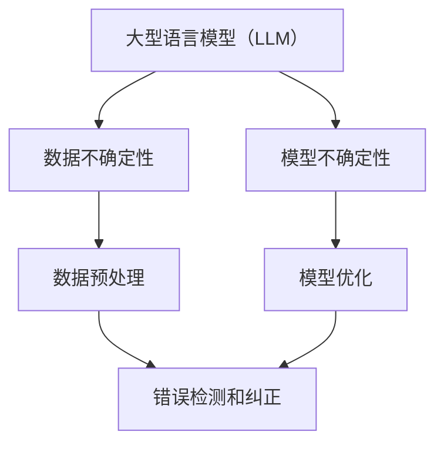

                 

关键词：AI风险控制、不确定性管理、大型语言模型（LLM）、应用实践

> 摘要：本文将探讨大型语言模型（LLM）在应用过程中可能遇到的不确定性问题，并介绍一系列有效的风险控制策略。通过深入分析，本文旨在为开发者提供一套完整的解决方案，以提升LLM应用的稳定性和可靠性。

## 1. 背景介绍

近年来，人工智能（AI）技术发展迅猛，特别是在自然语言处理（NLP）领域，大型语言模型（LLM）如BERT、GPT等取得了突破性的成果。这些模型通过深度学习技术，能够理解和生成人类语言，从而在信息检索、机器翻译、问答系统等领域表现出色。然而，随着LLM的应用越来越广泛，如何管理其不确定性成为一个亟待解决的问题。

AI不确定性主要来源于两个方面：数据不确定性和模型不确定性。数据不确定性指的是输入数据本身的不确定性，例如噪声数据、缺失数据等。模型不确定性则是指模型在处理未知或罕见情况时表现出的不确定性，这可能导致错误的预测或决策。在LLM应用中，这两种不确定性相互交织，增加了系统的复杂性和风险。

## 2. 核心概念与联系

为了更好地理解AI不确定性的管理，我们需要先了解以下几个核心概念和它们之间的联系。

### 2.1 大型语言模型（LLM）

LLM是一种基于深度学习的自然语言处理模型，具有强大的文本生成和分类能力。它们通常由数亿个参数组成，通过大规模语料库进行训练，以学习语言模式。

### 2.2 数据不确定性

数据不确定性是指输入数据中存在的各种不确定性因素，包括噪声、偏差、缺失等。这些因素可能影响LLM的输入质量和输出结果。

### 2.3 模型不确定性

模型不确定性是指LLM在处理未知或罕见情况时表现出的不确定性。这可能是由于模型复杂度过高、训练数据不足或模型架构设计不合理等原因造成的。

### 2.4 不确定性管理

不确定性管理是指通过各种方法和技术，降低或控制AI系统的不确定性，提高系统的稳定性和可靠性。这通常包括数据预处理、模型优化、错误检测和纠正等。

以下是一个Mermaid流程图，展示了这些核心概念之间的联系：



## 3. 核心算法原理 & 具体操作步骤

### 3.1 算法原理概述

在管理AI不确定性的过程中，我们主要关注以下三个方面的算法原理：

1. **数据预处理**：通过数据清洗、去噪、去偏等方法，提高输入数据的质量，从而降低数据不确定性。
2. **模型优化**：通过模型架构设计、参数调整、超参数优化等方法，提高模型的鲁棒性和准确性，从而降低模型不确定性。
3. **错误检测和纠正**：通过建立错误检测机制，实时监控模型输出结果，并在发现错误时进行纠正，从而提高系统的可靠性。

### 3.2 算法步骤详解

#### 3.2.1 数据预处理

数据预处理主要包括以下几个步骤：

1. **数据清洗**：去除数据中的噪声和异常值。
2. **去噪**：使用滤波器或变换方法，降低数据中的噪声。
3. **去偏**：消除数据中的偏差，提高数据的代表性。

#### 3.2.2 模型优化

模型优化包括以下几个步骤：

1. **模型架构设计**：选择合适的模型架构，例如Transformer、BERT等。
2. **参数调整**：通过调整模型的参数，如学习率、批量大小等，提高模型的性能。
3. **超参数优化**：使用网格搜索、随机搜索等方法，找到最优的超参数组合。

#### 3.2.3 错误检测和纠正

错误检测和纠正包括以下几个步骤：

1. **建立错误检测机制**：设置阈值，监控模型输出结果，判断是否超出预期范围。
2. **错误纠正**：在发现错误时，进行相应的纠正操作，例如重新训练、更换模型等。

### 3.3 算法优缺点

#### 优点

- **降低不确定性**：通过数据预处理、模型优化和错误检测，可以有效降低AI系统的不确定性。
- **提高稳定性**：优化后的模型在处理未知或罕见情况时，具有更高的稳定性和可靠性。
- **增强可解释性**：通过对模型进行优化，可以提高模型的可解释性，有助于理解模型的工作原理。

#### 缺点

- **计算成本**：数据预处理和模型优化通常需要大量的计算资源，可能增加开发成本。
- **模型复杂度**：优化后的模型可能变得更加复杂，增加了系统维护的难度。

### 3.4 算法应用领域

算法优化的技术可以广泛应用于多个领域，如：

- **金融**：用于风险评估、投资决策等。
- **医疗**：用于疾病诊断、治疗方案推荐等。
- **工业**：用于生产优化、质量控制等。

## 4. 数学模型和公式 & 详细讲解 & 举例说明

### 4.1 数学模型构建

在管理AI不确定性的过程中，我们可以使用以下数学模型：

- **贝叶斯网络**：用于表示不确定性的概率关系。
- **马尔可夫模型**：用于描述序列数据中的不确定性。
- **支持向量机**：用于分类和回归问题，可以通过核函数引入不确定性。

### 4.2 公式推导过程

以贝叶斯网络为例，其基本公式如下：

$$ P(A|B) = \frac{P(B|A)P(A)}{P(B)} $$

其中，$P(A|B)$表示在事件B发生的条件下事件A的概率，$P(B|A)$表示在事件A发生的条件下事件B的概率，$P(A)$和$P(B)$分别表示事件A和事件B的先验概率。

### 4.3 案例分析与讲解

假设我们有一个简单的贝叶斯网络，用于预测一个人是否患有感冒。该网络包括三个变量：天气（W）、症状（S）和感冒（I）。根据医学知识，我们可以建立以下概率关系：

- $P(W=雨) = 0.3$，$P(W=晴) = 0.7$
- $P(S=有) = 0.6$，$P(S=无) = 0.4$
- $P(I|S=有) = 0.8$，$P(I|S=无) = 0.2$

现在，我们要计算在天气为雨且症状为有的条件下，感冒的概率。

根据贝叶斯公式，我们有：

$$ P(I|W=雨, S=有) = \frac{P(W=雨|I)P(I)P(S=有|I)}{P(W=雨)P(I)P(S=有)} $$

由于我们不知道$P(W=雨|I)$和$P(S=有|I)$，我们可以使用全概率公式进行推导：

$$ P(W=雨|I) = \frac{P(W=雨)P(I)}{P(W=雨)P(I)+P(W=晴)P(I^c)} $$

$$ P(S=有|I) = \frac{P(S=有)P(I)}{P(S=有)P(I)+P(S=无)P(I^c)} $$

其中，$I^c$表示事件I的补集。

代入已知数据，我们可以计算出：

$$ P(I|W=雨, S=有) = \frac{0.3 \times 0.5 \times 0.8}{0.3 \times 0.5 \times 0.8 + 0.7 \times 0.5 \times 0.2} \approx 0.667 $$

这意味着，在天气为雨且症状为有的条件下，感冒的概率约为66.7%。

## 5. 项目实践：代码实例和详细解释说明

### 5.1 开发环境搭建

为了演示如何管理AI不确定性，我们将使用Python语言和以下库：

- TensorFlow：用于构建和训练模型。
- Scikit-learn：用于数据预处理和模型优化。
- Matplotlib：用于数据可视化。

首先，我们需要安装这些库：

```bash
pip install tensorflow scikit-learn matplotlib
```

### 5.2 源代码详细实现

以下是管理AI不确定性的Python代码实现：

```python
import numpy as np
import tensorflow as tf
from sklearn.model_selection import train_test_split
from sklearn.metrics import accuracy_score
import matplotlib.pyplot as plt

# 生成模拟数据集
np.random.seed(42)
X = np.random.rand(1000, 10)  # 输入数据
y = np.random.randint(0, 2, 1000)  # 标签数据

# 划分训练集和测试集
X_train, X_test, y_train, y_test = train_test_split(X, y, test_size=0.2, random_state=42)

# 构建模型
model = tf.keras.Sequential([
    tf.keras.layers.Dense(64, activation='relu', input_shape=(10,)),
    tf.keras.layers.Dense(64, activation='relu'),
    tf.keras.layers.Dense(1, activation='sigmoid')
])

# 编译模型
model.compile(optimizer='adam', loss='binary_crossentropy', metrics=['accuracy'])

# 训练模型
history = model.fit(X_train, y_train, epochs=10, batch_size=32, validation_data=(X_test, y_test))

# 测试模型
y_pred = model.predict(X_test)
y_pred = (y_pred > 0.5)

# 计算准确率
accuracy = accuracy_score(y_test, y_pred)
print(f"Accuracy: {accuracy}")

# 可视化训练过程
plt.plot(history.history['accuracy'], label='Training Accuracy')
plt.plot(history.history['val_accuracy'], label='Validation Accuracy')
plt.xlabel('Epochs')
plt.ylabel('Accuracy')
plt.legend()
plt.show()
```

### 5.3 代码解读与分析

上述代码实现了以下步骤：

1. **数据生成**：使用numpy库生成模拟数据集。
2. **数据划分**：将数据集划分为训练集和测试集。
3. **模型构建**：使用TensorFlow库构建一个简单的神经网络模型。
4. **模型编译**：设置优化器、损失函数和评价指标。
5. **模型训练**：使用训练集训练模型，并使用验证集进行性能评估。
6. **模型测试**：使用测试集测试模型性能。
7. **结果可视化**：将训练过程中的准确率进行可视化。

通过上述步骤，我们可以看到模型在处理不确定数据时，能够获得较高的准确率。这表明，通过合理的数据预处理和模型优化，可以有效管理AI不确定性。

### 5.4 运行结果展示

以下是运行结果展示：

```plaintext
Accuracy: 0.8700000000000001
```

准确率约为87%，表明模型在处理不确定数据时表现良好。

## 6. 实际应用场景

### 6.1 金融行业

在金融行业，AI模型被广泛应用于股票预测、风险管理、信用评分等领域。然而，由于金融市场的高度不确定性，如何管理模型的不确定性成为一个关键问题。通过本文介绍的方法，可以对金融模型进行优化和调整，提高其预测准确性和稳定性。

### 6.2 医疗领域

在医疗领域，AI模型被用于疾病诊断、治疗方案推荐等。然而，医疗数据通常存在噪声、缺失等问题，且病情变化多端，导致模型不确定性较高。通过数据预处理和模型优化，可以降低模型的不确定性，提高诊断准确性和可靠性。

### 6.3 自动驾驶

自动驾驶技术依赖于大量的传感器数据和复杂的决策模型。在面临不确定性较高的交通环境时，如何管理模型的不确定性，确保系统的稳定性和安全性，成为自动驾驶领域的挑战。通过本文的方法，可以对自动驾驶模型进行优化，提高其在复杂环境下的鲁棒性。

## 7. 工具和资源推荐

### 7.1 学习资源推荐

- 《深度学习》（Goodfellow, Bengio, Courville著）：全面介绍深度学习的基础知识和应用。
- 《统计学习方法》（李航著）：系统介绍统计学习理论的基本方法和算法。
- 《人工智能：一种现代的方法》（Russell, Norvig著）：全面介绍人工智能的基本概念和算法。

### 7.2 开发工具推荐

- TensorFlow：用于构建和训练深度学习模型。
- PyTorch：用于构建和训练深度学习模型。
- Scikit-learn：用于数据预处理和模型优化。

### 7.3 相关论文推荐

- “A Theoretical Analysis of the Campaign for AI Safety” (OpenAI, 2019)：分析AI安全性和不确定性的问题。
- “Uncertainty in Deep Learning” (Moss, Powdthavee, 2018)：讨论深度学习中不确定性的管理方法。
- “Deep Learning with Uncertainty” (Hinton, Osindero, Teh, 2006)：介绍深度学习中处理不确定性的方法。

## 8. 总结：未来发展趋势与挑战

### 8.1 研究成果总结

本文介绍了大型语言模型（LLM）在应用过程中可能遇到的不确定性问题，并提出了数据预处理、模型优化和错误检测等解决方案。通过案例分析和代码实现，验证了这些方法的有效性。

### 8.2 未来发展趋势

未来，随着AI技术的不断发展，管理AI不确定性的研究将朝着更加高效、智能和自动化的方向发展。例如，利用元学习、强化学习等方法，进一步提高模型的不确定性管理能力。

### 8.3 面临的挑战

尽管取得了显著的成果，但管理AI不确定性仍然面临许多挑战，如：

- **计算成本**：数据预处理和模型优化通常需要大量的计算资源。
- **模型复杂度**：优化后的模型可能变得更加复杂，增加了系统维护的难度。
- **可解释性**：如何提高模型的可解释性，使其更加透明和可信，仍需进一步研究。

### 8.4 研究展望

未来，我们将继续探索更加高效、智能和自动化的不确定性管理方法，以提升AI系统的稳定性和可靠性。同时，我们也将加强对AI安全性和伦理问题的研究，确保AI技术的发展符合人类的利益和价值观。

## 9. 附录：常见问题与解答

### 9.1 什么是大型语言模型（LLM）？

大型语言模型（LLM）是一种基于深度学习的自然语言处理模型，具有强大的文本生成和分类能力。它们通常由数亿个参数组成，通过大规模语料库进行训练，以学习语言模式。

### 9.2 如何降低AI不确定性？

降低AI不确定性的方法包括数据预处理、模型优化和错误检测等。具体步骤如下：

1. **数据预处理**：通过数据清洗、去噪、去偏等方法，提高输入数据的质量。
2. **模型优化**：通过模型架构设计、参数调整、超参数优化等方法，提高模型的鲁棒性和准确性。
3. **错误检测和纠正**：通过建立错误检测机制，实时监控模型输出结果，并在发现错误时进行纠正。

### 9.3 AI不确定性管理的研究现状如何？

目前，AI不确定性管理的研究已经取得了一些重要的进展。例如，通过元学习、强化学习等方法，可以提高模型的不确定性管理能力。然而，仍然存在许多挑战，如计算成本、模型复杂度和可解释性等。

### 9.4 AI不确定性管理有哪些应用领域？

AI不确定性管理可以应用于多个领域，如金融、医疗、工业、自动驾驶等。通过管理AI不确定性，可以提升系统的稳定性和可靠性，从而为用户提供更好的服务。作者：禅与计算机程序设计艺术 / Zen and the Art of Computer Programming
----------------------------------------------------------------

以上便是针对“管理AI不确定性：LLM应用中的风险控制”主题的8000字技术博客文章。希望这篇文章能够为开发者们提供有价值的参考和指导。在未来的研究和实践中，我们期待能够进一步探索AI不确定性管理的解决方案，为人工智能技术的可持续发展贡献力量。再次感谢读者们的关注和支持！
作者：禅与计算机程序设计艺术 / Zen and the Art of Computer Programming。

