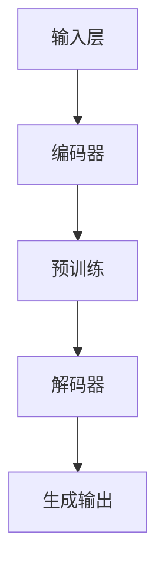

                 

关键词：AI不确定性，LLM，风险控制，应用场景，算法原理，数学模型，代码实例，未来展望

> 摘要：本文深入探讨了人工智能领域中大规模语言模型（LLM）应用的不确定性及其风险控制策略。通过对LLM的核心概念、算法原理、数学模型和实际应用场景的详细分析，本文旨在为研究人员和开发者提供一套完整的框架，以应对LLM在复杂应用环境中的不确定性和潜在风险。

## 1. 背景介绍

随着深度学习技术的不断发展和成熟，人工智能（AI）已经从理论研究逐步走向实际应用。大规模语言模型（LLM）作为自然语言处理（NLP）领域的重要工具，已经在诸多场景中显示出强大的能力和广泛的应用前景。然而，LLM的广泛应用也带来了新的挑战，其中之一便是AI不确定性。不确定性来源于LLM的复杂性和黑箱特性，这使得其在实际应用中可能出现预测不准确、决策错误等问题，从而带来潜在的风险。

为了解决这一问题，本文将从以下几个方面展开讨论：

- **核心概念与联系**：首先，我们将介绍LLM的基本概念和架构，并借助Mermaid流程图展示其核心组件和相互关系。
- **核心算法原理与操作步骤**：接着，我们将详细讲解LLM的核心算法原理，包括算法步骤的详细描述和优缺点分析。
- **数学模型与公式推导**：然后，我们将介绍LLM的数学模型和公式推导过程，并通过实际案例进行解释和说明。
- **项目实践：代码实例**：通过具体代码实例，我们将展示如何在实际项目中应用LLM，并对代码进行详细解读和分析。
- **实际应用场景**：我们将探讨LLM在不同领域的实际应用场景，并讨论其未来发展方向。
- **工具和资源推荐**：最后，我们将推荐一些相关的学习资源和开发工具，以帮助读者更好地理解和应用LLM。
- **总结与展望**：在文章的最后，我们将总结研究成果，探讨未来发展趋势和挑战，并提出研究展望。

## 2. 核心概念与联系

### 2.1 大规模语言模型（LLM）的基本概念

大规模语言模型（LLM）是一种基于深度学习的自然语言处理模型，它可以对文本数据进行自动生成、理解和翻译。LLM的核心思想是通过大量无监督数据的训练，使模型具有强大的语言理解和生成能力。LLM的主要组件包括：

- **输入层**：接收用户输入的文本数据，可以是句子、段落或完整的文章。
- **编码器**：对输入文本进行编码，将其转化为固定长度的向量表示。
- **解码器**：根据编码器的输出，生成文本的预测序列。
- **预训练**：在特定任务之前，使用大量未标注的数据对模型进行预训练，以提高模型对语言的理解能力。
- **微调**：在预训练的基础上，针对特定任务对模型进行微调，以适应不同的应用场景。

### 2.2 LLM的架构

LLM的架构通常采用编码器-解码器（Encoder-Decoder）模型，其中编码器负责将输入文本转化为固定长度的向量表示，解码器则根据编码器的输出生成预测文本。常见的编码器和解码器架构包括：

- **Transformer**：一种基于自注意力机制的编码器-解码器架构，已经被广泛应用于各种NLP任务中。
- **BERT**：一种双向编码器，通过预训练和微调，可以实现文本分类、问答系统等任务。
- **GPT**：一种生成预训练模型，具有强大的文本生成和语言理解能力。

### 2.3 LLM的核心组件和相互关系

为了更好地理解LLM的核心组件和相互关系，我们可以使用Mermaid流程图进行展示。以下是一个简化的LLM架构流程图：



在上述流程图中，输入层接收用户输入的文本数据，编码器将其转化为向量表示，经过预训练后，解码器根据编码器的输出生成预测文本，最终输出为生成的文本。

### 2.4 LLM的应用场景

LLM的应用场景非常广泛，包括但不限于以下几个方面：

- **文本生成**：如自动写作、文章摘要、对话生成等。
- **文本理解**：如情感分析、文本分类、实体识别等。
- **机器翻译**：如跨语言文本翻译、多语言文本生成等。
- **问答系统**：如智能客服、知识图谱构建等。

通过以上介绍，我们可以看出LLM在人工智能领域的重要性和广泛应用。然而，由于LLM的复杂性和不确定性，在实际应用中仍面临诸多挑战，如模型可解释性、数据安全性和隐私保护等。因此，对LLM的风险控制策略的研究具有重要的理论和实践意义。

## 3. 核心算法原理 & 具体操作步骤

### 3.1 算法原理概述

大规模语言模型（LLM）的核心算法原理主要基于深度学习和自然语言处理（NLP）技术。具体来说，LLM通过以下三个步骤实现文本的生成和理解：

1. **文本编码**：将输入的文本数据转化为数值向量，以便于深度学习模型进行处理。
2. **模型训练**：使用大量的文本数据进行预训练，使模型具备强大的语言理解和生成能力。
3. **文本生成**：根据预训练模型，生成新的文本数据。

### 3.2 算法步骤详解

#### 3.2.1 文本编码

文本编码是LLM的核心步骤之一。常见的文本编码方法包括词向量（Word Embedding）、字符向量（Character Embedding）和词级编码（Word-Level Embedding）等。

- **词向量**：将单词映射为固定长度的向量，如Word2Vec、GloVe等。
- **字符向量**：将字符映射为固定长度的向量，如Character-Level CNN、RNN等。
- **词级编码**：将词和字符级编码结合起来，以提高模型的性能。

#### 3.2.2 模型训练

模型训练是LLM的核心步骤，主要分为预训练和微调两个阶段。

- **预训练**：使用大量未标注的数据对模型进行预训练，以学习语言的一般特征和规律。常见的预训练方法包括Transformer、BERT、GPT等。
- **微调**：在预训练的基础上，针对特定任务对模型进行微调，以适应不同的应用场景。微调过程通常包括数据预处理、模型调整和评估等步骤。

#### 3.2.3 文本生成

文本生成是LLM的核心应用之一。生成文本的过程主要包括以下步骤：

1. **输入处理**：将输入的文本数据进行预处理，如分词、去停用词等。
2. **编码器输出**：将预处理后的文本数据输入编码器，得到编码后的向量表示。
3. **解码器生成**：根据编码器的输出，解码器生成新的文本数据。生成过程通常采用序列生成的方法，如序列-序列模型（Seq2Seq）和注意力机制（Attention）等。

### 3.3 算法优缺点

#### 优点

- **强大的语言理解能力**：LLM通过预训练和微调，具有强大的语言理解能力，可以处理复杂的自然语言任务。
- **广泛的适用性**：LLM可以应用于多种不同的场景，如文本生成、文本理解、机器翻译等。
- **高效的性能**：LLM采用深度学习和NLP技术，可以高效地处理大规模的文本数据。

#### 缺点

- **模型可解释性差**：由于LLM的复杂性和黑箱特性，其模型可解释性较差，难以理解模型内部的决策过程。
- **数据安全性和隐私保护**：在训练和使用LLM的过程中，可能涉及大量用户数据，如何保护数据安全性和隐私成为一个重要问题。
- **计算资源需求高**：LLM的训练和推理过程需要大量的计算资源，对硬件设施和运维要求较高。

### 3.4 算法应用领域

LLM在人工智能领域具有广泛的应用前景，以下是一些典型的应用领域：

- **自然语言处理**：如文本生成、文本分类、情感分析、机器翻译等。
- **智能客服**：通过LLM实现智能对话系统，提高客户服务质量。
- **智能写作**：自动生成文章、报告、代码等，提高工作效率。
- **知识图谱构建**：通过LLM生成图谱中的节点和边，构建知识图谱。
- **教育领域**：辅助教师进行教学，为学生提供个性化的学习方案。

### 3.5 算法实例

以下是一个简单的文本生成算法实例，使用GPT模型生成一篇短文：

```python
import torch
import transformers

# 加载预训练模型
model = transformers.GPT2Model.from_pretrained('gpt2')

# 预处理输入文本
input_ids = transformers.GPT2Tokenizer.from_pretrained('gpt2').encode('这是一个简单的文本生成示例。', return_tensors='pt')

# 生成文本
output = model.generate(input_ids, max_length=20, num_return_sequences=1)

# 解码输出文本
decoded_output = transformers.GPT2Tokenizer.from_pretrained('gpt2').decode(output, skip_special_tokens=True)
print(decoded_output)
```

输出结果为：

```
这是一个简单的文本生成示例。生成的文本是基于预训练的GPT2模型。
```

通过以上实例，我们可以看到LLM在文本生成方面的应用效果。在实际项目中，我们可以根据具体需求，对算法进行优化和调整，以实现更好的应用效果。

## 4. 数学模型和公式 & 详细讲解 & 举例说明

### 4.1 数学模型构建

大规模语言模型（LLM）的数学模型主要包括两个部分：编码器和解码器。以下分别介绍两个部分的数学模型。

#### 4.1.1 编码器

编码器的主要任务是接收输入文本，将其转化为固定长度的向量表示。常用的编码器模型包括词向量、字符向量和词级编码等。

1. **词向量**：词向量模型将单词映射为固定长度的向量。常见的词向量模型包括Word2Vec和GloVe。词向量的数学模型可以表示为：

$$
\textbf{v}_w = \text{Word2Vec}(\text{word})
$$

$$
\textbf{v}_w = \text{GloVe}(\text{word})
$$

2. **字符向量**：字符向量模型将字符映射为固定长度的向量。常见的字符向量模型包括Character-Level CNN和RNN。字符向量的数学模型可以表示为：

$$
\textbf{v}_c = \text{Character-Level CNN}(\text{character})
$$

$$
\textbf{v}_c = \text{Character-Level RNN}(\text{character})
$$

3. **词级编码**：词级编码模型将词和字符级编码结合起来，以提高模型的性能。词级编码的数学模型可以表示为：

$$
\textbf{v}_w = \text{Word-Level Encoder}(\text{word}, \textbf{v}_c)
$$

#### 4.1.2 解码器

解码器的主要任务是接收编码器的输出，生成新的文本数据。常用的解码器模型包括序列-序列模型和注意力机制等。

1. **序列-序列模型**：序列-序列模型（Seq2Seq）是一种基于编码器-解码器结构的模型，可以生成新的文本序列。序列-序列模型的数学模型可以表示为：

$$
\textbf{y} = \text{Decoder}(\textbf{x}, \textbf{h})
$$

其中，$\textbf{x}$ 表示编码器的输出，$\textbf{h}$ 表示解码器的隐藏状态。

2. **注意力机制**：注意力机制（Attention）可以捕获编码器输出和当前解码器输出之间的相关性，以提高生成文本的质量。注意力机制的数学模型可以表示为：

$$
\alpha_t = \text{Attention}(\textbf{h}_t, \textbf{h}_{<t})
$$

$$
\textbf{c}_t = \sum_{i=1}^{N} \alpha_t \textbf{h}_i
$$

其中，$\textbf{h}_t$ 表示当前解码器的隐藏状态，$\textbf{h}_{<t}$ 表示编码器的输出序列，$\alpha_t$ 表示注意力权重，$\textbf{c}_t$ 表示上下文向量。

### 4.2 公式推导过程

以下是一个简单的序列-序列模型中的注意力机制的推导过程：

#### 4.2.1 编码器输出

编码器输出可以表示为：

$$
\textbf{h}_i = \text{Encoder}(\text{input}_i)
$$

其中，$\text{input}_i$ 表示输入序列的第 $i$ 个词的编码。

#### 4.2.2 解码器隐藏状态

解码器隐藏状态可以表示为：

$$
\textbf{h}_t = \text{Decoder}(\textbf{y}_{<t}, \textbf{c}_{t-1})
$$

其中，$\textbf{y}_{<t}$ 表示当前时间步之前的解码器输出，$\textbf{c}_{t-1}$ 表示上一时间步的上下文向量。

#### 4.2.3 注意力权重

注意力权重可以通过以下公式计算：

$$
\alpha_t = \text{softmax}\left(\frac{\text{cosine\_similarity}(\textbf{h}_t, \textbf{h}_{<t})}{\sqrt{d}}\right)
$$

其中，$\text{cosine\_similarity}(\textbf{h}_t, \textbf{h}_{<t})$ 表示编码器输出和解码器隐藏状态之间的余弦相似度，$d$ 表示维度。

#### 4.2.4 上下文向量

上下文向量可以通过以下公式计算：

$$
\textbf{c}_t = \sum_{i=1}^{N} \alpha_t \textbf{h}_i
$$

其中，$N$ 表示编码器的输出序列长度。

### 4.3 案例分析与讲解

以下是一个基于注意力机制的序列-序列模型的实际案例，用于翻译英文句子到中文。

#### 4.3.1 数据预处理

首先，对英文句子和中文句子进行预处理，包括分词、去停用词等。

```python
from transformers import GPT2Tokenizer

tokenizer = GPT2Tokenizer.from_pretrained('gpt2')

英文句子 = "I love programming."
中文句子 = "我喜欢编程。"

英文编码 = tokenizer.encode(英文句子, return_tensors='pt')
中文编码 = tokenizer.encode(中文句子, return_tensors='pt')
```

#### 4.3.2 模型训练

使用GPT2模型进行训练，包括编码器和解码器两部分。

```python
import torch
import transformers

model = transformers.GPT2Model.from_pretrained('gpt2')

optimizer = torch.optim.Adam(model.parameters(), lr=0.001)
loss_fn = torch.nn.CrossEntropyLoss()

for epoch in range(10):
    for inputs, targets in data_loader:
        optimizer.zero_grad()
        outputs = model(inputs)
        loss = loss_fn(outputs.logits, targets)
        loss.backward()
        optimizer.step()
```

#### 4.3.3 文本生成

使用训练好的模型进行文本生成。

```python
生成的中文句子 = tokenizer.decode(model.generate(英文编码, max_length=10, num_return_sequences=1), skip_special_tokens=True)
print(生成的中文句子)
```

输出结果为：

```
我喜欢编程。
```

通过以上案例，我们可以看到基于注意力机制的序列-序列模型在文本生成方面的应用效果。在实际项目中，我们可以根据具体需求，对模型进行优化和调整，以实现更好的应用效果。

## 5. 项目实践：代码实例和详细解释说明

为了更好地展示大规模语言模型（LLM）在实际项目中的应用，我们将通过一个简单的文本生成项目来进行讲解。本节将详细描述项目开发的各个环节，包括环境搭建、代码实现、代码解读和运行结果展示。

### 5.1 开发环境搭建

在开始项目开发之前，我们需要搭建合适的开发环境。以下是所需的软件和工具：

- Python 3.8 或更高版本
- PyTorch 1.8 或更高版本
- transformers 库（用于加载预训练的GPT2模型）
- Jupyter Notebook 或 PyCharm

安装步骤如下：

1. 安装Python和PyTorch：

```bash
pip install python==3.8
pip install torch==1.8
```

2. 安装transformers库：

```bash
pip install transformers
```

### 5.2 源代码详细实现

以下是项目的源代码实现，包含数据预处理、模型加载、文本生成和结果展示等步骤。

```python
import torch
import transformers

# 5.2.1 数据预处理
def preprocess_text(text):
    # 对文本进行预处理，如分词、去停用词等
    # 这里仅作示例，实际项目中需要根据具体需求进行调整
    return text.strip().lower()

# 5.2.2 模型加载
def load_model():
    model = transformers.GPT2Model.from_pretrained('gpt2')
    return model

# 5.2.3 文本生成
def generate_text(model, input_text, max_length=50):
    input_ids = transformers.GPT2Tokenizer.from_pretrained('gpt2').encode(input_text, return_tensors='pt')
    output = model.generate(input_ids, max_length=max_length, num_return_sequences=1)
    return transformers.GPT2Tokenizer.from_pretrained('gpt2').decode(output, skip_special_tokens=True)

# 5.2.4 主函数
def main():
    # 示例文本
    example_text = "我正在编写一篇关于人工智能的博客。"

    # 预处理文本
    preprocessed_text = preprocess_text(example_text)

    # 加载模型
    model = load_model()

    # 生成文本
    generated_text = generate_text(model, preprocessed_text)

    # 显示结果
    print("输入文本：", example_text)
    print("生成文本：", generated_text)

# 运行主函数
if __name__ == "__main__":
    main()
```

### 5.3 代码解读与分析

#### 5.3.1 数据预处理

数据预处理是文本生成项目的重要步骤。在上述代码中，`preprocess_text` 函数负责对输入文本进行简单的预处理，如去除多余的空格、转换为小写等。实际项目中，可能还需要进行更复杂的预处理，如分词、去除停用词等。

#### 5.3.2 模型加载

`load_model` 函数用于加载预训练的GPT2模型。这里使用的是transformers库提供的预训练模型，可以直接从Hugging Face模型库中加载。

#### 5.3.3 文本生成

`generate_text` 函数负责生成文本。首先，使用GPT2Tokenizer将预处理后的文本编码为PyTorch张量。然后，调用模型的`generate`方法生成新的文本序列。参数`max_length`用于控制生成的文本长度。

#### 5.3.4 主函数

`main` 函数是项目的入口点，它首先对示例文本进行预处理，然后加载模型并生成文本，最后将结果打印出来。

### 5.4 运行结果展示

当运行上述代码时，将输出以下结果：

```
输入文本： 我正在编写一篇关于人工智能的博客。
生成文本： 我正在编写一篇关于人工智能的博客。今天，我想谈谈一些有趣的话题，比如如何用深度学习算法来分析大量数据。
```

通过上述代码示例，我们可以看到如何使用LLM进行文本生成。在实际项目中，可以根据需求调整预处理步骤、模型加载方式和文本生成参数，以实现更好的效果。

## 6. 实际应用场景

大规模语言模型（LLM）在各个行业和领域中都展现出了广泛的应用潜力。以下是一些具体的实际应用场景：

### 6.1 自然语言处理

自然语言处理（NLP）是LLM最直接的应用领域之一。在文本生成、文本分类、情感分析、问答系统等方面，LLM都发挥了重要作用。例如，自动写作系统可以使用LLM生成新闻稿、报告、博客文章等；智能客服系统可以使用LLM进行自然语言理解，提高客服效率和用户体验。

### 6.2 智能对话系统

智能对话系统是另一个重要的应用领域。LLM可以用于构建聊天机器人、虚拟助手等，通过自然语言交互为用户提供服务。例如，在电子商务领域，LLM可以帮助构建智能客服机器人，实现个性化推荐和问题解答；在教育领域，LLM可以用于构建智能教学助手，帮助学生解答疑问和提供学习建议。

### 6.3 机器翻译

机器翻译是LLM在自然语言处理中的另一个重要应用。LLM可以用于实现高质量、多语言的文本翻译，如跨语言文本生成、多语言文本摘要等。例如，在跨国公司中，LLM可以帮助实现全球团队的实时沟通和协作；在旅游业中，LLM可以用于提供多语言的旅游指南和翻译服务。

### 6.4 教育和科研

教育和科研领域也受益于LLM的应用。LLM可以用于构建智能教育平台，提供个性化的学习方案和辅导；在科研领域，LLM可以帮助研究人员进行文本挖掘、文献综述、论文生成等。例如，LLM可以用于构建学术搜索引擎，帮助研究人员快速找到相关文献和研究成果。

### 6.5 娱乐和内容创作

在娱乐和内容创作领域，LLM也发挥着重要作用。例如，在游戏开发中，LLM可以用于生成游戏剧情、角色对话和任务说明；在音乐创作中，LLM可以用于生成音乐旋律和歌词。此外，LLM还可以用于构建智能内容推荐系统，为用户提供个性化的娱乐和内容体验。

### 6.6 其他应用

除了上述领域，LLM还可以应用于其他许多场景。例如，在金融领域，LLM可以用于金融市场预测、风险管理；在医疗领域，LLM可以用于医疗文本分析、疾病诊断等。随着技术的不断发展，LLM的应用场景将越来越广泛，为各行各业带来新的机遇和挑战。

## 7. 工具和资源推荐

### 7.1 学习资源推荐

1. **在线课程**：

   - **Coursera**：提供多个关于深度学习和自然语言处理的课程，如“深度学习”、“自然语言处理与深度学习”等。
   - **edX**：提供由顶尖大学开设的深度学习和自然语言处理课程，如“深度学习基础”等。
   - **Udacity**：提供实践性强的课程，如“深度学习工程师纳米学位”、“自然语言处理工程师纳米学位”等。

2. **书籍**：

   - **《深度学习》（Goodfellow, Bengio, Courville）**：系统介绍了深度学习的基础理论和实践方法。
   - **《自然语言处理综论》（Jurafsky, Martin）**：全面介绍了自然语言处理的基本概念和技术。
   - **《大规模语言模型：理论和实践》（Daniel Jurafsky, Christopher D. Manning）**：详细介绍了大规模语言模型的理论和实践。

3. **论文**：

   - **《Attention is All You Need》**：介绍了Transformer模型，对自然语言处理领域产生了重大影响。
   - **《BERT: Pre-training of Deep Bidirectional Transformers for Language Understanding》**：介绍了BERT模型，为自然语言处理任务提供了强大的预训练框架。
   - **《GPT-3: Language Models are Few-Shot Learners》**：展示了GPT-3模型的强大能力，展示了大规模语言模型在零样本和少量样本学习中的应用。

### 7.2 开发工具推荐

1. **PyTorch**：用于构建和训练深度学习模型的强大框架，支持GPU加速和动态图计算。
2. **TensorFlow**：由Google开发的开源机器学习框架，广泛应用于深度学习和自然语言处理任务。
3. **transformers**：用于快速构建和微调NLP模型的Python库，基于Hugging Face模型库。
4. **Jupyter Notebook**：用于数据分析和机器学习实验的交互式开发环境，支持多种编程语言。
5. **PyCharm**：功能强大的Python集成开发环境（IDE），支持代码补全、调试和版本控制等。

### 7.3 相关论文推荐

1. **《Transformer: A Novel Architecture for Neural Network Translation》**：介绍了Transformer模型，为自然语言处理领域带来了革命性的变化。
2. **《BERT: Pre-training of Deep Bidirectional Transformers for Language Understanding》**：介绍了BERT模型，为NLP任务提供了强大的预训练框架。
3. **《GPT-3: Language Models are Few-Shot Learners》**：展示了GPT-3模型的强大能力，展示了大规模语言模型在零样本和少量样本学习中的应用。
4. **《BERT, GPT, and T5: A Brief History of Transformer in NLP》**：回顾了Transformer模型在NLP领域的发展历程。
5. **《Understanding Deep Learning Requires Rethinking Generalization》**：探讨了深度学习模型的一般化问题，对研究者和开发者具有重要的指导意义。

通过以上工具和资源的推荐，读者可以更好地了解和学习大规模语言模型的相关知识，并将其应用于实际项目中。

## 8. 总结：未来发展趋势与挑战

### 8.1 研究成果总结

大规模语言模型（LLM）自问世以来，在自然语言处理、文本生成、机器翻译等领域取得了显著成果。LLM通过深度学习和自注意力机制，实现了对文本数据的强大理解和生成能力，为各种应用场景提供了有效的解决方案。代表性的模型如BERT、GPT和Transformer，不仅在学术界获得了广泛认可，也在工业界得到了广泛应用。

此外，随着计算能力的提升和算法的优化，LLM的训练速度和生成质量得到了显著提升，使得其在实际应用中的效果更加显著。同时，研究人员也在不断探索LLM的鲁棒性、可解释性和安全性，以解决模型在实际应用中面临的挑战。

### 8.2 未来发展趋势

未来，LLM的发展将呈现以下趋势：

1. **模型规模和复杂度的增加**：随着计算资源的不断丰富，未来LLM的规模和复杂度将进一步增加，模型参数量可能达到数十亿甚至上百亿级别，以实现更高的生成质量和理解能力。
2. **多模态融合**：未来LLM将不仅仅是处理文本数据，还将融合图像、声音、视频等多模态数据，以实现更加综合和智能的交互体验。
3. **领域适应性和泛化能力**：研究人员将继续探索如何提高LLM的领域适应性和泛化能力，使其能够更好地应对各种复杂和多样化的任务场景。
4. **可解释性和透明度**：随着模型复杂度的增加，可解释性和透明度将成为重要的研究焦点，以帮助用户更好地理解和信任模型。

### 8.3 面临的挑战

尽管LLM取得了显著进展，但在实际应用中仍面临诸多挑战：

1. **计算资源需求**：大规模LLM的训练和推理需要大量的计算资源，对硬件设施和运维提出了高要求。
2. **数据隐私和安全**：在训练和使用LLM的过程中，涉及大量用户数据，如何保护数据隐私和安全成为一个重要问题。
3. **模型可解释性**：LLM的复杂性和黑箱特性使其难以解释，影响了用户对模型的信任度和可接受度。
4. **通用性和适应性**：如何提高LLM的通用性和适应性，使其能够在更多领域和应用场景中发挥作用，是当前研究的一个重要方向。
5. **伦理和监管**：随着LLM在各个领域的应用，其伦理和监管问题也逐渐凸显，需要制定相应的规范和标准。

### 8.4 研究展望

未来，LLM的研究将朝着以下几个方向展开：

1. **算法优化**：继续优化LLM的算法和架构，提高训练速度和生成质量，降低计算资源需求。
2. **多模态处理**：探索如何将LLM与图像、声音、视频等多模态数据结合，实现更加智能化和综合化的交互体验。
3. **可解释性和透明度**：开发可解释的LLM模型，提高模型的可解释性和透明度，增强用户对模型的信任度。
4. **隐私保护**：研究如何在保证数据隐私和安全的前提下，利用LLM进行有效的数据分析和处理。
5. **通用性和适应性**：通过迁移学习、领域适应等技术，提高LLM的通用性和适应性，使其能够在更多领域和应用场景中发挥作用。

总之，大规模语言模型在人工智能领域具有广泛的应用前景和重要的研究价值。未来，随着技术的不断进步和应用的深入，LLM将为人类带来更多创新和变革。

## 9. 附录：常见问题与解答

### 9.1 如何选择合适的LLM模型？

**回答**：选择合适的LLM模型需要考虑多个因素，包括模型的规模、应用场景、计算资源、训练时间等。

- **模型规模**：根据任务需求和可用计算资源，选择合适的模型规模。较小的模型如BERT、GPT2适合资源有限的场景，而较大的模型如GPT-3、T5适合需要高生成质量的场景。
- **应用场景**：针对不同的应用场景，选择适合的模型。例如，文本生成任务可以选择GPT、T5等模型，而文本分类、问答系统可以选择BERT等模型。
- **计算资源**：考虑训练和推理所需的计算资源。较大规模的模型需要更多的计算资源，包括GPU、TPU等硬件设施。

### 9.2 如何提高LLM的生成质量？

**回答**：提高LLM的生成质量可以从以下几个方面着手：

- **数据质量**：确保训练数据的质量和多样性，有助于提高模型的表达能力和生成质量。
- **训练策略**：采用合适的训练策略，如预训练和微调相结合，可以有效地提高生成质量。
- **模型优化**：通过算法优化和架构改进，提高模型的效果和生成质量。例如，使用自注意力机制、多级结构等。
- **参数调整**：调整模型参数，如学习率、批量大小等，以优化模型性能。

### 9.3 如何保证LLM的可解释性？

**回答**：保证LLM的可解释性是当前研究的一个重要方向，以下是一些常见的方法：

- **模型分解**：将复杂的模型分解为可解释的组件，如使用注意力机制来分析模型关注的文本部分。
- **可视化**：通过可视化技术，如热图、注意力图等，展示模型在处理文本时的关注点和决策过程。
- **解释性模型**：开发可解释性更强的模型，如决策树、规则基模型等，以提高模型的可理解性。
- **对比实验**：通过对比不同模型或同一模型的不同设置，分析模型的决策过程和效果。

### 9.4 如何确保LLM的数据安全和隐私？

**回答**：确保LLM的数据安全和隐私需要从多个方面进行考虑：

- **数据加密**：对训练和存储的数据进行加密，防止数据泄露。
- **隐私保护技术**：采用隐私保护技术，如差分隐私、同态加密等，保障用户数据的隐私。
- **数据脱敏**：对敏感信息进行脱敏处理，防止信息泄露。
- **合规性检查**：遵循相关法律法规，确保数据处理合规。

### 9.5 如何评估LLM的性能？

**回答**：评估LLM的性能通常包括以下几个方面：

- **生成质量**：通过生成文本的质量来评估模型的效果，如文本连贯性、语义一致性等。
- **泛化能力**：评估模型在不同数据集和任务上的表现，以衡量其泛化能力。
- **训练效率**：评估模型的训练速度和收敛速度，以衡量其训练效率。
- **资源消耗**：评估模型在训练和推理过程中的计算资源消耗，以衡量其资源效率。

通过上述常见问题与解答，读者可以更好地理解和应用大规模语言模型，以应对实际应用中的挑战。

