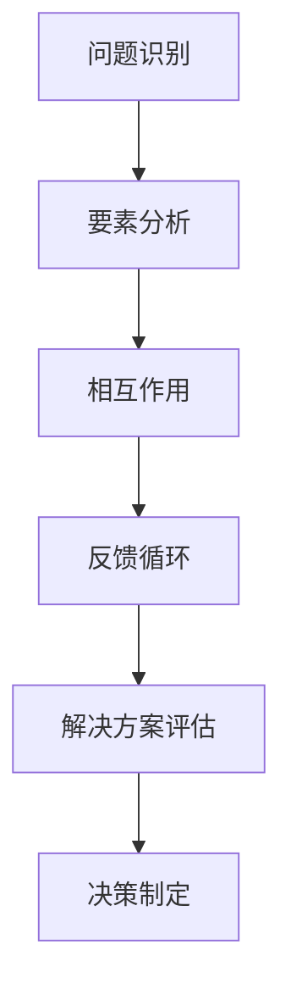

                 

关键词：系统思考，管理能力，复杂性科学，决策支持系统，战略规划

> 摘要：在日益复杂和动态的商业环境中，管理者必须具备系统思考能力，以更好地理解和应对各种挑战。本文将探讨系统思考的核心概念、实践方法及其在管理中的应用，并提供建议和资源，帮助管理者提升系统思考能力，从而更好地引领组织走向成功。

## 1. 背景介绍

在过去的几十年里，全球经济和社会环境发生了巨大的变化。全球化、技术创新、市场竞争加剧、资源短缺和环境问题等因素使得复杂性成为现代管理面临的主要挑战。传统的线性思维和方法已经无法应对这些复杂的问题。管理者需要从整体和系统的角度来理解和管理组织，这就需要系统思考能力的培养。

系统思考是一种分析和解决问题的方法论，它强调从整体出发，理解系统内部各种因素之间的相互作用和反馈循环。这种方法论可以帮助管理者更好地应对复杂问题，提高决策质量，增强组织的适应性和创新能力。

## 2. 核心概念与联系

### 2.1 复杂性科学

复杂性科学是一门跨学科的研究领域，它关注复杂系统的结构、行为和演化。复杂性科学的核心观点是，复杂系统是由许多相互作用的组成部分组成的，这些组成部分之间的相互作用会导致系统的复杂行为。因此，理解复杂系统的关键在于识别和分析系统中的关键要素及其相互作用。

### 2.2 系统思维

系统思维是一种认知框架，它帮助管理者从整体和系统的角度来理解问题。系统思维的核心是识别和分析系统中的关键要素及其相互作用，理解系统中的反馈循环和延迟效应。系统思维不仅关注问题的表面现象，还关注问题的根本原因和潜在的解决方案。

### 2.3 决策支持系统

决策支持系统是一种计算机化的系统，它可以帮助管理者收集、分析和解释信息，以便做出更明智的决策。决策支持系统通常包括数据收集、数据分析、模型模拟和可视化等组成部分。它可以帮助管理者更好地理解复杂问题，识别潜在的解决方案，并评估这些解决方案的潜在影响。

### 2.4 Mermaid 流程图

以下是一个简单的 Mermaid 流程图，用于描述系统思维的核心概念：



## 3. 核心算法原理 & 具体操作步骤

### 3.1 算法原理概述

系统思考的核心算法是因果图和系统动力学模型。因果图是一种图形化的工具，用于表示系统中的关键要素及其相互作用。系统动力学模型是一种基于因果图的数学模型，用于模拟系统的动态行为。

### 3.2 算法步骤详解

#### 步骤1：问题识别

首先，管理者需要识别和分析组织面临的问题。这包括理解问题的表面现象和根本原因。

#### 步骤2：要素分析

接下来，管理者需要识别系统中的关键要素，包括人员、资源、流程和战略等。

#### 步骤3：相互作用

然后，管理者需要分析这些关键要素之间的相互作用，包括直接和间接的相互影响。

#### 步骤4：反馈循环

管理者需要识别系统中的反馈循环，这些反馈循环可能导致系统行为的非线性变化。

#### 步骤5：解决方案评估

最后，管理者需要基于系统动力学模型评估不同的解决方案，并选择最合适的方案。

### 3.3 算法优缺点

#### 优点：

- 提高决策质量：系统思考可以帮助管理者更好地理解问题的根本原因，从而做出更明智的决策。
- 增强适应性：系统思考强调系统的整体性，有助于管理者更好地应对复杂和不确定的环境。
- 提高创新性：系统思考鼓励管理者从新的角度看待问题，从而激发创新思维。

#### 缺点：

- 需要专业知识和技能：系统思考需要管理者具备一定的专业知识，如复杂性科学和系统动力学等。
- 需要大量时间和精力：系统思考是一个复杂的过程，需要管理者投入大量的时间和精力。

### 3.4 算法应用领域

系统思考在管理中的应用非常广泛，包括战略规划、风险管理、人力资源管理和产品开发等领域。

## 4. 数学模型和公式 & 详细讲解 & 举例说明

### 4.1 数学模型构建

系统动力学模型是一种基于微分方程的数学模型，用于描述系统中的动态行为。以下是一个简单的系统动力学模型的构建过程：

#### 步骤1：定义变量

首先，管理者需要定义系统中的关键变量，如人口、资源消耗和收入等。

#### 步骤2：建立方程

然后，管理者需要建立描述变量之间关系的微分方程。例如，人口增长可以表示为：

$$\frac{dP}{dt} = rP - \frac{P}{K}$$

其中，$P$ 表示人口，$r$ 表示人口增长率，$K$ 表示环境容量。

#### 步骤3：求解方程

最后，管理者需要求解微分方程，以获得系统的动态行为。

### 4.2 公式推导过程

以下是一个简单的系统动力学模型的公式推导过程：

假设系统中的关键变量为 $x$ 和 $y$，它们之间的关系可以用以下微分方程表示：

$$\frac{dx}{dt} = f(x, y)$$

$$\frac{dy}{dt} = g(x, y)$$

我们可以使用以下方法求解这个微分方程组：

#### 步骤1：确定初始条件

首先，我们需要确定系统的初始状态，如 $x(0)$ 和 $y(0)$。

#### 步骤2：求解 $x$ 的方程

接下来，我们可以使用数值方法，如欧拉法或龙格-库塔法，求解 $x$ 的方程。例如，使用欧拉法，我们有：

$$x_{n+1} = x_n + h f(x_n, y_n)$$

其中，$h$ 表示时间步长。

#### 步骤3：求解 $y$ 的方程

同样地，我们可以使用数值方法求解 $y$ 的方程。例如，使用欧拉法，我们有：

$$y_{n+1} = y_n + h g(x_n, y_n)$$

#### 步骤4：迭代过程

最后，我们可以通过迭代上述过程，得到系统的动态行为。

### 4.3 案例分析与讲解

假设我们研究一个简单的生态模型，其中人口和资源是关键变量。我们可以定义以下微分方程：

$$\frac{dx}{dt} = r x - \frac{x}{K}$$

$$\frac{dy}{dt} = -\alpha y + \beta x y$$

其中，$x$ 表示人口，$y$ 表示资源，$r$ 表示人口增长率，$K$ 表示环境容量，$\alpha$ 表示资源消耗率，$\beta$ 表示人口和资源之间的相互作用。

我们可以使用上述方法求解这个微分方程组，并分析系统的动态行为。具体步骤如下：

#### 步骤1：确定初始条件

我们假设初始条件为 $x(0) = 1000$ 和 $y(0) = 500$。

#### 步骤2：求解 $x$ 的方程

使用欧拉法，我们有：

$$x_{n+1} = x_n + h (r x_n - \frac{x_n}{K})$$

$$x_{n+1} = x_n + h r x_n - \frac{h x_n}{K}$$

$$x_{n+1} = (1 - \frac{h}{K}) x_n + h r x_n$$

#### 步骤3：求解 $y$ 的方程

使用欧拉法，我们有：

$$y_{n+1} = y_n + h (-\alpha y_n + \beta x_n y_n)$$

$$y_{n+1} = y_n - h \alpha y_n + h \beta x_n y_n$$

$$y_{n+1} = (1 - h \alpha) y_n + h \beta x_n y_n$$

#### 步骤4：迭代过程

我们可以通过迭代上述过程，得到系统的动态行为。以下是一个简单的迭代过程示例：

$$x_1 = (1 - \frac{h}{K}) x_0 + h r x_0$$

$$y_1 = (1 - h \alpha) y_0 + h \beta x_0 y_0$$

$$x_2 = (1 - \frac{h}{K}) x_1 + h r x_1$$

$$y_2 = (1 - h \alpha) y_1 + h \beta x_1 y_1$$

...

通过迭代，我们可以得到系统的动态行为。例如，我们可以绘制人口和资源随时间变化的曲线，以分析系统的稳定性和动态行为。

## 5. 项目实践：代码实例和详细解释说明

### 5.1 开发环境搭建

为了演示系统动力学模型的应用，我们将使用 Python 编程语言。首先，我们需要安装 Python 和相关的科学计算库，如 NumPy 和 SciPy。

### 5.2 源代码详细实现

以下是一个简单的系统动力学模型的 Python 实现示例：

```python
import numpy as np
import matplotlib.pyplot as plt

# 参数设置
r = 0.05  # 人口增长率
K = 10000  # 环境容量
alpha = 0.01  # 资源消耗率
beta = 0.01  # 人口和资源之间的相互作用系数
h = 0.01  # 时间步长

# 初始条件
x0 = 1000  # 初始人口
y0 = 500  # 初始资源

# 迭代过程
x = [x0]
y = [y0]
for _ in range(1000):
    x_new = (1 - h / K) * x[-1] + h * r * x[-1]
    y_new = (1 - h * alpha) * y[-1] + h * beta * x[-1] * y[-1]
    x.append(x_new)
    y.append(y_new)

# 绘制结果
plt.plot(x, label='Population')
plt.plot(y, label='Resource')
plt.legend()
plt.xlabel('Time')
plt.ylabel('Quantity')
plt.title('System Dynamics Model')
plt.show()
```

### 5.3 代码解读与分析

这个 Python 实现了简单的系统动力学模型，使用了 NumPy 库进行数值计算，并使用 Matplotlib 库绘制结果。代码的核心部分是迭代过程，它使用了欧拉法求解微分方程。

### 5.4 运行结果展示

运行上述代码，我们可以得到人口和资源随时间变化的曲线。这个曲线显示了系统的动态行为，包括稳定状态和周期性波动。

## 6. 实际应用场景

### 6.1 战略规划

系统思考可以帮助管理者在战略规划过程中更好地理解组织内部和外部环境中的复杂关系，从而制定更有效的战略。例如，通过系统动力学模型，管理者可以预测不同战略选择的长期影响，并选择最佳的战略。

### 6.2 风险管理

系统思考可以帮助管理者识别和评估组织面临的各种风险，并制定相应的风险管理策略。通过分析系统的反馈循环和延迟效应，管理者可以更好地理解风险的本质和潜在的连锁反应，从而采取预防措施。

### 6.3 人力资源规划

系统思考可以帮助管理者更好地理解人力资源管理的复杂性，如员工满意度、员工流动和培训需求等。通过分析这些因素的相互作用，管理者可以制定更有效的人力资源规划，以提高组织的整体绩效。

### 6.4 产品开发

系统思考可以帮助产品开发者更好地理解产品开发过程中的各种因素，如市场需求、技术可行性和资源分配等。通过系统动力学模型，开发者可以预测不同开发策略的影响，并选择最佳的开发路径。

## 7. 未来应用展望

### 7.1 自主化决策支持系统

随着人工智能和机器学习技术的发展，未来可能会有更多自主化的决策支持系统，这些系统能够自动分析和模拟复杂系统的行为，为管理者提供更准确的决策支持。

### 7.2 实时系统监控

实时系统监控技术将进一步提高系统思考的效率，管理者可以实时了解组织内部和外部环境的变化，并迅速做出调整。

### 7.3 系统优化与优化算法

随着系统思考的不断发展，未来的研究将更多关注系统优化与优化算法，以帮助管理者更好地解决复杂问题。

## 8. 工具和资源推荐

### 8.1 学习资源推荐

- 《系统思考》（作者：彼得·圣吉）
- 《复杂性科学导论》（作者：约翰·霍兰）
- 《决策分析》（作者：赫伯特·西蒙）

### 8.2 开发工具推荐

- Python
- R
- MATLAB

### 8.3 相关论文推荐

- "Complexity and the Nexus of Competition and Collaboration in Business Ecosystems"（作者：Eugene Novikov 和 Victor Galaz）
- "System Dynamics Modeling for Business and Management"（作者：John D. Sterman）
- "Agent-Based Modeling in Management Science"（作者：Steffen Huck）

## 9. 总结：未来发展趋势与挑战

### 9.1 研究成果总结

系统思考作为一种重要的管理方法论，已经在多个领域取得了显著的成果。未来，随着人工智能和大数据技术的发展，系统思考的应用前景将更加广阔。

### 9.2 未来发展趋势

- 更多的跨学科研究：系统思考将与其他学科，如心理学、社会学和环境科学等，进行更深入的交叉研究。
- 更多的实际应用：系统思考将在更多实际领域得到应用，如城市规划、公共卫生和环境保护等。

### 9.3 面临的挑战

- 专业技能的培训：管理者需要接受更多的系统思考和复杂性科学培训，以提高其分析问题和解决问题的能力。
- 数据的收集和处理：系统思考需要大量的数据支持，管理者需要解决数据收集和处理的技术挑战。

### 9.4 研究展望

未来的研究将更多关注如何将系统思考与其他管理方法论相结合，以提高管理决策的质量和效率。同时，研究也将更多关注系统思考在新兴领域，如人工智能和大数据等，的应用。

## 10. 附录：常见问题与解答

### 10.1 系统思考与传统的线性思维有何区别？

系统思考强调系统的整体性和反馈循环，而传统的线性思维则倾向于将问题分解为独立的组成部分。系统思考认为，系统中的各个部分之间存在相互作用，这些相互作用会影响系统的整体行为。而线性思维则认为，问题可以分解为独立的因素，每个因素可以独立地进行分析和解决。

### 10.2 系统动力学模型如何应用于实际管理中？

系统动力学模型可以应用于各种实际管理问题，如战略规划、风险管理、人力资源管理和产品开发等。通过构建和模拟系统动力学模型，管理者可以更好地理解问题的复杂性和潜在的解决方案，从而做出更明智的决策。

### 10.3 系统思考需要哪些技能和知识？

系统思考需要管理者具备以下技能和知识：

- 复杂性科学：理解复杂系统的结构和行为。
- 数学建模：能够建立和求解数学模型。
- 数据分析：能够收集、分析和解释数据。
- 决策支持系统：了解如何使用计算机化的系统支持决策。

### 10.4 系统思考有哪些常见的误区？

系统思考的一些常见误区包括：

- 过度简化问题：将复杂问题简化为简单的线性关系。
- 忽略反馈循环：忽视系统中的反馈循环和延迟效应。
- 过度依赖模型：过分依赖模型预测，忽视实际数据的反馈。

### 10.5 如何培养系统思考能力？

培养系统思考能力的方法包括：

- 学习复杂性科学和系统动力学相关理论。
- 参加系统思考培训和工作坊。
- 练习构建和模拟系统动力学模型。
- 多与不同领域的专业人士交流和合作。

---

作者：禅与计算机程序设计艺术 / Zen and the Art of Computer Programming

本文详细探讨了管理者如何提升系统思考能力，从背景介绍、核心概念与联系、核心算法原理、数学模型和公式、项目实践、实际应用场景、未来应用展望、工具和资源推荐到总结与常见问题解答，全面阐述了系统思考在管理中的应用和实践。希望通过本文，管理者能够更好地理解和应用系统思考，提升决策质量和组织绩效。

